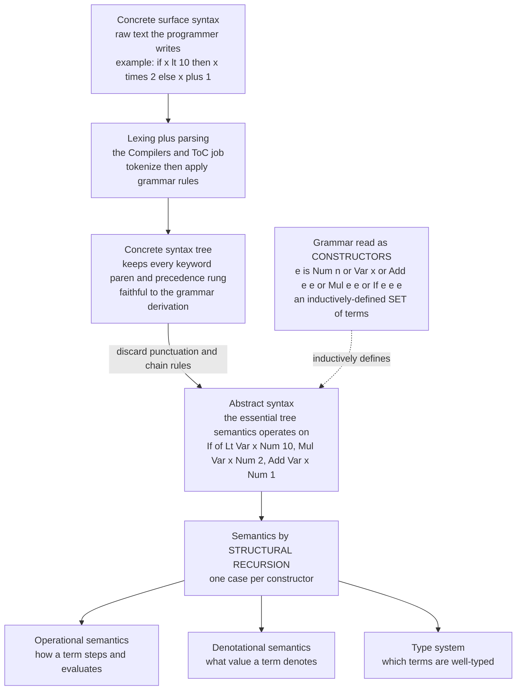

# 🧱 Formal Syntax and Grammars

> [!abstract] TL;DR
> Before you can say what a program *means*, you must pin down what a program *is*. **Formal syntax** is that foundation: it defines the set of well-formed programs precisely enough that meaning can be assigned by recursion on their structure. The compilers/ToC world obsesses over the *concrete* syntax — every parenthesis, keyword, and precedence rung needed to parse text — but Programming Language Theory (PLT) keeps only the **abstract syntax**: the essential tree, read as an **inductively-defined set of terms**. That inductive reading is the whole game — it is what licenses *structural recursion* to define semantics and *structural induction* to prove things about it.

---

## Intuition

**Analogy:** Imagine a chess arbiter and a chess *notation*. Before two players can argue about who is *winning* (the meaning), they must first agree on what counts as a *legal position and a legal move* (the form). "Bishop to e5" is a well-formed instruction; "bishop to teapot" is gibberish the rulebook rejects outright. But notice something deeper: the arbiter does not care whether you wrote the move in English descriptive notation ("B-K5"), algebraic notation ("Be5"), or drew an arrow on the board. Those are three *concrete* surface forms for the **same underlying move** — the same *abstract* fact about which piece goes where. The strategy books, the engines, the endgame theorems all reason about the abstract move, never the ink.

Formal syntax is exactly this split. The grammar's job is to separate legal programs from noise, the way the rulebook separates legal moves from nonsense. But PLT cares less about the surface punctuation than about the **essential tree structure underneath** — the abstract syntax that semantics actually operates on. `2 * 3 + 4`, `(+ (* 2 3) 4)`, and a graphical block diagram can all denote the *one* tree `Add(Mul(2, 3), 4)`. Semantics is defined once, over that tree.

---

## How It Works

### Syntax versus semantics — and why PLT insists on the split

- **Syntax** is *form*: which sequences of symbols (or, better, which trees) count as well-formed programs.
- **Semantics** is *meaning*: what a well-formed program computes, denotes, or does.

PLT rigorously separates the two so that meaning can be defined **compositionally** — the meaning of a compound term is a function of the meanings of its parts. This is not pedantry; it is the mechanism that makes semantics tractable. If a program is a tree built from a fixed set of constructors, then an evaluation relation, a denotation function, or a typing judgment can be defined by giving **one rule per constructor** and recursing on subterms. (The *Operational_Semantics* and *Denotational_Semantics* companion notes are exactly two such definitions over the same abstract syntax; the *Type_Systems_Fundamentals* note gives a third.)

### Context-free grammars and BNF — the recognizer

The surface language is described by a **context-free grammar (CFG)**, usually written in **Backus–Naur Form (BNF)**. A grammar lists *production rules* that expand nonterminals into strings of terminals and nonterminals, e.g.

```
expr  ::=  expr "+" term  |  term
term  ::=  term "*" atom  |  atom
atom  ::=  NUMBER  |  IDENT  |  "(" expr ")"
```

This is where CFGs sit on the Chomsky hierarchy and where parsing algorithms live (see [[Context_Free_Grammars_and_Languages]] and [[Parsing_and_Derivations]] in Theory of Computation, and [[Context_Free_Grammars_for_Parsing]] in Compilers). **PLT uses the *result* of parsing rather than dwelling on parsing algorithms.** The grammar above is engineered with a `expr → term → atom` chain purely to encode operator precedence for a left-to-right parser — a concern of the recognizer, not of meaning.

### Concrete versus abstract syntax

- **Concrete syntax** includes *everything a parser needs*: keywords, parentheses, semicolons, and the precedence-encoding nonterminal chains. It is faithful to the text.
- **Abstract syntax** keeps *only the essential structure* — the AST — that semantics reads. Precedence is no longer spelled out with parentheses; it is baked into the *shape* of the tree. Redundant chain nonterminals vanish.

Crucially, **many concrete syntaxes can share one abstract syntax.** Infix `2*3+4`, Lisp-style prefix `(+ (* 2 3) 4)`, and a visual node editor all map to `Add(Mul(Num 2, Num 3), Num 4)`. PLT works almost entirely with abstract syntax; the AST is the **interface** between the Compilers view and the PLT view (see [[Abstract_Syntax_Trees_and_Parser_Design]]).

### The crucial move: abstract syntax as an *inductive definition*

Read a BNF grammar not as "rules for generating strings" but as a list of **constructors** for a set of trees:

```
e  ::=  Num n  |  Var x  |  Add e e  |  Mul e e  |  Lt e e  |  If e e e
```

This defines `Expr` as the **smallest set** closed under those constructors — an *inductively-defined set*. Two payoffs follow immediately, and they are the workhorses of all PLT:

1. **Structural recursion.** To define a function on `Expr`, give one clause per constructor, recursing on subterms. Termination is guaranteed because subterms are structurally smaller. Evaluation, type checking, pretty-printing, and free-variable computation are all structural recursions.
2. **Structural induction.** To prove a property `P` holds for every term, prove it for the base constructors and prove it is preserved by each compound constructor (assuming it for subterms). This is *the* proof technique behind type safety, determinism of evaluation, and compiler-correctness theorems.

### Judgments and inference rules — the standard PLT notation

Relations over abstract syntax (typing, evaluation) are defined **inductively** by **inference rules**: premises above a line, a conclusion below.

```
                          e1 ⇓ v1      e2 ⇓ v2
  ─────────  [E-Num]     ───────────────────────  [E-Add]
  Num n ⇓ n                  Add e1 e2 ⇓ v1 + v2
```

Read a rule as "*if* the premises hold, *then* the conclusion holds." The relation `⇓` is the smallest one closed under all the rules — an inductive definition again — which gives a **rule-induction** principle for proofs. Because every rule is keyed to a top-level constructor, the definition is **syntax-directed**: the shape of the term tells you which rule applies. This same notation defines typing (`Γ ⊢ e : τ`) in the *Type_Systems_Fundamentals* companion note.

### Binding, alpha-equivalence, and well-formedness beyond context-free

Variables, binders, and scope are *syntactic* but carry semantic weight. Two terms that differ only in the name of a bound variable — `λx. x` and `λy. y` — are **alpha-equivalent** and should be *identical* abstract syntax. Richer PLT frameworks bake this in with **abstract binding trees**, **higher-order abstract syntax (HOAS)**, or **nominal syntax**, so alpha-equivalence is definitional rather than an afterthought (the *Names_Binding_and_Scope* companion note develops this).

Note also that a CFG is **context-free**, but real well-formedness is often **context-sensitive**: "every variable must be declared before use," "this call has the right number of arguments," "this expression type-checks." These constraints are *not* handled by the grammar; they are enforced by later phases — semantic analysis and typing judgments (see [[Semantic_Analysis_and_Symbol_Tables]]). The grammar catches *gibberish*; the judgments catch *nonsense that happens to parse*.

### Metalanguage versus object language

The **object language** is the language being defined (our little `Expr`). The **metalanguage** is the mathematical language *in which* we do the defining — set theory, inference rules, or a proof assistant. Confusing the two is a classic beginner error: the `+` inside `Add e1 e2` is object-language syntax (a tree constructor), while the `+` in the premise `v1 + v2` of rule `E-Add` is metalanguage arithmetic on actual numbers. Keeping the layers straight is what lets you define one language inside another without circularity.



---

## Key Concepts

### Secondary (intuitive)
- A program is not really *text* — it is a **tree**. The text is just one way of writing the tree down.
- **Syntax** is the rulebook for "is this a well-formed program?"; **semantics** is "what does it do?" You must fix the first before the second makes sense.
- Different-looking source code can mean the same thing: `2*3+4` and `(+ (* 2 3) 4)` are the same tree.

### Undergraduate (mechanistic)
- **CFG / BNF** define concrete syntax with production rules; parsing recovers structure from flat text.
- **Concrete syntax** carries parsing detail (parens, precedence chains); **abstract syntax (AST)** keeps only meaning-bearing structure. Precedence becomes tree *shape*.
- An AST is an **inductively-defined datatype** (an algebraic data type / tagged union). Constructors: `Num`, `Var`, `Add`, `If`, ....
- **Structural recursion** defines functions over the AST (evaluate, size, pretty-print); each recursive call is on a strictly smaller subtree, so it always terminates.
- Context-free grammars cannot express **context-sensitive** rules (declared-before-use, type correctness); those are separate later phases.

### Graduate (foundational)
- Abstract syntax is the **initial algebra** of the signature given by the constructors; a semantics is (often) the **unique homomorphism** out of it — the categorical statement of "meaning is compositional."
- **Structural induction / rule induction** are the induction principles that come *for free* with an inductively-defined set/relation, and they are the backbone of type-safety and adequacy proofs.
- **Judgments** (`e ⇓ v`, `Γ ⊢ e : τ`) are inductively-defined relations presented by **syntax-directed inference rules**; the least fixed point of the rule functional gives the derivability relation.
- **Abstract binding trees / HOAS / nominal sets** internalize alpha-equivalence, making binding and scope part of the syntactic apparatus rather than a side condition; this is where syntax and semantics genuinely blur.
- **Metalanguage vs object language**: the definitional layer must be kept distinct from the defined language to avoid circularity — a distinction made brutally concrete when the metalanguage is a proof assistant (Coq, Agda, Lean) and the object language is formalized inside it.

---

## Python Demo

This demo builds the PLT picture end to end: define the **abstract syntax** of a tiny expression language as an inductive datatype, write **two different concrete-syntax parsers** (infix and Lisp-style prefix) that produce the **same AST**, define **structural-recursion** functions over that AST (an evaluator, a size counter, a pretty-printer), and **visualize the AST as a tree** with matplotlib.

```python
"""Formal syntax & grammars: one abstract syntax, many concrete syntaxes.

Run: python formal_syntax_demo.py  (needs matplotlib; pure stdlib otherwise)
"""
from __future__ import annotations
from dataclasses import dataclass
import re
import matplotlib.pyplot as plt

# ---------------------------------------------------------------------------
# 1. ABSTRACT SYNTAX as an inductively-defined datatype.
#    Read the grammar as CONSTRUCTORS of the set Expr:
#        e ::= Num n | Var x | Add e e | Mul e e | Lt e e | If e e e
#    Each frozen dataclass is one constructor. `Expr` is the smallest set
#    closed under them -- an inductive definition.
# ---------------------------------------------------------------------------
@dataclass(frozen=True)
class Num:
    n: int

@dataclass(frozen=True)
class Var:
    x: str

@dataclass(frozen=True)
class Add:
    l: "Expr"
    r: "Expr"

@dataclass(frozen=True)
class Mul:
    l: "Expr"
    r: "Expr"

@dataclass(frozen=True)
class Lt:
    l: "Expr"
    r: "Expr"

@dataclass(frozen=True)
class If:
    c: "Expr"
    t: "Expr"
    e: "Expr"

Expr = (Num, Var, Add, Mul, Lt, If)  # the constructors of the inductive set

def children(e):
    """The immediate subterms -- drives every structural recursion below."""
    if isinstance(e, (Num, Var)):
        return []
    if isinstance(e, (Add, Mul, Lt)):
        return [e.l, e.r]
    if isinstance(e, If):
        return [e.c, e.t, e.e]
    raise TypeError(f"not an Expr: {e!r}")

def label_of(e):
    if isinstance(e, Num):
        return f"Num {e.n}"
    if isinstance(e, Var):
        return f"Var {e.x}"
    return type(e).__name__

# ---------------------------------------------------------------------------
# 2a. CONCRETE SYNTAX A: infix, with precedence and if/then/else keywords.
#     Recursive-descent parser -> AST. Grammar (precedence low to high):
#        expr := add ('<' add)?
#        add  := mul ('+' mul)*
#        mul  := atom ('*' atom)*
#        atom := NUM | IDENT | '(' expr ')' | 'if' expr 'then' expr 'else' expr
# ---------------------------------------------------------------------------
def _lex(s):
    return re.findall(r"[A-Za-z_]\w*|\d+|[+*<()]", s)

class InfixParser:
    def __init__(self, text):
        self.toks = _lex(text)
        self.i = 0

    def _peek(self):
        return self.toks[self.i] if self.i < len(self.toks) else None

    def _next(self):
        tok = self.toks[self.i]
        self.i += 1
        return tok

    def _expect(self, tok):
        got = self._next()
        assert got == tok, f"expected {tok!r}, got {got!r}"

    def parse(self):
        e = self._expr()
        assert self.i == len(self.toks), "unexpected trailing tokens"
        return e

    def _expr(self):                      # comparison: lowest precedence
        left = self._add()
        if self._peek() == "<":
            self._next()
            return Lt(left, self._add())
        return left

    def _add(self):
        node = self._mul()
        while self._peek() == "+":
            self._next()
            node = Add(node, self._mul())
        return node

    def _mul(self):
        node = self._atom()
        while self._peek() == "*":
            self._next()
            node = Mul(node, self._atom())
        return node

    def _atom(self):
        tok = self._peek()
        if tok == "if":
            self._next()
            cond = self._expr()
            self._expect("then")
            then_b = self._expr()
            self._expect("else")
            else_b = self._expr()
            return If(cond, then_b, else_b)
        if tok == "(":
            self._next()
            inner = self._expr()
            self._expect(")")
            return inner
        self._next()
        if tok.isdigit():
            return Num(int(tok))
        return Var(tok)

def parse_infix(text):
    return InfixParser(text).parse()

# ---------------------------------------------------------------------------
# 2b. CONCRETE SYNTAX B: Lisp-style prefix S-expressions -> the SAME AST.
#        (if (< x 10) (* x 2) (+ x 1))
# ---------------------------------------------------------------------------
def parse_prefix(text):
    toks = _lex(text)
    pos = [0]

    def parse():
        tok = toks[pos[0]]
        if tok == "(":
            pos[0] += 1
            op = toks[pos[0]]
            pos[0] += 1
            args = []
            while toks[pos[0]] != ")":
                args.append(parse())
            pos[0] += 1  # consume ')'
            builders = {"+": Add, "*": Mul, "<": Lt}
            if op in builders:
                return builders[op](args[0], args[1])
            if op == "if":
                return If(args[0], args[1], args[2])
            raise ValueError(f"unknown operator {op!r}")
        pos[0] += 1
        return Num(int(tok)) if tok.isdigit() else Var(tok)

    return parse()

# ---------------------------------------------------------------------------
# 3. SEMANTICS AND METRICS BY STRUCTURAL RECURSION.
#    One clause per constructor; recurse on subterms. Termination is free
#    because subterms are structurally smaller.
# ---------------------------------------------------------------------------
def size(e):                              # number of nodes
    return 1 + sum(size(c) for c in children(e))

def height(e):
    kids = children(e)
    return 1 + (max(height(c) for c in kids) if kids else 0)

def pretty(e):                            # AST -> a canonical concrete syntax
    if isinstance(e, Num):
        return str(e.n)
    if isinstance(e, Var):
        return e.x
    if isinstance(e, Add):
        return f"({pretty(e.l)} + {pretty(e.r)})"
    if isinstance(e, Mul):
        return f"({pretty(e.l)} * {pretty(e.r)})"
    if isinstance(e, Lt):
        return f"({pretty(e.l)} < {pretty(e.r)})"
    return f"if {pretty(e.c)} then {pretty(e.t)} else {pretty(e.e)}"

def evaluate(e, env):                     # a tiny big-step semantics
    if isinstance(e, Num):
        return e.n
    if isinstance(e, Var):
        return env[e.x]
    if isinstance(e, Add):
        return evaluate(e.l, env) + evaluate(e.r, env)
    if isinstance(e, Mul):
        return evaluate(e.l, env) * evaluate(e.r, env)
    if isinstance(e, Lt):
        return 1 if evaluate(e.l, env) < evaluate(e.r, env) else 0
    return evaluate(e.t, env) if evaluate(e.c, env) else evaluate(e.e, env)

# ---------------------------------------------------------------------------
# 4. VISUALIZE the AST as a tree (matplotlib). Layout by a leaf counter for x
#    and depth for y -- itself a structural recursion.
# ---------------------------------------------------------------------------
def _layout(e):
    nodes, edges, state = {}, [], {"id": 0, "leaf": 0.0}

    def go(node, depth):
        my_id = state["id"]
        state["id"] += 1
        kids = children(node)
        if not kids:
            x = state["leaf"]
            state["leaf"] += 1.0
        else:
            xs = []
            for c in kids:
                cid = go(c, depth + 1)
                edges.append((my_id, cid))
                xs.append(nodes[cid][0])
            x = sum(xs) / len(xs)
        nodes[my_id] = (x, -float(depth), label_of(node))
        return my_id

    go(e, 0)
    return nodes, edges

def draw_ast(e, title, ax):
    nodes, edges = _layout(e)
    for pid, cid in edges:
        x0, y0, _ = nodes[pid]
        x1, y1, _ = nodes[cid]
        ax.plot([x0, x1], [y0, y1], color="#8899aa", zorder=1)
    for _, (x, y, lab) in nodes.items():
        ax.scatter([x], [y], s=1500, color="#cfe8ff",
                   edgecolors="#2b6cb0", linewidths=1.5, zorder=2)
        ax.text(x, y, lab, ha="center", va="center", fontsize=9, zorder=3)
    ax.set_title(title, fontsize=10)
    ax.axis("off")

if __name__ == "__main__":
    src_infix  = "if x < 10 then x * 2 else x + 1"
    src_prefix = "(if (< x 10) (* x 2) (+ x 1))"

    ast_a = parse_infix(src_infix)
    ast_b = parse_prefix(src_prefix)

    # The PLT punchline: two concrete syntaxes, ONE abstract syntax.
    assert ast_a == ast_b, "different surface text, same AST expected"
    print("infix  :", src_infix)
    print("prefix :", src_prefix)
    print("same AST? ->", ast_a == ast_b)
    print("AST     :", ast_a)
    print("size    :", size(ast_a), " height:", height(ast_a))
    print("pretty  :", pretty(ast_a))
    print("eval @ x=3 ->", evaluate(ast_a, {"x": 3}))   # 3 < 10, so 3*2 = 6
    print("eval @ x=20 ->", evaluate(ast_a, {"x": 20}))  # else branch: 20+1 = 21

    fig, (ax1, ax2) = plt.subplots(1, 2, figsize=(11, 4.5))
    draw_ast(ast_a, "concrete A (infix): " + src_infix, ax1)
    draw_ast(ast_b, "concrete B (prefix): " + src_prefix, ax2)
    fig.suptitle("One abstract syntax, two concrete syntaxes", fontsize=12)
    plt.tight_layout()
    plt.show()
```

Running it prints `same AST? -> True` and draws two visually identical trees under different surface strings — the concrete/abstract distinction made tangible. The evaluator, `size`, `height`, and `pretty` are four different structural recursions over the *one* inductive definition; that reuse is exactly why PLT works with abstract syntax.

---

## Real-World Applications

- **Language specifications.** The Standard ML *Definition*, the Scheme and WebAssembly specs, and the Rust reference all present syntax as BNF plus **inference-rule** judgments for typing and evaluation — the abstract-syntax-plus-judgments pattern from this note, applied at industrial scale.
- **Proof assistants and verified compilers.** CompCert (a formally verified C compiler) and CakeML define their object languages' abstract syntax as inductive datatypes inside Coq/HOL and prove semantic preservation by structural/rule induction. The AST is literally the object of the theorem.
- **Parser generators as the bridge.** ANTLR, Yacc/Bison, tree-sitter, and hand-written recursive-descent parsers all exist to turn text into the AST that the PLT-style backend then reasons over. The AST is the contract between the [[Abstract_Syntax_Trees_and_Parser_Design|Compilers frontend]] and the semantics.
- **Multiple concrete syntaxes, one core.** Elixir and Clojure surface syntaxes both lower to Lisp-like ASTs; TypeScript, JSX, and `.d.ts` files share a core AST; a spreadsheet formula bar and a visual node editor can target the same expression IR. Define the semantics once on the core, get every surface for free.
- **Macros and metaprogramming.** Lisp/Scheme macros, Rust `macro_rules!`, and Template Haskell operate directly on abstract syntax (with hygiene = automatic alpha-renaming), which only makes sense once syntax is a first-class inductive datatype.

---

## Common Pitfalls

- **Confusing the parse tree with the AST.** Beginners carry precedence nonterminals (`E`, `T`, `F`) and parentheses into their AST. Those are *concrete-syntax scaffolding*; the AST should record precedence as *tree shape* and drop the punctuation.
- **Letting ambiguity leak into meaning.** An ambiguous grammar (the dangling-`else`, `a - b - c`) yields two parse trees, hence two ASTs, hence two meanings. Resolve ambiguity in the *grammar/parser* (precedence, associativity) so the AST semantics receives is unique. Getting syntax right is a *prerequisite* for well-defined semantics.
- **Treating context-sensitive rules as grammar's job.** "Variable declared before use," "arity matches," "expression type-checks" are **not** context-free. Trying to force them into the CFG bloats it or fails; they belong to later judgments (see [[Semantic_Analysis_and_Symbol_Tables]]).
- **Ignoring binding / alpha-equivalence.** Representing `λx. x` and `λy. y` as *distinct* trees, or doing naive substitution, causes **variable capture** bugs. Use abstract binding trees, de Bruijn indices, or a nominal/HOAS representation so alpha-equivalent terms are identified.
- **Mixing object language and metalanguage.** Writing the object-language `Add` as if it were metalanguage `+`, or defining a language's semantics in terms of itself, produces circularity. Keep "the language being defined" and "the math doing the defining" in separate layers.
- **Skipping structural induction in proofs.** Arguing about "all programs" by example rather than by induction on the constructors misses cases (typically the binding or the compound cases) — exactly where soundness bugs hide.

---

## Related Concepts

- [[Context_Free_Grammars_and_Languages]] — the formal-language machinery (CFG, BNF, derivations) that *defines* concrete syntax; PLT consumes its output.
- [[Parsing_and_Derivations]] — how a string is shown to belong to a grammar; the step that reconstructs structure PLT then abstracts.
- [[Context_Free_Grammars_for_Parsing]] — the Compilers-side treatment of grammars engineered for parsers (precedence, ambiguity elimination), the concrete-syntax counterpart to this note.
- [[Abstract_Syntax_Trees_and_Parser_Design]] — the AST as the compiler's central data structure; the very interface object PLT reasons over.
- [[Semantic_Analysis_and_Symbol_Tables]] — where *context-sensitive* well-formedness (scope, declared-before-use) is enforced, beyond the grammar's reach.
- [[Recursive_Functions_and_Lambda_Calculus]] — the lambda calculus, the canonical tiny language whose abstract syntax with binding motivates alpha-equivalence and structural recursion.

**Forthcoming PLT companion notes** (same `Programming_Language_Theory/` vault, to be wikilinked once created): *Programming_Language_Theory_Overview* (the umbrella), *Operational_Semantics* and *Denotational_Semantics* (two semantics defined by recursion over the abstract syntax here), *Type_Systems_Fundamentals* (typing judgments as inductive relations over the same syntax), and *Names_Binding_and_Scope* (abstract binding trees and alpha-equivalence).

---

## Review Questions

1. **(Conceptual)** Explain why PLT prefers abstract syntax over concrete syntax. What information is deliberately thrown away going from a parse tree to an AST, and why does discarding it *not* lose meaning?
2. **(Undergraduate / scenario)** You are given the grammar `e ::= Num n | Add e e | Mul e e`. Write, in words or code, a structural-recursion function that counts multiplications in a term, and state precisely why it is guaranteed to terminate.
3. **(Graduate / trade-off)** Reading the grammar `e ::= Num n | Add e e | Mul e e | If e e e` as an inductive definition gives you both structural recursion and structural induction. State the induction principle it yields, and use it to argue that the evaluator in the demo is *total* (returns a value on every closed term). Where would this argument break if the language added unrestricted recursion (`letrec`)?

---

## Sources

- Robert Harper, *Practical Foundations for Programming Languages* (2nd ed.), Cambridge University Press, 2016 — chapters on abstract syntax, inductive definitions, and abstract binding trees. [Author's page](https://www.cs.cmu.edu/~rwh/pfpl.html)
- Benjamin C. Pierce, *Types and Programming Languages*, MIT Press, 2002 — inductive definitions of terms, structural induction, and syntax-directed inference rules. [Book page](https://www.cis.upenn.edu/~bcpierce/tapl/)
- Benjamin C. Pierce et al., *Software Foundations* (Volumes 1–2) — a hands-on, machine-checked development of inductive syntax, structural induction, and judgments in Coq. [softwarefoundations.cis.upenn.edu](https://softwarefoundations.cis.upenn.edu/)
- Glynn Winskel, *The Formal Semantics of Programming Languages: An Introduction*, MIT Press, 1993 — abstract syntax, rule induction, and the object/metalanguage distinction. [MIT Press](https://mitpress.mit.edu/9780262731034/the-formal-semantics-of-programming-languages/)
- Peter Naur (ed.), *Revised Report on the Algorithmic Language ALGOL 60*, 1963 — the origin of BNF as a notation for concrete syntax. [Report text](https://www.masswerk.at/algol60/report.htm)

---

#programming-language-theory #formal-syntax #abstract-syntax #grammars #inductive-definition
