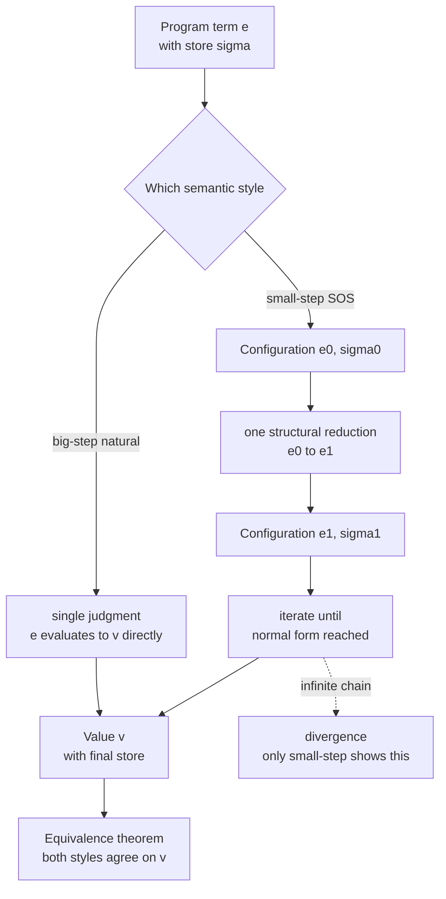

# ⚙️ Operational Semantics

> [!abstract] TL;DR
> **Operational semantics** defines what a program *means* by specifying, in exact mathematics, **how it runs** — a set of **inference rules** describing the execution steps of an *abstract machine* over program **configurations** (roughly, `term + state`), with no real hardware in sight. It is the most widely used semantic style because it doubles as a **reference definition** that compiler writers, language designers, and interpreter authors can all agree on. Two flavours dominate: **small-step (structural) semantics** (Plotkin) defines a single-step reduction relation `e → e'` and iterates it to a value, exposing every intermediate state; **big-step (natural) semantics** (Kahn) defines an evaluation relation `e ⇓ v` that jumps straight to the final result. Small-step is finer-grained — ideal for concurrency, divergence, and **type-soundness proofs via progress + preservation**; big-step is more abstract and reads like a recursive interpreter. Proving the two *equivalent* is a standard exercise, and real specifications — Standard ML's *Definition*, WebAssembly, parts of Java/JS — are written this way.

---

## Intuition

**Analogy — the rulebook for a board game, not the finished score.** Suppose you want to explain *what a chess position "means."* You could hand someone a philosophy of chess (abstract), or a book of winning maxims (advisory) — but the most direct, unambiguous answer is a **rulebook of moves**: "in *this* position, *this* piece may move *there*, producing *that* new position." The meaning of a game *is* the set of legal step-by-step transitions from state to state until someone wins. You never need a real board or real players — the rules alone determine every possible play precisely.

Operational semantics is exactly that rulebook for a *program*. A program's meaning is **meaning-as-execution**: a collection of **inference rules** that say, given the current machine state, which single step is legal and what state it produces. Run the rules in your head (or on paper) and you have *computed the program's meaning* — no CPU required. The "board position" is a **configuration** (the term still to run, plus the store of variable values); the "legal move" is a **reduction step**; the "final position" is a **value**. It is one of the three pillars of [[Programming_Language_Theory_Overview|programming-language theory]]'s account of meaning, and the one implementers reach for first.

---

## How It Works

### Core mechanics: configurations, rules, and reduction

Everything rests on three pieces:

1. **Configurations.** A configuration is the complete machine state at a moment: for a pure expression language it is just the term `e`; for an imperative language it is a pair `⟨e, σ⟩` where `σ` (the **store** / heap) maps locations or variable names to values. Side effects, assignment, and references are modeled entirely by how `σ` changes — the "memory" is a mathematical map, not silicon. Variable binding and scope are handled by **environments**, the subject of [[Names_Binding_and_Scope]].
2. **A transition relation, defined by inference rules.** Each rule is written as premises over a line with a conclusion below, **syntax-directed** on the shape of the term — so the rules follow the grammar defined in [[Formal_Syntax_and_Grammars]]. Example small-step rules for addition (with `n₁, n₂` already numerals):

   ```
        e₁ → e₁'                    e₂ → e₂'
   ──────────────────        ─────────────────────         ───────────────────────
   e₁ + e₂ → e₁' + e₂        n₁ + e₂ → n₁ + e₂'            n₁ + n₂ → (n₁ plus n₂)
   ```

   The first two are **structural (congruence) rules**: they say *where* the next step may happen (reduce the left operand first, then the right). The third is the actual **computation rule**. Feeding a term to these rules deterministically picks the next move.
3. **Iteration to a normal form.** Apply the relation repeatedly: `(1+2)*3 → 3*3 → 9`. When no rule applies, you have a **normal form**; a *good* normal form is a **value**, a *bad* one is a **stuck** term like `true + 1` (a nonsense the type system should have ruled out).

### Small-step (structural) vs big-step (natural)

- **Small-step / Structural Operational Semantics (SOS)** — Gordon Plotkin's 1981 approach. Define `e → e'`: **one** reduction. The *meaning* of a program is the whole reduction sequence `e → e₁ → e₂ → … → v`. Because every intermediate configuration is explicit, SOS captures **interleaving** (interleave steps of two threads), **non-termination** (an infinite `→` chain), and is the natural setting for **type-soundness** proofs. **Evaluation contexts** (Felleisen) are a slick way to package the structural rules: a context `E[·]` marks the single hole where the next reduction is allowed, so one rule `E[r] → E[r']` replaces a pile of congruence rules — and *which* hole `E` selects is exactly the choice studied in [[Reduction_Strategies_and_Evaluation_Order]].
- **Big-step / Natural semantics** — Gilles Kahn's 1987 approach. Define `⟨e, σ⟩ ⇓ ⟨v, σ'⟩`: the program relates *directly* to its **final** result in a single judgment, its derivation tree mirroring the recursive structure of the term. It is simpler for **terminating, deterministic** languages and reads almost verbatim as a recursive interpreter — but it **hides intermediate states**, and a *non-terminating* program simply has *no* derivation, so divergence and concurrency are awkward to express.

### The two compared

Small-step is *finer-grained*: it is the tool of choice for **concurrency** (labeled-transition systems and process calculi are small-step), for reasoning about **divergence**, and for the Wright–Felleisen **type-soundness** recipe — *progress* ("a well-typed term is a value or can step") plus *preservation* ("stepping keeps the type"), which together prove *well-typed terms don't get stuck*. Big-step is *more abstract* and matches a straightforward tree-walking interpreter. For a deterministic terminating language the two define the **same** value function, and proving `⟨e,σ⟩ ⇓ v  ⟺  ⟨e,σ⟩ →* v` is a classic **rule-induction** exercise.



### From semantics to machines and proofs

- **Abstract machines** refine operational semantics toward a real implementation by making *control* and *environment* explicit: the **CEK** machine (Control, Environment, Kontinuation), the **SECD** machine (Landin), and the **Krivine** machine (call-by-name) each turn `→` into concrete register-shuffling rules — the bridge from paper semantics to an actual interpreter or bytecode VM. The archetypal reduction relation, β-reduction of [[The_Lambda_Calculus]], is the seed all of these grow from.
- **Proving properties** is done by **rule induction** over the inference rules: **determinism** ("at most one step / one value"), **type soundness** (progress + preservation), and — for a compiler — **semantic preservation** ("target behaviour refines source behaviour"), the central theorem of a verified compiler.

---

## Key Concepts

### Secondary (intuition level)
- A program's meaning can be given as **step-by-step rules for an imaginary machine** — like a board-game rulebook. No physical computer is needed to know what it does.
- **Small-step** = "show every move." **Big-step** = "just tell me the final answer."
- The machine's state is the **code left to run plus the values of the variables** (the *store*).

### Undergraduate (CS background)
- A **configuration** is `⟨e, σ⟩`; a **transition relation** `→` is defined by **syntax-directed inference rules** (structural/congruence rules say *where* to reduce, computation rules do the work).
- **Small-step (SOS):** `e → e'`; iterate `→*` to a **value** or get **stuck**. **Big-step (natural):** `⟨e,σ⟩ ⇓ v`, a single evaluation judgment whose derivation tree recurses on the term.
- Mutable state, assignment, and references are just updates to the **store**; **environments** handle variable binding and scope.
- **Type soundness** is stated operationally as **progress** + **preservation** — well-typed terms never get stuck.

### Graduate (systems / metatheory level)
- **Evaluation contexts** `E[·]` factor the congruence rules into a single reduction schema; **reduction strategies** (call-by-value, call-by-name, call-by-need) are choices of which redex `E` selects.
- **Abstract machines** (CEK, SECD, Krivine) are operational semantics with reified continuations and environments; Danvy's *functional correspondence* mechanically derives them from a big-step interpreter.
- **Labeled transition systems** `e --α--> e'` generalize `→` with observable actions, the basis of **process calculi** (CCS, CSP, π-calculus) and **bisimulation** as behavioural equivalence.
- Real specs use this style: the **Definition of Standard ML**, **WebAssembly**, and fragments of Java/JavaScript ship an executable operational semantics; **CompCert** and **CakeML** prove a *semantic-preservation* theorem relating source and target operational semantics.

---

## Python Demo

This gives a tiny imperative language (IMP-style) **both** a small-step and a big-step operational semantics, prints the small-step **reduction trace**, checks the two semantics **agree**, and visualizes the store evolving and an expression shrinking to a value.

```python
"""
Operational semantics for a tiny imperative language (IMP-style).

  - SMALL-STEP (Structural Operational Semantics, Plotkin): step() = ONE reduction.
  - BIG-STEP  (Natural semantics, Kahn): big_eval() computes the final result directly.

We run BOTH on the same programs, print the small-step reduction TRACE,
VERIFY the two semantics agree, and visualize the reduction / store evolution.
Pure standard library + matplotlib.
"""
from __future__ import annotations
from dataclasses import dataclass
from typing import Optional
import matplotlib.pyplot as plt

# ---------- Abstract syntax: the AST the semantics is defined over ----------

# Arithmetic expressions
@dataclass(frozen=True)
class Num:
    n: int
@dataclass(frozen=True)
class Var:
    name: str
@dataclass(frozen=True)
class Add:
    l: object
    r: object
@dataclass(frozen=True)
class Mul:
    l: object
    r: object
@dataclass(frozen=True)
class Sub:
    l: object
    r: object

# Boolean expressions
@dataclass(frozen=True)
class Bool:
    b: bool
@dataclass(frozen=True)
class Leq:
    l: object
    r: object
@dataclass(frozen=True)
class Not:
    e: object
@dataclass(frozen=True)
class And:
    l: object
    r: object

# Commands
@dataclass(frozen=True)
class Skip:
    pass
@dataclass(frozen=True)
class Assign:
    name: str
    expr: object
@dataclass(frozen=True)
class Seq:
    c1: object
    c2: object
@dataclass(frozen=True)
class If:
    cond: object
    then: object
    els: object
@dataclass(frozen=True)
class While:
    cond: object
    body: object

# ========================= SMALL-STEP SEMANTICS =========================
# Structural rules: reduce the LEFTMOST reducible sub-term, one step at a time.

def is_num(a) -> bool:
    return isinstance(a, Num)

def step_arith(a, store) -> Optional[object]:
    """One small step of an arithmetic expression; None if it is already a value."""
    if isinstance(a, Num):
        return None                                     # a value: no step
    if isinstance(a, Var):
        return Num(store[a.name])                       # <x, sigma> -> sigma(x)
    if isinstance(a, (Add, Mul, Sub)):
        if not is_num(a.l):
            return type(a)(step_arith(a.l, store), a.r)  # structural: reduce left first
        if not is_num(a.r):
            return type(a)(a.l, step_arith(a.r, store))  # then reduce right
        x, y = a.l.n, a.r.n                              # both are numerals: compute
        if isinstance(a, Add): return Num(x + y)
        if isinstance(a, Mul): return Num(x * y)
        return Num(x - y)
    raise TypeError(a)

def is_bool(b) -> bool:
    return isinstance(b, Bool)

def step_bool(b, store) -> Optional[object]:
    if isinstance(b, Bool):
        return None
    if isinstance(b, Leq):
        if not is_num(b.l): return Leq(step_arith(b.l, store), b.r)
        if not is_num(b.r): return Leq(b.l, step_arith(b.r, store))
        return Bool(b.l.n <= b.r.n)
    if isinstance(b, Not):
        if not is_bool(b.e): return Not(step_bool(b.e, store))
        return Bool(not b.e.b)
    if isinstance(b, And):
        if not is_bool(b.l): return And(step_bool(b.l, store), b.r)
        return Bool(False) if not b.l.b else b.r         # short-circuit
    raise TypeError(b)

def step(cmd, store):
    """One structural reduction of a COMMAND configuration <cmd, store>.
       Returns the next configuration (cmd', store') or None when cmd is Skip (terminal)."""
    if isinstance(cmd, Skip):
        return None                                      # terminal configuration
    if isinstance(cmd, Assign):
        if not is_num(cmd.expr):
            return (Assign(cmd.name, step_arith(cmd.expr, store)), store)   # reduce RHS
        new_store = dict(store)
        new_store[cmd.name] = cmd.expr.n
        return (Skip(), new_store)                        # <x:=n, s> -> <skip, s[x:=n]>
    if isinstance(cmd, Seq):
        if isinstance(cmd.c1, Skip):
            return (cmd.c2, store)                        # skip ; c2  ->  c2
        c1p, store_p = step(cmd.c1, store)               # otherwise advance c1
        return (Seq(c1p, cmd.c2), store_p)
    if isinstance(cmd, If):
        if not is_bool(cmd.cond):
            return (If(step_bool(cmd.cond, store), cmd.then, cmd.els), store)
        return (cmd.then if cmd.cond.b else cmd.els, store)
    if isinstance(cmd, While):
        # unrolling rule: while b do c  ->  if b then (c ; while b do c) else skip
        return (If(cmd.cond, Seq(cmd.body, cmd), Skip()), store)
    raise TypeError(cmd)

# ========================= BIG-STEP SEMANTICS ===========================
# Natural semantics: relate a term DIRECTLY to its final value / store.

def eval_arith(a, store) -> int:
    if isinstance(a, Num): return a.n
    if isinstance(a, Var): return store[a.name]
    if isinstance(a, Add): return eval_arith(a.l, store) + eval_arith(a.r, store)
    if isinstance(a, Mul): return eval_arith(a.l, store) * eval_arith(a.r, store)
    if isinstance(a, Sub): return eval_arith(a.l, store) - eval_arith(a.r, store)
    raise TypeError(a)

def eval_bool(b, store) -> bool:
    if isinstance(b, Bool): return b.b
    if isinstance(b, Leq):  return eval_arith(b.l, store) <= eval_arith(b.r, store)
    if isinstance(b, Not):  return not eval_bool(b.e, store)
    if isinstance(b, And):  return eval_bool(b.l, store) and eval_bool(b.r, store)
    raise TypeError(b)

def big_eval(cmd, store):
    """Big-step:  <cmd, store> down-arrow store'.  Returns the final store."""
    if isinstance(cmd, Skip):
        return dict(store)
    if isinstance(cmd, Assign):
        s = dict(store); s[cmd.name] = eval_arith(cmd.expr, store); return s
    if isinstance(cmd, Seq):
        return big_eval(cmd.c2, big_eval(cmd.c1, store))
    if isinstance(cmd, If):
        return big_eval(cmd.then if eval_bool(cmd.cond, store) else cmd.els, store)
    if isinstance(cmd, While):
        if eval_bool(cmd.cond, store):
            return big_eval(cmd, big_eval(cmd.body, store))
        return dict(store)
    raise TypeError(cmd)

# ---------- pretty-printing, tracing, and AST size ----------

def show(t) -> str:
    if isinstance(t, Num):    return str(t.n)
    if isinstance(t, Var):    return t.name
    if isinstance(t, Add):    return f"({show(t.l)} + {show(t.r)})"
    if isinstance(t, Mul):    return f"({show(t.l)} * {show(t.r)})"
    if isinstance(t, Sub):    return f"({show(t.l)} - {show(t.r)})"
    if isinstance(t, Bool):   return "true" if t.b else "false"
    if isinstance(t, Leq):    return f"({show(t.l)} <= {show(t.r)})"
    if isinstance(t, Not):    return f"!{show(t.e)}"
    if isinstance(t, And):    return f"({show(t.l)} && {show(t.r)})"
    if isinstance(t, Skip):   return "skip"
    if isinstance(t, Assign): return f"{t.name} := {show(t.expr)}"
    if isinstance(t, Seq):    return f"{show(t.c1)}; {show(t.c2)}"
    if isinstance(t, If):     return f"if {show(t.cond)} then {{{show(t.then)}}} else {{{show(t.els)}}}"
    if isinstance(t, While):  return f"while {show(t.cond)} do {{{show(t.body)}}}"
    raise TypeError(t)

def arith_trace(a, store):
    seq = [a]
    while not is_num(a):
        a = step_arith(a, store)
        seq.append(a)
    return seq

def cmd_trace(cmd, store, cap=100000):
    trace = [(cmd, dict(store))]
    for _ in range(cap):
        nxt = step(cmd, store)
        if nxt is None:
            break
        cmd, store = nxt
        trace.append((cmd, dict(store)))
    return trace

def size(t) -> int:
    fields = [getattr(t, f) for f in getattr(t, "__dataclass_fields__", {})]
    kids = [f for f in fields if hasattr(f, "__dataclass_fields__")]
    return 1 + sum(size(k) for k in kids)

# ================================ RUN ================================
if __name__ == "__main__":
    # ---- Demo 1: pure expression, reduced fully by small-step ----
    store0 = {"x": 4}
    e = Add(Mul(Num(2), Num(3)), Var("x"))
    seq = arith_trace(e, store0)
    print("SMALL-STEP reduction of an expression:")
    print("     " + "\n  -> ".join(show(t) for t in seq))
    v_small, v_big = seq[-1].n, eval_arith(e, store0)
    print(f"  big-step = {v_big} ; small-step value = {v_small} ; agree = {v_small == v_big}\n")

    # ---- Demo 2: while-loop summing 1..N over a store ----
    N = 3
    prog = Seq(Assign("i", Num(1)),
               Seq(Assign("s", Num(0)),
                   While(Leq(Var("i"), Var("n")),
                         Seq(Assign("s", Add(Var("s"), Var("i"))),
                             Assign("i", Add(Var("i"), Num(1)))))))
    init = {"n": N}
    trace = cmd_trace(prog, init)
    final_small, final_big = trace[-1][1], big_eval(prog, init)
    print(f"WHILE program: sum 1..{N}")
    print(f"  small-step: {len(trace) - 1} reductions ; final store = {final_small}")
    print(f"  big-step  : final store = {final_big}")
    print(f"  agree = {final_small == final_big}")

    # ---- Visualization ----
    fig, (ax1, ax2) = plt.subplots(1, 2, figsize=(12, 4.5))
    steps = range(len(trace))
    ax1.step(steps, [snap.get("s", 0) for _, snap in trace], where="post",
             label="s (running sum)", linewidth=2)
    ax1.step(steps, [snap.get("i", 0) for _, snap in trace], where="post",
             label="i (counter)", linewidth=2)
    ax1.set_title("Small-step: store evolving over reductions")
    ax1.set_xlabel("reduction step"); ax1.set_ylabel("store value")
    ax1.legend(); ax1.grid(alpha=0.3)

    sizes = [size(t) for t in seq]
    ax2.plot(range(len(sizes)), sizes, "o-", color="crimson", linewidth=2)
    ax2.set_title("Small-step: expression shrinking to a value")
    ax2.set_xlabel("reduction step"); ax2.set_ylabel("AST node count")
    ax2.grid(alpha=0.3)

    fig.tight_layout()
    fig.savefig("operational_semantics_demo.png", dpi=120)
    print("saved plot -> operational_semantics_demo.png")
```

Expected output (abridged):

```
SMALL-STEP reduction of an expression:
     ((2 * 3) + x)
  -> (6 + x)
  -> (6 + 4)
  -> 10
  big-step = 10 ; small-step value = 10 ; agree = True

WHILE program: sum 1..3
  small-step: 48 reductions ; final store = {'n': 3, 'i': 4, 's': 6}
  big-step  : final store = {'n': 3, 'i': 4, 's': 6}
  agree = True
```

The point: `step` grinds through every intermediate configuration (the store plot climbs `i: 1→2→3→4` and `s: 0→1→3→6`), while `big_eval` leaps to the same final store in one recursive pass — two definitions of *the same meaning*, verified to agree.

---

## Real-World Applications

- **Language reference definitions.** The **Definition of Standard ML** (Milner, Tofte, Harper, MacQueen) is a full big-step operational semantics; **WebAssembly**'s spec ships a small-step reduction relation *and* a machine-checked mechanization; JavaScript (λ_JS / JSCert) and fragments of Java have operational formalizations. These are the artifact implementers agree on.
- **Type-soundness proofs.** Every modern type-system paper proves *progress + preservation* against a small-step semantics — the operational statement of "well-typed programs don't get stuck." Coq/Isabelle developments like *Software Foundations* teach exactly this.
- **Verified compilers.** **CompCert** (verified C) and **CakeML** (verified ML) state their correctness as a **semantic-preservation** theorem relating the *operational* semantics of source and target — see [[Formal_Semantics_and_Verified_Compilers]].
- **Interpreters and VMs.** A big-step semantics *is* a recursive tree-walking interpreter ([[Interpreters_and_Tree_Walking]]); refining it into a CEK/SECD abstract machine yields a bytecode VM ([[Bytecode_and_Virtual_Machines]]).
- **Concurrency and protocols.** Process calculi (CCS, CSP, π-calculus) and tools like **PLT Redex**, **K framework**, and **Ott** are built on labeled small-step transition systems for executable, testable specifications.

---

## Common Pitfalls

- **Confusing a *stuck* term with a *value*.** Both are normal forms of `→`, but `true + 1` is stuck (an error) while `5` is a value. Progress is precisely the theorem that rules out the first for well-typed terms — forgetting the distinction breaks soundness proofs.
- **Expecting big-step to model divergence.** A non-terminating program has *no* big-step derivation, so `⇓` silently cannot distinguish "loops forever" from "gets stuck." If you must reason about divergence or interleaving, use **small-step**.
- **Missing structural (congruence) rules.** Omitting the "reduce the left operand first" rule leaves inner redexes unreachable and the relation *incomplete* — the term looks stuck though a value exists. Evaluation contexts help by making the reduction position explicit and exhaustive.
- **Baking evaluation order into the language accidentally.** The choice of which congruence rule fires first *is* the reduction strategy ([[Reduction_Strategies_and_Evaluation_Order]]); leaving it ambiguous makes the semantics non-deterministic (fine for concurrency, a bug for a sequential language).
- **Mutating the store in place.** In small-step, each configuration should be an *immutable snapshot*; sharing a mutable dict across steps destroys the trace and can corrupt equivalence checks. Copy on update (as the demo does).
- **Assuming small-step and big-step trivially agree.** For deterministic terminating languages they do, but with non-determinism, exceptions, or effects the equivalence needs a real proof — and sometimes fails, revealing a bug in one of the two definitions.

---

## Related Concepts

- [[Programming_Language_Theory_Overview]] — where operational semantics sits among the field's core ideas, alongside syntax, types, and the other semantic styles.
- [[Formal_Syntax_and_Grammars]] — the grammar the inference rules are syntax-directed over; syntax must be fixed before semantics can be assigned.
- [[The_Lambda_Calculus]] — β-reduction is the archetypal small-step reduction relation that all abstract machines refine.
- [[Reduction_Strategies_and_Evaluation_Order]] — *which* redex the structural rules pick out is exactly call-by-value vs call-by-name vs call-by-need.
- [[Names_Binding_and_Scope]] — environments and stores are how operational semantics models variable binding and mutable state.
- [[Domain_Theory_and_Fixed_Points]] — the denotational counterpart: loops as least fixed points of continuous functions rather than as reduction chains.
- [[Formal_Semantics_and_Verified_Compilers]] — verified compilers prove *semantic preservation* over an operational semantics; the trio of operational / denotational / axiomatic views.
- [[Type_Checking_and_Type_Systems]] — type soundness is stated operationally as *progress + preservation*: well-typed terms never get stuck.
- [[Interpreters_and_Tree_Walking]] — a big-step natural semantics reads almost verbatim as a recursive tree-walking interpreter.
- [[Bytecode_and_Virtual_Machines]] — abstract machines (CEK, SECD, Krivine) refine operational semantics into concrete stack/bytecode VMs.
- [[Recursive_Functions_and_Lambda_Calculus]] — the computability backdrop; lambda-calculus reduction as the root operational system.

> Sibling notes not yet in the vault, referenced in prose above: *Denotational Semantics* and *Axiomatic Semantics / Hoare Logic* (the meaning-as-mathematical-object and meaning-as-logical-assertion views completing the trio), *Type Systems Fundamentals* and *Simply Typed Lambda Calculus* (soundness targets), and *Concurrency and Process Calculi* (labeled-transition semantics).

---

## Review Questions

1. **(Secondary)** Using the board-game analogy, explain the difference between "small-step" and "big-step" semantics. Why might you want to see the intermediate positions rather than only the final one?
2. **(Undergraduate)** Give the small-step and big-step rules for `while b do c`. Then explain concretely why the big-step rule *cannot* describe a program that loops forever, whereas the small-step rule can.
3. **(Undergraduate)** Distinguish a **value**, a **stuck** term, and a term that can still **step**. State progress and preservation and show how, together, they imply "well-typed programs don't get stuck."
4. **(Graduate)** You are given a big-step interpreter and asked to prove it agrees with a small-step relation `⟨e,σ⟩ →* v`. Sketch the induction (which relation do you induct over, and what are the tricky cases for `Seq` and `While`?). Where does determinism enter the argument?
5. **(Graduate)** Explain how **evaluation contexts** let you replace many structural congruence rules with a single reduction schema, and how choosing the context grammar fixes the **reduction strategy**. What changes if you allow contexts that expose *two* redexes at once?

---

## Sources

- Gordon D. Plotkin, *A Structural Approach to Operational Semantics* (Aarhus DAIMI FN-19, 1981; reprinted in *Journal of Logic and Algebraic Programming*, 2004).
- Gilles Kahn, *Natural Semantics* (STACS 1987, LNCS 247).
- Glynn Winskel, *The Formal Semantics of Programming Languages: An Introduction* (MIT Press, 1993).
- Benjamin C. Pierce, *Types and Programming Languages* (MIT Press, 2002) — Ch. 3, 8: operational semantics and progress/preservation.
- Robert Harper, *Practical Foundations for Programming Languages*, 2nd ed. (Cambridge University Press, 2016).
- Matthias Felleisen, Robert B. Findler, Matthew Flatt, *Semantics Engineering with PLT Redex* (MIT Press, 2009) — evaluation contexts and executable semantics.

---

#programming-language-theory #operational-semantics #small-step #big-step #structural-semantics
