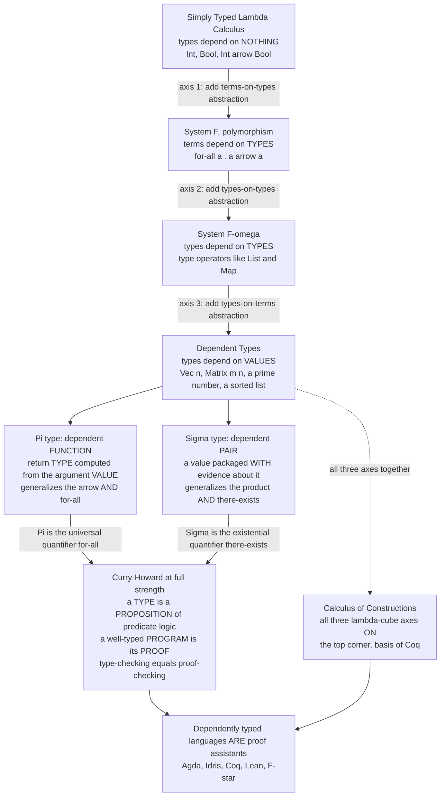

# Π Dependent Types and Advanced Type Systems

> [!abstract] TL;DR
> An ordinary type says *"this is a list."* A **dependent type** says *"this is a list of **exactly five** elements"* — a type that literally contains a **value** (`Vec 5`, `Matrix m n`, "a prime number", "a sorted list"). Once types can mention values, the type of a function can *promise* things — "the output vector has the **same length** as the input" — and the compiler **checks the promise**. The two core constructs are the **Pi type** `Πx:A. B x` (a dependent function whose *return type depends on the argument value* — this is exactly the logician's ∀) and the **Sigma type** `Σx:A. B x` (a dependent pair of a value *and evidence about it* — exactly ∃). At full strength the **Curry-Howard correspondence** pays off completely: **a type is a proposition, a well-typed program is its proof, and type-checking is proof-checking.** That is why dependently typed languages — Agda, Idris, Coq, Lean, F* — *are* proof assistants. The catch: checking these types means **running programs at compile time** and deciding equality of types-containing-computations, so type inference is undecidable and you pay with annotations, termination checkers, and interactive proving. The frontier — GADTs, linear/refinement/effect types, homotopy type theory — is the ongoing effort to buy this power at a *practical* price.

---

## Intuition

**Analogy — the shipping label that the loading dock is forced to obey.** Imagine two kinds of shipping label. An *ordinary* label says **"box of screws."** A dependent label says **"box of exactly 500 screws."** The ordinary label lets a warehouse robot pick up *any* box of screws; the second label is a **promise about a quantity baked right into the description of the box.** Now suppose the packing machine has a rule stamped on it: *"a REPACK station takes a box-of-m and a box-of-n and outputs a box-of-(m+n)"*, and a GRAB station that *"only accepts a NON-EMPTY box."* Because the counts live *on the labels*, a supervisor can verify the entire assembly line **just by reading labels** — before a single screw moves — and can flat-out **reject** any hookup where the numbers do not add up. A box labelled "0 screws" is refused at the GRAB station on sight.

That is precisely what dependent types do to programs. Ordinary types (`Int`, `List`, `Int → Bool`) are labels that mention only *other labels*. **Dependent types let a label mention a value** — `Vec 5`, `Vec (m + n)`, `head : Vec (n+1) → a`. The type of a function becomes a *specification*, and the type checker becomes the supervisor reading labels and rejecting the impossible. Push this all the way and a type can express *any* proposition of predicate logic — "this list is sorted," "this index is in bounds," "this key exchange is secure" — so **checking that a program has a type becomes checking that a theorem has a proof.** Intuition first: dependent types are *types that contain values*, which turns type-checking into theorem-proving. The rest of this note names the machinery.

---

## How It Works

### Core mechanics

**1. The leap: types that depend on values.** In the simply typed lambda calculus, a type is fixed (`Int`, `Bool → Int`). In **polymorphic** systems (System F), a term can depend on a *type* — `id : ∀a. a → a` — but types still only mention *other types*. The **dependent** move is one rung further: a **type may mention a value**. `Vec n a` is the type of vectors of length `n`, where `n` is an ordinary natural-number *value*. `Matrix m n`, `Fin n` (the numbers below `n`), `IsSorted xs`, `Prime p` — each is a *type family indexed by data*. Types now range over exactly the same space of statements as **predicate logic** (the companion note *Type_Systems_Fundamentals* traces this progression; see also [[Predicate_Logic_and_Quantifiers]]).

**2. The Pi type — the dependent function `Πx:A. B x`.** Ordinarily a function type `A → B` has a *fixed* codomain. In a **dependent function** the *return type is computed from the argument value*: `Πn:Nat. Vec n Int` is a function that, given `n`, returns a vector *of that very length* `n`. The ordinary arrow `A → B` is just the special case where `B` ignores `x` (`Πx:A. B` with `x` not free in `B`). Read logically, `Πx:A. B x` is the **universal quantifier ∀x:A. B(x)**: "for every `x`, evidence of `B(x)`." A function of this type *is* a uniform proof, one output-proof for each input.

**3. The Sigma type — the dependent pair `Σx:A. B x`.** A dependent pair packages **a value together with evidence about that value**. `Σn:Nat. Vec n Int` is "some length `n`, *and* a vector of exactly that length" — a length-erased vector that still knows its own size internally. The ordinary product `A × B` is the special case where `B` ignores `x`. Read logically, `Σx:A. B x` is the **existential quantifier ∃x:A. B(x)**: "there exists an `x` such that `B(x)`, and here it is, *with* the witness." A value of a Sigma type is a *constructive* existence proof — it hands you the actual witness, never a mere assertion.

**4. Curry-Howard at full strength.** Simple types correspond to propositional logic (arrow = implication, product = and, sum = or). **Dependent types extend the correspondence to predicate logic**: `Π` is `∀`, `Σ` is `∃`, the equality type `a = b` is the proposition that `a` and `b` are equal. So **a type is a full proposition** and **a well-typed term is a proof of it**; the empty type `⊥` is falsehood, and there is no closed term of it. **Type-checking becomes proof-checking.** This is not an analogy — it is the reason Agda, Idris, Coq, and Lean are *simultaneously* programming languages and machine-checked proof assistants ([[Proof_Theory_and_Natural_Deduction]] is the logic side of this bridge; the companion notes *The_Curry_Howard_Correspondence* and *Proof_Assistants_and_Dependent_Type_Theory* develop it).

**5. The cost — type-checking must run programs.** If `Vec (2 + 3)` and `Vec 5` are to be *the same type*, the checker must **evaluate** `2 + 3`. So a dependent type checker embeds an evaluator, and it must decide when two types-containing-computations are equal. Two notions collide: **definitional equality** (equal *by computation* — `2+3` reduces to `5`, decided automatically) versus **propositional equality** (equal but only *provable*, e.g. `n + 0 = n`, which needs an explicit induction proof). Deciding definitional equality requires the language to be **strongly normalizing**, which is why dependently typed cores insist on a **termination checker** — an infinite loop at the type level would make type-checking itself loop forever, and (worse) a non-terminating "proof" would inhabit *every* type, collapsing the logic. Full type **inference is undecidable** (it subsumes higher-order unification and, ultimately, the halting problem, [[The_Halting_Problem_and_Undecidability]]), so dependent languages rely on **annotations, bidirectional checking, and interactive tactics** rather than global inference like Hindley-Milner ([[Type_Inference_and_Hindley_Milner]]).

**6. The lambda cube — a map of the whole design space.** Barendregt's **lambda cube** classifies typed lambda calculi by *which three kinds of abstraction* they allow, as three independent axes: **terms depending on types** (polymorphism, System F), **types depending on types** (type operators, System Fω), and **types depending on terms** (dependent types, λP). The simply typed lambda calculus sits at the origin with *none*; turning on one axis at a time gives the eight corners, and the corner with **all three on** is the **Calculus of Constructions** — the impredicative dependent type theory at the foundation of Coq (the companion *Polymorphism_and_System_F* covers the polymorphism axis).

**7. The frontier of advanced features.** Full dependency is powerful but heavy, so a family of *lighter* mechanisms buys slices of the same expressiveness:
- **GADTs (generalized algebraic data types)** let each *constructor refine the result type* — a typed interpreter's `Lit : Int → Expr Int`, `IsZero : Expr Int → Expr Bool` — giving type-safe evaluators and length-indexed structures *without* full dependency.
- **Linear and affine types** track *how many times a value is used* (exactly-once vs at-most-once); this is the type-theoretic core of Rust's **ownership and borrowing** (the companion *Linear_Logic_and_Resource_Types* and [[Ownership_and_Borrowing]]).
- **Refinement types** are a type *plus a predicate* — `{x:Int | x > 0}` — discharged by an **SMT solver** rather than hand-written proofs (LiquidHaskell, F*, Dafny). A pragmatic middle ground: strong specs, far less proof burden.
- **Effect types** and **session types** lift the idea to *what a program does* (which effects it performs, which protocol a channel follows) — the companion notes *Effect_Systems_and_Program_Analysis* and *Concurrency_and_Process_Calculi*.

**8. The promise and the reality.** Dependent types make it possible to ship software **proven correct by construction**: **CompCert** (a C compiler whose optimizations are machine-verified in Coq, [[Formal_Semantics_and_Verified_Compilers]]), the **seL4** verified microkernel, verified cryptographic code in **F***/HACL*, and certified data structures whose invariants *cannot* be violated because a violation would not type-check. The reality check is the **proof burden**: writing the proofs can dwarf writing the code, so the research frontier is making it *practical* — better inference, tactic automation, SMT-backed refinement types, and **homotopy type theory (HoTT)**, which reinterprets the equality type as a *path* and adds the **univalence** axiom (isomorphic types are equal), the modern deepening of the foundations (companion *Homotopy_Type_Theory*). The real-world trajectory is unmistakable: value-dependent typing is **creeping into the mainstream** — Idris and F* as full languages, LiquidHaskell over Haskell, **Scala 3 match types**, **const generics in Rust** ([[Traits_and_Generics]]), and TypeScript's increasingly value-dependent literal/template types.

### Flow / architecture



*Read top to bottom as the **ladder of type-system power**. Each rung switches on one axis of the lambda cube. The top rung — types depending on values — yields the Pi and Sigma constructs, which under Curry-Howard become ∀ and ∃, turning a type checker into a proof checker.*

---

## Key Concepts

### Secondary (intuitive, no CS background needed)

- **A type that contains a number.** Normal types say "a list"; dependent types say "a list of exactly five things." The *five* lives inside the type.
- **Promises the compiler enforces.** A function's type can promise "the answer is the same length as the input," and the machine refuses to accept the code unless the promise really holds.
- **Proof = program.** If a type is a *claim* ("this list is sorted"), then a value of that type is a *proof* of the claim. Writing correct code and proving a theorem become the *same act*.
- **Nothing is free.** To check these promises the compiler has to *run* bits of your program while type-checking, which is slow and can be very hard — that is the price of the power.

### Undergraduate (a first PL / type-theory course)

- **Type families / indexed types:** `Vec : Nat → Type → Type`; `Fin n`; `Matrix m n`; a type indexed by a value.
- **Pi type `Πx:A. B x`:** the dependent function; the arrow `A → B` is the non-dependent special case; logically the **∀**.
- **Sigma type `Σx:A. B x`:** the dependent pair (witness + evidence); the product `A × B` is the non-dependent special case; logically the **∃**.
- **Curry-Howard, predicate level:** propositions-as-types, proofs-as-programs; `⊥` is the empty type; the **equality type** `a = b`.
- **Definitional vs propositional equality:** `2 + 3` and `5` are *definitionally* equal (by computation); `n + 0 = n` is only *propositionally* equal (needs an induction proof).
- **Why termination matters:** a non-terminating term would inhabit every type, so total/strongly-normalizing cores and **termination checkers** are required for the logic to be sound.

### Graduate (type theory / advanced PLT)

- **The lambda cube and Pure Type Systems (PTS):** the three abstraction axes; the eight corners; **λP**, **Fω**, and the **Calculus of Constructions** at the top; the generalized `(s1, s2)` sorts of a PTS.
- **Universes and predicativity:** `Type : Type` is inconsistent (Girard's paradox), so a **universe hierarchy** `Type₀ : Type₁ : …`; predicative (Agda/Martin-Löf) vs impredicative (`Prop` in Coq) foundations.
- **Intensional vs extensional type theory:** whether type-checking of equality is decidable (intensional, needs explicit transport) vs undecidable-but-simpler (extensional); the role of the **J eliminator** and **uniqueness of identity proofs (UIP)**.
- **GADTs as a fragment of dependency:** equality-refining constructors give the *practical* payoff (type-safe interpreters, `Vec`) inside languages like Haskell/OCaml without full type-in-term dependency.
- **Refinement/liquid types and SMT:** `{v:Int | v > 0}` with subtyping discharged by **Z3**; decidable, automatable, the pragmatic frontier (LiquidHaskell, F*, Dafny).
- **Homotopy type theory:** identity types as **paths**, higher inductive types, and the **univalence axiom** (equivalence *is* equality) — a foundations-of-mathematics research program.

---

## Python Demo

```python
# Simulating DEPENDENT TYPES in Python: LENGTH-INDEXED VECTORS (Vec n).
#
# In a dependently typed language (Agda / Idris) the type "Vec n a" carries a
# VALUE -- the length n -- INSIDE the type, so operations get types that ENCODE
# invariants the compiler proves BEFORE the program runs:
#
#     append : Vec m a -> Vec n a -> Vec (m + n) a      -- output length is m + n
#     head   : Vec (n + 1) a -> a                       -- only NON-EMPTY vectors
#     zip    : Vec n a -> Vec n a -> Vec n a            -- lengths MUST match
#
# Python has no such checker, so we BUILD a tiny one. Every Vec is tagged with
# its length index; each operation checks the precondition on the index (a
# "proof obligation") and computes the result index from the type-level formula.
# A violated constraint is REJECTED at "type-check" time -- exactly what a
# dependent type checker does, before any values are ever touched at runtime.
#
# Pure standard library + matplotlib (no numpy required).

import matplotlib.pyplot as plt


class TypeCheckError(Exception):
    """Raised when a length index violates an operation's type -- i.e. the
    dependent type checker REJECTS the program at compile time, not at runtime."""


DERIVATION = []   # a running log of type judgments, printed like a proof


def judge(expr, typ, note):
    DERIVATION.append((expr, typ, note))
    print(f"  |-  {expr:<26} : {typ:<12}  [{note}]")


class Vec:
    """A length-indexed vector.  self.n is the TYPE INDEX -- a value living
    inside the type Vec n.  A declared index that disagrees with the payload is
    rejected, modelling the proof obligation 'the term inhabits its declared type'."""

    def __init__(self, items, declared_n=None):
        self.items = list(items)
        self.n = len(self.items)                       # the length index
        if declared_n is not None and declared_n != self.n:
            raise TypeCheckError(
                f"Vec claims index {declared_n} but holds {self.n} items -- REJECTED")

    def __repr__(self):
        return f"Vec {self.n} {self.items}"


# --- append : Vec m -> Vec n -> Vec (m + n) --------------------------------
def append(u, v):
    result = Vec(u.items + v.items)
    # PROOF OBLIGATION: the TYPE promises length m + n; check the machine agrees.
    assert result.n == u.n + v.n, "append broke its type Vec (m + n)"
    judge(f"append (Vec {u.n}) (Vec {v.n})", f"Vec {result.n}",
          f"CHECKED {u.n}+{v.n}={result.n}")
    return result


# --- head : Vec (n + 1) -> elem     (REJECTS the empty vector) --------------
def head(v):
    if v.n == 0:
        raise TypeCheckError(
            "head : Vec (n+1) -> a  needs n+1 > 0, got Vec 0  -- REJECTED")
    judge(f"head (Vec {v.n})", "elem", f"CHECKED {v.n} > 0")
    return v.items[0]


# --- zip : Vec n -> Vec n -> Vec n   (lengths MUST be equal) ----------------
def zip_eq(u, v):
    if u.n != v.n:
        raise TypeCheckError(
            f"zip : Vec n -> Vec n -> Vec n  needs equal indices, "
            f"got Vec {u.n} and Vec {v.n}  -- REJECTED")
    result = Vec(list(zip(u.items, v.items)))
    assert result.n == u.n
    judge(f"zip (Vec {u.n}) (Vec {v.n})", f"Vec {result.n}",
          f"CHECKED {u.n} = {v.n}")
    return result


# ======================================================================
# WELL-TYPED PROGRAM: the checker DERIVES an index for every step
# ======================================================================
print("=== Well-typed program: each index is PROVEN as it is computed ===")
a = Vec([1, 2, 3])                 # Vec 3
b = Vec([4, 5])                    # Vec 2
judge("a", "Vec 3", "given")
judge("b", "Vec 2", "given")
c = append(a, b)                   # Vec 3 + Vec 2  ->  Vec 5
h = head(c)                        # Vec 5 is non-empty, so head is legal
z = zip_eq(c, Vec([9, 8, 7, 6, 5]))   # Vec 5 zip Vec 5  ->  Vec 5

print(f"\n  append a b  = {c}")
print(f"  head c      = {h}")
print(f"  zip c c5    = {z}")

# ======================================================================
# ILL-TYPED PROGRAMS: the checker REJECTS them, like a failed proof
# ======================================================================
print("\n=== Ill-typed programs: rejected at type-check time (no value produced) ===")
rejected = []
for label, thunk in [
    ("head (Vec 0)",              lambda: head(Vec([]))),
    ("zip (Vec 5) (Vec 2)",       lambda: zip_eq(c, b)),
    ("Vec([1,2], declared_n=9)",  lambda: Vec([1, 2], declared_n=9)),
]:
    try:
        thunk()
        print(f"  {label:<26} accepted   [BUG!]")
    except TypeCheckError as e:
        rejected.append(label)
        print(f"  {label:<26} REJECTED")
        print(f"      -> {e}")

# ======================================================================
# VISUALIZE:  (left) the length index tracked through the pipeline, with
#             rejected ops marked;  (right) the expressiveness ladder.
# ======================================================================
fig, (ax1, ax2) = plt.subplots(1, 2, figsize=(14, 6))

# --- Left: the length index carried THROUGH the well-typed operations ---
terms   = ["a\n(given)", "b\n(given)", "append\na b", "zip\n(.) c5"]
indices = [3,             2,            5,             5]
formula = ["Vec 3", "Vec 2", "Vec 3+2 = Vec 5", "Vec 5 = Vec 5"]
xs = list(range(len(terms)))

ax1.plot(xs, indices, "-o", color="#1f77b4", lw=2, ms=12, zorder=3)
for x, n, f in zip(xs, indices, formula):
    ax1.annotate(f, (x, n), textcoords="offset points", xytext=(0, 13),
                 ha="center", fontsize=9)
# Rejected programs never yield a value: mark them at index 0 with a red X.
ax1.scatter([2.5, 3.5], [0, 0], marker="x", s=200, color="#d62728", zorder=4, lw=3)
ax1.annotate("head (Vec 0)\nREJECTED", (2.5, 0), textcoords="offset points",
             xytext=(0, -36), ha="center", fontsize=8, color="#d62728")
ax1.annotate("zip (Vec 5)(Vec 2)\nREJECTED", (3.6, 0), textcoords="offset points",
             xytext=(0, -36), ha="center", fontsize=8, color="#d62728")
ax1.set_xticks(xs)
ax1.set_xticklabels(terms, fontsize=9)
ax1.set_ylabel("length index  n  carried inside the type")
ax1.set_title("The type index is tracked and PROVEN at every step\n"
              "well-typed ops compute a new index; violations are rejected")
ax1.set_ylim(-1.6, 7)
ax1.grid(True, axis="y", ls=":", alpha=0.5)

# --- Right: the ladder of type-system power (the lambda cube axes) ---
ladder = [
    ("STLC:  types depend on NOTHING",     1, "#c6dbef"),
    ("System F:  terms depend on TYPES",   2, "#9ecae1"),
    ("System F-omega:  types on TYPES",    3, "#6baed6"),
    ("Dependent:  types depend on VALUES", 4, "#2171b5"),
]
ys = list(range(len(ladder)))
ax2.barh(ys, [w for _, w, _ in ladder], color=[c for *_, c in ladder])
for y, (lab, w, _) in zip(ys, ladder):
    ax2.text(0.08, y, lab, va="center", ha="left", fontsize=9,
             color="white" if w >= 3 else "black")
ax2.set_yticks([])
ax2.set_xlabel("expressiveness  (what a TYPE is allowed to mention)")
ax2.set_title("The ladder of type-system power\n"
              "dependent types sit at the top: a type may mention a value")
ax2.set_xlim(0, 4.7)
ax2.invert_yaxis()

fig.suptitle("Dependent types: length-indexed vectors, checked like a proof",
             fontsize=14)
fig.tight_layout()
plt.savefig("dependent_types.png", dpi=130)
print("\nSaved visualization to dependent_types.png")
```

Running it prints a **proof derivation**: `append (Vec 3) (Vec 2) : Vec 5 [CHECKED 3+2=5]`, then `head (Vec 5) : elem [CHECKED 5 > 0]`, then `zip (Vec 5) (Vec 5) : Vec 5 [CHECKED 5 = 5]`. The three ill-typed programs — taking the `head` of an empty `Vec 0`, `zip`-ping a `Vec 5` with a `Vec 2`, and mislabelling a two-element vector as `Vec 9` — are each **rejected at "type-check" time** with a message explaining *which index constraint failed*, never producing a value. The left plot shows the length index threading through the pipeline (`3, 2 → 5 → 5`) with the rejected operations pinned at index 0; the right plot places dependent types at the top of the expressiveness ladder, the corner of the lambda cube where a type may finally mention a value. The whole point: the constraints are decided **before** any data is processed — type-checking *is* proof-checking.

---

## Real-World Applications

> **CompCert — a compiler you can trust because it is proven.** CompCert is a production-grade C compiler whose optimization passes are **machine-verified in Coq**: a dependently-typed proof establishes that the generated assembly *behaves exactly like* the source, for every input program. A famous empirical study (Csmith fuzzing) found *zero* miscompilation bugs in CompCert's verified core while finding hundreds in GCC and LLVM. The correctness statement is a Sigma-type-flavoured theorem, and the compiler *is* its proof ([[Formal_Semantics_and_Verified_Compilers]]).

> **seL4 — a microkernel with a mathematical guarantee.** The seL4 operating-system microkernel ships with a machine-checked proof (in Isabelle/HOL, a close cousin of dependent-type provers) that its C implementation refines an abstract specification and enforces integrity and confidentiality. Dependent/higher-order-logic types make "no buffer overflow, no privilege escalation" a *theorem*, not a test suite.

> **F* and HACL* — verified cryptography running in your browser.** Project Everest uses **F***, a dependently typed language with SMT-backed refinement types, to write cryptographic primitives (Curve25519, ChaCha20-Poly1305) that are *proven* memory-safe, functionally correct, and side-channel resistant, then compiled to C. This verified crypto ships in **Firefox (NSS)**, the Linux kernel, and mbedTLS — dependent types protecting real traffic.

> **Idris and Agda — length-safe and protocol-safe programming.** Idris's `Vec n` makes an out-of-bounds access a *type error*; its dependent-typed `printf` derives the argument types *from the format string value*. Session-typed and dependently-typed APIs encode "you must call `open` before `read`" so that a violated protocol simply does not compile — the promise of *type-driven development*.

> **The mainstream creep — refinement and value-dependent types at work.** **LiquidHaskell** adds `{v:Int | v > 0}` refinements checked by Z3 to ordinary Haskell (used to verify parts of `bytestring` and `containers`); **Dafny** (refinement types + verification) is used at AWS to prove properties of authorization and storage code; **Scala 3 match types** and **const generics in Rust** ([[Traits_and_Generics]], [[Ownership_and_Borrowing]]) bring value-indexed typing into industrial languages; **TypeScript's** literal and template-literal types are a value-dependent flavour reaching millions of everyday developers.

---

## Common Pitfalls

- **Thinking dependent types are "just stronger generics."** Generics (parametric polymorphism) let a type depend on *another type*; dependent types let a type depend on a *value*. `List<T>` is generics; `Vec 5` is dependency. Conflating them misses the entire leap that turns types into a specification language.
- **Forgetting that type-checking now runs your code.** Because `Vec (2+3)` must reduce to `Vec 5`, the checker *evaluates* type-level terms. A slow or diverging type-level computation makes *compilation* slow or non-terminating — a class of bug that simply does not exist in non-dependent languages.
- **Confusing definitional with propositional equality.** `2 + 3` and `5` are equal *by computation* (free). `n + 0 = n` is **not** — it holds propositionally but requires an explicit induction proof, because `+` recurses on its *first* argument and `n + 0` is stuck. Beginners expect all "obvious" equalities to just work and are baffled when `n + 0` will not unify with `n`.
- **Omitting or fighting the termination checker.** Dependently typed cores demand totality; a rejected recursion is not the checker being pedantic — a non-terminating term would inhabit *every* type and make the logic **prove false**. "Turn off the termination checker" is "turn off soundness."
- **Expecting Hindley-Milner-style global inference.** Full dependent inference is undecidable ([[The_Halting_Problem_and_Undecidability]]), so you must supply annotations and often prove goals interactively. Porting an "the compiler infers everything" mindset leads to frustration; dependent typing is *bidirectional checking + proving*, not inference.
- **Reaching for full dependency when a refinement type would do.** Hand-writing Coq/Agda proofs for a bounds check is enormous effort when a **refinement type** `{i:Int | 0 <= i && i < len}` discharged by an SMT solver gives the same guarantee automatically. Match the tool to the proof burden; refinement and GADTs capture most day-to-day wins far more cheaply than the full calculus.
- **Believing "proven correct" means "correct."** A proof only guarantees the code matches its **specification**. If the spec is wrong, or the trusted computing base (the checker's kernel, the hardware model) is flawed, the guarantee leaks. Dependent types eliminate a *category* of bugs, not the possibility of a wrong specification.

---

## Related Concepts

- [[Type_Checking_and_Type_Systems]] — the compiler-side view of static typing; dependent types push type-checking all the way to *proof-checking*, embedding an evaluator in the checker.
- [[Type_Inference_and_Hindley_Milner]] — the decidable, annotation-free inference dependent types deliberately give up; the contrast that explains why dependent languages need bidirectional checking and tactics.
- [[The_Lambda_Calculus]] — the substrate; dependent type theory is the typed lambda calculus with the "types-on-terms" axis switched on, at the top corner of the lambda cube.
- [[Church_Encodings_and_Computability]] — System F / impredicative encodings sit on the polymorphism rung just below dependency; the same "data as its own eliminator" idea reappears in dependent eliminators.
- [[Programming_Language_Theory_Overview]] — the parent map placing type systems, semantics, and the lambda calculus in one picture.
- [[Predicate_Logic_and_Quantifiers]] — the logic dependent types *become*: `Π` is `∀`, `Σ` is `∃`, and a type family is a predicate; Curry-Howard's predicate-level payoff.
- [[Proof_Theory_and_Natural_Deduction]] — proofs-as-programs from the logic side; a natural-deduction derivation *is* a well-typed term, which is why type-checking is proof-checking.
- [[The_Halting_Problem_and_Undecidability]] — why full type inference is undecidable and why deciding type equality forces strong normalization and termination checking.
- [[The_Limits_of_Computation]] — the broader undecidability landscape that bounds what a type checker can automate.
- [[Recursive_Functions_and_Lambda_Calculus]] — totality and termination: dependent cores restrict to total functions so that type-level computation always halts.
- [[Category_Theory]] — the categorical semantics of dependency (locally cartesian closed categories, fibrations); `Σ` and `Π` are left/right adjoints to substitution.
- [[Ownership_and_Borrowing]] — Rust's ownership is *affine typing* in practice: an advanced type system that tracks resource usage, a sibling frontier to full dependency.
- [[Traits_and_Generics]] — Rust generics plus **const generics** are a mainstream, value-indexed step toward dependency (`[T; N]` arrays typed by the length `N`).
- [[Formal_Semantics_and_Verified_Compilers]] — CompCert and verified compilation, the flagship payoff of proving programs correct with dependent/higher-order types.

*(PLT siblings referenced in prose but not yet built in this vault — link them here once created: `Type_Systems_Fundamentals`, `Polymorphism_and_System_F`, `The_Curry_Howard_Correspondence`, `Proof_Assistants_and_Dependent_Type_Theory`, `Linear_Logic_and_Resource_Types`, `Homotopy_Type_Theory`, `Effect_Systems_and_Program_Analysis`, `Verified_and_Certified_Languages`, `Memory_and_Ownership_Models`, `Concurrency_and_Process_Calculi`.)*

---

## Review Questions

### Conceptual (Secondary → Undergraduate)

1. Explain, using the shipping-label analogy, the exact difference between a *generic* type like `List<T>` and a *dependent* type like `Vec 5`. Then state precisely what the **Pi type** `Πn:Nat. Vec n Int` and the **Sigma type** `Σn:Nat. Vec n Int` each describe, and which logical quantifier each corresponds to and why.

### Scenario (Undergraduate → Graduate)

2. You define `plus` by recursion on its first argument and find that the type checker accepts `Vec (0 + n)` where `Vec n` is expected, but **rejects** `Vec (n + 0)` in the same position — even though `n + 0` and `0 + n` are "obviously" both `n`. Diagnose exactly what is happening in terms of **definitional vs propositional equality**, explain why one reduces automatically and the other does not, and describe what you must actually do to make the second case type-check.

### Trade-off (Graduate)

3. A team must guarantee that array indices are always in bounds across a large Haskell codebase. Option A: rewrite in Agda/Coq with full `Vec`/`Fin` dependent types and hand-written proofs. Option B: add **LiquidHaskell refinement types** `{i:Int | 0 <= i && i < len}` discharged by an SMT solver. (a) Compare the two on expressiveness, proof burden, decidability, and where each can *fail to scale*. (b) Explain why refinement types are decidable-and-automatable while full dependent inference is undecidable. (c) When would you nonetheless *need* the full dependent-types option that GADTs and refinements cannot give you?

---

## Sources

- Per Martin-Löf, *Intuitionistic Type Theory* (Bibliopolis, 1984) — the foundational dependent type theory; Pi types, Sigma types, identity types, and the propositions-as-types reading.
- Henk Barendregt, "Introduction to Generalized Type Systems," *Journal of Functional Programming* 1(2), 1991 — the **lambda cube** and Pure Type Systems classifying polymorphism, type operators, and dependency.
- Benjamin C. Pierce (ed.), *Advanced Topics in Types and Programming Languages* (MIT Press, 2005) — chapters on dependent types, GADTs, and effect/refinement systems.
- Edwin Brady, *Type-Driven Development with Idris* (Manning, 2017) — practical dependently typed programming with `Vec`, `Fin`, and type-driven design.
- The Univalent Foundations Program, *Homotopy Type Theory: Univalent Foundations of Mathematics* (Institute for Advanced Study, 2013) — identity types as paths and the univalence axiom. [PDF](https://homotopytypetheory.org/book/)
- Patrick M. Rondon, Ming Kawaguchi, and Ranjit Jhala, "Liquid Types," *PLDI*, 2008 — refinement types with SMT-decidable checking, the pragmatic middle ground.

---

#programming-language-theory #dependent-types #pi-types #gadts #advanced-types
