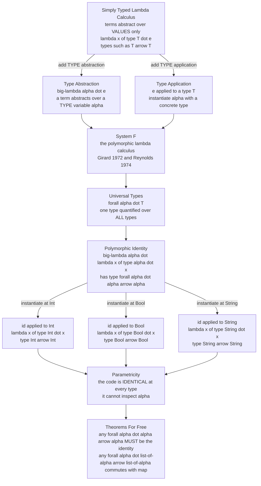

# ∀ Polymorphism and System F

> [!abstract] TL;DR
> Writing one `reverse` for lists of ints, another for lists of strings, and another for *every* element type is absurd — the algorithm is **identical** and does not care what the elements are. **Parametric polymorphism** lets you write it *once* by abstracting over the element **type itself**. The calculus that makes this precise is **System F** (Girard 1972, Reynolds 1974): take the **Simply Typed Lambda Calculus** and add two constructs — **type abstraction** (a term abstracts over a *type* variable, `Λα.e`) and **type application** (instantiate at a concrete type, `e[T]`) — plus **universally-quantified types** `∀α. T`. The polymorphic identity `Λα. λx:α. x` has type `∀α. α→α`. System F is astonishingly expressive (it Church-encodes every data type) yet still **strongly normalizing**, and it yields a stunning consequence — **parametricity** (Reynolds' abstraction theorem): a function's **type alone** can force how it must behave. Any total function of type `∀α. α→α` *must* be the identity; any `∀α. [α]→[α]` *must* commute with `map`. These are Wadler's **"theorems for free."** System F is the theory behind generics in Java, C#, Scala, Rust, Haskell, and TypeScript.

---

## Intuition

**Analogy — a single recipe that ignores its ingredients.** Imagine a recipe for "reverse the order of a row of objects on a shelf." Whether the objects are books, plates, or bricks is *completely irrelevant* — you pick up the last, put it first, and work inward. Writing a separate reversal manual titled "How To Reverse Books," another for "How To Reverse Plates," and another for every possible object would be lunacy: the *procedure is the same*, and it succeeds *precisely because it never looks at what the objects are*. You want to write the manual **once**, with a blank where the object-type goes, and let the reader fill in "books" or "plates" at the moment they use it.

That blank-you-fill-in-later is a **type parameter**, and filling it in is **type application**. **Parametric polymorphism** is exactly the "write it once, abstract over the element type" idea, made into a language feature. Now the stunning twist: *because* the reversal manual is forbidden from inspecting the objects, its behaviour is enormously constrained. In fact, if all you know is that a manual "takes a row of things and returns a row of the same kind of things," you can already *prove* — from that description alone, without reading a single step — that whatever it does to a row of books, it does the *corresponding* thing to a row of relabeled books. The **type signature by itself becomes a theorem** about the code. This is the beautiful, practical heart of System F: abstracting over types does not just save you from copy-paste — it makes the *type* a certificate of *behaviour*, "theorems for free."

---

## How It Works

### Core Mechanics

**1. The three kinds of polymorphism — do not confuse them.** "Polymorphism" means "many forms," and it comes in three genuinely different flavours:

- **Parametric polymorphism** — *one* implementation works **uniformly** for *all* types, because it never inspects the type. `length`, `reverse`, `map`, `id`, `fst`. This is the subject of this note and of System F.
- **Ad-hoc polymorphism (overloading)** — a *different* implementation is chosen *per type*. `1 + 2` versus `"a" + "b"`, or a `show`/`Display`/`toString` that dispatches on the argument's type. Realized by **type classes** (Haskell, [[Scala_Typeclasses]]), **traits** ([[Traits_and_Generics]]), or overloading. The name is shared; the code is not.
- **Subtype polymorphism** — a value of a subtype can stand in wherever a supertype is expected; the *same call* dispatches to different overrides via **subtyping/inheritance** ([[Subtyping_and_Variance]], and the forthcoming *Object Oriented Language Theory*; see [[Scala_Generics_and_Variance]] and [[Trait_Objects_and_Dynamic_Dispatch]] for the applied view).

The three are orthogonal and modern languages combine them (Rust: generics = parametric, traits = ad-hoc, `dyn` = subtype-ish). System F is the canonical model of the **first** kind.

**2. From the STLC to System F — abstract over types.** The **Simply Typed Lambda Calculus** ([[Simply_Typed_Lambda_Calculus]]) lets a term abstract over a **value**: `λx:α. e` waits for a *value* `x`. But `α` there is a *fixed*, concrete type — you would still need a separate `λx:Int. x`, `λx:Bool. x`, and so on. System F's move is to add a *second* level of abstraction: a term can also abstract over a **type**.

- **Type abstraction:** `Λα. e` (big lambda) is a term that waits for a *type* `α`. Inside `e`, `α` is an unknown, abstract type you know nothing about.
- **Type application:** `e[T]` instantiates such a term at a concrete type `T`, substituting `T` for `α` throughout.
- **Universal types:** the type of a type abstraction is a **universally-quantified** type `∀α. T`. It reads "for *all* types `α`, this term has type `T`."

It is called the **second-order** (or **polymorphic**) lambda calculus because you now quantify over **types**, not just values — a second-order quantifier.

**3. The polymorphic identity, concretely.** The identity function that works at *every* type is

```
id  =  Λα. λx:α. x      :      ∀α. α → α
```

`Λα` abstracts the type; `λx:α` abstracts the value. To use it at `Int` you first do type application `id[Int]`, which β-reduces (at the type level) to `λx:Int. x : Int → Int`; then apply it to a value: `id[Int] 5 → 5`. Likewise `id[Bool] true → true`, `id[String] "hi" → "hi"`. **One term, one implementation, instantiated at arbitrarily many types** — that is parametric polymorphism in its purest form.

**4. Astonishing expressive power — and yet it always halts.** System F can **Church-encode every data type** as a polymorphic type: `Nat = ∀α. (α→α)→α→α`, `Bool = ∀α. α→α→α`, `Pair A B = ∀α. (A→B→α)→α`, `List A = ∀α. (A→α→α)→α→α` (this is the Böhm-Berarducci result — a data type *is* the type of its own fold; see [[Church_Encodings_and_Computability]] and the initial-algebra view in [[Category_Theory]]). Despite being far more powerful than the STLC, System F is still **strongly normalizing**: *every* well-typed term terminates. Girard proved this via a deep technique, **reducibility candidates** (a.k.a. "the candidates method"), because the naive induction fails on impredicative quantification. So System F is *not* Turing-complete — general recursion cannot be typed in it — which is exactly the price of the guarantee that all programs halt.

**5. Parametricity and free theorems — the payoff.** Reynolds' **abstraction theorem** (1983) says every well-typed System F term is **parametric**: it behaves *uniformly* across all the types it is instantiated at, because it is *ignorant* of them. The semantic engine is **logical relations** ([[Contextual_Equivalence_and_Reasoning]]) — you interpret each type as a *relation*, and prove a term relates to itself. The practical harvest, popularized by Wadler as **"Theorems for Free!"**, is that you can derive real equational theorems about a function *from its type alone*:

- Any total `f : ∀α. α → α` **must be the identity** (it has no material to build a result from except its input, and it cannot inspect it).
- Any `g : ∀α. [α] → [α]` **commutes with `map`**: `g (map h xs) = map h (g xs)` for every `h`. This holds for `reverse`, `filter`-by-position, `take`, `tail`, `concat`-with-self — the type forbids looking at elements, so the function can only permute/drop/duplicate *by position*.
- `∀α. [α] → Int` (e.g. `length`) is invariant under `map`: `f (map h xs) = f xs`.

**6. Representation independence and existential types.** Parametricity is the formal justification for **data abstraction / information hiding**: a client polymorphic in `α` *cannot* inspect a value of the abstract type, so you may **change its representation** (swap a linked list for an array behind an interface) and every parametric client is provably unaffected — "**representation independence**." The dual of the universal `∀α.T` is the **existential type** `∃α.T`, which models an **abstract data type / module**: "there *exists* some hidden representation type `α` together with operations on it, and you may only use the operations." Universals are "the *caller* picks the type"; existentials are "the *implementer* hides the type" (developed in the forthcoming *Object Oriented Language Theory*).

**7. Type checking is decidable; full type inference is not.** Given all the `Λ` and `[T]` annotations, **type checking System F is decidable** — mechanical. But **full type inference for System F is undecidable** (Wells, 1994): you cannot, in general, reconstruct the omitted type abstractions/applications. This is *why* practical languages do not expose full System F to inference. Instead they adopt the **rank-1 / prenex fragment** — the **Hindley-Milner** system ([[Type_Inference_and_Unification]], [[Type_Inference_and_Hindley_Milner]]) — where all `∀`s sit at the outside of a type. HM is fully inferable via unification, at the cost of forbidding *higher-rank* polymorphism (a `∀` to the left of an arrow). Languages that want higher-rank types (GHC's `RankNTypes`) simply **require annotations** there.

**8. The ladder upward.** Add abstraction over **type constructors** (functions from types to types, like `List` itself) and you get **higher-kinded types** and **System Fω**; a `Functor` is essentially `∀` over a type constructor. Push further — let types depend on *values* — and you reach **dependent types** ([[Dependent_Types_and_Advanced_Type_Systems]]), the world of Coq/Agda/Lean. Under the **Curry-Howard correspondence** (the forthcoming *The Curry-Howard Correspondence*), System F's universal quantification over types is exactly **second-order universal quantification** in logic: System F corresponds to **second-order intuitionistic propositional logic**, and its strong normalization is the computational shadow of cut-elimination.

### Flow / Architecture



*The STLC abstracts over values; System F adds a second level — abstraction over **types** — via `Λ` and `e[T]`, giving universal types `∀α.T`. One polymorphic term instantiates at every type, and because the code cannot inspect `α`, its type alone certifies its behaviour (parametricity → free theorems).*

---

## Key Concepts

### Secondary (intuitive, no CS background needed)

- **Write it once, use it everywhere.** A "reverse a row" procedure does not care whether the row holds books or plates — so write it a single time with a blank for "what kind of thing," and fill the blank in when you use it.
- **Two levels of blank.** An ordinary function has a blank for a *value* ("the thing to reverse"). A *polymorphic* function has a second blank for the *type* of thing.
- **The type is a promise.** "Takes a row of things, returns a row of the same things" is not just documentation — it is a mathematical constraint so strong that you can predict how the function behaves without reading it.
- **The tiniest example.** If a function claims "give me anything, I'll give you back something of the same type," and it is honest and always finishes, then it can *only* hand you back exactly what you gave it. It has nothing else to work with.

### Undergraduate (a first PL / type-theory course)

- **Three polymorphisms:** parametric (uniform, one impl), ad-hoc (per-type impls via type classes/traits/overloading), subtype (via subtyping/inheritance) — and how a language like Rust uses all three.
- **System F syntax:** term abstraction `λx:T.e`, application `e₁ e₂`, **type abstraction** `Λα.e`, **type application** `e[T]`; types `α`, `T→T`, and **`∀α.T`**.
- **The polymorphic identity** `Λα.λx:α.x : ∀α.α→α`; instantiation `id[Int]`, `id[Bool]`; why "second-order" (quantifying over types).
- **Church encodings in System F:** `Nat = ∀α.(α→α)→α→α`, `Bool`, `Pair`, `List` as the type of their fold (Böhm-Berarducci).
- **Strong normalization:** every System F term halts, so System F is *not* Turing-complete (contrast the untyped calculus / general recursion).
- **Inference boundary:** type *checking* is decidable; full *inference* is undecidable, so real languages use the inferable **Hindley-Milner** (rank-1) fragment ([[Type_Inference_and_Unification]]).

### Graduate (advanced PLT / type theory)

- **Reynolds' abstraction (parametricity) theorem** via **logical relations**: types are interpreted as relations; `⟦∀α.T⟧` quantifies over *all relations* on the instantiation types; the fundamental lemma gives every term a "free theorem."
- **Wadler's "Theorems for Free!"** derivation calculus; the free theorems for `∀α.α→α`, `∀α.[α]→[α]`, `∀α.[α]→Int`, and naturality of polymorphic functions as **natural transformations** ([[Category_Theory]]).
- **Impredicativity:** `∀α.T` can be instantiated at a type that *mentions the very quantifier being defined* (e.g. `∀α.α→α` at `∀β.β→β`); this impredicativity is why Girard's normalization proof needs **reducibility candidates** rather than a simple structural induction.
- **Existential types** `∃α.T` as data abstraction / ADT modules (Mitchell-Plotkin, "Abstract Types Have Existential Type"); representation independence as a parametricity corollary; encoding `∃` via `∀`.
- **Undecidability of inference:** Wells' theorem that System F typability is undecidable; predicative vs impredicative fragments; rank-`k` polymorphism and where inference becomes tractable again.
- **System Fω and beyond:** abstraction over type constructors, **kinds**, functors/monads as `∀` over constructors; the ladder to the **Calculus of Constructions** and dependent types; the **Curry-Howard** reading as **second-order intuitionistic logic**.

---

## Python Demo

```python
# ======================================================================
# PARAMETRIC POLYMORPHISM & PARAMETRICITY, in pure Python + matplotlib.
#
#   PART 1 -- Model System F TYPES; take the polymorphic identity
#             id : forall a. a -> a  and INSTANTIATE it at several concrete
#             types, showing ONE implementation behaves UNIFORMLY.
#
#   PART 2 -- Demonstrate two FREE THEOREMS (Reynolds' parametricity,
#             Wadler's "theorems for free") EMPIRICALLY:
#       (a) any total f : forall a. a -> a  MUST be the identity.
#           A parametric function respects EVERY relation on 'a', i.e. it
#           must COMMUTE WITH EVERY relabeling (bijection) r:  f(r x)=r(f x).
#           Only the identity commutes with ALL relabelings.
#       (b) any g : forall a. [a] -> [a]  COMMUTES WITH map:
#           g(map h xs) == map h (g xs)  for every h  (reverse, take, ...).
#           Functions that PEEK at element values (sort, value-filter) are
#           NOT parametric and visibly break the theorem.
#
#   PART 3 -- Visualize (left) the instantiation of ONE polymorphic term at
#             many types, and (right) the parametricity constraint: the
#             fraction of relabelings each candidate a->a commutes with.
#
# Pure standard library + matplotlib (no numpy).
# ======================================================================
from dataclasses import dataclass
from itertools import permutations
import matplotlib.pyplot as plt

# ----------------------------------------------------------------------
# PART 1: a minimal model of System F TYPES and TYPE APPLICATION.
# ----------------------------------------------------------------------
@dataclass(frozen=True)
class TVar:            # a bound type variable, e.g. alpha
    name: str
@dataclass(frozen=True)
class TCon:            # a concrete base type, e.g. Int, Bool, String
    name: str
@dataclass(frozen=True)
class Arrow:          # a function type  dom -> cod
    dom: object
    cod: object
@dataclass(frozen=True)
class Forall:         # a universal type  forall v . body
    var: str
    body: object

def show(t) -> str:
    if isinstance(t, TVar):   return t.name
    if isinstance(t, TCon):   return t.name
    if isinstance(t, Arrow):  return f"({show(t.dom)} -> {show(t.cod)})"
    if isinstance(t, Forall): return f"forall {t.var}. {show(t.body)}"

def subst(t, var, concrete):
    """Substitute the concrete type for the type variable 'var' in t."""
    if isinstance(t, TVar):   return concrete if t.name == var else t
    if isinstance(t, TCon):   return t
    if isinstance(t, Arrow):  return Arrow(subst(t.dom, var, concrete),
                                           subst(t.cod, var, concrete))
    if isinstance(t, Forall):                      # do not capture a shadowed var
        return t if t.var == var else Forall(t.var, subst(t.body, var, concrete))

def instantiate(forall_t, concrete):
    """TYPE APPLICATION:  (forall a. T)[C]  =  T[a := C]."""
    assert isinstance(forall_t, Forall), "can only instantiate a forall-type"
    return subst(forall_t.body, forall_t.var, concrete)

# The TYPE of the polymorphic identity:  forall a. a -> a
ID_TYPE = Forall("a", Arrow(TVar("a"), TVar("a")))

# The single polymorphic IMPLEMENTATION (Python erases the type at runtime):
def poly_id(x):
    return x

print("=== PART 1: one polymorphic term, instantiated at many types ===")
print(f"  id : {show(ID_TYPE)}")
instances = [TCon("Int"), TCon("Bool"), TCon("String"),
             Arrow(TCon("Int"), TCon("Int"))]     # even a function type
for c in instances:
    print(f"  id[{show(c):>15}]  :  {show(instantiate(ID_TYPE, c))}")

# The SAME poly_id runs uniformly at every type -- that is the whole point:
samples = [42, True, "hello", [1, 2, 3], (9, 9), poly_id]  # poly_id itself!
print("  uniform behaviour of the ONE implementation:")
for v in samples:
    out = poly_id(v)
    tag = "id" if out is v or out == v else "??"
    print(f"    poly_id({str(v):<22}) = {str(out):<22} [{tag}]")

# ----------------------------------------------------------------------
# PART 2a: FREE THEOREM for  forall a. a -> a  ==>  it must be the identity.
#
# Reynolds' abstraction theorem: a parametric f respects every relation on
# 'a'. Specialising relations to BIJECTIONS r on a finite carrier, a
# parametric f must satisfy   f(r x) == r(f x)   for EVERY r.
# We test candidate a->a functions over ALL relabelings of a 6-element
# carrier of OPAQUE tokens (the function is forbidden to "read" them).
# ----------------------------------------------------------------------
carrier = list(range(6))                    # opaque tokens 0..5
all_perms = [dict(zip(carrier, p)) for p in permutations(carrier)]  # 720 relabelings

def frac_commuting(f):
    """Fraction of relabelings r with  f(r x) == r(f x)  for all x."""
    good = 0
    for r in all_perms:
        if all(f(r[x]) == r[f(x)] for x in carrier):
            good += 1
    return good / len(all_perms)

# Candidate functions of type a->a. Only the FIRST is genuinely parametric;
# the others secretly INSPECT the value (which a real forall a. a->a cannot).
candidates = {
    "identity  (parametric)":       lambda x: x,
    "const 0   (peeks at a)":       lambda x: 0,
    "succ mod6 (peeks at a)":       lambda x: (x + 1) % 6,
    "swap 0<->1 (peeks at a)":      lambda x: {0: 1, 1: 0}.get(x, x),
}

print("\n=== PART 2a: forall a. a -> a  must be the IDENTITY ===")
print("  (fraction of relabelings r for which f(r x) == r(f x))")
fracs = {}
for name, f in candidates.items():
    fr = frac_commuting(f)
    fracs[name] = fr
    verdict = "IS the free identity" if fr == 1.0 else "violates parametricity"
    print(f"    {name:24}: {fr:5.3f}   {verdict}")

# ----------------------------------------------------------------------
# PART 2b: FREE THEOREM for  forall a. [a] -> [a]  ==>  commutes with map.
#   g(map h xs) == map h (g xs)   for every element-transformer h.
# A parametric g can only rearrange/drop/duplicate BY POSITION.
# ----------------------------------------------------------------------
h  = lambda x: (x * 3) % 7                   # a NON-order-preserving relabeling
xs = [3, 1, 4, 1, 5, 9]

def commutes_with_map(g):
    lhs = g([h(x) for x in xs])              # g . map h
    rhs = [h(x) for x in g(xs)]              # map h . g
    return lhs == rhs

parametric = {                               # cannot see element VALUES
    "reverse":            lambda ys: ys[::-1],
    "take first 3":       lambda ys: ys[:3],
    "duplicate":          lambda ys: ys + ys,
    "drop even indices":  lambda ys: [y for i, y in enumerate(ys) if i % 2 == 1],
}
cheating = {                                 # illegally INSPECT element VALUES
    "sort (peeks at values)":     lambda ys: sorted(ys),
    "keep y>2 (peeks at values)": lambda ys: [y for y in ys if y > 2],
}

print("\n=== PART 2b: forall a. [a] -> [a]  commutes with map ===")
for name, g in parametric.items():
    print(f"    parametric  {name:20}: commutes with map = {commutes_with_map(g)}")
for name, g in cheating.items():
    print(f"    NON-param   {name:20}: commutes with map = {commutes_with_map(g)}")

# ----------------------------------------------------------------------
# PART 3: VISUALIZE.
#   Left  -- ONE polymorphic term id : forall a. a -> a instantiated at
#            many concrete types (an instantiation "fan-out").
#   Right -- the parametricity constraint: fraction of relabelings each
#            candidate a->a commutes with (only the identity reaches 1.0).
# ----------------------------------------------------------------------
fig, (axL, axR) = plt.subplots(1, 2, figsize=(14, 6))

# --- Left: instantiation fan-out ---
axL.set_title("ONE term   big-lambda a . \\x:a. x   :   forall a. a -> a\n"
              "instantiated at many concrete types", fontsize=11)
axL.axis("off")
hub = (0.10, 0.5)
axL.plot(*hub, "o", ms=20, color="#1f77b4")
axL.text(hub[0], hub[1] + 0.11, "forall a.\na -> a", ha="center", va="bottom",
         fontsize=10, fontweight="bold", color="#1f77b4")
targets = [
    ("id[Int]     :  Int -> Int",              0.90),
    ("id[Bool]    :  Bool -> Bool",            0.68),
    ("id[String]  :  String -> String",       0.46),
    ("id[[Int]]   :  [Int] -> [Int]",         0.24),
    ("id[Int->Int]:  (Int->Int)->(Int->Int)", 0.04),
]
for label, y in targets:
    tgt = (0.55, y)
    axL.annotate("", xy=tgt, xytext=hub,
                 arrowprops=dict(arrowstyle="-|>", color="#ff7f0e", lw=1.8))
    axL.text(tgt[0] + 0.02, y, label, ha="left", va="center", fontsize=9,
             family="monospace",
             bbox=dict(boxstyle="round,pad=0.3", fc="#fff3e0", ec="#ff7f0e"))
axL.set_xlim(0, 1.5)
axL.set_ylim(-0.02, 1.05)

# --- Right: parametricity constraint bar chart ---
names = list(fracs.keys())
vals = [fracs[n] for n in names]
colors = ["#2ca02c" if abs(v - 1.0) < 1e-12 else "#d62728" for v in vals]
ypos = range(len(names))
axR.barh(list(ypos), vals, color=colors, edgecolor="black")
axR.set_yticks(list(ypos))
axR.set_yticklabels(names, fontsize=9, family="monospace")
axR.invert_yaxis()
axR.set_xlim(0, 1.08)
axR.set_xlabel("fraction of relabelings r with  f(r x) == r(f x)")
axR.set_title("Parametricity forces uniqueness\n"
              "only the IDENTITY commutes with EVERY relabeling\n"
              "=> free theorem: forall a. a->a is the identity", fontsize=11)
for i, v in enumerate(vals):
    axR.text(v + 0.012, i, f"{v:.3f}", va="center", fontsize=9)
axR.axvline(1.0, ls=":", color="#2ca02c", alpha=0.7)
axR.grid(True, axis="x", ls=":", alpha=0.5)

plt.tight_layout()
plt.savefig("system_f_parametricity.png", dpi=130)
print("\nSaved visualization to system_f_parametricity.png")
```

Running it prints the type of `id : forall a. a -> a`, then its instantiations `id[Int] : Int -> Int`, `id[Bool] : Bool -> Bool`, `id[String] : String -> String`, and even `id[Int->Int]` at a *function* type — one implementation, uniform behaviour. Part 2a then confirms the first free theorem **empirically**: only `identity` commutes with **all 720** relabelings (fraction `1.000`), while every value-peeking impostor (`const 0`, `succ`, `swap`) commutes with only a small fraction and so cannot be a parametric `∀α.α→α`. Part 2b confirms the second: `reverse`, `take`, `duplicate`, and `drop even indices` all satisfy `g(map h xs) == map h (g xs)`, while `sort` and value-filter — which illegally read element values — visibly break it. The saved figure shows, on the left, the single polymorphic term fanning out to many type instances, and on the right, the parametricity bar chart in which only the identity reaches `1.0` — a hands-on demonstration that a **type can be a theorem**.

---

## Real-World Applications

> **Generics in Java, C#, Scala, and TypeScript are parametric polymorphism.** `List<T>`, `Map<K,V>`, and `<T> T identity(T x)` are System F's `∀`-types wearing angle brackets. Java and Scala use **type erasure** — `T` vanishes at runtime, so *one* compiled method serves every instantiation (small code, but no `new T[]` and no `x instanceof T`). C# reifies generics (the runtime knows the type argument), and TypeScript erases them entirely (types are compile-time only). Scala further blends parametric with **subtype** polymorphism and **variance** annotations ([[Scala_Generics_and_Variance]]), and ad-hoc via **type classes / givens** ([[Scala_Typeclasses]], [[Scala_Advanced_FP]]).

> **Rust generics + traits split the three polymorphisms cleanly.** `fn id<T>(x: T) -> T` is parametric; `trait Display` supplies ad-hoc (per-type) behaviour; `dyn Trait` gives a subtype-like existential. Rust uses **monomorphization** — the compiler *stamps out a specialized copy* of a generic per instantiation, the opposite trade-off from erasure: maximal speed and inlining at the cost of code size ("code bloat"). Contrasting **erasure vs monomorphization** is a core compiler decision ([[Traits_and_Generics]], [[Trait_Objects_and_Dynamic_Dispatch]]).

> **GHC's Core intermediate language *is* System F (with extensions).** Haskell type-checks with Hindley-Milner up front, then **desugars to System FC** — an explicitly-typed System F with coercions — as its IR. All those invisible `Λ`/`[T]` you never write are inserted by the compiler; type classes are elaborated into ordinary dictionary-passing (ad-hoc realized on top of parametric). The theory in this note is literally a production compiler's IR.

> **Parametricity powers real optimizations and API guarantees.** Because a `∀α.[α]→[α]` cannot fabricate elements, GHC's rewrite rules and library authors reason with free theorems to justify **fusion** (`map f . map g = map (f . g)`), deforestation, and the safety of `newtype` coercions (`Data.Coerce`, a zero-cost cast justified by representation independence). "Theorems for free" is not just elegant — it validates optimizations that would otherwise need per-function proofs.

> **Existential types model modules and abstract data types.** ML functors, Rust's `impl Trait` / `dyn Trait`, Java's "capture" of wildcards, and object encodings all trade in `∃α.T`: "there is *some* hidden representation you may not inspect." Parametricity's **representation independence** is why you can swap a `HashMap` for a `BTreeMap` behind an interface and *prove* clients are unaffected.

---

## Common Pitfalls

- **Conflating the three polymorphisms.** "Generics" (parametric), "overloading / traits / type classes" (ad-hoc), and "inheritance / subtyping" (subtype) are *different mechanisms*. A `<T extends Comparable<T>>` bound is parametric polymorphism *constrained by* an ad-hoc interface — mixing them up leads to muddled API design. Name the mechanism you actually want.
- **Expecting full System F type inference.** Omitting type annotations and hoping the compiler reconstructs arbitrary `∀`s fails: **inference for System F is undecidable** (Wells). Real languages infer only the **rank-1 / Hindley-Milner** fragment; **higher-rank** polymorphism (a `∀` under an arrow, e.g. `(∀a. a→a) → (Int, Bool)`) *requires* an explicit annotation. "Why won't Haskell infer this rank-2 type?" is this pitfall.
- **Assuming free theorems survive real languages.** Parametricity assumes *total, effect-free, non-inspecting* functions. It **breaks** under: runtime type inspection (`instanceof`, reflection, `typeof`), `null`/`undefined`, exceptions, non-termination, `unsafeCoerce`/`unsafePerformIO`, `seq` (which distinguishes `⊥`), and mutable state. Java's `<T>` is *not* truly parametric — reflection can read `T` — so "any `List<T> -> List<T>` commutes with map" is only a *moral* guarantee there, an ironclad one in idealized System F.
- **Believing "generic ⇒ slower" or "generic ⇒ fatter" universally.** It depends on the compilation strategy. **Erasure** (Java/Scala/Haskell-ish) yields one shared body — compact, but boxing and no specialization. **Monomorphization** (Rust/C++ templates) yields specialized fast copies — but code bloat and slower builds. Neither is "the" cost of polymorphism; it is a deliberate engineering trade-off.
- **Thinking System F is Turing-complete.** It is **strongly normalizing** — every term halts — so it *cannot* express general recursion; you cannot type the untyped `Y` combinator in it. Practical languages regain generality by *adding* a fixpoint/recursion primitive on top, deliberately stepping outside pure System F.
- **Confusing `∀` with `∃`.** `∀α.T` means "the *caller* chooses `α`" (a polymorphic function you can use at any type); `∃α.T` means "the *implementer* hid `α`" (an abstract value whose representation you cannot see). Swapping them inverts who has the power to pick the type.
- **Reifying Church encodings for real work.** Yes, `Nat = ∀α.(α→α)→α→α` is beautiful and typeable in System F, but production languages ship native `Int`/`List` for efficiency; the encoding proves *expressive power*, not a runtime strategy (see [[Church_Encodings_and_Computability]]).

---

## Related Concepts

- [[Simply_Typed_Lambda_Calculus]] — the base System F extends; add type abstraction `Λα.e` and type application `e[T]` to the STLC and you get the polymorphic lambda calculus.
- [[Type_Inference_and_Unification]] — the inference story; full System F inference is undecidable, so languages infer the rank-1 Hindley-Milner fragment via unification.
- [[Subtyping_and_Variance]] — the *subtype* flavour of polymorphism, orthogonal to parametric; variance annotations arise where generics meet subtyping.
- [[Dependent_Types_and_Advanced_Type_Systems]] — the next rungs up the ladder (higher kinds, System Fω, dependent types) once types may depend on values.
- [[Contextual_Equivalence_and_Reasoning]] — logical relations, the semantic basis of parametricity; free theorems are contextual-equivalence facts derived from types.
- [[The_Lambda_Calculus]] — the untyped base; System F's `Λ`/`[T]` extend the untyped `λ`/application with a second, type-level layer.
- [[Church_Encodings_and_Computability]] — System F Church-encodes every data type as a polymorphic type (Böhm-Berarducci: a type *is* the type of its fold).
- [[Type_Checking_and_Type_Systems]] — where parametric polymorphism sits among type-system features; System F is the reference model for "generics."
- [[Type_Inference_and_Hindley_Milner]] — the compiler-side view of the decidable rank-1 fragment real languages actually infer.
- [[Traits_and_Generics]] — Rust: parametric generics (monomorphized) plus trait-based ad-hoc polymorphism, the three kinds in one language.
- [[Trait_Objects_and_Dynamic_Dispatch]] — Rust `dyn Trait` as an existential/subtype counterpart to static generic dispatch.
- [[Scala_Generics_and_Variance]] — parametric polymorphism meeting subtyping and variance in a production language.
- [[Scala_Typeclasses]] — ad-hoc polymorphism (type classes / givens), the "different impl per type" sibling to parametric uniformity.
- [[Generic_Classes_and_Methods]] — Java generics as `∀`-types with **erasure**; contrast with monomorphization.
- [[Category_Theory]] — parametric polymorphic functions are **natural transformations**; functors are `∀` over type constructors.
- [[Recursive_Functions_and_Lambda_Calculus]] — the computation-model backdrop; System F's strong normalization is why it *cannot* reach general recursion.

*(Forthcoming PLT siblings referenced in prose above — `Object_Oriented_Language_Theory` and `The_Curry_Howard_Correspondence` — should wikilink here once written.)*

---

## Review Questions

### Conceptual

1. System F extends the Simply Typed Lambda Calculus with **type abstraction** `Λα.e` and **type application** `e[T]`. (a) Write the polymorphic identity and its type, and show the two-step process of using it at `Int` on the value `5`. (b) Explain precisely why System F is called *second-order*. (c) In one sentence, state the key property of parametric polymorphism that distinguishes it from ad-hoc (overloading) polymorphism.

### Scenario

2. A teammate claims to have written a mysterious total, effect-free function `weird : ∀α. α → α` that "does something clever depending on the value." Using **only its type**, prove they are mistaken — that `weird` must be the identity. Then explain how the empirical test in the demo (commuting with *every* relabeling of a finite carrier) is a computable stand-in for Reynolds' abstraction theorem, and name three real-language features (in, say, Java or Haskell) that would *invalidate* your proof.

### Trade-off

3. Two compilers implement generics differently: one **erases** type parameters (one shared code body), the other **monomorphizes** (a specialized copy per instantiation). (a) Give one concrete advantage and one disadvantage of each. (b) Full type *inference* for System F is undecidable, yet type *checking* is decidable — explain the practical consequence for language design, and why Hindley-Milner is the sweet spot most languages actually adopt. (c) System F is strongly normalizing; what expressive power do real languages give up by staying inside it, and how do they get it back?

---

## Sources

- Girard, J.-Y. *Interprétation fonctionnelle et élimination des coupures de l'arithmétique d'ordre supérieur.* Thèse de doctorat, Université Paris VII, 1972 — the original System F and its normalization via reducibility candidates.
- Reynolds, J. C. "Towards a Theory of Type Structure." *Programming Symposium (Colloque sur la Programmation)*, LNCS 19, Springer, 1974: 408-423 — the independent discovery of the polymorphic lambda calculus; and "Types, Abstraction and Parametric Polymorphism," *IFIP Congress*, 1983 — the abstraction (parametricity) theorem.
- Wadler, P. "Theorems for Free!" *FPCA '89: Functional Programming Languages and Computer Architecture*, ACM, 1989: 347-359 — deriving equational theorems from polymorphic types.
- Pierce, B. C. *Types and Programming Languages.* MIT Press, 2002, chs. 22-24 & 30 — System F, type reconstruction, existential types, and the metatheory (the standard modern reference).
- Wells, J. B. "Typability and Type Checking in the Second-Order λ-Calculus Are Equivalent and Undecidable." *LICS '94*, IEEE, 1994: 176-185 — the undecidability of full System F type inference.
- Mitchell, J. C. and Plotkin, G. D. "Abstract Types Have Existential Type." *ACM TOPLAS* 10(3), 1988: 470-502 — existential types, data abstraction, and representation independence.

---

#programming-language-theory #polymorphism #system-f #parametricity #generics
