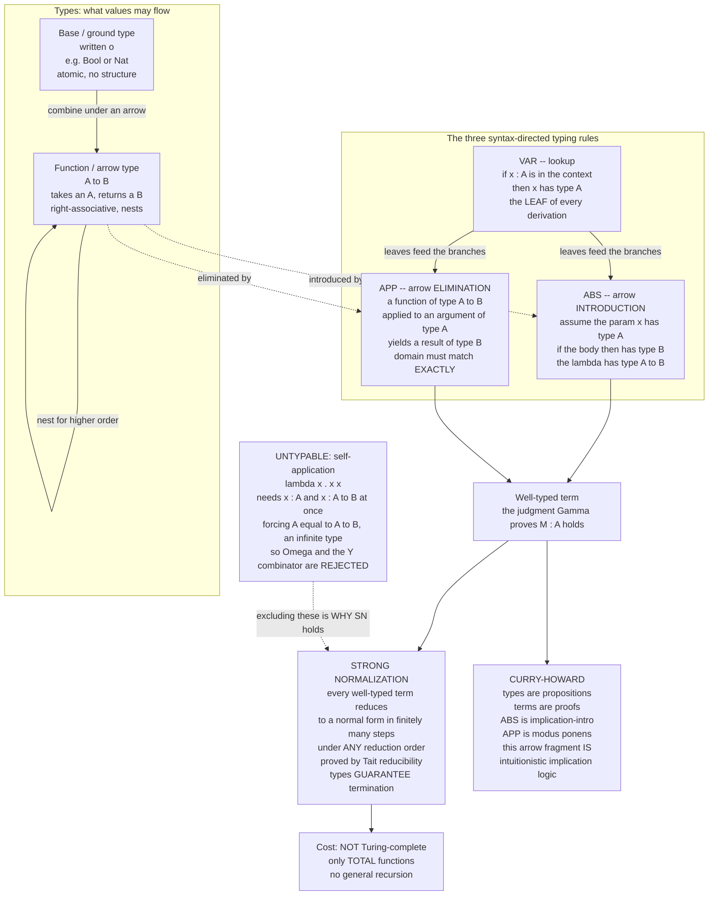

# 🏛️ Simply Typed Lambda Calculus

> [!abstract] TL;DR
> The **simply typed lambda calculus (STLC, or λ→)** is the untyped [[The_Lambda_Calculus|lambda calculus]] plus *one* discipline: every function must **annotate its parameter with a type**, types are built from a **base type** and the **function/arrow type `A → B`**, and just **three syntax-directed rules** (variable lookup, arrow **introduction** at abstractions, arrow **elimination** at applications) decide whether a term is well-typed. That tiny restriction has three landmark payoffs: (1) **strong normalization** — *every* well-typed term reduces to a normal form in finitely many steps under *any* reduction order, so all programs provably halt; (2) as the price, the STLC is **not Turing-complete** — self-application `λx. x x`, `Ω`, and the `Y` combinator are **untypable**, so there is no general recursion; and (3) the **Curry-Howard correspondence** in its cleanest form — the arrow types are *exactly* the implicational fragment of **intuitionistic propositional logic**, a well-typed term *is a proof*, abstraction is implication-introduction, application is modus ponens, and beta-reduction is proof normalization. The STLC is the "hello world" of type theory: the base case that System F, dependent types, and the typed cores of ML and Haskell all extend.

---

## Intuition

**Analogy — the wild lambda calculus, with one guard rail installed.** The untyped [[The_Lambda_Calculus|lambda calculus]] is anything-goes: any function can be applied to *any* argument, including itself. That freedom is exactly what makes it universal — and what lets it loop forever. The term `Ω = (λx. x x)(λx. x x)` beta-reduces to itself endlessly, a computation that never halts. Self-application is the engine of both recursion and non-termination.

Now install a single guard rail: **before you may hand something to a function, the function must have declared what *kind* of thing it accepts, and your argument must be that kind.** A function that expects "a number-to-number function" cannot be fed a raw number, and — crucially — it cannot be fed *itself*, because "the type of a thing that takes itself as input" would have to satisfy `T = T → something`, an impossible, infinitely nested description. The moment you demand that every function announce the type of its input, the paradoxical self-applications simply *cannot be written down*. `Ω` evaporates. The `Y` combinator evaporates.

And here is the astonishing part. With those dangerous terms gone, **every remaining program is guaranteed to terminate** — the type system has tamed computation into something that always finishes. Even more astonishing: when you write out the three typing rules and squint, they turn out to be *identical* to the rules of logic. "If, assuming `A`, I can derive `B`, then I have `A → B`" is both the rule for building a function *and* the rule for proving an implication. Adding types did not just make the calculus safe — it revealed that **a well-typed program and a logical proof are the same object**. Types tame computation and expose a hidden proof system underneath it.

---

## How It Works

### Core Mechanics

**1. Types: a base type and the arrow.** STLC types are the smallest set built from:

- a **base (ground) type** — write it `o` (Church) or use concrete atoms like `Bool` or `Nat`. It is atomic: no internal structure;
- the **function / arrow type** `A → B` — "a function that takes an `A` and returns a `B`," for any types `A` and `B`.

That is the entire type grammar: `A, B ::= o | A → B`. The arrow is **right-associative**, so `A → B → C` means `A → (B → C)` (a curried two-argument function). Everything interesting is built by nesting arrows: `(A → B) → A → B`, `(A → A) → A → A`, and so on.

**2. Terms: the untyped calculus, with annotated binders.** Terms are variables, applications, and abstractions — but **every abstraction annotates its parameter with a type**: `λx : A. M` ("the function that, given `x` of type `A`, returns `M`"). This single annotation is the whole syntactic difference from the untyped calculus, and it is what makes type-checking *syntax-directed* — decidable by one bottom-up pass with no guessing. (Binding and scope of `x` follow the usual rules, see [[Names_Binding_and_Scope]].)

**3. The typing judgment.** We write `Γ ⊢ M : A` — "in **context** `Γ` (a list of typing assumptions `x : A` for the free variables), term `M` has type `A`." The context is the scope: it records what type each variable in view is assumed to have.

**4. Just three rules — and note the elegant intro/elim symmetry.**

- **VAR (lookup).** If the assumption `x : A` is in the context, then `x` has type `A`. `Γ, x : A ⊢ x : A`. This is the leaf of every derivation — you read the type straight off the context.
- **ABS — arrow INTRODUCTION.** If, *assuming the parameter has type `A`*, the body has type `B`, then the whole function has type `A → B`.
  $$\dfrac{\Gamma,\; x : A \;\vdash\; M : B}{\Gamma \;\vdash\; \lambda x{:}A.\,M \;:\; A \to B}$$
  Abstraction *builds* (introduces) an arrow. The parameter's declared type becomes the arrow's domain.
- **APP — arrow ELIMINATION.** A function of type `A → B` applied to an argument of type `A` yields a `B`.
  $$\dfrac{\Gamma \vdash M : A \to B \qquad \Gamma \vdash N : A}{\Gamma \;\vdash\; M\,N \;:\; B}$$
  Application *consumes* (eliminates) an arrow. The argument's type must match the domain *exactly*.

ABS introduces the arrow; APP eliminates it. This intro/elim pairing is the signature of a well-designed type former — and, as we will see, it is *literally* the introduction and elimination rules of implication in natural deduction. The general framework of judgments, contexts, and rules is developed in [[Type_Systems_Fundamentals]].

**5. Type soundness — well-typed terms don't get stuck.** STLC satisfies the two halves of soundness proved concretely:

- **Progress**: a well-typed *closed* term is either a value (a `λ`) or has a redex to reduce — it can never be "stuck" in a nonsensical state like applying a base value as if it were a function.
- **Preservation (subject reduction)**: if `Γ ⊢ M : A` and `M → M'`, then `Γ ⊢ M' : A` — reduction never changes a term's type. Types are an *invariant* of evaluation.

Together, *well-typed programs cannot go wrong* (Milner's slogan): they never reach an ill-formed state. This is the concrete template every richer type system re-proves (see [[Type_Systems_Fundamentals]] and [[Type_Checking_and_Type_Systems]]); the reduction relation itself is the subject of [[Operational_Semantics]].

**6. Strong normalization — the landmark property.** **Every well-typed STLC term reduces to a normal form in finitely many steps, regardless of the reduction strategy.** Not "has a normal form" (that is confluence, weak normalization); *strong* — *no* infinite reduction sequence exists from a typed term, no matter how badly you choose your redexes. Types **guarantee termination**. The standard proof is **Tait's method of reducibility candidates / logical relations**: you define, by induction on types, a set of "reducible" (hereditarily terminating) terms at each type, show every reducible term is strongly normalizing, and prove every well-typed term is reducible. A naive induction on term structure fails because application can grow terms; the logical-relations trick is exactly what carries the induction through, and it is the workhorse of modern metatheory (see [[Reduction_Strategies_and_Evaluation_Order]] for reduction order, and [[Contextual_Equivalence_and_Reasoning]] for logical relations in general).

**7. The flip side — not Turing-complete.** Strong normalization is a two-edged sword: if every program halts, then the halting problem for STLC is *trivially decidable* ("yes"), so STLC **cannot** be Turing-complete. It expresses only **total** functions — no general recursion, no unbounded loops. This is not a bug; it is the deal you struck. You **trade universality for guaranteed termination**.

**8. What is untypable — and why that is the whole point.** The untyped diverging terms are precisely the ones with *no simple type*:

- **Self-application `λx. x x`** requires `x : A → B` (so it can be applied) *and* `x : A` (so it can be the argument), forcing `A = A → B` — an infinite type no finite STLC type satisfies. So `x x` cannot be typed under *any* annotation for `x`.
- Therefore `Ω = (λx. x x)(λx. x x)` is **untypable**, and so is the **`Y` combinator** `λf.(λx. f (x x))(λx. f (x x))`, whose heart is the same `x x` (see [[Combinatory_Logic_and_Fixed_Points]] and [[Church_Encodings_and_Computability]] for how the untyped calculus builds these).

Removing exactly these terms is *why* STLC always terminates. To get recursion back you add a **fixpoint operator** `fix : (A → A) → A` — the calculus **PCF** — which restores Turing-completeness *at the cost of* strong normalization (now `fix (λx. x)` diverges again); the denotational meaning of such fixpoints is [[Domain_Theory_and_Fixed_Points]].

**9. The Curry-Howard correspondence — the single most beautiful result in PLT.** Read the arrow `→` as logical implication and the correspondence is *exact*:

| STLC | Intuitionistic implicational logic |
|---|---|
| Type `A → B` | Proposition "`A` implies `B`" |
| A well-typed term of type `A` | A **proof** of proposition `A` |
| Context `Γ` (variable assumptions) | The **hypotheses** of the proof |
| VAR (use a hypothesis) | Axiom / assumption rule |
| ABS (arrow introduction) | Implication **introduction** (discharge a hypothesis) |
| APP (arrow elimination) | Implication **elimination** = **modus ponens** |
| Beta-reduction | Proof **normalization** / cut elimination |
| Strong normalization | Every proof reduces to a **cut-free** normal proof |

The STLC and **natural deduction** for implicational intuitionistic logic are *the same system* written twice — Gentzen's introduction/elimination rules *are* ABS/APP (see [[Proof_Theory_and_Natural_Deduction]], whose aliases include "Curry-Howard Correspondence", and [[Propositional_Logic]]).

**10. Extensions — every type former mirrors a logical connective.** Enrich the type grammar and each new former lines up with a connective:

- **Products** `A × B` (pairs) ↔ **conjunction** `A ∧ B`;
- **Sums** `A + B` (tagged unions) ↔ **disjunction** `A ∨ B`;
- **Unit** `1` ↔ **truth** `⊤`; **Void** `0` ↔ **falsehood** `⊥`;
- plus base data (`Bool`, `Nat`) with their constructors and eliminators.

Each addition keeps the intro/elim symmetry and extends Curry-Howard, building steadily toward polymorphism (System F), subtyping ([[Subtyping_and_Variance]]), and dependent types.

**11. The role as a foundation.** The STLC is the **base case every richer type system extends**: add type variables and universal quantification and you get **System F** (parametric polymorphism, [[Polymorphism_and_System_F]]); let types depend on terms and you climb the **lambda cube** to **dependent types** (the forthcoming **Dependent Types and Advanced Type Systems**, the basis of Coq/Agda/Lean); add subtyping ([[Subtyping_and_Variance]]), effects, and so on. The typed functional cores of **ML** and **Haskell** descend directly from the STLC — the arrow type *is* the function type everywhere — with **Hindley-Milner** inference reconstructing the annotations the STLC writes by hand (see [[Type_Inference_and_Unification]], [[Type_Inference_and_Hindley_Milner]], and [[Type_Systems_Fundamentals]]).

### Flow / Architecture



*The type grammar has two formers, `base` and `arrow`. Three rules build the judgment `Γ ⊢ M : A`: `VAR` reads a type off the context, `ABS` introduces an arrow, `APP` eliminates one. Every well-typed term is strongly normalizing (Tait), which costs Turing-completeness, and is simultaneously a proof in intuitionistic implicational logic (Curry-Howard). The untypable self-application is exactly what makes termination hold.*

---

## Key Concepts

**Secondary (intuitive, minimal background)**
- **One new rule:** every function declares the *kind* of input it accepts. That is the only change from the untyped calculus.
- **Self-application becomes impossible:** you cannot feed a function to itself once it must announce its input type — so the never-halting `Ω` cannot even be written.
- **Every typed program finishes:** with the dangerous terms gone, computation is guaranteed to terminate.
- **Programs are proofs:** a well-typed program secretly *is* a logical proof; running it *is* simplifying the proof.

**Undergraduate (a first types / PL course)**
- **Type grammar:** `A ::= o | A → B`; arrow right-associativity; currying multi-argument functions.
- **Annotated terms:** `λx : A. M`; the typing **context** `Γ`; the judgment `Γ ⊢ M : A`.
- **The three rules:** VAR (context lookup), ABS (arrow intro), APP (arrow elim); syntax-directed, decidable type-checking in one bottom-up pass.
- **Type soundness:** **progress** + **preservation** ⇒ "well-typed terms don't get stuck."
- **Strong normalization (statement):** every well-typed term halts, under any strategy; hence STLC is not Turing-complete and expresses only total functions.
- **Untypability:** `λx. x x`, `Ω`, and `Y` have no simple type; PCF adds `fix` to recover recursion (losing normalization).

**Graduate (metatheory / type theory)**
- **Tait's reducibility / logical relations:** the induction-on-types technique that proves strong normalization where a naive structural induction fails; the same method underlies parametricity and contextual-equivalence proofs.
- **Curry-Howard-Lambek:** STLC ≅ natural deduction for `→`-intuitionistic logic ≅ **Cartesian closed categories**; beta/eta correspond to normalization and the categorical universal properties.
- **Church vs Curry style:** intrinsic typing (terms carry types, `λx:A`) vs extrinsic typing (assign types to untyped terms); type **inference** vs type **checking**.
- **Extensions and the lambda cube:** products/sums/unit/void as ∧/∨/⊤/⊥; System F (∀, second-order), λω (type operators), λP (dependent types), and their combination (Calculus of Constructions).
- **Confluence + SN ⇒ decidable equality:** because typed terms are confluent *and* strongly normalizing, definitional equality is decidable by normalize-and-compare — the engine of type-checkers in dependently typed proof assistants.
- **Normalization by evaluation (NbE):** computing normal forms via the metalanguage's evaluator, an alternative to term rewriting used in real implementations.

---

## Python Demo

```python
# ======================================================================
# THE SIMPLY TYPED LAMBDA CALCULUS (STLC / λ→) FROM SCRATCH.
#   * Types:  Base | Arrow(dom, cod).
#   * Terms:  Var | Abs(param, TYPE, body) | App     (abstractions are
#             ANNOTATED with the parameter's type -- the one difference
#             from the untyped calculus).
#   * A TYPE CHECKER implementing exactly three rules: VAR, ABS (arrow
#     introduction), APP (arrow elimination); it also BUILDS the typing
#     derivation tree.
#   * A capture-avoiding normal-order BETA-REDUCER.
#   * We show: well-typed terms TYPE-CHECK and reduce to NORMAL FORM;
#     STRONG NORMALIZATION empirically (every well-typed term terminates)
#     while the untyped self-application (λx.x x)(λx.x x) = Ω is UNTYPABLE
#     (the checker REJECTS it under every annotation) yet DIVERGES.
#   * VISUALIZE the typing derivation tree AND the strong-normalization
#     step counts with matplotlib.
# Pure standard library + matplotlib (no numpy needed).
# ======================================================================
import sys
from dataclasses import dataclass
from typing import Optional, Union
import matplotlib.pyplot as plt

try:                                   # print λ safely on any console
    sys.stdout.reconfigure(encoding="utf-8")
except Exception:
    pass

# ----------------------------------------------------------------------
# 1. TYPES:  base type  o  and the function/arrow type  A -> B.
# ----------------------------------------------------------------------
@dataclass(frozen=True)
class Base:
    name: str                          # e.g. "A", "Bool", "Nat"
@dataclass(frozen=True)
class Arrow:
    dom: "Ty"
    cod: "Ty"
Ty = Union[Base, Arrow]

def show_ty(t: Ty) -> str:
    if isinstance(t, Base):
        return t.name
    d = show_ty(t.dom)
    if isinstance(t.dom, Arrow):        # arrow is right-assoc: paren the domain
        d = f"({d})"
    return f"{d}->{show_ty(t.cod)}"

# ----------------------------------------------------------------------
# 2. TERMS:  variable | ANNOTATED abstraction | application.
# ----------------------------------------------------------------------
@dataclass(frozen=True)
class Var:
    name: str
@dataclass(frozen=True)
class Abs:                              # λ param : ty . body     (annotated!)
    param: str
    ty: Ty
    body: "Term"
@dataclass(frozen=True)
class App:
    func: "Term"
    arg: "Term"
Term = Union[Var, Abs, App]

def show(t: Term) -> str:
    if isinstance(t, Var):
        return t.name
    if isinstance(t, Abs):
        return f"(λ{t.param}:{show_ty(t.ty)}.{show(t.body)})"
    return f"({show(t.func)} {show(t.arg)})"

# ----------------------------------------------------------------------
# 3. THE TYPE CHECKER -- three rules -- returning a DERIVATION tree.
# ----------------------------------------------------------------------
@dataclass
class Deriv:
    rule: str                          # "Var" | "Abs (->I)" | "App (->E)"
    ctx: dict
    term: Term
    ty: Ty
    premises: list                     # sub-derivations

class TypeError_(Exception):
    pass

def derive(term: Term, ctx: dict) -> Deriv:
    # -- VAR: look the type up in the context ---------------------------
    if isinstance(term, Var):
        if term.name not in ctx:
            raise TypeError_(f"unbound variable {term.name!r}")
        return Deriv("Var", dict(ctx), term, ctx[term.name], [])
    # -- ABS: arrow INTRODUCTION ----------------------------------------
    if isinstance(term, Abs):
        ctx2 = dict(ctx); ctx2[term.param] = term.ty      # assume x : A
        sub = derive(term.body, ctx2)                     # body : B
        return Deriv("Abs (->I)", dict(ctx), term,
                     Arrow(term.ty, sub.ty), [sub])        # so λ : A -> B
    # -- APP: arrow ELIMINATION -----------------------------------------
    if isinstance(term, App):
        df = derive(term.func, ctx)                       # M : ?
        da = derive(term.arg, ctx)                        # N : ?
        if not isinstance(df.ty, Arrow):
            raise TypeError_(f"applying a NON-function of type {show_ty(df.ty)}: "
                             f"{show(term.func)}")
        if df.ty.dom != da.ty:                            # domain must MATCH
            raise TypeError_(f"argument type mismatch: function wants "
                             f"{show_ty(df.ty.dom)} but got {show_ty(da.ty)}")
        return Deriv("App (->E)", dict(ctx), term, df.ty.cod, [df, da])
    raise TypeError_("not a term")

def type_of(term: Term, ctx: dict) -> Ty:
    return derive(term, ctx).ty

def print_deriv(d: Deriv, indent: int = 0) -> None:
    ctx_s = ", ".join(f"{k}:{show_ty(v)}" for k, v in d.ctx.items()) or "·"
    print("    " * indent +
          f"[{d.rule}]  {ctx_s}  ⊢  {show(d.term)} : {show_ty(d.ty)}")
    for p in d.premises:
        print_deriv(p, indent + 1)

# ----------------------------------------------------------------------
# 4. CAPTURE-AVOIDING SUBSTITUTION + NORMAL-ORDER BETA-REDUCTION.
#    (Reduction ignores the type annotations -- they only gate typing.)
# ----------------------------------------------------------------------
_ctr = [0]
def fresh(base: str, avoid: set) -> str:
    while True:
        _ctr[0] += 1
        cand = f"{base}{_ctr[0]}"
        if cand not in avoid:
            return cand

def free_vars(t: Term) -> set:
    if isinstance(t, Var):
        return {t.name}
    if isinstance(t, Abs):
        return free_vars(t.body) - {t.param}
    return free_vars(t.func) | free_vars(t.arg)

def subst(t: Term, x: str, s: Term) -> Term:
    if isinstance(t, Var):
        return s if t.name == x else t
    if isinstance(t, App):
        return App(subst(t.func, x, s), subst(t.arg, x, s))
    if t.param == x:                                       # x re-bound -> stop
        return t
    if t.param in free_vars(s):                            # avoid capture
        np = fresh(t.param, free_vars(s) | free_vars(t.body) | {x})
        renamed = subst(t.body, t.param, Var(np))
        return Abs(np, t.ty, subst(renamed, x, s))
    return Abs(t.param, t.ty, subst(t.body, x, s))

def beta_step(t: Term) -> Optional[Term]:
    if isinstance(t, App):
        if isinstance(t.func, Abs):                        # (λx:A.M) N  redex
            return subst(t.func.body, t.func.param, t.arg)
        r = beta_step(t.func)
        if r is not None:
            return App(r, t.arg)
        r = beta_step(t.arg)
        if r is not None:
            return App(t.func, r)
        return None
    if isinstance(t, Abs):
        r = beta_step(t.body)
        return Abs(t.param, t.ty, r) if r is not None else None
    return None

def normalize(t: Term, cap: int = 1000):
    seq = [t]
    for _ in range(cap):
        nxt = beta_step(seq[-1])
        if nxt is None:
            return seq, True                               # reached normal form
        seq.append(nxt)
    return seq, False                                      # capped -> diverges

# ----------------------------------------------------------------------
# 5. BUILD SOME TERMS.   Base types A, B; combinators typed at them.
# ----------------------------------------------------------------------
A, B = Base("A"), Base("B")

I_A     = Abs("x", A, Var("x"))                            # λx:A. x        : A->A
K_AB    = Abs("x", A, Abs("y", B, Var("x")))              # λx:A.λy:B. x   : A->B->A
APPLY   = Abs("f", Arrow(A, B),                            # λf:A->B.λx:A. f x
              Abs("x", A, App(Var("f"), Var("x"))))        #                : (A->B)->A->B
TWICE_A = Abs("f", Arrow(A, A),                            # λf:A->A.λx:A. f (f x)
              Abs("x", A, App(Var("f"), App(Var("f"), Var("x")))))  # :(A->A)->A->A

# ======================================================================
# DEMO A -- a full TYPING DERIVATION for APPLY, printed as a tree.
# ======================================================================
print("=== Demo A: typing derivation for APPLY = λf:A->B.λx:A. f x ===")
d_apply = derive(APPLY, {})
print_deriv(d_apply)
print(f"  conclusion: APPLY : {show_ty(d_apply.ty)}   (expected (A->B)->A->B)")
assert show_ty(d_apply.ty) == "(A->B)->A->B"

# ======================================================================
# DEMO B -- a WELL-TYPED redex type-checks AND reduces to normal form.
#   APPLY g a   with  g : A->B,  a : A   reduces to  g a : B.
# ======================================================================
ctxB = {"g": Arrow(A, B), "a": A}
expr = App(App(APPLY, Var("g")), Var("a"))
print("\n=== Demo B: well-typed term reduces to normal form ===")
print(f"  type   : {show(expr)} : {show_ty(type_of(expr, ctxB))}")
seqB, okB = normalize(expr)
for i, tm in enumerate(seqB):
    print(f"  step {i}: {'     ' if i == 0 else '  →  '}{show(tm)}")
print(f"  halts  : {okB}  in {len(seqB) - 1} beta-steps")

# ======================================================================
# DEMO C -- STRONG NORMALIZATION, empirically: EVERY well-typed term
#   terminates, under our (normal-order) reducer.
# ======================================================================
h_ctx = {"g": Arrow(A, B), "a": A, "b": B, "h": Arrow(A, A)}
well_typed = [
    ("I a",                 App(I_A, Var("a"))),
    ("K a b",               App(App(K_AB, Var("a")), Var("b"))),
    ("APPLY g a",           App(App(APPLY, Var("g")), Var("a"))),
    ("TWICE h a",           App(App(TWICE_A, Var("h")), Var("a"))),
    ("TWICE h (TWICE h a)", App(App(TWICE_A, Var("h")),
                                App(App(TWICE_A, Var("h")), Var("a")))),
]
print("\n=== Demo C: strong normalization -- all well-typed terms HALT ===")
wt_names, wt_steps = [], []
for name, tm in well_typed:
    ty = type_of(tm, h_ctx)                                # type-checks
    seq, ok = normalize(tm, cap=200)
    assert ok, "a well-typed STLC term must terminate!"
    wt_names.append(name); wt_steps.append(len(seq) - 1)
    print(f"  {name:<20} : {show_ty(ty):<6} -> normal form in "
          f"{len(seq)-1:>2} steps -> {show(seq[-1])}")

# ======================================================================
# DEMO D -- SELF-APPLICATION IS UNTYPABLE.   λx.x x has no simple type:
#   it forces  x : A  and  x : A -> B  simultaneously.  We try every
#   candidate annotation; the checker REJECTS them all.  The untyped
#   Ω = (λx.x x)(λx.x x) meanwhile DIVERGES.
# ======================================================================
print("\n=== Demo D: (λx.x x) is UNTYPABLE under every annotation ===")
for ann in [A, Arrow(A, B), Arrow(A, A), Arrow(Arrow(A, B), B)]:
    sd = Abs("x", ann, App(Var("x"), Var("x")))           # λx:ann. x x
    try:
        ty = type_of(sd, {})
        print(f"  x:{show_ty(ann):<9} ->  ACCEPTED : {show_ty(ty)}")
    except TypeError_ as e:
        print(f"  x:{show_ty(ann):<9} ->  REJECTED : {e}")

SD    = Abs("x", A, App(Var("x"), Var("x")))               # dummy annotation
OMEGA = App(SD, SD)                                        # Ω -- diverges
try:
    type_of(OMEGA, {})
except TypeError_ as e:
    print(f"  Ω = (λx.x x)(λx.x x)  ->  REJECTED : {e}")
seqO, okO = normalize(OMEGA, cap=25)
print(f"  Ω reduction: still {show(seqO[-1])[:34]}... after 25 steps "
      f"(halts={okO})")

# ----------------------------------------------------------------------
# 6. VISUALIZE.   Left: the typing derivation tree for APPLY.
#                 Right: strong-normalization step counts (all finite)
#                        vs Ω (untypable, diverging -> capped).
# ----------------------------------------------------------------------
fig, (axL, axR) = plt.subplots(1, 2, figsize=(14, 6),
                               gridspec_kw={"width_ratios": [1.25, 1]})

# --- left: derivation tree ---
pos = {}
def layout(node, depth, counter):
    if not node.premises:
        x = counter[0]; counter[0] += 1
    else:
        xs = [layout(p, depth + 1, counter) for p in node.premises]
        x = sum(xs) / len(xs)
    pos[id(node)] = (x, -depth, node)
    return x
layout(d_apply, 0, [0])

def draw_edges(node):
    x0, y0, _ = pos[id(node)]
    for p in node.premises:
        x1, y1, _ = pos[id(p)]
        axL.plot([x0, x1], [y0, y1], color="#90a4ae", lw=1.2, zorder=1)
        draw_edges(p)
draw_edges(d_apply)

rule_color = {"Var": "#fff3e0", "Abs (->I)": "#e3f2fd", "App (->E)": "#e8f5e9"}
for x, y, node in pos.values():
    label = f"{node.rule}\n{show(node.term)}\n: {show_ty(node.ty)}"
    axL.text(x, y, label, ha="center", va="center", fontsize=7.2, zorder=2,
             bbox=dict(boxstyle="round,pad=0.35",
                       fc=rule_color.get(node.rule, "#eee"), ec="#455a64"))
axL.set_title("Typing derivation tree\nAPPLY = λf:A->B.λx:A. f x   :   (A->B)->A->B",
              fontsize=10)
axL.margins(0.22)
axL.axis("off")

# --- right: strong normalization vs divergence ---
names  = wt_names + ["Ω = (λx.x x)(λx.x x)"]
steps  = wt_steps + [25]                                   # Ω hits the cap
colors = ["#2e7d32"] * len(wt_steps) + ["#c62828"]
ypos = range(len(names))
axR.barh(list(ypos), steps, color=colors)
axR.set_yticks(list(ypos)); axR.set_yticklabels(names, fontsize=8)
axR.invert_yaxis()
axR.set_xlabel("beta-reduction steps to normal form")
axR.set_title("Strong normalization: every well-typed term HALTS\n"
              "Ω is UNTYPABLE and never normalizes (capped at 25)", fontsize=10)
for i, div in enumerate(colors):
    tag = "  ✗ untypable + diverges" if div == "#c62828" else "  ✓ halts"
    axR.text(steps[i] + 0.2, i, tag, va="center", fontsize=8,
             color="#c62828" if div == "#c62828" else "#2e7d32")
axR.set_xlim(0, max(steps) + 9)

plt.tight_layout()
plt.savefig("stlc_derivation_and_normalization.png", dpi=130)
print("\nSaved stlc_derivation_and_normalization.png")
```

Running it prints (a) the full typing derivation of `APPLY` as an indented tree — `App (→E)` branching into two `Var` leaves under two nested `Abs (→I)` steps — concluding `APPLY : (A→B)→A→B`; (b) the well-typed redex `APPLY g a` type-checking at `B` and beta-reducing in two steps to the normal form `g a`; (c) five well-typed terms of increasing size, *all* terminating (the `assert ok` is the empirical face of strong normalization); and (d) the type checker **rejecting** `λx. x x` under every annotation we try — `x : A` makes `x x` "apply a non-function," while `x : A → B` demands the impossible `A = A → B` — and rejecting `Ω`, which the untyped reducer meanwhile shows still churning after 25 steps. The saved figure draws the derivation tree on the left and, on the right, a bar chart contrasting the finite step counts of the typed terms against `Ω`'s capped, non-terminating bar labelled *untypable + diverges*.

---

## Real-World Applications

> **Example — the typed cores of ML, Haskell, and every proof assistant *are* the STLC, extended.** GHC compiles Haskell down to **Core**, a small typed lambda calculus (an enriched System F, which is itself the STLC plus universal quantification); OCaml and Standard ML elaborate to essentially the STLC with Hindley-Milner inference filling in the annotations the STLC writes by hand ([[Type_Inference_and_Unification]], [[Type_Inference_and_Hindley_Milner]]). The **arrow type `A → B` you write in every typed functional signature is the STLC function type verbatim.** Proof assistants — **Coq, Agda, Lean, Isabelle** — are the STLC pushed all the way up the lambda cube to dependent types; by Curry-Howard, checking that your program has type `T` *is* checking that your proof of proposition `T` is valid, which is why `mathlib`, CompCert, and verified cryptography are built on typed lambda calculi ([[Proof_Theory_and_Natural_Deduction]], [[Type_Checking_and_Type_Systems]]).

Beyond language cores:

- **Total / termination-checked languages.** Because STLC guarantees termination, its descendants power settings where *non-termination is unacceptable*: the total fragments of **Agda/Idris**, **Dhall** (a total configuration language that provably always halts), and on-chain smart-contract checkers all lean on strong-normalization-style guarantees so a program cannot loop forever or exhaust gas unexpectedly.
- **Type-directed compilation and optimization.** Compilers carry STLC-style types through their intermediate representations to justify optimizations (inlining, deforestation) via **preservation** — reductions never change types, so rewrites are provably meaning-preserving ([[Interpreters_and_Tree_Walking]]).
- **Decidable definitional equality in dependent type checkers.** Strong normalization *plus* confluence makes "are these two types equal?" decidable by normalize-and-compare — the algorithm at the heart of every dependently typed checker.
- **Teaching and metatheory.** STLC is the standard first calculus in *Types and Programming Languages* and *Software Foundations*; progress + preservation + Tait's reducibility are the templates every new type system's soundness and normalization proofs imitate.

---

## Common Pitfalls

- **Thinking "typed" means "more powerful."** It is the reverse: adding simple types makes the calculus **strictly weaker** — strongly normalizing, hence *not* Turing-complete. You gain guaranteed termination and lose general recursion. Universality and totality are a genuine trade, not a free lunch.
- **Trying to type `λx. x x` (or `Y`).** Self-application has no simple type — it forces `A = A → B`, an infinite type. Learners burn time hunting for the "right" annotation; there is none in STLC. Recursion requires *adding* a primitive `fix` (PCF), which reintroduces non-termination.
- **Confusing weak with strong normalization.** *Weak* normalization says a normal form *exists* (some strategy finds it); *strong* says *no* infinite reduction sequence exists (every strategy terminates). STLC has the strong property — this is what a naive term-structural induction cannot prove, forcing Tait's logical-relations method.
- **Expecting decidable *inference* for free.** STLC type *checking* (Church-style, annotations present) is a trivial one-pass algorithm. Type *inference* (Curry-style, recovering omitted annotations) is a different, subtler problem — decidable for STLC and for Hindley-Milner, but *undecidable* for full System F. Do not conflate the two.
- **Reading `A → B → C` as `(A → B) → C`.** The arrow is **right**-associative: `A → B → C` is `A → (B → C)`, a curried function of two arguments. Mis-parsing the arrow silently produces the wrong (or ill-typed) term.
- **Assuming preservation implies progress or vice versa.** Soundness needs *both*: preservation keeps types stable under reduction, progress guarantees a well-typed non-value can still step. A system can satisfy one and not the other; "well-typed programs don't get stuck" requires the pair.
- **Overlooking that Curry-Howard is about *intuitionistic* logic.** STLC corresponds to *intuitionistic* implication — there is no term for `((A → B) → A) → A` (Peirce's law) or double-negation elimination. Classical reasoning corresponds to control operators (call/cc), not to plain STLC.

---

## Related Concepts

- [[The_Lambda_Calculus]] — the untyped calculus STLC restricts; STLC = these terms with annotated binders plus three typing rules. Start here.
- [[Type_Systems_Fundamentals]] — the general framework of judgments, contexts, soundness (progress/preservation), and checking that STLC instantiates minimally.
- [[Reduction_Strategies_and_Evaluation_Order]] — normal vs applicative order and confluence; in STLC *every* strategy terminates (strong normalization), so order affects only cost, never whether you halt.
- [[Operational_Semantics]] — the small-step reduction relation over which STLC's progress and preservation are stated.
- [[Polymorphism_and_System_F]] — STLC plus type variables and universal quantification; the first big step up the lambda cube.
- [[Subtyping_and_Variance]] — another axis of extension: refining the "types match exactly" rule of APP into "argument is a subtype of the domain."
- [[Type_Inference_and_Unification]] — reconstructing the annotations STLC writes by hand; STLC is the checking base that inference sits atop.
- [[Type_Inference_and_Hindley_Milner]] — the ML/Haskell inference algorithm; how the arrow types of the STLC are recovered automatically.
- [[Combinatory_Logic_and_Fixed_Points]] — the `Y` combinator and self-application that STLC forbids; the untyped machinery for recursion.
- [[Church_Encodings_and_Computability]] — how the untyped calculus builds numerals, booleans, and `Ω`; the universality STLC gives up.
- [[Domain_Theory_and_Fixed_Points]] — the denotational meaning of `fix`/recursion you must add (PCF) to escape STLC's totality, and the `⊥` element.
- [[Contextual_Equivalence_and_Reasoning]] — logical relations, the same proof technique Tait uses for strong normalization, generalized to program equivalence.
- [[Type_Checking_and_Type_Systems]] — the compiler-engineering view of type checking, progress, and preservation that STLC formalizes minimally.
- [[Proof_Theory_and_Natural_Deduction]] — the other half of Curry-Howard: STLC's ABS/APP *are* implication introduction/elimination; this note's aliases include "Curry-Howard Correspondence".
- [[Propositional_Logic]] — the implicational fragment STLC types correspond to; `A → B` is the proposition "`A` implies `B`".
- [[Logical_Connectives_and_Boolean_Algebra]] — products/sums/unit/void extensions of STLC mirror ∧/∨/⊤/⊥ from here.
- [[Recursive_Functions_and_Lambda_Calculus]] — computability via the untyped calculus; STLC deliberately *loses* Turing-completeness by forbidding the self-reference that recursion needs.
- [[Turing_Machines_and_the_Church_Turing_Thesis]] — the universality benchmark STLC does *not* meet; a total calculus cannot be Turing-complete.
- [[The_Halting_Problem_and_Undecidability]] — halting is undecidable in general, yet *trivially decidable* for STLC precisely because everything terminates — the cost of that guarantee.
- [[Lambda_Expressions]] — Java's lambdas: the arrow/function type as a mainstream, statically typed language feature descended from the STLC.

*Forthcoming PLT siblings referenced in prose and to be wikilinked once written: **The Curry-Howard Correspondence** (a dedicated treatment beyond [[Proof_Theory_and_Natural_Deduction]]), **Dependent Types and Advanced Type Systems**, and **Functional Programming Foundations**.*

---

## Review Questions

1. **(Conceptual)** STLC adds exactly one thing to the untyped lambda calculus — parameter type annotations — and three typing rules. Explain (a) why this makes `λx. x x` *untypable* under any annotation, (b) what "strong normalization" claims and how it differs from merely "having a normal form," and (c) in one sentence, why guaranteed termination *forces* STLC to be non-Turing-complete.
2. **(Scenario)** A teammate insists they can make recursion work in "plain STLC" by finding the right type annotation for the `Y` combinator. Explain concretely why no annotation succeeds (write the type equation `x` would have to satisfy), what minimal addition to the calculus *does* restore recursion, and precisely which STLC guarantee you forfeit the moment you add it.
3. **(Trade-off / significance)** State the Curry-Howard correspondence for STLC as a table mapping four STLC constructs to their logical counterparts, then answer: (a) what does beta-reduction correspond to on the logic side, (b) why is the corresponding logic *intuitionistic* rather than classical (give one classically-valid proposition with no STLC term), and (c) how does adding product and sum types to STLC extend the correspondence?

---

## Sources

- Pierce, B. C. *Types and Programming Languages*. MIT Press, 2002 — Chs. 9-11 are the definitive modern treatment of the STLC, progress/preservation soundness, and extensions (products, sums, unit).
- Barendregt, H. P. "Lambda Calculi with Types." In *Handbook of Logic in Computer Science*, vol. 2, Oxford University Press, 1992 — the STLC, System F, the lambda cube, and strong normalization proofs.
- Girard, J.-Y., Lafont, Y., Taylor, P. *Proofs and Types*. Cambridge University Press, 1989 — Curry-Howard, Tait's reducibility / strong normalization, and cut elimination. [Free PDF](https://www.paultaylor.eu/stable/prot.pdf)
- Sørensen, M. H., Urzyczyn, P. *Lectures on the Curry-Howard Isomorphism*. Elsevier, 2006 — the correspondence between STLC and natural deduction developed in full.
- Tait, W. W. "Intensional Interpretations of Functionals of Finite Type I." *Journal of Symbolic Logic* 32 (1967): 198-212 — the original reducibility (logical-relations) method proving strong normalization.
- Church, A. "A Formulation of the Simple Theory of Types." *Journal of Symbolic Logic* 5 (1940): 56-68 — Church's original simply typed system.

---

#programming-language-theory #simply-typed-lambda-calculus #stlc #strong-normalization #curry-howard
