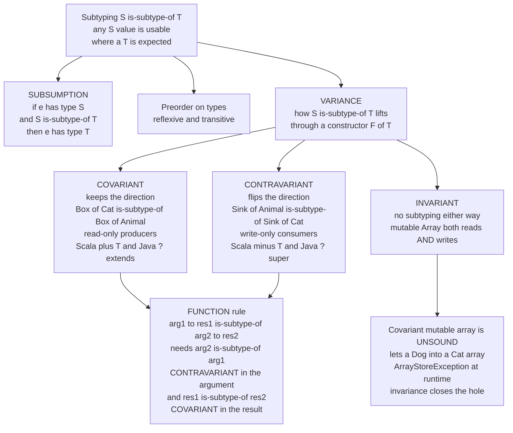

# 🧬 Subtyping and Variance

> [!abstract] TL;DR
> **Subtyping** is a relation `S <: T` meaning "any value of type `S` can be used wherever a `T` is expected" — the type-system engine behind object-oriented **"is-a"** relationships, enforced by the **subsumption rule** (if `e : S` and `S <: T` then `e : T`) and disciplined semantically by the **Liskov Substitution Principle**. **Variance** is the precise rule for *when* that subtyping flows *through* a container or function: **covariant** preserves the direction (safe for read-only producers, `List<Cat> <: List<Animal>`), **contravariant** flips it (function *arguments*, consumers), and **invariant** forbids it (mutable containers *must* be invariant). Getting variance wrong is not a style issue — it is a **soundness hole**: Java's covariant arrays let you slip a `Dog` into a `Cat[]`, so the type checker passes a broken program and the JVM throws `ArrayStoreException` at *runtime*. This note explains the rules, proves *why* mutation forces invariance, and builds a working subtype checker that reproduces the covariant-array hole.

---

## Intuition

**Analogy — the substitution promise, and the container trap.** If every **Cat** *is an* **Animal**, then anywhere a form asks for "an Animal," you can hand it a Cat and nothing breaks — the vet, the zoo, the pet-food label all accept it. That "you can substitute a more specific thing for a more general one" is **subtyping**: `Cat <: Animal`, read *"Cat is a subtype of Animal."* It is the type-rule version of the everyday "is-a."

Now the subtle trap that trips up almost everyone. Is a **"box of Cats"** also a **"box of Animals"**? Your gut says yes — a crate full of cats is surely a crate full of animals. And if you only ever *read* from the box, that is completely safe. But the moment the box is **writable**, the reasoning collapses: someone who thinks they hold a "box of Animals" is entitled to *put a Dog in it* — and now your "box of Cats" contains a Dog. Type safety is broken. **Variance** is the exact rule for when the `Cat <: Animal` relationship is allowed to lift up to `Box<Cat> <: Box<Animal>`. The punchline, which we will prove below: **reading wants covariance, writing wants contravariance, and doing both at once forces invariance.** Mutation is precisely "both at once," which is why every safe language makes mutable containers invariant — and why Java's decision to make *arrays* covariant is the textbook cautionary tale.

---

## How It Works

### The subtyping relation and subsumption

A subtyping relation `<:` is a **preorder** on types — it is **reflexive** (`T <: T`, every type is a subtype of itself) and **transitive** (`S <: U` and `U <: T` imply `S <: T`). It need not be antisymmetric, so it is a preorder rather than a partial order in general. On top of that relation sits the single rule that gives subtyping its power, the **subsumption rule**:

```
   e : S      S <: T
  --------------------   (T-Sub)
        e : T
```

Read it as: *if an expression `e` has type `S`, and `S` is a subtype of `T`, then `e` also has type `T`.* Subsumption is what lets you pass a `Cat` to a function expecting an `Animal` — the `Cat` value is *retyped upward* to `Animal` at the call site. The **Liskov Substitution Principle (LSP)** is the *semantic* contract behind the syntactic rule: `S <: T` should hold only if objects of `S` can replace objects of `T` *without breaking any property the program relied on*. Subsumption is the type checker's mechanical version; LSP is the behavioral promise it stands for (see [[SOLID_Principles]] for the OO-design framing — the "L").

### Nominal vs structural subtyping

- **Nominal** subtyping is declared *by name*: `class Cat extends Animal` or `class ArrayList implements List`. `S <: T` holds only if the programmer *wrote it down*. Java, C++, C#, and Kotlin are nominal. Pro: explicit, fast to check, prevents *accidental* subtyping; con: verbose, and you cannot retrofit a supertype onto a type you do not own.
- **Structural** subtyping holds *automatically when the shape matches*: if a type has all the members `T` requires (with compatible types), it *is* a subtype — no declaration needed. Go interfaces, TypeScript, and OCaml objects are structural (see [[Interfaces_in_Go]] — a Go type satisfies an interface merely by having the right methods). Pro: flexible, decoupled, great for adapters; con: accidental conformance and worse error messages.

### Record and object subtyping

Records (and objects, which are records with methods) obey three rules, all sound:

1. **Width subtyping** — a record with *more* fields is a subtype of one with *fewer*: `{x: Nat, y: Nat, z: Nat} <: {x: Nat, y: Nat}`. More information can always stand in for less. This is exactly why a subclass with extra methods is-a its superclass.
2. **Depth subtyping** — corresponding fields may themselves be subtypes: `{pet: Cat} <: {pet: Animal}` because `Cat <: Animal`. (Depth subtyping on a *mutable* field is unsound for the same reason covariant arrays are — see below.)
3. **Permutation** — field order does not matter; `{x, y}` and `{y, x}` are the same record type.

### Function subtyping — the contravariant twist

When is `S1 -> S2` a subtype of `T1 -> T2`? The rule is famously counterintuitive:

```
   T1 <: S1        S2 <: T2
  ---------------------------
     S1 -> S2  <:  T1 -> T2
```

The result position is **covariant** (`S2 <: T2`, same direction) — natural: a function that returns a `Cat` can stand in where a `Cat`-returning function is wanted, and returning a *subtype* is fine. But the argument position is **contravariant** (`T1 <: S1`, *flipped*). Why? To be usable where a `T1 -> T2` is expected, our function will be *called with `T1` arguments*. It must therefore accept *at least* every `T1` — so its declared parameter type `S1` must be a **supertype** of `T1`. A function that accepts *any Animal* is safely usable where one expecting a *Cat*-consumer is required; a function that only accepts *Cats* is **not** safe there, because it might be handed a Dog. A subtype function must **accept more and promise less**.

### Variance of type constructors

Variance generalizes the function rule to *any* type constructor `F<T>`, describing how `S <: T` lifts to a relation between `F<S>` and `F<T>`:

- **Covariant** (`F<Cat> <: F<Animal>`, direction preserved) — safe when `F` only ever **produces / outputs** `T` values (read-only). Immutable lists, iterators, and function *return* types are covariant. Scala writes `class F[+T]`; Java uses use-site `List<? extends Animal>`.
- **Contravariant** (`F<Animal> <: F<Cat>`, direction reversed) — safe when `F` only ever **consumes / inputs** `T` values (write-only). A `Comparator<Animal>` is-a `Comparator<Cat>` because anything that can compare *any* animal can certainly compare cats. Scala writes `class F[-T]`; Java uses `? super Cat`.
- **Invariant** (no subtyping either way) — forced when `F` **both reads and writes** `T`. Mutable containers, and `Array<T>`, must be invariant. This is why `List<String>` is *not* a `List<Object>` in Java's generics.

The **PECS** mnemonic captures it operationally: **P**roducer **E**xtends, **C**onsumer **S**uper. If a generic method *reads out* of a parameter, bound it `? extends T` (covariant); if it *writes into* it, bound it `? super T` (contravariant). Languages split on *where* you annotate variance: **declaration-site** (Scala `+T`/`-T`, Kotlin `out`/`in`, C#) fixes it once on the type definition; **use-site** (Java wildcards `? extends`/`? super`) decides it fresh at each usage.

### Why mutation forces invariance — the soundness stakes

Consider a *mutable* `Array<T>` with two operations: `get(): T` (a producer, wants covariance) and `set(x: T)` (a consumer, wants contravariance). A single type parameter cannot be covariant *and* contravariant at once, so the only sound choice is **invariant**. Java ignored this for arrays: it declared `Cat[] <: Animal[]` (covariant). The consequence is a genuine hole in the static type system — the compiler accepts a program that is *guaranteed* to violate types at runtime:

```java
Cat[]    cats    = new Cat[1];
Animal[] animals = cats;        // OK: arrays are covariant, Cat[] <: Animal[]
animals[0] = new Dog();         // OK to the type checker: Dog <: Animal
                                // -> ArrayStoreException thrown at RUNTIME
```

The type checker "proved" this safe and was *wrong*; the JVM must carry a runtime element-type tag and re-check every store, throwing `ArrayStoreException` when the lie is exposed. **Invariance closes the hole at compile time** — with invariant arrays, the line `Animal[] animals = cats;` simply does not type-check. This is the deep lesson: **read vs write flips variance, and the only type discipline safe for both is no subtyping at all.** (See [[Type_Erasure_and_Variance]] for how the JVM implements the runtime check, and [[Scala_Generics_and_Variance]] for a language that got declaration-site variance right from the start.)

### Bounded quantification and F-bounded polymorphism

Subtyping combines with **parametric polymorphism** (generics) through **bounded quantification** — the calculus **System F-sub** (`System F<:`). You constrain a type parameter with a subtype bound: `<T extends Comparable>` means "any `T` that is a subtype of `Comparable`." The recursive, self-referential case is **F-bounded polymorphism**: `T extends Comparable<T>` ("a type comparable *to itself*"), which encodes self-types and the *curiously recurring* pattern used across Java, C#, and Scala. Subtyping and parametric polymorphism are two *different* generalization axes — subtyping abstracts over *specializations of a hierarchy*, parametric polymorphism abstracts *uniformly over all types* — and F-sub is where they meet (contrast with the pure parametric story in the forthcoming `Polymorphism_and_System_F`).

### Algorithmic subtyping, inference, and lattices

The *declarative* rules above (with a free-floating transitivity and subsumption rule) are not directly a decision procedure. **Algorithmic subtyping** reformulates them as a syntax-directed, terminating check — essentially the `is_subtype(S, T)` function in the demo below. Subtyping also makes **type inference** harder: with subsumption, an expression no longer has a single *principal* type but a whole *range* of valid types, so global Hindley-Milner inference gives way to **local type inference** (bidirectional checking). Finally, subtyping induces a **lattice**-like structure on types: a conditional `cond ? a : b` needs the **least upper bound** (join) of the branch types, and meets/joins connect subtyping to order and domain theory (the forthcoming `Domain_Theory_and_Fixed_Points`).

### Flow / Architecture



---

## Key Concepts

**Secondary (explain to a curious beginner).**
- **Subtyping is "is-a" as a type rule**: because a Cat *is an* Animal, you can use a Cat anywhere an Animal is expected. Written `Cat <: Animal`.
- A **subclass can always stand in for its superclass** — that is the whole point of inheritance, and the promise is called the Liskov Substitution Principle.
- A "list of Cats" is **not automatically** a usable "list of Animals" if the list can be changed — because someone could add a Dog to it. That surprising fact is what *variance* is about.

**Undergraduate (requires a CS background).**
- **Subsumption**: if `e : S` and `S <: T` then `e : T`; subtyping is a reflexive, transitive **preorder**.
- **Record subtyping**: **width** (more fields is a subtype of fewer), **depth** (fields may be subtypes), **permutation** (order irrelevant).
- **Function subtyping** is **contravariant in the argument, covariant in the result**: `S1->S2 <: T1->T2` iff `T1 <: S1` and `S2 <: T2`.
- **PECS** — Producer Extends, Consumer Super: covariance for read-only producers, contravariance for write-only consumers, **invariance for mutable containers**.
- **Nominal vs structural**: subtyping by declared name (Java) vs by matching shape (Go, TypeScript).

**Graduate (system-level and foundational thinking).**
- **Soundness**: covariant mutable arrays are unsound; the type checker admits programs that fail at runtime (`ArrayStoreException`). Mutation forces invariance because `get` wants covariance and `set` wants contravariance — a contradiction for one parameter.
- **Bounded quantification / System F-sub** and **F-bounded polymorphism** (`T extends Comparable<T>`): the interaction of subtyping with parametric polymorphism, self-types, and recursive bounds.
- **Algorithmic subtyping**: turning the declarative rules (with free-standing transitivity and subsumption) into a syntax-directed, decidable procedure; the loss of principal types pushing global inference toward **local / bidirectional** inference.
- **Order-theoretic view**: subtyping as a preorder; joins (least upper bounds) for conditional expressions; the bridge to lattices and domain theory.

---

## Python Demo

We build a small **subtyping checker with variance** and use it to *reproduce the covariant-array unsoundness*. The checker models a nominal class hierarchy, **record** types (width + depth + permutation), **function** types (with the contravariant-argument / covariant-result rule), and parametric **constructors** tagged `co` / `contra` / `inv`. We then show that treating a *mutable* array covariantly lets a `Dog` be stored into a `Cat` array (the type hole), while **invariance rejects it at compile time**. Finally we visualize the subtype lattice and the three variance rules with matplotlib. Pure standard library plus matplotlib — no numpy.

```python
# Subtyping + variance checker, and the covariant-array unsoundness demo.
from dataclasses import dataclass
from typing import Tuple
import matplotlib.pyplot as plt

# ---------- TYPE REPRESENTATION ----------
@dataclass(frozen=True)
class Base:                       # a nominal named type, e.g. Cat
    name: str
@dataclass(frozen=True)
class Record:                     # a record type: sorted tuple of (label, Type)
    fields: Tuple[Tuple[str, object], ...]
@dataclass(frozen=True)
class Fn:                         # a function type  arg -> res
    arg: object
    res: object
@dataclass(frozen=True)
class Con:                        # a constructor application F<param> with a variance tag
    name: str
    param: object
    variance: str                 # "co" | "contra" | "inv"

def rec(**fields):                # build a Record from keyword fields
    return Record(tuple(sorted(fields.items())))

# ---------- NOMINAL HIERARCHY (each type points at its declared parent) ----------
PARENT = {"Persian": "Cat", "Cat": "Animal", "Dog": "Animal",
          "Nat": "Top", "Animal": "Top", "Top": None}

def ancestors(name):              # the type itself plus every supertype up to Top
    chain = []
    while name is not None:
        chain.append(name)
        name = PARENT.get(name)
    return chain

# ---------- THE SUBTYPING RELATION  S <: T ----------
def is_subtype(s, t):
    if s == t:                                       # reflexivity
        return True
    if isinstance(t, Base) and t.name == "Top":      # Top is the universal supertype
        return True
    if isinstance(s, Base) and isinstance(t, Base):  # nominal: walk the parent chain
        return t.name in ancestors(s.name)
    if isinstance(s, Record) and isinstance(t, Record):   # width + depth + permutation
        sd = dict(s.fields)
        return all(lbl in sd and is_subtype(sd[lbl], ty) for lbl, ty in t.fields)
    if isinstance(s, Fn) and isinstance(t, Fn):      # CONTRAVARIANT arg, COVARIANT result
        return is_subtype(t.arg, s.arg) and is_subtype(s.res, t.res)
    if isinstance(s, Con) and isinstance(t, Con) and s.name == t.name:
        if s.variance == "co":     return is_subtype(s.param, t.param)   # keep direction
        if s.variance == "contra": return is_subtype(t.param, s.param)   # flip direction
        return s.param == t.param                                        # invariant: equal only
    return False

# ---------- named types used throughout ----------
Animal, Cat, Dog, Persian, Nat = map(Base, ("Animal", "Cat", "Dog", "Persian", "Nat"))

# ---------- A RUNTIME ARRAY that guards its stores (the JVM's ArrayStoreException) ----------
class TypedArray:
    """Remembers its true element type and re-checks every store at runtime --
    the guard that catches what an UNSOUND covariant type rule let past the compiler."""
    def __init__(self, elem_type):
        self.elem_type, self.data = elem_type, []
    def store(self, value_type, value):
        if not is_subtype(value_type, self.elem_type):
            raise TypeError(f"ArrayStoreException: cannot store {value_type.name} "
                            f"into array of {self.elem_type.name}")
        self.data.append(value)

def covariant_rule(s, t):   return is_subtype(s, t)   # UNSOUND for mutable arrays (Java's choice)
def invariant_rule(s, t):   return s == t             # SOUND: no array subtyping

# ---------- DEMO 1: a battery of subtype checks ----------
checks = [
    ("Cat <: Animal            (nominal is-a)",              is_subtype(Cat, Animal)),
    ("Animal <: Cat            (wrong direction)",           is_subtype(Animal, Cat)),
    ("Persian <: Animal        (transitivity)",              is_subtype(Persian, Animal)),
    ("{x,y,z} <: {x,y}         (record WIDTH)",              is_subtype(rec(x=Nat, y=Nat, z=Nat), rec(x=Nat, y=Nat))),
    ("{pet:Cat} <: {pet:Animal}(record DEPTH)",             is_subtype(rec(pet=Cat), rec(pet=Animal))),
    ("Animal->Cat <: Cat->Animal (fn: contra arg, co res)", is_subtype(Fn(Animal, Cat), Fn(Cat, Animal))),
    ("Cat->Cat <: Animal->Cat  (fn: arg NOT contra)",       is_subtype(Fn(Cat, Cat), Fn(Animal, Cat))),
    ("Producer<Cat> <: Producer<Animal> (COVARIANT)",       is_subtype(Con("Prod", Cat, "co"),     Con("Prod", Animal, "co"))),
    ("Sink<Animal> <: Sink<Cat>          (CONTRAVARIANT)",  is_subtype(Con("Sink", Animal, "contra"), Con("Sink", Cat, "contra"))),
    ("Array<Cat> <: Array<Animal>        (INVARIANT: no)",  is_subtype(Con("Arr", Cat, "inv"),     Con("Arr", Animal, "inv"))),
]
print("=== subtype checks ===")
for desc, ok in checks:
    print(f"  {desc:52s} -> {ok}")

# ---------- DEMO 2: the covariant-array HOLE, and the invariant FIX ----------
print("\n=== covariant mutable array is UNSOUND ===")
cats = TypedArray(Cat)                              # runtime element type = Cat
print(f"  compiler: Cat[] <: Animal[] under covariant rule? {covariant_rule(Cat, Animal)}")
print(f"  compiler: storing a Dog into Animal[] type-checks? {is_subtype(Dog, Animal)}")
try:
    cats.store(Dog, "<a dog>")                      # ...but the runtime guard fires:
except TypeError as e:
    print(f"  RUNTIME : {e}")
print(f"  FIX     : Cat[] <: Animal[] under INVARIANT rule? {invariant_rule(Cat, Animal)}"
      f"  -> rejected at COMPILE time, hole closed")

# ---------- VISUALIZE: the subtype lattice + the three variance rules ----------
fig, (axL, axV) = plt.subplots(1, 2, figsize=(15, 6.5))

# Panel 1: the nominal subtype lattice (arrow S -> T means  S <: T)
pos = {"Top": (1.0, 3), "Animal": (1.0, 2), "Cat": (0.3, 1),
       "Dog": (1.7, 1), "Persian": (0.3, 0), "Nat": (2.4, 2)}
edges = [("Animal", "Top"), ("Nat", "Top"), ("Cat", "Animal"),
         ("Dog", "Animal"), ("Persian", "Cat")]
for a, b in edges:
    axL.annotate("", xy=pos[b], xytext=pos[a],
                 arrowprops=dict(arrowstyle="-|>", color="#4C72B0", lw=2))
for name, (x, y) in pos.items():
    axL.scatter([x], [y], s=2600, color="#DCE6F5", edgecolors="#4C72B0", zorder=3)
    axL.text(x, y, name, ha="center", va="center", fontweight="bold", zorder=4)
axL.set_title("Subtype lattice\narrow  S -> T  means  S <: T  (S is-a T)", fontsize=11)
axL.set_xlim(-0.3, 3.0); axL.set_ylim(-0.6, 3.6); axL.axis("off")

# Panel 2: how  Cat <: Animal  lifts through a constructor F  (the three variances)
rows = [
    ("COVARIANT   F[+T]", "F[Cat]", "F[Animal]", "co",     "#55A868",
     "producers / read-only : List, Iterator, fn result   (Java ? extends)"),
    ("CONTRAVARIANT F[-T]", "F[Animal]", "F[Cat]", "contra", "#DD8452",
     "consumers / write-only : Comparator, fn argument     (Java ? super)"),
    ("INVARIANT    F[T]", "F[Cat]", "F[Animal]", "inv",    "#C44E52",
     "mutable containers : Array, MutableList  (reads AND writes)"),
]
for i, (title, left, right, kind, color, note) in enumerate(rows):
    y = 2 - i
    axV.text(0.02, y + 0.28, title, fontweight="bold", color=color, fontsize=11)
    axV.text(0.10, y - 0.12, left,  ha="center", va="center", fontsize=11,
             bbox=dict(boxstyle="round", fc="white", ec=color))
    axV.text(0.55, y - 0.12, right, ha="center", va="center", fontsize=11,
             bbox=dict(boxstyle="round", fc="white", ec=color))
    if kind == "co":                       # subtype direction preserved: left <: right
        axV.annotate("", xy=(0.47, y - 0.12), xytext=(0.18, y - 0.12),
                     arrowprops=dict(arrowstyle="-|>", color=color, lw=2))
        axV.text(0.325, y + 0.02, "<:", ha="center", color=color, fontweight="bold")
    elif kind == "contra":                 # direction flipped: right <: left
        axV.annotate("", xy=(0.18, y - 0.12), xytext=(0.47, y - 0.12),
                     arrowprops=dict(arrowstyle="-|>", color=color, lw=2))
        axV.text(0.325, y + 0.02, "flips", ha="center", color=color, fontweight="bold")
    else:                                  # no arrow: neither is a subtype of the other
        axV.text(0.325, y - 0.12, "X  no subtyping", ha="center",
                 color=color, fontweight="bold")
    axV.text(0.02, y - 0.42, note, fontsize=8.5, color="#444", style="italic")
axV.set_title("Variance: how  Cat <: Animal  lifts through F", fontsize=11)
axV.set_xlim(0, 1); axV.set_ylim(-0.7, 2.7); axV.axis("off")

fig.suptitle("Subtyping and Variance: the lattice, and when subtyping flows through constructors",
             fontsize=13)
fig.tight_layout()
plt.show()   # or: fig.savefig("subtyping_variance.png", dpi=120)
```

Running it prints the checker's verdicts and, crucially, reproduces the covariant-array hole:

```
=== subtype checks ===
  Cat <: Animal            (nominal is-a)               -> True
  Animal <: Cat            (wrong direction)            -> False
  Persian <: Animal        (transitivity)               -> True
  {x,y,z} <: {x,y}         (record WIDTH)               -> True
  {pet:Cat} <: {pet:Animal}(record DEPTH)               -> True
  Animal->Cat <: Cat->Animal (fn: contra arg, co res)   -> True
  Cat->Cat <: Animal->Cat  (fn: arg NOT contra)         -> False
  Producer<Cat> <: Producer<Animal> (COVARIANT)         -> True
  Sink<Animal> <: Sink<Cat>          (CONTRAVARIANT)    -> True
  Array<Cat> <: Array<Animal>        (INVARIANT: no)    -> False

=== covariant mutable array is UNSOUND ===
  compiler: Cat[] <: Animal[] under covariant rule? True
  compiler: storing a Dog into Animal[] type-checks? True
  RUNTIME : ArrayStoreException: cannot store Dog into array of Cat
  FIX     : Cat[] <: Animal[] under INVARIANT rule? False  -> rejected at COMPILE time, hole closed
```

The two `True`s in the last block are the whole tragedy: the covariant rule *and* the subsumption `Dog <: Animal` both pass the static checker, so a broken program compiles — and only the runtime guard (Java's `ArrayStoreException`) catches the lie. Switching the array rule to `invariant_rule` returns `False` for `Cat[] <: Animal[]`, so the offending assignment never type-checks and the error is caught before the program runs.

---

## Real-World Applications

> **Java generics vs Java arrays — the same designers, two opposite decisions.** Java's *arrays* are covariant (`Cat[] <: Object[]`), which is exactly the unsound hole above, patched by a runtime `ArrayStoreException` check on every store. When generics arrived in Java 5, the designers had learned the lesson: **generics are invariant** (`List<Cat>` is *not* a `List<Object>`), and you *opt in* to variance per use with **wildcards** — `List<? extends Animal>` (covariant, read-only) and `List<? super Cat>` (contravariant, write-only). See [[Type_Erasure_and_Variance]].

- **Scala and Kotlin declaration-site variance.** Scala marks variance once on the type: `class List[+A]` (covariant), `trait Function1[-A, +B]` (contravariant argument, covariant result — literally the function-subtyping rule baked into the standard library). Kotlin uses the readable keywords `out` (covariant producer) and `in` (contravariant consumer). See [[Scala_Generics_and_Variance]].
- **C# `IEnumerable<out T>` and `Action<in T>`.** C# added declaration-site `out`/`in` variance for interfaces and delegates, so `IEnumerable<Cat>` is usable as `IEnumerable<Animal>` while `Array<T>` stays invariant — deliberately avoiding Java's array mistake for its own generics.
- **TypeScript structural + variance.** TypeScript is structurally typed and (historically) treats function parameters *bivariantly* for ergonomics — a known, deliberate unsoundness that `strictFunctionTypes` tightens back toward the correct contravariant rule for standalone function types.
- **Go structural interfaces.** Go has no declared subtyping at all: a type satisfies an interface merely by having the right methods (structural). This sidesteps variance annotations entirely while still giving subtype polymorphism at interface boundaries. See [[Interfaces_in_Go]].

---

## Common Pitfalls

- **Assuming `List<Cat>` is a `List<Object>`.** The single most common generics confusion. Mutable generic containers are **invariant**; the assignment is rejected precisely because you could then `add` an incompatible element. Use `? extends` (read) or `? super` (write) to get the variance you actually need.
- **Getting the function-argument rule backwards.** Argument position is **contravariant**, not covariant. A subtype function must accept *supertypes* of the expected argument (accept more), and may return *subtypes* of the expected result (promise less). "Narrowing the parameter type" in an override *breaks* LSP.
- **Trusting Java's covariant arrays.** `Object[] a = new Cat[1]; a[0] = new Dog();` compiles and throws `ArrayStoreException` at runtime. Prefer `List<Cat>` (invariant, caught at compile time) over `Cat[]` when subtyping and mutation mix.
- **Making a mutable field depth-covariant.** Record/object depth subtyping on a *read-write* field is unsound for the exact array reason — it is only safe on immutable (read-only) fields. This is why covariant return types are allowed on overrides but covariant *parameter* types are not.
- **Confusing subtyping with parametric polymorphism.** They are *different* mechanisms. Subtyping ("this works for a hierarchy") and generics ("this works uniformly for all types") solve different problems and combine through **bounded quantification** (`<T extends Bound>`) — not interchangeable.
- **Expecting Hindley-Milner-style global inference with subtyping.** Subtyping destroys principal types (an expression has a *range* of valid types), so languages with rich subtyping fall back to **local / bidirectional** inference and ask for more annotations at boundaries.

---

## Related Concepts

- [[Programming_Language_Theory_Overview]] — the parent map of this vault; subtyping sits in the type-systems layer alongside soundness (progress + preservation).
- [[SOLID_Principles]] — the **L**iskov Substitution Principle is the *semantic* contract that the subsumption rule enforces syntactically.
- [[Inheritance_and_Polymorphism]] — nominal subtyping *is* inheritance; subtype polymorphism is the "many forms" that `Animal a = new Cat()` exploits.
- [[Type_Erasure_and_Variance]] — Java's concrete implementation: invariant generics, use-site wildcards (`? extends` / `? super`), and the runtime `ArrayStoreException` guard for covariant arrays.
- [[Scala_Generics_and_Variance]] — declaration-site `+T` / `-T` variance done right, including `Function1[-A, +B]` mirroring the function-subtyping rule.
- [[Kotlin_Generics]] — the same idea with the readable `out` (covariant producer) / `in` (contravariant consumer) keywords, plus star-projections.
- [[Generics_in_TypeScript]] — structural subtyping and the (in)famous function-parameter bivariance versus `strictFunctionTypes`.
- [[Interfaces_in_Go]] — structural subtyping without declarations or variance annotations; satisfy-by-shape.
- [[Type_Checking_and_Type_Systems]] — the compiler-side realization: how a checker actually decides `S <: T` (algorithmic subtyping).
- [[Set_Theory_and_Relations]] — subtyping as a **preorder** (reflexive, transitive) and its lattice/join structure for conditional-expression typing.

*(PLT siblings referenced in prose but not yet built: `Type_Systems_Fundamentals`, `Object_Oriented_Language_Theory`, `Polymorphism_and_System_F`, `Type_Inference_and_Unification`, `Dependent_Types_and_Advanced_Type_Systems`, `Domain_Theory_and_Fixed_Points`.)*

---

## Review Questions

1. **(Secondary)** Explain, using the Cat/Animal analogy, why a *read-only* "box of Cats" can safely be treated as a "box of Animals," but a *writable* one cannot. Which everyday operation on the writable box breaks the guarantee, and what is that variance called?
2. **(Undergraduate)** State the function-subtyping rule for `S1 -> S2 <: T1 -> T2`. Which position is covariant and which is contravariant? Give one concrete pair of function types (in terms of Animal/Cat/Dog) that *is* a valid subtype pair and one that is *not*, and justify each with the rule.
3. **(Graduate)** Java made arrays covariant and generics invariant. (a) Write the four-line array snippet that compiles but throws `ArrayStoreException`, and identify the exact static step where the type checker is unsound. (b) Prove *why* a single-parameter mutable container cannot be given a sound *non-invariant* variance, by reasoning about what `get(): T` and `set(x: T)` each demand. (c) How does the runtime element-type tag and store check relate to type erasure, and why can generics *not* offer the same runtime safety net?

---

## Sources

- Benjamin C. Pierce, *Types and Programming Languages* (TAPL), MIT Press, 2002 — Chs. 15–16 (subtyping, records, algorithmic subtyping) and Ch. 26–28 (bounded quantification, System F-sub).
- Luca Cardelli, "Type Systems," in *The Computer Science and Engineering Handbook*, 1997 — the canonical treatment of subtyping, records, and variance. [PDF](http://lucacardelli.name/Papers/TypeSystems.pdf)
- Joshua Bloch, *Effective Java*, 3rd ed., Addison-Wesley, 2018 — Item 31 "Use bounded wildcards to increase API flexibility," the definitive PECS ("Producer-Extends, Consumer-Super") reference.
- Ross Tate, Alan Leung, Sorin Lerner, "Taming Wildcards in Java's Type System," *PLDI* 2011 — on the theory and pitfalls of Java use-site variance. [PDF](https://www.cs.cornell.edu/~ross/publications/tamewild/tamewild-tate-pldi11.pdf)
- Martin Odersky et al., *Programming in Scala* — the chapter on declaration-site variance (`+T` / `-T`) and its soundness checking. [Scala docs: Variances](https://docs.scala-lang.org/tour/variances.html)

---

#programming-language-theory #subtyping #variance #covariance #contravariance
