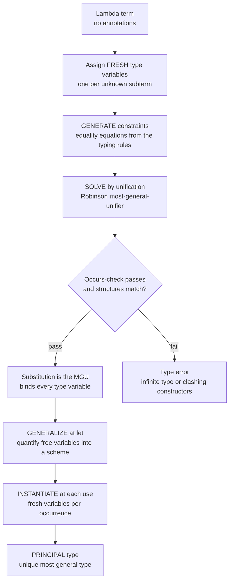

# 🕵️ Type Inference and Unification

> [!abstract] TL;DR
> **Type inference** is the theory of *reconstructing* the type of every expression purely from how values are **used** — no annotations required, yet full static safety kept. Its algorithmic engine is **unification**: given two type terms, find the substitution that makes them syntactically equal. The celebrated sweet spot is the **Hindley-Milner (HM)** type system — the largest fragment of System F for which inference stays **decidable** and every well-typed term has a unique **principal (most-general) type**. HM combines **parametric polymorphism** with **fully automatic** inference; its distinctive feature is **let-polymorphism** (generalize a `let`-bound type into a `∀`-scheme, instantiate it freshly at each use). Modern presentations split the work into **constraint generation** (walk the term, emit equality equations) and **constraint solving** (unify). This is the *theory* behind ML, Haskell, and OCaml's annotation-free code, and the local inference in Rust, Swift, and TypeScript. It is the science; the compiler-pass view lives in [[Type_Inference_and_Hindley_Milner]].

---

## Intuition

**Analogy — a detective who is never told the answer.** A good detective walks into a room and deduces facts no one stated aloud. She sees mud on a boot and concludes it rained; she sees two teacups and concludes there was a guest. She never asks "please confirm it rained" — she *reconstructs* the truth from evidence, and she reports the *most general* conclusion the evidence supports, nothing narrower.

Type inference is exactly this detective work applied to code:

- The compiler sees `x + 1`. Nobody told it what `x` is — but `+` demands numbers, so it concludes **x is a number**.
- It sees the result of `f(x)` used where a string is expected, so it concludes **f returns strings**.
- It sees `\x -> x` with no annotations and concludes the *most general* type possible: `a -> a` — identity works for **any** type `a`, so committing to `Int -> Int` would be a needlessly narrow guess.

From nothing but the *shape of usage*, the compiler rebuilds every type. **Unification** is the deduction engine that solves the resulting web of equations: each clue is an equation between type terms ("whatever `f` is, it takes an `Int` and returns something"), and unification finds the single most-general assignment of unknowns that satisfies them all — or proves the clues contradict each other, which is a type error. You get static checking, generics, and IDE autocomplete without writing a single type.

---

## How It Works

### Core mechanics

Inference in the HM tradition is best understood as a **generate-then-solve** pipeline. Milner's original **Algorithm W** fuses these into a single recursive pass; the modern **constraint-based** view separates them, and both provably yield the same principal type. The theory is cleaner separated, so:

1. **Assign fresh type variables.** Every unknown — each lambda parameter, each intermediate result — gets a brand-new placeholder `t0, t1, t2, …`. These are the "suspects" whose identity must be deduced.

2. **Generate constraints.** Each syntactic form contributes an *equation between types*, dictated by the typing rules of the underlying **typed lambda calculus** — the algorithm is **syntax-directed** (one rule per node shape):
   - A variable `x` has whatever type the environment binds it to (a monomorphic type, or a **scheme** that gets instantiated).
   - An abstraction `\x -> body` gets type `tx -> tbody`, with `tx` fresh and `body` typed under `x : tx`.
   - An **application** `f a` is the workhorse: give `f` type `tf`, `a` type `ta`, invent a fresh result `tr`, and emit the constraint **`tf = ta -> tr`** — "whatever `f` is, it must be a function from `a`'s type to something."

3. **Solve by unification.** **Robinson's unification algorithm** takes the equation set and computes the **most general unifier (MGU)**: a substitution that makes both sides of every equation structurally identical, and is *most general* in that any other unifier factors through it. It recurses on structure (`A -> B` unifies with `C -> D` iff `A=C` and `B=D`), binds variables to types, and clashes (`Int` vs `Bool`, arrow vs base) are type errors. The critical guard is the **occurs-check**: refusing to bind `a := a -> b`, which would build an **infinite/cyclic type**. This is exactly what rejects self-application `\x -> x x`.

Two further moves give HM its polymorphism:

- **Generalization (let-polymorphism).** At a `let` binding, take the solved type and **universally quantify** the type variables that are *not free in the surrounding environment*, producing a **type scheme** `∀a. a -> a`. This is why `let id = \x -> x` can be used at both `Int -> Int` and `Bool -> Bool` in one program. Crucially, **lambda parameters are never generalized** — that deliberate restriction (rank-1, "prenex" quantification only) is what keeps HM inference decidable.
- **Instantiation.** Each *use* of a scheme replaces its quantified variables with **fresh** ones, so distinct call sites never interfere.

**The MGU and the principal type coincide:** because unification always returns the *most general* solution, the type read off from it is the **principal type** — the unique most-general type of which every other valid typing is an instance. This existence-of-principal-types property is precisely what makes annotation-free inference **complete** (it finds a type whenever one exists) and predictable.

**Efficiency and the logic-programming connection.** Unification maintains equivalence classes of type variables, each pointing at a representative. That is exactly the [[Union_Find]] (disjoint-set) structure: following a variable's binding chain is `find`, merging two classes is `union`. The very same unification — variable binding plus occurs-check — is the execution model of **Prolog** and of resolution-based theorem proving, revealing HM's kinship with logic and constraint programming.

### Flow / architecture



---

## Key Concepts

### Secondary (intuitive)
- **Annotation vs inference** — writing `int x` yourself versus letting the compiler deduce it from usage.
- **Static safety without ceremony** — mismatches are still caught at compile time, but you rarely spell the types out.
- **Most-general beats specific** — the detective reports `a -> a`, not `Int -> Int`, because the evidence never demanded a specific type.

### Undergraduate (mechanism)
- **Type variable** — a placeholder for a not-yet-known type (`a`, `t0`).
- **Substitution** — a map from type variables to types; applying it "fills in the blanks."
- **Unification / MGU** — the algorithm that makes two type terms equal by choosing a *most general* substitution; the **occurs-check** blocks infinite types.
- **Constraint generation vs solving** — the modern split: phase one emits a bag of equality constraints from the typing rules, phase two solves them by unification; cleaner for error reporting and for adding features than one-pass **Algorithm W**.
- **Function type** — `A -> B`, right-associative; the only structured constructor needed for the pure lambda core.
- **Let-polymorphism** — generalize at `let`, instantiate at each use; lambda parameters stay monomorphic.

### Graduate (theory and frontiers)
- **Principal type theorem** — every HM-typable term has a *unique most-general* type scheme; all its typings are instances. This is the property that makes inference decidable, complete, and predictable (Hindley 1969, Damas-Milner 1982).
- **Rank-1 fragment of System F** — HM is precisely System F restricted to **prenex (rank-1) quantification**: all `∀`s sit at the top of a scheme. Full System F type inference is **undecidable** (Wells 1994); HM is the largest fragment that stays decidable *and* principal — the reason it is the practical sweet spot. *(Sibling to come: `Polymorphism_and_System_F`.)*
- **Value restriction** — with mutable references, naively generalizing any expression is unsound (a polymorphic mutable cell could be written at one type and read at another). ML restricts generalization to *syntactic values*; this couples inference with effects. *(Sibling to come: `Monads_and_Effects`.)*
- **Robinson's algorithm and resolution** — unification originated in automated theorem proving (Robinson 1965); the same engine drives logic/constraint programming. *(Sibling to come: `Logic_and_Constraint_Programming`.)*
- **Ad-hoc polymorphism** — HM does only *parametric* polymorphism; **type classes** (Haskell) and **traits** (Rust, see [[Traits_and_Generics]]) add overloading via constraint solving and dictionary passing, layered on top of HM-style inference.
- **Bidirectional type checking** — the pragmatic modern approach: alternate *checking* an expression against an expected type with *synthesizing* one from it; mixes inference with annotations at boundaries and yields far better error messages — why Rust, Swift, and TypeScript infer **locally** but demand annotations at function boundaries.

---

## Python Demo

We implement **Hindley-Milner inference** in pure Python, deliberately in the *constraint-based* style (the theory-forward complement to the single-pass Algorithm W shown in the compiler note). We (1) represent types with **type variables** and **function types**, (2) **generate** equality constraints by walking lambda terms, (3) **solve** them with **unification** — computing the most general unifier, with the **occurs-check** that forbids infinite types, (4) infer **principal types** for small terms, showing that `\x -> x x` is *rejected*, and (5) demonstrate **let-polymorphism** by generalizing identity and instantiating it independently. Finally we **visualize** the constraint set and the substitution as a **union-find-style variable-binding graph**.

```python
"""
Hindley-Milner type inference, constraint-based, in pure Python + matplotlib.

  1. Types = type variables (TVar) and constructors (TCon; '->' is the arrow).
  2. GENERATE a set of equality constraints by walking a lambda term.
  3. SOLVE by UNIFICATION -> most general unifier, with the OCCURS-CHECK.
  4. Read off the PRINCIPAL type:
        \\x -> x           gives   a -> a          (polymorphic identity)
        \\f x -> f (f x)   gives   (a -> a) -> a -> a
        \\x -> x x         FAILS the occurs-check (infinite type).
  5. LET-POLYMORPHISM: generalize id to  forall a. a -> a, instantiate twice.
  6. Visualize the constraints and the union-find-style substitution graph.

Run:  python hm_unification.py
"""
import itertools
import matplotlib.pyplot as plt

# --------------------------------------------------------------- type terms
class Type: pass

class TVar(Type):
    """A type variable: an unknown the detective must deduce (t0, t1, ...)."""
    def __init__(self, name): self.name = name
    def __repr__(self): return self.name

class TCon(Type):
    """A constructor: base types (Int, Bool) or the 2-ary arrow '->'."""
    def __init__(self, name, args=None): self.name, self.args = name, (args or [])
    def __repr__(self):
        if self.name == "->":
            a, b = self.args
            return f"({a} -> {b})"
        return self.name

def TFun(a, b): return TCon("->", [a, b])

_fresh = itertools.count()
def fresh(): return TVar(f"t{next(_fresh)}")

# --------------------------------------------------------------- lambda AST
class Var:
    def __init__(self, n): self.name = n
class Lam:
    def __init__(self, p, b): self.param, self.body = p, b
class App:
    def __init__(self, f, a): self.fn, self.arg = f, a

# ------------------------------------------------- phase 1: CONSTRAINT GEN
def generate(expr, env, cs):
    """Walk the term, assigning fresh vars and emitting equality constraints."""
    if isinstance(expr, Var):
        return env[expr.name]                        # look up bound type
    if isinstance(expr, Lam):
        tv = fresh()
        tb = generate(expr.body, {**env, expr.param: tv}, cs)
        return TFun(tv, tb)                           # \x -> body : tx -> tbody
    if isinstance(expr, App):
        tf = generate(expr.fn, env, cs)
        ta = generate(expr.arg, env, cs)
        tr = fresh()
        cs.append((tf, TFun(ta, tr)))                # the key constraint
        return tr

# ------------------------------------------------- phase 2: UNIFICATION
class UnifyError(Exception): pass

def walk(t, sub):
    """find(): follow a variable's binding chain to its representative."""
    while isinstance(t, TVar) and t.name in sub:
        t = sub[t.name]
    return t

def occurs(name, t, sub):
    """Occurs-check: does variable `name` appear inside type `t`?"""
    t = walk(t, sub)
    if isinstance(t, TVar):
        return t.name == name
    return any(occurs(name, a, sub) for a in t.args)

def unify(a, b, sub, log):
    """Bind variables so a and b become structurally equal (Robinson's MGU)."""
    a, b = walk(a, sub), walk(b, sub)
    if isinstance(a, TVar) and isinstance(b, TVar) and a.name == b.name:
        return
    if isinstance(a, TVar):
        if occurs(a.name, b, sub):
            raise UnifyError(f"occurs-check: {a.name} occurs in {b}  ->  infinite type")
        sub[a.name] = b; log.append((a.name, b)); return   # union()
    if isinstance(b, TVar):
        unify(b, a, sub, log); return
    if a.name != b.name or len(a.args) != len(b.args):
        raise UnifyError(f"cannot unify {a} with {b}")
    for x, y in zip(a.args, b.args):                       # arrow vs arrow
        unify(x, y, sub, log)

def solve(constraints, log):
    sub = {}
    for l, r in constraints:
        unify(l, r, sub, log)
    return sub

def resolve(t, sub):
    """Apply the full substitution to obtain the final solved type."""
    t = walk(t, sub)
    if isinstance(t, TCon):
        return TCon(t.name, [resolve(a, sub) for a in t.args])
    return t

def pretty(t, m):
    """Rename internal vars t0,t1,... to friendly a,b,c,... for display."""
    if isinstance(t, TVar):
        m.setdefault(t.name, chr(ord("a") + len(m)))
        return m[t.name]
    if t.name == "->":
        left, right = t.args
        ls = pretty(left, m)
        if isinstance(left, TCon) and left.name == "->":
            ls = f"({ls})"
        return f"{ls} -> {pretty(right, m)}"
    return t.name

def infer(name, expr):
    cs, log = [], []
    try:
        t = generate(expr, {}, cs)
        sub = solve(cs, log)
        principal = pretty(resolve(t, sub), {})
        print(f"{name:<18}::  {principal}")
        return principal, cs, log
    except UnifyError as e:
        print(f"{name:<18}::  TYPE ERROR -- {e}")
        return None, cs, log

# --------------------------------------------------------------- run it
identity = Lam("x", Var("x"))                                   # \x -> x
twice    = Lam("f", Lam("x", App(Var("f"), App(Var("f"), Var("x")))))  # \f x -> f (f x)
selfapp  = Lam("x", App(Var("x"), Var("x")))                   # \x -> x x  (bad)

print("Inferred principal types:")
infer("\\x -> x",         identity)
_, cs, log = infer("\\f x -> f (f x)", twice)
infer("\\x -> x x",       selfapp)

# --------------------------------------------------------------- let-polymorphism
def free_vars(t, sub):
    t = walk(t, sub)
    if isinstance(t, TVar): return {t.name}
    out = set()
    for a in t.args: out |= free_vars(a, sub)
    return out

def instantiate(t):
    """Replace every variable in a scheme's body with a fresh one."""
    mapping = {}
    def go(t):
        if isinstance(t, TVar):
            mapping.setdefault(t.name, fresh())
            return mapping[t.name]
        return TCon(t.name, [go(a) for a in t.args])
    return go(t)

id_type = resolve(generate(identity, {}, []), {})              # t? -> t?  (same var)
scheme_vars = free_vars(id_type, {})                           # generalize: all free vars
i1, i2 = instantiate(id_type), instantiate(id_type)           # two independent uses
print("\nLet-polymorphism:")
print(f"  generalize id  ->  forall {','.join(sorted(pretty(TVar(v),{}) for v in scheme_vars))}. "
      f"{pretty(id_type, {})}")
print(f"  instance 1     ->  {i1!r}   (fresh vars)")
print(f"  instance 2     ->  {i2!r}   (independent of instance 1)")

# --------------------------------------------------------------- visualization
def visualize(title, constraints, log, principal, filename="hm_unification.png"):
    fig, (ax1, ax2) = plt.subplots(1, 2, figsize=(13, 5))

    # Panel 1: the GENERATED constraint set + the substitution log.
    ax1.axis("off")
    ax1.set_title("Generate then solve", fontsize=13, weight="bold")
    lines = [f"term:  {title}", "", "constraints  (phase 1):"]
    for l, r in constraints:
        lines.append(f"    {l}  =  {r}")
    lines += ["", "unifier  (phase 2):"]
    for v, b in log:
        lines.append(f"    {v}  :=  {b}")
    lines += ["", f"principal type:  {principal}"]
    ax1.text(0.02, 0.98, "\n".join(lines), va="top", ha="left",
             family="monospace", fontsize=12, transform=ax1.transAxes)

    # Panel 2: substitution as a union-find graph (follow arrows to the sink).
    ax2.axis("off")
    ax2.set_title("Substitution graph\n(same shape as Union-Find)",
                  fontsize=13, weight="bold")
    nodes, edges, annot = [], [], {}
    for v, b in log:
        if v not in nodes: nodes.append(v)
        if isinstance(b, TVar):
            if b.name not in nodes: nodes.append(b.name)
            edges.append((v, b.name))               # var := var -> a real edge
        else:
            annot[v] = str(b)                        # var := structured type
    pos = {n: (2 * i, 0) for i, n in enumerate(sorted(nodes))}
    for n, (x, y) in pos.items():
        is_sink = all(a != n for a, _ in edges)      # class representative
        ax2.scatter([x], [y], s=1900,
                    c=("#ffe0b0" if is_sink else "#cfe8ff"),
                    edgecolors="#1f6fb2", linewidths=2, zorder=3)
        ax2.text(x, y, n, ha="center", va="center", fontsize=13, weight="bold", zorder=4)
        if n in annot:
            ax2.text(x, y + 0.85, f"{n} := {annot[n]}", ha="center",
                     fontsize=11, color="#a33", zorder=4)
    for a, b in edges:
        (xa, ya), (xb, yb) = pos[a], pos[b]
        ax2.annotate("", xy=(xb, yb), xytext=(xa, ya),
                     arrowprops=dict(arrowstyle="->", color="#1f6fb2", lw=2.2,
                                     shrinkA=26, shrinkB=26), zorder=2)
    if pos:
        xs = [p[0] for p in pos.values()]
        ax2.set_xlim(min(xs) - 2, max(xs) + 2)
    ax2.set_ylim(-1.5, 1.8)
    ax2.text(0.5, -0.04, "orange = class representative  |  arrow = a binding; "
             "following arrows to the sink is find()",
             ha="center", va="top", fontsize=9, color="#555", transform=ax2.transAxes)

    plt.tight_layout()
    plt.savefig(filename, dpi=120)
    print(f"\nsaved visualization -> {filename}")
    plt.show()

visualize("\\f x -> f (f x)", cs, log, "(a -> a) -> a -> a")
```

Running it prints the reconstructed **principal types**, rejects the ill-typed term, and shows let-polymorphism at work:

```
Inferred principal types:
\x -> x           ::  a -> a
\f x -> f (f x)   ::  (a -> a) -> a -> a
\x -> x x         ::  TYPE ERROR -- occurs-check: t? occurs in (t? -> t?)  ->  infinite type

Let-polymorphism:
  generalize id  ->  forall a. a -> a
  instance 1     ->  (t? -> t?)   (fresh vars)
  instance 2     ->  (t? -> t?)   (independent of instance 1)
```

The matplotlib figure shows the two theoretical phases side by side: on the left the **generated constraint set** and the **most general unifier** that solves it, and on the right that unifier drawn as a directed graph whose "follow the arrows to the sink" structure is literally the `find` operation of [[Union_Find]].

---

## Real-World Applications

> **ML / OCaml / Haskell — the birthplace.** Milner designed HM for ML's metalanguage; OCaml and Haskell let you write entire modules with essentially **no annotations** while the compiler still guarantees full static safety and reports the most general signatures. The principal-type property is what makes those inferred signatures stable and documentable.

> **Rust and Swift — local inference.** Both use HM-descended inference *within* function bodies (`let v = Vec::new(); v.push(3)` deduces `Vec<i32>` from later usage) but deliberately **require annotations at function boundaries**, a bidirectional-checking design that keeps error messages readable. Rust's **traits** (see [[Traits_and_Generics]]) supply the ad-hoc polymorphism HM alone lacks.

> **TypeScript and Flow — retrofitting inference onto JavaScript.** TypeScript infers types for locals, return values, and generics via contextual/local inference (see [[Generics_in_TypeScript]] and [[TypeScript_Fundamentals]]), delivering dynamic-language ergonomics with a static net — a primary driver of its adoption.

> **C++ `auto`, C# `var`, Java `var`** — mainstream languages absorbed the *idea* without full HM: `auto it = m.begin();` reconstructs the iterator type so you never spell out `std::map<K,V>::iterator`.

> **Prolog and constraint solvers** — the *same* unification engine (variable binding plus occurs-check) is the execution model of logic programming, exposing HM's kinship with resolution-based automated reasoning.

---

## Common Pitfalls

- **Forgetting the occurs-check** — without it, unifying `a` with `a -> b` loops forever or builds a cyclic, infinite type. It is the check that makes `\x -> x x` a *type error* rather than a hang.
- **Generalizing lambda parameters** — only `let`-bound values may be generalized; generalizing a lambda parameter breaks soundness and pushes you into undecidable higher-rank inference. This is the subtle reason HM is *let*-polymorphic, not fully polymorphic.
- **Skipping the value restriction** — with mutable references, naively generalizing any expression is unsound (write a polymorphic cell at one type, read it at another). ML restricts generalization to *syntactic values*; ignoring this is a classic type hole.
- **Expecting inference beyond the rank-1 boundary** — higher-rank and impredicative polymorphism, and dependent types, are *undecidable* to infer. When a language "suddenly demands an annotation," you have usually crossed the HM boundary; supply the type there.
- **Trusting inferred top-level types silently** — an unannotated function is inferred *as general as the evidence allows*, which may be broader or narrower than you intended, and a wrong type propagates far before erroring. Annotate public signatures as documentation and as an error-localization anchor.
- **Cryptic "action at a distance" errors** — a unification failure is reported at the *conflict site*, often far from the real mistake, because inference threads a variable through the whole term before two clues collide. This is why modern designs favor bidirectional checking and local inference for better blame assignment.

---

## Related Concepts

- [[Type_Inference_and_Hindley_Milner]] — the **compiler-pass** view of this same theory: how inference is implemented as a semantic-analysis stage, with Algorithm W in one pass.
- [[The_Lambda_Calculus]] — the syntax-directed calculus that inference is defined over; typing rules follow its `Var`/`Lam`/`App` structure.
- [[Type_Checking_and_Type_Systems]] — the *checking* counterpart to *reconstruction*; bidirectional systems interleave the two.
- [[Union_Find]] — the disjoint-set structure that makes unification near-linear; a variable's binding chain is a `find`, merging classes is a `union`.
- [[Recursive_Functions_and_Lambda_Calculus]] — the computability roots and the Curry-Howard correspondence (types as propositions) that types over lambda terms rest on.
- [[Traits_and_Generics]] — Rust traits add the **ad-hoc polymorphism** (overloading) that pure parametric HM lacks, via constraint dictionaries.
- [[Generics_in_TypeScript]] — parametric polymorphism and **local/contextual inference** in a mainstream, gradually-typed language.
- [[TypeScript_Fundamentals]] — how a dynamic language retrofits static inference for "types you don't have to write."
- [[Programming_Language_Theory_Overview]] — the parent map placing inference within the type-systems layer of PLT.

*(PLT siblings referenced in prose but not yet built — link when created: `Type_Systems_Fundamentals` for the goal of static safety without annotation burden, `Polymorphism_and_System_F` for the rank-1 fragment and generalization/instantiation, `Simply_Typed_Lambda_Calculus` for the monomorphic base, `Functional_Programming_Foundations` and `Monads_and_Effects` for type classes and the value restriction, and `Logic_and_Constraint_Programming` for unification's origin in resolution and Prolog.)*

---

## Review Questions

1. **(Secondary)** For `let id = \x -> x`, the compiler infers `a -> a` with no annotation. In one sentence, what does the "detective" observe that lets it conclude this, and why is `a -> a` a *better* answer than guessing `Int -> Int`?
2. **(Undergraduate)** Walk through unifying `t0 -> t1` with `Int -> (Bool -> t2)`: which variables get bound to what? Then explain what the **occurs-check** does when you instead try to unify `t0` with `t0 -> Bool`, and name the exact program that rejects.
3. **(Graduate)** HM is the **rank-1 fragment** of System F and generalizes only at `let`, never at lambda parameters. (a) Why is the rank-1 restriction essential for keeping inference decidable and principal, given that full System F inference is undecidable? (b) Give a term that requires higher-rank polymorphism and is therefore *un-inferable* in HM. (c) Explain why the **value restriction** becomes necessary once mutable references are added, with a concrete unsoundness it prevents.

---

## Sources

- J. A. Robinson, "A Machine-Oriented Logic Based on the Resolution Principle," *Journal of the ACM* 12(1), 1965 — the origin of unification and the most-general-unifier. https://doi.org/10.1145/321250.321253
- Robin Milner, "A Theory of Type Polymorphism in Programming," *J. Computer and System Sciences* 17(3), 1978 — the HM system and *"well-typed programs don't go wrong."* https://doi.org/10.1016/0022-0000(78)90014-4
- Luis Damas & Robin Milner, "Principal Type-Schemes for Functional Programs," *POPL*, 1982 — Algorithm W and the principal-types theorem. https://dl.acm.org/doi/10.1145/582153.582176
- Benjamin C. Pierce, *Types and Programming Languages*, MIT Press, 2002, Ch. 22 "Type Reconstruction." https://www.cis.upenn.edu/~bcpierce/tapl/
- François Pottier & Didier Rémy, "The Essence of ML Type Inference," in *Advanced Topics in Types and Programming Languages*, MIT Press, 2005 — the constraint-based (generate-then-solve) formulation. http://cristal.inria.fr/~fpottier/publis/emlti-final.pdf

---

#programming-language-theory #type-inference #hindley-milner #unification #principal-types
