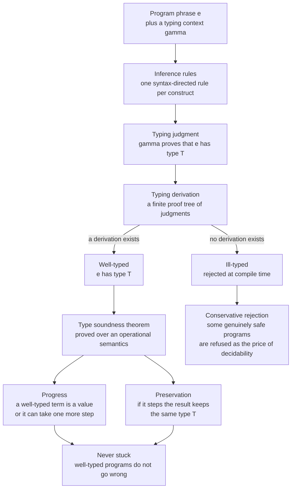

# 🧮 Type Systems Fundamentals

> [!abstract] TL;DR
> A **type system** is a *syntactic, decidable, conservative* discipline that classifies every program phrase by the **kind of value it computes** and constrains how those phrases combine — a lightweight **formal method** that proves the *absence* of whole categories of runtime errors *before* the program ever runs. Its machinery is the **typing judgment** `Γ ⊢ e : T` ("in context Γ, expression `e` has type `T`"), defined **inductively** by syntax-directed **inference rules**, one per construct; a proof built from those rules is a **typing derivation**. Its central guarantee is **type soundness**: well-typed programs never get *stuck*, proved by two lemmas — **progress** (a well-typed term is a value or can step) and **preservation** (stepping keeps it well-typed at the same type). This is Robin Milner's slogan, **"well-typed programs don't go wrong,"** made precise. This note opens the PLT **Type Systems** section; it is the *theory* companion to the compiler-side [[Type_Checking_and_Type_Systems]], which covers the *implementation*.

---

## Intuition

**Analogy — a proof-checker running quietly in the background as you type.** Every time you write an expression, an invisible mathematician looks over your shoulder and tracks the **kind of thing** each value is: this is a *number*, that is a *string*, this over here is a *function that turns an int into a bool*. The mathematician does not run your program — they *reason about it symbolically* — and they refuse to let you write something that would misuse a value: you cannot add a number to a truth-value, you cannot *call* something that is not a function, you cannot ask an `if` to branch on something that is not a condition. The moment you try, the check fails and the program is rejected **before it ever executes**. That background proof-checker is a type system, and each rejection is a *missing proof* — there simply is no valid derivation for the nonsense you wrote.

The trade is deliberate and mathematical. The type system takes away a little freedom — some programs that would *happen* to run fine on a given input are still refused, because the checker cannot *prove* they are safe for **all** inputs. In exchange it hands you a guarantee no amount of testing can give: an entire class of bugs is not merely *unlikely* but **impossible to express**. That is the whole bargain of typing — a small, decidable, conservative loss of expressiveness bought back as a *theorem* about your program. Milner's phrase for the theorem is **"well-typed programs don't go wrong."** The rest of this note names the machinery that makes the slogan true.

---

## How It Works

### 1. What a type system *is* — four load-bearing adjectives

A type system is not "the set of types a language has." Formally it is a **relation between programs and types**, and four adjectives pin down what makes it a *type system* rather than an arbitrary program analysis:

- **Syntactic.** Types are assigned by rules that recurse over the *shape* of the program phrase (its abstract syntax), not by running it. The check is a structural walk, not an execution. *(This is why syntax comes first in PLT; see the sibling `Formal_Syntax_and_Grammars` and [[Programming_Language_Theory_Overview]].)*
- **Decidable.** Type checking always *terminates* with a yes/no answer. This is a hard design constraint, and it is exactly what separates a type system from full program verification (which is undecidable in general — the [[The_Halting_Problem_and_Undecidability|halting problem]] and Rice's theorem sit right behind this wall).
- **Conservative (sound but incomplete).** Because it must be decidable and must never *accept* a bad program, a good type system will sometimes **reject a program that would actually have been safe**. It errs on the side of caution. `if false then (1 + true) else 0` never evaluates the bad branch, yet a standard checker still rejects it.
- **Static (a lightweight formal method).** It proves a property — the *absence* of certain runtime errors — over *all* executions, from the text alone, cheaply, and automatically. It does not prove your program computes the *right* answer; it proves it will not commit specific *type errors* (adding a bool to a function, dereferencing a non-pointer, calling a non-function).

Put together: a type system is a **decidable, conservative, syntactic proof method** for a fixed family of safety properties. That is Milner's slogan in adjectives.

### 2. Judgments, rules, and derivations — the inductive core

The entire discipline is built from one shape of statement, the **typing judgment**:

$$\Gamma \vdash e : T$$

read *"under the typing context `Γ` — a finite map from free variables to their types — the expression `e` has type `T`."* The context `Γ` (the **type environment**) is what lets us type *open* terms with free variables; a closed program is typed under the empty context.

The judgment is defined **inductively** by **inference rules**, written as premises over a line and a conclusion beneath it — *exactly* the notation of natural deduction (the same inference-rule format used for operational semantics and grammars). There is **one syntax-directed rule per construct**:

```text
                                      x:T ∈ Γ
 ─────────────  (T-Int)          ─────────────── (T-Var)
 Γ ⊢ n : Int                        Γ ⊢ x : T

 Γ ⊢ e₁ : Int   Γ ⊢ e₂ : Int             Γ ⊢ e₁ : Int   Γ ⊢ e₂ : Int
 ─────────────────────────── (T-Arith)   ─────────────────────────── (T-Cmp)
      Γ ⊢ e₁ + e₂ : Int                       Γ ⊢ e₁ ≤ e₂ : Bool

 Γ ⊢ c : Bool   Γ ⊢ e₁ : T   Γ ⊢ e₂ : T        Γ, x:A ⊢ b : B
 ────────────────────────────────────── (T-If)  ───────────────────── (T-Abs)
      Γ ⊢ if c then e₁ else e₂ : T             Γ ⊢ (λx:A. b) : A → B

 Γ ⊢ f : A → B    Γ ⊢ a : A
 ────────────────────────── (T-App)
       Γ ⊢ f a : B
```

To **read** a rule: "*if* every judgment above the line holds, *then* the judgment below holds." To **apply** a type system to a term, you build a proof tree — a **typing derivation** — whose root is the judgment you want and whose leaves are axioms (rules with no premises, like `T-Int`). A term is **well-typed** exactly when such a derivation *exists*. The bite of the system is in the *absence* of derivations: for `1 + true` there is **no** way to complete `T-Arith`, because its right premise `Γ ⊢ true : Int` is underivable — and *that missing derivation is the type error*. Because the rules are syntax-directed, a type checker is just the **executable form of this search**: recurse into subterms, obtain their types, apply the one matching rule, succeed with a type or fail with the offending rule.

### 3. Type soundness — the theorem that makes it all worth trusting

A type system earns its keep only if it is **sound**: if the checker accepts a program, execution genuinely will not hit a type error. Soundness is stated *relative to an operational semantics* (a step relation `e → e'` and a notion of *value* and *stuck*), and it is proved by the **Wright–Felleisen syntactic method** — two lemmas that interlock:

- **Progress.** If `⊢ e : T`, then `e` is either a **value** or there exists `e'` with `e → e'`. A well-typed term is *never stuck*: it has not finished, but it can always take the next step. Progress rules out reaching a nonsensical, meaning-less configuration like `true + 3` or `5 applied to an argument`.
- **Preservation (subject reduction).** If `⊢ e : T` and `e → e'`, then `⊢ e' : T`. Evaluation never changes a term's type out from under it; the type is an **invariant** of the whole reduction sequence.

Chain them by induction on the number of steps: a well-typed term steps only to well-typed terms (preservation), each of which is again a value or can step (progress), so **it can never reach a stuck state**. That is the formal content of **"well-typed programs don't go wrong."** Note the shape of the argument — it is *induction over evaluation*, and it depends on the [[Reduction_Strategies_and_Evaluation_Order|evaluation order]] the semantics fixes, which is why type theory and operational semantics are studied together *(sibling: `Operational_Semantics`)*.

### 4. The design axes every type system is placed on

- **Static vs dynamic** — checked at *compile time* from the text (C, Rust, Haskell, TypeScript) versus tagged on *values at runtime* and checked as operations execute (Python, JavaScript). Static buys early errors, type-driven optimization, and machine-checked documentation; dynamic buys flexibility and brevity. It is a **spectrum**, not a binary — *gradual typing* deliberately mixes the two so a codebase can add types incrementally *(sibling: `Gradual_and_Optional_Typing`)*.
- **Checking vs inference vs reconstruction** — *checking* verifies a term against annotations you wrote; *inference/reconstruction* **deduces** the omitted types by solving constraints (unification). Hindley–Milner infers the *most general* type with **zero annotations** *(sibling: `Type_Inference_and_Unification`; the algorithmic engineering is [[Type_Inference_and_Hindley_Milner]])*.
- **Intrinsic (Church) vs extrinsic (Curry)** — in the **Church** view types are *part of the term* (`λx:Int. x`); an untyped term has no independent existence. In the **Curry** view types are a *predicate assigned to an untyped term* (`λx. x` is separately shown to have type `A → A` for every `A`). The distinction shapes how polymorphism and subtyping are formulated.

### 5. Decidability vs expressiveness — the eternal tension

A designer wants three things at once: **sound**, **decidable**, and **expressive** (able to type as many safe programs as possible). You *cannot* have full expressiveness *and* decidability — deciding whether an arbitrary program is "safe" is undecidable by [Rice's theorem](obsidian://) and the [[The_Halting_Problem_and_Undecidability|halting]] wall (see also [[Reductions_and_Undecidable_Problems]] and [[Decidability_and_Recognizability]]). So every type system makes a **conservative tradeoff**: keep soundness and decidability, and accept that some safe programs are rejected. The whole history of type theory is climbing the **expressiveness ladder** while staying decidable:

- **Simple types** — `Int`, `Bool`, `A → B` *(sibling: `Simply_Typed_Lambda_Calculus`)*.
- **Parametric polymorphism** — `∀a. a → a`; one definition, all types *(sibling: `Polymorphism_and_System_F`)*.
- **Subtyping and variance** — `Cat <: Animal`; where may a subtype stand in? *(sibling: `Subtyping_and_Variance`)*.
- **Dependent types** — types that mention *values* (`Vector n`), expressive enough to state arbitrary specifications, at the cost of decidability for full inference *(sibling: `Dependent_Types_and_Advanced_Type_Systems`)*.

### 6. The Curry–Howard preview

The deepest reason typing works: under the **Curry–Howard correspondence**, **types *are* propositions and well-typed programs *are* proofs**. A function type `A → B` is the implication "A implies B"; a value of that type is a *constructive proof* of the implication; and **type checking is literally proof checking** (see [[Proof_Theory_and_Natural_Deduction]] and, for the categorical third leg, [[Category_Theory]]). This is why the same inference-rule engine that checks your code is the engine inside proof assistants like Coq and Lean *(sibling: `The_Curry_Howard_Correspondence`)*.

### Flow / Architecture



---

## Key Concepts

### Secondary (explain to a curious beginner)
- A **type** is a promise about a value — "this is a number, that is a yes/no" — and a type system is the rulebook for which promises may be combined.
- The checker refuses a program *before it runs* if any promise is broken, so a whole family of bugs becomes **impossible to write**, not merely unlikely.
- To gain that guarantee the checker is *cautious*: it will sometimes reject a program that would have been fine, because it cannot *prove* it safe.

### Undergraduate (requires a CS background)
- The **typing judgment** `Γ ⊢ e : T` and the **inference rules** (`T-Int`, `T-Var`, `T-Arith`, `T-If`, `T-Abs`, `T-App`) that define it inductively; a **derivation** is the proof tree, and a *missing* derivation *is* the type error.
- **Type soundness = progress + preservation** (the Wright–Felleisen recipe over a small-step semantics); a **stuck** term is one that is neither a value nor able to step — exactly what soundness forbids.
- **Static vs dynamic**, **checking vs inference**, **intrinsic (Church) vs extrinsic (Curry)** as independent design axes.
- **Conservativity**: soundness forces incompleteness, so the checker rejects some safe programs — a decidability tax, not a bug.

### Graduate (system-level / foundational thinking)
- Why **decidability + soundness + full expressiveness** is impossible together (Rice's theorem), and how systems trade along the expressiveness ladder: simple → **System F** polymorphism → subtyping/variance → **dependent types**.
- **Preservation subtleties**: substitution and weakening lemmas, the need for a *canonical-forms* lemma to prove progress, and why call-by-value vs call-by-name changes the proof obligations.
- **Curry–Howard–Lambek**: intuitionistic propositional logic ≅ simply-typed lambda calculus ≅ cartesian closed categories, so type checking *is* proof checking and **strong normalization** of the STLC corresponds to *cut elimination*.
- **Parametricity** ("theorems for free," Reynolds/Wadler): a polymorphic *type* alone constrains behavior tightly enough to prove theorems about every inhabitant.

---

## Python Demo

We build the background proof-checker itself: a **type checker as an inference-rule engine** for a small typed expression language. It (1) carries a typing context `Γ`, (2) has types `Int`, `Bool`, and function types `Fun`, and (3) is a recursive `typecheck(gamma, e)` implementing `T-Int`, `T-Var`, `T-Arith`, `T-Cmp`, `T-If`, `T-Abs`, `T-App`. It **accepts** well-typed programs and **rejects** ill-typed ones (`1 + true`, a non-Bool condition, applying a non-function, an argument-type mismatch) naming the **failing rule**. Then it **demonstrates soundness empirically**: it generates many *random well-typed* terms, evaluates them under a small-step semantics, and shows they **never get stuck**; then it **corrupts** each into an ill-typed twin and shows those *can* get stuck at runtime — while the checker rejects every one. Finally it **visualizes a typing derivation tree** alongside the soundness experiment. Pure stdlib plus matplotlib.

```python
# A type checker as an INFERENCE-RULE ENGINE for a tiny typed language, plus an
# empirical soundness demo (well-typed terms never get "stuck"; ill-typed ones can).
import copy, random
from dataclasses import dataclass
import matplotlib.pyplot as plt

# ---------- TYPES: Int | Bool | Fun(arg, ret) ----------
@dataclass(frozen=True)
class TInt:  pass
@dataclass(frozen=True)
class TBool: pass
@dataclass(frozen=True)
class TFun:
    arg: object
    ret: object

def type_str(t):
    if isinstance(t, TInt):  return "Int"
    if isinstance(t, TBool): return "Bool"
    if isinstance(t, TFun):  return f"({type_str(t.arg)} -> {type_str(t.ret)})"
    return "?"

# ---------- EXPRESSION AST ----------
@dataclass
class Lit:   n: int                       # integer literal
@dataclass
class BLit:  b: bool                       # boolean literal
@dataclass
class Var:   name: str                     # variable
@dataclass
class Arith: op: str; l: object; r: object # + - *   : Int x Int -> Int
@dataclass
class Cmp:   op: str; l: object; r: object # < <= == : Int x Int -> Bool
@dataclass
class If:    c: object; t: object; e: object
@dataclass
class Lam:   param: str; param_ty: object; body: object
@dataclass
class App:   f: object; a: object

def expr_str(e):
    if isinstance(e, Lit):   return str(e.n)
    if isinstance(e, BLit):  return "true" if e.b else "false"
    if isinstance(e, Var):   return e.name
    if isinstance(e, Arith): return f"{expr_str(e.l)} {e.op} {expr_str(e.r)}"
    if isinstance(e, Cmp):   return f"{expr_str(e.l)} {e.op} {expr_str(e.r)}"
    if isinstance(e, If):    return f"if {expr_str(e.c)} then {expr_str(e.t)} else {expr_str(e.e)}"
    if isinstance(e, Lam):   return f"\\{e.param}:{type_str(e.param_ty)}.{expr_str(e.body)}"
    if isinstance(e, App):   return f"({expr_str(e.f)}) {expr_str(e.a)}"

# ---------- DERIVATIONS: a proof tree of judgments gamma |- e : T ----------
@dataclass
class Deriv:
    rule: str
    judgment: str
    ty: object
    premises: list

class IllTyped(Exception):
    def __init__(self, rule, msg):
        super().__init__(msg); self.rule, self.msg = rule, msg

def ctx_str(g):
    return "{}" if not g else ", ".join(f"{k}:{type_str(v)}" for k, v in g.items())

def judg(g, e, t):
    return f"{ctx_str(g)} |- {expr_str(e)} : {type_str(t)}"

# ---------- THE TYPE CHECKER: one clause per inference rule ----------
def typecheck(gamma, e):
    if isinstance(e, Lit):                                        # T-Int
        return Deriv("T-Int", judg(gamma, e, TInt()), TInt(), [])
    if isinstance(e, BLit):                                       # T-Bool
        return Deriv("T-Bool", judg(gamma, e, TBool()), TBool(), [])
    if isinstance(e, Var):                                        # T-Var
        if e.name not in gamma:
            raise IllTyped("T-Var", f"unbound variable '{e.name}'")
        return Deriv("T-Var", judg(gamma, e, gamma[e.name]), gamma[e.name], [])
    if isinstance(e, Arith):                                      # T-Arith: Int x Int -> Int
        dl, dr = typecheck(gamma, e.l), typecheck(gamma, e.r)
        if not (isinstance(dl.ty, TInt) and isinstance(dr.ty, TInt)):
            raise IllTyped("T-Arith",
                f"'{e.op}' needs Int and Int, found {type_str(dl.ty)} and {type_str(dr.ty)}")
        return Deriv("T-Arith", judg(gamma, e, TInt()), TInt(), [dl, dr])
    if isinstance(e, Cmp):                                        # T-Cmp: Int x Int -> Bool
        dl, dr = typecheck(gamma, e.l), typecheck(gamma, e.r)
        if not (isinstance(dl.ty, TInt) and isinstance(dr.ty, TInt)):
            raise IllTyped("T-Cmp",
                f"'{e.op}' needs Int and Int, found {type_str(dl.ty)} and {type_str(dr.ty)}")
        return Deriv("T-Cmp", judg(gamma, e, TBool()), TBool(), [dl, dr])
    if isinstance(e, If):                                         # T-If
        dc = typecheck(gamma, e.c)
        if not isinstance(dc.ty, TBool):
            raise IllTyped("T-If", f"condition must be Bool, found {type_str(dc.ty)}")
        dt, de = typecheck(gamma, e.t), typecheck(gamma, e.e)
        if dt.ty != de.ty:
            raise IllTyped("T-If",
                f"branches disagree: then is {type_str(dt.ty)}, else is {type_str(de.ty)}")
        return Deriv("T-If", judg(gamma, e, dt.ty), dt.ty, [dc, dt, de])
    if isinstance(e, Lam):                                        # T-Abs
        g2 = dict(gamma); g2[e.param] = e.param_ty
        db = typecheck(g2, e.body)
        t = TFun(e.param_ty, db.ty)
        return Deriv("T-Abs", judg(gamma, e, t), t, [db])
    if isinstance(e, App):                                        # T-App
        df, da = typecheck(gamma, e.f), typecheck(gamma, e.a)
        if not isinstance(df.ty, TFun):
            raise IllTyped("T-App", f"cannot apply a non-function of type {type_str(df.ty)}")
        if df.ty.arg != da.ty:
            raise IllTyped("T-App",
                f"argument mismatch: expected {type_str(df.ty.arg)}, got {type_str(da.ty)}")
        return Deriv("T-App", judg(gamma, e, df.ty.ret), df.ty.ret, [df, da])
    raise IllTyped("?", "unknown expression form")

# ---------- OPERATIONAL SEMANTICS: small-step, so "stuck" is observable ----------
class Stuck(Exception): pass

def is_value(e): return isinstance(e, (Lit, BLit, Lam))

def subst(e, x, v):                       # capture-avoiding enough for our closed terms
    if isinstance(e, Var):   return v if e.name == x else e
    if isinstance(e, (Lit, BLit)): return e
    if isinstance(e, Arith): return Arith(e.op, subst(e.l, x, v), subst(e.r, x, v))
    if isinstance(e, Cmp):   return Cmp(e.op, subst(e.l, x, v), subst(e.r, x, v))
    if isinstance(e, If):    return If(subst(e.c, x, v), subst(e.t, x, v), subst(e.e, x, v))
    if isinstance(e, App):   return App(subst(e.f, x, v), subst(e.a, x, v))
    if isinstance(e, Lam):   return e if e.param == x else Lam(e.param, e.param_ty, subst(e.body, x, v))

def step(e):                              # ONE rewrite; raise Stuck if no rule applies
    if isinstance(e, Arith):
        if not is_value(e.l): return Arith(e.op, step(e.l), e.r)
        if not is_value(e.r): return Arith(e.op, e.l, step(e.r))
        if isinstance(e.l, Lit) and isinstance(e.r, Lit):
            a, b = e.l.n, e.r.n
            return Lit({"+": a + b, "-": a - b, "*": a * b}[e.op])
        raise Stuck("arithmetic on a non-integer")           # e.g. 1 + true
    if isinstance(e, Cmp):
        if not is_value(e.l): return Cmp(e.op, step(e.l), e.r)
        if not is_value(e.r): return Cmp(e.op, e.l, step(e.r))
        if isinstance(e.l, Lit) and isinstance(e.r, Lit):
            a, b = e.l.n, e.r.n
            return BLit({"<": a < b, "<=": a <= b, "==": a == b}[e.op])
        raise Stuck("comparison on a non-integer")
    if isinstance(e, If):
        if not is_value(e.c): return If(step(e.c), e.t, e.e)
        if isinstance(e.c, BLit): return e.t if e.c.b else e.e
        raise Stuck("if-condition is not a boolean")          # e.g. if 3 then ...
    if isinstance(e, App):
        if not is_value(e.f): return App(step(e.f), e.a)
        if not is_value(e.a): return App(e.f, step(e.a))
        if isinstance(e.f, Lam): return subst(e.f.body, e.f.param, e.a)
        raise Stuck("applying a non-function")                # e.g. (5) 3
    if isinstance(e, Var): raise Stuck(f"free variable '{e.name}'")
    raise Stuck("no rule applies")

def evaluate(e, fuel=10000):
    for _ in range(fuel):
        if is_value(e): return ("value", e)
        e = step(e)                       # may raise Stuck
    return ("diverged", e)

def classify(e):
    try:
        return evaluate(copy.deepcopy(e))[0]     # "value" | "diverged"
    except Stuck:
        return "stuck"

# ---------- RANDOM WELL-TYPED TERM GENERATOR (ground types Int / Bool) ----------
def gen(target, depth):
    kinds = ["lit"] + (["arith", "if"] if target == "Int" and depth > 0
                       else ["cmp", "if"] if target == "Bool" and depth > 0 else [])
    k = random.choice(kinds)
    if k == "lit":
        return Lit(random.randint(0, 9)) if target == "Int" else BLit(random.choice([True, False]))
    if k == "arith":
        return Arith(random.choice(["+", "-", "*"]), gen("Int", depth - 1), gen("Int", depth - 1))
    if k == "cmp":
        return Cmp(random.choice(["<", "<=", "=="]), gen("Int", depth - 1), gen("Int", depth - 1))
    return If(gen("Bool", depth - 1), gen(target, depth - 1), gen(target, depth - 1))

def corrupt(e):                           # inject exactly one type error into a copy
    sites = []
    def walk(n):
        if isinstance(n, (Arith, Cmp)):
            sites += [("int", n, "l"), ("int", n, "r")]; walk(n.l); walk(n.r)
        elif isinstance(n, If):
            sites.append(("bool", n, "c")); walk(n.c); walk(n.t); walk(n.e)
    walk(e)
    if not sites: return None
    kind, parent, attr = random.choice(sites)
    setattr(parent, attr, BLit(True) if kind == "int" else Lit(0))  # break the operand's type
    return e

# ============================ 1. ACCEPT / REJECT DEMO ============================
print("=== The checker ACCEPTS well-typed programs ===")
accepts = [
    ("if 2 <= 3 then 4 + 5 else 6",
     If(Cmp("<=", Lit(2), Lit(3)), Arith("+", Lit(4), Lit(5)), Lit(6))),
    ("(\\x:Int. x + x) 10",
     App(Lam("x", TInt(), Arith("+", Var("x"), Var("x"))), Lit(10))),
]
for label, prog in accepts:
    d = typecheck({}, prog)
    print(f"  [ACCEPT] {label:<34} : {type_str(d.ty):<5}  value = {expr_str(evaluate(prog)[1])}")

print("\n=== The checker REJECTS ill-typed programs (naming the failing rule) ===")
rejects = [
    ("1 + true",                  Arith("+", Lit(1), BLit(True))),
    ("if 3 then 1 else 0",        If(Lit(3), Lit(1), Lit(0))),
    ("(5) 3   -- call a non-fn",  App(Lit(5), Lit(3))),
    ("(\\x:Int. x) true",         App(Lam("x", TInt(), Var("x")), BLit(True))),
]
for label, prog in rejects:
    try:
        typecheck({}, prog)
        print(f"  [??] {label} unexpectedly accepted")
    except IllTyped as ex:
        print(f"  [REJECT] {label:<26} -> {ex.rule}: {ex.msg}")

# ============================ 2. SOUNDNESS EXPERIMENT ============================
random.seed(7)
N = 600
wt_stuck = wt_ok = 0                       # well-typed outcomes
il_total = il_rejected = il_stuck = il_ok = 0  # corrupted twin outcomes
for _ in range(N):
    t = gen(random.choice(["Int", "Bool"]), depth=4)
    typecheck({}, t)                       # by construction this ALWAYS succeeds
    if classify(t) == "stuck": wt_stuck += 1
    else:                      wt_ok += 1
    twin = corrupt(copy.deepcopy(t))
    if twin is None: continue
    il_total += 1
    try:
        typecheck({}, twin)                # should raise
    except IllTyped:
        il_rejected += 1
    if classify(twin) == "stuck": il_stuck += 1
    else:                         il_ok += 1

print("\n=== Empirical soundness over", N, "random terms ===")
print(f"  well-typed  : {wt_stuck} stuck / {N}            "
      f"-> {100*wt_stuck/N:.1f}% stuck   (PROGRESS + PRESERVATION => never stuck)")
print(f"  ill-typed   : {il_rejected}/{il_total} rejected by the checker, "
      f"{il_stuck}/{il_total} would get STUCK at runtime")
print(f"  ({il_ok}/{il_total} ill-typed terms happened to run fine anyway "
      f"-> the checker is CONSERVATIVE, rejecting safe programs too)")

# ============================ 3. VISUALIZE ============================
def layout(root):
    pos, c = {}, [0]
    def walk(n, d):
        ks = n.premises
        x = (sum(walk(k, d + 1) for k in ks) / len(ks)) if ks else (c[0], c.__setitem__(0, c[0] + 1))[0]
        pos[id(n)] = (x, d)
        return x
    walk(root, 0)
    return pos

fig, (ax1, ax2) = plt.subplots(1, 2, figsize=(15, 6), gridspec_kw={"width_ratios": [1.5, 1]})

# Left: a typing DERIVATION TREE (premises above, conclusion at the bottom).
example = If(Cmp("<=", Lit(2), Lit(3)), Arith("+", Lit(4), Lit(5)), Lit(6))
root = typecheck({}, example)
pos = layout(root)
def draw(n):
    x0, y0 = pos[id(n)]
    for k in n.premises:
        x1, y1 = pos[id(k)]
        ax1.plot([x0, x1], [y0 + 0.18, y1 - 0.18], color="0.6", zorder=1)
        draw(k)
    ax1.text(x0, y0, f"{n.rule}\n{n.judgment}", ha="center", va="center",
             fontsize=7, family="monospace", zorder=2,
             bbox=dict(boxstyle="round,pad=0.3", facecolor="#bbdefb", edgecolor="black"))
draw(root)
ax1.set_title("Typing derivation tree\npremises above, conclusion at the bottom", fontsize=11)
ax1.axis("off")

# Right: soundness experiment -- % of terms that get STUCK at runtime.
pct = [100 * wt_stuck / N, 100 * il_stuck / max(il_total, 1)]
bars = ax2.bar(["well-typed\n(accepted)", "ill-typed\n(rejected)"], pct,
               color=["#55A868", "#C44E52"])
for b, p in zip(bars, pct):
    ax2.text(b.get_x() + b.get_width() / 2, p + 1.5, f"{p:.0f}%", ha="center", fontweight="bold")
ax2.set_ylim(0, 100); ax2.set_ylabel("% of terms that get STUCK when evaluated")
ax2.set_title("Type soundness, empirically\nwell-typed => never stuck", fontsize=11)
ax2.text(0.5, 92, f"checker rejected {il_rejected}/{il_total} ill-typed terms",
         transform=ax2.transData, ha="center", fontsize=9, style="italic", color="#555")

fig.suptitle("A type system: derivations prove well-typedness, soundness guarantees no stuck states",
             fontsize=13)
fig.tight_layout()
plt.savefig("type_soundness.png", dpi=120)
plt.show()
```

Expected console output (seed-fixed, so the ill-typed percentages are stable):

```
=== The checker ACCEPTS well-typed programs ===
  [ACCEPT] if 2 <= 3 then 4 + 5 else 6      : Int    value = 9
  [ACCEPT] (\x:Int. x + x) 10               : Int    value = 20

=== The checker REJECTS ill-typed programs (naming the failing rule) ===
  [REJECT] 1 + true                  -> T-Arith: '+' needs Int and Int, found Int and Bool
  [REJECT] if 3 then 1 else 0        -> T-If: condition must be Bool, found Int
  [REJECT] (5) 3   -- call a non-fn  -> T-App: cannot apply a non-function of type Int
  [REJECT] (\x:Int. x) true          -> T-App: argument mismatch: expected Int, got Bool

=== Empirical soundness over 600 random terms ===
  well-typed  : 0 stuck / 600            -> 0.0% stuck   (PROGRESS + PRESERVATION => never stuck)
  ill-typed   : 600/600 rejected by the checker, ... would get STUCK at runtime
  (... ill-typed terms happened to run fine anyway -> the checker is CONSERVATIVE, rejecting safe programs too)
```

Three lessons fall out. **(1)** The checker is exactly the inference rules made executable — each rejection names the rule whose premise could not be derived. **(2)** *Soundness is not a slogan but a measurable fact*: across hundreds of random well-typed terms, **zero** ever get stuck (progress + preservation in action), while their corrupted twins — all rejected by the checker — *can* get stuck at runtime. **(3)** The gap between "rejected" (100%) and "actually stuck" (less than 100%) is **conservativity** made concrete: the type system refuses some programs that would have run fine, because it must be sound *and* decidable.

---

## Real-World Applications

> **Rust's borrow checker** is a **substructural (affine) type system** shipped as a mainstream language. Beyond ordinary types it tracks *ownership* and *lifetimes*, so "one mutable **xor** many shared references" is a *typing rule*. Progress-and-preservation-style reasoning (formalized in the RustBelt project) is what lets Rust prove *at compile time, zero runtime cost* that there are no use-after-free bugs or data races. See [[Ownership_and_Borrowing]] *(theory sibling: `Memory_and_Ownership_Models`)*.

- **TypeScript / mypy / gradual typing.** The theory of **gradual typing** (Siek & Taha) formalizes a `dynamic` type and a *consistency* relation so static and dynamic code interoperate; it is why a JavaScript or Python codebase can add types file-by-file. The soundness story weakens gracefully at the boundary rather than all-or-nothing *(sibling: `Gradual_and_Optional_Typing`)*.
- **Proof assistants (Coq, Agda, Lean, Idris).** Direct industrial use of Curry–Howard and **dependent types**: a *program* is a *proof*, a type checker is a *proof checker*. Used to build CompCert (a C compiler proven correct) and seL4 (a verified OS kernel) — the payoff of taking "types are propositions" literally.
- **Hindley–Milner inference** in ML, OCaml, Haskell, Rust, and Swift: you write almost no annotations, yet the compiler reconstructs the most general type and rejects ill-typed programs. See [[Type_Inference_and_Hindley_Milner]].
- **WebAssembly's formal spec** ships with a machine-checked **operational semantics and a type-soundness proof** — a rare industrial language designed *with* progress and preservation from day one, so any conforming engine inherits the safety theorem.
- **Java / C++ generics** bring parametric polymorphism to the mainstream, and static types drive **optimization**: knowing a value is a 64-bit `Int` lets the compiler unbox it into a register and pick the exact instruction. The engineering side of all of this is [[Type_Checking_and_Type_Systems]].

---

## Common Pitfalls

- **"Well-typed" = "correct."** Soundness only rules out the *type errors the system tracks*. A well-typed program can still compute the wrong answer, loop forever, or divide by zero (unless *that* is in the type system). Types eliminate *categories* of bugs, not all bugs.
- **"Dynamically typed" = "untyped."** Dynamic languages *have* types — they are checked on values at *runtime*. The PLT axis is *when* checking happens, not *whether* types exist. Conflating the two hides the real design space.
- **Expecting completeness.** Soundness *forces* incompleteness (a decidable, sound checker must reject some safe programs). Fighting the checker over `if false then bad else good` is fighting the fundamental decidability tax, not a bug — annotate or restructure instead.
- **Proving progress without a canonical-forms lemma.** In a soundness proof, progress needs to know that a *value* of type `Bool` is literally `true`/`false` (so `if` can step) and a value of type `A → B` is literally a `λ` (so `App` can step). Skip the canonical-forms lemma and the progress case falls apart — a classic student error.
- **Ignoring evaluation order.** Progress and preservation are stated *against a specific operational semantics*. A rule set sound for call-by-value can be unsound for call-by-name (or need extra side conditions). You cannot prove soundness without pinning the [[Reduction_Strategies_and_Evaluation_Order|reduction strategy]].
- **Unsound escape hatches presented as "typed."** Java's covariant arrays (`Object[] a = new String[1]; a[0] = 42;` throws at runtime), TypeScript's `any`, and unchecked casts are deliberate holes in the soundness theorem. "Type-checked" is not "type-safe" the moment you use one — know exactly where your language lies.

---

## Related Concepts

- [[Programming_Language_Theory_Overview]] — the parent map; type systems are PLT's most practically-important export and its third pillar alongside syntax and semantics.
- [[Type_Checking_and_Type_Systems]] — the **Compilers** counterpart: this note is the *theory* (judgments, soundness, decidability), that one is the *implementation* (the checker inside `semantic analysis`).
- [[Type_Inference_and_Hindley_Milner]] — the algorithmic side of "checking vs inference": reconstructing omitted types by unification.
- [[The_Lambda_Calculus]] — the substrate every type system is studied over; the simply-typed lambda calculus is the smallest interesting example.
- [[Reduction_Strategies_and_Evaluation_Order]] — progress and preservation are proved *against* a chosen evaluation order; the order changes the proof.
- [[Recursive_Functions_and_Lambda_Calculus]] — the computability roots; typing the lambda calculus tames non-termination (strong normalization).
- [[Proof_Theory_and_Natural_Deduction]] — the **Curry–Howard** logic side: typing rules *are* natural-deduction rules, and a type checker *is* a proof checker.
- [[Category_Theory]] — the Lambek leg of the trinity: types as objects, well-typed programs as morphisms in a cartesian closed category.
- [[The_Halting_Problem_and_Undecidability]] — the wall that forces type systems to be *conservative*: deciding "is this program safe?" in general is undecidable.
- [[Reductions_and_Undecidable_Problems]] — why "accept exactly the safe programs" reduces to an undecidable problem, so soundness must trade against completeness.
- [[Decidability_and_Recognizability]] — the decidability requirement that separates a *type system* from full program verification.
- [[Ownership_and_Borrowing]] — Rust's affine type system, the highest-profile real-world payoff of type-soundness engineering.

*(PLT siblings referenced in prose but not yet built: `Simply_Typed_Lambda_Calculus`, `Operational_Semantics`, `Formal_Syntax_and_Grammars`, `Type_Inference_and_Unification`, `Polymorphism_and_System_F`, `Subtyping_and_Variance`, `Dependent_Types_and_Advanced_Type_Systems`, `The_Curry_Howard_Correspondence`, `Gradual_and_Optional_Typing`, `Memory_and_Ownership_Models`.)*

---

## Review Questions

1. **(Secondary)** Your friend says "static typing is just extra typing that slows me down — dynamic languages are strictly more powerful." Give two concrete guarantees a static type system provides that no amount of testing can, and explain *why* the type system is willing to reject a program like `if false then (1 + true) else 0` that would never actually misbehave.
2. **(Undergraduate)** State the **progress** and **preservation** lemmas precisely for a small-step semantics. Using the demo's `1 + true`, explain exactly which typing rule has no derivation and *which* of the two lemmas rules out the corresponding *stuck* runtime state. Then explain the empirical result that well-typed terms were `0%` stuck while their corrupted twins were rejected `100%` of the time yet sometimes ran fine.
3. **(Graduate)** A designer wants a type system that is **sound**, **decidable**, and **complete** (accepts *every* safe program). Argue from Rice's theorem why all three are impossible together, and describe which one each of the following gives up and how: (a) Hindley–Milner, (b) a dependently-typed language like Agda, (c) TypeScript's `any`. Finally, via **Curry–Howard**, restate "is `e` well-typed?" as a question about proofs, and say what the *strong normalization* of the simply-typed lambda calculus tells you about the logic it corresponds to.

---

## Sources

- Benjamin C. Pierce, *Types and Programming Languages* (MIT Press, 2002) — the standard graduate text; Chapters 8–9 develop typing rules and the progress/preservation soundness proof in full. [https://www.cis.upenn.edu/~bcpierce/tapl/](https://www.cis.upenn.edu/~bcpierce/tapl/)
- Robert Harper, *Practical Foundations for Programming Languages*, 2nd ed. (Cambridge, 2016) — a modern, judgment-first treatment of type systems and safety. [https://www.cs.cmu.edu/~rwh/pfpl/](https://www.cs.cmu.edu/~rwh/pfpl/)
- A. Wright and M. Felleisen, "A Syntactic Approach to Type Soundness," *Information and Computation* 115(1), 1994 — the progress/preservation proof technique used here. [https://doi.org/10.1006/inco.1994.1093](https://doi.org/10.1006/inco.1994.1093)
- Robin Milner, "A Theory of Type Polymorphism in Programming," *JCSS* 17(3), 1978 — origin of "well-typed programs don't go wrong" and of ML-style inference. [https://doi.org/10.1016/0022-0000(78)90014-4](https://doi.org/10.1016/0022-0000(78)90014-4)
- Luca Cardelli, "Type Systems," in *The Computer Science and Engineering Handbook*, CRC Press, 1997 — a compact, authoritative survey of what a type system is and the design axes. [http://lucacardelli.name/Papers/TypeSystems.pdf](http://lucacardelli.name/Papers/TypeSystems.pdf)

---

#programming-language-theory #type-systems #type-soundness #progress-preservation #static-typing
