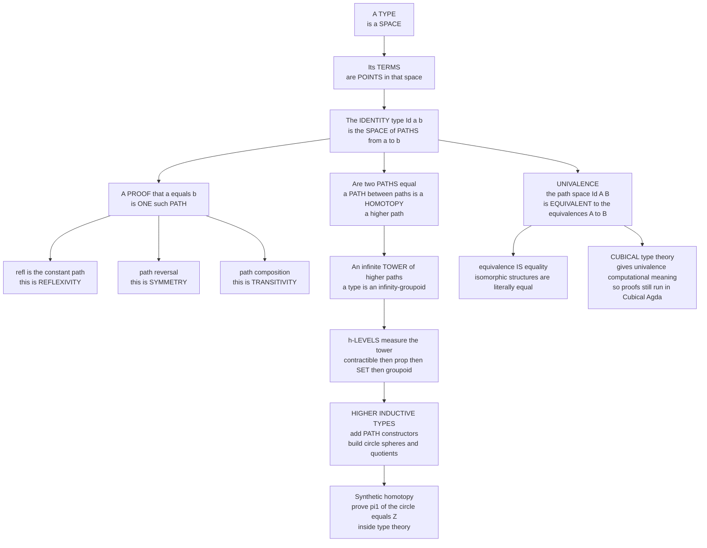

# 🌀 Homotopy Type Theory

> [!abstract] TL;DR
> **Homotopy Type Theory (HoTT)** is the research frontier where **type theory**, **topology**, and **higher category theory** merge. Its founding move — due to Awodey, Warren, and especially Vladimir **Voevodsky** — is to reinterpret Martin-Löf's **identity types** through the lens of **homotopy theory**: a **type is a space**, its **terms are points**, and *a proof that `a = b`* — an inhabitant of the identity type `Id(a, b)` — *is a **path** from `a` to `b`*. Proofs that two **paths** are equal are **higher paths** (homotopies), and a type therefore carries an *infinite tower* of higher structure — an **∞-groupoid**. This makes equality **proof-relevant**: `a = b` is not a mere true/false proposition but a **type that can have many genuinely different inhabitants**. The signature principle is the **univalence axiom** — *"equivalence **is** equality"*: for types `A` and `B`, the path space `Id(A, B)` is *equivalent* to the type of equivalences `A ≃ B`, so **isomorphic structures may be treated as literally equal**. HoTT reorganizes math into a hierarchy of **h-levels** (contractible → proposition → set → groupoid → …), adds **higher inductive types** (constructors that build *paths*, so the circle and quotients live *inside* type theory), and — via **cubical type theory** — makes univalence **compute**. It is a genuinely new answer to *what "equal" means*, and a candidate **new foundation for mathematics** rivaling ZFC set theory: structural, constructive, and computer-checkable. This note sits in the **Curry–Howard and Logic** section as the deepest extension of the Curry–Howard correspondence; it presumes the *identity types* of dependent type theory and the *propositions-as-types* reading covered by its PLT siblings.

---

## Intuition

**Analogy — a map with roads, not a checklist of yes/no facts.** In ordinary math, *"is `a` equal to `b`?"* is a yes/no question: either they are the same or they are not, and once you know **that** they are equal, there is nothing more to say. HoTT rejects this as too coarse. Picture instead a **map**: every value is a **town** (a *point*), and *a proof that two towns are "the same place"* is a **road** (a *path*) connecting them. Now the question *"are `a` and `b` equal?"* becomes *"is there a road from `a` to `b`?"* — and crucially, **there can be more than one road**. Two towns might be joined by a short direct highway *and* by a scenic route that loops around a mountain. Both prove "you can get from `a` to `b`," but they are **genuinely different roads**. Equality is no longer a single bit; it is a whole **space of proofs**.

Push the analogy one level up and the real depth appears. Ask: *are these two roads "the same road"?* — meaning, can you continuously slide one onto the other without lifting it off the map? That is a **higher road** (a *homotopy*), a proof-that-two-proofs-are-equal. If a mountain sits between them, no such sliding exists, and the two roads are **provably distinct ways of being equal**. So a type is not a flat set of points; it is a **landscape** with points, roads between points, roads between roads, and so on **forever** — the mathematical name for this infinite tower is an **∞-groupoid**. The **univalence axiom** is then the boldest move of all: it says that when the "towns" are themselves **entire structures** (a type `A`, a type `B`), *a road `A = B` is exactly the same thing as **a way of matching `A` onto `B` structure-for-structure*** — an equivalence `A ≃ B`. In one stroke it turns the mathematician's lifelong habit of *"working up to isomorphism"* into a **literal law of equality**. Everything technical below is machinery for taking this "equality is a space of paths" picture seriously enough to compute with it.

---

## How It Works

### 1. The identity type, re-read as a path space

Martin-Löf's dependent type theory already contains, for any type `A` and any two terms `a, b : A`, an **identity type** written `Id_A(a, b)` (or `a =_A b`). Its inhabitants are *proofs that `a` equals `b`*. There is one obvious constructor, **`refl_a : Id_A(a, a)`** ("everything is equal to itself"). The eliminator is **path induction**, the **`J` rule**: to prove a property `C` of *every* proof `p : Id(a, b)`, it suffices to prove it for the single case `refl`. Classically, people *assumed* `Id(a, b)` had **at most one** inhabitant — "a proof of equality carries no information." HoTT's insight is that **the rules never force that**, and if you *refuse* to assume it, the identity type behaves **exactly like the space of paths** in topology:

| Type theory | Homotopy theory | Groupoid law |
|---|---|---|
| type `A` | a **space** | objects |
| term `a : A` | a **point** | — |
| proof `p : Id(a, b)` | a **path** `a ⇝ b` | a morphism |
| `refl_a` | the **constant path** at `a` | **reflexivity** / identity |
| `p⁻¹` (path reversal) | reversed path `b ⇝ a` | **symmetry** / inverse |
| `p · q` (path composition) | concatenated path `a ⇝ c` | **transitivity** / composition |
| `α : Id(p, q)` | a **homotopy** between paths | a **2-cell** (higher path) |

The groupoid laws are *not axioms you bolt on*: `refl`, reversal, and composition, together with the fact that `p · p⁻¹` is *homotopic* to `refl` (not equal on the nose, but equal *one level up*), all fall out of the `J` rule. This is the **Hofmann–Streicher groupoid model** (1994): types genuinely form groupoids, and iterating the observation — paths between paths between paths — gives the full **∞-groupoid**.

### 2. Transport — proofs move structure along paths

The reason path-equality is *useful* and not just pretty is **transport**. If `p : Id(a, b)` and `P` is any family of types depending on a point (a *predicate* or *structure* indexed by `A`), then `transport^P(p) : P(a) → P(b)` — a path from `a` to `b` lets you **carry any structure over `a` to the corresponding structure over `b`**. This is "substitute equals for equals," but now it is a **function you apply**, and *which path you transport along can matter*. Different paths `a = b` can transport the same structure to **different** results — the computational face of proof-relevance.

### 3. Proof-relevant equality — many roads, and it matters

The radical shift: `Id(a, b)` is a **type**, so asking "how many inhabitants does it have?" is meaningful. Three regimes:

- **No path** — `a` and `b` are *not* equal (`Id(a, b)` is empty).
- **Exactly one path up to homotopy** — the classical situation; equality is a *mere proposition*.
- **Many distinct paths** — the loop space `Id(a, a)` can be **nontrivial**. The canonical example is the **circle** `S¹`: its loops at the basepoint are classified by an integer **winding number**, so `Id(base, base) ≃ ℤ` — there are **ℤ-many genuinely different proofs** that `base = base`. This is **synthetic homotopy theory**: the topological fact `π₁(S¹) = ℤ` is *proved inside type theory* (see [[Fundamental_Group]]).

### 4. h-levels — a hierarchy from "structureless" to "infinitely structured"

Since types have this tower, HoTT stratifies them by **how far up the tower carries real information** — the **homotopy levels** (h-levels):

| h-level | Name | Meaning | Example |
|---|---|---|---|
| −2 | **Contractible** | exactly one point, up to a path | the unit type, a singleton |
| −1 | **Proposition** (h-prop) | **at most one** inhabitant — *"mere truth,"* proof-irrelevant | `2 < 3` as a mere fact |
| 0 | **Set** (h-set) | equality is a *proposition* — **ordinary math** | `ℕ`, `Bool`, finite sets |
| 1 | **Groupoid** | equality is a *set* — isomorphisms carry data | the type of all finite sets |
| n+1 | n-**type** | equality is an n-type | higher stacks |

The everyday mathematics of ZFC lives at the **set** level (h-level 0), where "equality is a proposition" holds and all this higher structure collapses. HoTT *contains* that world as a special case while making room for the levels above it. **Propositional truncation** `‖A‖` deliberately squashes a type down to h-level −1, recovering the classical distinction between *"there exists"* (mere existence) and *"here is a specific witness"* (structured existence) — a distinction ordinary set theory blurs but constructive logic cares about deeply.

### 5. Univalence — equivalence *is* equality

Voevodsky's **univalence axiom** is the heart of the theory. For a **universe** `U` (a type whose terms are themselves types) and any `A, B : U`:

$$ (A =_{U} B) \;\simeq\; (A \simeq B) $$

Read: **the path space between two types is equivalent to the type of equivalences between them.** Informally — *any equivalence of structures can be turned into a proof that they are equal, and the two notions carry the same information.* Consequences: **isomorphic structures are literally interchangeable** — anything true of `A` is transported to `B` along the equivalence-turned-path, so you may *substitute equivalent structures freely*. This formalizes the working mathematician's "up to isomorphism" reflex and makes every property automatically **isomorphism-invariant**. It is **false in ZFC set theory** (there, `{0,1}` and `{a,b}` are equal only if they are the *same* set, not merely bijective) yet **consistent** in HoTT — Voevodsky's *simplicial-set model* established this. The analogy of substituting-equals is exactly the reasoning studied in [[Contextual_Equivalence_and_Reasoning]], now lifted to the level of *types themselves*.

### 6. Higher inductive types (HITs) — building spaces from constructors

Ordinary inductive types (like `ℕ`) have only **point constructors**. A **higher inductive type** may *also* have **path constructors** — generators of the *identity* type. The circle is:

```
data S¹ where
  base : S¹                 -- one point constructor
  loop : Id(base, base)     -- one PATH constructor: a nontrivial loop
```

From these two lines, `π₁(S¹) = ℤ` is *provable*. HITs directly express **spheres**, **tori**, **quotients** (`A / R` = `A` with a path glued for each related pair, no equivalence-class bureaucracy), and **truncations**. This is why HoTT is a natural home for **synthetic homotopy theory** and for quotient constructions that are notoriously fiddly in set-based proof assistants.

### 7. Making it compute — cubical type theory

There was a catch: univalence was originally an **axiom** with no computation rule, so a proof that *used* it could get **stuck** — it broke the *canonicity* every good type theory wants (a closed term of `ℕ` should reduce to a numeral). **Cubical type theory** (Cohen–Coquand–Huber–Mörtberg, 2016) fixes this by taking the *interval* `I` and paths as **primitive**: a path is literally a function `I → A`, composition and transport get explicit computation rules, and **univalence becomes a *theorem* that computes** rather than an inert axiom. This is implemented in **Cubical Agda** and **redtt/cooltt**, turning HoTT from a foundations-only object into a **usable proof-and-programming system**.

### Flow / Architecture



---

## Key Concepts

### Secondary (explain to a curious beginner)
- In HoTT, **a proof that two things are equal is a path** connecting them — like a road between two towns — and there can be **more than one road**, so equality can hold *in different ways*.
- **Univalence** says *"things that behave the same **are** the same"*: if two structures can be perfectly matched, HoTT treats them as literally equal.
- It is **advanced, frontier research** — its practical bite today is in **proof assistants and the foundations of mathematics**, not everyday app code — but the idea about *what equal means* is genuinely new.

### Undergraduate (requires a CS / math background)
- The **identity type** `Id(a, b)`, its constructor `refl`, and **path induction** (`J`); the groupoid structure (reversal = symmetry, composition = transitivity) as a *consequence*, not an axiom.
- **Proof-relevant equality**: `Id(a, b)` is a *type* that may have many inhabitants; the loop space `Id(base, base)` of the **circle** is `ℤ`.
- **h-levels**: contractible / **proposition** (≤ 1 inhabitant) / **set** (equality is a proposition — ordinary math) / groupoid; **propositional truncation** for *"mere existence."*
- **Univalence** `(A = B) ≃ (A ≃ B)`, why it fails in ZFC but holds in HoTT, and how it makes every property **isomorphism-invariant**.

### Graduate (system-level / foundational thinking)
- Types as **∞-groupoids**; the **Hofmann–Streicher groupoid model** and Voevodsky's **simplicial-set model** establishing univalence's consistency; the tie to **model categories** and **∞-topos** theory.
- **Higher inductive types** and the definability of quotients/truncations; **synthetic homotopy theory** (computing `πₙ` of spheres inside type theory).
- The **canonicity problem** of axiomatic univalence and its resolution in **cubical type theory** (the interval `I`, Kan composition, `Glue` types) — univalence as a *computing theorem*.
- **Univalent Foundations** as a structural alternative to set theory: everything respects equivalence *by construction*, versus ZFC where non-structural questions ("is `π ∈ 7`?") are even askable. Connections to the **Curry–Howard–Lambek** trinity extended to **homotopy theory** — the "computational trinity" gaining a fourth vertex.

---

## Python Demo

We cannot *implement* HoTT in Python — it is a whole logic — but we **can make its central intuition tangible and computable**. We model a small type as a **space**: a set of **points** with declared **paths** (identifications) between them, i.e. a **graph / groupoid**. Then we *compute* the HoTT structure that falls out: which points are **equal** (path-connected), **path composition** (transitivity), **path inversion** (symmetry), and whether there are **multiple distinct paths** between two points (**proof-relevant** equality) versus an **h-set** where all paths collapse. We diagnose the h-level with the **first Betti number** `b1 = E − V + C` (`0` ⇒ h-set, `≥ 1` ⇒ `π₁` is a free group of that rank). Finally we illustrate **univalence** by enumerating the **equivalences** between two finite structures and showing that `|Id(A, B)| = |A ≃ B|`, and we **visualize** the type-as-space with matplotlib. Pure standard library plus matplotlib.

```python
# HoTT, made tangible: a TYPE is a SPACE, TERMS are POINTS, a PROOF that
# a = b is a PATH. We model a small type as a graph (a groupoid) and compute
# the homotopy structure: equality = path-connectedness, composition =
# transitivity, inversion = symmetry, proof-relevance = many distinct loops,
# and univalence = equivalences-between-types are paths in the universe.
import math
import itertools
from collections import deque
import matplotlib.pyplot as plt
from matplotlib.patches import FancyArrowPatch, Circle

# ----------------------------------------------------------------------
# A TYPE-AS-SPACE: points (nodes) + generating paths (labelled edges).
# A groupoid path is INVERTIBLE, so each edge e:(u,v) can be walked
#   e^+1 : u = v   (forward)   or   e^-1 : v = u   (backward).
# A PATH (a proof of equality) is a list of signed edges; the empty
# path [] at x is REFL_x.
# ----------------------------------------------------------------------
class Space:
    def __init__(self, name, points, paths):
        self.name = name
        self.points = list(points)
        self.paths = dict(paths)                 # edge_id -> (u, v)

    def neighbours(self, x):
        for eid, (u, v) in self.paths.items():
            if u == x: yield (eid, +1, v)        # walk e forward:  x = v
            if v == x: yield (eid, -1, u)        # walk e backward: x = u

    @staticmethod
    def invert(path):                            # SYMMETRY: p^-1
        return [(eid, -d) for (eid, d) in reversed(path)]

    @staticmethod
    def compose(p, q):                           # TRANSITIVITY: p . q
        return list(p) + list(q)

    def endpoints_ok(self, path, start):         # follow a path, report where it lands
        cur = start
        for eid, d in path:
            u, v = self.paths[eid]
            step_from, step_to = (u, v) if d == +1 else (v, u)
            if step_from != cur:
                return None                      # ill-formed composition
            cur = step_to
        return cur

    def find_path(self, x, y):                   # SOME proof x = y by BFS, or None
        if x == y: return []                     # REFL
        seen, q = {x}, deque([(x, [])])
        while q:
            cur, acc = q.popleft()
            for eid, d, nxt in self.neighbours(cur):
                if nxt in seen: continue
                step = acc + [(eid, d)]
                if nxt == y: return step
                seen.add(nxt); q.append((nxt, step))
        return None

    def equality_classes(self):                  # EQUALITY = path-connected components
        seen, comps = set(), []
        for p in self.points:
            if p in seen: continue
            comp, q = set(), deque([p])
            while q:
                cur = q.popleft()
                if cur in comp: continue
                comp.add(cur); seen.add(cur)
                for _, _, nxt in self.neighbours(cur): q.append(nxt)
            comps.append(sorted(comp, key=str))
        return comps

    def cycle_rank(self):
        # First Betti number b1 = E - V + C.
        #   b1 == 0  -> equality is a mere PROPOSITION (an h-SET: <= 1 path between points)
        #   b1 >= 1  -> proof-RELEVANT: pi_1 is a FREE group of rank b1 (many distinct loops)
        V, E, C = len(self.points), len(self.paths), len(self.equality_classes())
        return E - V + C

def show_path(path):
    if not path: return "refl"
    return " . ".join(f"{eid}^{'+' if d > 0 else '-'}" for eid, d in path)

# ----------------------------------------------------------------------
# 1. A ZOO OF SMALL TYPES, classified by their homotopy structure.
# ----------------------------------------------------------------------
point    = Space("Point (contractible)", ["*"], {})
interval = Space("Interval a=b (h-set)", ["a", "b"], {"p": ("a", "b")})
line     = Space("Line a-b-c (h-set / tree)", ["a", "b", "c"],
                 {"p": ("a", "b"), "q": ("b", "c")})
circle   = Space("Circle S1 (triangle)", ["x", "y", "z"],
                 {"e1": ("x", "y"), "e2": ("y", "z"), "e3": ("z", "x")})
fig8     = Space("Figure-eight (two loops)", ["o"],
                 {"a": ("o", "o"), "b": ("o", "o")})
twoblobs = Space("Two disconnected points", ["u", "w"], {})

print("=== A TYPE is a SPACE: its homotopy structure ===")
print(f"{'type':<32}{'components':<12}{'b1 = pi_1 rank':<16}h-level")
for S in (point, interval, line, circle, fig8, twoblobs):
    b1 = S.cycle_rank()
    lvl = "h-set (equality is a proposition)" if b1 == 0 else \
          f"proof-relevant (pi_1 = free group, rank {b1})"
    print(f"{S.name:<32}{len(S.equality_classes()):<12}{b1:<16}{lvl}")

# ----------------------------------------------------------------------
# 2. REFL / SYMMETRY / TRANSITIVITY, and MULTIPLE DISTINCT PATHS.
#    On the circle-as-triangle there are two ways to prove x = y:
#      p1: the direct edge e1
#      p2: the long way round, x = z = y
#    They differ by the generating LOOP, so they are genuinely DIFFERENT
#    proofs of the same equality -> proof-relevant equality.
# ----------------------------------------------------------------------
print("\n=== Proof-RELEVANT equality on the circle: two distinct paths x = y ===")
p1 = circle.find_path("x", "y")                      # BFS finds the short one
p2 = [("e3", -1), ("e2", -1)]                         # x =(e3^-1) z =(e2^-1) y
print(f"  p1 (direct)   : {show_path(p1):<22} lands at {circle.endpoints_ok(p1, 'x')}")
print(f"  p2 (long way) : {show_path(p2):<22} lands at {circle.endpoints_ok(p2, 'x')}")

refl_x = circle.compose(p1, circle.invert(p1))        # p1 . p1^-1  is a loop at x
loopxy = circle.compose(p1, circle.invert(p2))        # p1 . p2^-1  is the generating loop
print(f"  SYMMETRY   p1^-1        = {show_path(circle.invert(p1))}")
print(f"  TRANSITIVITY p1 . p1^-1 = {show_path(refl_x)}  (a loop; reduces to refl)")
print(f"  p1 . p2^-1             = {show_path(loopxy)}  (winds once -> p1 and p2 are NOT equal)")

# On a TREE (h-set) the path is UNIQUE: all proofs of a = c collapse to one.
print("\n=== On an h-SET (the tree a-b-c) equality is a PROPOSITION: one path a = c ===")
print(f"  the unique proof a = c : {show_path(line.find_path('a', 'c'))}")

# ----------------------------------------------------------------------
# 3. The CIRCLE and pi_1(S1) = Z, via free reduction of loop words.
#    A loop at the basepoint is a word in {loop, loop^-1}; reducing cancels
#    adjacent inverses, and the WINDING NUMBER (the reduced signed length)
#    classifies it. Distinct winding numbers = distinct homotopy classes = Z.
# ----------------------------------------------------------------------
def winding(word):                                   # word: list of +1 / -1
    stack = []
    for g in word:
        if stack and stack[-1] == -g: stack.pop()    # loop . loop^-1 cancels
        else: stack.append(g)
    return sum(stack)

print("\n=== Synthetic homotopy: pi_1(S1) = Z (loops classified by winding number) ===")
samples = {
    "refl (empty)":        [],
    "loop":                [+1],
    "loop . loop":         [+1, +1],
    "loop . loop^-1":      [+1, -1],
    "loop^-1 . loop^-1":   [-1, -1],
    "loop.loop.loop^-1":   [+1, +1, -1],
}
for name, w in samples.items():
    print(f"  {name:<22} -> winding = {winding(w):+d}")
print("  distinct winding numbers form Z -> base = base has Z-many DISTINCT proofs")

# ----------------------------------------------------------------------
# 4. UNIVALENCE:  (A = B)  <->  (A ~ B).  Equality of TYPES = equivalences.
#    For two 2-element types there are exactly 2 equivalences (identity and
#    swap), so Id(Bool, Bool) has exactly 2 DISTINCT inhabitants: two
#    genuinely different PATHS Bool = Bool, at the level of the UNIVERSE.
# ----------------------------------------------------------------------
def equivalences(A, B):                              # all bijections A -> B
    if len(A) != len(B): return []
    return [dict(zip(A, perm)) for perm in itertools.permutations(B)]

Bool, other = [0, 1], ["a", "b"]
autos  = equivalences(Bool, Bool)                    # Bool ~ Bool
cross  = equivalences(Bool, other)                   # Bool ~ {a, b}
print("\n=== Univalence: equivalence IS equality ===")
print(f"  |Bool ~ Bool|   = {len(autos)}  -> {[ '{}->{},{}->{}'.format(0,e[0],1,e[1]) for e in autos ]}")
print(f"  so |Id(Bool,Bool)| = {len(autos)}: TWO distinct paths Bool = Bool (identity and swap)")
print(f"  |Bool ~ (a,b)|  = {len(cross)}  -> the sets {Bool} and {other} are EQUAL in HoTT")
print(f"  a non-equivalent pair (say a 2-set and a 3-set) has 0 equivalences -> NOT equal")

# ----------------------------------------------------------------------
# 5. VISUALIZE the type-as-space: points, paths, higher structure.
# ----------------------------------------------------------------------
fig, (ax1, ax2, ax3) = plt.subplots(1, 3, figsize=(16.5, 5.4))

# --- Panel 1: the circle S1 with loops of winding 0, 1, 2 -------------
ax1.add_patch(Circle((0, 0), 1.0, fill=False, lw=2.2, color="#333333"))
ax1.plot([1.0], [0.0], "o", ms=13, color="#C44E52", zorder=5)
ax1.annotate("base", (1.0, 0.0), (1.18, 0.12), fontsize=10, fontweight="bold")
for k, (r, col) in enumerate([(0.30, "#4C72B0"), (0.55, "#55A868"), (0.80, "#8172B2")]):
    arc = FancyArrowPatch((r, -0.02), (r, 0.02),
                          connectionstyle="arc3,rad=0.9",
                          arrowstyle="-|>", mutation_scale=14, lw=1.8, color=col)
    ax1.add_patch(arc)
    ax1.text(-r - 0.02, 0.0, f"{k}", color=col, ha="right", va="center",
             fontsize=10, fontweight="bold")
ax1.text(0, -1.42, "pi_1(S1) = Z\nbase = base has Z-many DISTINCT proofs\n(proof-relevant equality)",
         ha="center", va="top", fontsize=9)
ax1.set_title("A TYPE is a SPACE\nthe circle and its winding numbers", fontsize=11)
ax1.set_xlim(-1.7, 1.9); ax1.set_ylim(-2.0, 1.4); ax1.axis("off"); ax1.set_aspect("equal")

# --- Panel 2: the triangle groupoid, two distinct paths x = y ---------
ang = {"x": 90, "y": 210, "z": 330}
pos = {k: (math.cos(math.radians(a)), math.sin(math.radians(a))) for k, a in ang.items()}
for eid, (u, v) in circle.paths.items():             # generating paths (grey)
    (x0, y0), (x1, y1) = pos[u], pos[v]
    ax2.plot([x0, x1], [y0, y1], color="0.75", lw=1.4, zorder=1)
for k, (x0, y0) in pos.items():
    ax2.plot([x0], [y0], "o", ms=15, color="#333333", zorder=4)
    ax2.text(x0 * 1.25, y0 * 1.25, k, ha="center", va="center", fontsize=12, fontweight="bold")
# path 1 (direct edge x->y) and path 2 (long way x->z->y), drawn curved
ax2.add_patch(FancyArrowPatch(pos["x"], pos["y"], connectionstyle="arc3,rad=0.30",
              arrowstyle="-|>", mutation_scale=16, lw=2.4, color="#55A868", zorder=3))
ax2.add_patch(FancyArrowPatch(pos["x"], pos["z"], connectionstyle="arc3,rad=-0.30",
              arrowstyle="-|>", mutation_scale=16, lw=2.4, color="#C44E52", zorder=3))
ax2.add_patch(FancyArrowPatch(pos["z"], pos["y"], connectionstyle="arc3,rad=-0.30",
              arrowstyle="-|>", mutation_scale=16, lw=2.4, color="#C44E52", zorder=3))
ax2.text(0.15, 0.35, "p1", color="#55A868", fontsize=11, fontweight="bold")
ax2.text(-0.62, -0.15, "p2", color="#C44E52", fontsize=11, fontweight="bold")
ax2.text(0, -1.75, "two DISTINCT proofs x = y\np1 (green) vs p2 (red) differ by the loop\n=> equality is PROOF-RELEVANT",
         ha="center", va="top", fontsize=9)
ax2.set_title("TERMS are POINTS, PROOFS are PATHS\nmany paths can join two points", fontsize=11)
ax2.set_xlim(-1.9, 1.9); ax2.set_ylim(-2.3, 1.6); ax2.axis("off"); ax2.set_aspect("equal")

# --- Panel 3: univalence -- two equivalences ARE two paths A = B ------
L = {0: (0.0, 1.0), 1: (0.0, 0.0)}
R = {"a": (1.6, 1.0), "b": (1.6, 0.0)}
for lbl, (x0, y0) in L.items():
    ax3.plot([x0], [y0], "s", ms=22, color="#4C72B0", zorder=3)
    ax3.text(x0, y0, str(lbl), color="white", ha="center", va="center", fontweight="bold")
for lbl, (x0, y0) in R.items():
    ax3.plot([x0], [y0], "s", ms=22, color="#DD8452", zorder=3)
    ax3.text(x0, y0, str(lbl), color="white", ha="center", va="center", fontweight="bold")
ax3.text(0.0, 1.45, "A = Bool", ha="center", fontsize=10, fontweight="bold")
ax3.text(1.6, 1.45, "B = {a,b}", ha="center", fontsize=10, fontweight="bold")
# equivalence 1: identity-like 0->a, 1->b (green solid)
ax3.add_patch(FancyArrowPatch(L[0], R["a"], connectionstyle="arc3,rad=0.0",
              arrowstyle="-|>", mutation_scale=14, lw=2.2, color="#55A868", zorder=2))
ax3.add_patch(FancyArrowPatch(L[1], R["b"], connectionstyle="arc3,rad=0.0",
              arrowstyle="-|>", mutation_scale=14, lw=2.2, color="#55A868", zorder=2))
# equivalence 2: swap 0->b, 1->a (purple dashed)
ax3.add_patch(FancyArrowPatch(L[0], R["b"], connectionstyle="arc3,rad=0.28",
              arrowstyle="-|>", mutation_scale=14, lw=2.2, ls="--", color="#8172B2", zorder=2))
ax3.add_patch(FancyArrowPatch(L[1], R["a"], connectionstyle="arc3,rad=-0.28",
              arrowstyle="-|>", mutation_scale=14, lw=2.2, ls="--", color="#8172B2", zorder=2))
ax3.text(0.8, -0.9, "|A ~ B| = 2 equivalences (id, swap)\n=> |Id(A,B)| = 2 : TWO paths A = B\nUNIVALENCE: equivalence IS equality",
         ha="center", va="top", fontsize=9)
ax3.set_title("UNIVALENCE\nequivalences between types = paths A = B", fontsize=11)
ax3.set_xlim(-0.7, 2.3); ax3.set_ylim(-1.7, 1.8); ax3.axis("off")

fig.suptitle("Homotopy Type Theory: a type is a space, a proof of equality is a path",
             fontsize=13)
fig.tight_layout()
plt.savefig("hott_type_as_space.png", dpi=120)
plt.show()
```

Expected console output (deterministic):

```
=== A TYPE is a SPACE: its homotopy structure ===
type                            components  b1 = pi_1 rank  h-level
Point (contractible)            1           0               h-set (equality is a proposition)
Interval a=b (h-set)            1           0               h-set (equality is a proposition)
Line a-b-c (h-set / tree)       1           0               h-set (equality is a proposition)
Circle S1 (triangle)            1           1               proof-relevant (pi_1 = free group, rank 1)
Figure-eight (two loops)        1           2               proof-relevant (pi_1 = free group, rank 2)
Two disconnected points         2           0               h-set (equality is a proposition)

=== Proof-RELEVANT equality on the circle: two distinct paths x = y ===
  p1 (direct)   : e1^+                  lands at y
  p2 (long way) : e3^- . e2^-           lands at y
  ...
=== Univalence: equivalence IS equality ===
  |Bool ~ Bool|   = 2  -> ['0->0,1->1', '0->1,1->0']
  so |Id(Bool,Bool)| = 2: TWO distinct paths Bool = Bool (identity and swap)
```

Three lessons fall out. **(1)** *Equality really is a space*: the Betti number `b1 = E − V + C` tells you the h-level — a **tree collapses to an h-set** (one path between points, equality is a *proposition*) while the **circle** and **figure-eight** are *proof-relevant* (`π₁` is a free group of rank 1 and 2). **(2)** `refl`, path **inversion** and **composition** are exactly *reflexivity, symmetry, transitivity* — the groupoid laws — and two paths `x = y` on the circle are **genuinely different proofs** because they differ by a loop of nonzero winding. **(3)** **Univalence** is concrete: `|Id(A, B)| = |A ≃ B|`, so two 2-element types are equal in *exactly two ways* (identity and swap), and *non-equivalent* types are simply *not equal*. The picture "a type is a landscape of points and paths" is not a metaphor — it is the computation.

---

## Real-World Applications

> **Cubical Agda** is HoTT you can actually *run*. It ships **univalence** and **higher inductive types** as **computing** primitives (paths are functions out of an interval `I`), so a mathematician can define the circle, prove `π₁(S¹) = ℤ` **synthetically**, form **quotients** without equivalence-class bookkeeping, and *transport* results across an equivalence — and every proof still **evaluates** to canonical form. This is the concrete payoff of solving univalence's original **canonicity** problem.

- **The HoTT Book / Univalent Foundations program.** The 2013 collaborative book (written at the IAS, largely *in* a proof assistant) is the reference re-derivation of mathematics on univalent foundations — a **structural, constructive, computer-checkable** alternative to ZFC where *isomorphic things are equal by construction*.
- **Verified mathematics with better equality.** HoTT's native handling of **quotients**, **isomorphism-invariance**, and **setoid-free** reasoning removes a class of bureaucratic pain that plagues large formalizations in [[Category_Theory]]-heavy Coq/Lean developments — you no longer carry "respects the equivalence" side conditions everywhere.
- **Synthetic homotopy theory.** Classical topology results — homotopy groups of spheres, the Freudenthal suspension theorem, the Blakers–Massey theorem — have been **proved inside type theory**, sometimes yielding *new* proofs that fed back into topology (connecting to [[Fundamental_Group]] and [[Homology_and_Cohomology]]).
- **Proof assistants and PL research generally.** Ideas from cubical type theory (interval, Kan composition, `Glue`) are reshaping how proof assistants model *equality* and *quotients*; **redtt/cooltt** and **Cubical Agda** are the experimental testbeds. The influence is mostly on **foundations and verification tooling**, not everyday application programming — the honest framing is *conceptually profound, practically niche (for now)*.

---

## Common Pitfalls

- **Thinking equality is still "just true or false."** The whole point is that `Id(a, b)` is a **type**, potentially with *many* inhabitants. Treating it as a proposition silently assumes you are at h-level ≤ 0 (a *set*), throwing away the higher structure that makes HoTT HoTT.
- **Assuming Uniqueness of Identity Proofs (UIP / axiom K).** The intuition "all proofs of `a = b` are equal" is **UIP** — it forces *every* type to be a set and is **incompatible with univalence** (which needs `Id(Bool, Bool)` to have *two* elements). Agda's `--without-K` exists precisely to *stop* you assuming it. Reaching for `K` out of habit collapses the theory.
- **Expecting univalence to compute in plain Martin-Löf TT.** As a bare **axiom**, univalence has *no reduction rule*: a closed `ℕ` built with it can get **stuck**, breaking canonicity. If you need computation, you need **cubical** type theory — not axiomatic HoTT.
- **Confusing "equal" with "equal on the nose."** Univalence gives equality **up to equivalence**, and transport respects the *specific* equivalence used. Two different equivalences transport differently; forgetting *which path* you traveled produces subtly wrong results — path-relevance is a feature, not noise.
- **Overselling the practical reach.** HoTT is a **research frontier**. Its verified-math and foundations impact is real, but it is **not** a tool for typical production software today. Presenting it as the next mainstream type system oversells it and invites disappointment.
- **Conflating "mere existence" with "a chosen witness."** `∃` in HoTT is a **propositional truncation** `‖ Σ ‖` — it forgets *which* witness. Trying to *extract* the witness from a truncated proof is (correctly) blocked; you must either work truncated or keep the untruncated `Σ`.

---

## Related Concepts

- [[Type_Systems_Fundamentals]] — HoTT is the far end of the *expressiveness ladder* this note sketches; identity types and dependent types are where "types" stop being mere classifiers and start *carrying proofs*.
- [[Contextual_Equivalence_and_Reasoning]] — "substitute equals for equals / work up to indistinguishability" is exactly the reasoning **univalence** promotes to a *law of equality at the level of types*.
- [[Category_Theory]] — the third leg of the Curry–Howard–Lambek trinity; HoTT extends it to **higher category theory**, with types as **∞-groupoids** and models in ∞-toposes.
- [[Fundamental_Group]] — HoTT proves `π₁(S¹) = ℤ` *synthetically*; the loop-space intuition of this note **is** the fundamental group, done inside type theory.
- [[Homology_and_Cohomology]] — higher homotopy/(co)homology invariants that synthetic homotopy theory computes *within* HoTT via higher inductive types.
- [[Topological_Spaces]] — the classical setting HoTT internalizes: types *behave like* spaces (points, paths, homotopies) without an external point-set.
- [[Mathematical_Logic_and_Set_Theory]] — the ZFC baseline HoTT proposes to **replace/rival**: univalence is *false* in set theory but consistent as **Univalent Foundations**, a structural alternative.

*(PLT siblings referenced in prose but not yet built in this vault: `Dependent_Types_and_Advanced_Type_Systems`, `The_Curry_Howard_Correspondence`, `Proof_Assistants_and_Dependent_Type_Theory`, `Intuitionistic_Logic_and_Constructive_Proofs`, `The_Future_of_Programming_Languages` — link these once they exist.)*

---

## Review Questions

1. **(Secondary)** In one or two sentences, explain the slogan *"a proof that `a = b` is a **path**."* Then, using the towns-and-roads analogy, say what it would **mean** for there to be *two different proofs that `a = b`*, and give the standard example of a type where this actually happens.
2. **(Undergraduate)** State the **univalence axiom** and explain, with the `Bool ≃ Bool` example, why `Id(Bool, Bool)` has exactly **two** inhabitants. Why is this statement **false in ZFC set theory** but **consistent** in HoTT? What does "isomorphism-invariance for free" mean as a consequence, and how does **transport** deliver it?
3. **(Graduate)** Explain the **h-level hierarchy** (contractible → proposition → set → groupoid) and why **ordinary mathematics lives at the set level**. Then: (a) why is **Uniqueness of Identity Proofs / axiom K** *incompatible* with univalence? (b) univalence-as-an-axiom breaks **canonicity** — what exactly goes wrong, and how does **cubical type theory** (interval `I`, Kan composition, `Glue`) restore computation? (c) Sketch how a **higher inductive type** with a single point and a single path constructor lets you prove `π₁(S¹) = ℤ` *inside* the theory.

---

## Sources

- The Univalent Foundations Program, *Homotopy Type Theory: Univalent Foundations of Mathematics* (Institute for Advanced Study, 2013) — the canonical "HoTT Book," freely available. [https://homotopytypetheory.org/book/](https://homotopytypetheory.org/book/)
- Vladimir Voevodsky, "Univalent Foundations" (IAS lectures / notes, 2010–2014) — the origin of the univalence axiom and the simplicial-set model. [https://www.math.ias.edu/vladimir/Univalent_Foundations](https://www.math.ias.edu/vladimir/Univalent_Foundations)
- Cyril Cohen, Thierry Coquand, Simon Huber, Anders Mörtberg, "Cubical Type Theory: A Constructive Interpretation of the Univalence Axiom," *TYPES 2015 / LMCS* (2018) — makes univalence compute. [https://arxiv.org/abs/1611.02108](https://arxiv.org/abs/1611.02108)
- Steve Awodey and Michael A. Warren, "Homotopy Theoretic Models of Identity Types," *Math. Proc. Cambridge Phil. Soc.* 146 (2009) — identity types modeled by path spaces. [https://arxiv.org/abs/0709.0248](https://arxiv.org/abs/0709.0248)
- The Agda Team, *Cubical Agda* documentation — a working proof assistant with computing univalence and HITs. [https://agda.readthedocs.io/en/latest/language/cubical.html](https://agda.readthedocs.io/en/latest/language/cubical.html)

---

#programming-language-theory #homotopy-type-theory #hott #univalence #identity-types
