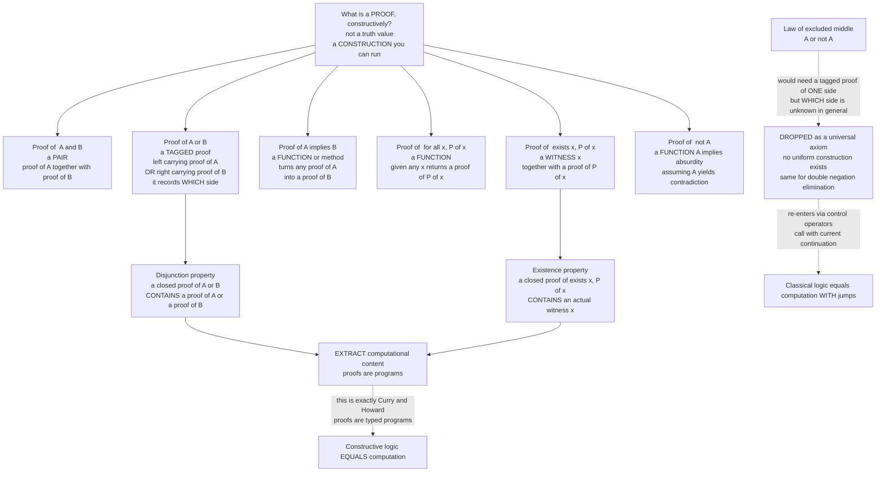

# 🧩 Intuitionistic Logic and Constructive Proofs

> [!abstract] TL;DR
> **Intuitionistic (constructive) logic** replaces "truth" with **provability-by-construction**: a statement is asserted only when you hold a *proof you can run*. Under the **Brouwer-Heyting-Kolmogorov (BHK)** reading, a proof of `A ∧ B` is a **pair** of proofs, a proof of `A ∨ B` is a proof of one side **tagged** with which, a proof of `A → B` is a **function** turning proofs of `A` into proofs of `B`, and a proof of `∃x.P(x)` is a **witness** `x` bundled with a proof that `P(x)` holds. The price is that the **law of excluded middle** `A ∨ ¬A` and **double-negation elimination** `¬¬A → A` are *dropped* as universal axioms — you cannot claim "A or not-A" unless you can actually produce one side. The payoff is enormous: constructive proofs **are** algorithms (the **disjunction** and **existence** properties let you *extract* a witness from a proof), which is exactly why intuitionistic logic — not classical logic — is the logic that matches typed lambda calculi under the **Curry-Howard correspondence**. It is the default logic of Coq, Agda, and Lean, and the seed of modern type theory and homotopy type theory.

---

## Intuition

**Analogy — the map that says "somewhere in here" vs the map with an X on it.** A classical logician stands before two locked rooms and declares: *"The treasure is in room A **or** room B."* Pressed for which, they shrug — "I didn't say I knew *which*; I said the disjunction is **true**, because it certainly isn't in *neither*." For classical logic that settles the matter: `A ∨ ¬A` holds by fiat, truth is a property the world already has, independent of whether anyone can find it.

A **constructive** (intuitionistic) logician refuses to accept that as a proof. To *claim* "the treasure is in A or B," they insist you must **hand over the key to one specific room** — a proof of `A ∨ B` must be a proof of `A` **or** a proof of `B`, *tagged with which one*. To *claim* "a treasure exists somewhere," you must **point at it** — a proof of `∃x.P(x)` must exhibit an actual `x`. A proof, on this view, is not a verdict about a pre-existing Platonic realm; it is a **recipe you can follow**, a mental (or mechanical) construction. And a recipe you can follow is precisely a **program you can run** — which is the deep reason proofs turn out to *be* programs.

This is L.E.J. **Brouwer's intuitionism**: mathematical objects are *built*, not *discovered*, and a statement is true only when we possess a construction witnessing it. Everything below is the machinery that makes "a proof is a construction" precise — and makes it compute.

---

## How It Works

### Core Mechanics

**1. Truth is replaced by proof.** Classically, every proposition is *already* true or false and a proof merely *reveals* which. Constructively, a proposition has no truth value floating free of us; to **assert** `A` is to **exhibit a proof** of `A`, where "proof" means a concrete construction. There is no third value — intuitionistic logic is *not* a three-valued logic; rather, `A ∨ ¬A` is simply **not automatically available**, because having neither a proof of `A` nor a proof of `¬A` is a perfectly ordinary situation.

**2. The BHK interpretation — the meaning of each connective.** Brouwer, **Heyting**, and **Kolmogorov** gave the constructive *meaning* of the connectives by saying what counts as a proof of each:

- **`A ∧ B`** — a **pair**: a proof of `A` together with a proof of `B`. (You have *both*.)
- **`A ∨ B`** — a **tagged** proof: either `inl(p)` where `p` proves `A`, or `inr(q)` where `q` proves `B`. Crucially, the tag records **which side** — a disjunction knows its own answer.
- **`A → B`** — a **function / method**: an effective procedure that transforms *any* proof of `A` into a proof of `B`.
- **`∀x.P(x)`** — a **function** that, given any element `x` of the domain, returns a proof of `P(x)`.
- **`∃x.P(x)`** — a **witness plus evidence**: a specific element `x` together with a proof of `P(x)`. (Not "it is impossible that no `x` works" — an actual `x`.)
- **`¬A`** — defined as **`A → ⊥`**: a function turning any proof of `A` into a proof of **absurdity** (`⊥`, false, which has *no* proof). So `¬A` means "assuming `A` lets me derive a contradiction."
- **`⊥` (false)** — has **no proof at all**; from a proof of `⊥` anything follows (*ex falso*).

Read those bullets again as data types and you already see Curry-Howard: `∧` is a **product/pair type**, `∨` is a **sum/tagged-union type**, `→` is a **function type**, `∃` is a **dependent pair**, `∀` is a **dependent function**. The correspondence is not an analogy; it is the *same* definition.

**3. What gets dropped from classical logic.** Intuitionistic logic keeps every classically-valid rule *except* the ones that assert existence without construction. Three equivalent culprits are removed as universal axioms:

- **Law of excluded middle (LEM):** `A ∨ ¬A`. To hold this constructively you would need, for *every* `A`, either a proof of `A` or a proof of `¬A` — i.e., you would have decided every proposition. Undecidable and open problems make this impossible in general.
- **Double-negation elimination (DNE):** `¬¬A → A`. Constructively `¬¬A` ("A is not refutable") is strictly weaker than `A` ("here is a proof of A"): not being able to rule something out is not the same as building it.
- **Proof by contradiction *for existence*:** the classic non-constructive move "assume no `x` satisfies `P`, derive a contradiction, conclude `∃x.P(x)`" is disallowed — it proves `¬¬∃x.P(x)`, which does **not** hand you a witness.

Note what *survives*: `A → ¬¬A` holds, `¬¬(A ∨ ¬A)` holds (LEM is *not refutable*), and the direction `¬(A ∨ B) ↔ (¬A ∧ ¬B)` holds. Intuitionistic logic is classical logic minus the "for free" existence assumptions, not a rejection of reasoning.

**4. The classic example — irrational raised to an irrational.** *Claim: there exist irrationals `a, b` with `a^b` rational.* The **non-constructive** proof: consider `√2^√2`. By LEM it is rational or irrational. If rational, take `a = b = √2` and done. If irrational, take `a = √2^√2`, `b = √2`, so `a^b = √2^2 = 2`, done. This proves existence **without telling you which pair works** — it leans entirely on excluded middle. The **constructive** alternative exhibits a witness outright: `a = √2`, `b = 2·log₂3` gives `a^b = 3` (or, by Gelfond-Schneider, `√2^√2` is in fact irrational, but that theorem is the point — you need real work to *know which case holds*). The two proofs of the *same statement* differ exactly in whether they produce a witness.

**5. Disjunction and existence properties — proofs carry their content.** Well-behaved constructive systems enjoy two remarkable **meta**-theorems: if `A ∨ B` is provable (with no open assumptions), then either `A` is provable or `B` is provable — and the proof *tells you which*; and if `∃x.P(x)` is provable, then there is a specific term `t` such that `P(t)` is provable — and the proof *contains* `t`. Classical logic has *neither* property (that is exactly what LEM breaks). These properties are the theoretical license for **program extraction**: compile a constructive proof and out falls an algorithm that computes the witness.

**6. Why constructive = computational.** Because every constructive proof of `→` is literally a function and every proof of `∃` literally packages a witness, *running the proof computes*. This is the reason the **simply-typed lambda calculus corresponds to intuitionistic propositional logic** (and richer type theories to richer constructive logics) under Curry-Howard: computation is inherently constructive, so the logic of programs is the constructive one. Classical logic, by contrast, has no naive computational reading — until you add **control** (see mechanic 8).

**7. Models — Heyting algebras and Kripke worlds.** Where classical logic is modelled by **Boolean algebras** (truth values `{0,1}`), intuitionistic logic is modelled by **Heyting algebras**, where the negation of `a` is the *largest element disjoint from `a`* and `¬¬a = a` can fail. The canonical Heyting algebra is the lattice of **open sets** of a topological space: `¬a` is the *interior of the complement*, so `¬¬a` is the interior of the closure — generally *bigger* than `a`, which is exactly why double negation does not collapse. **Kripke semantics** models proof as **monotone knowledge across possible worlds**: `A` is forced at a world `w` if it is established there; `A → B` must hold at every future world; `¬A` means `A` is refuted in *all* futures. LEM fails because a future world may yet establish `A` that the present cannot decide. These links to **topology** and **category theory** run deep (Heyting algebras generalize to **Heyting categories** and **toposes**).

**8. How classical logic re-enters computation — control operators.** Classical reasoning is not "wrong," and it is not non-computational — it is computation *with control effects*. **Griffin (1990)**, building on **Felleisen's** control calculus, showed that adding `call/cc`-style **continuations** to a typed language corresponds to adding **double-negation elimination / Peirce's law** — the classical axioms. A classical proof becomes a program that can **jump** (capture and invoke a continuation). The **CPS (continuation-passing-style) translation** embeds classical logic *into* intuitionistic logic (the double-negation / Gödel-Gentzen translation is its logical shadow). So the picture is unified: intuitionistic logic = pure functional computation; classical logic = functional computation **plus first-class control**.

**9. Refinements and frontiers.** **Linear logic** (Girard) refines the constructive picture further by tracking *resource usage* — how many times each hypothesis is used — the logical basis of ownership/affine types (Rust) and session types. And **Martin-Löf dependent type theory** extends BHK to a full foundation for constructive mathematics; **homotopy type theory (HoTT)** reinterprets its identity types as *paths*, adding the univalence axiom. All of these are constructive lineage descendants of the intuitionistic seed.

### Flow / Architecture



---

## Key Concepts

**Secondary (intuitive, no CS background needed)**
- **A proof is a recipe, not a verdict.** To say something is true, you must be able to *build* the thing — point at the treasure, hand over the key to a specific room.
- **"A or B" must name a side.** You are not allowed to say "A or B" unless you can say *which*, with evidence.
- **"Something exists" must show the something.** Proving existence means exhibiting an example, not merely showing that "nothing existing" leads to nonsense.
- **Not-not-A is weaker than A.** "I can't rule it out" is not the same as "here it is."

**Undergraduate (a logic, PL, or discrete-math course)**
- **The BHK interpretation** of `∧, ∨, →, ∀, ∃, ¬, ⊥` in terms of pairs, tagged sums, functions, witnesses, and refutations.
- **What intuitionistic logic drops**: excluded middle `A ∨ ¬A`, double-negation elimination `¬¬A → A`, Peirce's law, non-constructive existence proofs — and what it keeps (`A → ¬¬A`, `¬¬(A ∨ ¬A)`).
- **Curry-Howard**: propositions-as-types, proofs-as-programs; `∧` = product, `∨` = sum, `→` = function; the **simply-typed lambda calculus** ≅ intuitionistic propositional logic.
- **Disjunction and existence properties** and their consequence: **program extraction** from constructive proofs.
- **Natural deduction, intuitionistically**: the introduction/elimination rules minus classical `⊥`-elimination-to-any / double negation.

**Graduate (foundations, type theory, semantics)**
- **Heyting algebras** as the algebraic semantics; the **topological / open-sets** model where `¬¬a ≠ a`; **Kripke** possible-world semantics and monotone forcing.
- **Gödel-Gentzen / double-negation translation** embedding classical logic into intuitionistic; **CPS** as its computational counterpart; **Griffin's** typing of `call/cc` with Peirce's law — *classical proofs as control operators*.
- **Martin-Löf type theory**, propositions-as-types with dependent `Σ`/`Π`, and identity types; **HoTT** and univalence as constructive foundations.
- **Realizability** (Kleene) and the **Curry-Howard-Lambek** trinity with **cartesian-closed / bicartesian-closed categories** and **toposes** as internal-logic models.
- **Linear logic** as a resource-sensitive refinement; **normalization = evaluation** and strong normalization as consistency.

---

## Python Demo

```python
# ======================================================================
# CONSTRUCTIVE / INTUITIONISTIC LOGIC made concrete via the BHK reading.
#   A "proof" is not a truth value -- it is DATA you can RUN.
#     proof of  A and B    == a PAIR      ("and",  pa, pb)
#     proof of  A or  B    == a TAGGED    ("or", "left", pa) | ("or","right", pb)
#     proof of  A -> B     == a FUNCTION  pa |-> pb   (an ordinary callable)
#     proof of  exists x.P == a WITNESS   ("exists", x, proof_that_P_at_x)
#     proof of  not A      == a FUNCTION  A -> False  (pa |-> Absurd)
#     proof of  False      == does not exist
#   Then we:
#     1. build proofs as PROGRAMS and run them  (and-commutativity),
#     2. EXTRACT a witness from a constructive existence proof,
#     3. use the DISJUNCTION property to read which side an  A or B  chose,
#     4. show LEM  A or not-A  has NO uniform constructive realizer, yet
#        IS constructively provable exactly for DECIDABLE propositions,
#     5. VISUALIZE the BHK proof shapes + the constructive-vs-classical gap.
# Pure standard library + matplotlib.
# ======================================================================
import matplotlib.pyplot as plt
import matplotlib.patches as mpatches

# ----------------------------------------------------------------------
# 0. ABSURDITY. False has NO proof; producing one signals a contradiction.
# ----------------------------------------------------------------------
class Absurd(Exception):
    """A proof of False (bottom). By BHK it can never be built from nothing."""

# ----------------------------------------------------------------------
# 1. BHK CONSTRUCTORS + DESTRUCTORS. Proofs are ordinary Python data.
# ----------------------------------------------------------------------
# AND  --  a proof of  A and B  is a pair
def pair(pa, pb):  return ("and", pa, pb)
def fst(p):        assert p[0] == "and"; return p[1]     # A and B -> A
def snd(p):        assert p[0] == "and"; return p[2]     # A and B -> B

# OR  --  a proof of  A or B  is a proof of ONE side, tagged with which
def inl(pa):       return ("or", "left",  pa)            # inject a proof of A
def inr(pb):       return ("or", "right", pb)            # inject a proof of B
def which(p):      assert p[0] == "or"; return p[1]      # the DISJUNCTION property

# IMPLIES  --  a proof of  A -> B  is just a Python function (callable).
#              nothing to define; we build and apply real functions below.

# EXISTS  --  a proof of  exists x.P(x)  is a witness x plus evidence P(x)
def witness(x, ev):  return ("exists", x, ev)
def get_x(p):        assert p[0] == "exists"; return p[1]   # the EXISTENCE property
def get_ev(p):       assert p[0] == "exists"; return p[2]

# ======================================================================
# DEMO 1 -- PROOFS ARE PROGRAMS.  Prove  (A and B) -> (B and A)  constructively:
#           the proof IS a function that rebuilds the pair swapped.
# ======================================================================
def and_comm(p):                       # : (A and B) -> (B and A)
    return pair(snd(p), fst(p))

p_AB = pair("proof-of-A", "proof-of-B")          # a concrete proof of A and B
p_BA = and_comm(p_AB)                            # RUN the proof-program
print("=== Demo 1: (A and B) -> (B and A) is a program ===")
print(f"  input  proof of A and B : {p_AB}")
print(f"  output proof of B and A : {p_BA}")
assert fst(p_BA) == "proof-of-B" and snd(p_BA) == "proof-of-A"

# ======================================================================
# DEMO 2 -- EXTRACT A WITNESS.  Constructively prove
#           "there exists n in 91..100 with n prime and n > 90"
#           by an HONEST search that EXHIBITS the n; then pull it out.
# ======================================================================
def is_prime(n):
    return n > 1 and all(n % d for d in range(2, int(n**0.5) + 1))

def prove_exists_prime_over_90():
    for n in range(91, 101):
        if is_prime(n):                          # found one -> EXHIBIT it
            evidence = pair(("is-prime", n), ("greater-than-90", n))
            return witness(n, evidence)
    raise Absurd                                 # (unreachable: 97 is prime)

ex = prove_exists_prime_over_90()
n_star = get_x(ex)                               # <-- computational content falls out
print("\n=== Demo 2: extract a witness from a constructive existence proof ===")
print(f"  proof object : {ex}")
print(f"  EXTRACTED witness n = {n_star}   (evidence: {get_ev(ex)})")
assert is_prime(n_star) and n_star > 90

# ======================================================================
# DEMO 3 -- DISJUNCTION PROPERTY.  A constructive proof of  A or B  tells us
#           WHICH side; a classical "truth" of A or B does not.
# ======================================================================
def parity_proof(n):                             # proof of  (n even) or (n odd)
    return inl(("even", n)) if n % 2 == 0 else inr(("odd", n))

print("\n=== Demo 3: disjunction property -- read the tag ===")
for n in (10, 7):
    pf = parity_proof(n)
    print(f"  n={n}: proof of (even or odd) took the '{which(pf)}' side  ->  {pf}")

# ======================================================================
# DEMO 4 -- THE LAW OF EXCLUDED MIDDLE has NO uniform constructive realizer.
#   (a) For a DECIDABLE proposition we CAN realize  P or not-P  (tag a side).
#   (b) For a genuinely OPEN proposition, a search can tag neither side:
#       it can exhibit a witness (LEFT) but cannot supply the proof-of-none
#       (RIGHT) that would require settling the problem for all n.
# ======================================================================
# (a) decidable case: LEM is fine when we can DECIDE.
def lem_for_decidable(decide, x):
    if decide(x):
        return inl(("holds", x))                 # LEFT: a proof of P(x)
    else:
        return inr(("refutation", x))            # RIGHT: a proof of not P(x)

print("\n=== Demo 4a: LEM IS constructive for DECIDABLE props ===")
for x in (4, 5):
    pf = lem_for_decidable(is_prime, x)
    print(f"  '{x} is prime  OR  not' realized on the '{which(pf)}' side")

# (b) open case: "there exists an odd perfect number" (none known; unresolved).
def is_perfect(n):
    return n > 1 and sum(d for d in range(1, n) if n % d == 0) == n

def lem_attempt_open(bound):
    """Try to realize (exists odd perfect n) OR not(...) by bounded search."""
    for n in range(1, bound, 2):
        if is_perfect(n):
            return inl(witness(n, ("odd-perfect", n)))   # LEFT: exhibit a witness
    # To take the RIGHT branch we would need a PROOF that none exists EVER --
    # which no finite search can supply. So we can tag NEITHER side.
    return None                                          # UNDECIDED

print("\n=== Demo 4b: LEM has NO uniform constructive realizer ===")
result = lem_attempt_open(bound=100000)
print(f"  bounded search up to 100000 for 'odd perfect exists or not': {result}")
print("  -> constructively UNDECIDED: no side can be honestly tagged.")
print("  -> CLASSICALLY, 'A or not-A' is nonetheless asserted for free (no witness).")

# ----------------------------------------------------------------------
# 5. VISUALIZE (left) the BHK proof SHAPES and (right) the LEM gap.
# ----------------------------------------------------------------------
fig, (axL, axR) = plt.subplots(1, 2, figsize=(15, 7))

def box(ax, x, y, w, h, text, fc):
    ax.add_patch(mpatches.FancyBboxPatch((x, y), w, h,
                 boxstyle="round,pad=0.02", fc=fc, ec="#333", lw=1.6))
    ax.text(x + w/2, y + h/2, text, ha="center", va="center",
            fontsize=9.5, fontweight="bold")

# ---- Left panel: the five BHK constructions as data shapes ----
axL.set_title("BHK: a proof is DATA you can run", fontsize=13, fontweight="bold")
box(axL, 0.05, 0.80, 0.4, 0.14, "A and B\nPAIR (pa, pb)", "#cfe8ff")
box(axL, 0.55, 0.80, 0.4, 0.14, "A or B\nTAGGED left(pa) / right(pb)", "#ffe0cc")
box(axL, 0.05, 0.58, 0.4, 0.14, "A -> B\nFUNCTION  pa |-> pb", "#d8f5d0")
box(axL, 0.55, 0.58, 0.4, 0.14, "exists x. P\nWITNESS (x, proof P at x)", "#f3d6ff")
box(axL, 0.30, 0.36, 0.4, 0.14, "not A  ==  A -> False\nFUNCTION into absurdity", "#ffd6d6")
# extraction arrow
axL.annotate("EXTRACT witness / side  ->  a PROGRAM",
             xy=(0.5, 0.16), ha="center", fontsize=11, fontweight="bold",
             color="#084")
axL.annotate("", xy=(0.5, 0.30), xytext=(0.5, 0.20),
             arrowprops=dict(arrowstyle="-|>", lw=2, color="#084"))
axL.set_xlim(0, 1); axL.set_ylim(0.1, 1.0); axL.axis("off")

# ---- Right panel: constructive vs classical on  A or not-A ----
axR.set_title("A or not-A : classical vs constructive", fontsize=13, fontweight="bold")
box(axR, 0.05, 0.72, 0.9, 0.16,
    "CLASSICAL\nasserts  A or not-A  ALWAYS\ntruth exists independently; NO witness required",
    "#e7e7ff")
box(axR, 0.05, 0.46, 0.9, 0.16,
    "CONSTRUCTIVE + DECIDABLE\nrun the decision procedure -> TAG a side\nLEM is a THEOREM here",
    "#d8f5d0")
box(axR, 0.05, 0.20, 0.9, 0.16,
    "CONSTRUCTIVE + OPEN / UNDECIDABLE\nno witness, no refutation -> tag NEITHER side\nLEM is NOT available",
    "#ffd6d6")
axR.set_xlim(0, 1); axR.set_ylim(0.15, 0.95); axR.axis("off")

fig.suptitle("Constructive proofs are programs; excluded middle is what breaks",
             fontsize=14, fontweight="bold")
fig.tight_layout()
plt.savefig("intuitionistic_bhk.png", dpi=130)
print("\nSaved BHK / LEM visualization to intuitionistic_bhk.png")
# plt.show()
```

Running it prints the swapped pair from Demo 1 (the *proof itself ran* as a function), extracts the witness `n = 97` from the existence proof in Demo 2, reads the `"even"`/`"odd"` tag off each disjunction in Demo 3, and in Demo 4 shows LEM realized cleanly for the **decidable** predicate `is_prime` yet returning **`None` (undecided)** for the open "odd perfect number" proposition — because no finite search can supply the *right*-branch proof-of-none that a constructive `A ∨ ¬A` would demand. The saved figure contrasts the five BHK proof shapes (pair, tagged sum, function, witness, refutation) with the three-way split on excluded middle: classical asserts it for free, constructive logic earns it *only* when the proposition is decidable.

---

## Real-World Applications

> **Example — Coq, Agda, and Lean are constructive by default, and that is what makes them *extract runnable code*.** In these proof assistants the logic *is* the type system (Curry-Howard taken literally): to prove `∀n, ∃m, m > n ∧ prime(m)` you write a *function* that, given `n`, returns an `m`, a proof it is prime, and a proof it exceeds `n`. Because the proof is constructive, Coq's `Extraction` command (and Agda/Lean equivalents) mechanically strip the logical parts and emit a real **OCaml/Haskell program** that computes the witness. This is not a nicety — it is the entire basis of **verified software**: **CompCert** (a C compiler proven correct) and **seL4** (a verified OS microkernel) ship *because* a constructive proof of correctness *is* the artifact whose behavior is guaranteed.

- **Program extraction and correct-by-construction software.** The disjunction/existence properties mean a proof of a specification `∀x.∃y.R(x,y)` yields an algorithm computing `y` from `x` that provably satisfies `R`. Constructive mathematics is thus a *programming methodology*: prove it, extract it, run it.
- **Total functional programming mirrors constructive logic.** A total language with sum types, product types, and **exhaustive** pattern matching is the intuitionistic fragment made executable — pattern-matching on a sum *is* `∨`-elimination, building a tuple *is* `∧`-introduction, a total function *is* `→`. Non-exhaustive matches and partial functions are exactly the places the correspondence breaks.
- **Classical automated reasoning as the deliberate contrast.** **SMT solvers** (Z3, CVC5) and resolution/SAT provers reason **classically** — they happily use `A ∨ ¬A` and prove existence by refuting non-existence. They are superb at *deciding validity* but do **not** hand you a constructive witness or extractable program; that trade (automation vs computational content) is precisely the classical-vs-constructive divide in practice.
- **Rust ownership and session types via linear logic.** The resource-tracking refinement of constructive logic (**linear logic**) underlies affine/linear type systems: Rust's borrow checker enforces "use once" the way linear logic tracks hypotheses, giving memory safety with no garbage collector.
- **The foundations of modern type theory and HoTT.** Martin-Löf's constructive type theory — the intuitionistic BHK reading scaled to a full foundation — is the substrate of dependent-type languages; **homotopy type theory** reinterprets its equality constructively as paths, an active research foundation for mathematics.

---

## Common Pitfalls

- **Thinking intuitionistic logic is three-valued or "rejects the middle."** It does **not** claim `A ∨ ¬A` is *false* — it declines to assert it *without proof of a side*. In fact `¬¬(A ∨ ¬A)` is a theorem: excluded middle is never *refutable*, just not universally *available*.
- **Confusing `¬¬A` with `A`.** "A is not refutable" (`¬¬A`) is genuinely weaker than "here is a proof of A" (`A`). `A → ¬¬A` holds; the converse does not. Whole proofs collapse if you silently apply double-negation elimination.
- **Smuggling in excluded middle mid-proof.** "Either it halts or it doesn't, so consider each case…" is a classical move. Case-splitting on `A ∨ ¬A` is only legitimate constructively when you can *decide* `A`. Watch for it hiding inside "clearly," "obviously," or "WLOG."
- **Believing constructive existence is just classical existence with etiquette.** A classical `∃x.P(x)` proved by contradiction may not correspond to *any* computable witness. The constructive `∃` is strictly stronger — it *is* the witness — which is exactly why it extracts to code and the classical one may not.
- **Assuming decidable propositions lose LEM.** For any *decidable* `P`, `P ∨ ¬P` is a constructive **theorem** (just run the decider and tag the side). Constructive logic drops LEM only as a **universal** axiom over *all* propositions; it keeps every instance you can actually decide.
- **Forgetting that classical reasoning is still computational.** Rejecting LEM does not banish classical logic from CS — via `call/cc`/continuations and the CPS translation, classical proofs are programs *with control effects*. "Constructive" vs "classical" is "pure computation" vs "computation with jumps," not "computational" vs "not."
- **Over-reading the Curry-Howard slogan as metaphor.** "Proofs are programs" is a literal isomorphism at the level of intuitionistic logic and typed lambda calculi — a proof of `A ∧ B` and a value of type `A × B` are the *same object*, not analogues.

---

## Related Concepts

- [[Proof_Theory_and_Natural_Deduction]] — the introduction/elimination rules whose intuitionistic version (dropping classical `⊥`/double-negation rules) *is* this logic; normalization corresponds to evaluation.
- [[The_Lambda_Calculus]] — under Curry-Howard the **simply-typed** lambda calculus is intuitionistic propositional logic; proofs are typed λ-terms and reduction is proof normalization.
- [[Church_Encodings_and_Computability]] — encoding data as pure functions is the same "everything is a construction" spirit that BHK formalizes for proofs.
- [[Propositional_Logic]] — the classical baseline this logic modifies; contrast Boolean truth tables with Heyting/Kripke constructive meaning.
- [[Logical_Connectives_and_Boolean_Algebra]] — Boolean algebras model classical logic; **Heyting algebras** (where `¬¬a ≠ a`) model the intuitionistic one.
- [[Predicate_Logic_and_Quantifiers]] — the constructive readings of `∀` (a function) and `∃` (a witness plus evidence) reinterpret these quantifiers.
- [[Mathematical_Proof_Strategies]] — proof by contradiction and existence proofs are exactly the strategies constructive logic restricts.
- [[Mathematical_Logic_and_Set_Theory]] — the foundations backdrop (Brouwer vs Hilbert, the foundations crisis) in which intuitionism arose.
- [[Category_Theory]] — cartesian-closed categories and toposes are the categorical semantics of intuitionistic logic; the Curry-Howard-Lambek trinity's third leg.
- [[Philosophy_of_Logic]] — the philosophical stance (truth as constructibility, anti-Platonism) underlying Brouwer's intuitionism.
- [[Logic_in_AI_and_Computation]] — where classical automated reasoning (SAT/SMT) sits, the deliberate contrast to constructive proof.
- [[Recursive_Functions_and_Lambda_Calculus]] — realizability and the computational content of proofs connect constructive logic to the models of computation.

*Forthcoming siblings in this PLT section — referenced in prose above and to be wikilinked once written — are **The Curry-Howard Correspondence**, **Natural Deduction and Sequent Calculus**, **Simply Typed Lambda Calculus**, **Proof Assistants and Dependent Type Theory**, **Linear Logic and Resource Types**, **Homotopy Type Theory**, **Monads and Effects**, and **Verified and Certified Languages**.*

---

## Review Questions

1. **(Secondary / conceptual)** A friend proves "there is a house on this street painted an unlucky number" by arguing: "suppose *no* house is — that leads to a contradiction, so one must be." Why would a constructive mathematician be unsatisfied, and what would they demand instead? Connect your answer to the difference between `¬¬∃x.P(x)` and `∃x.P(x)`.
2. **(Undergraduate / scenario)** You are handed, as data, a closed constructive proof of `(A ∨ B) ∧ (A → C) ∧ (B → C)`. Describe the *program* you would run to obtain a proof of `C`, naming which BHK shape each part of the input is (pair, tag, function) and which property lets you branch on the disjunction. Why could you **not** do this if the `A ∨ B` were only *classically* true?
3. **(Graduate / trade-off)** (a) Explain why the simply-typed lambda calculus being **strongly normalizing** corresponds to the *consistency* of intuitionistic propositional logic. (b) Griffin showed `call/cc` can be typed with Peirce's law, importing classical reasoning. What computational capability does a program gain, and what constructive property (name it) does it give up? (c) Given all this, when would you *deliberately* choose a classical prover (e.g. an SMT solver) over a constructive proof assistant, and what do you forfeit by doing so?

---

## Sources

- Arend Heyting, *Intuitionism: An Introduction*, North-Holland, 1956 — the classic exposition of the BHK interpretation and intuitionistic logic by Brouwer's foremost student.
- Anne Sjerp Troelstra and Dirk van Dalen, *Constructivism in Mathematics: An Introduction* (2 vols.), North-Holland, 1988 — the standard graduate reference on constructive mathematics, Heyting algebras, Kripke semantics, and realizability.
- Philip Wadler, "Propositions as Types," *Communications of the ACM* 58(12), 2015 — [PDF](https://homepages.inf.ed.ac.uk/wadler/papers/propositions-as-types/propositions-as-types.pdf) — the clearest modern account of Curry-Howard and why intuitionistic logic matches computation.
- Timothy G. Griffin, "A Formulae-as-Types Notion of Control," *POPL '90*, 1990 — the paper connecting classical logic (Peirce's law / double-negation) to control operators like `call/cc`.
- Michael Dummett, *Elements of Intuitionism*, 2nd ed., Oxford University Press, 2000 — a philosophically rich treatment of Brouwer's intuitionism and the meaning-theoretic case for constructive logic.
- The Univalent Foundations Program, *Homotopy Type Theory: Univalent Foundations of Mathematics*, 2013 — [online](https://homotopytypetheory.org/book/) — the modern constructive-foundations descendant of Martin-Löf type theory.

---

#programming-language-theory #intuitionistic-logic #constructive-mathematics #bhk #excluded-middle
