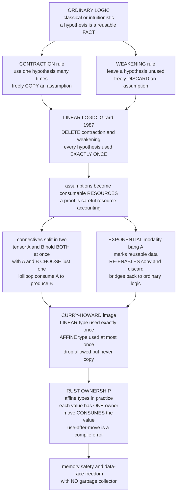

# 🔗 Linear Logic and Resource Types

> [!abstract] TL;DR
> Ordinary logic treats a hypothesis as a *reusable idea*: once you know it, you may use it as many times as you like, or ignore it entirely, **for free**. Two hidden **structural rules** grant that freedom — **contraction** (use one assumption many times, i.e. *copy* it) and **weakening** (leave an assumption unused, i.e. *discard* it). Jean-Yves Girard's **linear logic** (1987) simply **removes those two rules**, and the whole meaning of a proof changes: every hypothesis must now be used **exactly once**, so assumptions stop being facts and become consumable **resources** — a dollar you spend, a concert ticket you tear, a file handle you close. Under [[Programming_Language_Theory_Overview|Curry-Howard]], this logic becomes a family of **substructural type systems**: a **linear** type must be used *exactly once*, an **affine** type *at most once* (drop allowed, copy forbidden), a **relevant** type *at least once*. The exponential modality **`!A`** ("of course A") re-enables copying and discarding, marking data that *is* safe to reuse. The mainstream triumph of this theory is **Rust's ownership system** — an affine type discipline whose *move semantics* and *borrow checker* deliver memory safety and data-race freedom with **no garbage collector**.

---

## Intuition

**Analogy — ideas versus resources.** In everyday reasoning, once you *know* a fact — "Paris is the capital of France" — you can use it in ten arguments and it never wears out. Knowledge is free to copy and free to forget. Classical and intuitionistic logic treat every assumption this way: a proved lemma is an idea you can invoke as often as convenient, or never at all.

But some things are **not ideas — they are resources.** A concert ticket. A ten-dollar bill. An open file handle. A mutex you have locked. Using one **consumes** it: spend the dollar and it is gone; tear the ticket at the gate and you cannot walk in twice; close the file and reading it again is a bug. You also cannot conjure a second copy for free, and you cannot silently "forget" you were holding a locked mutex. **Linear logic is the logic of resources rather than ideas** — the logic where every assumption must be accounted for and used *exactly once*, so a proof becomes a careful ledger of what was spent to produce what. That accounting, transplanted into type systems, is exactly the machinery behind **Rust's ownership** and behind safe manual management of files, locks, and memory.

---

## How It Works

### 1. The structural rules everyone took for granted

A logic is presented as a **sequent calculus** (the subject of the sibling note `Natural_Deduction_and_Sequent_Calculus`): judgments of the form `Γ ⊢ A`, read "from the multiset of assumptions `Γ`, conclude `A`." Beneath the familiar rules for *and*, *or*, *implies* sit three quieter **structural rules** that manipulate the *assumptions themselves*, ignoring their content:

- **Exchange** — assumptions may be reordered. `A, B ⊢ C` gives `B, A ⊢ C`. (Almost every logic keeps this.)
- **Contraction** — a repeated assumption may be merged, so one hypothesis can be **used many times**. `A, A ⊢ C` gives `A ⊢ C`. This is the rule that lets you **copy** a hypothesis.
- **Weakening** — an extra assumption may be added and left unused, so a hypothesis can be **ignored**. `Γ ⊢ C` gives `Γ, A ⊢ C`. This is the rule that lets you **discard** a hypothesis.

Nobody thinks about these rules because in ordinary logic they are obviously harmless — of course you can reuse or ignore a fact. Girard's insight was to ask: *what if we delete contraction and weakening?*

### 2. Linear logic: delete copy and discard

Remove **contraction** and **weakening**, keep exchange, and you get **linear logic**. Now:

- Every hypothesis in `Γ` must be **used exactly once** in the proof — you can no longer copy one to use it twice (no contraction) nor leave one on the table (no weakening).
- Assumptions become **consumable tokens**. The sequent `dollar, dollar_buys_sandwich ⊢ sandwich` says: *spend the dollar and the exchange rule, obtain a sandwich* — but the dollar is **gone** from the context afterward. "I have a dollar" is no longer a permanent truth; it is a resource that the proof **spends**.

Because the connectives can no longer freely share or drop resources, the classical "and" and "or" each **split into two** flavours that were secretly identified in ordinary logic:

- **Multiplicative conjunction `A ⊗ B`** ("tensor", *both at once*) — you hold **both** `A` and `B` simultaneously; proving it consumes the resources for `A` **and** the resources for `B`. Think: *a dollar and a ticket*, both in hand.
- **Additive conjunction `A & B`** ("with", *your choice of one*) — you may take **either** `A` **or** `B` but not both; the *environment* chooses which. Think: *a vending machine that will give you a soda **or** a water for the same coin* — you get one.
- **Linear implication `A ⊸ B`** ("lollipop", *consume to produce*) — a function that **consumes exactly one `A`** to yield one `B`. `dollar ⊸ sandwich`: hand over the dollar, receive the sandwich, and the dollar is spent.
- Dually, **`A ⊕ B`** ("plus") is the multiplicative-vs-additive split for disjunction.

### 3. The exponential `!` — bringing reuse back on purpose

Pure linearity is too strict for real programs: integers, booleans, and pure functions *should* be copyable. Linear logic reintroduces reuse **explicitly**, through the **exponential modality `!A`** (pronounced "of course A" or "bang A"). Marking a proposition with `!` re-grants **exactly** the two rules that were removed — contraction and weakening — **for that proposition only**. So `!A` is data you *are* allowed to duplicate and discard; plain `A` is a one-shot resource. This is the pivot that **bridges linear logic back to ordinary logic**: intuitionistic implication `A → B` is recovered as `!A ⊸ B` — "a *reusable* A produces a B." The whole of ordinary logic sits inside linear logic as *the fragment where everything is banged*.

### 4. Curry-Howard: proofs become resource-tracking types

Under the [[Programming_Language_Theory_Overview|Curry-Howard correspondence]] — *propositions are types, proofs are programs* — linear logic becomes a **substructural type system**, and the "used exactly once" discipline becomes a rule about how **values are consumed**. This yields a lattice of disciplines, distinguished precisely by *which structural rules the type system keeps*:

| Discipline | Copy? contraction | Drop? weakening | "Use count" |
|---|---|---|---|
| **Structural** (ordinary) | yes | yes | any number of times |
| **Relevant** | yes | **no** | **at least once** |
| **Affine** | **no** | yes | **at most once** |
| **Linear** | **no** | **no** | **exactly once** |

A **linear type** models a resource that must be consumed exactly once — no leak, no double-use. An **affine type** allows *dropping* (you may never use it), but still forbids *copying* — this is the sweet spot for practical languages, because "forgetting" a value just means it gets cleaned up. These systems let a compiler **track how each value flows and is consumed**, enabling safe manual resource management (see [[Memory_Management_and_Allocation_Runtime|runtime memory management]]) **without a garbage collector** and links directly to [[Type_Systems_Fundamentals|the soundness machinery of type systems]].

### 5. Rust ownership as affine types in practice

**Rust's ownership model is an affine type system wearing engineering clothes** — the largest real-world deployment of resource-type theory:

- **One owner.** Each value has exactly one owning binding — a single "holder of the resource."
- **Move consumes (no copy).** Assigning or passing a non-`Copy` value **moves** it; the source binding is invalidated. Touching it afterward is a **use-after-move** *compile* error — the affine "no contraction" rule, enforced statically. See [[Ownership_and_Borrowing|Rust ownership and borrowing]].
- **Drop is allowed (weakening kept).** A value you never use is simply cleaned up when it goes out of scope by running its destructor — the affine "weakening allowed," which is why Rust is affine rather than strictly linear.
- **Borrowing lends without consuming.** `&T` and `&mut T` grant temporary access without transferring ownership, checked by the borrow checker and [[Lifetimes|lifetimes]] so that no reference outlives its owner and no data race can occur.
- **`Copy` is the `!` exponential.** Types that opt into `Copy` (integers, booleans) *are* duplicable — Rust's version of `!A`, exempting them from move semantics.

The payoff is exactly linear logic's promise: **memory safety and data-race freedom with no runtime GC**, because a file handle, a lock guard, or a heap allocation is a resource the type system guarantees is released **exactly once** (see [[Rust_Threads|Rust's `Send`/`Sync` and thread safety]]).

### 6. Beyond Rust: uniqueness types, session types, quantum

- **Uniqueness types** (the language *Clean*, and *Mercury*/*ATS*) take the dual angle: a value is *unique* if it has no other references, so it is safe to **update in place** destructively — enabling zero-copy optimization while keeping a pure functional surface. **Haskell's Linear Types** extension and **Idris 2**'s quantitative types bring linearity to those languages.
- **Session types** apply linearity to **communication protocols**: a channel's type describes the *sequence* of messages it must carry ("send an `Int`, then receive a `Bool`, then close"), and **linearity ensures the protocol is followed exactly once** — no step skipped, no message duplicated, no channel left dangling — yielding *deadlock-free*, well-typed concurrency (see the sibling note `Concurrency_and_Process_Calculi` on the proofs-as-processes reading and [[Threads_and_Concurrency_Models|concurrency models]]).
- **Quantum computing is inherently linear.** The **no-cloning theorem** says an unknown qubit *cannot be copied* — which is precisely the absence of contraction. Quantum programming languages (Quipper, Q#-style linear cores) therefore use **linear types** for qubits so that a qubit is used exactly once and never duplicated. See [[Measurement_and_the_No_Cloning_Theorem|measurement and the no-cloning theorem]].

### 7. Why it matters

Linear logic's deep contribution was to notice that **copying and discarding are not free — they are logical operations with a computational cost.** Once you can *name* those operations, you can *control* them, and that reshaped how programming-language theorists think about resources, state, mutation, and effects. The trajectory is clear: Rust mainstreamed affine types for millions of engineers; Haskell and Idris added linear/quantitative types; and the broader move is toward tracking **resources, effects, and capabilities in types** (the `Effect_Systems_and_Program_Analysis` and `The_Future_of_Programming_Languages` siblings). The one-line summary: *linearity turns the type checker into a resource accountant.*

### Mermaid — from structural rules to Rust ownership



---

## Key Concepts

**Secondary (explain to a curious beginner).**
- Some things are **ideas** you can reuse for free; others are **resources** — a ticket, a coin, an open file — that get **used up**.
- **Linear** means "use it **exactly once**"; **affine** means "use it **at most once**" (you may throw it away, but you may not clone it).
- **Rust** enforces this: once you hand a value to someone else, you can't touch it again — the compiler stops you.

**Undergraduate (requires a CS background).**
- The three **structural rules** are contraction (copy), weakening (discard), and exchange (reorder); **linear logic drops contraction and weakening**.
- Connectives split into **multiplicative** (`⊗` tensor, both) and **additive** (`&` with, choose one); **linear implication `A ⊸ B`** consumes an `A` to make a `B`.
- The **exponential `!A`** re-grants copy/discard for marked data, so intuitionistic `A → B` is `!A ⊸ B`.
- **Rust move semantics = affine typing**: one owner, move invalidates the source, `use-after-move` is a static error; `Copy` types are the `!` fragment.

**Graduate (system-level and foundational thinking).**
- The **substructural lattice** (structural / relevant / affine / linear) is exactly a lattice over *which structural rules survive* — a Curry-Howard image of resource discipline.
- **Session types** are linear types for protocols: linearity guarantees a channel's message sequence is followed once, yielding **deadlock-freedom**; this is the **proofs-as-processes** reading tying linear logic to the π-calculus.
- **Uniqueness vs linearity** are dual invariants — uniqueness constrains *aliasing of the past* (no other references exist, so update-in-place is safe), linearity constrains *use in the future* (must be consumed once).
- The **no-cloning theorem** makes quantum computation *natively* linear: absence of contraction is not a design choice but physics, so qubit types must be linear.

---

## Python Demo

We implement a **linear / affine type checker that tracks resource usage**. A program is a list of operations over named resources — `bind` a resource (like `let f = open(...)`), `use` it (consume / move / close / send), or `borrow` it (a shared read that does **not** consume). The checker enforces two disciplines: **linear** (every resource used **exactly once**) and **affine** (**at most once**). It **rejects** three faults: a **double-use / use-after-move** (consuming an already-moved value — the affine "no copy" rule), a **linear leak** (a resource never used — the linear "no discard" rule), and a **use of an unbound name**. A resource marked *reusable* models the exponential `!A` (Rust's `Copy`), exempting it from both rules. This is exactly Rust's move semantics and file-handle / lock safety. We run several programs, show the checker **accepting** resource-safe ones and **rejecting** a use-after-move, a double-use, and a leak, and **visualize** the resource tracking with matplotlib. Pure stdlib + matplotlib.

```python
# ============================================================================
# A LINEAR / AFFINE type checker that tracks RESOURCE USAGE.
# Each named variable is a consumable resource (a file handle, a lock, a coin).
#   LINEAR discipline: every resource must be used EXACTLY ONCE.
#   AFFINE discipline: every resource must be used AT MOST ONCE (drop allowed).
# The checker REJECTS:
#   * use-after-move / double-use  -> consuming an already-moved value
#   * linear leak (LINEAR only)     -> a resource that is never used
#   * unbound use                   -> using a name that was never bound
# A resource marked reusable models linear logic's exponential  ! A
# (Rust's `Copy`), which re-enables copying and discarding.
# This mirrors Rust move semantics and file/lock safety exactly.
# Pure stdlib + matplotlib (no numpy required).
# ============================================================================

import matplotlib.pyplot as plt
from matplotlib.colors import ListedColormap

# ---- A program is a list of operations -------------------------------------
#   ("bind",   name, reusable)   introduce a resource; reusable=True models ! A / Copy
#   ("use",    name)             CONSUME it (move / close file / send on channel)
#   ("borrow", name)             READ it WITHOUT consuming (shared &borrow), repeatable

def check(program, discipline="linear"):
    """Type-check a program under a substructural discipline.

    Returns (ok, errors, valid_uses, attempts, timeline):
      valid_uses[name] -> number of *accepted* consumes (0 or 1 for a resource)
      attempts[name]   -> number of *attempted* consumes (may exceed the budget)
      timeline         -> list of (step, name, event) with event in
                          {bind, use, borrow, ERROR}
    """
    introduced = {}          # name -> reusable?
    moved = set()            # names already consumed
    valid_uses, attempts = {}, {}
    errors, timeline = [], []

    for step, op in enumerate(program):
        kind, name = op[0], op[1]

        if kind == "bind":
            reusable = op[2] if len(op) > 2 else False
            introduced[name] = reusable
            valid_uses[name] = attempts[name] = 0
            timeline.append((step, name, "bind"))

        elif kind == "use":
            attempts[name] = attempts.get(name, 0) + 1
            if name not in introduced:
                errors.append((step, f"unbound: '{name}' was never bound"))
                timeline.append((step, name, "ERROR"))
            elif name in moved and not introduced[name]:
                # second consume of a one-shot resource: use-after-move / double-use
                errors.append((step, f"use-after-move: '{name}' was already consumed"))
                timeline.append((step, name, "ERROR"))
            else:
                valid_uses[name] += 1
                if not introduced[name]:          # reusable (!A) values are never "moved"
                    moved.add(name)
                timeline.append((step, name, "use"))

        elif kind == "borrow":
            if name not in introduced:
                errors.append((step, f"unbound: '{name}' was never bound"))
                timeline.append((step, name, "ERROR"))
            elif name in moved and not introduced[name]:
                errors.append((step, f"borrow-after-move: '{name}' already consumed"))
                timeline.append((step, name, "ERROR"))
            else:
                timeline.append((step, name, "borrow"))
        else:
            raise ValueError(f"unknown op {kind!r}")

    # end-of-scope structural check
    if discipline == "linear":                    # linear forbids weakening: no leaks
        for name, reusable in introduced.items():
            if not reusable and valid_uses[name] == 0:
                errors.append((len(program), f"linear leak: '{name}' was never used"))

    return (len(errors) == 0), errors, valid_uses, attempts, timeline


# ============================ SAMPLE PROGRAMS ==============================
programs = {
    "good_linear": [                    # open, read, close exactly once  -> SAFE
        ("bind", "file", False),
        ("borrow", "file"),             # a shared read does not consume
        ("use", "file"),                # close it exactly once
    ],
    "use_after_move": [                 # close twice -> double-free bug
        ("bind", "file", False),
        ("use", "file"),                # move / close
        ("use", "file"),                # BUG: use-after-move
    ],
    "leak_lock": [                      # acquire a lock, forget to release
        ("bind", "lock", False),        # linear leak; affine tolerates the drop
    ],
    "reusable_int": [                   # a Copy value ( ! A ): copying is legal
        ("bind", "n", True),
        ("use", "n"),
        ("use", "n"),
    ],
    "two_resources": [                  # each of a, b, c consumed once  -> SAFE
        ("bind", "a", False), ("bind", "b", False),
        ("use", "a"), ("bind", "c", False),
        ("use", "b"), ("use", "c"),
    ],
}

print("=" * 68)
print("Substructural type checking: LINEAR (exactly once) vs AFFINE (at most once)")
print("=" * 68)
for pname, prog in programs.items():
    print(f"\n--- program: {pname} ---")
    for disc in ("linear", "affine"):
        ok, errs, _, _, _ = check(prog, disc)
        verdict = "ACCEPT" if ok else "REJECT"
        detail = "" if ok else "  |  " + "; ".join(m for _, m in errs)
        print(f"   [{disc:6s}] {verdict}{detail}")

# ============================ VISUALIZATION ==============================
fig, ax = plt.subplots(2, 2, figsize=(14, 9))

# (a) RESOURCE-STATE TIMELINE for a resource-safe program: each var Live then Moved
demo = programs["two_resources"]
_, _, _, _, tl = check(demo, "linear")
names = [n for (s, n, e) in tl if e == "bind"]
bind_step = {n: s for (s, n, e) in tl if e == "bind"}
use_step = {n: s for (s, n, e) in tl if e == "use"}
last = len(demo) - 1
ymap = {n: i for i, n in enumerate(names)}
for n in names:
    y, bs, us = ymap[n], bind_step[n], use_step[n]
    ax[0, 0].plot([bs, us], [y, y], "-", color="#2E8B57", lw=7,
                  solid_capstyle="round")                       # Live (owned)
    ax[0, 0].plot([us, last], [y, y], "--", color="#BBBBBB", lw=2)   # Moved (consumed)
    ax[0, 0].scatter([bs], [y], color="#1F77B4", s=130, zorder=5, marker="o")
    ax[0, 0].scatter([us], [y], color="#C44E52", s=150, zorder=5, marker="X")
ax[0, 0].set_yticks(range(len(names)))
ax[0, 0].set_yticklabels(names)
ax[0, 0].set_xlabel("program step")
ax[0, 0].set_title("Resource lifetime: bound -> Live (green) -> consumed X -> Moved")
ax[0, 0].grid(axis="x", alpha=0.3)
ax[0, 0].scatter([], [], color="#1F77B4", marker="o", label="bind (acquire)")
ax[0, 0].scatter([], [], color="#C44E52", marker="X", label="use (consume once)")
ax[0, 0].legend(loc="lower right")

# (b) USE COUNTS for a SAFE program vs the linear budget = 1
_, _, vu_good, _, _ = check(demo, "linear")
gnames = list(vu_good.keys())
gcounts = [vu_good[n] for n in gnames]
ax[0, 1].bar(gnames, gcounts, color="#2E8B57")
ax[0, 1].axhline(1, ls="--", color="black", label="linear budget = 1")
ax[0, 1].set_ylim(0, 2.2)
ax[0, 1].set_ylabel("times consumed")
ax[0, 1].set_title("Safe program: every resource consumed exactly once")
ax[0, 1].legend()

# (c) ATTEMPTED USES for the BUGGY program: offender crosses the budget (red)
bad = programs["use_after_move"]
_, _, _, att_bad, _ = check(bad, "linear")
bnames = list(att_bad.keys())
bcounts = [att_bad[n] for n in bnames]
colors = ["#C44E52" if c > 1 else "#2E8B57" for c in bcounts]
bars = ax[1, 0].bar(bnames, bcounts, color=colors)
ax[1, 0].axhline(1, ls="--", color="black", label="linear/affine budget = 1")
ax[1, 0].set_ylim(0, 2.6)
ax[1, 0].set_ylabel("consume attempts")
ax[1, 0].set_title("Rejected: 'file' consumed twice -> use-after-move")
for bar, c in zip(bars, bcounts):
    if c > 1:
        ax[1, 0].text(bar.get_x() + bar.get_width() / 2, c + 0.08,
                      "use-after-move", ha="center", color="#C44E52",
                      fontweight="bold")
ax[1, 0].legend()

# (d) ACCEPT / REJECT MATRIX across all programs x disciplines
disciplines = ["linear", "affine"]
prog_names = list(programs.keys())
grid = [[1 if check(programs[p], d)[0] else 0 for d in disciplines]
        for p in prog_names]
cmap = ListedColormap(["#C44E52", "#2E8B57"])
ax[1, 1].imshow(grid, cmap=cmap, vmin=0, vmax=1, aspect="auto")
ax[1, 1].set_xticks(range(len(disciplines)))
ax[1, 1].set_xticklabels(disciplines)
ax[1, 1].set_yticks(range(len(prog_names)))
ax[1, 1].set_yticklabels(prog_names)
ax[1, 1].set_title("Accept / reject: linear is strictest")
for i in range(len(prog_names)):
    for j in range(len(disciplines)):
        ax[1, 1].text(j, i, "ACCEPT" if grid[i][j] else "REJECT",
                      ha="center", va="center", color="white", fontweight="bold")

fig.suptitle("Linear & affine type checking: tracking resources used exactly once",
             fontsize=14)
fig.tight_layout()
plt.savefig("linear_types_resource_tracking.png", dpi=120)
print("\nSaved plot to linear_types_resource_tracking.png")
```

**What it shows.** The printed report is the core result: `good_linear` and `two_resources` are **accepted** by both disciplines (every resource consumed exactly once); `use_after_move` is **rejected** by both because `file` is consumed a second time (`use-after-move` — a double-free in a real system); `leak_lock` is **rejected by linear** (the lock is never released — a resource leak) but **accepted by affine**, which permits *dropping*; and `reusable_int` is **accepted** because `n` is marked reusable (`!A` / `Copy`), so duplicating it is legal. The four plots make the accounting visible: (a) each resource's lifetime as a green *Live* segment ending in a red **X** where it is consumed, then a gray *Moved* tail — the picture of "owned once, consumed once"; (b) a safe program's use-counts all sitting exactly on the linear budget of 1; (c) the buggy program's `file` bar shooting past the budget, flagged **use-after-move**; and (d) the accept/reject matrix confirming that **linear is stricter than affine** — the only difference is whether *dropping* (weakening) is allowed. This is precisely the discipline Rust's borrow checker runs at compile time.

---

## Real-World Applications

> **Rust's borrow checker.** Every safe Rust program is checked against an *affine* type discipline: a non-`Copy` value has one owner, `let y = x;` **moves** `x` (using `x` afterward fails to compile with "value used here after move"), and `Drop` runs exactly once when the owner leaves scope. `File`, `MutexGuard`, and `Box` are resources the type system guarantees are released **exactly once** — no double-free, no use-after-free, no forgotten unlock — with **no garbage collector**. This is resource-type theory shipped to millions of developers.

- **Safe file/lock/handle management.** Linear and affine types make "opened exactly once, closed exactly once" a *type* guarantee: a file handle used after close, or a lock dropped without unlock, becomes a **compile error** rather than a runtime crash. Rust's RAII guards and C++'s `unique_ptr` (move-only, no copy) are affine-flavoured versions of this idea.
- **Session-typed protocols.** Libraries and languages with **session types** (e.g. research systems and the *Rumpsteak*/*ferrite* Rust libraries) encode a communication protocol as a linear channel type, so a channel that skips a message, duplicates a step, or is left unclosed is rejected at compile time — yielding *deadlock-free* concurrency.
- **Quantum programming languages.** Because the [[Measurement_and_the_No_Cloning_Theorem|no-cloning theorem]] forbids copying an unknown qubit, languages like **Quipper** and linear cores of quantum DSLs use **linear types** for qubits, so the type checker itself forbids illegal duplication.
- **In-place update and zero-copy.** Uniqueness types (in **Clean**) and linearity (in **Haskell**'s `LinearTypes`, **Idris 2**'s quantities) let compilers mutate data destructively while keeping a pure functional surface — safe zero-copy optimization without aliasing bugs.
- **Capability and effect systems.** Treating a permission or an effect handle as a linear capability (used once, then gone) underpins capability-secure languages and the broader push to **track effects and resources in types**.

---

## Common Pitfalls

- **Confusing linear with affine.** They differ in *one* rule: linear forbids **both** copy and drop (must use *exactly* once); affine forbids only copy (may use *at most* once). Most "linear type" systems people actually meet — Rust, C++ move-only types — are **affine**, because forgetting a value is allowed and just triggers cleanup.
- **Thinking `!` means "not".** In linear logic `!A` is the **exponential** "of course A" — the modality that *re-enables* copying and discarding. It is the bridge back to ordinary logic, not a negation.
- **Assuming linear types replace garbage collection everywhere.** They excel at *ownership-shaped* resources (unique owner, clear consumption). Genuinely **shared, cyclic** data still needs reference counting (`Rc`/`Arc`) or a GC; forcing everything to be linear produces contorted code — which is *why* Rust adds borrowing and shared-pointer escape hatches.
- **Ignoring the borrow-vs-move distinction.** A *borrow* reads without consuming and may repeat; a *move* consumes once. Modeling every access as a consume (as a naive linear checker does) rejects perfectly safe read-only sharing — real systems separate the two.
- **Forgetting the end-of-scope obligation.** Under strict linearity, a value you *bind but never use* is an **error** (a leak), not a silent no-op. Beginners expect "unused variable" to be a harmless warning; in a linear system it violates the *no-weakening* rule.
- **Overlooking that `⊗` and `&` are different conjunctions.** `A ⊗ B` gives you **both** resources; `A & B` lets you pick **one**. Collapsing them (as ordinary logic does) loses the whole resource distinction — the additive/multiplicative split is the point.

---

## Related Concepts

- [[Programming_Language_Theory_Overview]] — situates linear logic and substructural types within the PLT landscape and the Curry-Howard correspondence.
- [[Type_Systems_Fundamentals]] — the typing-judgment and soundness machinery (`Γ ⊢ e : T`, progress/preservation) that substructural systems specialize by restricting structural rules.
- [[Type_Inference_and_Unification]] — how the environment `Γ` is threaded through a derivation; linear checking adds "each variable used once" as a *usage* constraint on top of inference.
- [[Ownership_and_Borrowing]] — Rust's affine type system in practice: move semantics, one owner, use-after-move as a compile error.
- [[Lifetimes]] — the companion static analysis that makes *borrowing* (non-consuming access) sound in Rust.
- [[Smart_Pointers]] — `Box`, `Rc`, `Arc`: the escape hatches for the shared/cyclic data that pure ownership cannot express.
- [[Rust_Threads]] — `Send`/`Sync` and how affine ownership delivers data-race freedom, the concurrency payoff of resource types.
- [[Memory_Management_and_Allocation_Runtime]] — the manual allocation/deallocation that linear and affine types make safe without a garbage collector.
- [[Threads_and_Concurrency_Models]] — the OS-level concurrency that session types (linear channels) aim to make deadlock-free.
- [[Measurement_and_the_No_Cloning_Theorem]] — why quantum computation is *natively* linear: an unknown qubit cannot be copied, exactly the absence of contraction.

*(Vault siblings referenced in prose, not yet built: `Intuitionistic_Logic_and_Constructive_Proofs`, `The_Curry_Howard_Correspondence`, `Natural_Deduction_and_Sequent_Calculus`, `Dependent_Types_and_Advanced_Type_Systems`, `Concurrency_and_Process_Calculi`, `Memory_and_Ownership_Models`, `Effect_Systems_and_Program_Analysis`, `The_Future_of_Programming_Languages`.)*

---

## Review Questions

1. **(Secondary)** You have a single concert ticket, a ten-dollar bill, and one open file on your computer. For each, explain in one sentence why "use it exactly once" is the *right* rule and why treating it like a reusable idea (copy it freely, or forget about it) would cause a real-world problem. Which everyday object best matches an *affine* rather than a *linear* resource?
2. **(Undergraduate)** Ordinary logic proves `A ⊢ A ∧ A` (from `A`, conclude "A and A"). (a) Which structural rule makes that derivation possible? (b) Explain why linear logic **cannot** prove `A ⊢ A ⊗ A`, and what real bug this rejection prevents when `A` is the type of a file handle. (c) How does marking the hypothesis as `!A` restore the derivation, and what Rust feature corresponds to that `!`?
3. **(Graduate)** Rust's ownership system is usually described as **affine**, not strictly **linear**. (a) Precisely which structural rule does Rust *keep* that a strictly linear system would drop, and what Rust language mechanism implements it? (b) Session types use *linear* channels to guarantee a protocol is followed exactly once — explain why *affine* channels would be insufficient for deadlock-freedom. (c) The no-cloning theorem is often cited as evidence that quantum languages "must" be linear. State the correspondence between no-cloning and a specific structural rule, and explain why *measurement* (which destroys a qubit) fits the "consumed exactly once" reading.

---

## Sources

- Jean-Yves Girard, "Linear Logic," *Theoretical Computer Science* 50(1), 1987 — the founding paper introducing the connectives, structural-rule analysis, and the exponential `!`. <https://doi.org/10.1016/0304-3975(87)90045-4>
- Philip Wadler, "Linear Types Can Change the World!," in *Programming Concepts and Methods*, 1990 — the classic bridge from linear logic to practical resource-aware types. <https://homepages.inf.ed.ac.uk/wadler/papers/linear/linear.ps>
- Philip Wadler, "Propositions as Types," *Communications of the ACM* 58(12), 2015 — the Curry-Howard correspondence in which substructural logics become substructural type systems. <https://homepages.inf.ed.ac.uk/wadler/papers/propositions-as-types/propositions-as-types.pdf>
- Aaron Turon et al., "RustBelt: Securing the Foundations of the Rust Programming Language," *POPL 2018* — a formal proof that Rust's affine ownership discipline is sound. <https://plv.mpi-sws.org/rustbelt/popl18/>
- Frank Pfenning and Rowan Davies, "Substructural Type Systems" / Frank Pfenning's *Substructural Logics* lecture notes (CMU 15-816) — a clean tour of linear, affine, and relevant type systems and session types. <https://www.cs.cmu.edu/~fp/courses/15816-s12/>

---

#programming-language-theory #linear-logic #linear-types #affine-types #ownership
