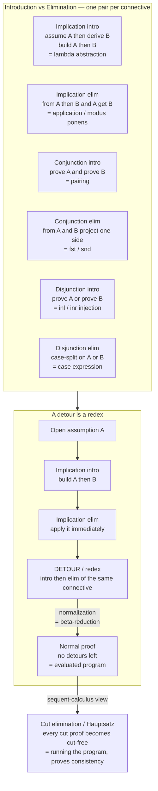

# 🌲 Natural Deduction and Sequent Calculus

> [!abstract] TL;DR
> **Natural deduction** and the **sequent calculus** are Gerhard Gentzen's two 1935 proof systems for formalizing logical reasoning — and, read through the **Curry-Howard correspondence**, they *are* the typing and evaluation rules of programming languages. Natural deduction is built to mirror how people actually argue: each logical **connective** gets an **introduction rule** (how to *prove* it — to prove `A → B`, temporarily *assume* `A` and derive `B`) and an **elimination rule** (how to *use* it — modus ponens uses `A → B`). Those two disciplines are exactly the **constructors** and **destructors** of a type: implication-intro is **lambda abstraction**, implication-elim is **application**, conjunction is **pairing/projection**, disjunction is **injection/case**. A proof that *introduces* a connective and *immediately eliminates* it contains a **detour** (a redex); removing it is **normalization** — literally **beta-reduction / program evaluation**. Gentzen's alternative, the sequent calculus, works with **sequents** `Γ ⊢ Δ` and **left/right** rules; its crown jewel, the **cut-elimination theorem (Hauptsatz)**, turns any proof using the **cut** rule into a cut-free one — the proof-theoretic form of *running the program*, and the tool Gentzen used to prove arithmetic **consistent**.

---

## Intuition

**Analogy — building an argument the way a person actually reasons.** Suppose a friend challenges you: "Prove that *if it rains, then the ground is wet*." You do not consult a truth table. Instead you say: *"Assume it rains. Then... the ground gets wet. So: if it rains, the ground is wet — and I can now drop the assumption."* You made a **temporary hypothesis**, reasoned to a conclusion under it, and then **discharged** it — folding the assumption into an `if-then` statement. That single move is the **introduction rule for implication**.

Now suppose someone hands you two facts: *"if it rains the ground is wet"* and *"it is raining."* You immediately conclude *"the ground is wet."* You **used** the implication by feeding it the thing it needed. That is the **elimination rule for implication** — plain modus ponens.

Natural deduction is nothing more than a full **rulebook** for these two moves — *how to build* each kind of statement and *how to spend* it — one pair per connective (`→`, `∧`, `∨`). And here is the twist that makes this a programming-language topic rather than a logic curiosity: write those exact rules as **code** and the introduction rule for `A → B` becomes a **function definition** `\x:A. body`, the elimination rule becomes a **function call**, "prove `A ∧ B`" becomes "**build a pair**", and "use `A ∧ B`" becomes "**project a field**." The proof *is* the program; the proposition *is* its type. Simplifying a redundant proof *is* evaluating the program.

---

## How It Works

### Core mechanics: introduction, elimination, assumption, discharge

Natural deduction (Gentzen 1934/35, refined by Dag Prawitz 1965) is organized by a single design principle. For **each connective** there are two kinds of rule:

1. **Introduction rule (`I`) — how to *prove* the connective (a constructor).**
   - `→I`: to prove `A → B`, *assume* `A`, derive `B`, then **discharge** the assumption. Curry-Howard: **lambda abstraction** `\x:A. e`.
   - `∧I`: to prove `A ∧ B`, prove `A` *and* prove `B`. Curry-Howard: **pairing** `⟨e₁, e₂⟩`.
   - `∨I`: to prove `A ∨ B`, prove `A` (left) or prove `B` (right). Curry-Howard: **injection** `inl e` / `inr e`.

2. **Elimination rule (`E`) — how to *use* the connective (a destructor).**
   - `→E`: from `A → B` and `A`, conclude `B` — **modus ponens**. Curry-Howard: **application** `f a`.
   - `∧E`: from `A ∧ B`, project `A` or `B`. Curry-Howard: **fst / snd**.
   - `∨E`: from `A ∨ B`, plus a proof of `C` assuming `A` and a proof of `C` assuming `B`, conclude `C` — **case analysis**. Curry-Howard: **case expression**.

An **assumption** is a leaf of the proof written in brackets, e.g. `[A]`, that is only *temporarily* available. The `→I` rule is where an assumption gets **discharged** — after `→I` closes over it, `A` is no longer a free hypothesis; it lives inside the `A → B` you just built. A finished **proof is a tree** whose leaves are (discharged or open) assumptions and whose root is the conclusion; the "open" leaves are exactly the free variables of the corresponding program.

### Harmony and the Curry-Howard reading

The intro/elim pairing is not arbitrary: it satisfies **harmony**. The elimination rule should recover *exactly* what the introduction rule put in — no more (soundness / *local soundness*), no less (completeness / *local completeness*). `∧E1` applied to `∧I(a, b)` gives back `a`; nothing was smuggled in. That is why **every type-system feature should ship a harmonious pair of constructors and eliminators** — the natural-deduction discipline is a design checklist for language features. Rule-by-rule, the introduction/elimination rules of intuitionistic propositional logic *are* the typing rules of the **simply typed lambda calculus** (a sibling PLT note to come); this is the Curry-Howard correspondence made explicit, not a loose analogy.

### Normalization = detour elimination = beta-reduction

A proof can be **roundabout**: it *introduces* a connective and then *immediately eliminates* it. That intro-then-elim pair is a **detour** (a **redex**). Example: build `A → B` by `→I`, then apply it by `→E` to a proof of `A`. The detour can be removed by **substituting** the proof of `A` into the body — which is precisely **beta-reduction** `(\x. e) a → e[a/x]`. Doing this everywhere yields a **normal proof** with no detours: a canonical, direct argument.

- **Prawitz's normalization theorem:** every natural-deduction proof reduces to a normal form.
- Under Curry-Howard this is **program evaluation**; a normal proof is a fully evaluated program (a value).
- **Strong normalization** (every reduction sequence terminates) of the typed calculus means the logic is **consistent**: there is no proof of falsehood, because any purported proof would normalize to an impossible direct one. This is why *typed* lambda calculi are total, hence *not* Turing-complete — see [[Reduction_Strategies_and_Evaluation_Order]].

### The sequent calculus and cut elimination

Gentzen's second system replaces the single-conclusion tree with **sequents** `Γ ⊢ Δ` — "the assumptions in `Γ` jointly prove *some* conclusion in `Δ`." Instead of intro/elim it has **right rules** (build a connective on the conclusion side, matching intro) and **left rules** (build a connective on the assumption side). One rule stands apart: **cut**,

> from `Γ ⊢ A` and `A, Δ ⊢ C`, derive `Γ, Δ ⊢ C`

which lets you use a **lemma** `A`. Gentzen's celebrated **cut-elimination theorem (the *Hauptsatz*)** proves every proof using cut can be mechanically transformed into a **cut-free** one. Cut-free proofs have the **subformula property** — every formula appearing is a subformula of the goal — which bounds the search space and makes automated **proof search** feasible (the basis of tableaux, resolution, and logic programming; see [[Type_Checking_and_Type_Systems]] and logic-programming search). Computationally, **cut is composition/substitution and cut-elimination is running the program** — the sequent-calculus counterpart of normalization, extended to classical control via calculi like `λμ` and `λ̄μμ̃`.



---

## Key Concepts

### Secondary (intuition level)
- To prove **"if A then B"**, temporarily **assume A**, reach **B**, then let go of the assumption. That letting-go is called **discharge**.
- Every connective has two rules: one to **build** it (introduction) and one to **use** it (elimination) — like a LEGO brick you can snap together and later pull apart.
- A **proof is a tree**: assumptions at the leaves, the thing you proved at the root.
- If a proof builds something just to take it apart again, that **detour** can be cut out to give a shorter, direct proof.

### Undergraduate (CS background)
- **Introduction = constructor, elimination = destructor.** `→I` is `\x. e` (lambda), `→E` is application; `∧I` is pairing, `∧E` is `fst`/`snd`; `∨I` is `inl`/`inr`, `∨E` is `case`.
- **Harmony:** the eliminator recovers exactly what the constructor supplied — the guiding invariant when adding any typed language feature.
- **Normalization** removes intro-then-elim detours; each removal *is* one **beta-reduction**. The **Curry-Howard correspondence**: *propositions are types, proofs are programs, normalization is evaluation.*
- **Sequent calculus** uses judgments `Γ ⊢ A` with **left/right** rules instead of intro/elim; natural deduction is proof-**construction**-friendly, the sequent calculus is proof-**search**-friendly.

### Graduate (metatheory level)
- **Prawitz normalization** (natural deduction) and **Gentzen cut-elimination** (sequent calculus) are the two faces of the same computational content; both prove **consistency** by ruling out a normal/cut-free proof of `⊥`.
- **Subformula property** of cut-free / normal proofs bounds proof search and yields decidability results; it is what makes focused proof search and `LJ`/`LJT`-based type checkers terminate.
- **Strong normalization** of `System F` / STLC (Girard's reducibility candidates, Tait's method) equals **total termination** of the corresponding logic; adding an unrestricted fixed point (general recursion) breaks normalization and makes the logic **inconsistent** — the price of Turing-completeness.
- **Classical vs intuitionistic:** single-conclusion natural deduction (`NJ` / sequent `LJ`) is **intuitionistic**; adding double-negation elimination / excluded middle, or allowing **multiple conclusions** (`NK` / `LK`), gives **classical** logic, whose computational reading is **control operators** (`call/cc`, `λμ`). See intuitionistic-logic sibling note.
- Gentzen used **transfinite (ordinal `ε₀`) induction** over cut-elimination to give a **consistency proof of Peano arithmetic** — a landmark of proof theory living next to Gödel's incompleteness theorems ([[Mathematical_Logic_and_Set_Theory]]).

---

## Python Demo

A self-contained **natural-deduction proof checker** for intuitionistic propositional logic. It represents formulas and **proof trees**, implements the **introduction/elimination** rules (with `→I` discharging an assumption and `→E` = modus ponens), **checks** proofs of the tautologies `A → (B → A)` and `(A ∧ B) → (B ∧ A)`, then demonstrates **normalization**: it builds a proof containing a *detour* (introduce an implication, then immediately eliminate it), simplifies it, and shows that this is exactly **beta-reduction** under Curry-Howard. Finally it **visualizes** the proof tree and its normalized form side by side with matplotlib. Pure standard library plus matplotlib.

```python
"""
Natural-deduction proof checker for INTUITIONISTIC propositional logic,
plus proof NORMALIZATION (= beta-reduction under Curry-Howard).

Connectives: ->  (implication),  &  (conjunction),  v  (disjunction).
Proof terms double as lambda-calculus terms:
    ->I  = lambda abstraction     ->E  = application (modus ponens)
    &I   = pairing                &E1/&E2 = fst / snd
    vI1/vI2 = inl / inr           vE   = case expression
Pure standard library + matplotlib (no numpy needed).
"""
from __future__ import annotations
from dataclasses import dataclass
from typing import Optional, Tuple
import matplotlib.pyplot as plt


# ============================ FORMULAS ============================
@dataclass(frozen=True)
class Atom:
    name: str
@dataclass(frozen=True)
class Imp:
    a: object
    b: object
@dataclass(frozen=True)
class Conj:
    a: object
    b: object
@dataclass(frozen=True)
class Disj:
    a: object
    b: object


def fmt(f) -> str:
    if isinstance(f, Atom): return f.name
    if isinstance(f, Imp):  return f"({fmt(f.a)} -> {fmt(f.b)})"
    if isinstance(f, Conj): return f"({fmt(f.a)} & {fmt(f.b)})"
    if isinstance(f, Disj): return f"({fmt(f.a)} v {fmt(f.b)})"
    raise TypeError(f)


# ============================ PROOF TERMS ============================
# Each node is simultaneously a proof step and a lambda-term former.
@dataclass(frozen=True)
class Assume:                 # a temporary hypothesis  [label : formula]
    label: str
    formula: object
@dataclass(frozen=True)
class ImpIntro:               # ->I : assume label:hyp, prove body  ==  \label:hyp. body
    label: str
    hyp: object
    body: object
@dataclass(frozen=True)
class ImpElim:                # ->E : apply fun to arg  ==  (fun arg)   (modus ponens)
    fun: object
    arg: object
@dataclass(frozen=True)
class AndIntro:               # &I  : pairing  ==  <left, right>
    left: object
    right: object
@dataclass(frozen=True)
class AndElim1:               # &E1 : fst
    p: object
@dataclass(frozen=True)
class AndElim2:               # &E2 : snd
    p: object
@dataclass(frozen=True)
class OrIntro1:               # vI1 : inl ; `other` is the RIGHT disjunct formula
    p: object
    other: object
@dataclass(frozen=True)
class OrIntro2:               # vI2 : inr ; `other` is the LEFT disjunct formula
    p: object
    other: object
@dataclass(frozen=True)
class OrElim:                 # vE  : case scrut of inl l1 => c1 | inr l2 => c2
    scrut: object
    l1: str
    c1: object
    l2: str
    c2: object


class ProofError(Exception):
    pass


# ============================ THE CHECKER ============================
# check(proof, ctx) returns the CONCLUSION formula, or raises ProofError.
# ctx maps in-scope assumption labels to their formulas (the typing context).
def check(pf, ctx: dict) -> object:
    if isinstance(pf, Assume):
        if pf.label not in ctx:
            raise ProofError(f"assumption '{pf.label}' is not in scope (undischarged?)")
        if ctx[pf.label] != pf.formula:
            raise ProofError(f"'{pf.label}' has type {fmt(ctx[pf.label])}, not {fmt(pf.formula)}")
        return pf.formula

    if isinstance(pf, ImpIntro):                       # ->I discharges pf.label
        ctx2 = dict(ctx); ctx2[pf.label] = pf.hyp
        return Imp(pf.hyp, check(pf.body, ctx2))

    if isinstance(pf, ImpElim):                        # ->E = modus ponens
        f = check(pf.fun, ctx)
        a = check(pf.arg, ctx)
        if not isinstance(f, Imp):
            raise ProofError(f"->E needs an implication, got {fmt(f)}")
        if f.a != a:
            raise ProofError(f"modus ponens mismatch: expected {fmt(f.a)}, got {fmt(a)}")
        return f.b

    if isinstance(pf, AndIntro):
        return Conj(check(pf.left, ctx), check(pf.right, ctx))
    if isinstance(pf, AndElim1):
        c = check(pf.p, ctx)
        if not isinstance(c, Conj): raise ProofError(f"&E1 needs a conjunction, got {fmt(c)}")
        return c.a
    if isinstance(pf, AndElim2):
        c = check(pf.p, ctx)
        if not isinstance(c, Conj): raise ProofError(f"&E2 needs a conjunction, got {fmt(c)}")
        return c.b

    if isinstance(pf, OrIntro1):
        return Disj(check(pf.p, ctx), pf.other)
    if isinstance(pf, OrIntro2):
        return Disj(pf.other, check(pf.p, ctx))
    if isinstance(pf, OrElim):
        s = check(pf.scrut, ctx)
        if not isinstance(s, Disj): raise ProofError(f"vE needs a disjunction, got {fmt(s)}")
        c1 = check(pf.c1, {**ctx, pf.l1: s.a})
        c2 = check(pf.c2, {**ctx, pf.l2: s.b})
        if c1 != c2:
            raise ProofError(f"vE branches disagree: {fmt(c1)} vs {fmt(c2)}")
        return c1
    raise TypeError(pf)


# ============================ AS A LAMBDA TERM ============================
def term(pf) -> str:
    if isinstance(pf, Assume):   return pf.label
    if isinstance(pf, ImpIntro): return f"\\{pf.label}:{fmt(pf.hyp)}. {term(pf.body)}"
    if isinstance(pf, ImpElim):  return f"({term(pf.fun)} {term(pf.arg)})"
    if isinstance(pf, AndIntro): return f"<{term(pf.left)}, {term(pf.right)}>"
    if isinstance(pf, AndElim1): return f"fst {term(pf.p)}"
    if isinstance(pf, AndElim2): return f"snd {term(pf.p)}"
    if isinstance(pf, OrIntro1): return f"inl {term(pf.p)}"
    if isinstance(pf, OrIntro2): return f"inr {term(pf.p)}"
    if isinstance(pf, OrElim):
        return (f"case {term(pf.scrut)} of "
                f"inl {pf.l1} => {term(pf.c1)} | inr {pf.l2} => {term(pf.c2)}")
    raise TypeError(pf)


# ============================ NORMALIZATION ============================
# subst(pf, label, repl): replace the free assumption `label` by proof `repl`
# (distinct labels are assumed, so no variable capture -- standard for a demo).
def subst(pf, label: str, repl):
    if isinstance(pf, Assume):
        return repl if pf.label == label else pf
    if isinstance(pf, ImpIntro):
        if pf.label == label: return pf                       # shadowed
        return ImpIntro(pf.label, pf.hyp, subst(pf.body, label, repl))
    if isinstance(pf, ImpElim):
        return ImpElim(subst(pf.fun, label, repl), subst(pf.arg, label, repl))
    if isinstance(pf, AndIntro):
        return AndIntro(subst(pf.left, label, repl), subst(pf.right, label, repl))
    if isinstance(pf, AndElim1): return AndElim1(subst(pf.p, label, repl))
    if isinstance(pf, AndElim2): return AndElim2(subst(pf.p, label, repl))
    if isinstance(pf, OrIntro1): return OrIntro1(subst(pf.p, label, repl), pf.other)
    if isinstance(pf, OrIntro2): return OrIntro2(subst(pf.p, label, repl), pf.other)
    if isinstance(pf, OrElim):
        c1 = pf.c1 if pf.l1 == label else subst(pf.c1, label, repl)
        c2 = pf.c2 if pf.l2 == label else subst(pf.c2, label, repl)
        return OrElim(subst(pf.scrut, label, repl), pf.l1, c1, pf.l2, c2)
    raise TypeError(pf)


def _reduce_top(pf):
    """Contract a DETOUR at the root (intro immediately followed by elim). None if none."""
    if isinstance(pf, ImpElim) and isinstance(pf.fun, ImpIntro):       # BETA / ->
        return subst(pf.fun.body, pf.fun.label, pf.arg)
    if isinstance(pf, AndElim1) and isinstance(pf.p, AndIntro):        # fst <a,b> -> a
        return pf.p.left
    if isinstance(pf, AndElim2) and isinstance(pf.p, AndIntro):        # snd <a,b> -> b
        return pf.p.right
    if isinstance(pf, OrElim) and isinstance(pf.scrut, OrIntro1):      # case inl -> left branch
        return subst(pf.c1, pf.l1, pf.scrut.p)
    if isinstance(pf, OrElim) and isinstance(pf.scrut, OrIntro2):      # case inr -> right branch
        return subst(pf.c2, pf.l2, pf.scrut.p)
    return None


def reduce_once(pf) -> Tuple[object, bool]:
    """One leftmost-outermost normalization step; (new_proof, changed?)."""
    top = _reduce_top(pf)
    if top is not None:
        return top, True
    if isinstance(pf, ImpIntro):
        nb, ch = reduce_once(pf.body)
        if ch: return ImpIntro(pf.label, pf.hyp, nb), True
    elif isinstance(pf, ImpElim):
        nf, ch = reduce_once(pf.fun)
        if ch: return ImpElim(nf, pf.arg), True
        na, ch = reduce_once(pf.arg)
        if ch: return ImpElim(pf.fun, na), True
    elif isinstance(pf, AndIntro):
        nl, ch = reduce_once(pf.left)
        if ch: return AndIntro(nl, pf.right), True
        nr, ch = reduce_once(pf.right)
        if ch: return AndIntro(pf.left, nr), True
    elif isinstance(pf, AndElim1):
        np_, ch = reduce_once(pf.p)
        if ch: return AndElim1(np_), True
    elif isinstance(pf, AndElim2):
        np_, ch = reduce_once(pf.p)
        if ch: return AndElim2(np_), True
    elif isinstance(pf, OrIntro1):
        np_, ch = reduce_once(pf.p)
        if ch: return OrIntro1(np_, pf.other), True
    elif isinstance(pf, OrIntro2):
        np_, ch = reduce_once(pf.p)
        if ch: return OrIntro2(np_, pf.other), True
    elif isinstance(pf, OrElim):
        ns, ch = reduce_once(pf.scrut)
        if ch: return OrElim(ns, pf.l1, pf.c1, pf.l2, pf.c2), True
        n1, ch = reduce_once(pf.c1)
        if ch: return OrElim(pf.scrut, pf.l1, n1, pf.l2, pf.c2), True
        n2, ch = reduce_once(pf.c2)
        if ch: return OrElim(pf.scrut, pf.l1, pf.c1, pf.l2, n2), True
    return pf, False


def normalize(pf, cap: int = 1000):
    steps = [pf]
    for _ in range(cap):
        nxt, changed = reduce_once(pf)
        if not changed:
            break
        pf = nxt
        steps.append(pf)
    return pf, steps


# ============================ DRAWING ============================
class DNode:
    def __init__(self, label, concl, children):
        self.label = label
        self.concl = concl
        self.children = children


def annotate(pf, ctx) -> DNode:
    """Build a display tree, tagging every node with the formula it concludes."""
    concl = fmt(check(pf, ctx))
    if isinstance(pf, Assume):
        return DNode(f"[{pf.label}]", concl, [])
    if isinstance(pf, ImpIntro):
        return DNode(f"->I  /{pf.label}", concl, [annotate(pf.body, {**ctx, pf.label: pf.hyp})])
    if isinstance(pf, ImpElim):
        return DNode("->E", concl, [annotate(pf.fun, ctx), annotate(pf.arg, ctx)])
    if isinstance(pf, AndIntro):
        return DNode("&I", concl, [annotate(pf.left, ctx), annotate(pf.right, ctx)])
    if isinstance(pf, AndElim1):
        return DNode("&E1", concl, [annotate(pf.p, ctx)])
    if isinstance(pf, AndElim2):
        return DNode("&E2", concl, [annotate(pf.p, ctx)])
    if isinstance(pf, OrIntro1):
        return DNode("vI1", concl, [annotate(pf.p, ctx)])
    if isinstance(pf, OrIntro2):
        return DNode("vI2", concl, [annotate(pf.p, ctx)])
    if isinstance(pf, OrElim):
        s = check(pf.scrut, ctx)
        return DNode("vE", concl, [annotate(pf.scrut, ctx),
                                   annotate(pf.c1, {**ctx, pf.l1: s.a}),
                                   annotate(pf.c2, {**ctx, pf.l2: s.b})])
    raise TypeError(pf)


def _layout(node, depth, counter, pos):
    if not node.children:
        x = counter[0]; counter[0] += 1
    else:
        xs = [_layout(c, depth + 1, counter, pos) for c in node.children]
        x = sum(xs) / len(xs)
    pos[id(node)] = (x, -depth)
    return x


def _collect(node, out):
    out.append(node)
    for c in node.children:
        _collect(c, out)


def draw_tree(ax, root, title):
    pos = {}
    _layout(root, 0, [0], pos)
    nodes = []
    _collect(root, nodes)
    for n in nodes:                                   # edges first
        x, y = pos[id(n)]
        for c in n.children:
            cx, cy = pos[id(c)]
            ax.plot([x, cx], [y, cy], color="0.65", zorder=1)
    for n in nodes:                                   # boxes on top
        x, y = pos[id(n)]
        ax.text(x, y, f"{n.label}\n{n.concl}", ha="center", va="center", fontsize=8,
                zorder=2, bbox=dict(boxstyle="round,pad=0.3", fc="#eef6ff", ec="#3388bb"))
    ax.set_title(title, fontsize=11)
    ax.axis("off")


# ================================ RUN ================================
if __name__ == "__main__":
    A, B = Atom("A"), Atom("B")

    # ---- Tautology 1:  A -> (B -> A)   is   \x:A. \y:B. x ----
    p1 = ImpIntro("x", A, ImpIntro("y", B, Assume("x", A)))
    print("Tautology 1:  A -> (B -> A)")
    print("  proof term :", term(p1))
    print("  checks as  :", fmt(check(p1, {})), "\n")

    # ---- Tautology 2:  (A & B) -> (B & A)   is   \p:(A&B). <snd p, fst p> ----
    ab = Conj(A, B)
    p2 = ImpIntro("p", ab, AndIntro(AndElim2(Assume("p", ab)), AndElim1(Assume("p", ab))))
    print("Tautology 2:  (A & B) -> (B & A)")
    print("  proof term :", term(p2))
    print("  checks as  :", fmt(check(p2, {})), "\n")

    # ---- A DETOUR:  ( \y:(A->A). y ) ( \x:A. x )   both prove  A -> A ----
    idA = ImpIntro("x", A, Assume("x", A))                 # identity on A  :  A -> A
    detour = ImpElim(ImpIntro("y", Imp(A, A), Assume("y", Imp(A, A))), idA)
    print("Detour proof of  A -> A  (introduce an implication, then eliminate it):")
    print("  before     :", term(detour), " :: ", fmt(check(detour, {})))
    normal, steps = normalize(detour)
    print("  after      :", term(normal), " :: ", fmt(check(normal, {})))
    print(f"  reductions : {len(steps) - 1}  (this IS beta-reduction under Curry-Howard)")
    print(f"  type preserved by normalization: {check(detour, {}) == check(normal, {})}")

    # ---- Visualize the detour proof tree and its normal form ----
    fig, (ax1, ax2) = plt.subplots(1, 2, figsize=(12, 5))
    draw_tree(ax1, annotate(detour, {}), "Proof WITH detour\n(intro then immediate elim = redex)")
    draw_tree(ax2, annotate(normal, {}), "Normalized proof\n(after beta-reduction)")
    fig.suptitle("Natural deduction: normalization = beta-reduction (Curry-Howard)", fontsize=12)
    fig.tight_layout()
    fig.savefig("natural_deduction_normalization.png", dpi=120)
    print("\nsaved plot -> natural_deduction_normalization.png")
```

Expected output (abridged):

```
Tautology 1:  A -> (B -> A)
  proof term : \x:A. \y:B. x
  checks as  : (A -> (B -> A))

Tautology 2:  (A & B) -> (B & A)
  proof term : \p:(A & B). <snd p, fst p>
  checks as  : ((A & B) -> (B & A))

Detour proof of  A -> A  (introduce an implication, then eliminate it):
  before     : (\y:(A -> A). y \x:A. x)  ::  (A -> A)
  after      : \x:A. x  ::  (A -> A)
  reductions : 1  (this IS beta-reduction under Curry-Howard)
  type preserved by normalization: True
```

The payoff: the checker proves two tautologies by *constructing* their proof terms (which are literally lambda terms), and the detour proof of `A → A` — building `A → A` only to apply it — **normalizes in one step to the identity**, the exact beta-reduction `(\y. y)(\x. x) → \x. x`, while the *proven formula is preserved* (subject reduction / type preservation). The plot shows the redundant proof tree collapsing to its direct, normal form.

---

## Real-World Applications

- **Proof assistants (Coq, Agda, Lean, Isabelle/HOL).** Their kernels *are* natural-deduction / type-theory checkers: you write a program whose type is a theorem, and the checker verifies the proof tree. Type-checking = proof-checking; `Qed` closes a natural-deduction derivation.
- **Type checkers in every compiler.** The premises-over-a-line **rule format** of natural deduction is the universal notation for typing rules; a bidirectional type checker walks a derivation exactly like the demo's `check`. See [[Type_Checking_and_Type_Systems]].
- **Language design by harmony.** GADTs, pattern matching, records, sums, and effect handlers are all specified as **constructor/eliminator** pairs; getting the elimination rule to match the introduction rule (harmony) is how designers avoid unsound features.
- **Automated theorem proving and logic programming.** The **cut-free** sequent calculus with its **subformula property** underlies tableaux, resolution, focusing, and Prolog-style search — a proof is *found* by only ever decomposing the goal.
- **Optimizing compilers.** Detour/redex elimination is the theoretical backbone of **beta/eta reduction, inlining, and case-of-known-constructor** optimizations — normalizing a proof is normalizing a program (see [[Reduction_Strategies_and_Evaluation_Order]] and [[Operational_Semantics]]).
- **Consistency and metatheory.** Gentzen's cut-elimination consistency proof of arithmetic remains a template for showing new type theories are logically sound (no proof of `⊥`).

---

## Common Pitfalls

- **Forgetting to discharge (or mis-scoping) an assumption.** Using `[A]` in the conclusion but never closing it with `→I` leaves a *free hypothesis* — the "proof" only holds *given* `A`. In code this is an unbound variable; the demo's `check` rejects it with "not in scope."
- **Assuming natural deduction and sequent calculus are the same rule.** Elimination rules (natural deduction) work *bottom-up from a compound formula*; **left rules** (sequent calculus) build the connective *on the hypothesis side*. They are inter-translatable but structurally different — conflating them corrupts proof-search reasoning.
- **Believing cut-elimination is free.** It always *terminates*, but the cut-free proof can be **hyper-exponentially larger** than the original. Cut is what makes proofs (and programs, via lemmas/functions) short; eliminating it is like fully inlining every function call.
- **Confusing normalization (proof simplification) with truth.** Normalization does not decide validity; it *canonicalizes an existing proof*. A false formula simply has *no* proof to normalize.
- **Reading Curry-Howard as an analogy.** It is a precise, rule-by-rule **isomorphism**: a proof of `A ∧ B` and a value of type `(A, B)` are the *same object*. Treating it loosely leads to wrong intuitions about what "evaluating a proof" means.
- **Expecting a single-conclusion system to prove classical laws.** Intuitionistic natural deduction (`NJ`) cannot prove `A ∨ ¬A` or `¬¬A → A`; you must *add* excluded middle / double negation (giving `NK`), which corresponds to introducing **control operators** — not a bug but a different logic.
- **Variable capture during substitution.** The demo assumes distinct labels; a production checker must **alpha-rename** during `subst`, exactly as beta-reduction must avoid capturing free variables.

---

## Related Concepts

- [[Reduction_Strategies_and_Evaluation_Order]] — proof normalization *is* beta-reduction; the choice of which redex/detour to remove first is a reduction strategy, and strong normalization equals guaranteed termination.
- [[Operational_Semantics]] — the premises-over-a-line **inference-rule format** natural deduction pioneered is the notation for operational and typing rules; the sequent calculus matches abstract machines and evaluation order.
- [[The_Lambda_Calculus]] — the term language that natural-deduction proofs correspond to under Curry-Howard; `→I`/`→E` are abstraction/application.
- [[Type_Checking_and_Type_Systems]] — a type checker walks a natural-deduction derivation; typing rules *are* intro/elim rules, and type soundness is the harmony/normalization story in disguise.
- [[Combinatory_Logic_and_Fixed_Points]] — Hilbert-style axiomatic proofs (combinators `S`, `K`) are the point-free alternative to natural deduction's assumptions-and-discharge.
- [[Proof_Theory_and_Natural_Deduction]] — the Logic-vault companion: the same intro/elim systems, soundness/completeness, and the Curry-Howard bridge from the pure-logic side.
- [[Propositional_Logic]] — the object logic whose connectives (`→`, `∧`, `∨`) these proof systems formalize.
- [[Mathematical_Logic_and_Set_Theory]] — Gentzen's cut-elimination consistency proof of arithmetic sits alongside Gödel's incompleteness theorems in the foundations of mathematics.
- [[Programming_Language_Theory_Overview]] — the parent map placing natural deduction inside the Curry-Howard-Lambek trinity of logic, computation, and categories.

> Sibling Programming Language Theory notes referenced in prose but not yet in the vault: *The Curry-Howard Correspondence*, *Simply Typed Lambda Calculus*, *Intuitionistic Logic and Constructive Proofs*, and *Type Systems Fundamentals* — link these once created.

---

## Review Questions

1. **(Secondary)** Explain, in the "assume it rains, derive the ground is wet, then discharge" style, how you would prove `A → (B → A)`. Which step *discharges* which assumption, and why does the second premise `B` end up unused?
2. **(Secondary)** What is a "detour" in a proof, and why can it always be removed? Give the everyday intuition for why removing detours makes a proof *shorter and more direct* without changing what it proves.
3. **(Undergraduate)** For each of `∧` and `∨`, state the introduction and elimination rules and name the corresponding lambda-calculus construct. Then show the detour `∧E1(∧I(a, b))` and explain what it reduces to and why that is *local soundness / harmony*.
4. **(Undergraduate)** The demo normalizes `(\y:(A→A). y)(\x:A. x)` to `\x:A. x` in one step. Rewrite this as a natural-deduction proof tree, circle the redex (the intro-then-elim detour), and explain precisely why "type preserved by normalization" printed `True`.
5. **(Graduate)** Contrast Prawitz **normalization** (natural deduction) with Gentzen **cut-elimination** (sequent calculus). Why does each independently prove **consistency**, and what does the **subformula property** of cut-free proofs buy you for automated proof search?
6. **(Graduate)** Single-conclusion `NJ` is intuitionistic; multiple-conclusion `LK` is classical. Computationally, what feature does adding double-negation elimination / multiple conclusions correspond to, and why does that mean classical proofs no longer have the tidy "a proof of `A ∨ B` tells you *which* disjunct" property?

---

## Sources

- Gerhard Gentzen, *Untersuchungen über das logische Schließen* ("Investigations into Logical Deduction"), *Mathematische Zeitschrift* 39 (1935); English translation in M. E. Szabo (ed.), *The Collected Papers of Gerhard Gentzen* (North-Holland, 1969).
- Dag Prawitz, *Natural Deduction: A Proof-Theoretical Study* (Almqvist & Wiksell, 1965; Dover reprint 2006).
- Jean-Yves Girard, Yves Lafont, Paul Taylor, *Proofs and Types* (Cambridge University Press, 1989).
- Morten Heine Sørensen & Paweł Urzyczyn, *Lectures on the Curry-Howard Isomorphism* (Elsevier, 2006).
- A. S. Troelstra & Helmut Schwichtenberg, *Basic Proof Theory*, 2nd ed. (Cambridge University Press, 2000).
- Frank Pfenning, *Lecture Notes on Natural Deduction and Sequent Calculus* (Carnegie Mellon, 15-317 / 15-816), and Benjamin C. Pierce, *Types and Programming Languages* (MIT Press, 2002), Ch. 9.

---

#programming-language-theory #natural-deduction #sequent-calculus #cut-elimination #proof-theory
