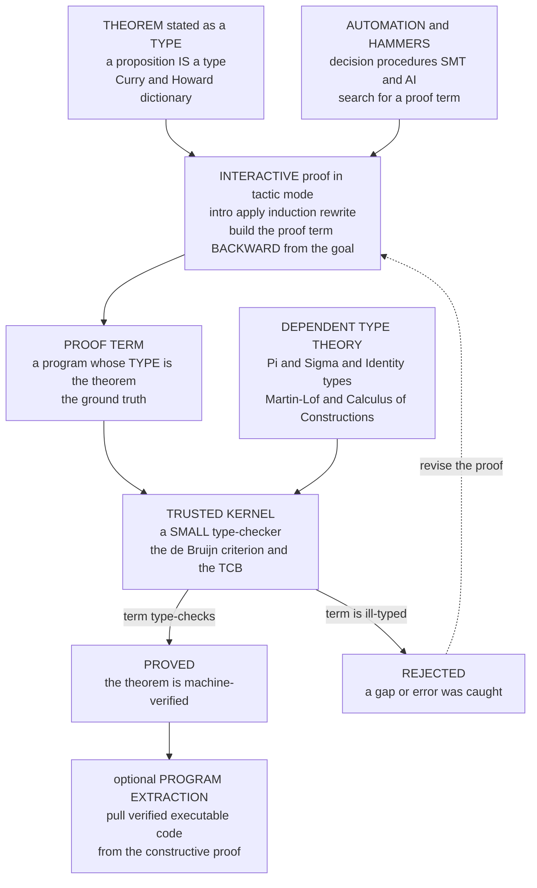

# 🔷 Proof Assistants and Dependent Type Theory

> [!abstract] TL;DR
> A **proof assistant** (interactive theorem prover) is software in which a human *states* a theorem and *constructs* a **machine-checked proof** — Coq, Agda, Lean, Idris, Isabelle/HOL. The human supplies the mathematical ideas; the machine mechanically **verifies every step**, so no gap, hand-wave, or algebra slip can slip through. The engine that makes this possible is the **Curry–Howard correspondence**: *propositions are types and proofs are programs*, so a proof assistant is fundamentally a **type-checker for a very rich, dependently-typed language**. You prove a theorem by building a **term whose type is the theorem**, and **type-checking IS proof-checking**. These systems are built on **dependent type theory** — **Martin-Löf type theory** and the **Calculus of (Inductive) Constructions** — where types can *depend on values*, giving `Π` (dependent function), `Σ` (dependent pair), and **identity** types the expressive power to encode all of mathematics. Trust rests on the **de Bruijn criterion**: a *tiny* trusted **kernel** re-checks the final proof term, so no matter what clever tactics or automation produced it, you only ever trust that small core. The payoff is landmark: the **four-colour theorem**, the **Feit–Thompson odd-order theorem**, the **Kepler conjecture** (Flyspeck), the verified C compiler **CompCert**, the verified microkernel **seL4**, verified cryptography, and Lean's **mathlib** — the modern formalized-mathematics movement.

---

## Intuition

**Analogy — a chess referee for mathematics.** Picture a chess game with a strict, tireless referee. You decide the *strategy* — which piece to move, what plan to pursue — but the referee checks every single move against the rules. You cannot slide a bishop like a rook, cannot leave your king in check, cannot "assume" a piece to a better square. The referee has no imagination and no mercy: an illegal move is simply *rejected*, instantly, every time.

A proof assistant is that referee for *mathematical* proofs. **You** provide the insight — the clever lemma, the right induction, the key case split — but the machine mechanically verifies that each logical move is *legal*. It cannot be charmed by a plausible-sounding argument, cannot overlook a missing case, cannot accept "it is obvious that...". And here is the beautiful twist that makes it *practical*: because **a proof is a program** ([Curry–Howard](https://en.wikipedia.org/wiki/Curry%E2%80%93Howard_correspondence)), the referee is really just a very strict **type-checker**. Your theorem is a *type*; your proof is a *term* of that type; and your theorem is proved the exact instant your program **type-checks**. The referee's rulebook is not chess — it is the **typing rules of dependent type theory**.

---

## How It Works

### 1. What a proof assistant actually is

A **proof assistant** is software for *stating* theorems and *interactively constructing* proofs that the machine then **checks step by step**. The defining property is that the human **guides** the proof and the machine **verifies** it — the reverse of an *automated theorem prover* or **SMT solver** (Z3, cvc5), which *searches* for a proof on its own. Automated provers are powerful but limited to decidable or semi-decidable fragments; proof assistants can verify *arbitrarily deep* mathematics because a human supplies the ideas and the machine only has to *check*, not *discover*. Modern proof assistants blur the line by calling automation *inside* an interactive session ("hammers"), but the checking is always the trusted last word.

The major systems fall into two families:

- **Type-theory / Curry–Howard based:** **Coq** (now Rocq), **Agda**, **Lean**, **Idris**. A proof *is* a program in a dependently-typed language; proving *is* type-checking. This is the family this note is about, and the same tradition that powers dependently-typed programming and verified compilers ([[Formal_Semantics_and_Verified_Compilers]]).
- **Higher-order-logic / LCF based:** **Isabelle/HOL**, **HOL4**, **HOL Light**. Proofs are built by a trusted set of inference-rule combinators (the LCF "theorem" abstract type) rather than by exhibiting a lambda term, but the *de Bruijn* trust philosophy is the same.

### 2. The Curry–Howard engine: proving IS type-checking

The reason proof assistants are built on *type theory* and not, say, set theory, is the **Curry–Howard correspondence** ([[The_Curry_Howard_Correspondence]]). It is an exact dictionary between **logic** and **programming**:

| Logic | Type theory |
|---|---|
| proposition `A` | type `A` |
| proof of `A` | term / program of type `A` |
| implication `A ⇒ B` | function type `A → B` |
| conjunction `A ∧ B` | product / pair type `A × B` |
| disjunction `A ∨ B` | sum / tagged-union type `A + B` |
| "for all x, P x" | dependent function `Π (x:X). P x` |
| "there exists x, P x" | dependent pair `Σ (x:X). P x` |
| proving a theorem | writing a well-typed term |
| checking a proof | **type-checking** |

So `A → (B → A)` is *both* a logical tautology ("A implies that B implies A") *and* a program type — inhabited by the function `λa. λb. a`. **That lambda term is the proof.** To prove the theorem you *construct a term of that type*; to *check* the proof the machine runs its type-checker. There is nothing else. This is why a proof assistant is, at its trusted core, a type-checker for a rich dependently-typed lambda calculus ([[The_Lambda_Calculus]], [[Type_Systems_Fundamentals]], [[Type_Checking_and_Type_Systems]]) — the deep continuation of the theme in [[The_Curry_Howard_Correspondence]]. Constructive logic ("to prove `∃x. P x` you must *exhibit* a witness") falls straight out, tying this to [[Intuitionistic_Logic_and_Constructive_Proofs]].

### 3. Dependent type theory: the foundation

Ordinary type systems have types like `Int` and `Int → Bool`. **Dependent** type theory lets a type **depend on a value** — `Vector n` (lists of length `n`), or `Prime p` (a proof that `p` is prime). Two constructs are the workhorses, generalizing `→` and `×`:

- **`Π (x : A). B x`** — the **dependent function** type. Given `x : A`, the result type `B x` may *mention* `x`. This encodes **universal quantification** `∀x. B x`: a proof is a function turning any `x` into a proof of `B x`.
- **`Σ (x : A). B x`** — the **dependent pair** type. A pair `(a, b)` where `a : A` and `b : B a`. This encodes **existential quantification** `∃x. B x`: the witness `a` plus a proof `b` that it works.
- **Identity type `Id A a b`** (`a =_A b`) — propositional **equality** as a type, whose one constructor `refl` witnesses `a = a`. Reasoning about equality *is* manipulating these types; their subtle structure is exactly what **Homotopy Type Theory** reinterprets geometrically (a sibling PLT note to come).

Two foundational systems built from these:

- **Martin-Löf type theory (MLTT)** — Per Martin-Löf's *intuitionistic* type theory, with `Π`, `Σ`, identity types, **inductive types**, and a hierarchy of **universes** (`Type₀ : Type₁ : Type₂ …`, kept **predicative** to avoid paradox). It is proposed as a **foundation of mathematics replacing set theory** — proofs are first-class objects, not external commentary. This is the basis of **Agda** and **Lean**.
- **Calculus of (Inductive) Constructions (CoC / CIC)** — Coquand and Huet's system underlying **Coq**, adding *impredicative* propositions (`Prop`) and a powerful universe structure. **Inductive types** (naturals, lists, trees, and *inductively defined propositions*) come with automatically-generated **induction principles** — the type-theory form of proof by induction. The full `Π`/`Σ`/inductive machinery is developed in [[Dependent_Types_and_Advanced_Type_Systems]].

### 4. Tactics: building the proof term backward

Writing a big proof term by hand (**term mode**) is like writing assembly. Instead you usually work in **tactic mode**: you stare at a *goal* (the type you must inhabit, plus the hypotheses in scope) and apply **tactics** — `intro`, `apply`, `induction`, `rewrite`, `auto` — each of which transforms the goal and *builds a piece of the proof term for you*, working **backward** from the conclusion toward the axioms. `intro` corresponds to a `λ` (implication introduction); `apply f` to function application (modus ponens); `split` to pairing (conjunction introduction). Automation escalates from simple `auto`/`simp` up to **decision procedures** (`ring`, `omega`, `decide`) and **hammers** (Sledgehammer, CoqHammer) that call external ATPs/SMT solvers and *reconstruct* a checkable proof.

Crucially, **term mode and tactic mode are two views of the same object**: the tactic script is a *program that generates a proof term*, and the **proof term is the ground truth**. However you got there — by hand, by tactic, by hammer, by AI — the artifact that matters is the term, and it must type-check.

### 5. The trusted kernel and the de Bruijn criterion

Here is the masterstroke that makes any of this *trustworthy*. Tactics and automation can be enormous, buggy, and untrusted — thousands of lines of clever heuristics. It does not matter. The system is architected so that whatever a tactic produces is a **proof term**, and a **small, trusted kernel** independently **re-type-checks** that term against the theorem. This is the **de Bruijn criterion**: *a small, independently-checkable kernel verifies proofs that any tactic could have produced.* You only need to trust that tiny core — the **Trusted Computing Base (TCB)** — no matter how baroque the machinery above it.

Coq's kernel is a few thousand lines; HOL Light's is famously tiny. Everything else — the tactic language, the elaborator, the UI, the automation — is *outside* the TCB, because its output is re-checked from scratch. This is the *same trust architecture* as a verified compiler's proof or seL4's refinement proof ([[Formal_Semantics_and_Verified_Compilers]], [[OS_Structure_and_Kernel_Architectures]]): shrink what you must trust to something small enough to audit by eye.

### 6. Program extraction: pulling verified code out of proofs

Because a *constructive* proof of `∀ input. ∃ output. Spec input output` is literally a **function** from inputs to outputs-with-proof, you can **extract** the computational content and throw away the proof, obtaining an **executable, verified program**. Coq extracts to OCaml/Haskell; Agda and Lean compile directly. You *prove* the algorithm correct and *get the code for free* — verified software **by construction**. CompCert's verified C compiler is extracted this way. This is the constructive-logic payoff (theme continued in [[Intuitionistic_Logic_and_Constructive_Proofs]] and in **Verified and Certified Languages**, a sibling PLT note to come).

### Mermaid — the proof-assistant loop



---

## Key Concepts

**Secondary (explain to a curious beginner).**
- A **proof assistant** is a program where *you* build a proof and the *computer* checks every step, so no mistake gets through.
- The big idea: **a proof is a program and a theorem is its type**, so "checking the proof" is the same as "the program compiles."
- You only have to trust a **tiny checking core** (the *kernel*), even if the smart tools that helped you are huge and buggy.

**Undergraduate (requires a CS background).**
- **Curry–Howard**: propositions ↔ types, proofs ↔ terms, `⇒` ↔ `→`, `∧` ↔ pair, `∨` ↔ sum; proving = inhabiting a type.
- **Dependent types**: `Π` (dependent function = `∀`), `Σ` (dependent pair = `∃`), and **identity** types (`=`); types that depend on values.
- **Tactic mode vs term mode**: tactics build the proof term *backward* from the goal; the **proof term is the ground truth**.
- **Trusted kernel / de Bruijn criterion**: a small re-checker validates whatever the untrusted tactics produced; the **TCB** is what you must trust.
- **Interactive prover vs automated prover / SMT**: human-guided *checking* vs machine *search*.

**Graduate (foundational and system-level thinking).**
- **Martin-Löf type theory** vs the **Calculus of Inductive Constructions**: predicative universes and `Prop` impredicativity; `Set`/`Prop`/`Type` stratification and universe polymorphism.
- **Inductive types and their induction principles**; **large elimination**; **positivity** conditions for consistency.
- **Definitional (judgemental) equality vs propositional equality**; why **decidable type-checking** forces **strong normalization / termination checking** and careful conversion.
- **Program extraction** and the **realizability** view: a constructive proof's computational content; erasure of `Prop`.
- **HoTT / univalence** as an alternative foundation reinterpreting identity types as paths, and **cubical** type theory giving them computational meaning.
- **Trusting the axioms and the kernel**: added axioms (excluded middle, choice, `funext`, `UIP`) and their consistency cost; the residual TCB.

---

## Python Demo

We build a **tiny proof checker — the kernel idea in ~30 lines.** Propositions are represented as **types** and proofs as **terms**, exactly as Curry–Howard prescribes. The checker `synth` implements a handful of **inference rules** — *assumption* (variable), *implication introduction/elimination* (lambda / application), and *conjunction introduction/elimination* (pair / projections) — and **infers the type of a proof term**, i.e. **type-checks** it. To "prove theorem `P`" is to hand the kernel a term whose synthesized type equals `P`.

We then (1) **check two real proofs** — `A → (B → A)` and `(A ∧ B) → (B ∧ A)` — watching the machine accept them; (2) **reject an invalid proof** whose type is *not* the claimed theorem, showing the machine catches the gap; (3) demonstrate the **de Bruijn criterion** by writing a small *untrusted* backward "tactic" that *searches* for a proof term and then handing its output to the *same tiny trusted kernel* for re-checking; and (4) **visualize the derivation tree** being checked node by node with matplotlib. Pure stdlib + matplotlib.

```python
# A tiny TRUSTED KERNEL: a proof checker for minimal propositional logic.
# Propositions are TYPES, proofs are TERMS (Curry-Howard). The kernel infers
# a term's type = type-checks it = proof-checks it. Pure stdlib + matplotlib.

import matplotlib.pyplot as plt
import matplotlib.patches as mpatches

# ---------- Propositions AS types (tuples) ----------
#   ('atom','A')            atomic proposition A
#   ('imp',  P, Q)          implication  P -> Q
#   ('and',  P, Q)          conjunction  P & Q
def atom(a):    return ('atom', a)
def imp(p, q):  return ('imp', p, q)
def conj(p, q): return ('and', p, q)

def show(ty):
    k = ty[0]
    if k == 'atom': return ty[1]
    if k == 'imp':  return "(%s -> %s)" % (show(ty[1]), show(ty[2]))
    if k == 'and':  return "(%s & %s)"  % (show(ty[1]), show(ty[2]))

# ---------- Proofs AS terms (tuples) ----------
#   ('var', name)           an assumption / hypothesis
#   ('lam', x, A, body)     implication INTRO  (lambda)
#   ('app', f, a)           implication ELIM   (modus ponens)
#   ('pair', a, b)          conjunction INTRO
#   ('fst', p) / ('snd', p) conjunction ELIM   (projections)

class KernelError(Exception):
    pass

# ---------- THE TRUSTED KERNEL: infer (type-check) a proof term ----------
# This is the ENTIRE trusted computing base. Every rule below is one
# inference rule of natural deduction, read as a typing rule.
def synth(ctx, t):
    kind = t[0]
    if kind == 'var':                                  # ASSUMPTION rule
        name = t[1]
        if name not in ctx:
            raise KernelError("unbound hypothesis '%s'" % name)
        return ctx[name]
    if kind == 'lam':                                  # ->-INTRO :  Gamma,x:A |- b:B
        _, x, A, body = t                              #             ---------------------
        ctx2 = dict(ctx); ctx2[x] = A                  #             Gamma |- (lam x.b) : A->B
        return imp(A, synth(ctx2, body))
    if kind == 'app':                                  # ->-ELIM (modus ponens)
        _, f, a = t
        tf, ta = synth(ctx, f), synth(ctx, a)
        if tf[0] != 'imp':
            raise KernelError("applying a non-implication: %s" % show(tf))
        if tf[1] != ta:
            raise KernelError("argument mismatch: expected %s, got %s"
                              % (show(tf[1]), show(ta)))
        return tf[2]
    if kind == 'pair':                                 # &-INTRO
        _, a, b = t
        return conj(synth(ctx, a), synth(ctx, b))
    if kind == 'fst':                                  # &-ELIM (left)
        tp = synth(ctx, t[1])
        if tp[0] != 'and':
            raise KernelError("fst of a non-conjunction: %s" % show(tp))
        return tp[1]
    if kind == 'snd':                                  # &-ELIM (right)
        tp = synth(ctx, t[1])
        if tp[0] != 'and':
            raise KernelError("snd of a non-conjunction: %s" % show(tp))
        return tp[2]
    raise KernelError("unknown term")

def proves(term, prop):
    """The theorem `prop` is PROVED iff the kernel infers exactly that type."""
    try:
        got = synth({}, term)
        return got == prop, show(got)
    except KernelError as e:
        return False, "REJECTED: %s" % e

# ---------- Some propositions ----------
A, B = atom('A'), atom('B')

# (1a) THEOREM  A -> (B -> A)   proved by   lam a. lam b. a
thm_K   = imp(A, imp(B, A))
proof_K = ('lam', 'a', A, ('lam', 'b', B, ('var', 'a')))

# (1b) THEOREM  (A & B) -> (B & A)   proved by   lam p. (snd p, fst p)
thm_swap   = imp(conj(A, B), conj(B, A))
proof_swap = ('lam', 'p', conj(A, B),
              ('pair', ('snd', ('var', 'p')), ('fst', ('var', 'p'))))

# (2) INVALID "proof" of A -> (B -> A): returns b, so it really proves A -> (B -> B)
bad_proof = ('lam', 'a', A, ('lam', 'b', B, ('var', 'b')))

print("=== The kernel checks proofs by inferring their type ===")
for name, term, claim in [("A -> (B -> A)", proof_K,   thm_K),
                          ("(A & B) -> (B & A)", proof_swap, thm_swap),
                          ("A -> (B -> A)  [BOGUS]", bad_proof, thm_K)]:
    ok, got = proves(term, claim)
    verdict = "PROVED" if ok else "NOT proved"
    print("  claim %-24s inferred %-14s  =>  %s" % (name, got, verdict))

# A genuinely ill-typed term: fst of something that is not a conjunction
ill = ('fst', ('var', 'a'))
try:
    synth({'a': A}, ill)
except KernelError as e:
    print("  ill-typed term rejected  =>  %s" % e)

# ---------- (3) de Bruijn criterion: an UNTRUSTED tactic + the trusted kernel ----------
# This backward searcher is big/heuristic/untrusted. We do NOT trust it.
# We only trust that the term it emits is re-checked by `synth` above.
def tactic(ctx, goal):
    for nm, ty in ctx.items():                 # assumption
        if ty == goal:
            return ('var', nm)
    if goal[0] == 'imp':                        # intro
        x = 'h%d' % len(ctx)
        c2 = dict(ctx); c2[x] = goal[1]
        sub = tactic(c2, goal[2])
        if sub is not None:
            return ('lam', x, goal[1], sub)
    if goal[0] == 'and':                        # split
        la, rb = tactic(ctx, goal[1]), tactic(ctx, goal[2])
        if la is not None and rb is not None:
            return ('pair', la, rb)
    for nm, ty in ctx.items():                  # eliminate a conjunction hypothesis
        if ty[0] == 'and':
            if ty[1] == goal: return ('fst', ('var', nm))
            if ty[2] == goal: return ('snd', ('var', nm))
    return None

print("\n=== de Bruijn criterion: untrusted tactic, trusted kernel ===")
for name, goal in [("A -> (B -> A)", thm_K), ("(A & B) -> (B & A)", thm_swap)]:
    term = tactic({}, goal)                     # untrusted search
    ok, got = proves(term, goal)                # trusted re-check
    print("  tactic solved %-20s kernel re-checks => %s (type %s)"
          % (name, "OK" if ok else "FAIL", got))

# ---------- (4) Visualize a derivation tree being checked node by node ----------
def children(t):
    k = t[0]
    if k in ('lam',):        return [t[3]]
    if k in ('fst', 'snd'):  return [t[1]]
    if k in ('app', 'pair'): return [t[1], t[2]]
    return []

def node_label(t):
    k = t[0]
    if k == 'var':  return "var %s" % t[1]
    if k == 'lam':  return "lam %s:%s\n[imp-intro]" % (t[1], show(t[2]))
    if k == 'app':  return "app\n[imp-elim]"
    if k == 'pair': return "pair\n[and-intro]"
    if k == 'fst':  return "fst\n[and-elimL]"
    if k == 'snd':  return "snd\n[and-elimR]"

def build_nodes(t, ctx, parent, depth, nodes):
    nid = len(nodes)
    try:
        tystr, ok = show(synth(ctx, t)), True
    except KernelError:
        tystr, ok = "ERROR", False
    nodes.append({'id': nid, 'parent': parent, 'depth': depth,
                  'label': node_label(t), 'type': tystr, 'ok': ok})
    ctx2 = ctx
    if t[0] == 'lam':
        ctx2 = dict(ctx); ctx2[t[1]] = t[2]
    for c in children(t):
        build_nodes(c, ctx2, nid, depth + 1, nodes)
    return nodes

def layout(nodes):
    kids = {n['id']: [] for n in nodes}
    for n in nodes:
        if n['parent'] is not None:
            kids[n['parent']].append(n['id'])
    x = {}
    counter = [0]
    def assign(i):
        if not kids[i]:
            x[i] = counter[0]; counter[0] += 1
        else:
            for c in kids[i]:
                assign(c)
            x[i] = sum(x[c] for c in kids[i]) / len(kids[i])
    assign(0)
    span = counter[0]
    return x, kids, span

def draw(ax, term, claim, title):
    nodes = build_nodes(term, {}, None, 0, [])
    x, kids, span = layout(nodes)
    root_ok = (nodes[0]['type'] == show(claim))
    for n in nodes:                                  # edges first
        for c in kids[n['id']]:
            ax.plot([x[n['id']], x[c]],
                    [-n['depth'], -nodes[c]['depth']],
                    color='0.6', zorder=1)
    for n in nodes:
        is_root = (n['id'] == 0)
        color = ('#c0392b' if (is_root and not root_ok)
                 else '#27ae60' if n['ok'] else '#c0392b')
        ax.add_patch(mpatches.FancyBboxPatch(
            (x[n['id']] - 0.46, -n['depth'] - 0.28), 0.92, 0.56,
            boxstyle="round,pad=0.02", fc=color, ec='black', zorder=2, alpha=0.9))
        ax.text(x[n['id']], -n['depth'] + 0.06, n['label'], ha='center',
                va='center', fontsize=7.5, color='white', zorder=3)
        ax.text(x[n['id']], -n['depth'] - 0.17, ": " + n['type'], ha='center',
                va='center', fontsize=7, color='white', style='italic', zorder=3)
    tag = "PROVED" if root_ok else "root type != claim  -> GAP CAUGHT"
    ax.set_title("%s\nclaim: %s   [%s]" % (title, show(claim), tag), fontsize=9)
    ax.axis('off')
    ax.set_xlim(-1, span)
    ax.set_ylim(-max(n['depth'] for n in nodes) - 1, 1)

fig, (ax1, ax2) = plt.subplots(1, 2, figsize=(14, 6))
draw(ax1, proof_swap, thm_swap, "Valid proof of (A & B) -> (B & A)")
draw(ax2, bad_proof,  thm_K,    "Bogus proof of A -> (B -> A)")
fig.suptitle("The kernel type-checks the proof term node by node "
             "(green = checks, red = rejected / wrong type)", fontsize=11)
fig.tight_layout()
plt.savefig("proof_checker.png", dpi=120)
print("\nSaved plot to proof_checker.png")
```

**What it shows.** The `synth` function is a complete **trusted kernel**: each branch is one inference rule of natural deduction read as a *typing* rule, and inferring a term's type *is* checking the proof. It **accepts** `A → (B → A)` and `(A ∧ B) → (B ∧ A)` because their terms synthesize exactly those types; it **rejects** the bogus proof because that lambda term inhabits `A → (B → B)`, *not* the claimed theorem — the machine catches the gap a human might miss. The **de Bruijn** section makes the trust story explicit: a large, heuristic, *untrusted* backward tactic *searches* for a term, but the tiny *trusted* kernel *independently re-checks* whatever it produced. The plot draws each proof as a **derivation tree** annotated with the type the kernel synthesizes at every node — green where it checks, red at the root of the bogus proof where the inferred type fails to match the claim. Real assistants (Coq, Lean) replace atoms with `Π`/`Σ`/inductive types and this 30-line kernel with a few-thousand-line one, but the *architecture is identical*.

---

## Real-World Applications

- **Formalized mathematics — the four-colour and Feit–Thompson theorems.** Georges Gonthier's team formalized the **four-colour theorem** in **Coq** (2005), replacing a computer-assisted proof whose case-checking code no one could fully audit with a fully machine-checked argument, then formalized the monumental **Feit–Thompson odd-order theorem** (2012) — hundreds of pages of group theory, entirely checked.
- **The Kepler conjecture (Flyspeck).** Thomas Hales's proof of optimal sphere packing relied on massive computation that referees could not certify by hand; the **Flyspeck** project (2014) formalized the *entire* proof in **HOL Light** and **Isabelle**, settling the doubt with a machine-checked certificate.
- **CompCert — the verified C compiler.** Xavier Leroy's **CompCert** is proven in **Coq** to preserve the semantics of the C it compiles; its verified core is extracted from the proof, and fuzzers found *zero* miscompilation bugs in it. It is deployed in avionics ([[Formal_Semantics_and_Verified_Compilers]]).
- **seL4 — the verified microkernel.** The **seL4** kernel carries a machine-checked proof (in **Isabelle/HOL**) that its C implementation refines its abstract spec — functional correctness, plus integrity and confidentiality — the strongest assurance any OS kernel has ([[OS_Structure_and_Kernel_Architectures]]).
- **Verified cryptography.** **HACL\*** / Project Everest and **Fiat-Crypto** produce formally-verified, constant-time crypto primitives (shipped in Firefox, Linux, Chrome, WireGuard) proven correct in **F\*** and **Coq**.
- **Lean's mathlib and the modern movement.** **Lean 4**'s **mathlib** is a rapidly-growing, unified library of formalized mathematics (analysis, algebra, topology, category theory — see [[Category_Theory]]); **Terence Tao** and collaborators have formalized recent research results (the polynomial Freiman–Ruzsa conjecture, the "equational theories" project) in Lean, and **AI-assisted** and **autoformalization** efforts increasingly pair large models with a proof assistant as the *ground-truth checker* ([[Reasoning_Models]]).

---

## Common Pitfalls

- **Proofs are laborious — the de Bruijn factor.** Formalizing a "one-page" human proof can take *weeks* and expand it 4–20× in size, because every implicit lemma and "clearly" must be made explicit. Underestimating this is the classic newcomer trap; the frontier of the field *is* better automation to shrink it.
- **Trusting the wrong thing.** The theorem is only as good as its **statement**, the **axioms** you assumed, and the **kernel**. A subtly-wrong formal statement, an inconsistent extra axiom, or a kernel bug can make a "proof" meaningless. "It compiles" guarantees the *term* has the *type* — not that the *type says what you meant*.
- **Termination/positivity checking is not optional.** Decidable type-checking requires that all functions used in types **terminate** (strong normalization) and that inductive definitions are **strictly positive**. Disable these checks (or add a non-terminating definition) and you can "prove" `False` — total soundness collapse.
- **Definitional vs propositional equality confusion.** Some equalities hold *by computation* (definitionally, `2+2` reduces to `4`) and others need an explicit **identity-type** proof and `rewrite`. Beginners expect the type-checker to see equalities it does not, or fight `rewrite` under dependent types ("motive is not type-correct").
- **Classical axioms have a cost.** Adding **excluded middle**, **choice**, **functional extensionality**, or **UIP** is often convenient but breaks **extraction** (you can no longer run the proof as code) and must be *consistent* with the theory. Constructive proofs keep computational content; classical ones may not.
- **Proof brittleness ("proof rot").** Machine proofs are fragile under change: rename a lemma or tweak a definition and dozens of tactic scripts break. Over-reliance on fragile automation (`auto` finding *a* proof that later vanishes) makes large developments expensive to maintain — the dominant real-world cost.

---

## Related Concepts

- [[The_Curry_Howard_Correspondence]] — the exact propositions-as-types, proofs-as-programs dictionary that this note operationalizes into tooling.
- [[Dependent_Types_and_Advanced_Type_Systems]] — the `Π`/`Σ`/inductive machinery and universes that a proof assistant's type system is built on.
- [[Intuitionistic_Logic_and_Constructive_Proofs]] — the constructive logic whose proofs carry computational content, enabling program extraction.
- [[Type_Systems_Fundamentals]] — the general type-system background; dependent types are its expressive far end.
- [[Type_Checking_and_Type_Systems]] — the mechanism *is* type-checking; dependent types push a type system all the way to a full logic.
- [[Formal_Semantics_and_Verified_Compilers]] — CompCert and seL4 are flagship results built *with* proof assistants; same de Bruijn trust architecture.
- [[Proof_Theory_and_Natural_Deduction]] — Curry–Howard matches natural-deduction proof trees to the typed lambda terms a kernel checks.
- [[Axiomatic_Semantics_and_Hoare_Logic]] — program-verification cousin; in dependently-typed languages the Hoare contract lives in the type and verification *becomes* type-checking.
- [[The_Lambda_Calculus]] — proof terms are lambda terms; the whole enterprise is a very rich typed lambda calculus.
- [[Recursive_Functions_and_Lambda_Calculus]] — computation underlying the terms; strong normalization keeps type-checking decidable.
- [[Category_Theory]] — the categorical semantics of type theory, and the mathematics mathlib formalizes at scale.
- [[OS_Structure_and_Kernel_Architectures]] — seL4 applies the same machine-checked refinement discipline to a microkernel.
- [[Reasoning_Models]] — AI-assisted and autoformalization work uses proof assistants as the ground-truth checker.

*(Vault siblings referenced in prose, not yet built: `Homotopy_Type_Theory`, `Verified_and_Certified_Languages`, `The_Future_of_Programming_Languages`.)*

---

## Review Questions

1. **(Secondary)** In one or two sentences, explain the difference between a **proof assistant** (like Coq or Lean) and an **automated theorem prover / SMT solver** (like Z3). Who supplies the ideas, and who does the checking, in each?
2. **(Undergraduate)** State the Curry–Howard correspondence for implication and conjunction, then give the **proof term** that proves `(A ∧ B) → A`. Explain why "the theorem is proved" is *the same event* as "this term type-checks."
3. **(Graduate)** Explain the **de Bruijn criterion** and why it lets a proof assistant use a huge, buggy, untrusted automation layer while still being trustworthy. Then argue *why decidable type-checking forces termination and positivity checking*, and describe one concrete way soundness collapses if those checks are disabled.

---

## Sources

- Benjamin C. Pierce et al., *Software Foundations* (Vol. 1, *Logical Foundations*), electronic textbook — Coq, Curry–Howard, and the kernel idea taught from scratch. <https://softwarefoundations.cis.upenn.edu/>
- The Univalent Foundations Program, *Homotopy Type Theory: Univalent Foundations of Mathematics*, IAS, 2013 — Martin-Löf type theory, `Π`/`Σ`/identity types, and the HoTT foundation. <https://homotopytypetheory.org/book/>
- Georges Gonthier, "Formal Proof — The Four-Color Theorem," *Notices of the AMS* 55(11), 2008. <https://www.ams.org/notices/200811/tx081101382p.pdf>
- Xavier Leroy, "Formal verification of a realistic compiler" (CompCert), *Communications of the ACM*, 2009. <https://xavierleroy.org/publi/compcert-CACM.pdf>
- The mathlib Community, "The Lean mathematical library," *CPP 2020* — the modern formalized-mathematics library. <https://leanprover-community.github.io/>
- Coquand & Huet, "The Calculus of Constructions," *Information and Computation* 76(2–3), 1988 — the type theory underlying Coq.

---

#programming-language-theory #proof-assistant #coq #lean #dependent-type-theory
