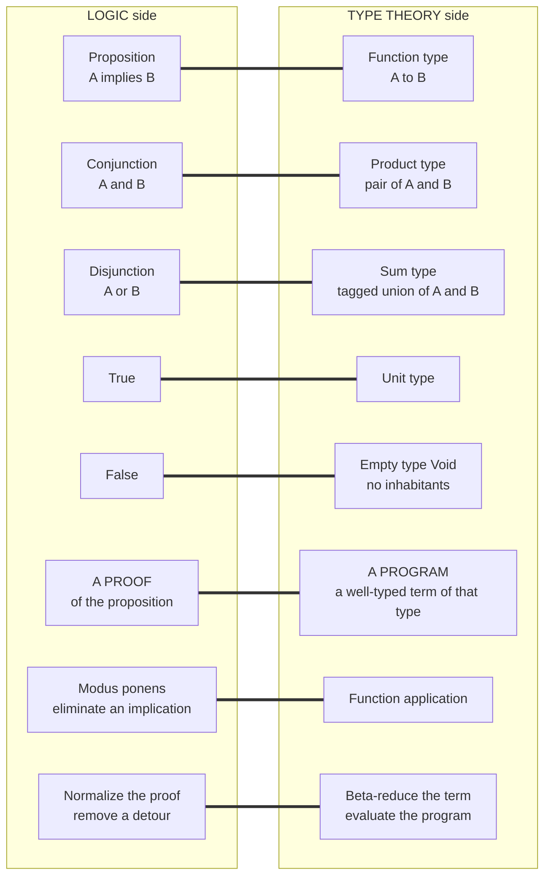

# 🔗 The Curry-Howard Correspondence

> [!abstract] TL;DR
> The **Curry-Howard correspondence** — *propositions as types, proofs as programs* — is the exact mathematical fact, discovered independently by **Haskell Curry** (1934) and **William Howard** (1969), that **logic and computation are the same structure seen from two sides**. A logical **proposition** `A implies B` *is* the function **type** `A -> B`; a **proof** of that proposition *is* a **program** of that type; and **simplifying a proof** (cut elimination / normalization) *is* **running the program** (beta-reduction). Conjunction is the pair type, disjunction is the sum type, `true` is the unit type, `false` is the empty type; universal quantification is the dependent Π type, existential is the Σ type; *modus ponens* is function application, implication-introduction is lambda abstraction. **Lambek** added a third face — **cartesian closed categories** — giving the *computational trinity* logic ≅ type theory ≅ category theory. This is why dependently-typed languages (**Coq, Agda, Lean, Idris**) are simultaneously programming languages and **proof assistants**: to type-check a program *is* to check a proof. It is PLT's deepest and most beautiful idea.

---

## Intuition

**Analogy — two towers, built centuries apart, turn out to be one tower seen from two sides.** For over two thousand years, **logicians** built a tower: axioms, inference rules, proofs, theorems — the machinery of valid reasoning, refined by Aristotle, Frege, Gentzen. Quite separately, in the twentieth century, **programmers** built another tower: variables, functions, types, programs — the machinery of computation, distilled by Church into the lambda calculus. The two crews never spoke; they used different words, different symbols, different journals. Then someone walked around to the back and discovered the shocking truth: **it is the same tower.** Every brick in the logic tower has an exact twin in the programming tower, in the same place, bearing the same load.

Concretely: the logical statement **"A implies B"** is *literally the same object* as the **type of a function that turns an A into a B**, written `A -> B`. A **proof** that A implies B is *literally* a **program** of that type — a recipe that, fed any evidence for A, constructs evidence for B. And the act every logician calls **"simplifying a proof"** — cutting out a redundant detour where you prove a lemma and immediately use it — is *literally* the act every programmer calls **"running the program"**: substituting an argument into a function and reducing. Logic and computation are not *analogous*. They are not *similar*. Under Curry-Howard they are **one and the same mathematics**, and this note is a tour of that identity, brick by brick.

---

## How It Works

### Core Mechanics

The correspondence has **three legs**. Miss any one and it collapses to a cute analogy; together they make it an *isomorphism* — a perfect, structure-preserving dictionary you can read in either direction.

**Leg 1 — Propositions ARE types.** Read a logical connective as a type constructor and the translation is total, not partial:

- **Implication** `A ⇒ B` is the **function type** `A -> B`. To assert "A implies B" is to claim you can *transform* any evidence for A into evidence for B — exactly what a function of type `A -> B` does.
- **Conjunction** `A ∧ B` is the **product (pair) type** `A × B`. To prove "A and B" you must supply evidence for *both*, i.e. a **pair** `(a, b)`.
- **Disjunction** `A ∨ B` is the **sum (tagged-union) type** `A + B`. To prove "A or B" you must supply evidence for *one side, tagged with which side* — a `Left a` or a `Right b`. The tag matters: constructively you must *know which* disjunct holds.
- **True** `⊤` is the **unit type** (one trivial inhabitant, `()` — always provable, carries no information).
- **False** `⊥` is the **empty type** `Void` (*no* inhabitants — you can never construct a proof, which is exactly what "false" should mean). Negation `¬A` is then `A -> Void`.
- **Universal quantification** `∀x. P(x)` is the **dependent function (Π) type** — a polymorphic/parametric function whose output type depends on its input.
- **Existential quantification** `∃x. P(x)` is the **dependent pair (Σ) type** — a witness paired with evidence about it.

**Leg 2 — Proofs ARE programs (terms).** A proposition is a *type*; a *proof* of it is a **well-typed term** *inhabiting* that type. The inference rules of natural deduction become the *typing rules* of the lambda calculus, one for one:

- **Implication-introduction** (assume A, derive B, conclude `A ⇒ B`) is **lambda abstraction** `λx:A. body`.
- **Implication-elimination** (from `A ⇒ B` and `A` conclude `B`) — i.e. **modus ponens** — is **function application** `f a`.
- **Conjunction-introduction** is **pairing** `(a, b)`; **conjunction-elimination** is **projection** `fst` / `snd`.
- **Disjunction-introduction** is **injection** `inl` / `inr`; **disjunction-elimination** is **case analysis** `case s of inl x → … | inr y → …`.

So a *proof* of `A ∧ B ⇒ A` is not just *represented by* the projection `λp. fst p`; under the correspondence it **is** that program, of type `(A × B) -> A`. A proof of `A ⇒ A` **is** the identity `λx. x`.

**Leg 3 — Proof normalization IS program evaluation.** This is the leg that turns a static dictionary into a *dynamic* isomorphism, and the deepest of the three. A **detour** in a proof — introduce a connective and then *immediately* eliminate it (prove a lemma just to use it once) — is redundant; **Gentzen's cut elimination** and **Prawitz's normalization** are the procedures that remove such detours. On the program side, a detour is *exactly a redex*: `(λx. body) arg` (introduce `⇒` then eliminate it), or `fst (a, b)` (introduce `∧` then eliminate it). **Removing the detour is beta-reduction.** Therefore *normalizing a proof and evaluating a program are the same operation*, and two profound facts line up:

- **Strong normalization** of a typed calculus (every program halts) **equals consistency** of the corresponding logic (no proof of `⊥`). The simply-typed lambda calculus *strongly normalizes* precisely because intuitionistic implicational logic is *consistent*.
- **Confluence** (Church-Rosser — the normal form is unique) is the proof-theoretic image of computation being **deterministic in its result**. See [[Reduction_Strategies_and_Evaluation_Order]] and [[The_Lambda_Calculus]].

### The base case — STLC ⟷ intuitionistic logic

The cleanest instance is the **simply-typed lambda calculus (STLC)**, which corresponds *exactly* to the **implicational fragment of intuitionistic propositional natural deduction** (the sibling note `Simply_Typed_Lambda_Calculus` develops the calculus itself). Crucially the logic is **intuitionistic (constructive), not classical**: a proof must **construct** its evidence, which is precisely what a program does when it *builds* an output. Classical laws like **excluded middle** `A ∨ ¬A` and **double-negation elimination** `¬¬A ⇒ A` are *not* provable, because you cannot in general *produce* a tagged witness for `A ∨ ¬A` by pure construction. This constructive discipline is the topic of the sibling `Intuitionistic_Logic_and_Constructive_Proofs`.

### The trinity — Curry-Howard-Lambek adds category theory

**Joachim Lambek** supplied a *third* face: **cartesian closed categories (CCCs)**. Propositions ≅ types ≅ **objects**; proofs ≅ programs ≅ **morphisms**; the function type is the categorical **exponential**, the product type is the categorical **product**. This is the **computational trinity**: intuitionistic logic ≅ typed lambda calculus ≅ cartesian closed categories — one structure wearing three costumes (see [[Category_Theory]]). It is why a categorical semantics gives programs *and* proofs a shared mathematical home.

### Where classical logic fits — control operators

If the *constructive* fragment is *pure* functional programming, then **classical logic is programming with control**. **Timothy Griffin** (1990) discovered that adding **excluded middle / double-negation elimination** corresponds to adding **control operators** like `call/cc` and continuations — a classical proof is a program that can **jump**. The intuitionistic-vs-classical divide mirrors the **pure-vs-control** divide: a `call/cc` "grabs the rest of the computation" the way a classical proof by contradiction "assumes `¬A`, derives absurdity, and jumps back."

### Flow / Architecture — the dictionary



*Each thick link is an identity, not a resemblance: read the dictionary left-to-right to turn a theorem into a type, right-to-left to turn a program into a proof.*

---

## Key Concepts

**Secondary (explain to a curious beginner).**
- A **type** like "function from A to B" is the same idea as the logical claim "**if** A **then** B."
- A **program** of that type is a **proof** of that claim: hand it an A and it *builds* you a B.
- Combining values (a *pair*) is proving "**and**"; choosing a tagged option is proving "**or**"; running the program is *simplifying* the proof.

**Undergraduate (requires a CS background).**
- The **dictionary**: `⇒` ↔ function type, `∧` ↔ product, `∨` ↔ sum, `⊤` ↔ unit, `⊥` ↔ `Void`, `¬A` ↔ `A -> Void`.
- **Introduction/elimination = construct/use**: `λ` introduces `⇒`, application eliminates it (*modus ponens*); pairing introduces `∧`, projection eliminates it; injection introduces `∨`, `case` eliminates it.
- **Normalization = evaluation**: a proof "detour" is a **redex**; cut elimination is **beta-reduction**; the STLC corresponds to the **implicational fragment of intuitionistic** natural deduction.
- **Why intuitionistic**: constructive proofs must *build* witnesses, so **excluded middle** is not a theorem — mirroring that a *total, pure* function cannot conjure a value from nothing.

**Graduate (system-level and foundational thinking).**
- **Strong normalization ⇔ logical consistency**; **confluence ⇔ determinism of results**; both are theorems about the *same* rewrite system read in two vocabularies.
- The **Curry-Howard-Lambek trinity**: intuitionistic logic ≅ typed lambda calculus ≅ **cartesian closed categories** (function type = exponential, product = categorical product).
- **Extensions**: `∀`/`∃` ↔ **Π/Σ** (dependent types); **System F** ↔ *second-order* propositional logic (the sibling `Polymorphism_and_System_F`); **linear logic** ↔ resource/affine types (Rust's ownership); **modal logic** ↔ comonadic/staged types.
- **Griffin's theorem**: classical logic ↔ **control operators** (`call/cc`); the pure/effectful divide *is* the intuitionistic/classical divide.
- **Proof relevance**: distinct proofs of one proposition are distinct programs with distinct behavior — sharpened by **Martin-Löf type theory** and **Homotopy Type Theory** (proofs as paths).

---

## Python Demo

We make the correspondence **executable**. We build a tiny typed lambda calculus whose types *are* propositions (`Base` atoms, `Arrow` = implication, `Prod` = conjunction, `Sum` = disjunction, `Unit` = true) and whose terms *are* proofs. A **type checker** doubles as a **proof checker**: `type_of(term)` succeeds *iff* `term` is a valid proof of the proposition it returns. We then show the two headline identities — the proof of `A ∧ B ⇒ A` **is** `λp. fst p : (A × B) -> A`, and the proof of `A ⇒ A` **is** the identity — and demonstrate that **beta-reducing a proof-term = normalizing the proof** (removing an introduce-then-eliminate *detour*), with the type preserved (subject reduction). Finally we visualize the propositions-as-types dictionary and a proof-term with its type side by side. Pure standard library + matplotlib.

```python
# ======================================================================
# CURRY-HOWARD, MADE EXECUTABLE.
#   * Types ARE propositions:  Base / Arrow(=>) / Prod(and) / Sum(or) / Unit(true)
#   * Terms ARE proofs:        Var/Lam/App, Pair/Fst/Snd, Inl/Inr/Case, UnitVal
#   * A TYPE CHECKER is a PROOF CHECKER:  type_of(term) succeeds iff term proves it.
#   * BETA-REDUCTION is PROOF NORMALIZATION: removing an intro-then-elim DETOUR,
#     with the type (the proposition) preserved  --  "subject reduction".
# Pure standard library + matplotlib (no numpy needed).
# ======================================================================
import sys
from dataclasses import dataclass
from typing import Optional, Union
import matplotlib.pyplot as plt

try:
    sys.stdout.reconfigure(encoding="utf-8")   # print lambda/arrows on any console
except Exception:
    pass

# ----------------------------------------------------------------------
# 1. TYPES == PROPOSITIONS  (frozen dataclasses -> structural equality)
# ----------------------------------------------------------------------
@dataclass(frozen=True)
class Base:  name: str                       # atomic proposition, e.g. A, B
@dataclass(frozen=True)
class Arrow:  a: "Ty"; b: "Ty"               # A => B   (implication / function)
@dataclass(frozen=True)
class Prod:   a: "Ty"; b: "Ty"               # A ^ B    (conjunction / pair)
@dataclass(frozen=True)
class Sum:    a: "Ty"; b: "Ty"               # A v B    (disjunction / tagged union)
@dataclass(frozen=True)
class Unit:   pass                            # true     (unit type)
Ty = Union[Base, Arrow, Prod, Sum, Unit]

def show_ty(t: Ty) -> str:
    if isinstance(t, Base):  return t.name
    if isinstance(t, Arrow): return f"({show_ty(t.a)} -> {show_ty(t.b)})"
    if isinstance(t, Prod):  return f"({show_ty(t.a)} * {show_ty(t.b)})"
    if isinstance(t, Sum):   return f"({show_ty(t.a)} + {show_ty(t.b)})"
    return "Unit"

# ----------------------------------------------------------------------
# 2. TERMS == PROOFS   (each constructor is an intro/elim rule of logic)
# ----------------------------------------------------------------------
@dataclass(frozen=True)
class Var:  name: str
@dataclass(frozen=True)
class Lam:  param: str; pty: Ty; body: "Tm"          # =>-intro   (assume, derive)
@dataclass(frozen=True)
class App:  fun: "Tm"; arg: "Tm"                     # =>-elim    (modus ponens)
@dataclass(frozen=True)
class Pair: fst: "Tm"; snd: "Tm"                     # ^-intro
@dataclass(frozen=True)
class Fst:  p: "Tm"                                  # ^-elim (left)
@dataclass(frozen=True)
class Snd:  p: "Tm"                                  # ^-elim (right)
@dataclass(frozen=True)
class Inl:  e: "Tm"; other: Ty                       # v-intro (left),  other = B
@dataclass(frozen=True)
class Inr:  e: "Tm"; other: Ty                       # v-intro (right), other = A
@dataclass(frozen=True)
class Case: s: "Tm"; xl: str; bl: "Tm"; xr: str; br: "Tm"   # v-elim (case analysis)
@dataclass(frozen=True)
class UnitVal: pass                                  # true-intro
Tm = Union[Var, Lam, App, Pair, Fst, Snd, Inl, Inr, Case, UnitVal]

def show_tm(t: Tm) -> str:
    if isinstance(t, Var):     return t.name
    if isinstance(t, Lam):     return f"λ{t.param}:{show_ty(t.pty)}. {show_tm(t.body)}"
    if isinstance(t, App):     return f"({show_tm(t.fun)} {show_tm(t.arg)})"
    if isinstance(t, Pair):    return f"pair({show_tm(t.fst)}, {show_tm(t.snd)})"
    if isinstance(t, Fst):     return f"fst {show_tm(t.p)}"
    if isinstance(t, Snd):     return f"snd {show_tm(t.p)}"
    if isinstance(t, Inl):     return f"inl {show_tm(t.e)}"
    if isinstance(t, Inr):     return f"inr {show_tm(t.e)}"
    if isinstance(t, Case):    return (f"case {show_tm(t.s)} of "
                                       f"inl {t.xl} -> {show_tm(t.bl)} | "
                                       f"inr {t.xr} -> {show_tm(t.br)}")
    return "unit"

# ----------------------------------------------------------------------
# 3. TYPE CHECKER == PROOF CHECKER.
#    Returns the proposition the term proves, or raises: the term is not a proof.
# ----------------------------------------------------------------------
class NotAProof(Exception): pass

def type_of(t: Tm, env: dict) -> Ty:
    if isinstance(t, Var):
        if t.name not in env: raise NotAProof(f"unbound assumption {t.name!r}")
        return env[t.name]
    if isinstance(t, Lam):                                   # =>-introduction
        return Arrow(t.pty, type_of(t.body, {**env, t.param: t.pty}))
    if isinstance(t, App):                                   # =>-elimination (MP)
        f = type_of(t.fun, env)
        if not isinstance(f, Arrow): raise NotAProof("applying a non-implication")
        if type_of(t.arg, env) != f.a: raise NotAProof("modus ponens type mismatch")
        return f.b
    if isinstance(t, Pair):                                  # ^-introduction
        return Prod(type_of(t.fst, env), type_of(t.snd, env))
    if isinstance(t, Fst):                                   # ^-elimination (left)
        p = type_of(t.p, env)
        if not isinstance(p, Prod): raise NotAProof("fst of a non-conjunction")
        return p.a
    if isinstance(t, Snd):                                   # ^-elimination (right)
        p = type_of(t.p, env)
        if not isinstance(p, Prod): raise NotAProof("snd of a non-conjunction")
        return p.b
    if isinstance(t, Inl):                                   # v-introduction (left)
        return Sum(type_of(t.e, env), t.other)
    if isinstance(t, Inr):                                   # v-introduction (right)
        return Sum(t.other, type_of(t.e, env))
    if isinstance(t, Case):                                  # v-elimination
        s = type_of(t.s, env)
        if not isinstance(s, Sum): raise NotAProof("case on a non-disjunction")
        cl = type_of(t.bl, {**env, t.xl: s.a})
        cr = type_of(t.br, {**env, t.xr: s.b})
        if cl != cr: raise NotAProof("case branches prove different propositions")
        return cl
    return Unit()                                            # true-introduction

def proves(term: Tm, prop: Ty) -> bool:
    try:    return type_of(term, {}) == prop
    except NotAProof: return False

# ----------------------------------------------------------------------
# 4. BETA-REDUCTION == PROOF NORMALIZATION (capture-avoiding substitution).
#    A redex is an intro immediately followed by an elim: THE detour.
# ----------------------------------------------------------------------
def free_vars(t: Tm) -> set:
    if isinstance(t, Var):  return {t.name}
    if isinstance(t, Lam):  return free_vars(t.body) - {t.param}
    if isinstance(t, App):  return free_vars(t.fun) | free_vars(t.arg)
    if isinstance(t, Pair): return free_vars(t.fst) | free_vars(t.snd)
    if isinstance(t, (Fst, Snd)): return free_vars(t.p)
    if isinstance(t, (Inl, Inr)): return free_vars(t.e)
    if isinstance(t, Case):
        return (free_vars(t.s) | (free_vars(t.bl) - {t.xl}) | (free_vars(t.br) - {t.xr}))
    return set()

_n = [0]
def fresh(base, avoid):
    c = base
    while c in avoid:
        _n[0] += 1; c = f"{base}{_n[0]}"
    return c

def subst(t: Tm, x: str, s: Tm) -> Tm:
    if isinstance(t, Var):  return s if t.name == x else t
    if isinstance(t, App):  return App(subst(t.fun, x, s), subst(t.arg, x, s))
    if isinstance(t, Pair): return Pair(subst(t.fst, x, s), subst(t.snd, x, s))
    if isinstance(t, Fst):  return Fst(subst(t.p, x, s))
    if isinstance(t, Snd):  return Snd(subst(t.p, x, s))
    if isinstance(t, Inl):  return Inl(subst(t.e, x, s), t.other)
    if isinstance(t, Inr):  return Inr(subst(t.e, x, s), t.other)
    if isinstance(t, Lam):
        if t.param == x: return t
        if t.param in free_vars(s):
            p = fresh(t.param, free_vars(s) | free_vars(t.body) | {x})
            return Lam(p, t.pty, subst(subst(t.body, t.param, Var(p)), x, s))
        return Lam(t.param, t.pty, subst(t.body, x, s))
    if isinstance(t, Case):
        return Case(subst(t.s, x, s), t.xl,
                    t.bl if t.xl == x else subst(t.bl, x, s), t.xr,
                    t.br if t.xr == x else subst(t.br, x, s))
    return t

def step(t: Tm) -> Optional[Tm]:
    # --- the three DETOUR eliminations (redexes) ---
    if isinstance(t, App) and isinstance(t.fun, Lam):            # (=>-intro then =>-elim)
        return subst(t.fun.body, t.fun.param, t.arg)
    if isinstance(t, Fst) and isinstance(t.p, Pair): return t.p.fst   # (^-intro then ^-elim)
    if isinstance(t, Snd) and isinstance(t.p, Pair): return t.p.snd
    if isinstance(t, Case) and isinstance(t.s, Inl):            # (v-intro then v-elim)
        return subst(t.bl, t.xl, t.s.e)
    if isinstance(t, Case) and isinstance(t.s, Inr):
        return subst(t.br, t.xr, t.s.e)
    # --- otherwise descend to find an inner detour ---
    if isinstance(t, App):
        r = step(t.fun);  return App(r, t.arg) if r else \
            (App(t.fun, step(t.arg)) if step(t.arg) else None)
    if isinstance(t, Lam):
        r = step(t.body); return Lam(t.param, t.pty, r) if r else None
    if isinstance(t, Pair):
        r = step(t.fst);  return Pair(r, t.snd) if r else \
            (Pair(t.fst, step(t.snd)) if step(t.snd) else None)
    if isinstance(t, Fst): r = step(t.p); return Fst(r) if r else None
    if isinstance(t, Snd): r = step(t.p); return Snd(r) if r else None
    if isinstance(t, Inl): r = step(t.e); return Inl(r, t.other) if r else None
    if isinstance(t, Inr): r = step(t.e); return Inr(r, t.other) if r else None
    if isinstance(t, Case): r = step(t.s); return Case(r, t.xl, t.bl, t.xr, t.br) if r else None
    return None

def normalize(t: Tm, env: dict):
    seq = [t]
    while True:
        nxt = step(seq[-1])
        if nxt is None: return seq
        seq.append(nxt)

# ======================================================================
# DEMO A -- proofs ARE programs: exhibit inhabitants (proofs) of propositions.
# ======================================================================
A, B = Base("A"), Base("B")

identity   = Lam("x", A, Var("x"))                         # proof of  A => A
projection = Lam("p", Prod(A, B), Fst(Var("p")))          # proof of  (A ^ B) => A
K_comb     = Lam("x", A, Lam("y", B, Var("x")))           # proof of  A => (B => A)
inject     = Lam("x", A, Inl(Var("x"), B))                # proof of  A => (A v B)

catalog = [
    ("A => A",            identity,   Arrow(A, A)),
    ("(A ^ B) => A",      projection, Arrow(Prod(A, B), A)),
    ("A => (B => A)",     K_comb,     Arrow(A, Arrow(B, A))),
    ("A => (A v B)",      inject,     Arrow(A, Sum(A, B))),
]
print("=== Demo A: a PROOF of each proposition IS a well-typed PROGRAM ===")
for name, term, prop in catalog:
    ok = proves(term, prop)
    print(f"  {name:<16}  proved by  {show_tm(term):<28}  : {show_ty(prop)}   [{'OK' if ok else 'FAIL'}]")
    assert ok

# A NON-theorem: no closed term inhabits  A => B  for distinct atoms A, B.
bogus = Lam("x", A, Var("x"))            # has type A => A, NOT A => B
print("\n  A => B has no proof: the identity does NOT prove it ->",
      proves(bogus, Arrow(A, B)))        # False: types A and B differ
assert not proves(bogus, Arrow(A, B))

# ======================================================================
# DEMO B -- normalization IS evaluation: remove an intro-then-elim DETOUR,
#           and watch the proposition (the type) stay fixed.
# ======================================================================
env = {"a": A, "b": B}
detour_and  = Fst(Pair(Var("a"), Var("b")))               # ^-intro then ^-elim
detour_imp  = App(Lam("x", A, Var("x")), Var("a"))        # =>-intro then =>-elim
detour_or   = Case(Inl(Var("a"), B), "u", Var("u"), "v", Var("v"))  # v-intro then v-elim

print("\n=== Demo B: BETA-REDUCTION = PROOF NORMALIZATION (subject reduction) ===")
for label, term in [("conjunction detour  fst(pair a b)", detour_and),
                    ("implication detour  (λx.x) a",       detour_imp),
                    ("disjunction detour  case inl a",     detour_or)]:
    seq = normalize(term, env)
    t0, t1 = show_ty(type_of(seq[0], env)), show_ty(type_of(seq[-1], env))
    print(f"  {label}")
    print(f"      {show_tm(seq[0])}   -->*   {show_tm(seq[-1])}")
    print(f"      type before = {t0}   type after = {t1}   [preserved: {t0 == t1}]")
    assert t0 == t1                                        # the theorem is unchanged

# ======================================================================
# 5. VISUALIZE: the propositions-as-types dictionary + one proof and its type.
# ======================================================================
fig = plt.figure(figsize=(14, 6.5))
gs = fig.add_gridspec(1, 2, width_ratios=[1.25, 1.0])

# Panel 1: the dictionary as a table.
ax1 = fig.add_subplot(gs[0, 0]); ax1.axis("off")
ax1.set_title("Propositions  ==  Types      (Proofs == Programs)", fontweight="bold")
rows = [
    ["implication  A => B", "function type  A -> B"],
    ["conjunction  A and B", "product type  A * B"],
    ["disjunction  A or B", "sum type  A + B"],
    ["true",                 "unit type"],
    ["false",                "empty type  Void"],
    ["for all  x. P",        "dependent Pi type"],
    ["exists  x. P",         "dependent Sigma type"],
    ["modus ponens",         "function application"],
    ["normalize the proof",  "beta-reduce the program"],
]
tbl = ax1.table(cellText=rows, colLabels=["LOGIC (proposition)", "TYPE THEORY (type)"],
                cellLoc="left", colLoc="left", loc="center")
tbl.auto_set_font_size(False); tbl.set_fontsize(10.5); tbl.scale(1, 1.55)
for c in range(2):
    tbl[(0, c)].set_facecolor("#4C72B0"); tbl[(0, c)].set_text_props(color="white", fontweight="bold")
for r in range(1, len(rows) + 1):
    tbl[(r, 0)].set_facecolor("#EAF0F7"); tbl[(r, 1)].set_facecolor("#EAF7EE")

# Panel 2: one proof-term shown next to the proposition (type) it proves.
ax2 = fig.add_subplot(gs[0, 1]); ax2.axis("off")
ax2.set_title("A PROOF and its PROPOSITION, side by side", fontweight="bold")
ax2.text(0.5, 0.90, "Theorem:  (A and B)  implies  A", ha="center", fontsize=13, color="#4C72B0")
ax2.text(0.5, 0.74, "PROPOSITION / TYPE", ha="center", fontsize=10, color="#555")
ax2.text(0.5, 0.66, show_ty(Arrow(Prod(A, B), A)), ha="center", family="monospace", fontsize=13)
ax2.annotate("", xy=(0.5, 0.50), xytext=(0.5, 0.60),
             arrowprops=dict(arrowstyle="<->", color="#888"))
ax2.text(0.60, 0.55, "is inhabited by", fontsize=9, color="#888", va="center")
ax2.text(0.5, 0.44, "PROOF / PROGRAM", ha="center", fontsize=10, color="#555")
ax2.text(0.5, 0.36, show_tm(projection), ha="center", family="monospace", fontsize=13, color="#2a7")
ax2.text(0.5, 0.15,
         "detour  fst(pair a b)  --beta-->  a\n"
         "removing an intro-then-elim detour\n"
         "IS running the program",
         ha="center", fontsize=10, color="#C44E52",
         bbox=dict(boxstyle="round", fc="#FBEAEA", ec="#C44E52"))

fig.suptitle("Curry-Howard: logic and computation are one structure, two languages",
             fontsize=14, fontweight="bold")
fig.tight_layout(rect=(0, 0, 1, 0.95))
plt.savefig("curry_howard.png", dpi=130)
print("\nSaved dictionary + proof/type figure to curry_howard.png")
```

Running it prints a proof-term inhabiting each proposition (`λx:A. x` proves `A -> A`, `λp:(A * B). fst p` proves `(A * B) -> A`, and so on), confirms that the identity does *not* prove the non-theorem `A -> B`, and then reduces three **detours** — one per connective — showing in each case that beta-reduction removes the redundant introduce-then-eliminate step *while the type (the theorem being proved) is preserved*. That preservation is **subject reduction**: normalizing a proof never changes *which* proposition it proves, exactly as evaluating a program never changes its type. The figure renders the propositions-as-types dictionary beside a single worked proof and its proposition.

---

## Real-World Applications

> **Proof assistants — Coq, Agda, Lean, Idris — are Curry-Howard turned into a product.** In a dependently-typed language a **theorem is a type** and its **proof is a program** of that type; **type-checking is proof-checking**. Lean's `mathlib` has mechanized thousands of theorems this way; **Coq** was used to build [[Formal_Semantics_and_Verified_Compilers|CompCert]] (a C compiler *proved* to preserve semantics) and the four-colour theorem's machine-checked proof; **Agda** and **Idris** let you write ordinary programs whose *types* are specifications the checker enforces. The sibling notes `Proof_Assistants_and_Dependent_Type_Theory` and `Dependent_Types_and_Advanced_Type_Systems` develop this.

- **Program extraction.** Because a constructive proof *is* an algorithm, tools **extract** a running program (OCaml/Haskell) directly from a Coq/Agda proof — verified code for free, the payoff of `Verified_and_Certified_Languages`.
- **Rust's ownership** is **linear/affine logic** under Curry-Howard: "use a resource exactly once" is a proof obligation the borrow checker discharges at compile time (see [[Proof_Theory_and_Natural_Deduction]] on linear logic).
- **Haskell / ML type checkers are proof searchers.** Every well-typed expression is a proof in intuitionistic propositional logic; `const :: a -> b -> a` *is* the logical axiom `A ⇒ (B ⇒ A)`. **Hindley-Milner inference** is proof search — see [[Type_Inference_and_Hindley_Milner]] and [[Type_Checking_and_Type_Systems]].
- **Continuations and `call/cc`.** Griffin's discovery means control operators in Scheme/ML are *classical* proofs — the theory behind delimited continuations and typed effect systems.

---

## Common Pitfalls

- **Reading it as a metaphor.** Curry-Howard is a **precise isomorphism**, not a poetic resemblance. A proof of `A ∧ B` and a value of type `(A, B)` are *literally the same object*; the dictionary maps rules to rules, detours to redexes, exactly.
- **Forgetting the base logic is intuitionistic.** The clean correspondence is with **constructive** logic. **Excluded middle** and **double-negation elimination** have *no* proof term in pure STLC — they require **control operators**. Expecting `A ∨ ¬A` to be inhabited by a pure function is the classic trap.
- **Confusing "well-typed" with "true/correct."** A term proves *only* the proposition that is its type. A program can be perfectly well-typed and still compute a useless answer — its *type* is the theorem, and a trivial type (like `Unit`, or `A -> A`) is a trivial theorem.
- **Missing the third leg.** Many learn "propositions are types, proofs are programs" and stop. Without **normalization = evaluation**, you have a static dictionary, not the *dynamic* isomorphism where **strong normalization equals consistency**.
- **Thinking every type is a useful proposition.** In a *non-terminating* language (with general recursion), *every* type is inhabited by a looping term, so the "logic" is **inconsistent** — you can "prove" `Void`. This is exactly why proof assistants insist on **totality/termination**: an infinite loop is a proof of falsehood.
- **Overreaching the analogy to imperative code.** The correspondence is cleanest for *pure, total* functional programs. Side effects, mutation, and non-termination correspond to *richer or inconsistent* logics (effects ↔ monads/modalities, control ↔ classical logic), not to plain intuitionistic natural deduction.

---

## Related Concepts

- [[Programming_Language_Theory_Overview]] — situates Curry-Howard as PLT's deepest idea, tying syntax, semantics, and types together.
- [[The_Lambda_Calculus]] — the *program* side of the correspondence; beta-reduction is the normalization that removes proof detours.
- [[Proof_Theory_and_Natural_Deduction]] — the *logic* side: introduction/elimination rules, cut elimination, and the vault's treatment of sequent calculus and linear logic.
- [[Category_Theory]] — the third face of the trinity: cartesian closed categories, where propositions/types are objects and proofs/programs are morphisms (Curry-Howard-**Lambek**).
- [[Recursive_Functions_and_Lambda_Calculus]] — how λ-definability and general recursion relate; why unrestricted recursion makes the "logic" inconsistent.
- [[Turing_Machines_and_the_Church_Turing_Thesis]] — the untyped/Turing-complete world *below* the typed, normalizing calculi that model consistent logics.
- [[The_Halting_Problem_and_Undecidability]] — non-termination as a "proof of `⊥`"; why proof assistants require totality.
- [[Reduction_Strategies_and_Evaluation_Order]] — confluence and normalization strategies underpin "normalization = evaluation."
- [[Church_Encodings_and_Computability]] — encoding pairs, sums, and booleans as functions parallels encoding conjunction, disjunction, and truth.
- [[Combinatory_Logic_and_Fixed_Points]] — Curry's `SKI` basis; the `K` combinator *is* the axiom `A ⇒ (B ⇒ A)`.
- [[Propositional_Logic]] — the connectives (`∧`, `∨`, `⇒`, `⊤`, `⊥`) that become product, sum, function, unit, and void types.
- [[Predicate_Logic_and_Quantifiers]] — `∀`/`∃` become the dependent Π/Σ types of the extended correspondence.
- [[Mathematical_Logic_and_Set_Theory]] — Gödel/consistency backdrop; strong normalization ⇔ logical consistency.
- [[Logic_and_Proof_Techniques]] — informal proof methods whose formal shadows are these typing rules and structural induction.
- [[Logic_in_AI_and_Computation]] — automated reasoning and verification, applied Curry-Howard in proof search and SMT.
- [[Type_Checking_and_Type_Systems]] — a type checker *is* a proof checker; the engineering realization of the correspondence.
- [[Type_Inference_and_Hindley_Milner]] — type inference as proof search in intuitionistic propositional logic.
- [[Formal_Semantics_and_Verified_Compilers]] — CompCert and friends: Curry-Howard scaled to industrial verified software.

*Sibling PLT notes referenced in prose but not yet written — to be wikilinked once built — are `Simply_Typed_Lambda_Calculus`, `Type_Systems_Fundamentals`, `Polymorphism_and_System_F`, `Dependent_Types_and_Advanced_Type_Systems`, `Intuitionistic_Logic_and_Constructive_Proofs`, `Natural_Deduction_and_Sequent_Calculus`, `Proof_Assistants_and_Dependent_Type_Theory`, `Verified_and_Certified_Languages`, and `Functional_Programming_Foundations`.*

---

## Review Questions

1. **(Secondary)** Explain, without symbols, why "a proof of *A implies B*" and "a program that turns an A into a B" are the same thing. Then say what a *pair* proves and what running that program corresponds to on the logic side.
2. **(Undergraduate)** Give the exact proof-term (well-typed lambda term) that proves each of: `A ∧ B ⇒ B`, `A ⇒ (A ∨ B)`, and `(A ⇒ B) ⇒ ((B ⇒ C) ⇒ (A ⇒ C))`. For the last one, name the elimination rule you used and its programming counterpart.
3. **(Graduate)** (a) Why is the STLC in correspondence with *intuitionistic*, not classical, logic — and what programming feature must you add to recover classical logic (per Griffin)? (b) Explain precisely why *strong normalization* of a typed calculus corresponds to *consistency* of its logic, and what goes wrong (logically) the moment you add unrestricted general recursion. (c) State the third leg of the Curry-Howard-Lambek trinity and identify what the function type, product type, and a program correspond to categorically.

---

## Sources

- Philip Wadler, "Propositions as Types," *Communications of the ACM* 58(12), 2015 — [PDF](https://homepages.inf.ed.ac.uk/wadler/papers/propositions-as-types/propositions-as-types.pdf) — the definitive accessible survey and history.
- William A. Howard, "The Formulae-as-Types Notion of Construction," in *To H. B. Curry: Essays on Combinatory Logic, Lambda Calculus and Formalism*, Academic Press, 1980 — [PDF](https://www.cs.cmu.edu/~crary/819-f09/Howard80.pdf) — the paper that made the correspondence precise.
- Morten H. Sørensen and Paweł Urzyczyn, *Lectures on the Curry-Howard Isomorphism*, Studies in Logic 149, Elsevier, 2006 — the standard book-length treatment (STLC, System F, classical logic, dependent types).
- Timothy G. Griffin, "A Formulae-as-Types Notion of Control," *POPL 1990* — [PDF](https://www.cs.cmu.edu/~crary/819-f09/Griffin90.pdf) — classical logic corresponds to control operators.
- Benjamin C. Pierce, *Types and Programming Languages*, MIT Press, 2002 — chapters 9 and 30 cover STLC, propositions-as-types, and System F.
- J. Lambek and P. J. Scott, *Introduction to Higher-Order Categorical Logic*, Cambridge University Press, 1986 — the categorical (Lambek) face of the trinity.

---

#programming-language-theory #curry-howard #propositions-as-types #proofs-as-programs #type-theory
