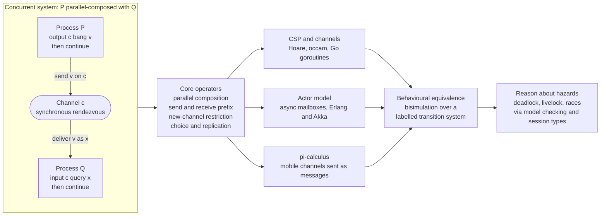

# 🔀 Concurrency and Process Calculi

> [!abstract] TL;DR
> The lambda calculus and Turing machines model **sequential** computation that produces a **final value**. But most real software is **many things running at once and talking to each other** — servers, threads, actors, microservices — where the interesting behaviour is **interaction, communication, and nondeterminism**, and where a process may **never terminate** yet continually respond. **Process calculi** are the "lambda calculus of concurrency": tiny algebras whose fundamental act is not *compute a value* but **send and receive a message**. The classics are **Hoare's CSP** (processes synchronize on shared channels/events — the model behind occam and Go's goroutines), **Milner's CCS**, and the landmark **π-calculus** (Milner–Parrow–Walker), which adds **mobility** — channels themselves can be sent as messages, so the communication topology changes at runtime. A parallel tradition, the **actor model** (Hewitt/Agha), uses **asynchronous** messages to actor mailboxes with **no shared state** — the theory behind Erlang/Elixir and "let it crash". The central equivalence is **bisimulation** (two processes are the same if each can match the other's observable steps, coinductively), and the central hazards are **deadlock, livelock, races, and starvation**, tamed by **model checking** and **session types**. This is the formal spine under every modern concurrency primitive.

---

## Intuition

**Analogy — a recipe versus a conversation.** The lambda calculus is a **recipe**: a single cook follows steps in order and, at the end, hands you a finished dish — the *value*. You judge a recipe by its *result*. But now imagine not one cook but a **restaurant kitchen**: a line cook, a grill, a pass, a dishwasher, all working at once, shouting orders back and forth — *"two steaks, medium!"*, *"heard, firing now!"*. There is no single "final answer"; the kitchen's *meaning* **is** the flow of orders and responses, the way stations synchronize and hand off, the fact that it keeps running service after service. Ask the wrong question — "what value does the kitchen return?" — and you have missed the point entirely. The right questions are about **interaction**: can two orders collide? Can everyone end up waiting on everyone else so nothing moves *(deadlock)*? Do two kitchens serve customers *indistinguishably* even if their internal chatter differs?

Process calculi are the mathematics of that kitchen. The atomic act is **"send this message on that channel"** and **"receive on that channel"**; the atomic *event* is a **rendezvous** where a sender and a receiver meet. A whole system is just processes **run in parallel**, and its meaning is its **behaviour over time** — the tree of who-can-talk-to-whom-next — not a number at the end. Where sequential theory asks *"what does it compute?"*, concurrency theory asks *"how does it interact, and when are two interactive things the same?"* That shift — from **answers** to **interaction** — is why the lambda calculus and [[Operational_Semantics]] for sequential languages are not enough, and why a genuinely new family of formalisms had to be invented.

---

## How It Works

### Core mechanics: processes, channels, and the operators

A process calculus is defined, like any language, by a **grammar of process terms** and an [[Operational_Semantics|operational semantics]] given as a **labelled transition system** (LTS) — states are processes, and a transition `P --α--> P'` says "process `P` can perform observable action `α` and become `P'`". The handful of combinators is small enough to fit on a napkin:

1. **Prefix (send / receive).** `c!v . P` outputs value `v` on channel `c` then behaves as `P`; `c?x . P` inputs a value on `c`, binds it to `x`, then behaves as `P`. These are the only actions that *do* anything.
2. **Parallel composition** `P | Q`. Run `P` and `Q` **concurrently**. This is the heart of the calculus: `P` and `Q` may each step independently (**interleaving**), or they may **synchronize** — a `c!v` in `P` meeting a `c?x` in `Q` produces one internal **communication** step (traditionally labelled `τ`, "tau"), after which `v` has flowed from `P` into `Q`'s `x`. In pure **CSP/CCS this rendezvous is synchronous**: the sender blocks until a receiver is ready and vice-versa — a *handshake*.
3. **Choice** `P + Q`. Offer *either* behaviour; whichever branch communicates first is taken and the other is discarded (external/internal choice). This is how a process reacts differently to different incoming messages.
4. **Restriction / new channel** `(new c) P` (written `νc.P`). Create a **fresh, private** channel `c` visible only inside `P` — the scoping construct that makes channels *local*, exactly analogous to variable binding in the [[The_Lambda_Calculus|lambda calculus]].
5. **Replication** `!P` (or recursion). Provide **unboundedly many** copies of `P` — the way the calculus expresses servers that spawn a fresh handler per request, and the source of Turing-completeness.

The **π-calculus** adds one deceptively small twist with enormous consequences: the *value* sent on a channel **can itself be a channel name**. So a process can receive a channel and then communicate on it — the **communication topology is not fixed but mobile**, reconfiguring at runtime. This "mobility" is exactly what lets the π-calculus model objects passing references, sessions being delegated, and reconfigurable networks — and it is powerful enough to **encode the lambda calculus itself**, cementing process calculi as a foundational model of computation on par with, but orthogonal to, the sequential one.

### Three traditions: CSP channels, actors, and the π-calculus

- **CSP (Hoare, 1978) and CCS (Milner, 1980)** — **synchronous message passing** over named channels/events. A send and a receive must **rendezvous**; there is no buffer. This is the model realized by **occam**, by **Go's goroutines and [[Channels|channels]]**, and by Clojure's `core.async`. It is excellent for reasoning about *protocols* because every communication is a synchronization point.
- **The Actor model (Hewitt 1973; Agha 1986)** — **asynchronous message passing** to an actor's **mailbox**, with **no shared memory** whatsoever. An actor, on receiving a message, may (a) send messages to actors it knows, (b) create new actors, and (c) designate its behaviour for the next message. Messages are buffered and delivery is decoupled from processing. This is the model behind **Erlang/Elixir** and **Akka**, and it underwrites the **"let it crash"** fault-tolerance philosophy: actors are cheap and isolated, so a supervisor simply restarts a crashed one rather than defensively handling every error. Contrast with CSP: actors are *asynchronous and addressed by identity*; CSP channels are *synchronous and addressed by channel*. See [[Interprocess_Communication]] and [[Distributed_Operating_Systems]].
- **The π-calculus (Milner–Parrow–Walker, 1992)** — CCS **plus mobility**. The one calculus that can express dynamically changing connectivity, making it the theoretical lingua franca for distributed systems, security protocols, and even biochemical modelling.

### Bisimulation: when are two concurrent systems "the same"?

Because a concurrent system's meaning is its **behaviour**, equivalence cannot be "same final value". The right notion is **bisimulation**, a **coinductive** definition: a relation `R` between process states is a **bisimulation** if whenever `P R Q`, every step `P --α--> P'` can be **matched** by a step `Q --α--> Q'` with `P' R Q'`, *and* symmetrically. Two processes are **bisimilar** if such an `R` links them — each can *simulate the other's every observable move, forever*. Crucially, **trace equivalence** (same set of possible action sequences) is **too weak**: it cannot see *where* choices are made, so it equates a vending machine that "offers tea-or-coffee then commits" with one that "commits first, then offers only one" — machines a user can clearly tell apart. Bisimulation is the finest, "right" behavioural equivalence, and it connects directly to the [[Contextual_Equivalence_and_Reasoning|contextual/observational equivalence]] used across the rest of PLT. **Strong** bisimulation counts every step including internal `τ`; **weak** bisimulation **abstracts away `τ`** (internal computation is invisible), so `a.0` and `τ.a.0` are *weakly* but not *strongly* bisimilar — the standard example that "housekeeping steps shouldn't be observable".

### The hazards, and how we rule them out

Concurrency theory exists largely to study and **eliminate failure modes**: **deadlock** (a cycle of processes each blocked waiting on the next — see [[Deadlocks_Detection_and_Avoidance]]), **livelock** (busy but making no progress), **race conditions** (interleaving-dependent results on shared state), and **starvation**. These are phrased as **safety** properties ("nothing bad ever happens") and **liveness** properties ("something good eventually happens"). Because the **interleaving state space explodes** combinatorially, we verify protocols with **model checkers** — **SPIN/Promela**, **TLA+**, **FDR** for CSP — that exhaustively search the LTS against **temporal-logic** specifications, the same machinery that underlies verified concurrency in [[Formal_Semantics_and_Verified_Compilers|formal verification]]. A complementary, *type-based* discipline is **session types**: a type that describes the **protocol** on a channel — the exact sequence of sends and receives — enforced with **linear typing** so the protocol is followed once and exactly, yielding **deadlock-freedom** and communication safety by construction. This is the concurrency face of the [[The_Curry_Howard_Correspondence|Curry–Howard correspondence]] — "propositions as sessions", built directly on the linear-logic and resource-type ideas of [[Linear_Logic_and_Resource_Types]].

### Flow / Architecture



---

## Key Concepts

### Secondary (intuition level)
- Sequential programs are a **recipe** with a final dish; concurrent systems are a **kitchen conversation** — the meaning is the *back-and-forth*, not a final answer.
- The atomic acts are **send** and **receive** on a **channel**; a **rendezvous** is when a sender and receiver meet.
- **Deadlock** is everyone waiting on everyone else so nothing moves; **message passing** avoids many bugs because each piece of state has **one owner** and others must *ask* it.

### Undergraduate (CS background)
- A process calculus = a **grammar of processes** + a **labelled transition system** `P --α--> P'`. Core operators: **prefix** (`c!v`, `c?x`), **parallel** `P|Q`, **choice** `P+Q`, **restriction** `νc.P`, **replication** `!P`.
- **Synchronous (CSP/CCS) channels** rendezvous with no buffer; the **actor model** uses **asynchronous mailboxes** with no shared memory. Go = CSP; Erlang/Akka = actors.
- **Interleaving** produces **nondeterminism**; the reachable global states form an LTS whose **state space explodes**. Deadlock = a reachable non-final state with no enabled transition.
- **Bisimulation** is the behavioural equivalence: match each other's steps coinductively. **Trace equivalence is too weak** (it can't see when a choice is made).

### Graduate (systems / metatheory level)
- The **π-calculus** extends CCS with **name mobility** — channels are first-class values, so connectivity is dynamic; it can encode the [[The_Lambda_Calculus|λ-calculus]], showing concurrency is a foundational model, not a sequential add-on.
- **Strong vs weak bisimulation**: weak bisimilarity quotients out internal `τ` actions; `a.0 ≈ τ.a.0` weakly but not strongly. Bisimilarity is a **congruence** (respected by all contexts) — the property that licenses substituting one process for another, linking to [[Contextual_Equivalence_and_Reasoning|contextual equivalence]].
- **Safety vs liveness**; **model checking** (SPIN, TLA+, FDR) over the LTS against **temporal logic**; the **state-space-explosion** problem and partial-order / symmetry reductions.
- **Session types** and **linear typing** ([[Linear_Logic_and_Resource_Types]]) give **"propositions as sessions"** (a [[The_Curry_Howard_Correspondence|Curry–Howard]] for concurrency): well-typed channels obey their protocol, yielding **deadlock-freedom** by construction. The counterpoint is **shared-memory concurrency** under **relaxed memory models** ([[Memory_Consistency_and_Concurrent_Data_Structures]]), which is why message passing is often preferred for *reasoning*.

---

## Python Demo

A tiny **CSP-style, synchronous message-passing simulator** — a **deterministic interleaving explorer**, *no real threads*. Processes are sequences of `send`/`recv` actions over channels; two processes **rendezvous** when one is sending and another is receiving on the same channel. The demo (1) explores the **full interleaving state space** of a **safe** protocol versus a **deadlocking** one and *detects the deadlock*; (2) shows **message passing avoids shared-memory races** by comparing possible outcomes of a shared-counter versus an owned-state server; (3) implements a **bisimulation checker** and illustrates **strong vs weak** bisimulation; and (4) **visualizes** the transition system, a space-time interaction diagram, the race contrast, and the bisimulation example. Pure standard library + matplotlib.

```python
"""
A tiny synchronous (CSP-style) message-passing simulator, deadlock detector,
race-vs-message-passing contrast, and bisimulation checker -- no real threads.
Pure standard library + matplotlib (no numpy).
"""
from itertools import permutations
from collections import defaultdict
import matplotlib.pyplot as plt

SEND, RECV, TAU = "send", "recv", "tau"

# ================================================================
# 1. INTERLEAVING EXPLORER over SYNCHRONOUS CHANNELS
#    A process = list of actions (SEND|RECV, channel).
#    A global state = tuple of program counters, one per process.
#    A transition = a rendezvous: process i SENDs on c while process j
#    RECVs on c; BOTH advance by one, atomically (no buffer, no shared mem).
# ================================================================
def explore(procs):
    """Build the labelled transition system of a system of processes.
       Returns (states, edges, deadlocks, terminals, start)."""
    n, lens = len(procs), [len(p) for p in procs]
    start = tuple([0] * n)
    seen, edges = {start}, []
    deadlocks, terminals = set(), set()
    frontier = [start]
    while frontier:
        st = frontier.pop()
        enabled = []
        for i in range(n):
            if st[i] >= lens[i] or procs[i][st[i]][0] != SEND:
                continue
            ci = procs[i][st[i]][1]
            for j in range(n):                       # find a matching receiver
                if i == j or st[j] >= lens[j]:
                    continue
                kj, cj = procs[j][st[j]]
                if kj == RECV and cj == ci:
                    nxt = list(st); nxt[i] += 1; nxt[j] += 1; nxt = tuple(nxt)
                    enabled.append((f"{ci}:P{i}->P{j}", nxt))
        if not enabled:                              # no rendezvous possible
            (terminals if all(st[i] >= lens[i] for i in range(n))
                       else deadlocks).add(st)       # all done vs STUCK = deadlock
        for label, nxt in enabled:
            edges.append((st, label, nxt))
            if nxt not in seen:
                seen.add(nxt); frontier.append(nxt)
    return seen, edges, deadlocks, terminals, start

def count_interleavings(edges, start):
    """Number of maximal execution paths (the state space is a DAG here)."""
    succ = defaultdict(list)
    for s, _, t in edges:
        succ[s].append(t)
    memo = {}
    def paths(s):
        if s in memo: return memo[s]
        outs = succ.get(s, [])
        memo[s] = 1 if not outs else sum(paths(t) for t in outs)
        return memo[s]
    return paths(start)

# ---- Safe protocol: a lock server serializes two workers (mutual exclusion) --
A_worker = [(SEND, "lock"), (SEND, "unlock")]
B_worker = [(SEND, "lock"), (SEND, "unlock")]
lock_srv = [(RECV, "lock"), (RECV, "unlock"), (RECV, "lock"), (RECV, "unlock")]
SAFE = [A_worker, B_worker, lock_srv]

# ---- Dining philosophers: forks are single-use-per-round receiver processes --
def dining(cyclic):
    P0 = [(SEND, "pick0"), (SEND, "pick1"), (SEND, "put0"), (SEND, "put1")]
    if cyclic:                                       # grabs forks in OPPOSITE order
        P1 = [(SEND, "pick1"), (SEND, "pick0"), (SEND, "put1"), (SEND, "put0")]
    else:                                            # resource-ordering FIX: same order
        P1 = [(SEND, "pick0"), (SEND, "pick1"), (SEND, "put0"), (SEND, "put1")]
    F0 = [(RECV, "pick0"), (RECV, "put0"), (RECV, "pick0"), (RECV, "put0")]
    F1 = [(RECV, "pick1"), (RECV, "put1"), (RECV, "pick1"), (RECV, "put1")]
    return [P0, P1, F0, F1]

# ================================================================
# 2. MESSAGE PASSING AVOIDS SHARED-MEMORY RACES
# ================================================================
def shared_counter_finals(nproc=2):
    """Shared variable: each process does READ then WRITE(read+1).
       Enumerate every valid interleaving -> possible final values."""
    steps = [(i, op) for i in range(nproc) for op in ("R", "W")]
    finals = set()
    for perm in permutations(range(len(steps))):
        order = [steps[k] for k in perm]
        seen = set()
        if any(op == "W" and (i, "R") not in seen or seen.add((i, op))
               for (i, op) in order):                # require READ before WRITE
            continue
        count, reg = 0, {}
        for (i, op) in order:
            if op == "R": reg[i] = count
            else:         count = reg[i] + 1
        finals.add(count)
    return finals

def run_schedule(factories, policy):
    """Run generator-coroutine processes under a synchronous scheduler.
       A process yields (SEND,c,v) or (RECV,c); rendezvous advances both."""
    procs = [f() for f in factories]
    pend, done = [None] * len(procs), [False] * len(procs)
    for i, p in enumerate(procs):
        try: pend[i] = next(p)
        except StopIteration: done[i] = True
    while True:
        pairs = []
        for i in range(len(procs)):
            if done[i] or pend[i] is None or pend[i][0] != SEND: continue
            _, c, v = pend[i]
            for j in range(len(procs)):
                if j != i and not done[j] and pend[j] and pend[j][0] == RECV \
                   and pend[j][1] == c:
                    pairs.append((i, j, c, v))
        if not pairs:
            return ("ok" if all(done) else "deadlock")
        i, j, c, v = policy(pairs)
        try: pend[i] = procs[i].send(None)           # resume sender
        except StopIteration: done[i], pend[i] = True, None
        try: pend[j] = procs[j].send(v)              # resume receiver WITH the value
        except StopIteration: done[j], pend[j] = True, None

def message_counter_finals(nproc=2):
    """A server OWNS the count; clients send increments. No shared memory,
       so every schedule serializes updates through the server -> no race."""
    finals = set()
    for policy in (min, max):                        # two different schedules
        box = []
        def server():
            count = 0
            for _ in range(nproc):
                v = yield (RECV, "req"); count += v
            yield (SEND, "out", count)
        def client():
            yield (SEND, "req", 1)
        def sink():
            v = yield (RECV, "out"); box.append(v)
        factories = [server] + [client] * nproc + [sink]
        if run_schedule(factories, policy) == "ok" and box:
            finals.add(box[0])
    return finals

# ================================================================
# 3. BISIMULATION CHECKER (strong and weak)
#    LTS = dict: state -> set of (label, target).
# ================================================================
def strong_bisimulation(delta):
    states = list(delta)
    R = {(p, q) for p in states for q in states}
    def ok(p, q):
        return all(any(b == a and (p2, q2) in R for (b, q2) in delta[q])
                   for (a, p2) in delta[p])
    changed = True
    while changed:
        changed = False
        for (p, q) in list(R):
            if not ok(p, q) or not ok(q, p):
                R.discard((p, q)); changed = True
    return R

def _tau_closure(delta):
    clo = {}
    for s in delta:
        seen, stack = {s}, [s]
        while stack:
            x = stack.pop()
            for (a, t) in delta[x]:
                if a == TAU and t not in seen:
                    seen.add(t); stack.append(t)
        clo[s] = seen
    return clo

def weak_bisimulation(delta):
    clo = _tau_closure(delta)
    wv = defaultdict(set)                            # (s,a)->states reachable via tau* a tau*
    for s in delta:
        for m in clo[s]:
            for (a, t) in delta[m]:
                if a != TAU:
                    for u in clo[t]:
                        wv[(s, a)].add(u)
    states = list(delta)
    R = {(p, q) for p in states for q in states}
    def ok(p, q):
        for (a, p2) in delta[p]:
            targets = clo[q] if a == TAU else wv[(q, a)]
            if not any((p2, q2) in R for q2 in targets):
                return False
        return True
    changed = True
    while changed:
        changed = False
        for (p, q) in list(R):
            if not ok(p, q) or not ok(q, p):
                R.discard((p, q)); changed = True
    return R

# One-place buffer vs a 4-state unrolled buffer: observationally identical.
BUF = {"B0": {("in", "B1")}, "B1": {("out", "B0")},
       "C0": {("in", "C1")}, "C1": {("out", "C2")},
       "C2": {("in", "C3")}, "C3": {("out", "C0")}}
# a.0 vs tau.a.0 : weakly but NOT strongly bisimilar.
WK = {"A0": {("a", "A1")}, "A1": set(),
      "B0": {(TAU, "B1")}, "B1": {("a", "B2")}, "B2": set()}

# ================================================================
# RUN + REPORT
# ================================================================
s_states, s_edges, s_dead, s_term, s_start = explore(SAFE)
dc_states, dc_edges, dc_dead, dc_term, _ = explore(dining(cyclic=True))
do_states, do_edges, do_dead, do_term, _ = explore(dining(cyclic=False))

print("=== CSP interleaving & deadlock analysis (synchronous channels) ===")
print(f"SAFE lock-server : reachable={len(s_states)} "
      f"interleavings={count_interleavings(s_edges, s_start)} "
      f"deadlocks={len(s_dead)} success={len(s_term)}")
print(f"DINING cyclic    : reachable={len(dc_states)} deadlocks={len(dc_dead)} "
      f"-> DEADLOCK reachable = {len(dc_dead) > 0}")
print(f"DINING ordered   : reachable={len(do_states)} deadlocks={len(do_dead)} "
      f"-> DEADLOCK reachable = {len(do_dead) > 0}")

print("\n=== Message passing avoids shared-memory races ===")
sh, mp = shared_counter_finals(2), message_counter_finals(2)
print(f"shared-memory counter, possible finals : {sorted(sh)}   <-- RACE")
print(f"message-passing counter, possible finals: {sorted(mp)}   <-- always correct")

print("\n=== Bisimulation (behavioural equivalence) ===")
Rs = strong_bisimulation(BUF)
print(f"1-place buffer vs 4-state unrolled buffer: strongly bisimilar "
      f"= {('B0', 'C0') in Rs}")
strong = ("A0", "B0") in strong_bisimulation(WK)
weak = ("A0", "B0") in weak_bisimulation(WK)
print(f"a.0 vs tau.a.0 : strongly bisimilar = {strong} ; weakly bisimilar = {weak}")

# ================================================================
# VISUALIZE
# ================================================================
fig, axes = plt.subplots(2, 2, figsize=(15, 11))
(ax_lts, ax_seq), (ax_race, ax_bis) = axes

# -- (0,0) LTS state space of the SAFE protocol -----------------
def draw_state_graph(ax, states, edges, start, deadlocks, terminals, title):
    levels = defaultdict(list)
    for s in states:
        levels[sum(s)].append(s)
    pos = {}
    for lvl, grp in levels.items():
        for k, s in enumerate(sorted(grp)):
            pos[s] = (lvl, k - (len(grp) - 1) / 2.0)
    for s, _, t in edges:
        ax.annotate("", xy=pos[t], xytext=pos[s],
                    arrowprops=dict(arrowstyle="->", color="0.6", lw=1.2))
    for s, (x, y) in pos.items():
        color = ("#2a7" if s in terminals else "#c33" if s in deadlocks
                 else "#48c" if s == start else "#bbb")
        ax.scatter([x], [y], s=520, color=color, zorder=3, edgecolors="k")
        ax.text(x, y, "".join(map(str, s)), ha="center", va="center",
                fontsize=8, zorder=4)
    ax.set_title(title); ax.axis("off")
draw_state_graph(ax_lts, s_states, s_edges, s_start, s_dead, s_term,
                 "Interleaving state space: safe lock-server\n"
                 "blue=start  green=success  (no red = no deadlock)")

# -- (0,1) space-time interaction diagram (producer -> buffer -> consumer) --
lifelines = {"Producer": 0, "Buffer": 1, "Consumer": 2}
events = [("Producer", "Buffer", "data 1"), ("Buffer", "Consumer", "data 1"),
          ("Producer", "Buffer", "data 2"), ("Buffer", "Consumer", "data 2")]
for name, x in lifelines.items():
    ax_seq.plot([x, x], [0.5, -len(events) - 0.5], color="0.7", lw=1.5)
    ax_seq.text(x, 1.0, name, ha="center", fontsize=10, weight="bold")
for t, (src, dst, lab) in enumerate(events):
    x0, x1, y = lifelines[src], lifelines[dst], -t - 1
    ax_seq.annotate("", xy=(x1, y), xytext=(x0, y),
                    arrowprops=dict(arrowstyle="-|>", color="#48c", lw=2))
    ax_seq.text((x0 + x1) / 2, y + 0.18, lab, ha="center", fontsize=8, color="#246")
ax_seq.set_title("Space-time diagram: synchronous rendezvous\n"
                 "messages flow through channels; no shared variable")
ax_seq.set_xlim(-0.6, 2.6); ax_seq.axis("off")

# -- (1,0) race vs message passing ------------------------------
ax_race.bar([0, 1], [len(sh), len(mp)], color=["#c33", "#2a7"], width=0.5)
ax_race.set_xticks([0, 1])
ax_race.set_xticklabels([f"shared memory\nfinals={sorted(sh)}",
                         f"message passing\nfinals={sorted(mp)}"])
ax_race.set_ylabel("number of DISTINCT possible outcomes")
ax_race.set_title("Two increments of a counter\n"
                  ">1 outcome = a data race (lost update)")
for i, v in enumerate([len(sh), len(mp)]):
    ax_race.text(i, v + 0.03, str(v), ha="center", fontsize=12, weight="bold")

# -- (1,1) strong vs weak bisimulation --------------------------
bpos = {"A0": (0, 1.3), "A1": (1.4, 1.3),
        "B0": (0, 0.2), "B1": (1.4, 0.2), "B2": (2.8, 0.2)}
bedges = [("A0", "A1", "a"), ("B0", "B1", "tau"), ("B1", "B2", "a")]
for s, t, lab in bedges:
    ax_bis.annotate("", xy=bpos[t], xytext=bpos[s],
                    arrowprops=dict(arrowstyle="-|>", color="#555", lw=2))
    mx, my = (bpos[s][0] + bpos[t][0]) / 2, (bpos[s][1] + bpos[t][1]) / 2
    ax_bis.text(mx, my + 0.12, lab, ha="center", fontsize=10,
                color=("#c33" if lab == "tau" else "#246"))
for s, (x, y) in bpos.items():
    ax_bis.scatter([x], [y], s=560, color="#eee", edgecolors="k", zorder=3)
    ax_bis.text(x, y, s, ha="center", va="center", fontsize=9, zorder=4)
ax_bis.text(1.4, 1.9, "P = a.0", fontsize=11, ha="center", weight="bold")
ax_bis.text(1.4, 0.8, "Q = tau.a.0", fontsize=11, ha="center", weight="bold")
ax_bis.text(1.4, -0.35, f"strongly bisimilar = {strong}   |   "
            f"weakly bisimilar = {weak}", ha="center", fontsize=11, color="#246")
ax_bis.set_title("Strong vs weak bisimulation\n"
                 "the invisible tau step is the only difference")
ax_bis.set_xlim(-0.6, 3.4); ax_bis.set_ylim(-0.7, 2.2); ax_bis.axis("off")

fig.suptitle("Concurrency & process calculi: interleavings, deadlock, "
             "races, and behavioural equivalence", fontsize=14)
fig.tight_layout(rect=[0, 0, 1, 0.97])
fig.savefig("concurrency_process_calculi.png", dpi=120)
print("\nsaved plot -> concurrency_process_calculi.png")
```

Expected output (abridged):

```
=== CSP interleaving & deadlock analysis (synchronous channels) ===
SAFE lock-server : reachable=8 interleavings=2 deadlocks=0 success=1
DINING cyclic    : reachable=... deadlocks=... -> DEADLOCK reachable = True
DINING ordered   : reachable=... deadlocks=0   -> DEADLOCK reachable = False

=== Message passing avoids shared-memory races ===
shared-memory counter, possible finals : [1, 2]   <-- RACE
message-passing counter, possible finals: [2]      <-- always correct

=== Bisimulation (behavioural equivalence) ===
1-place buffer vs 4-state unrolled buffer: strongly bisimilar = True
a.0 vs tau.a.0 : strongly bisimilar = False ; weakly bisimilar = True
```

The morals are exactly the theory's. The **lock server serializes** its two workers, so only **two** interleavings exist and **no state deadlocks**. The **dining philosophers** with a *cyclic* pickup order has **reachable deadlock states** (both grab their first fork and wait forever), while the **resource-ordered** fix has **none** — a proof, by exhaustive interleaving search, that the protocol change eliminates deadlock. The **shared counter** can finish with `1` *or* `2` (a lost update — a **race**), whereas the **message-passing** counter, whose state has a single owner, always finishes `2` regardless of schedule. And **bisimulation** identifies a minimal one-place buffer with its four-state unrolling, while distinguishing `a.0` from `τ.a.0` *strongly* yet equating them *weakly* — internal steps are invisible.

---

## Real-World Applications

> **Go's goroutines and channels are CSP, productized.** Go's slogan "**do not communicate by sharing memory; share memory by communicating**" is Hoare's CSP as a language design: a `chan T` is a (optionally buffered) rendezvous channel, `select` is external **choice**, and goroutines are parallel-composed processes. The `race` detector and the `deadlock` runtime panic operationalize exactly the hazards this theory names. See [[Channels]] and [[Threads_and_Concurrency_Models]].

- **Erlang / Elixir / Akka — the actor model in production.** Telecom switches (Ericsson AXD301), WhatsApp, and Discord run millions of isolated, mailbox-driven actors; **supervision trees** and **"let it crash"** are the engineering embodiment of asynchronous, no-shared-state actors and their fault isolation ([[Distributed_Operating_Systems]]).
- **TLA+ and SPIN in industry.** Amazon Web Services uses **TLA+** to model-check S3, DynamoDB, and other core services, catching deep concurrency bugs before deployment; **SPIN** verified flight-control and mission-critical protocols. Both search the interleaving LTS this note formalizes.
- **Rust's `Send`/`Sync` and channels.** Rust's type system statically prevents data races by tracking which types may cross thread boundaries and be shared — a practical, type-level enforcement of the message-passing-over-shared-state discipline ([[Memory_and_Ownership_Models]]), complemented by `std::sync::mpsc` channels.
- **Security-protocol and biological modelling.** The **applied π-calculus** (and tools like **ProVerif**) verify cryptographic protocols; **stochastic π-calculus** models biochemical reaction networks — evidence that "communicating processes" is a genuinely foundational abstraction, not merely a programming convenience.
- **Session types in the wild.** **Scribble**, **Rust's `session_types`**, and multiparty session-type checkers generate protocol-safe communication code, guaranteeing that participants never deadlock or send the wrong message at the wrong time.

---

## Common Pitfalls

- **Confusing interleaving concurrency with parallelism.** Process calculi model **logical concurrency** (who *may* communicate next); whether steps run on one core or many is orthogonal. A single-threaded event loop still has all the deadlock/race *interaction* structure this theory studies.
- **Assuming synchronous and asynchronous channels are interchangeable.** CSP's **synchronous rendezvous** blocks the sender until a receiver is ready; **actor mailboxes** buffer and never block the sender. Porting a protocol between the two models silently changes its deadlock behaviour and its observable semantics.
- **Using trace equivalence when you need bisimulation.** Two systems with the *same set of traces* can still be told apart by a user who observes *when a choice is committed* (the vending-machine example). If your correctness argument allows an environment to interact **adaptively**, you need **bisimulation**, not trace inclusion.
- **Forgetting that internal (`τ`) steps matter for *strong* equivalence.** Optimizations that add or remove internal computation preserve **weak** but not **strong** bisimilarity. Pick the equivalence that matches what your context can actually observe — the same observation-relativity as [[Contextual_Equivalence_and_Reasoning|contextual equivalence]].
- **Believing message passing eliminates *all* concurrency bugs.** It removes low-level **data races** by giving state a single owner, but **deadlock, livelock, starvation, and protocol violations** remain fully possible — as the dining-philosophers demo shows. Message passing changes *which* bugs you have, not *whether* you have them.
- **Underestimating state-space explosion.** The reachable interleavings grow combinatorially; naive model checking runs out of memory fast. Real tools need partial-order reduction, symmetry reduction, or symbolic (BDD/SAT) representations — and even then, unbounded replication makes many properties undecidable.

---

## Related Concepts

- [[Programming_Language_Theory_Overview]] — the parent map; process calculi are the concurrency pillar alongside the sequential lambda-calculus/semantics/types layers.
- [[The_Lambda_Calculus]] — the sequential "one thing computing a value" theory this note is the concurrent counterpart of; the π-calculus can *encode* it.
- [[Operational_Semantics]] — process calculi are given as **labelled transition systems**, a small-step SOS with observable actions; concurrency is why finer-grained small-step semantics is needed.
- [[Contextual_Equivalence_and_Reasoning]] — bisimulation is the concurrency-theoretic equivalence, and it feeds the general observational-equivalence toolkit (this note is the sibling that note forward-references).
- [[Linear_Logic_and_Resource_Types]] — the linear/resource-type foundation under **session types** and "propositions as sessions"; a channel used *exactly once* mirrors a linear hypothesis.
- [[The_Curry_Howard_Correspondence]] — session types extend Curry–Howard to communication protocols, "propositions as sessions".
- [[Memory_and_Ownership_Models]] — Rust's `Send`/`Sync` and ownership are the type-level enforcement of the message-passing-over-shared-state discipline this note argues for.
- [[Monads_and_Effects]] — the effect-typing counterpart for sequencing and isolating side effects; complementary to session-typed communication for taming interaction.
- [[Interprocess_Communication]] — the OS-level realization of channels, pipes, message queues, and mailboxes that process calculi abstract.
- [[Threads_and_Concurrency_Models]] — where CSP channels, actors, and shared-memory threading sit as concrete concurrency models.
- [[Channels]] — Go's channels are CSP rendezvous made a language primitive; `select` is external choice.
- [[Deadlocks_Detection_and_Avoidance]] — the OS treatment of the exact hazard the interleaving explorer detects; resource ordering is the dining-philosophers fix demonstrated here.
- [[Memory_Consistency_and_Concurrent_Data_Structures]] — the shared-memory / relaxed-memory counterpoint that message passing is often preferred over for *reasoning*.
- [[Distributed_Operating_Systems]] — actors and mobile channels scale into distributed message-passing systems and their fault-tolerance models.
- [[Formal_Semantics_and_Verified_Compilers]] — model checking and temporal-logic verification of concurrent protocols share the formal-methods machinery of verified systems.

---

## Review Questions

1. **(Secondary / conceptual)** Using the "recipe versus kitchen conversation" analogy, explain why the *meaning* of a concurrent system cannot be "the value it returns," and give one everyday example of a system whose whole purpose is **ongoing interaction** rather than producing a final answer.
2. **(Undergraduate / scenario)** You are given the dining-philosophers system and observe that the *cyclic* pickup order can deadlock while the *resource-ordered* one cannot. (a) Describe the exact global state in which the cyclic version is stuck and why no transition is enabled. (b) Explain, in terms of the interleaving state space, what the resource-ordering fix *removes*. (c) Would switching from **synchronous CSP channels** to **asynchronous actor mailboxes** with unbounded buffers change the answer? Why?
3. **(Undergraduate / conceptual)** Two vending machines have the same set of traces but a user can tell them apart. Give the two machines, explain why **trace equivalence** equates them, and show precisely how **bisimulation** distinguishes them.
4. **(Graduate / trade-off)** Contrast **strong** and **weak** bisimulation. (a) Prove informally that `a.0` and `τ.a.0` are weakly but not strongly bisimilar. (b) Which equivalence should a compiler that *inserts internal synchronization steps* preserve, and why? (c) Relate the choice of equivalence to the **observation-relativity** of [[Contextual_Equivalence_and_Reasoning|contextual equivalence]].
5. **(Graduate / systems)** The **π-calculus** adds name mobility to CCS. (a) Explain what "the communication topology changes at runtime" means operationally and give a concrete system it lets you model that CCS cannot. (b) Sketch how **session types** built on [[Linear_Logic_and_Resource_Types|linear typing]] rule out deadlock by construction, and state what "propositions as sessions" is a Curry–Howard correspondence *between*.

---

## Sources

- C. A. R. Hoare, *Communicating Sequential Processes*, CACM 21(8), 1978; and the book *Communicating Sequential Processes*, Prentice Hall, 1985 ([free PDF](https://www.usingcsp.com/cspbook.pdf)).
- Robin Milner, *A Calculus of Communicating Systems*, LNCS 92, Springer, 1980; and *Communicating and Mobile Systems: the π-Calculus*, Cambridge University Press, 1999.
- Robin Milner, Joachim Parrow, David Walker, "A Calculus of Mobile Processes, Parts I and II," *Information and Computation* 100(1), 1992 — the π-calculus.
- Gul Agha, *Actors: A Model of Concurrent Computation in Distributed Systems*, MIT Press, 1986 (building on Carl Hewitt, 1973).
- Davide Sangiorgi and David Walker, *The π-Calculus: A Theory of Mobile Processes*, Cambridge University Press, 2001 — bisimulation and the definitive π-calculus reference.
- Philip Wadler, "Propositions as Sessions," *ICFP* 2012 — the Curry–Howard correspondence for session-typed concurrency ([PDF](https://homepages.inf.ed.ac.uk/wadler/papers/propositions-as-sessions/propositions-as-sessions.pdf)).

---

#programming-language-theory #concurrency #process-calculi #pi-calculus #actor-model
