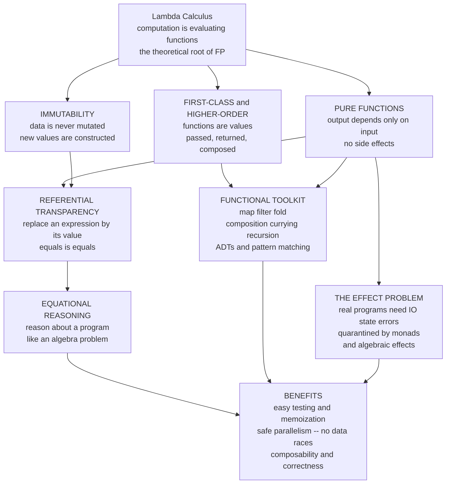

# λ Functional Programming Foundations

> [!abstract] TL;DR
> **Functional programming (FP)** is the paradigm built directly on the **lambda calculus**: it treats a program as the **evaluation of mathematical functions**, not a sequence of commands that mutate state. Its four load-bearing principles — **pure functions** (output depends only on input, no side effects), **immutability** (data is never changed, new values are constructed), **first-class / higher-order functions** (functions are ordinary values you pass, return, and compose), and **referential transparency** (any expression may be replaced by its value without changing behavior) — together let you reason about code **like an algebra problem**: *equals is equals*. That single guarantee unlocks the whole FP toolkit (`map`/`filter`/`fold`, composition, currying, recursion, persistent data structures, algebraic data types, type classes, lazy evaluation, and monadic effect management) and the benefits that drove FP ideas into every mainstream language: easier testing, **safe parallelism with no data races**, composability, and correctness.

---

## Intuition

**Analogy — mathematics has no variables that change.** In school algebra, `x` is `x`. Once you know `x = 3`, it stays `3`; there is no line later that "sets `x` to `4`" behind your back. And `f(3)` gives the *same answer every single time* — a function is a fixed relationship between input and output, not a machine with a memory. Because of this, you can *reason* about an algebra problem by **substituting equals for equals**: if `y = f(3)` and `f(3) = 9`, you may freely replace `y` by `9` anywhere, and nothing breaks.

**Functional programming builds software the same way.** A program is not a list of instructions that shuffle mutable boxes of memory; it is one big **expression to be evaluated**, assembled by applying and composing functions. There are no hidden changes, no "spooky action at a distance" where calling one function silently alters what another sees. So the algebra move — *replace an expression by its value* — is always legal. This is **referential transparency**, and it is the deepest reason FP code is easier to reason about, test, cache, and run in parallel: two calls with the same input are interchangeable with each other and with their result. Contrast the imperative mindset — "do this, *then* change that, *then* loop" — where a variable's meaning depends on *when* you look at it and what ran before. FP trades the timeline of mutable state for the timelessness of expressions.

---

## How It Works

### Core Mechanics

Functional programming is **applied lambda calculus**: the theoretical model in [[The_Lambda_Calculus]] — where computation is nothing but building functions (`λx. body`) and applying them, and "running a program" is beta-reduction (substitute the argument into the body) — shipped as a practical language. Every FP feature below traces to that root. Where it sits in the paradigm landscape is the subject of [[Programming_Language_Theory_Overview]].

**1. Pure functions — the atom.** A function is **pure** if (a) its output depends *only* on its inputs and (b) it produces *no side effects* (no mutating globals, no printing, no I/O, no clock or randomness reads). `square(n) = n * n` is pure; `next_id()` that bumps a counter is not. Purity is what makes a function behave like a mathematical function `f : A → B` — a fixed input-output relation.

**2. Referential transparency — the payoff.** An expression is **referentially transparent** if it can be replaced by its value without changing the program's behavior. Purity *guarantees* referential transparency, and referential transparency *is* the license for **equational reasoning**: `f(x) + f(x)` may be rewritten as `let y = f(x) in y + y`, or as `2 * f(x)`, because `f(x)` denotes one fixed value. This is exactly the notion of program equality studied formally in [[Contextual_Equivalence_and_Reasoning]] — two expressions are equivalent when no context can tell them apart, and purity makes vast classes of rewrites provably safe. Impurity destroys it: if `f` reads a counter, the two `f(x)` calls differ and *equals is no longer equals*.

**3. Immutability — data is never mutated.** Instead of changing a value in place (`list.append(x)`), FP **constructs a new value** (`newlist = old ++ [x]`) and leaves the original untouched. This is what keeps referential transparency true across time: if nothing ever changes, an expression's meaning cannot drift. Naively this sounds wasteful, but **persistent data structures** with **structural sharing** (Okasaki) make it cheap — the new value reuses the unchanged parts of the old one instead of deep-copying.

**4. First-class and higher-order functions.** Functions are **first-class values**: they can be stored in variables, put in data structures, passed as arguments, and returned as results — exactly as in the lambda calculus, where a function *is the only kind of value*. A **higher-order function** is one that takes or returns a function (`map`, `filter`, `compose`). This descends straight from the calculus and from the binding rules of [[Names_Binding_and_Scope]]: a **closure** is a function paired with the environment of its free variables, the runtime realization of a lambda abstraction.

**5. The functional toolkit — the vocabulary of collection processing.** Instead of index-fiddling loops, FP uses a small algebra of higher-order combinators:
- **`map`** applies a function to every element (a structure-preserving transformation).
- **`filter`** keeps elements satisfying a predicate.
- **`fold` / `reduce`** collapses a collection to a summary using a binary operator and a seed. `fold` is the *universal* iterator — `map` and `filter` are both definable as folds. In category theory these folds are **catamorphisms**: the canonical way to consume a recursive data type.
- **Function composition** (`f ∘ g`) and **point-free style** build big functions from small ones with no mention of the argument.
- **Currying** turns a multi-argument function into a chain of one-argument functions (`f(a, b)` becomes `f(a)(b)`), and **partial application** fixes some arguments to specialize a function.

**6. Recursion replaces loops.** With no mutable loop counter, iteration is expressed as **recursion**. To keep it efficient, functional compilers perform **tail-call optimization (TCO)**: a recursive call in tail position reuses the current stack frame, turning recursion into a loop with no stack growth. The precise semantics of *when* and *in what order* arguments are evaluated is the subject of [[Reduction_Strategies_and_Evaluation_Order]].

**7. Algebraic data types (ADTs) and pattern matching.** FP models data with **sum types** (a value is *one of* several shapes — `Option = Some | None`) and **product types** (a value bundles *several* fields — a tuple or record). **Pattern matching** deconstructs these shapes, and compilers enforce **exhaustiveness** (you handled every case). This lets you *make illegal states unrepresentable* — encode invariants in the type so bad states cannot be built. The deep reading — data as logical propositions, matching as proof — is the **Curry-Howard correspondence** ([[The_Curry_Howard_Correspondence]]), and the type machinery is covered in [[Type_Systems_Fundamentals]] and [[Simply_Typed_Lambda_Calculus]].

**8. Type classes / traits — principled overloading.** How do you write `+`, `show`, or `map` once and have it work for many types without inheritance? **Type classes** (Haskell), **givens** (Scala), and **traits** (Rust) provide **ad-hoc polymorphism** via *dictionary passing*: the compiler threads an implementation table to each call site. The canonical hierarchy **Functor → Applicative → Monad** captures "mappable," "combinable," and "sequenceable" structure. This interacts tightly with type reconstruction ([[Type_Inference_and_Unification]]).

**9. Lazy evaluation.** Haskell is **non-strict**: an expression is not evaluated until its value is demanded. Laziness enables **infinite data structures** (`nats = [0..]`), streams, and a clean separation of *production* from *consumption* — but costs predictability of space and time (thunk buildup). Strict languages (ML, Scala, Clojure) evaluate eagerly and opt into laziness explicitly. This is one axis of [[Reduction_Strategies_and_Evaluation_Order]].

**10. Managing effects purely — the central tension.** Real programs *must* do I/O, hold state, and fail — all side effects, all poison to referential transparency. FP's answer is not to ban effects but to **quarantine** them: represent an effect as a *value* (a description of what to do) and sequence such values with **monads** or **algebraic effects**, so the pure core stays referentially transparent while effects live at a controlled boundary (the `IO` monad, `Result`/`Either`, effect systems). This is the topic of the forthcoming **Monads and Effects** sibling.

**11. Why the benefits followed — and why FP invaded the mainstream.** Because pure functions have no shared mutable state, they are **safe to run in parallel**: no data races, no locks needed, deterministic and reproducible (the forthcoming **Concurrency and Process Calculi** sibling develops this). Because they are referentially transparent, they are **trivial to test** (same input, same output — no fixtures for hidden state) and **safe to memoize and reorder**. This is why lambdas, streams, immutability, `Optional`/`Result`, and map-reduce are now standard in Java, Python, JavaScript, Kotlin, Rust, and Swift, even though those languages are not "pure."

### Flow / Architecture



*The lambda calculus grounds the four pillars. Purity plus immutability yield referential transparency, which licenses equational reasoning; first-class functions power the toolkit; effects are quarantined so the pure core stays transparent — and together these deliver FP's practical benefits.*

---

## Key Concepts

**Secondary (intuitive, no CS background needed)**
- **A function is like a math function** — same input, same output, every time; nothing changes behind your back.
- **Don't change things, make new things** — instead of editing a value in place, build a fresh one and keep the old.
- **Functions are things you can pass around** — like handing someone a recipe rather than a finished dish.
- **Build big from small** — glue tiny functions together (compose) instead of writing one long procedure.

**Undergraduate (a first PL or FP course)**
- **Pure functions** and **side effects**; **referential transparency** and **equational reasoning**.
- **The toolkit**: `map`, `filter`, `fold`/`reduce` (fold as the universal combinator); **composition**, **currying**, **partial application**, **point-free** style.
- **Recursion** over iteration; **tail-call optimization**.
- **Immutability** and **persistent data structures** with **structural sharing** (cons-lists, finger trees, HAMTs).
- **Algebraic data types** (sum + product) and **exhaustive pattern matching**; making illegal states unrepresentable.
- **Closures** as lambda abstractions capturing free variables ([[Names_Binding_and_Scope]]).

**Graduate (advanced PL / type theory)**
- **Type classes / dictionary passing** for ad-hoc polymorphism; the **Functor / Applicative / Monad** hierarchy and its laws.
- **Monadic and algebraic effects**; the `IO` monad; effect systems; separating a pure core from an effectful shell.
- **Catamorphisms / anamorphisms** (folds and unfolds) as the categorical structure of recursion schemes.
- **Parametricity and free theorems** — a polymorphic type constrains behavior so tightly that theorems follow *for free* from the type alone (Wadler); the semantics of **System F** polymorphism ([[Polymorphism_and_System_F]]).
- **Denotational semantics** — "a program *is* a function" from inputs to outputs, with recursion given by least fixed points ([[Denotational_Semantics]], [[Domain_Theory_and_Fixed_Points]]).
- **Lazy vs strict semantics**; call-by-need graph reduction; the space/time tradeoffs of non-strictness ([[Reduction_Strategies_and_Evaluation_Order]]).
- The **Curry-Howard** reading of ADTs as logic and evaluation as proof normalization ([[The_Curry_Howard_Correspondence]]).

---

## Python Demo

```python
# ======================================================================
# THE FUNCTIONAL TOOLKIT, FROM SCRATCH -- and its payoff.
#   * Pure HIGHER-ORDER functions built by hand: map, filter, foldl/foldr,
#     function composition, currying, partial application.
#   * REFERENTIAL TRANSPARENCY: a pure function memoizes and parallelizes
#     safely and supports equational reasoning; an IMPURE one does neither.
#   * An IMMUTABLE functional pipeline vs an IMPERATIVE mutable loop (same task).
#   * A PERSISTENT immutable cons-list with STRUCTURAL SHARING.
#   * VISUALIZE the composition pipeline + the equational-reasoning contrast.
# Pure standard library + matplotlib (no numpy needed).
# ======================================================================
from functools import lru_cache, partial
from concurrent.futures import ThreadPoolExecutor
import matplotlib.pyplot as plt

# ----------------------------------------------------------------------
# 1. HIGHER-ORDER FUNCTIONS, BUILT FROM SCRATCH.
#    All are PURE: they read their inputs and construct NEW tuples;
#    nothing is ever mutated in place.
# ----------------------------------------------------------------------
def fmap(f, xs):                       # map: apply f to every element
    if not xs:
        return ()
    return (f(xs[0]),) + fmap(f, xs[1:])

def ffilter(pred, xs):                 # filter: keep elements passing pred
    if not xs:
        return ()
    head, rest = xs[0], ffilter(pred, xs[1:])
    return (head,) + rest if pred(head) else rest

def foldl(op, acc, xs):                # left fold / reduce: (((acc op x0) op x1) ...)
    for x in xs:
        acc = op(acc, x)
    return acc

def foldr(op, acc, xs):                # right fold: op x0 (op x1 (... acc))
    if not xs:
        return acc
    return op(xs[0], foldr(op, acc, xs[1:]))

def compose(*fns):                     # compose(f, g, h)(x) == f(g(h(x)))
    # NOTE: composition itself is just a fold over the function list.
    return foldr(lambda f, g: (lambda x: f(g(x))), lambda x: x, fns)

def curry2(f):                         # f(a, b)  ->  f(a)(b)
    return lambda a: (lambda b: f(a, b))

# map and filter are BOTH definable as folds -- fold is the universal tool:
def map_via_fold(f, xs):
    return foldr(lambda x, acc: (f(x),) + acc, (), xs)

assert fmap(lambda n: n * n, (1, 2, 3)) == map_via_fold(lambda n: n * n, (1, 2, 3))

# ----------------------------------------------------------------------
# 2. REFERENTIAL TRANSPARENCY -- pure vs impure.
# ----------------------------------------------------------------------
def square(n):                         # PURE: output depends ONLY on input
    return n * n

_hidden = {"calls": 0}                 # a hidden mutable counter
def impure_square(n):                  # IMPURE: reads + mutates hidden state
    _hidden["calls"] += 1              #   <-- SIDE EFFECT
    return n * n + _hidden["calls"]    #   output depends on call HISTORY, not just n

# Equational reasoning: for a PURE function,  f(4) + f(4) == 2 * f(4).
assert square(4) + square(4) == 2 * square(4)          # holds -- equals is equals
# For the IMPURE function it FAILS: the two calls see different hidden state.
_hidden["calls"] = 0
lhs = impure_square(4) + impure_square(4)
_hidden["calls"] = 0
rhs = 2 * impure_square(4)
print("=== Referential transparency ===")
print(f"  pure : square(4)+square(4) == 2*square(4)  -> {square(4)+square(4) == 2*square(4)}")
print(f"  impure: {lhs} != {rhs}  -> substituting equals for equals is UNSAFE")

# Memoization is SAFE for a pure function (same answer, just cached)...
memo_square = lru_cache(maxsize=None)(square)
assert all(memo_square(n) == square(n) for n in range(10))
# ...but a cache silently FREEZES an impure function to a stale value:
_hidden["calls"] = 0
memo_impure = lru_cache(maxsize=None)(impure_square)
frozen = [memo_impure(4) for _ in range(3)]            # all identical -- cache hides intent
_hidden["calls"] = 0
live = [impure_square(4) for _ in range(3)]            # actually all different
print(f"  memoized impure (frozen) : {frozen}")
print(f"  live impure  (changing)  : {live}   <-- cannot cache an impure function")

# Parallelism is SAFE for pure functions: reproducible, race-free.
with ThreadPoolExecutor(max_workers=8) as ex:
    par_a = list(ex.map(square, range(200)))
with ThreadPoolExecutor(max_workers=8) as ex:
    par_b = list(ex.map(square, range(200)))
assert par_a == par_b                                  # deterministic across runs

# Shared MUTABLE state under threads -> DATA RACE (non-deterministic result).
shared = {"total": 0}
def racy_add(x):
    t = shared["total"]                                # read
    for _ in range(80):                                # widen the read-modify-write gap
        pass
    shared["total"] = t + x                            # write -- lost updates under threads
    return shared["total"]
shared["total"] = 0
with ThreadPoolExecutor(max_workers=8) as ex:
    list(ex.map(racy_add, range(1, 51)))
racy_result, true_sum = shared["total"], sum(range(1, 51))
print(f"  shared-mutable racy sum = {racy_result}  (correct = {true_sum})  "
      f"{'OK' if racy_result == true_sum else 'RACE -> wrong'}")

# ----------------------------------------------------------------------
# 3. IMMUTABLE FUNCTIONAL PIPELINE  vs  IMPERATIVE MUTABLE LOOP (same task).
#    Task: sum of squares of the even numbers in 1..20.
# ----------------------------------------------------------------------
data = tuple(range(1, 21))

# FUNCTIONAL: one expression, composed stages, nothing mutated.
sum_sq_evens = compose(
    partial(foldl, lambda a, b: a + b, 0),   # fold: add them up
    partial(fmap, square),                    # map: square each
    partial(ffilter, lambda n: n % 2 == 0),   # filter: keep evens
)
functional_result = sum_sq_evens(data)

# IMPERATIVE: step through mutable accumulator.
total = 0
for n in data:
    if n % 2 == 0:
        total += n * n
imperative_result = total

assert functional_result == imperative_result
print("\n=== Functional pipeline vs imperative loop ===")
print(f"  functional (immutable) = {functional_result}")
print(f"  imperative (mutable)   = {imperative_result}   (identical result)")

# ----------------------------------------------------------------------
# 4. PERSISTENT immutable cons-list with STRUCTURAL SHARING.
#    A list is EMPTY (None) or a pair (head, tail). Prepending is O(1)
#    and REUSES the old tail instead of copying it.
# ----------------------------------------------------------------------
EMPTY = None
def cons(head, tail):                  # returns a NEW list that SHARES `tail`
    return (head, tail)
def to_tuple(lst):
    out = []
    while lst is not None:
        out.append(lst[0]); lst = lst[1]
    return tuple(out)

base = cons(3, cons(2, cons(1, EMPTY)))    # [3, 2, 1]
extended = cons(4, base)                    # [4, 3, 2, 1] -- base is UNCHANGED
assert to_tuple(base) == (3, 2, 1)          # original untouched (immutability)
assert extended[1] is base                  # STRUCTURAL SHARING: tail is the SAME object
print("\n=== Persistent cons-list ===")
print(f"  base      = {to_tuple(base)}   (unchanged)")
print(f"  extended  = {to_tuple(extended)}")
print(f"  shares tail object? {extended[1] is base}  <-- no copy, just structural sharing")

# ----------------------------------------------------------------------
# 5. VISUALIZE:  (left) the composition pipeline as a fold accumulating a
#    result step by step;  (right) referential transparency -- a pure call
#    is a flat, substitutable value while an impure call drifts every time.
# ----------------------------------------------------------------------
evens   = ffilter(lambda n: n % 2 == 0, data)
squares = fmap(square, evens)
# running accumulation of the left fold (the pipeline "building" the answer):
running, acc = [0], 0
for s in squares:
    acc += s
    running.append(acc)

# pure vs impure across repeated identical calls f(4):
calls = list(range(1, 11))
pure_vals = [square(4) for _ in calls]                 # constant -> substitutable
_hidden["calls"] = 0
impure_vals = [impure_square(4) for _ in calls]        # drifts -> NOT substitutable

fig, (axL, axR) = plt.subplots(1, 2, figsize=(13, 5.2))

axL.step(range(len(running)), running, where="post", lw=2.2, color="#2a7", marker="o")
for i, s in enumerate(squares):
    axL.annotate(f"+{s}", (i + 1, running[i + 1]), textcoords="offset points",
                 xytext=(4, -12), fontsize=8, color="#083")
axL.set_title("Composition pipeline: filter -> map -> fold\n"
              "immutable stages build the result step by step")
axL.set_xlabel("elements folded in")
axL.set_ylabel("accumulator value")
axL.grid(True, ls=":", alpha=0.5)
axL.annotate(f"result = {running[-1]}", (len(running) - 1, running[-1]),
             textcoords="offset points", xytext=(-95, -4), fontsize=10, color="#083")

axR.plot(calls, pure_vals, marker="o", lw=2.2, color="#2a7",
         label="pure square(4): constant -> replace f(4) by 16")
axR.plot(calls, impure_vals, marker="s", ls="--", lw=2.2, color="#c33",
         label="impure square(4): drifts -> NOT substitutable")
axR.set_title("Referential transparency\n"
              "same input -> same value only when the function is pure")
axR.set_xlabel("call number (identical input = 4)")
axR.set_ylabel("value returned")
axR.grid(True, ls=":", alpha=0.5)
axR.legend(loc="upper left", fontsize=9)

plt.tight_layout()
plt.savefig("functional_programming.png", dpi=130)
print("\nSaved figure to functional_programming.png")
```

Running it prints the equational-reasoning contrast (pure `square(4) + square(4) == 2 * square(4)` holds; the impure version fails because each call mutates hidden state), shows that a cache safely memoizes the pure function but silently freezes the impure one, and exposes a **data race** when a shared mutable counter is updated across threads — while the pure `map` is bit-for-bit reproducible under concurrency. It then confirms the immutable functional pipeline and the imperative mutable loop compute the *same* sum-of-squares-of-evens, demonstrates a persistent cons-list whose extension shares the original tail object (`extended[1] is base`), and saves a two-panel figure: the left panel shows the fold accumulating the answer stage by stage; the right panel shows the pure call as a flat, substitutable line versus the impure call drifting upward — a picture of *why* referential transparency is the property that makes FP easy to reason about.

---

## Real-World Applications

> **Example — React and Redux are functional programming in the browser.** A React component is (ideally) a **pure function** `UI = f(state)`: given the same props and state it renders the same output, no side effects during render. **Redux** models all application state as a single **immutable** value updated by **pure reducers** `(state, action) -> newState` that *construct a new state* rather than mutating the old one. This is precisely why React can memoize components, replay actions in time-travel debugging, and reason about updates — the whole architecture is referential transparency and immutability applied to UIs. Effects (data fetching, timers) are quarantined at the edges, exactly the "pure core, effectful shell" discipline of FP.

Beyond the front end, functional foundations show up throughout industry:

- **Big-data processing — MapReduce and Spark.** Google's **MapReduce** and Apache **Spark** are built on `map` and `fold`/`reduce` over immutable partitioned collections. Because the transformations are pure, the engine can freely re-run, re-order, and **parallelize** them across thousands of machines and recover from failures by recomputation — data-race-free distribution is only possible because there is no shared mutable state.
- **Purely functional languages in production.** **Haskell** (GHC), **OCaml/ML**, **Scala** (with Cats/ZIO — see [[Cats_and_ZIO_Overview]]), **Clojure**, **Elm**, and **F#** power compilers, financial systems (Jane Street runs on OCaml), blockchain contracts, and high-assurance software, trading raw mutability for correctness and testability.
- **Functional features in mainstream languages.** Lambdas, streams, immutability, and `Optional`/`Result` are now everywhere: Java streams and lambdas ([[Lambda_Expressions]], [[Stream_API]], [[Lambdas_and_Functional_Interfaces]], [[Optional_and_Parallel_Streams]]), Kotlin higher-order functions and collection operators ([[Kotlin_Lambda_and_Higher_Order]], [[Kotlin_Collections]]), Rust iterators, `Option`/`Result`, and pattern matching ([[Iterators_and_Functional_Patterns]], [[Enums_and_Pattern_Matching]]), and Scala's fusion of OO and FP ([[Scala_Functions]], [[Scala_Collections]], [[Scala_Immutability_and_ADTs]], [[Scala_Pattern_Matching]], [[Scala_Typeclasses]]).
- **Concurrency and correctness at scale.** Immutable data and pure functions eliminate the need for locks around shared state, which is why FP ideas underpin actor systems, event sourcing, and reactive streams — no data races means safer concurrency by construction.

---

## Common Pitfalls

- **Confusing "no side effects" with "no effects at all."** FP does not forbid I/O; it *quarantines* it. The mistake is either (a) sprinkling effects through the codebase and losing referential transparency, or (b) believing a "pure" language can avoid effects entirely. The discipline is a **pure core with an effectful shell**, sequencing effects as values via monads or effect systems.
- **Fake immutability.** Wrapping data in an "immutable" type but handing out references to a mutable interior (a raw list inside a "frozen" record) reintroduces shared mutable state and silent aliasing bugs. Immutability must be *deep* to deliver its guarantees.
- **Naive immutability that quadratically copies.** Rebuilding a whole collection on every update is `O(n)` per change and can dominate runtime. The fix is **persistent data structures** with **structural sharing** (HAMTs, finger trees, cons-lists) — the whole point of Okasaki's work — so updates are `O(log n)` or `O(1)` while old versions stay valid.
- **Stack overflow from non-tail recursion.** Replacing loops with recursion is idiomatic, but only **tail-recursive** calls are optimized into loops. Deep non-tail recursion blows the stack (and Python has *no* TCO at all — hence the small lists in the demo). Use accumulators, explicit iteration, or trampolining.
- **Space leaks from laziness.** In non-strict languages, unevaluated **thunks** can pile up and blow memory (the classic lazy `foldl` leak). Laziness is powerful for infinite structures but demands awareness of *when* evaluation is forced; strict folds and `seq` are the usual remedies.
- **Over-abstracting into unreadable point-free "tacit" code.** Currying and composition are elegant until a wall of `(.)`/`>>>` with no named intermediates becomes write-only. Point-free style is a tool, not a virtue; name things when it aids the reader.
- **Ignoring exhaustiveness warnings on pattern matches.** A non-exhaustive match on a sum type is a latent runtime crash. Treat "match not exhaustive" as an error — that check is exactly what lets ADTs make illegal states unrepresentable.

---

## Related Concepts

- [[The_Lambda_Calculus]] — the theoretical root: FP is *applied* lambda calculus; closures, currying, and higher-order functions all descend from `λx. M` and beta-reduction.
- [[Programming_Language_Theory_Overview]] — where the functional paradigm sits in the broader map of language theory; the section this note opens.
- [[Reduction_Strategies_and_Evaluation_Order]] — strict vs lazy (non-strict) semantics, call-by-value / name / need; the evaluation axis behind Haskell's laziness.
- [[Contextual_Equivalence_and_Reasoning]] — the formal notion of program equality that referential transparency and equational reasoning rest on.
- [[Type_Systems_Fundamentals]] — algebraic data types, sum/product types, and the type discipline that makes illegal states unrepresentable.
- [[Simply_Typed_Lambda_Calculus]] — the typed core that ML and Haskell elaborate; the bridge from untyped FP intuition to typed functional languages.
- [[Polymorphism_and_System_F]] — parametric polymorphism, parametricity, and the "free theorems" that generic higher-order code enjoys.
- [[The_Curry_Howard_Correspondence]] — data as propositions, pattern matching as proof; the logical reading of algebraic data types.
- [[Type_Inference_and_Unification]] — how ML/Haskell reconstruct types (Hindley-Milner), enabling type classes and generic higher-order code without annotations.
- [[Names_Binding_and_Scope]] — closures, lexical scope, and free vs bound variables; the naming rules underlying first-class functions.
- [[Denotational_Semantics]] — the "a program *is* a function from inputs to outputs" view, with recursion as least fixed points.
- [[Church_Encodings_and_Computability]] — data (numerals, booleans, pairs) built purely from functions; ADTs before they had syntax.
- [[Combinatory_Logic_and_Fixed_Points]] — variable-free composition and the fixed-point combinators behind recursion.
- [[Scala_Immutability_and_ADTs]] — algebraic data types, immutability, and pattern matching in a production hybrid OO/FP language.
- [[Scala_Typeclasses]] — ad-hoc polymorphism via givens/dictionaries; the Functor/Monad hierarchy in practice.
- [[Cats_and_ZIO_Overview]] — monadic and algebraic effect management on the JVM.
- [[Iterators_and_Functional_Patterns]] — Rust's zero-cost functional combinators and closures.
- [[Enums_and_Pattern_Matching]] — Rust's sum types and exhaustive matching, `Option`/`Result` as FP error handling.
- [[Lambda_Expressions]] — Java's lambdas: first-class functions as a mainstream feature.
- [[Stream_API]] — `map`/`filter`/`reduce` pipelines in Java.
- [[Kotlin_Lambda_and_Higher_Order]] — higher-order functions and lambdas in Kotlin.

*Forthcoming PLT siblings referenced in prose above — to be wikilinked once written — are **Monads and Effects**, **Object-Oriented Language Theory**, and **Concurrency and Process Calculi**.*

---

## Review Questions

1. **(Conceptual)** Define **referential transparency** and explain, in terms of the algebra analogy, why a **pure** function has it while a function that reads or mutates hidden state does not. Then name *three* concrete engineering benefits that follow directly from referential transparency, and for each, state the exact property of purity that makes it safe.
2. **(Scenario)** You have a CPU-bound data pipeline `total = fold(+, 0, map(expensive, filter(valid, records)))` and you want to (a) cache `expensive` and (b) run the `map` across 16 cores. Your colleague objects that `expensive` "sometimes logs to a global metrics counter and reads the current timestamp." Explain precisely why those two side effects break *both* the caching and the parallelization, what could go wrong at runtime, and how you would refactor to a "pure core, effectful shell" so both optimizations become safe.
3. **(Trade-off)** Immutability and persistent data structures let many versions of a collection coexist without copying, but nothing is free. (a) What is the cost model of a naive immutable update versus a persistent structure with structural sharing, and why? (b) Give one situation where FP's immutability + purity is clearly the right default and one where an in-place mutable algorithm is the pragmatic choice, and justify each. (c) How does lazy evaluation change this calculus, and what new failure mode does it introduce?

---

## Sources

- Hughes, J. "Why Functional Programming Matters." *The Computer Journal* 32, no. 2 (1989): 98-107 — the classic argument that higher-order functions and lazy evaluation are the glue that makes programs modular.
- Backus, J. "Can Programming Be Liberated from the von Neumann Style? A Functional Style and Its Algebra of Programs." *Communications of the ACM* 21, no. 8 (1978): 613-641 — the Turing Award lecture founding function-level, algebraic programming.
- Okasaki, C. *Purely Functional Data Structures*. Cambridge University Press, 1998 — the definitive treatment of persistent structures and structural sharing.
- Wadler, P. "Theorems for Free!" *FPCA '89* (1989): 347-359 — parametricity and free theorems: how a polymorphic type alone constrains behavior.
- Bird, R. and Wadler, P. *Introduction to Functional Programming*. Prentice Hall, 1988 — a foundational textbook on pure FP, folds, and equational reasoning.
- Pierce, B. C. *Types and Programming Languages*. MIT Press, 2002 — the lambda calculus, algebraic data types, and type systems that underpin functional languages.

---

#programming-language-theory #functional-programming #purity #immutability #higher-order-functions
