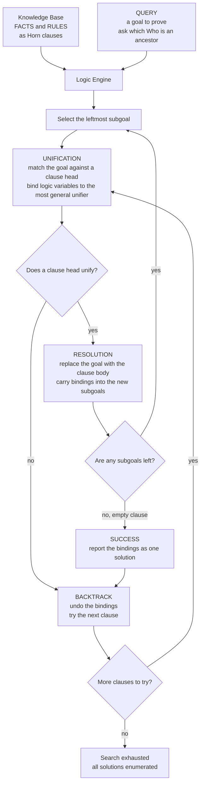

# 🧩 Logic and Constraint Programming

> [!abstract] TL;DR
> **Logic programming** is the **declarative** paradigm — a third pole beyond imperative and functional — where a *program is a set of logical statements* (**facts** and **rules**, written as **Horn clauses**) and *computation is proof search*. You state **what** is true about a world and pose a **query**; the engine **searches** for every way to make that query provable, using **unification** to match terms and **SLD-resolution** to reduce goals, with **backtracking** to explore alternatives. Kowalski's slogan captures it: **`algorithm = logic + control`** — you supply the logic, the engine supplies the control. **Prolog** is the canonical language; **constraint programming (CLP)** generalizes the same idea by adding **constraint solvers over domains** (finite domains, integers, reals, booleans) with **constraint propagation** to prune the search. The modern industrial descendants — **SAT/SMT solvers** (Z3, DPLL/CDCL), **Datalog** for databases and static analysis, and **answer-set programming** — carry this paradigm into verification, planning, and program analysis. Its deepest engine, **unification**, is the *same* mechanism that drives Hindley-Milner [[Type_Inference_and_Unification|type inference]].

---

## Intuition

**Analogy — describing the case versus dictating the investigation.** In most programming you are a *manager dictating every step*: "open this drawer, read that file, compare these two lines, now write the result here." You spell out **how** to reach the answer. Logic programming is different — you are a *witness giving a deposition*. You state only **facts** ("Tom is Bob's parent," "Bob is Ann's parent") and **rules** ("someone is an ancestor if they are a parent, or a parent of an ancestor"). Then you ask a **question**: "Who are Tom's descendants?" You never tell the machine how to find them — it **searches** the world you described, trying possibilities and abandoning dead ends, and reports **every** person who makes your question true.

That is the whole shift: **you describe the problem; the computer finds the solution.** The description *is* the program, and running it is a controlled **deduction** — a proof search over all the ways your facts and rules can combine. Where an imperative program *executes an algorithm* and a functional program *evaluates an expression*, a logic program *proves a goal*.

---

## How It Works

### Core Mechanics

A logic program has three moving parts, and an engine that turns them.

1. **A knowledge base of Horn clauses.** Everything is expressed as **Horn clauses** — implications with *at most one* positive conclusion. A **fact** is a clause with no conditions (`parent(tom, bob).` — "Tom is Bob's parent, unconditionally"). A **rule** is a clause with a body of conditions (`ancestor(X, Y) :- parent(X, Y).` — "X is an ancestor of Y **if** X is a parent of Y"). Variables (capitalized `X`, `Y`) are implicitly universally quantified. The Horn restriction is what makes proof search tractable: each clause offers exactly one way to *conclude* its head, so search branches over *clauses*, not over arbitrary logical connectives.

2. **A query (goal).** You ask whether a goal is provable, e.g. `ancestor(tom, Who)`. Because `Who` is a **logic variable**, the engine does not just answer yes/no — it **enumerates every binding** of `Who` that makes the goal follow from the knowledge base. A query like `ancestor(X, tom)` runs the *same* rules "backward" to enumerate all `X` that are ancestors of Tom. Relations have no fixed input/output direction — a hallmark of the paradigm.

3. **The engine: unification + resolution + backtracking.**
   - **Unification** is the pattern-matching core. To use a clause, the engine must make the current goal *equal* to the clause's head by binding logic variables — it computes the **most general unifier (MGU)**, the least-committal substitution that makes two terms identical (with the **occurs-check** forbidding a variable being bound inside itself). This is **precisely** the unification of [[Type_Inference_and_Unification|Hindley-Milner type inference]] and of resolution theorem proving — the same algorithm, different application.
   - **SLD-resolution** (Selective Linear resolution for Definite clauses) is the deduction step: pick the **leftmost** subgoal, find a clause whose head **unifies** with it, and **replace** the subgoal with that clause's **body** (its conditions), carrying the bindings forward. Repeat until the goal list is empty — that empty clause `□` is a **proof**, and the accumulated bindings are the **answer**.
   - **Backtracking** provides the *control*: when a subgoal has several matching clauses, the engine tries them in order via **depth-first search**; on failure or after reporting a success it **undoes the bindings** and tries the next clause. This systematic DFS over clause choices is what enumerates *all* solutions — the same engine as [[Backtracking|algorithmic backtracking]].

**Two semantic caveats you must know.** Logic programming adopts the **closed-world assumption**: anything not provable is treated as false, so `\+ p` (**negation-as-failure**) means "p cannot be proved," not "p is refutable." And the **cut** (`!`) is a control operator that *prunes* backtracking — trading declarative purity for efficiency and determinism. Both are where the clean logic reading and the operational reading diverge.

**From logic programming to constraint programming.** Plain Prolog can only *unify* terms. **Constraint Logic Programming (CLP)** generalizes unification to **constraint solving** over a domain: `CLP(FD)` over finite integer domains, `CLP(R)` over the reals, `CLP(B)` over booleans. Instead of merely binding `X = bob`, you post constraints like `X + Y = 10, X < Y` and a dedicated solver performs **constraint propagation** — repeatedly *narrowing* each variable's domain by removing values that cannot satisfy the constraints — interleaved with search. This turns the paradigm into a powerful tool for **scheduling, planning, and puzzles** (Sudoku, N-queens, map coloring), and connects directly to discrete [[Integer_Programming|integer programming]] in optimization.

### Flow / Architecture



---

## Key Concepts

### Secondary (intuitive)
- **Facts, rules, and queries** — you write down what is *true* (facts), what *follows* from what (rules), then *ask questions*; the machine finds answers.
- **What, not how** — a logic program specifies the *problem*, not the step-by-step procedure; the engine's search supplies the "how."
- **Running backward** — because relations have no fixed direction, one rule can answer "who are Tom's descendants?" and "whose ancestor is Ann?" with no extra code.

### Undergraduate (mechanism)
- **Horn clause** — an implication with at most one positive head; a *fact* has an empty body, a *rule* has a body of conditions. The restriction makes proof search a manageable search over clauses.
- **Unification and the MGU** — the term-matching engine that binds logic variables to make a goal and a clause head identical, choosing the *most general* solution; the **occurs-check** blocks infinite terms. Its binding chains form a [[Union_Find|disjoint-set]] structure, exactly as in type inference.
- **SLD-resolution** — select the leftmost goal, resolve it against a unifying clause, replace it with the clause body; reaching the empty clause is a proof. The choices form an **SLD search tree**.
- **Backtracking, DFS, and its incompleteness** — Prolog explores the tree **depth-first, left-to-right**; this is efficient but **incomplete**, since a left-recursive rule (`ancestor(X,Y) :- ancestor(X,Z), parent(Z,Y).`) can loop forever down an infinite branch while solutions sit unexplored to the right.
- **Closed-world assumption and negation-as-failure** — unprovable is taken as false; `\+ G` succeeds iff `G` cannot be proved (not classical negation).
- **The cut `!`** — a control primitive that commits to choices and discards backtracking alternatives; prunes the tree but breaks the pure declarative reading.
- **Datalog** — logic programming *without* function symbols and with a stratified negation discipline; this makes it **decidable** and **terminating**, the basis for deductive databases and query languages.

### Graduate (theory and frontiers)
- **Least Herbrand model / fixpoint semantics** — the declarative meaning of a definite logic program is its **least Herbrand model**, computed as the **least fixed point** of the immediate-consequence operator `T_P`. This is the *same* least-fixed-point idea as the [[Domain_Theory_and_Fixed_Points|domain-theoretic]] semantics of recursion — the declarative reading and the operational (SLD) reading provably coincide (**soundness and completeness of SLD-resolution** for definite programs).
- **Constraint Logic Programming scheme** — Jaffar and Lassez's `CLP(X)` parameterizes the paradigm by a constraint domain with a solver; unification becomes the special case where the domain is the Herbrand universe with syntactic equality. Propagation + search generalizes backtracking.
- **SAT and SMT solvers** — the industrial descendants. **SAT** decides boolean satisfiability; modern solvers use **DPLL** extended with **CDCL** (conflict-driven clause learning) to solve instances with millions of variables. **SMT** (satisfiability *modulo theories*, e.g. Z3) layers theory solvers — arithmetic, arrays, bit-vectors — atop a SAT core, powering verification, symbolic execution, and program analysis. SAT is the archetypal NP-complete problem — see [[NP_Completeness_and_the_Cook_Levin_Theorem|Cook-Levin]] and [[The_Class_NP_and_Verification|the class NP]].
- **Answer-Set Programming (ASP)** — logic programming under the **stable-model (answer-set) semantics**, tuned for hard combinatorial and knowledge-representation problems; "generate-and-test" declaratively with powerful grounders and solvers (clingo).
- **Relational / miniKanren revival** — embedded logic DSLs that run programs *backward*: synthesizing inputs from outputs, generating **quines**, and doing program synthesis. Relational interpreters are a live research thread bridging logic programming and [[Domain_Specific_Languages|embedded DSLs]].

---

## Python Demo

We build a **tiny Prolog-style logic engine** in pure Python, then a **constraint-satisfaction** solver — the two halves of this note.

1. **Terms** are logic variables (`Var`) and compound terms/atoms (`Term`). **Unification** computes a substitution binding variables so two terms match, with an **occurs-check**.
2. Facts and rules are **Horn clauses**; a **resolution solver** with **backtracking** answers a query by depth-first proof search, finding **all** satisfying substitutions.
3. We run the classic **ancestor** example and enumerate every solution via backtracking.
4. We **visualize the SLD-resolution / backtracking search tree** — internal goals, dead-ends, and successes — with matplotlib.
5. A small **map-coloring** constraint problem is solved by **constraint propagation (forward checking) + search**, then the colored map is drawn.

```python
"""
A tiny Prolog-style logic engine + a constraint solver, pure stdlib + matplotlib.

  * Terms:  Var (logic variable) and Term (functor with args; an atom has none).
  * UNIFICATION with the OCCURS-CHECK -> a most-general substitution.
  * Horn clauses (facts + rules); an SLD-RESOLUTION solver with BACKTRACKING
    that enumerates ALL answers to a query by depth-first proof search.
  * Visualize the SLD / backtracking SEARCH TREE (successes vs dead-ends).
  * Bonus: map coloring by CONSTRAINT PROPAGATION (forward checking) + search.

Run:  python logic_engine.py
"""
import itertools
import matplotlib.pyplot as plt

# ----------------------------------------------------------------- terms
class Var:
    __slots__ = ("name",)
    def __init__(self, name): self.name = name
    def __repr__(self): return self.name

class Term:
    __slots__ = ("functor", "args")
    def __init__(self, functor, args=()): self.functor, self.args = functor, list(args)
    def __repr__(self):
        return self.functor if not self.args else \
               f"{self.functor}({', '.join(map(repr, self.args))})"

def atom(a): return Term(a)                      # a 0-ary term is a constant

# ----------------------------------------------------------------- unification
def walk(t, s):
    """find(): follow a variable's binding chain to its representative."""
    while isinstance(t, Var) and t.name in s:
        t = s[t.name]
    return t

def occurs(v, t, s):
    """Occurs-check: does variable name `v` appear inside term `t`?"""
    t = walk(t, s)
    if isinstance(t, Var):
        return t.name == v
    return any(occurs(v, a, s) for a in t.args)

def unify(x, y, s):
    """Return a new substitution making x and y equal, or None. Never mutates s."""
    x, y = walk(x, s), walk(y, s)
    if isinstance(x, Var) and isinstance(y, Var) and x.name == y.name:
        return s
    if isinstance(x, Var):
        if occurs(x.name, y, s):
            return None                          # infinite term -> reject
        s2 = dict(s); s2[x.name] = y; return s2
    if isinstance(y, Var):
        return unify(y, x, s)
    if isinstance(x, Term) and isinstance(y, Term):
        if x.functor == y.functor and len(x.args) == len(y.args):
            for a, b in zip(x.args, y.args):
                s = unify(a, b, s)
                if s is None:
                    return None
            return s
    return None

# ----------------------------------------------------------------- clauses
_counter = itertools.count()
def rename(clause):
    """Fresh-rename a clause's variables so distinct uses never collide."""
    head, body = clause
    mp = {}
    def rn(t):
        if isinstance(t, Var):
            if t.name not in mp:
                mp[t.name] = Var(f"_{t.name}{next(_counter)}")
            return mp[t.name]
        return Term(t.functor, [rn(a) for a in t.args])
    return rn(head), [rn(g) for g in body]

def disp(t, s):
    """Pretty-print a term under substitution s, cleaning fresh-var names."""
    t = walk(t, s)
    if isinstance(t, Var):
        return t.name.lstrip("_").rstrip("0123456789") or "_"
    return t.functor if not t.args else \
           f"{t.functor}({', '.join(disp(a, s) for a in t.args)})"

# ----------------------------------------------------------------- knowledge base
X, Y, Z, W = Var("X"), Var("Y"), Var("Z"), Var("Who")
DB = [
    (Term("parent", [atom("tom"), atom("bob")]), []),   # facts
    (Term("parent", [atom("bob"), atom("ann")]), []),
    (Term("parent", [atom("bob"), atom("pat")]), []),
    (Term("parent", [atom("pat"), atom("jim")]), []),
    # rules:  ancestor(X,Y) :- parent(X,Y).
    (Term("ancestor", [X, Y]), [Term("parent", [X, Y])]),
    #         ancestor(X,Y) :- parent(X,Z), ancestor(Z,Y).
    (Term("ancestor", [X, Y]), [Term("parent", [X, Z]), Term("ancestor", [Z, Y])]),
]

# ----------------------------------------------------------------- SLD solver + tree
class Node:
    __slots__ = ("label", "status", "children", "x", "y")
    def __init__(self, label, status):
        self.label, self.status, self.children = label, status, []
        self.x = self.y = 0.0

solutions = []
MAX_DEPTH = 15

def solve(goals, s, depth):
    """SLD-resolution with backtracking; builds the search tree, collects answers."""
    if not goals:                                          # empty clause = proof
        n = Node("box  Who = " + disp(W, s), "success")
        solutions.append(dict(s))
        return n
    n = Node(disp(goals[0], s), "internal")
    if depth > MAX_DEPTH:
        n.status = "fail"; return n
    goal, rest = goals[0], goals[1:]
    for clause in DB:
        head, body = rename(clause)
        s2 = unify(goal, head, s)                          # try this clause
        if s2 is not None:
            n.children.append(solve(body + rest, s2, depth + 1))
    if not n.children:                                     # no clause matched
        n.status = "fail"
    return n

root = solve([Term("ancestor", [atom("tom"), W])], {}, 0)

print("Query:  ancestor(tom, Who)   -- find everyone Tom is an ancestor of")
for sol in solutions:
    print(f"   Who = {disp(W, sol)}")
print(f"\n{len(solutions)} solutions found by backtracking search.")

# ----------------------------------------------------------------- layout + draw tree
_leaf = itertools.count()
def layout(node, depth=0):
    if node.children:
        for c in node.children:
            layout(c, depth + 1)
        node.x = sum(c.x for c in node.children) / len(node.children)
    else:
        node.x = next(_leaf)
    node.y = -depth

layout(root)

def collect(node, nodes, edges):
    nodes.append(node)
    for c in node.children:
        edges.append((node, c)); collect(c, nodes, edges)

nodes, edges = [], []
collect(root, nodes, edges)

COL = {"success": "#69c06d", "fail": "#e08585", "internal": "#9dc3ec"}
n_leaves = next(_leaf)
fig, ax = plt.subplots(figsize=(max(13, n_leaves * 1.35), 8))
for a, b in edges:
    ax.plot([a.x, b.x], [a.y, b.y], color="#aaa", lw=1.2, zorder=1)
for nd in nodes:
    ax.scatter([nd.x], [nd.y], s=260, color=COL[nd.status],
               edgecolors="#333", linewidths=1.2, zorder=2)
    ax.text(nd.x, nd.y - 0.16, nd.label, ha="center", va="top",
            fontsize=8, family="monospace", zorder=3)
ax.set_title("SLD-resolution / backtracking search tree for  ancestor(tom, Who)\n"
             "green = SUCCESS (a proof)   red = DEAD-END (no clause matches)   "
             "blue = subgoal being resolved", fontsize=11)
ax.axis("off"); ax.set_ylim(-6, 0.6)
plt.tight_layout(); plt.savefig("sld_search_tree.png", dpi=120)
print("saved -> sld_search_tree.png")

# ================================================================= CONSTRAINT DEMO
# Map coloring: assign one of 3 colors so no two neighbors share a color.
regions = ["WA", "NT", "SA", "Q", "NSW", "V", "T"]
neighbors = {
    "WA": ["NT", "SA"], "NT": ["WA", "SA", "Q"],
    "SA": ["WA", "NT", "Q", "NSW", "V"], "Q": ["NT", "SA", "NSW"],
    "NSW": ["SA", "Q", "V"], "V": ["SA", "NSW"], "T": [],
}
palette = ["red", "green", "blue"]
stats = {"assignments": 0}

def consistent(region, color, assignment):
    return all(assignment.get(nb) != color for nb in neighbors[region])

def cp_search(assignment, domains):
    """Constraint propagation (forward checking) + backtracking search + MRV."""
    if len(assignment) == len(regions):
        return dict(assignment)
    region = min((r for r in regions if r not in assignment),   # MRV heuristic
                 key=lambda r: len(domains[r]))
    for color in list(domains[region]):
        stats["assignments"] += 1
        if not consistent(region, color, assignment):
            continue
        assignment[region] = color
        new_dom = {r: set(d) for r, d in domains.items()}       # propagate:
        ok = True
        for nb in neighbors[region]:                            # prune neighbors
            if nb not in assignment:
                new_dom[nb].discard(color)
                if not new_dom[nb]:                             # domain wipe-out
                    ok = False; break
        if ok:
            result = cp_search(assignment, new_dom)
            if result:
                return result
        del assignment[region]                                  # BACKTRACK
    return None

coloring = cp_search({}, {r: set(palette) for r in regions})
print(f"\nMap coloring solved in {stats['assignments']} assignment attempts:")
print("  " + ", ".join(f"{r}={coloring[r]}" for r in regions))

pos = {"WA": (0, 1), "NT": (1.2, 1.9), "SA": (1.5, 0.8), "Q": (2.7, 1.8),
       "NSW": (2.9, 0.7), "V": (2.6, -0.1), "T": (3.0, -1.0)}
fig2, ax2 = plt.subplots(figsize=(6.5, 6.5))
for r in regions:
    for nb in neighbors[r]:
        if r < nb:
            ax2.plot([pos[r][0], pos[nb][0]], [pos[r][1], pos[nb][1]],
                     color="#888", lw=1.5, zorder=1)
for r in regions:
    ax2.scatter(*pos[r], s=1500, color=coloring[r],
                edgecolors="#222", linewidths=1.5, zorder=2)
    ax2.text(*pos[r], r, ha="center", va="center", color="white",
             fontweight="bold", zorder=3)
ax2.set_title("Constraint programming: 3-color the map\n"
              "propagation prunes neighbor domains; search + backtracking finds a model")
ax2.axis("off")
plt.tight_layout(); plt.savefig("map_coloring.png", dpi=120)
print("saved -> map_coloring.png")
plt.show()
```

Running it enumerates every descendant of Tom via backtracking, then solves the constraint problem:

```
Query:  ancestor(tom, Who)   -- find everyone Tom is an ancestor of
   Who = bob
   Who = ann
   Who = pat
   Who = jim

4 solutions found by backtracking search.
saved -> sld_search_tree.png

Map coloring solved in 8 assignment attempts:
  WA=red, NT=green, SA=blue, Q=red, NSW=green, V=red, T=red
```

The first figure is the **SLD search tree**: blue nodes are subgoals being resolved, green leaves are **proofs** (each a solution binding for `Who`), and red leaves are **dead-ends** where no clause head unifies — the backtracking engine visibly explores and abandons branches. The second figure shows **constraint programming** in action: forward-checking **propagation** wipes each chosen color out of neighbors' domains, and the **MRV** heuristic plus backtracking find a valid 3-coloring in only a handful of attempts — the same "logic + control" split, now with a real constraint solver in place of bare unification.

---

## Real-World Applications

> **Prolog — expert systems, NLP, and symbolic AI.** Prolog powered the classic era of **expert systems** and **knowledge representation**, and remains a natural fit for parsing (definite-clause grammars), theorem proving, and rule engines. IBM's **Watson** used Prolog for parsing and pattern matching over natural-language question structures.

> **SAT and SMT solvers — verification's workhorse.** **Z3**, **CVC5**, and **MiniSat**-family solvers are the engines behind **model checking**, symbolic execution (KLEE), and program verification. When a [[Formal_Semantics_and_Verified_Compilers|verified compiler]] or a static analyzer must decide "can this assertion ever fail?", it compiles the question into constraints and hands them to an SMT solver — a direct industrial descendant of resolution-based proof search.

> **Datalog — databases and static program analysis.** Datalog's decidable, terminating fixpoint evaluation makes it ideal for **deductive databases** and for whole-program **static analysis**: the **Doop** framework and Meta's **Glean** express points-to and [[Control_Flow_and_Data_Flow_Analysis|data-flow analyses]] as Datalog rules, and Datomic and LogicBlox use it as a query language. The analysis *is* a logic program.

> **Constraint programming — scheduling and planning.** `CLP(FD)` and dedicated CP solvers (Google **OR-Tools CP-SAT**, IBM CP Optimizer, MiniZinc) schedule factories, assign crews, route vehicles, and solve Sudoku/timetabling — problems where propagation + search dramatically outperforms naive enumeration and complements [[Integer_Programming|integer programming]].

> **Answer-set programming and neuro-symbolic AI.** ASP (clingo) tackles combinatorial configuration and diagnosis; more recently, logic programming is enjoying a **resurgence in neuro-symbolic AI**, where differentiable logic layers combine learned perception with declarative reasoning.

---

## Common Pitfalls

- **Infinite loops from depth-first search** — Prolog's left-to-right, depth-first strategy is **incomplete**: a **left-recursive** rule (`ancestor(X,Y) :- ancestor(X,Z), parent(Z,Y).`) descends an infinite branch and never reaches solutions to its right. Reorder subgoals so recursion follows a base case, or use tabling/iterative deepening.
- **Clause and subgoal order matter enormously** — although the *declarative* meaning is order-independent, the *operational* behavior is not. Facts before rules, base cases before recursive cases, and cheap tests before expensive ones can turn a non-terminating program into an instant one. This is the `control` half of "logic + control" leaking through.
- **Misreading negation-as-failure as classical negation** — `\+ p` means "p is **not provable** under the closed-world assumption," not "p is false." With unbound variables it is unsound (floundering); only apply `\+` to ground goals.
- **Overusing the cut `!`** — cut prunes backtracking for efficiency but silently changes the set of solutions and destroys the pure declarative reading. A misplaced "red cut" is a classic source of missing answers that are genuinely there.
- **Forgetting the occurs-check** — standard Prolog *omits* it for speed, so unifying `X` with `f(X)` can build a cyclic term and loop. When correctness matters, use `unify_with_occurs_check`; this is the *same* guard that makes `\x -> x x` a type error in [[Type_Inference_and_Unification|HM inference]].
- **Expecting constraint solvers to be complete or fast on everything** — SAT/SMT and CP are heuristically astonishing but SAT is NP-complete; adversarial instances explode. Model choice, symmetry breaking, and good propagation dominate performance far more than raw solver speed.
- **Treating logic programming as a general-purpose language** — it is elegant for search, deduction, and relational problems but awkward for I/O-heavy, stateful, or performance-critical imperative code. Its *ideas* (unification, constraints) travel far more widely than the paradigm itself.

---

## Related Concepts

- [[Type_Inference_and_Unification]] — shares the **exact same unification engine** (variable binding, MGU, occurs-check); logic programming and Hindley-Milner inference are two faces of one algorithm.
- [[Programming_Language_Theory_Overview]] — the parent map; logic/constraint programming is the declarative pole among functional, imperative, and object-oriented paradigms.
- [[Domain_Theory_and_Fixed_Points]] — the **least-fixed-point** semantics of a logic program (least Herbrand model via the `T_P` operator) is the same fixpoint idea used for recursion.
- [[The_Curry_Howard_Correspondence]] — proofs as programs; SLD-resolution *is* proof search, linking logic programming to constructive proof.
- [[Proof_Theory_and_Natural_Deduction]] — resolution is a proof calculus; logic programming is automated theorem proving restricted to Horn clauses.
- [[Predicate_Logic_and_Quantifiers]] — first-order logic supplies the facts, rules, variables, and quantifiers that Horn clauses specialize.
- [[Propositional_Logic]] — the boolean core that **SAT** solvers decide; the ground case of constraint reasoning.
- [[Logic_in_AI_and_Computation]] — the AI heritage: knowledge representation, expert systems, and automated reasoning that logic programming grew from.
- [[NP_Completeness_and_the_Cook_Levin_Theorem]] — SAT is *the* canonical NP-complete problem; every SMT/CP instance ultimately confronts this hardness.
- [[The_Class_NP_and_Verification]] — solutions are cheap to *verify* even when hard to *find*, which is exactly the search structure of these solvers.
- [[Backtracking]] — the depth-first search-and-undo engine that drives SLD-resolution and CSP solving.
- [[Backtracking_Patterns]] — N-queens, map coloring, and Sudoku are the same constraint-search problems shown here.
- [[Integer_Programming]] — the optimization sibling of constraint programming over discrete domains; CP and IP hybridize in modern solvers.
- [[Formal_Semantics_and_Verified_Compilers]] — verification tools compile correctness questions into SMT constraints solved by these engines.
- [[Domain_Specific_Languages]] — miniKanren and embedded logic DSLs bring relational programming inside host languages.
- [[Control_Flow_and_Data_Flow_Analysis]] — modern static analyses are expressed and evaluated as **Datalog** logic programs.
- [[Union_Find]] — the disjoint-set structure underlying near-linear unification.
- [[Recursive_Functions_and_Lambda_Calculus]] — the functional model of computation that logic programming stands beside as an alternative declarative foundation.

*(PLT siblings referenced in prose but not yet built — link when created: `Natural_Deduction_and_Sequent_Calculus` for the proof-theoretic view of resolution, `Functional_Programming_Foundations` for the other declarative pole, and `Object_Oriented_Language_Theory` for the imperative contrast.)*

---

## Review Questions

1. **(Secondary)** In the ancestor example, the single rule `ancestor(X,Y) :- parent(X,Y)` plus its recursive companion can answer *both* "who are Tom's descendants?" and "who are Ann's ancestors?" with no extra code. Explain, in terms of *what versus how*, why one relation answers questions in two directions — something an ordinary function cannot do.
2. **(Undergraduate)** Consider the rule written as `ancestor(X,Y) :- ancestor(X,Z), parent(Z,Y).` (recursion *first*). (a) Why does Prolog's depth-first, left-to-right strategy loop forever on this version while the note's version terminates? (b) The two versions are *logically equivalent* — so what exactly does reordering change, and what does that tell you about Kowalski's "algorithm = logic + control"?
3. **(Graduate)** Unification is the shared engine of logic programming and Hindley-Milner type inference, yet constraint logic programming *replaces* unification with a general constraint solver. (a) Characterize unification as the special case of `CLP(X)` over the Herbrand domain. (b) The declarative semantics of a definite program is its least Herbrand model, a least fixed point of `T_P`; relate this to the least-fixed-point semantics of recursion in domain theory. (c) SAT is NP-complete and Datalog evaluation is polynomial — what feature does Datalog *drop* to buy decidability and PTIME, and why does that restriction matter?

---

## Sources

- Robert A. Kowalski, "Algorithm = Logic + Control," *Communications of the ACM* 22(7), 1979 — the manifesto separating a program's logic from its control. https://doi.org/10.1145/359131.359136
- J. A. Robinson, "A Machine-Oriented Logic Based on the Resolution Principle," *Journal of the ACM* 12(1), 1965 — resolution and unification, the deductive engine of logic programming. https://doi.org/10.1145/321250.321253
- Joxan Jaffar & Jean-Louis Lassez, "Constraint Logic Programming," *POPL*, 1987 — the `CLP(X)` scheme generalizing unification to constraint solving. https://doi.org/10.1145/41625.41635
- Leonardo de Moura & Nikolaj Bjørner, "Z3: An Efficient SMT Solver," *TACAS*, 2008 — the modern industrial constraint engine behind verification. https://doi.org/10.1007/978-3-540-78800-3_24
- Leon Sterling & Ehud Shapiro, *The Art of Prolog*, 2nd ed., MIT Press, 1994 — the standard text on logic programming technique. https://mitpress.mit.edu/9780262691635/the-art-of-prolog/

---

#programming-language-theory #logic-programming #prolog #resolution #constraint-programming
