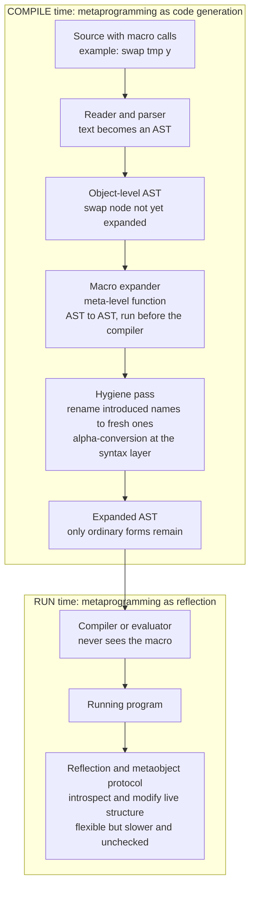

# 🪄 Metaprogramming and Macros

> [!abstract] TL;DR
> Most programs manipulate numbers and strings; a **meta**-program manipulates **programs** — it is *code that writes code*. A **macro** is metaprogramming's compile-time form: a tiny compiler you install into the language that grabs a chunk of source **syntax** (an AST / syntax tree), rewrites it into other syntax **before the real compiler ever runs**, and thereby lets you add new control structures, DSLs, and abstractions the language designers never anticipated. The spectrum runs from **compile-time** code generation (Lisp `defmacro`, Rust `macro_rules!`, C++ templates, Template Haskell) to **runtime reflection** and metaobject protocols (Java reflection, Python metaclasses, Smalltalk/CLOS MOP). The deep technical problem is **hygiene**: a naive macro can accidentally **capture** a user's variable — the exact variable-capture bug of substitution, one meta-level up — so serious macro systems automatically **alpha-rename** the names they introduce to fresh ones. Pushed to its limit, metaprogramming becomes **staging** and **partial evaluation**, whose crown jewel — the **Futamura projections** — proves that specializing an *interpreter* to a program yields a *compiled* program, unifying interpretation and compilation.

---

## Intuition

**Analogy:** You hand a rough manuscript to a **copy-editor** before it reaches the typesetter. You have invented some private shorthand — `TK` for "text to come", `ibid.` for "same source as above", a custom `⟨CHAR name⟩` tag that should expand into a full character bio. The copy-editor knows your rules and, **before the typesetter ever sees a page**, rewrites every shorthand into ordinary, finished prose. The typesetter only ever handles clean text; it never learns your shorthand existed. A **macro** is exactly that copy-editor for code: it runs at compile time, expanding the new syntax *you* invented into ordinary code the compiler already understands — so you get to extend the language without touching the compiler.

In technical terms: an ordinary function takes **values** and returns **values**; a macro takes a piece of **program syntax** and returns a **new piece of program syntax**. It operates one level up — at the **meta-level**, on the *representation* of the program (its [[Abstract_Syntax_Trees_and_Parser_Design|abstract syntax tree]]) — rather than at the **object-level**, on the data the program computes with. That single shift, "programs as data you can transform," is the whole idea, and it turns a fixed language into a **programmable** one.

---

## How It Works

### The meta-level vs the object-level

The core distinction is between the **object-level** (the program's ordinary computation over values) and the **meta-level** (computation over *representations of programs*). Metaprogramming is any computation at the meta-level: reading, generating, or transforming program text/AST/bytecode. A macro is a meta-level **function from syntax to syntax**. The AST it consumes and produces is the same tree structure a parser builds and a [[Interpreters_and_Tree_Walking|tree-walking interpreter]] evaluates — so macros plug directly into the standard front-end pipeline, between parsing and code generation.

### The metaprogramming spectrum: compile-time vs runtime

1. **Compile-time code generation.** The transformation runs **before** the program does, leaving **zero runtime cost** and allowing the compiler to type-check and optimize the result. This bucket holds Lisp/Scheme/Racket macros, Rust `macro_rules!` and procedural macros, C++ templates, Template Haskell, Scala 3 `inline`/macros, Julia macros, and plain code generators. Macros are the syntactic centre of this bucket.
2. **Runtime reflection and metaobject protocols.** The program **introspects and modifies itself while running** — enumerating fields, calling methods by name, rewriting classes on the fly. Java reflection, Python metaclasses and decorators, Ruby `method_missing`, and the Smalltalk / CLOS **metaobject protocol** live here. It is maximally flexible but **slower and unchecked** — errors surface at run time, and optimizers cannot see through it.

The two ends trade **when** you pay: macros pay at compile time (cheap, safe, but the transformation is fixed before you know runtime data); reflection pays at run time (flexible, data-dependent, but costly and fragile).

### Homoiconic vs syntactic macros

**Homoiconicity** — "code *is* data" — is Lisp's superpower: a program is written as **s-expressions** (nested lists), which are *also* Lisp's primary data structure. So a macro is just an **ordinary function from lists to lists**, and building new syntax is ordinary list construction, made ergonomic by **quasiquotation** (`` ` `` to quote a template, `,` / `,@` to splice computed pieces back in). `defmacro` registers such a function. Because the surface syntax and the AST coincide, Lisp macros are uniquely direct and powerful. **Syntactic (non-homoiconic) macros** — Rust, Scala, Template Haskell — operate on **token streams** or typed AST fragments instead, recovering much of the power at the cost of extra machinery (quote/splice constructs, pattern languages).

### Macros as AST transformers, expanded before evaluation

Expansion happens at **compile time**: source containing macro *invocations* is parsed to an AST in which the macro node is still unexpanded; the **macro expander** walks the tree and, at each macro node, calls the macro function to rewrite that node into ordinary forms; expansion **recurses** (an expansion may itself contain macros) until only primitive forms remain; only then does the compiler or evaluator run. Contrast this with **runtime reflection**, which acts on the already-running program. A macro can introduce a **new control structure** the designers never built in — an `unless`, a `for-each`, a pattern-matcher, a whole embedded [[Domain_Specific_Languages|DSL]] — which is why macros are called *"the programmable programming language."*

### The hygiene problem

Here is the deep issue. A macro that introduces a temporary variable — say `tmp` — can **capture** a user variable of the same name, silently breaking correct code. This is *literally* the variable-capture bug of [[Names_Binding_and_Scope|capture-avoiding substitution]], promoted one level: naive substitution of *code into code* respects spelling instead of scope. A **hygienic** macro system (Kohlbecker et al.; Scheme `syntax-rules`/`syntax-case`; Rust `macro_rules!`) automatically **alpha-renames** every identifier the macro introduces to a **fresh** name, so macro-internal bindings can never collide with user bindings — capture-avoiding substitution lifted to the syntax layer, connected directly to alpha-conversion and lexical scope. The Python demo below reproduces both the bug and its hygienic fix.

### Staging, partial evaluation, and the Futamura projections

Push metaprogramming further and you get **multi-stage programming** (MetaML, MetaOCaml, Terra): explicitly split a computation into **stages**, using quote/splice/`run` to **generate specialized code at an earlier stage** and run it later for performance. The theory underneath is **partial evaluation** — specializing a program to its *known* inputs — whose profound consequence is the **Futamura projections**: specializing an **interpreter** to a fixed source program yields a **compiled** program; specializing the specializer to the interpreter yields a **compiler**; specializing it to itself yields a **compiler-generator**. Metaprogramming thereby *unifies* interpretation and compilation, and is the conceptual cousin of the runtime specialization performed by a [[Just_In_Time_Compilation|JIT compiler]].

### Flow / Architecture



---

## Key Concepts

**Secondary (plain-language):**
- *A macro is a copy-editor for code.* It expands the shorthand syntax you invented into ordinary code before the compiler runs.
- *Code as data.* Ordinary functions transform numbers and strings; a metaprogram transforms **programs**.
- *New words in the language.* Macros let you add control structures and mini-languages the designers never built in.
- *Hygiene, in one line.* A well-behaved macro must not let its private helper variables clash with yours.

**Undergraduate:**
- *Object-level vs meta-level*, and the **compile-time (macros, templates, codegen) vs runtime (reflection, MOP)** spectrum, trading safety/cost against flexibility.
- *Homoiconicity* and s-expressions; `defmacro`, **quasiquotation** (quote / unquote / splice) for building syntax.
- *Macro expansion* as a recursive AST-to-AST rewrite that runs before evaluation; new control structures and **embedded DSLs** as the payoff.
- *The hygiene problem* as variable **capture** at the syntax layer, and its fix by fresh renaming (gensym / `syntax-rules`).
- *Reflection* — introspection (inspect structure) vs intercession (modify it) — and its performance and safety cost.

**Graduate:**
- *Hygiene formally:* Kohlbecker's algorithm, syntactic closures, and **scope sets** (Flatt) as the modern model; hygiene as capture-avoiding substitution over binding structure, tied to alpha-equivalence.
- *Multi-stage programming:* MetaML/MetaOCaml brackets, escape, and `run`; **typed** staging that guarantees generated code is well-typed and well-scoped; cross-stage persistence.
- *Partial evaluation* and the **Futamura projections** — `mix(interp, src) = target`, `mix(mix, interp) = compiler`, `mix(mix, mix) = cogen` — binding-time analysis, and the interpreter-to-compiler collapse.
- *Type-level metaprogramming:* C++ templates as a Turing-complete compile-time language; dependent-type-driven generation.
- *Procedural vs declarative macros:* Rust `macro_rules!` pattern matching vs `proc_macro` token-stream functions; Template Haskell `Q` monad; Racket's phase separation and the full **macro tower**.

---

## Python Demo

A pure-stdlib, homoiconic mini-language (s-expressions built from `dataclasses`) with a real **macro expander**: macros are functions from AST to AST, run **before** evaluation. It (1) adds a brand-new control structure `unless` via a macro, (2) implements `swap` **both unhygienically and hygienically**, (3) **reproduces the capture bug** — a naive `swap` silently corrupts a user variable named `tmp` — and shows the hygienic version fixing it with a fresh gensym, (4) prints the **before/after expanded AST**, and (5) **visualizes** the source-AST → expanded-AST transformation with matplotlib, coloring the macro-introduced fresh name distinctly from the user's variables.

```python
# Metaprogramming and macros: an AST-transforming macro system that expands
# BEFORE evaluation, plus the hygiene (variable-capture) problem and its fix.
from dataclasses import dataclass
from typing import List, Union, Dict, Callable
import matplotlib.pyplot as plt

# ---------- Homoiconic AST: identifiers, int literals, and list forms ----------
@dataclass(frozen=True)
class Sym:                      # an identifier / variable reference
    name: str
Node = Union[int, Sym, list]    # int literal | Sym | list-form (head Sym + args)

def S(n): return Sym(n)         # sugar for building identifiers

def show(t: Node) -> str:       # pretty-print as an s-expression
    if isinstance(t, Sym): return t.name
    if isinstance(t, int): return str(t)
    return "(" + " ".join(show(c) for c in t) + ")"

# ---------- Gensym: the fresh-name factory that makes hygiene possible ----------
_counter = [0]
def gensym(base: str) -> Sym:
    _counter[0] += 1
    return Sym(base + "$" + str(_counter[0]))   # a name the user cannot have written

# ---------- Macros: functions from argument-forms to a new form ----------
def macro_unless(args):                          # (unless cond body) -> (if (not cond) body (begin))
    cond, body = args
    return [S("if"), [S("not"), cond], body, [S("begin")]]

def macro_swap_naive(args):                      # UNHYGIENIC: hard-codes the name "tmp"
    a, b = args
    tmp = S("tmp")                               # <-- can capture a user variable named tmp
    return [S("begin"),
            [S("set"), tmp, a],
            [S("set"), a,   b],
            [S("set"), b,   tmp]]

def macro_swap_hygienic(args):                   # HYGIENIC: introduces a guaranteed-fresh name
    a, b = args
    tmp = gensym("tmp")                          # <-- cannot collide with any user identifier
    return [S("begin"),
            [S("set"), tmp, a],
            [S("set"), a,   b],
            [S("set"), b,   tmp]]

# ---------- The macro expander: rewrite the AST until only primitives remain ----------
def macroexpand(t: Node, macros: Dict[str, Callable]) -> Node:
    if isinstance(t, list) and t and isinstance(t[0], Sym) and t[0].name in macros:
        rewritten = macros[t[0].name](t[1:])     # call the macro on its argument-forms
        return macroexpand(rewritten, macros)    # re-expand: an expansion may contain macros
    if isinstance(t, list):
        return [macroexpand(c, macros) for c in t]
    return t                                     # Sym / int pass through unchanged

# ---------- A tiny environment evaluator for the expanded, macro-free AST ----------
def evaluate(t: Node, env: Dict[str, int], out: List[int]) -> object:
    if isinstance(t, int): return t
    if isinstance(t, Sym): return env[t.name]
    head = t[0].name
    if head == "begin":
        r = None
        for s in t[1:]: r = evaluate(s, env, out)
        return r
    if head == "set":   env[t[1].name] = evaluate(t[2], env, out); return env[t[1].name]
    if head == "if":    return evaluate(t[2] if evaluate(t[1], env, out) else t[3], env, out)
    if head == "not":   return not evaluate(t[1], env, out)
    if head == "lt":    return evaluate(t[1], env, out) < evaluate(t[2], env, out)
    if head == "print": v = evaluate(t[1], env, out); out.append(v); return v
    raise ValueError("unknown form: " + head)

# ===== 1. A macro adds a NEW control structure the language never had =====
prog_unless = [S("begin"),
               [S("set"), S("x"), 5],
               [S("unless"), [S("lt"), S("x"), 0], [S("print"), S("x")]]]
expanded_u = macroexpand(prog_unless, {"unless": macro_unless})
out_u: List[int] = []
evaluate(expanded_u, {}, out_u)
print("=== 1. 'unless' — a new control structure installed by a macro ===")
print("  source  :", show(prog_unless))
print("  expanded:", show(expanded_u))
print("  output  :", out_u, " (printed x because x is NOT < 0)")

# ===== 2. 'swap' and the HYGIENE problem =====
_counter[0] = 0
swap_form = [S("swap"), S("tmp"), S("y")]                 # user swaps a var literally named tmp
naive_exp    = macro_swap_naive(swap_form[1:])
hygienic_exp = macro_swap_hygienic(swap_form[1:])         # first gensym -> tmp$1
print("\n=== 2. 'swap' expansion (before/after AST) ===")
print("  invocation      :", show(swap_form))
print("  naive expansion :", show(naive_exp), "   <-- reuses the name tmp")
print("  hygienic expand :", show(hygienic_exp), "   <-- fresh tmp$1")

# The user's program: they happen to have a variable called tmp.
user_prog = [S("begin"),
             [S("set"), S("tmp"), 1],
             [S("set"), S("y"),   2],
             [S("swap"), S("tmp"), S("y")],
             [S("print"), S("tmp")],
             [S("print"), S("y")]]

env_n, out_n = {}, []
evaluate(macroexpand(user_prog, {"swap": macro_swap_naive}),    env_n, out_n)
env_h, out_h = {}, []
evaluate(macroexpand(user_prog, {"swap": macro_swap_hygienic}), env_h, out_h)
print("\n=== 3. Running the SAME program with each macro ===")
print("  goal: after swap, expect tmp=2, y=1")
print("  naive    macro -> [tmp, y] =", out_n, "  <-- WRONG: user's tmp was captured")
print("  hygienic macro -> [tmp, y] =", out_h, "  <-- CORRECT")

# ===== 4. Visualize the AST transformation: source -> hygienic expansion =====
USER = {"tmp", "y"}
def build_tree(t: Node):
    if isinstance(t, int):  return {"label": str(t), "tag": "lit", "kids": []}
    if isinstance(t, Sym):  return {"label": t.name,
                                    "tag": "user" if t.name in USER else "introduced", "kids": []}
    head = t[0].name if isinstance(t[0], Sym) else "list"
    tag = "macro" if head == "swap" else "op"
    return {"label": head, "tag": tag, "kids": [build_tree(c) for c in t[1:]]}

def place(n, xc, depth=0):
    n["y"] = -depth
    if not n["kids"]:
        n["x"] = xc[0]; xc[0] += 1.0
    else:
        for k in n["kids"]: place(k, xc, depth + 1)
        n["x"] = (n["kids"][0]["x"] + n["kids"][-1]["x"]) / 2.0

COL = {"macro": "#c62828", "op": "#37474f", "user": "#1565c0",
       "introduced": "#2e7d32", "lit": "#6a1b9a"}
def draw(ax, tree, title):
    place(tree, [0.0])
    xs, ys = [], []
    def walk(n):
        xs.append(n["x"]); ys.append(n["y"])
        for k in n["kids"]:
            ax.plot([n["x"], k["x"]], [n["y"], k["y"]], "-", color="#b0bec5", lw=1.3, zorder=1)
            walk(k)
        ax.text(n["x"], n["y"], n["label"], ha="center", va="center", zorder=3,
                fontsize=11, family="monospace", fontweight="bold", color="white",
                bbox=dict(boxstyle="round,pad=0.32", fc=COL[n["tag"]], ec="none"))
    walk(tree)
    ax.set_xlim(min(xs) - 0.8, max(xs) + 0.8); ax.set_ylim(min(ys) - 0.6, max(ys) + 0.6)
    ax.set_title(title, fontsize=11.5, fontweight="bold"); ax.axis("off")

fig, (ax0, ax1) = plt.subplots(1, 2, figsize=(12.5, 4.6))
draw(ax0, build_tree(swap_form),    "Source AST:  (swap tmp y)  — one macro node")
draw(ax1, build_tree(hygienic_exp), "Expanded AST (hygienic):  fresh tmp$1 cannot capture user's tmp")
fig.suptitle("Macro expansion: a meta-level function rewrites the syntax tree before evaluation\n"
             "blue = user identifiers   green = macro-introduced fresh name   red = macro call",
             fontsize=12, fontweight="bold")
plt.tight_layout(); plt.savefig("macro_expansion.png", dpi=120)  # optional
plt.show()
```

Console output:

```
=== 1. 'unless' — a new control structure installed by a macro ===
  source  : (begin (set x 5) (unless (lt x 0) (print x)))
  expanded: (begin (set x 5) (if (not (lt x 0)) (print x) (begin)))
  output  : [5]  (printed x because x is NOT < 0)

=== 2. 'swap' expansion (before/after AST) ===
  invocation      : (swap tmp y)
  naive expansion : (begin (set tmp tmp) (set tmp y) (set y tmp))    <-- reuses the name tmp
  hygienic expand : (begin (set tmp$1 tmp) (set tmp y) (set y tmp$1))    <-- fresh tmp$1

=== 3. Running the SAME program with each macro ===
  goal: after swap, expect tmp=2, y=1
  naive    macro -> [tmp, y] = [2, 2]   <-- WRONG: user's tmp was captured
  hygienic macro -> [tmp, y] = [2, 1]   <-- CORRECT
```

The figure draws the source AST (a single `swap` macro node with the user's `tmp` and `y` as blue leaves) beside its hygienic expansion (a `begin`/`set` scaffold whose introduced temporary is the **green** `tmp$1`). Because the introduced name is fresh, it is visibly a *different* node from the user's blue `tmp` — which is exactly why the hygienic run leaves `y = 1` while the naive run, reusing the literal name `tmp`, corrupts it to `2`.

---

## Real-World Applications

> **Lisp / Scheme / Racket.** The archetype: homoiconic s-expressions make macros ordinary functions from code to code, so much of each language (pattern matching, `for` loops, class systems, whole DSLs) is *itself* macros. Racket takes this furthest — a hygienic macro tower with phase separation — and markets itself as a *language for making languages*, the practical face of [[Domain_Specific_Languages|embedded DSL construction]].

> **Rust.** `macro_rules!` gives **declarative, hygienic** macros via pattern matching on token trees; **procedural macros** (`derive`, attribute, function-like) run arbitrary Rust over a `TokenStream` at compile time. `vec![...]`, `println!`, and `#[derive(Debug, Clone)]` are macros generating code you would otherwise hand-write. See [[Rust_Macros]].

> **C and C++.** The C preprocessor is the crude, **unhygienic ancestor** — pure text substitution with no notion of scope, the classic source of capture and double-evaluation bugs. C++ **templates**, by contrast, are a Turing-complete **compile-time metaprogramming** language over types, generating specialized code (and, historically, whole libraries) before runtime.

> **Python.** Reflection-heavy metaprogramming at **runtime**: **decorators** wrap functions/classes, **metaclasses** customize class creation, and `getattr`/`setattr`/`__getattr__` introspect and intercede. ORMs (Django models, SQLAlchemy) and frameworks lean on it heavily; see [[Decorators_and_Metaprogramming]] and [[Python_OOP]].

> **Compilers and JITs.** Partial evaluation and staging power real specializers: PyPy generates a tracing JIT *from an interpreter* (a Futamura-style move), Terra stages high-performance kernels inside Lua, and template/JIT specialization emits code tuned to values known only late — kin to [[Just_In_Time_Compilation]].

---

## Common Pitfalls

- **Unhygienic capture.** A macro that introduces a fixed name (`tmp`, `it`, `result`) can shadow or be shadowed by user code, silently changing behavior — the demo's `[2, 2]` bug. Always use the hygienic system or `gensym`/`Ident::new` fresh names; this is [[Names_Binding_and_Scope|capture-avoiding substitution]] at the syntax layer.
- **Double evaluation of arguments.** A macro that mentions an argument form twice evaluates it twice. `max(a, b)` as `((a) > (b) ? (a) : (b))` runs `a++` twice. Bind each argument to a fresh temporary *once*, then use the temporary.
- **Reaching for a macro when a function would do.** Macros obscure control flow, resist composition, and complicate debugging. If the job needs only *values*, write a function; reserve macros for genuinely new **syntax** or binding forms.
- **Breaking tooling and error messages.** Expanded code has no source location by default, so debuggers, stack traces, and IDEs point at generated gibberish. Preserve source spans / hygiene info; poor **error reporting** is the hard, often-neglected half of macro design.
- **Runtime reflection everywhere.** Reflection defeats the optimizer and static checks and costs real cycles on hot paths. Prefer compile-time generation; cache reflective lookups; keep intercession out of inner loops.
- **Turing-complete compile times.** Template metaprogramming and heavy macros can make compilation slow and diagnostics unreadable. Bound the recursion and measure build time.
- **"You are now a language designer."** Every macro is a small language extension future readers must learn. Wield it judiciously — the cost is paid by everyone who reads the code, not just its author.

---

## Related Concepts

- [[Abstract_Syntax_Trees_and_Parser_Design]] — the AST is the very data a macro consumes and produces; expansion sits between parsing and code generation.
- [[Names_Binding_and_Scope]] — hygiene *is* capture-avoiding substitution and alpha-conversion, lifted from the object-level to the syntax layer.
- [[Domain_Specific_Languages]] — macros and quasiquotation are the primary tool for building **embedded** DSLs inside a host language.
- [[Interpreters_and_Tree_Walking]] — the expanded, macro-free AST is exactly what a tree-walking evaluator runs; staging generates such trees ahead of time.
- [[Just_In_Time_Compilation]] — runtime specialization to observed values; the dynamic cousin of partial evaluation and the Futamura projections.
- [[Rust_Macros]] — a production hygienic macro system: declarative `macro_rules!` plus token-stream procedural macros.
- [[Decorators_and_Metaprogramming]] — Python's **runtime** end of the spectrum: decorators, metaclasses, and reflective intercession.
- [[The_Lambda_Calculus]] — quote/eval and staging quasiquotation echo the lambda calculus's separation of building vs running computations.
- [[Semantic_Analysis_and_Symbol_Tables]] — the scope resolution that hygiene must respect when it renames introduced identifiers.

Not-yet-created Programming Language Theory siblings referenced above (in prose): `Object_Oriented_Language_Theory` (reflection and the metaobject protocol) and `The_Future_of_Programming_Languages` (metaprogramming's reach toward AI-assisted code generation).

---

## Review Questions

1. **(Secondary)** Using the copy-editor analogy, explain the difference between an ordinary *function* and a *macro*. Why can a macro add a brand-new `unless` keyword to a language, but an ordinary function cannot fully replicate a short-circuiting control structure?
2. **(Undergraduate)** Trace the demo's naive `swap(tmp, y)` step by step (start `tmp=1, y=2`) and show precisely where the user's `tmp` gets captured, producing `y=2` instead of `1`. Then show how substituting a fresh `tmp$1` fixes it. Which classic substitution bug is this the syntax-level version of?
3. **(Graduate)** State the three **Futamura projections** and explain, in your own words, why specializing an *interpreter* to a fixed source program yields a *compiled* program. How does multi-stage programming (MetaOCaml brackets/escape/`run`) let a programmer perform such specialization explicitly and safely, and what does a *typed* staging system guarantee about the generated code?

---

## Sources

- Eugene Kohlbecker, Daniel P. Friedman, Matthias Felleisen, Bruce Duba, "Hygienic Macro Expansion," *ACM Conference on LISP and Functional Programming* (1986). [ACM DL](https://doi.org/10.1145/319838.319859)
- Paul Graham, *On Lisp: Advanced Techniques for Common Lisp* (Prentice Hall, 1993) — the canonical treatment of Lisp macros. [paulgraham.com](https://www.paulgraham.com/onlisp.html)
- Yoshihiko Futamura, "Partial Evaluation of Computation Process — An Approach to a Compiler-Compiler," *Higher-Order and Symbolic Computation* 12 (1999, reprint of 1971). [Springer](https://doi.org/10.1023/A:1010095604496)
- Neil D. Jones, Carsten K. Gomard, Peter Sestoft, *Partial Evaluation and Automatic Program Generation* (Prentice Hall, 1993). [Free PDF](https://www.itu.dk/people/sestoft/pebook/)
- Walid Taha and Tim Sheard, "MetaML and multi-stage programming with explicit annotations," *Theoretical Computer Science* 248 (2000). [ScienceDirect](https://doi.org/10.1016/S0304-3975%2800%2900053-0)
- Matthew Flatt, "Binding as Sets of Scopes," *POPL* (2016) — the modern model of macro hygiene behind Racket. [ACM DL](https://doi.org/10.1145/2837614.2837620)

---

#programming-language-theory #metaprogramming #macros #hygiene #staging
