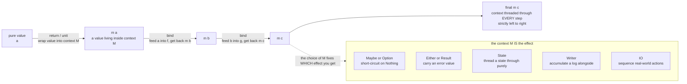

# 📦 Monads and Effects

> [!abstract] TL;DR
> Pure functional programming forbids side effects to preserve **referential transparency** — but real programs must read files, fail, mutate state, log, branch nondeterministically, and touch the outside world. A **monad** is the answer: a *shipping container* that wraps a value together with some **extra context** (maybe-failure, a log, a threaded state, the real world) and exposes exactly **two operations** — `return` (put a plain value into the container) and `bind` / `>>=` (chain a context-aware step onto the previous result) — obeying **three laws** (left identity, right identity, associativity). Because each step in a `bind`-chain can *depend on* the previous result, a monad is strictly more powerful than a **functor** (`map`) or an **applicative** (combine independent effects): it **sequences** effectful computations. This is Moggi's categorical insight (effects = monads) that Wadler turned into engineering, and it is why Haskell's `IO`, Rust's `?`, JavaScript's `async/await`, and LINQ are all the *same* pattern. The modern successor — **algebraic effects and handlers** — separates the *what* of an effect from the *how*, composing where monads famously do not.

---

## Intuition

**Analogy — the shipping container with a manifest.** A pure function is like a factory worker who may only take parts in and hand parts out — never phone a supplier, never scribble in a ledger, never touch anything outside the bench. That keeps the worker perfectly predictable (same inputs → same outputs, forever), but real work needs suppliers, ledgers, and the outside world. A **monad is a standardized shipping container** that lets you do the messy real-world stuff *without* the worker ever breaking the rules. The container holds your value **plus a manifest** describing some extra context: *"this might have arrived empty"* (failure), *"a running logbook rode along"* (Writer), *"a clipboard of state was carried through"* (State), *"this is a work order to be executed against the real world"* (IO). Crucially, the container comes with **one standard coupling mechanism** for hooking one container onto the next — that coupling is `bind`. You never manually reconcile the manifests; the coupling does it: it propagates the "empty" flag, concatenates the logbooks, threads the clipboard forward, or sequences the work orders. You get side-effect-*like* power while every worker stays pure.

Put technically: `bind` is a **"programmable semicolon."** In an imperative language the `;` between two statements silently decides *what carries over* from one line to the next. A monad lets you *program that semicolon* — choose whether the carry-over is error-propagation, log-accumulation, or state-threading — while the code you write still reads like a straight sequence of steps.

---

## How It Works

### The problem monads solve

A language is **referentially transparent** when any expression can be replaced by its value with no change in meaning (`[[Contextual_Equivalence_and_Reasoning]]`). That property is the whole reason to go pure: it makes equational refactoring, memoization, parallelism, and reasoning sound (`[[Denotational_Semantics]]`). But `getLine`, `x := x + 1`, `throw`, and a random-number draw all *break* it — call them twice and you get different answers. So the central practical question functional programming had to answer is: **how do you perform I/O, mutation, exceptions, nondeterminism, and logging while staying pure?** The monadic answer is to *not* perform the effect inside a value at all, but to make the effect part of the value's **type and context**, and to sequence effects through a disciplined chaining operator. (The pure lambda-calculus core this sits on top of is developed in the sibling `Functional_Programming_Foundations`.)

### The Functor → Applicative → Monad hierarchy

These are three tiers of "computing inside a context `M`", each strictly more powerful than the last:

| Tier | Operation | Type (informal) | What it can do | What it *cannot* do |
|---|---|---|---|---|
| **Functor** | `map` / `fmap` | `(a -> b) -> M a -> M b` | Apply a pure function *inside* the context, leaving the context's shape untouched | Combine two wrapped values; let one step depend on another |
| **Applicative** | `ap` / `<*>` | `M (a -> b) -> M a -> M b` | Combine *independent* effectful values (both effects run, structure is fixed up front) | Let a later step's **structure depend on** an earlier step's **result** |
| **Monad** | `bind` / `>>=` | `M a -> (a -> M b) -> M b` | **Sequence** effects where each step's *effect and value can depend on the previous result* | (nothing more within this hierarchy — this is the top) |

The decisive difference: `bind` takes a function `a -> M b` — its second argument produces a **new context** computed *from the unwrapped value*. That is why a monad can express `if the file opened, then read from that specific handle` — the second effect literally does not exist until the first has produced a result. An applicative can only glue together effects whose shape was already decided. This is exactly the power/analysis trade-off: applicatives are more analyzable and parallelizable *because* they forbid this dependency; monads are more expressive *because* they allow it.

### The monad interface and its laws

A monad on context `M` is precisely two functions:

- **`return` / `unit` : `a -> M a`** — inject a pure value into the context with *no* effect (empty log, unchanged state, present-not-absent).
- **`bind` / `>>=` : `M a -> (a -> M b) -> M b`** — feed the value inside `M a` into a context-producing continuation, and *reconcile the two contexts* into one.

To be a *lawful* monad — the contract that makes `do`-notation and refactoring sound — these must satisfy three **monad laws**:

```
Left identity:   bind(return a, f)        ==  f a
Right identity:  bind(m, return)          ==  m
Associativity:   bind(bind(m, f), g)      ==  bind(m, \x -> bind(f x, g))
```

Left/right identity say `return` is a genuine "do nothing" unit; associativity says how you *parenthesize* a chain of binds is irrelevant — so `a; (b; c)` and `(a; b); c` mean the same thing, which is what lets a compiler desugar `do`-blocks and lets you extract a sub-sequence into a helper without changing behavior. In categorical terms these are the **monoid laws of Kleisli composition** (composing functions `a -> M b`), which is the deep reason the pattern is called a *monad*.

### The canonical monads

Each canonical monad is just a different choice of "what the manifest carries":

- **Maybe / Option** — `M a = Just a | Nothing`. `bind` **short-circuits**: once a step yields `Nothing`, every later step is skipped. Failure handling with **no explicit `if x is None` checks**.
- **Either / Result** — like Maybe but the failure carries an **error value** (`Left e` / `Err e`). Exceptions without exceptions; the basis of Rust's `Result` and the `?` operator.
- **State** — `M a = s -> (a, s)`. `bind` **threads the state** `s` from one step to the next, so code *looks* mutable while every function stays pure.
- **Writer** — `M a = (a, log)`. `bind` **concatenates the logs** (any monoid), accumulating a trace alongside the value.
- **Reader** — `M a = env -> a`. `bind` passes a shared, read-only **environment** to every step: pure **dependency injection**.
- **List** — `M a = [a]`. `bind` runs the continuation on *every* element and flattens: **nondeterminism** / all-possible-choices (this *is* the list-comprehension engine).
- **IO** — `M a` is an opaque **description of a real-world action** returning `a`. `bind` sequences actions; the runtime (Haskell's `main`) is the only thing that actually *runs* them. This is what makes side effects **explicit in the type** and **strictly ordered** in an otherwise lazy, pure language.
- **Continuation** — `M a = (a -> r) -> r`. `bind` captures "the rest of the program", modeling **control flow** (early exit, generators, coroutines); it connects to evaluation order and CPS in `[[Reduction_Strategies_and_Evaluation_Order]]`.

### The monad interface, visualized



### do-notation: monadic code that reads imperative

Writing raw `bind` chains nests into a callback pyramid. Every functional language therefore offers **syntactic sugar** that desugars *back* to `bind`:

```
Haskell do:     do { x <- ma; y <- mb x; return (x + y) }
  desugars to:  ma >>= \x -> mb x >>= \y -> return (x + y)

Scala for:      for { x <- ma; y <- mb(x) } yield x + y      -- flatMap + map
Rust ?:         let x = ma()?;  // Result-monad bind: short-circuit on Err
JS async/await: const x = await pa;  // Promise/Future is (roughly) a monad
```

The key insight: `<-`, `?`, and `await` are all the *same operation* — `bind` — dressed in language-specific syntax. Because the monad laws hold, the compiler may desugar and you may refactor these blocks freely (this desugaring is a small **embedded DSL**, see `[[Domain_Specific_Languages]]`).

### The category-theory origin

**Eugenio Moggi (1989–91)** observed that *computational effects* — state, exceptions, I/O, nondeterminism — can each be modeled as a **monad in the categorical sense**: an endofunctor `T` equipped with a unit `η : Id ⇒ T` and a multiplication `μ : T∘T ⇒ T` satisfying coherence (associativity and unit) laws — see `[[Category_Theory]]`. This gave a *uniform denotational account* of effects: a computation of type `A` denotes an element of `T A` (`[[Denotational_Semantics]]`). **Philip Wadler (1992)** then popularized monads as a *programming* discipline, showing the same structure organizes real Haskell code. The `bind`/`return`/laws you write in code and the `μ`/`η`/coherence of the categorical definition are literally the same thing.

### Composing effects: transformers vs algebraic effects

Monads have a notorious weakness: **they do not compose in general.** There is no generic way to combine "Maybe" and "State" into one monad. The classical fix is **monad transformers** — `StateT`, `ReaderT`, `ExceptT` — that *stack* one effect on top of another monad. It works but is clunky: the stacks are rigid, `lift`ing between layers is boilerplate, and the ordering of the stack is semantically significant.

The modern successor is **algebraic effects and handlers**. Instead of baking the effect's *implementation* into a monad, you (1) **declare effect operations** as an interface (`Get`, `Put`, `Throw`, `Fresh`) and (2) write **handlers** that *interpret* those operations — separately from the code that uses them, like resumable exceptions. The effectful code says only *what* it needs; a handler decides *how* (real state cell, a mock, a transaction, an undo log). Effects then **compose cleanly** by row-typing rather than nesting. This is the design of **Koka**, **Effekt**, **Unison**, and **OCaml 5**'s built-in effects; it also underlies structured concurrency (see the sibling `Concurrency_and_Process_Calculi`, and effect inference in `Effect_Systems_and_Program_Analysis`). A related encoding, **free monads** and **tagless-final**, turns an effectful program into *data* (a syntax tree of operations) that multiple interpreters can run different ways — production, test, dry-run — an embedded DSL for effects (`[[Domain_Specific_Languages]]`).

---

## Key Concepts

**Secondary (explain to a curious beginner).**
- A **monad is a box** that holds a value plus some extra context (maybe it's empty, maybe a log rode along, maybe a state clipboard). It comes with one standard way to hook boxes together in sequence.
- `return` puts an ordinary value into the box; `bind` runs the next step on the box's contents and merges the two boxes' contexts automatically — so *you* never write the plumbing.
- The same box idea powers `Optional` chaining, error handling without exceptions, and `async/await` — different boxes, same coupling.

**Undergraduate (requires a CS background).**
- **Functor < Applicative < Monad**: `map` transforms inside a fixed context; `ap` combines *independent* effects; `bind` **sequences** effects where each step depends on the previous result — the source of a monad's extra power (and lost static analyzability).
- The **three monad laws** (left identity, right identity, associativity) make `do`/`for` desugaring and equational refactoring **sound**; they are the monoid laws of **Kleisli composition** (`>=>`).
- The canonical monads pick different contexts: **Maybe/Either** (failure/error), **State** (threaded mutation), **Writer** (logging), **Reader** (environment), **List** (nondeterminism), **IO** (real-world effects), **Continuation** (control). `IO` is what makes Haskell's effects explicit and ordered.
- **`bind` is a programmable semicolon**: it defines what "carries over" between two sequenced computations.

**Graduate (system-level and foundational thinking).**
- **Moggi's monadic semantics**: effects as a strong monad `T` on a cartesian-closed category; a value of computational type `A` denotes `T A`; the Kleisli category models effectful function composition (`[[Category_Theory]]`, `[[Denotational_Semantics]]`).
- **Monad transformers** give effect stacking but not modular composition; the `mtl` class approach and its `n²` instance problem; ordering-sensitivity of `StateT (ExceptT ...)` vs `ExceptT (StateT ...)`.
- **Algebraic effects (Plotkin–Power)**: effects presented by *operations and equations*; **handlers (Plotkin–Pretnar)** are the demodularized "eliminators", generalizing resumable exceptions; effect **rows** give clean composition and type inference (`Effect_Systems_and_Program_Analysis`).
- **Free monads / freer / tagless-final** as the reflective encoding: `Free f a` is the initial algebra of the syntax functor `f`; interpreters are `f`-algebras — the same idea as **initial vs final** semantics.

---

## Python Demo

We implement **three monads from scratch** — `Maybe`, `Writer`, and `State` — behind the **same `unit` / `bind` interface**, then run the *same* generic pipeline driver over each. The point is that one abstraction **automates three different kinds of plumbing**: failure propagation (no `if x is None`), log accumulation, and state threading. We then **verify the three monad laws empirically** for all three monads, and **visualize** how each monad threads its context through the bind-chain. Pure standard library plus matplotlib.

```python
# Three monads, ONE interface: unit + bind. Each automates different plumbing.
#   Maybe  -> failure propagation (short-circuit; NO explicit None checks)
#   Writer -> log accumulation    (a log rides alongside the value)
#   State  -> state threading     (pass state through purely; NO mutation)
# We build a pipeline in each, verify the THREE MONAD LAWS empirically,
# and visualise how the context is threaded through the bind-chain.
from dataclasses import dataclass
from typing import Any, Callable, Tuple
import matplotlib.pyplot as plt
import matplotlib.patches as mpatches

# ================================================================
# 1. MAYBE monad  --  context = "the value might be absent"
# ================================================================
@dataclass(frozen=True)
class Just:
    value: Any
@dataclass(frozen=True)
class Nothing:
    pass

def maybe_unit(x):                 # return :: a -> Maybe a
    return Just(x)

def maybe_bind(m, f):              # bind :: Maybe a -> (a -> Maybe b) -> Maybe b
    if isinstance(m, Nothing):     # SHORT-CIRCUIT: skip the continuation entirely
        return m
    return f(m.value)

# ================================================================
# 2. WRITER monad  --  context = "a log tags along"
# ================================================================
@dataclass(frozen=True)
class Writer:
    value: Any
    log: Tuple[str, ...]

def writer_unit(x):                # return :: a -> Writer a  (empty log)
    return Writer(x, ())

def writer_bind(m, f):             # bind: run f, then CONCATENATE the two logs
    n = f(m.value)
    return Writer(n.value, m.log + n.log)

# ================================================================
# 3. STATE monad  --  context = "a state threads through"
# ================================================================
@dataclass(frozen=True)
class State:
    run: Callable[[Any], Tuple[Any, Any]]     # a function  s -> (value, s')

def state_unit(x):                 # return :: a -> State a  (state untouched)
    return State(lambda s: (x, s))

def state_bind(m, f):              # bind: thread s through m, then through f
    def run(s):
        a, s1 = m.run(s)           # run first step, get value + new state
        return f(a).run(s1)        # feed value forward, THREAD state forward
    return State(run)

# ================================================================
# ONE generic driver works for EVERY monad: fold bind over the steps.
# ================================================================
def run_pipeline(bind, start, steps):
    m = start
    for f in steps:
        m = bind(m, f)
    return m

# ----- Maybe pipeline: safe arithmetic, failure propagates by itself -----
def m_sub(n):       return lambda x: maybe_unit(x - n)
def m_safe_div(nu): return lambda x: Nothing() if x == 0 else maybe_unit(nu / x)
maybe_steps = [m_sub(2), m_safe_div(12), m_sub(1)]        # (x-2) -> 12/(x-2) -> -1
ok  = run_pipeline(maybe_bind, maybe_unit(5), maybe_steps)  # 5-2=3, 12/3=4, 4-1=3
bad = run_pipeline(maybe_bind, maybe_unit(2), maybe_steps)  # 2-2=0 -> div by zero!

# ----- Writer pipeline: every step appends to a shared log automatically -----
def w_add(n): return lambda x: Writer(x + n, (f"add {n:+d}: {x} -> {x + n}",))
def w_mul(n): return lambda x: Writer(x * n, (f"mul {n}:  {x} -> {x * n}",))
writer_steps = [w_add(4), w_mul(3), w_add(-2)]
wres = run_pipeline(writer_bind, writer_unit(3), writer_steps)  # 3->7->21->19

# ----- State pipeline: a bank balance threaded purely (no mutable variable) -----
def deposit(a):  return lambda _: State(lambda bal: (bal + a, bal + a))
def withdraw(a): return lambda _: State(lambda bal: (bal - a, bal - a))
state_steps = [deposit(100), withdraw(30), deposit(50)]
sres = run_pipeline(state_bind, state_unit(None), state_steps)
final_value, final_state = sres.run(0)                     # 0 -> 100 -> 70 -> 120

print("== Pipelines (same driver, three effects) ==")
print(f"Maybe  ok : {ok}")
print(f"Maybe  bad: {bad}   <- failure propagated with NO if-None checks")
print(f"Writer    : value={wres.value}, log lines={len(wres.log)}")
for line in wres.log: print(f"           {line}")
print(f"State     : value={final_value}, final balance={final_state}\n")

# ================================================================
# Verify the THREE MONAD LAWS empirically for each monad.
# Maybe/Writer compare by ==; State compares by running on sample states.
# ================================================================
def state_eq(a, b, samples=(0, 1, 5, -3)):
    return all(a.run(s) == b.run(s) for s in samples)

def check_laws(unit, bind, eq, m, a, f, g):
    left  = eq(bind(unit(a), f), f(a))                              # left identity
    right = eq(bind(m, unit), m)                                    # right identity
    assoc = eq(bind(bind(m, f), g),                                 # associativity
               bind(m, lambda x: bind(f(x), g)))
    return left, right, assoc

law_results = {
    "Maybe":  check_laws(maybe_unit,  maybe_bind,  lambda a, b: a == b,
                         maybe_unit(10), 5,
                         lambda x: maybe_unit(x + 1),
                         lambda x: Nothing() if x > 100 else maybe_unit(x * 2)),
    "Writer": check_laws(writer_unit, writer_bind, lambda a, b: a == b,
                         writer_unit(10), 5,
                         lambda x: Writer(x + 1, ("f",)),
                         lambda x: Writer(x * 2, ("g",))),
    "State":  check_laws(state_unit,  state_bind,  state_eq,
                         state_unit(10), 5,
                         lambda x: State(lambda s: (x + 1, s + 1)),
                         lambda x: State(lambda s: (x * 2, s + 10))),
}
print("== Monad laws (left identity / right identity / associativity) ==")
for name, (l, r, a) in law_results.items():
    print(f"{name:7} left={l}  right={r}  assoc={a}")

# ================================================================
# VISUALISE how each monad threads its context through the bind-chain.
# ================================================================
def trace(bind, start, steps):
    """Record the monadic value after each bind step."""
    acc, m = [start], start
    for f in steps:
        m = bind(m, f); acc.append(m)
    return acc

fig, axes = plt.subplots(2, 2, figsize=(14, 10))
labels_m = ["start", "sub 2", "div 12", "sub 1"]

# Panel A: MAYBE short-circuit (success vs failure).
ax = axes[0, 0]
num = lambda mv: None if isinstance(mv, Nothing) else mv.value
ok_t  = [num(v) for v in trace(maybe_bind, maybe_unit(5), maybe_steps)]  # [5,3,4,3]
bad_t = [num(v) for v in trace(maybe_bind, maybe_unit(2), maybe_steps)]  # [2,0,None,None]
xs = range(len(labels_m))
ax.plot(xs, ok_t, "-o", color="#55A868", lw=2, label="input 5  (success)")
alive = [i for i, v in enumerate(bad_t) if v is not None]
ax.plot(alive, [bad_t[i] for i in alive], "-o", color="#C44E52", lw=2, label="input 2  (fails)")
first_none = next(i for i, v in enumerate(bad_t) if v is None)
ax.scatter([first_none], [0], marker="X", s=260, color="#C44E52", zorder=5)
ax.annotate("Nothing:\nbind SHORT-CIRCUITS,\nlater steps skipped",
            xy=(first_none, 0), xytext=(first_none - 0.15, 2.2),
            color="#C44E52", fontweight="bold",
            arrowprops=dict(arrowstyle="->", color="#C44E52"))
ax.set_xticks(list(xs)); ax.set_xticklabels(labels_m)
ax.set_title("MAYBE monad: failure propagates automatically")
ax.set_ylabel("value inside the context"); ax.legend(); ax.grid(alpha=0.3)

# Panel B: WRITER log accumulation.
ax = axes[0, 1]
wtrace = trace(writer_bind, writer_unit(3), writer_steps)
vals    = [w.value for w in wtrace]
loglen  = [len(w.log) for w in wtrace]
xb = range(len(wtrace))
ax.bar(xb, loglen, color="#4C72B0", alpha=0.55, label="cumulative log lines")
ax.plot(xb, vals, "-o", color="#DD8452", lw=2, label="value")
for i, w in enumerate(wtrace):
    if w.log:
        ax.text(i, len(w.log) + 0.08, w.log[-1], ha="center", fontsize=7, rotation=0)
ax.set_xticks(list(xb)); ax.set_xticklabels(["start", "add", "mul", "add"])
ax.set_title("WRITER monad: log accumulates alongside the value")
ax.set_ylabel("value / log length"); ax.legend(); ax.grid(alpha=0.3)

# Panel C: STATE threading (balance carried through purely).
ax = axes[1, 0]
def trace_state(steps, s0):
    return [run_pipeline(state_bind, state_unit(None), steps[:k]).run(s0)[1]
            for k in range(len(steps) + 1)]
bal = trace_state(state_steps, 0)                          # [0,100,70,120]
xs2 = range(len(bal))
ax.plot(xs2, bal, "-o", color="#8172B3", lw=2)
for x, b in zip(xs2, bal):
    ax.annotate(f"{b}", (x, b), textcoords="offset points", xytext=(0, 10),
                ha="center", fontweight="bold")
ax.set_xticks(list(xs2)); ax.set_xticklabels(["init", "deposit\n100", "withdraw\n30", "deposit\n50"])
ax.set_title("STATE monad: state threaded through purely (no mutation)")
ax.set_ylabel("threaded state (balance)"); ax.grid(alpha=0.3)

# Panel D: bind-chain schematic + law verdicts.
ax = axes[1, 1]; ax.axis("off")
ax.set_title("bind chains context-aware steps; the LAWS make it sound")
box_x = [0.10, 0.45, 0.80]
for x, lab in zip(box_x, ["m a", "m b", "m c"]):
    ax.add_patch(mpatches.FancyBboxPatch((x - 0.07, 0.70), 0.14, 0.12,
                 boxstyle="round,pad=0.01", color="#4C72B0"))
    ax.text(x, 0.76, lab, ha="center", va="center", color="white", fontweight="bold")
for x0, x1, lab in [(box_x[0], box_x[1], "bind f"), (box_x[1], box_x[2], "bind g")]:
    ax.annotate("", xy=(x1 - 0.07, 0.76), xytext=(x0 + 0.07, 0.76),
                arrowprops=dict(arrowstyle="->", lw=2, color="#333"))
    ax.text((x0 + x1) / 2, 0.85, lab, ha="center", color="#333", fontweight="bold")
verdict = ["monad laws verified empirically:", ""]
for name, (l, r, a) in law_results.items():
    verdict.append(f"{name:7}  left={l}   right={r}   assoc={a}")
ax.text(0.05, 0.55, "\n".join(verdict), family="monospace", va="top", fontsize=10)
ax.text(0.05, 0.14, "Same unit/bind interface\nautomates 3 different effects.",
        va="top", fontsize=10, color="#55A868", fontweight="bold")

fig.suptitle("One interface (unit + bind), three effects; monad laws hold", fontsize=14)
fig.tight_layout()
plt.show()   # or: fig.savefig("monads_and_effects.png", dpi=120)
```

Running it shows the same driver produce three different, correct behaviors, and confirms every law holds:

```
== Pipelines (same driver, three effects) ==
Maybe  ok : Just(value=3.0)
Maybe  bad: Nothing()   <- failure propagated with NO if-None checks
Writer    : value=19, log lines=3
           add +4: 3 -> 7
           mul 3:  7 -> 21
           add -2: 21 -> 19
State     : value=120, final balance=120

== Monad laws (left identity / right identity / associativity) ==
Maybe   left=True  right=True  assoc=True
Writer  left=True  right=True  assoc=True
State   left=True  right=True  assoc=True
```

The payoff is exactly the theory: **the same two functions (`unit`, `bind`) drove all three pipelines**, yet each *automatically* did its own plumbing — Maybe skipped the rest of the chain the instant a step failed, Writer grew the log without any step touching another step's log, and State carried the balance forward without a single mutable variable. And because the three **laws** hold, you may refactor any of these chains — extract a sub-sequence, reassociate the binds — with the guarantee that the meaning is unchanged.

---

## Real-World Applications

> **Haskell's `IO` monad.** Haskell is *pure*, yet writes files and talks to the network. The trick is that `IO a` is not an executed effect but a **first-class description** of one; `>>=` sequences those descriptions, and only the runtime executing `main` ever performs them. Effects are thus **explicit in every type signature** and **strictly ordered** in an otherwise lazy language — the purest large-scale demonstration of the monadic answer to effects.

- **Rust's `?` operator** is `Result`/`Option`-monad `bind` as syntax: `let x = f()?;` unwraps `Ok`/`Some` or **short-circuits** with the error — exactly the Maybe/Either pipeline above (`[[Rust_Error_Handling]]`, `[[Enums_and_Pattern_Matching]]`).
- **JavaScript `Promise.then` and `async/await`** are the Future/Promise "monad": `.then` chains dependent asynchronous steps, `await` is the `bind` desugaring (`[[Async_JS_Promises]]`). Rust's and C#'s `async/await` are the same idea over their future types (`[[Rust_Async_Await]]`).
- **Scala `for`-comprehensions** desugar to `flatMap`/`map`, and the **Cats/ZIO** ecosystems provide `Option`, `Either`, `IO`, `State`, `Reader` monads and transformers as production tooling (`[[Cats_and_ZIO_Overview]]`, `[[Scala_Error_Handling_FP]]`, `[[Scala_Typeclasses]]`, `[[Scala_Advanced_FP]]`).
- **Java `Optional` and `Stream`** expose `map`/`flatMap`; `Optional` is the Maybe monad, `Stream` is the List monad for nondeterministic/collection pipelines (`[[Optional_Class]]`, `[[Stream_API]]`); **Reactive Streams / RxJava** lift the same operators over asynchronous event streams (`[[Reactive_Streams]]`).
- **LINQ** in C# — `SelectMany` is `bind`; query syntax is `do`-notation over the List/`IEnumerable` monad.
- **Algebraic effects in production**: **OCaml 5**'s effect handlers implement its concurrency scheduler; **Koka**, **Effekt**, and **Unison** build their whole effect stories on handlers, letting one piece of effectful code be interpreted many ways (real, mocked, transactional).

---

## Common Pitfalls

- **"A monad is a burrito / a box."** Cute analogies (this note's shipping container included) leak: they suggest a monad is a *container of data*, but `IO`, `State`, `Reader`, and `Continuation` are **functions**, not containers. The only faithful definition is the *interface*: `return`, `bind`, and the three laws. Reach for the analogy to build intuition, then discard it.
- **Confusing functor/applicative/monad.** Using `map` where you need `bind` yields a *nested* context (`M (M b)`) that never flattens; using `bind` where an applicative suffices needlessly forbids parallelism/analysis. Pick the weakest tier that expresses your dependency structure.
- **Assuming monads compose.** There is **no generic way** to combine two monads. Newcomers try to nest `Maybe` inside `State` and get stuck; you need **monad transformers** (`StateT`, `ExceptT`) or **algebraic effects**. The lack of composition is the single biggest practical wart, and the reason algebraic effects exist.
- **Transformer stack ordering.** `StateT s (Except e)` and `ExceptT e (State s)` are *not* the same: one discards state on error, the other keeps it. The stack order is **semantically load-bearing**, not a formality.
- **Thinking `IO` "escapes" purity.** `unsafePerformIO` (or logging inside a pure function) breaks referential transparency and reintroduces every bug purity was meant to prevent. `IO` is pure precisely because it *describes* rather than *performs* — do not defeat that.
- **Silently violating the laws.** A "monad" whose `bind` is not associative (e.g. an ad-hoc parser that reorders effects) makes `do`-desugaring and refactoring **unsound** — code that means one thing before a refactor means another after. Always check the three laws (as the demo does).
- **Callback-pyramid over-nesting.** Writing raw `bind` chains by hand recreates callback hell; use `do`/`for`/`?`/`await` sugar, which exists for exactly this reason.

---

## Related Concepts

- [[Denotational_Semantics]] — Moggi's monads *are* a denotational account of effects: a computation of type `A` denotes an element of `T A`; this note's `IO`/`State` are that theory made executable.
- [[Category_Theory]] — the origin: a monad is an endofunctor with unit `η` and multiplication `μ` obeying coherence laws; `bind`/`return`/monad-laws are exactly this in code.
- [[Type_Inference_and_Unification]] — monads are surfaced to programmers via **type classes** (`Monad m`); inferring and dispatching on `m` is the same constraint-and-unification machinery, and effect rows extend it.
- [[Reduction_Strategies_and_Evaluation_Order]] — the Continuation monad and CPS model control flow and evaluation order; laziness vs strictness interacts subtly with `IO` sequencing.
- [[Contextual_Equivalence_and_Reasoning]] — the referential transparency that effects threaten and that monads preserve; the monad laws are equivalences you reason with.
- [[Domain_Specific_Languages]] — `do`-notation, free monads, and tagless-final encode effectful programs as embedded DSLs interpreted multiple ways.
- [[Rust_Error_Handling]] — `Result`/`Option` and the `?` operator: the Either/Maybe monad as a mainstream language feature.
- [[Enums_and_Pattern_Matching]] — `Option`/`Result` are sum types; `bind` is defined by matching on their variants.
- [[Rust_Async_Await]] / [[Async_JS_Promises]] — futures/promises as the async "monad"; `await`/`.then` as `bind`.
- [[Scala_Error_Handling_FP]] / [[Cats_and_ZIO_Overview]] / [[Scala_Typeclasses]] / [[Scala_Advanced_FP]] — `for`-comprehensions, the `Monad` type class, and production effect systems (Cats Effect, ZIO).
- [[Optional_Class]] / [[Stream_API]] / [[Reactive_Streams]] — `flatMap`-based Maybe/List/async monadic pipelines in Java.

*(Sibling PLT notes referenced in prose, to be built alongside this one: `Functional_Programming_Foundations`, `Effect_Systems_and_Program_Analysis`, `Concurrency_and_Process_Calculi`.)*

---

## Review Questions

1. **(Secondary)** Using the shipping-container analogy, explain why a monad lets a pure program "do" I/O and error handling without any function ever breaking the rule *"same input → same output."* What are `return` and `bind` in the analogy?
2. **(Undergraduate)** Show precisely why a **functor** (`map`) cannot express the computation *"open a file, then read from that specific handle"* but a **monad** (`bind`) can. Then state the three monad laws and explain which one guarantees you may safely extract a middle chunk of a `do`-block into a named helper.
3. **(Graduate)** Monads famously do not compose. (a) Explain what goes wrong when you try to combine `State` and `Maybe` into a single monad, and how **monad transformers** address it — including why `StateT s (ExceptT e)` and `ExceptT e (StateT s)` behave differently. (b) Describe how **algebraic effects and handlers** achieve modular composition where transformers struggle, and relate a handler to a resumable exception.

---

## Sources

- Eugenio Moggi, "Notions of Computation and Monads," *Information and Computation* 93(1), 1991 — the foundational categorical treatment of effects as monads.
- Philip Wadler, "Monads for Functional Programming," in *Advanced Functional Programming*, Springer LNCS 925, 1995 — the paper that made monads a programming discipline.
- Simon Peyton Jones and Philip Wadler, "Imperative Functional Programming," *POPL 1993* — the design of Haskell's `IO` monad.
- Gordon Plotkin and Matija Pretnar, "Handlers of Algebraic Effects," *ESOP 2009* — the theory of effect handlers, the modern successor to monads.
- Daan Leijen, "Type Directed Compilation of Row-Typed Algebraic Effects," *POPL 2017* — algebraic effects and handlers in the Koka language.

---

#programming-language-theory #monads #effects #algebraic-effects #functor
