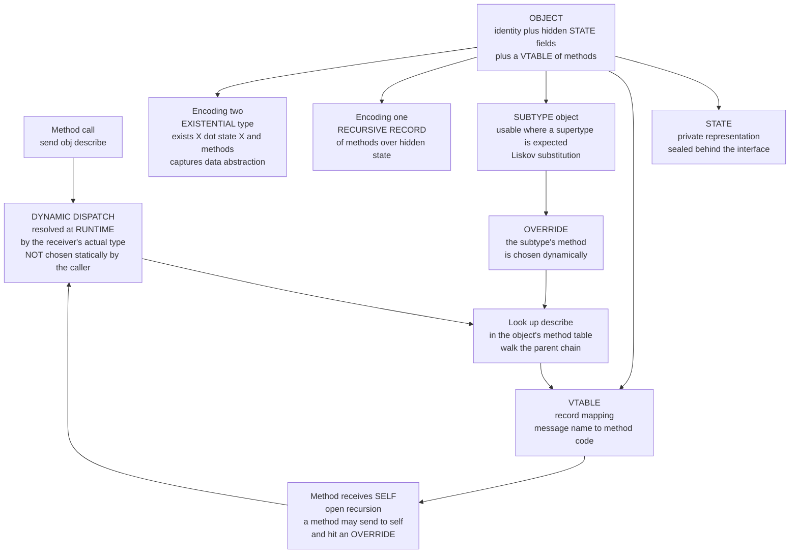

# 🧩 Object-Oriented Language Theory

> [!abstract] TL;DR
> Strip away the "four pillars" folklore and an **object** is a precise thing: a bundle of **hidden state** and a **method table** carrying its own **identity**, whose defining superpower is **dynamic dispatch** — when you send it a message, *the object itself*, not the caller, chooses which code runs, resolved at **runtime** by the receiver's actual type. Formally an object is either a **recursive record** of methods over private state or an **existential type** `∃X. (state: X, methods: …)` that captures *data abstraction*: clients cannot see the representation, so it can change freely. Everything else — classes, inheritance, prototypes — is machinery around dispatch. **Inheritance** (code reuse), **subtyping** (substitutability, governed by Liskov), and **subtype polymorphism** (dispatch) are three *distinct* ideas routinely conflated. The whole paradigm has a mathematical shadow, the **Expression Problem**: OO makes adding new *types* trivial and new *operations* painful, which is the exact mirror image of the functional/pattern-matching tradeoff — the deepest single fact about the OO-vs-FP divide.

---

## Intuition

**Analogy — an object is a tiny self-contained machine.** Picture a vending machine. From the outside you see only **buttons** (its methods) and a coin slot (its interface). You never reach inside to rewire it; the mechanism, the coin counter, the stock levels — its **state** — are sealed behind the panel. That sealing is **encapsulation**: you interact only through the buttons, so the owner can swap the entire internal mechanism for a better one and every user is unaffected.

Now the subtle, load-bearing part. When you press "dispense drink," *the machine decides for itself* what happens — a soda machine drops a can, a coffee machine grinds beans, a ticket machine prints a stub. You pressed the *same button name*; the *machine in front of you* chose the behavior. That last sentence — **"the object, not the caller, chooses which code runs, based on what the object actually is at that moment"** — is **dynamic dispatch** (a.k.a. *late binding*), and it is the theoretical heart of object orientation. Classes, inheritance, prototypes, and the rest are just different ways of *building and organizing* these button-machines. If you understand dispatch, you understand what an object fundamentally *is*.

---

## How It Works

### An object is state + a method table + identity

Formally, an object is a triple: (1) **state** — private fields holding its representation; (2) a **vtable** (*virtual method table*) — a record mapping each message name to the code that implements it; (3) an **identity** — a stable notion of "this same object" independent of its current field values (why `a == b` by identity differs from `a.equals(b)` by value). The state is reachable *only* through the vtable's methods; that inaccessibility is **encapsulation**, and it is not merely a convention — it is a semantic property (see below).

Two rigorous encodings pin down what "object" means:

- **Object as a recursive record of methods over hidden state.** An object is a record `{ area = …, describe = … }` whose methods can call *each other through the object itself* — the record refers to itself recursively. This "objects are records of functions closing over private state" view is exactly what closures give you, and it is why *objects and closures are inter-encodable* (a closure is an object with one method; an object is a bundle of closures over shared state). William Cook's "On Understanding Data Abstraction, Revisited" makes this the *defining* difference between an object and an abstract data type.
- **Object as an existential type** `∃X. (rep: X, ops: X → …)`. The representation type `X` is *hidden behind the existential quantifier*: a client can call the operations but can never name or inspect `X`. This is the type-theoretic account of **data abstraction** and connects objects directly to modules and ADTs — see the existential-types treatment in [[Polymorphism_and_System_F]].

### Dynamic dispatch — the theoretical heart

A method call `send(obj, "describe")` is **not** a static jump to a fixed address. It is a **lookup at call time**: find `"describe"` in the receiver's method table (walking up its class/prototype chain if needed), then run *that* code. The choice depends on the receiver's **runtime type**, not the static type the caller sees. Contrast a plain function call `f(x)` — there the target is fixed at compile time. Dispatch trades that static certainty for **open-ended extensibility**: new object kinds can answer old messages without any existing caller changing.

- **Vtables as the implementation.** In C++/Java each object header points at a per-class **vtable**, and a virtual call compiles to "load the vtable pointer, index a fixed slot, indirect-call." This is the concrete mechanism generated by compilers — see [[Code_Generation_and_Instruction_Selection]] for how virtual calls, interface dispatch, and devirtualization are lowered.
- **Single vs multiple dispatch.** Java/C++/Python dispatch on **one** receiver (single dispatch); the notorious "visitor pattern" is a workaround for its absence. **Multimethods** (CLOS, Julia, Clojure) dispatch on the runtime types of *several* arguments at once, dissolving many visitor gymnastics.

### Self / this and open recursion

The magic that makes overriding work is **open recursion**: every method receives `self` (a.k.a. `this`), and when a method calls another method *through self*, that inner call is *itself* dynamically dispatched. So a base-class `describe` that internally calls `self.name()` will pick up a subclass's overridden `name` — the base code "reaches down" into behavior it never knew about. Semantically, inheritance is **delayed self-binding**: a class body is a *function of self*, and constructing an object takes the **fixed point** to finally tie `self` to the completed object (the fixpoint view links straight to [[Combinatory_Logic_and_Fixed_Points]]). This is why calling an overridable method from a constructor is dangerous — `self` is not yet fully built.

### Inheritance ≠ subtyping ≠ polymorphism

Three ideas the folklore fuses:

- **Inheritance** is *code reuse*: a subclass borrows the parent's implementation.
- **Subtyping** is *substitutability*: `S <: T` means an `S` is usable wherever a `T` is expected, disciplined by the **Liskov Substitution Principle** — preconditions may only *weaken*, postconditions may only *strengthen*, invariants must be preserved. Subtyping can be **nominal** (declared by name, Java/C++) or **structural** (shape matches, Go/TypeScript). All of this is developed in depth in [[Subtyping_and_Variance]].
- **Subtype polymorphism** is *dispatch*: one call site, many runtime behaviors.

They are independent: private inheritance reuses code *without* a subtype relationship; structural subtyping gives substitutability *without* inheritance. Because inheritance welds a subclass to its parent's internals, it invites the **fragile base class problem** (a harmless-looking base change silently breaks subclasses) — hence "**prefer composition over inheritance**." Multiple inheritance adds the **diamond problem** (two parents share a grandparent — whose method wins?), tamed by **mixins/traits** and linearized method-resolution orders (Python's C3 MRO, Scala trait linearization).

### Classes vs prototypes vs objects-as-closures

- **Class-based** (Java, C++, C#): a **class** is a *factory plus a shared method table*; instances hold state and point at the class's vtable. **Metaclasses** make the class itself an object (Smalltalk, Python `type`).
- **Prototype-based** (JavaScript, Self): there are no classes — objects delegate to other **objects** along a *prototype chain*; "inheritance" is just delegation.
- **Objects-as-closures**: an object is literally a record of closures capturing shared private variables — the encoding our demo builds from scratch.

All three implement the *same* dispatch semantics; they differ only in how method tables are shared and built.

### The Expression Problem — OO and FP as duals

Wadler's framing: a program grows in **two dimensions** — new **data variants/types** and new **operations** over them. Ideally you extend both *without editing existing code* and *with static safety*.

- **OO** organizes code *by type* (each class gathers all its operations). Adding a **new type** is a clean new subclass — easy. Adding a **new operation** means adding a method to *every* existing class — hard, touches everything.
- **Functional / pattern-matching** organizes code *by operation* (each function pattern-matches over all variants). Adding a **new operation** is a clean new function — easy. Adding a **new variant** means editing *every* existing function — hard.

They are exact **transposes** of the same matrix. Named escape hatches — the **visitor pattern**, **type classes**, **tagless-final** encoding, **multimethods**, open data types — each buy back one axis at some cost. This duality is *the* precise statement of the OO-vs-FP tradeoff and ties into the encodings discussed in the not-yet-built PLT sibling `Functional_Programming_Foundations` and the proofs-as-programs view of [[The_Curry_Howard_Correspondence]].

### The object calculus and representation independence

Just as the **lambda calculus** ([[The_Lambda_Calculus]]) is the minimal theory of *functions*, **Abadi and Cardelli's ς-calculus** (the *object calculus*) is a minimal theory of *objects*: its primitives are objects with named methods, method *invocation*, and method *update* — a rigorous semantics for dispatch and mutation with no functions needed at all. Finally, **encapsulation** has a formal payoff called **representation independence**: because clients can only interact through the interface, two objects with *different* private representations but *identical* observable behavior are **contextually equivalent** — no program can tell them apart, so you may swap one for the other. This is a **parametricity** consequence of the existential encoding, and it is the theory behind "you can refactor internals freely" — developed in [[Contextual_Equivalence_and_Reasoning]].

### Flow / Architecture



---

## Key Concepts

**Secondary (explain to a curious beginner).**
- An **object** is a little sealed machine: hidden **state** inside, **buttons** (methods) outside. You only ever press buttons.
- **Dynamic dispatch**: press the same button on different machines and each does its own thing — *the machine chooses*, not you.
- **Inheritance** lets a new machine borrow another's buttons instead of rebuilding them.
- **Encapsulation** means the maker can rewire the insides and none of your button-presses break.

**Undergraduate (requires a CS background).**
- Object = **hidden state + method table (vtable) + identity**; a virtual call is a *runtime lookup*, not a static jump.
- **Self / open recursion**: methods take `self`; internal `self.m()` calls are re-dispatched, which is exactly why overrides take effect.
- **Inheritance vs subtyping vs subtype polymorphism** are three separate things: reuse, substitutability (Liskov: weaken preconditions, strengthen postconditions), and dispatch.
- **Single vs multiple dispatch**; the **visitor pattern** simulates a second dispatch axis in single-dispatch languages.
- **Classes vs prototypes**: a class is a *factory + shared vtable*; prototypes replace that with per-object delegation.

**Graduate (system-level and foundational thinking).**
- **Objects as existentials** `∃X. (rep: X, ops)` — the type-theoretic account of data abstraction; the difference from ADTs is *who* holds the representation (each object vs one module) per Cook.
- **Object calculus (ς-calculus)** — Abadi-Cardelli's foundational theory of method invocation and update, the object-world analogue of the lambda calculus.
- **Inheritance as a fixed point** — a class is a *generator* `λself. record`; the object is its fixpoint, making inheritance *delayed self-binding*.
- **Representation independence** — encapsulation as a **contextual-equivalence / parametricity** theorem: distinct private representations with equal behavior are indistinguishable.
- **The Expression Problem** — OO and FP are transposes on the (types × operations) matrix; visitors, type classes, tagless-final, and multimethods trade one axis for another.

---

## Python Demo

We build **objects and dynamic dispatch from scratch** using *no Python `class`* for the modeled objects — an object is just a **record (dict) holding a vtable and hidden state**, with a `send` closure that performs the lookup. We then get **inheritance via prototype delegation**, **method override chosen dynamically** (open recursion picks up the override), and a concrete demonstration of the **Expression Problem** (adding a *type* is easy; adding an *operation* forces edits to every type). Finally we visualize the object layout, the dispatch walk, and the (types × operations) matrix with matplotlib. Pure standard library plus matplotlib — numpy is not needed.

```python
# Modeling OBJECTS + DYNAMIC DISPATCH from scratch -- no Python `class` for our objects.
# An object == a record (dict) of a method table (vtable) + hidden state + a parent link.
import matplotlib.pyplot as plt
from matplotlib.patches import FancyArrowPatch

PI = 3.141592653589793

# ---------- THE OBJECT MODEL ----------
def make_object(vtable, state, parent=None):
    """Build an object: a vtable (message -> method), hidden state, optional prototype.
    Returns a dict carrying a `send` closure -- the ONLY way in (encapsulation)."""
    obj = {"vtable": vtable, "state": state, "parent": parent}
    def send(msg, *args):
        # DYNAMIC DISPATCH: search the receiver's chain for `msg` at CALL time.
        node = obj
        while node is not None:
            if msg in node["vtable"]:
                # pass the ORIGINAL receiver `obj` as self -> open recursion / late binding
                return node["vtable"][msg](obj, *args)
            node = node["parent"]
        raise AttributeError(f"object has no method {msg!r}")
    obj["send"] = send
    return obj

def send(obj, msg, *args):          # convenience: send a message to an object
    return obj["send"](msg, *args)

# ---------- METHOD TABLES (shared prototypes act as "classes") ----------
shape_vtable = {
    # `describe` calls `name` and `area` THROUGH self -> overrides are picked up dynamically
    "describe": lambda self: f"a {send(self,'name')} with area {send(self,'area'):.2f}",
    "name":     lambda self: "shape",
}
circle_vtable = {
    "name": lambda self: "circle",
    "area": lambda self: PI * self["state"]["r"] ** 2,
}
rectangle_vtable = {
    "name": lambda self: "rectangle",
    "area": lambda self: self["state"]["w"] * self["state"]["h"],
}

shape_proto     = make_object(shape_vtable, {})
circle_proto    = make_object(circle_vtable,    {}, parent=shape_proto)
rectangle_proto = make_object(rectangle_vtable, {}, parent=shape_proto)

# ---------- FACTORIES (leaves hold state; they delegate methods to a prototype) ----------
def circle(r):        return make_object({}, {"r": r},        parent=circle_proto)
def rectangle(w, h):  return make_object({}, {"w": w, "h": h}, parent=rectangle_proto)

def colored_circle(r, color):
    # a SUBTYPE that OVERRIDES `name`; everything else is inherited from circle_proto
    override = {"name": lambda self: f"{self['state']['color']} circle"}
    return make_object(override, {"r": r, "color": color}, parent=circle_proto)

# ---------- DEMO 1: dispatch, inheritance, and dynamic override ----------
print("=== dynamic dispatch + inheritance + override ===")
for obj, label in [(circle(2), "circle(2)"),
                   (rectangle(3, 4), "rectangle(3,4)"),
                   (colored_circle(2, "red"), "colored_circle(2,'red')")]:
    # `describe` lives on shape_proto but calls name/area on the ACTUAL receiver:
    print(f"  {label:26s} -> {send(obj, 'describe')}")
print("  NOTE: colored_circle overrides `name`; inherited `describe` picks it up via open recursion")

# ---------- DEMO 2: the EXPRESSION PROBLEM, made concrete ----------
# OO groups code BY TYPE. Adding a NEW TYPE = one new object (existing code untouched).
def triangle(b, h):                      # <-- add a whole new TYPE: EASY
    v = {"name": lambda self: "triangle",
         "area": lambda self: 0.5 * self["state"]["b"] * self["state"]["h"]}
    return make_object({}, {"b": b, "h": h}, parent=make_object(v, {}, parent=shape_proto))

print("\n=== Expression Problem: adding a TYPE is EASY ===")
print(f"  triangle(6,4) -> {send(triangle(6,4), 'describe')}   (added 1 object, edited nothing)")

# Adding a NEW OPERATION (perimeter) means editing EVERY type's vtable: HARD.
print("\n=== Expression Problem: adding an OPERATION is HARD ===")
edits = 0
for proto, fn in [(circle_proto,    lambda self: 2*PI*self["state"]["r"]),
                  (rectangle_proto, lambda self: 2*(self["state"]["w"]+self["state"]["h"]))]:
    proto["vtable"]["perimeter"] = fn    # must touch each existing type
    edits += 1
print(f"  had to edit {edits} existing method tables to add `perimeter` (and triangle still lacks it)")
print(f"  circle(2).perimeter    -> {send(circle(2), 'perimeter'):.2f}")
try:
    send(triangle(6, 4), "perimeter")    # forgot one type -> runtime failure
except AttributeError as e:
    print(f"  triangle.perimeter     -> MISSING: {e}")

# =====================================================================
# VISUALIZE: object layout, dispatch walk, and the expression-problem matrix
# =====================================================================
fig, (axA, axB, axC) = plt.subplots(1, 3, figsize=(19, 6.4))

# ---- Panel A: an object as vtable + state + parent chain ----
def box(ax, x, y, w, h, title, lines, fc):
    ax.add_patch(plt.Rectangle((x, y), w, h, fc=fc, ec="#333", lw=1.6, zorder=2))
    ax.text(x + w/2, y + h - 0.16, title, ha="center", va="top",
            fontweight="bold", fontsize=10, zorder=3)
    for i, ln in enumerate(lines):
        ax.text(x + 0.08, y + h - 0.42 - 0.26*i, ln, ha="left", va="top",
                fontsize=8.6, family="monospace", zorder=3)

box(axA, 0.1, 2.35, 2.6, 1.15, "colored_circle leaf",
    ["state: r=2, color=red", "vtable: name (OVERRIDE)"], "#F3D9D4")
box(axA, 0.1, 1.15, 2.6, 1.0, "circle_proto",
    ["vtable: name, area"], "#D4E3F3")
box(axA, 0.1, 0.05, 2.6, 0.9, "shape_proto",
    ["vtable: describe, name"], "#D9EEDD")
for y0, y1 in [(2.35, 2.15), (1.15, 0.95)]:
    axA.add_patch(FancyArrowPatch((1.4, y0), (1.4, y1),
                  arrowstyle="-|>", mutation_scale=16, color="#333", lw=1.6))
axA.text(1.55, 2.25, "parent", fontsize=8, style="italic")
axA.text(1.55, 1.05, "parent", fontsize=8, style="italic")
axA.set_title("An object = vtable + hidden state + prototype chain", fontsize=10.5)
axA.set_xlim(0, 2.9); axA.set_ylim(-0.1, 3.7); axA.axis("off")

# ---- Panel B: dispatch resolution for send(colored_circle, "describe") ----
steps = [
    ("send cc 'describe'", "leaf",         "miss", "#C44E52"),
    ("",                   "circle_proto", "miss", "#C44E52"),
    ("",                   "shape_proto",  "HIT describe", "#55A868"),
    ("  describe sends 'name'", "leaf",    "HIT name OVERRIDE", "#55A868"),
    ("  describe sends 'area'", "leaf",    "miss", "#C44E52"),
    ("",                   "circle_proto", "HIT area", "#55A868"),
]
axB.text(0.5, len(steps)+0.4, "Dispatch walk (top = start of lookup)",
         ha="center", fontweight="bold", fontsize=10)
for i, (call, where, result, color) in enumerate(steps):
    y = len(steps) - 1 - i
    if call:
        axB.text(0.02, y + 0.34, call, fontsize=8.4, family="monospace", color="#333")
    axB.add_patch(plt.Rectangle((0.05, y), 0.55, 0.34, fc="#EEE", ec="#999"))
    axB.text(0.32, y + 0.17, where, ha="center", va="center", fontsize=8.6)
    axB.text(0.66, y + 0.17, result, ha="left", va="center",
             fontsize=8.6, color=color, fontweight="bold")
axB.set_title("Dynamic dispatch: lookup resolved at RUNTIME", fontsize=10.5)
axB.set_xlim(0, 1.35); axB.set_ylim(-0.2, len(steps)+0.7); axB.axis("off")

# ---- Panel C: the expression-problem matrix (types x operations) ----
types = ["Circle", "Rectangle", "Triangle\n(NEW type)"]
ops   = ["area", "describe", "perimeter\n(NEW op)"]
nT, nO = len(types), len(ops)
for r in range(nT):
    for c in range(nO):
        new_type = (r == nT - 1)
        new_op   = (c == nO - 1)
        if new_type and new_op:  fc, txt = "#E8C56B", "?"
        elif new_type:           fc, txt = "#9BD3A6", "+"   # one new object: EASY
        elif new_op:             fc, txt = "#E39B9B", "edit" # must touch every type: HARD
        else:                    fc, txt = "#D8E2EE", "ok"
        axC.add_patch(plt.Rectangle((c, nT-1-r), 1, 1, fc=fc, ec="white", lw=3))
        axC.text(c+0.5, nT-1-r+0.5, txt, ha="center", va="center",
                 fontsize=11, fontweight="bold")
for c, op in enumerate(ops):
    axC.text(c+0.5, nT+0.12, op, ha="center", va="bottom", fontsize=9)
for r, t in enumerate(types):
    axC.text(-0.08, nT-1-r+0.5, t, ha="right", va="center", fontsize=9)
axC.text(nO/2, -0.55,
         "OO: new ROW (type) = 1 object EASY  |  new COLUMN (op) = edit every type HARD\n"
         "FP is the TRANSPOSE: new op easy, new type hard",
         ha="center", va="top", fontsize=8.6, style="italic")
axC.set_title("The Expression Problem  (types x operations)", fontsize=10.5)
axC.set_xlim(-1.0, nO+0.1); axC.set_ylim(-1.0, nT+0.7); axC.axis("off")

fig.suptitle("Object-Oriented Language Theory: objects as vtables, runtime dispatch, and the expression problem",
             fontsize=13)
fig.tight_layout()
plt.show()   # or: fig.savefig("oo_theory.png", dpi=120)
```

Running it prints the dispatch behavior and the two halves of the Expression Problem:

```
=== dynamic dispatch + inheritance + override ===
  circle(2)                  -> a circle with area 12.57
  rectangle(3,4)             -> a rectangle with area 12.00
  colored_circle(2,'red')    -> a red circle with area 12.57
  NOTE: colored_circle overrides `name`; inherited `describe` picks it up via open recursion

=== Expression Problem: adding a TYPE is EASY ===
  triangle(6,4) -> a triangle with area 12.00   (added 1 object, edited nothing)

=== Expression Problem: adding an OPERATION is HARD ===
  had to edit 2 existing method tables to add `perimeter` (and triangle still lacks it)
  circle(2).perimeter    -> 12.57
  triangle.perimeter     -> MISSING: object has no method 'perimeter'
```

The `colored_circle` line is the whole point of dispatch: `describe` was defined once on `shape_proto` and *never mentions colors*, yet it prints "a **red** circle" because its internal `send(self,'name')` re-dispatches on the actual receiver and hits the **override** — that is open recursion / late binding in action. The final block is the Expression Problem made physical: one new *type* (`triangle`) cost a single new object, but one new *operation* (`perimeter`) forced edits to every existing method table — and the type we forgot fails at runtime, exactly the fragility the matrix panel highlights.

---

## Real-World Applications

> **Java and C++ virtual calls compile to vtable lookups.** Every object with virtual methods carries a hidden pointer to its class's **vtable**; a call like `shape.area()` compiles to "load vtable pointer, index the fixed `area` slot, indirect-call." The JIT then tries to *devirtualize* monomorphic call sites back into direct calls and inline them. This is the everyday reality behind the theory — see [[Code_Generation_and_Instruction_Selection]].

- **Smalltalk / Objective-C / Ruby — messages, not calls.** Dispatch is a *runtime message send* through a method dictionary, with a `doesNotUnderstand` / `method_missing` hook when lookup fails — dispatch taken to its dynamic extreme, enabling proxies and metaprogramming.
- **Python's MRO and duck typing.** Attribute/method lookup walks the **C3-linearized** method resolution order, taming the multiple-inheritance diamond; "duck typing" is *ad hoc structural dispatch* at runtime. See [[Python_OOP]].
- **JavaScript prototypes.** No classes underneath at all — `class` syntax is sugar over **prototype-chain delegation**, precisely the model our demo builds.
- **Rust trait objects & Go interfaces.** `dyn Trait` and Go interfaces implement dispatch with an explicit **(data pointer, vtable pointer)** fat pointer — objects-as-existentials made concrete, without inheritance. Swift protocols with witness tables do the same; see [[Swift_Protocols_and_Extensions]] and [[Swift_Structs_and_Classes]].
- **Multimethods in CLOS and Julia.** Dispatch on *all* argument types at once makes Julia's numeric tower and the visitor-free extensibility of scientific code possible — a direct answer to the operation-adding half of the Expression Problem.
- **The visitor pattern in compilers and ASTs.** Tree-walkers use visitors precisely to add *operations* (type-check, optimize, emit) over a *fixed* node hierarchy — buying back the axis OO makes expensive.

---

## Common Pitfalls

- **Conflating inheritance with subtyping.** Extending a class for *reuse* silently claims *substitutability* you may not honor. Prefer composition/delegation; reserve inheritance for genuine "is-a" that satisfies Liskov. See [[Inheritance_and_Polymorphism]] and [[SOLID_Principles]].
- **Violating the Liskov Substitution Principle.** A `Square extends Rectangle` that overrides `setWidth` to also change height *strengthens preconditions* and breaks callers relying on the rectangle contract. Overrides may weaken preconditions and strengthen postconditions — never the reverse. Full treatment in [[Subtyping_and_Variance]].
- **Calling an overridable method from a constructor.** `self` is only half-built, so the override runs against uninitialized state — a classic source of NPEs. Open recursion is powerful *and* sharp.
- **The fragile base class problem.** A benign change to a base method silently alters subclasses that call it through `super`/self, because inheritance exposes internals. Deep hierarchies amplify it.
- **The diamond problem without a clear MRO.** Multiple inheritance where two parents share a grandparent has no obvious "which method wins" — rely on a *defined* linearization (C3, trait ordering) rather than intuition.
- **Assuming dispatch is free.** Virtual/interface calls block inlining and can go **megamorphic** (many receiver types at one site), stalling the CPU's indirect-branch predictor. In hot loops this is a real cost devirtualization only sometimes recovers.
- **Breaking `equals`/`hashCode` across a hierarchy.** Adding a field in a subclass and comparing with a superclass instance breaks symmetry/transitivity of equality — an identity-vs-value subtlety objects make easy to get wrong.

---

## Related Concepts

- [[Subtyping_and_Variance]] — the substitutability half of OO: `S <: T`, Liskov, nominal vs structural, and why mutation forces invariance.
- [[Type_Systems_Fundamentals]] — where objects, interfaces, and dispatch sit inside a type system; soundness as progress plus preservation.
- [[Polymorphism_and_System_F]] — the **existential-types** encoding of objects and ADTs (`∃X`), and the parametric-vs-subtype polymorphism distinction.
- [[Contextual_Equivalence_and_Reasoning]] — **representation independence**: why encapsulated objects with different internals are indistinguishable to any client.
- [[The_Lambda_Calculus]] — the theory of *functions* that the object calculus (ς-calculus) is the *object*-world analogue of; objects and closures are inter-encodable.
- [[Combinatory_Logic_and_Fixed_Points]] — inheritance as a **fixed point**: a class is a generator of self, the object is its fixpoint (delayed self-binding).
- [[The_Curry_Howard_Correspondence]] — the proofs-as-programs backdrop for the OO/FP encodings that resolve the Expression Problem.
- [[Programming_Language_Theory_Overview]] — the map of this vault; OO theory bridges the type-systems and semantics layers.
- [[Inheritance_and_Polymorphism]] — the concrete Java realization of dispatch, overriding, and `super`.
- [[SOLID_Principles]] — the design rules (especially the **L**iskov principle) that encode subtyping discipline for practitioners.
- [[Python_OOP]] — MRO/C3 linearization, duck typing, and dunder-driven dispatch in a real language.
- [[Kotlin_Classes_and_OOP]] — sealed classes, interfaces with defaults, and open-recursion semantics in a modern JVM language.
- [[Swift_Structs_and_Classes]] / [[Swift_Protocols_and_Extensions]] — value vs reference semantics and protocol-witness-table dispatch, an objects-as-existentials design.
- [[Code_Generation_and_Instruction_Selection]] — how a compiler lowers virtual and interface calls into vtable indexing and devirtualization.

*(PLT siblings referenced in prose but not yet built: `Functional_Programming_Foundations` — the FP dual of the Expression Problem; a dedicated `Object_Calculus` note.)*

---

## Review Questions

1. **(Secondary)** Using the vending-machine analogy, explain what *dynamic dispatch* is and why pressing the "same button" can produce different behavior on different machines. In one sentence, why does this make it easy to add new *kinds* of machine without changing the people who press the buttons?
2. **(Undergraduate)** A base class defines `describe()` which internally calls `this.name()`. A subclass overrides only `name()`. Explain, in terms of `self` and *open recursion*, why the inherited `describe()` prints the subclass's name — and why the same mechanism makes calling `describe()` from the base *constructor* dangerous. Then state the difference between *inheritance* and *subtyping* with one example where you have one without the other.
3. **(Graduate)** (a) Give the existential-type signature `∃X. (…)` of a "counter" object and explain what *representation independence* guarantees about swapping an `int` counter for a `list-length` counter. (b) State the Expression Problem precisely and explain why OO and functional/pattern-matching styles are *transposes* of the same (types × operations) matrix. (c) Pick one solution (visitor, type classes, tagless-final, or multimethods) and explain *which* axis it buys back and at what cost.

---

## Sources

- Martín Abadi and Luca Cardelli, *A Theory of Objects*, Springer, 1996 — the foundational object calculus (ς-calculus): objects, method invocation, and method update as primitives.
- William R. Cook, "On Understanding Data Abstraction, Revisited," *OOPSLA* 2009 — the definitive account of *objects vs abstract data types* and the recursive-record view of objects. [PDF](https://www.cs.utexas.edu/~wcook/Drafts/2009/essay.pdf)
- Philip Wadler, "The Expression Problem," email to the Java Genericity list, 1998 — the original framing of the two-dimensional extensibility dilemma. [Text](https://homepages.inf.ed.ac.uk/wadler/papers/expression/expression.txt)
- Luca Cardelli and Peter Wegner, "On Understanding Types, Data Abstraction, and Polymorphism," *ACM Computing Surveys*, 1985 — the canonical typology of polymorphism and the existential account of abstraction. [PDF](http://lucacardelli.name/Papers/OnUnderstanding.A4.pdf)
- Barbara Liskov and Jeannette Wing, "A Behavioral Notion of Subtyping," *ACM TOPLAS*, 1994 — the formal precondition/postcondition contract behind the Liskov Substitution Principle.
- Benjamin C. Pierce, *Types and Programming Languages* (TAPL), MIT Press, 2002 — Chs. 18–19 (imperative objects, Featherweight Java) formalize objects, dispatch, and subtyping.

---

#programming-language-theory #object-oriented #dynamic-dispatch #inheritance #expression-problem
