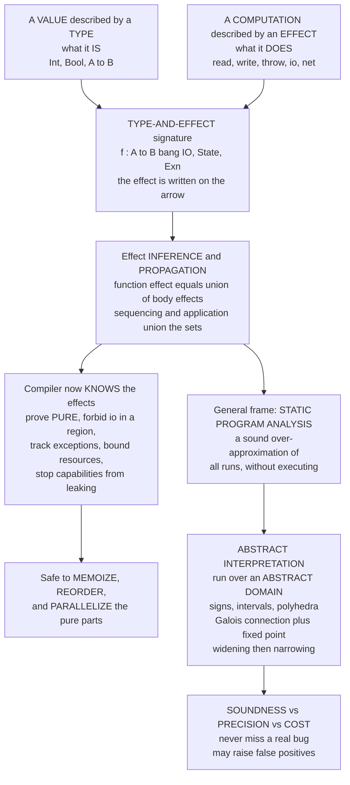

# 🏷️ Effect Systems and Program Analysis

> [!abstract] TL;DR
> An **effect system** extends a type system so a signature describes not only *what a computation returns* but *what it does on the side* — `A → B ! {IO, State, Exn}` reads "takes an `A`, yields a `B`, and *may* perform I/O, touch mutable state, and throw." Effects that were **invisible** (network calls, mutation, exceptions, allocation, nondeterminism) become **first-class annotations** the compiler infers, propagates through composition (a function's effect is the *union* of its body's effects), and **checks** against a policy: prove a function **pure** so it is safe to memoize / reorder / parallelize, forbid I/O in a "pure region," track exceptions in the type, or stop a capability from leaking. This is one instance of the broader discipline of **static program analysis** — soundly *approximating* a program's behavior without running it — whose unifying theory is **abstract interpretation** (Cousot & Cousot): execute the program over an **abstract domain** (signs, intervals, polyhedra) and compute an over-approximation by **fixed-point iteration**, trading **soundness, precision, and cost**. The modern successor to monads for structuring effects is **algebraic effects and handlers** (Koka, Eff, OCaml 5, Unison), and the frontier is "typed effects everywhere."

---

## Intuition

**Analogy — a nutrition label, not just a calorie count.** An ordinary type is a *calorie count*: it tells you the **magnitude of the result** — "this function returns an integer." Useful, but it hides everything about *how the food was made*. An **effect** is the full **ingredients-and-allergens label**: it lists every side the computation touches on the way to that integer — *contains: file reads; may throw; performs network I/O; mutates shared state*. Two functions can have the *identical* type `String → Int` and yet one is a harmless word-counter while the other secretly phones a remote server, deletes a file, and might crash. The calorie count cannot tell them apart. The nutrition label can.

An **effect system** stamps that label directly onto the function's type, so the compiler — not a code reviewer squinting at the body — can see "this innocent-looking `String → Int` *secretly does network I/O*" and **enforce rules** about it: refuse to call it inside a region you declared network-free, refuse to cache it as if it were pure, refuse to run it on a thread that must not block. Making the invisible visible in the type is the whole game. And effect checking turns out to be one worked example of a much larger idea — **static program analysis** — where a tool reasons about *all possible runs* of a program from the text alone, over-approximating what could happen so it can *prove* what could never happen.

---

## How It Works

### 1. From types of *values* to types of *computations*

A plain typing judgment says `Γ ⊢ e : B` — "`e` has type `B`." An **effect system** enriches the judgment with a third component, an **effect** `φ` drawn from a lattice of effect sets:

```text
        Γ ⊢ e : B ! φ         "e has type B and may perform effects φ"
```

Effects are a **set** ordered by inclusion, so the effect lattice has **bottom = ∅ = pure** and **join = union**. A *function* type absorbs the effect of its **body** as a **latent effect** written on the arrow:

```text
        f : A --{read, io}--> B          calling f may read files and do I/O
```

The type-and-effect **inference rules** are the ordinary typing rules threaded with effect bookkeeping. The load-bearing ones:

- **Primitive op** — each built-in is annotated with its intrinsic effect: `print : String --{io}--> Unit`, `readFile : Path --{read}--> String`, `throw : E --{exn}--> A`.
- **Sequencing / application** — effects **accumulate by union**: if `e1 : _ ! φ1` and `e2 : _ ! φ2`, then `e1; e2 : _ ! φ1 ∪ φ2`. Composition never *loses* an effect; it only merges.
- **Abstraction** — a lambda is *pure to build* but records its body's effect as latent: if `x:A ⊢ body : B ! φ`, then `λx. body : A --φ--> B ! ∅`. The effect fires only when the function is **called** (`App` unions in the arrow's latent φ).
- **Subeffecting** — a computation with effect `φ` may be used where any larger `φ' ⊇ φ` is expected (an effect analogue of subtyping / [[Subtyping_and_Variance]]).

Because inference computes the *least* effect set consistent with the rules, the compiler can **discharge purity**: if the inferred φ is `∅`, the function is provably side-effect-free.

### 2. The classic type-and-effect systems, and regions

The idea is **Gifford & Lucassen** (1986) and its type-inference form **Talpin & Jouvelot** (the *type-and-effect discipline*, 1992–94): infer and propagate effect **sets** through the whole program the way Hindley–Milner infers types (see [[Type_Inference_and_Unification]]). **Region-and-effect systems** add a second axis — *where* an effect happens. **Tofte & Talpin's** region system tags every allocation and access with a **region** variable and infers the effect "allocates in / reads from region ρ," which lets a compiler **stack-allocate and free whole regions** with *no garbage collector*. This is the ancestor of **Cyclone** and a conceptual sibling of Rust's lifetimes *(theory sibling, not yet in this vault: `Memory_and_Ownership_Models`)*.

### 3. What effect tracking *buys* you

Once effects are in the type, the compiler can **prove and enforce**:

- **Purity for optimization** — a provably pure function is safe to **memoize, reorder, common-subexpression-eliminate, and parallelize** (exactly the [[Functional_Programming_Foundations|referential-transparency]] payoff, now *checked* rather than assumed).
- **Regions / capabilities** — "**no I/O in this block**," "**no network** below this boundary," "this handler may not `throw`." A violation is a *type error*, not a production incident.
- **Checked exceptions done right** — the set of exceptions a function may raise becomes an inferred part of its type, avoiding Java's boilerplate while keeping the guarantee.
- **Resource bounds & capability safety** — pass the *right* to perform an effect as a **value** (an object-capability); ambient authority cannot be exercised without holding the token, so effects cannot silently leak.

### 4. Algebraic effects and handlers — the modern successor to monads

**Monads** and **effect systems** are two takes on the same problem: *how to type effects*. A monad structures the effect **in the term** (you `bind`/`>>=` through `IO`); an effect system annotates it **on the type**. Monads compose badly — stacking `StateT (ReaderT (ExceptT ...))` (monad transformers) is notoriously rigid. **Algebraic effects and handlers** (Plotkin & Pretnar) fix this: you **declare effect operations abstractly** (`Get : Unit → S`, `Raise : E → Void`) and give **handlers** that *interpret* them, like resumable exceptions. The effect system **infers which operations a function uses**; handlers compose freely where transformers do not. This is a live research-to-practice movement: **Koka**, **Eff**, **Effekt**, **OCaml 5's effect handlers** (the engine behind its new concurrency), and **Unison's abilities**. `async/await` is, in this light, *just one effect* — and the frontier is making *all* effects this first-class and inferable *(deeper treatment lives in the not-yet-written `Monads_and_Effects` sibling)*.

### 5. The general frame — static analysis and abstract interpretation

Effect analysis is one **static program analysis**: an algorithm that computes a **sound over-approximation** of program behavior *without running* the program. Its compiler-side cousins are the **dataflow analyses** of [[Control_Flow_and_Data_Flow_Analysis]] (reaching definitions, live variables, available expressions). The **unifying theory** is **abstract interpretation** (Cousot & Cousot, 1977): instead of executing over *concrete* values, execute over an **abstract domain** (signs `{−,0,+}`; intervals `[lo,hi]`; convex polyhedra) connected to the concrete world by a **Galois connection** (`α` abstracts, `γ` concretizes), and solve for a **fixed point** by iteration. Because loops can iterate unboundedly, ascending chains are accelerated by **widening** (`∇`, jump up to a safe over-approximation) and recovered by **narrowing** (tighten back down). The result is the **soundness–precision–cost triangle**: a *sound* analysis **never misses a real bug** but may raise **false positives**; you spend precision (and CPU) to shrink the noise. This is the machinery inside **Astrée**, which *proved the absence of runtime errors* in Airbus flight-control code. The lattice-and-fixed-point substrate is [[Domain_Theory_and_Fixed_Points]].

### 6. The soundness spectrum, and cousin analyses

- **Sound (verification)** — never miss a bug; accept false positives (Astrée, effect checkers, type checkers, [[Formal_Semantics_and_Verified_Compilers|verified compilers]]).
- **Unsound (bug-finding)** — deliberately *miss* some bugs to keep noise low and adoption high (linters, Coverity-style tools, most industrial [[SAST_Static_Analysis|SAST]]).
- **Cousin analyses** built on the same theory: **taint analysis** (does untrusted input reach a sink?), **information-flow types** for non-interference / confidentiality (JIF, FlowCaml), **points-to / alias** analysis, and **termination** analysis.

### Flow / Architecture



---

## Key Concepts

### Secondary (explain to a curious beginner)
- A **type** says *what a function returns*; an **effect** says *what it does on the side* — reads a file, sends data over the network, might crash, changes a shared value.
- An **effect system** puts that "ingredients label" into the type, so the tool can catch "this supposedly harmless function secretly uses the network" **before** the program runs.
- If a function is proven to have **no effects (pure)**, the computer can safely cache its answer or run many copies at once — same input, same output, no surprises.

### Undergraduate (requires a CS background)
- The judgment `Γ ⊢ e : B ! φ`; effects form a **lattice of sets** with **bottom = pure** and **join = union**; **latent effects** ride on the function arrow and fire on **application**.
- **Effect inference and propagation** (Gifford–Lucassen, Talpin–Jouvelot): a composite expression's effect is the union of its parts; **subeffecting** lets a smaller effect stand where a larger one is allowed.
- **Enforcement**: reject a `PURE`-declared function that actually performs I/O; forbid a banned effect inside a **region / capability boundary**.
- **Static analysis** = sound approximation without execution; **dataflow analysis** and **effect analysis** are instances; **soundness** means *no missed bugs* at the price of *false positives*.

### Graduate (system-level / foundational thinking)
- **Abstract interpretation** as the unifying theory: a **Galois connection** `(α, γ)` between the concrete power-set lattice and an abstract domain; the abstract transfer functions are the **best sound approximations**; solutions are **fixed points** computed by **Kleene iteration** accelerated with **widening ∇** and refined by **narrowing △** (see [[Domain_Theory_and_Fixed_Points]]).
- **Algebraic effects and handlers** vs **monad transformers**: free composition, resumable operations, effect **rows**; the effect system infers the row of operations a term uses (Koka's row polymorphism, OCaml 5's untyped-then-typed handlers).
- **Region-and-effect** systems and **object-capability** effects: effects indexed by *where* and gated by *authority tokens*; the bridge to substructural / [[Linear_Logic_and_Resource_Types|linear]] typing and to Rust-style ownership.
- The **soundness spectrum**: sound verifiers (Astrée) vs deliberately unsound bug-finders; **information-flow** types and **non-interference** as effect systems for confidentiality; taint as reachability in a value-flow graph.

---

## Python Demo

Two analyses, both built from scratch, both pure standard library plus matplotlib.

**Part A — an effect-tracking type checker.** We annotate primitive operations with their effects (`read`, `write`, `throw`, `io`, `net`), then **infer and propagate** the effect *set* of a composite expression through the typing rules (a function's effect is the **union** of its body's effects). We then **enforce a policy** and catch two violations: a function declared **PURE** that actually performs I/O, and a **"no-network" capability region** that calls a network op.

**Part B — a tiny abstract interpretation.** We run **interval analysis** on the loop `x = 0; while x < 100: x = x + 1`, computing the abstract value of `x` by **fixed-point iteration**, and contrast plain iteration (precise but slow, ~101 steps) with **widening + narrowing** (jumps to `[0, +∞]` in a few steps, then recovers `[0, 100]`) — the soundness–precision–cost tradeoff made concrete.

```python
# ======================================================================
# EFFECT SYSTEM + ABSTRACT INTERPRETATION, from scratch.
#   A. An EFFECT-TRACKING checker: annotate primitive ops with effects,
#      INFER/PROPAGATE the effect SET of composite expressions (function
#      effect = UNION of body effects), then ENFORCE a policy and CATCH
#      (1) a PURE function that secretly does I/O and
#      (2) a "no-network" REGION that calls a network op.
#   B. A tiny ABSTRACT INTERPRETATION: interval analysis of a loop by
#      FIXED-POINT iteration, plain vs WIDENING+NARROWING.
#   Visualize both with matplotlib. Pure stdlib + matplotlib (no numpy).
# ======================================================================
from dataclasses import dataclass
import matplotlib.pyplot as plt

# ================= PART A : EFFECT SYSTEM =================
ALL_FX = ["read", "write", "throw", "io", "net"]     # the effects we track

# Every PRIMITIVE operation is annotated with the effect it performs.
PRIM_FX = {
    "add": frozenset(), "sub": frozenset(), "mul": frozenset(),
    "lt": frozenset(),  "eq": frozenset(),           # pure arithmetic / compare
    "read_file":  frozenset({"read"}),
    "write_file": frozenset({"write"}),
    "print":      frozenset({"io"}),
    "throw":      frozenset({"throw"}),
    "http_get":   frozenset({"net"}),
}

# ---- expression AST ----
@dataclass(frozen=True)
class Const:  v: int
@dataclass(frozen=True)
class Var:    name: str
@dataclass(frozen=True)
class Prim:   op: str; args: tuple = ()               # a primitive op carries an effect
@dataclass(frozen=True)
class Do:     steps: tuple                            # sequence: effects UNION
@dataclass(frozen=True)
class If:     c: object; t: object; e: object
@dataclass(frozen=True)
class Call:   fn: str; args: tuple = ()               # call pulls callee's LATENT effect
@dataclass(frozen=True)
class Region: forbid: frozenset; body: object         # capability boundary

@dataclass
class FnDef:
    declared: frozenset          # the effect the programmer PROMISED (the contract)
    body: object

class RegionLeak(Exception):
    pass

# ---- EFFECT INFERENCE: propagate the effect SET through the typing rules ----
def infer(e, fns, violations):
    if isinstance(e, (Const, Var)):                  # values are pure
        return frozenset()
    if isinstance(e, Prim):                          # op effect UNION arg effects
        fx = set(PRIM_FX[e.op])
        for a in e.args:
            fx |= infer(a, fns, violations)
        return frozenset(fx)
    if isinstance(e, Do):                            # sequence: UNION of steps
        fx = set()
        for s in e.steps:
            fx |= infer(s, fns, violations)
        return frozenset(fx)
    if isinstance(e, If):
        return (infer(e.c, fns, violations)
                | infer(e.t, fns, violations)
                | infer(e.e, fns, violations))
    if isinstance(e, Call):                          # LATENT effect of the callee (its arrow)
        fx = set(fns[e.fn].declared)
        for a in e.args:
            fx |= infer(a, fns, violations)
        return frozenset(fx)
    if isinstance(e, Region):                        # enforce the capability boundary
        body_fx = infer(e.body, fns, violations)
        leaked = e.forbid & body_fx
        if leaked:
            banned = "/".join(sorted(e.forbid))
            violations.append(f"REGION  no-[{banned}] region LEAKS {set(leaked)}")
        return body_fx
    raise ValueError(e)

# ---- POLICY CHECK: inferred effect must be within the DECLARED effect ----
def check_program(fns):
    violations, inferred = [], {}
    for name, fn in fns.items():
        fx = infer(fn.body, fns, violations)
        inferred[name] = fx
        excess = fx - fn.declared
        if excess:
            tag = "PURE" if not fn.declared else "/".join(sorted(fn.declared))
            violations.append(
                f"FN      {name} declared [{tag}] but performs {set(fx) or '{}'}"
                f"  ->  ILLEGAL effect {set(excess)}")
    return inferred, violations

# ---- the program under analysis ----
fns = {
    # pure: adds its argument to a constant -> inferred {} matches declared PURE
    "compute": FnDef(
        declared=frozenset(),
        body=Prim("add", (Var("x"), Const(1)))),

    # DECLARED PURE, but sequences a print -> inferred {io}  => VIOLATION
    "logged_compute": FnDef(
        declared=frozenset(),
        body=Do((Prim("print", (Var("x"),)),
                 Prim("add", (Var("x"), Const(1)))))),

    # honestly declares {net}: fetches a url -> inferred {net} matches
    "fetch": FnDef(
        declared=frozenset({"net"}),
        body=Prim("http_get", (Var("url"),))),

    # a no-network region that only prints -> OK (io is allowed, net is not present)
    "safe_block": FnDef(
        declared=frozenset({"io"}),
        body=Region(frozenset({"net"}),
                    Prim("print", (Const(42),)))),

    # a no-network region that CALLS fetch -> net leaks across the boundary => VIOLATION
    "bad_block": FnDef(
        declared=frozenset({"net"}),
        body=Region(frozenset({"net"}),
                    Call("fetch", (Var("url"),)))),
}

inferred, violations = check_program(fns)

print("=== EFFECT INFERENCE (function effect = union of body effects) ===")
for name, fx in inferred.items():
    print(f"  {name:<16} inferred effect = {set(fx) or '{}  (PURE)'}")

print("\n=== POLICY VIOLATIONS CAUGHT BY THE EFFECT CHECKER ===")
for v in violations:
    print("  [REJECT]", v)

# ================= PART B : ABSTRACT INTERPRETATION =================
# Interval analysis of:   x = 0;  while x < 100:  x = x + 1
# Abstract state of x is an interval [lo, hi]; bottom = None.
NEG, POS = float("-inf"), float("inf")

def join(a, b):                      # least upper bound of two intervals
    if a is None: return b
    if b is None: return a
    return (min(a[0], b[0]), max(a[1], b[1]))

def guard_lt(iv, k):                 # assume  x < k   =>   x <= k-1
    if iv is None: return None
    lo, hi = iv[0], min(iv[1], k - 1)
    return (lo, hi) if lo <= hi else None

def incr(iv):                        # x = x + 1
    return None if iv is None else (iv[0] + 1, iv[1] + 1)

def widen(old, new):                 # unstable bounds jump to infinity
    if old is None: return new
    lo = old[0] if new[0] >= old[0] else NEG
    hi = old[1] if new[1] <= old[1] else POS
    return (lo, hi)

def narrow(old, new):                # replace infinities using the transfer function
    lo = new[0] if old[0] == NEG else old[0]
    hi = new[1] if old[1] == POS else old[1]
    return (lo, hi)

ENTRY = (0, 0)                        # x = 0 before the loop

def ascend(use_widening):
    head, trace = None, []
    for _ in range(500):
        body_out = incr(guard_lt(head, 100))         # one pass through the loop body
        cand = join(ENTRY, body_out)                 # merge with the entry state
        if use_widening and head is not None:
            cand = widen(head, cand)
        trace.append(cand)
        if cand == head:
            break
        head = cand
    return trace, head

def descend(head):                    # NARROWING pass to recover precision
    trace = []
    for _ in range(500):
        cand = narrow(head, join(ENTRY, incr(guard_lt(head, 100))))
        trace.append(cand)
        if cand == head:
            break
        head = cand
    return trace, head

plain_tr, plain_fix = ascend(False)
wide_tr,  wide_fix  = ascend(True)
narrow_tr, final_fix = descend(wide_fix)

print("\n=== ABSTRACT INTERPRETATION : interval of x at the loop head ===")
print(f"  plain fixed point         : {plain_fix}   in {len(plain_tr)} iterations")
print(f"  widening fixed point      : {wide_fix}   in {len(wide_tr)} iterations "
      f"(sound but IMPRECISE)")
print(f"  after narrowing           : {final_fix}   in {len(narrow_tr)} more iterations "
      f"(precision recovered)")

# ================= VISUALIZE =================
fig, (axA, axB) = plt.subplots(1, 2, figsize=(14, 5.6))

# --- Panel A: effect grid (rows = functions, cols = effects) ---
order = list(fns.keys())
for yi, name in enumerate(order):
    fx, decl = inferred[name], fns[name].declared
    for xi, k in enumerate(ALL_FX):
        if k in fx:
            ok = k in decl
            axA.scatter(xi, yi, s=620, marker="s", zorder=3,
                        color=("#55A868" if ok else "#C44E52"),
                        edgecolor="black", linewidth=1.2)
            if not ok:
                axA.text(xi, yi, "X", ha="center", va="center",
                         color="white", fontweight="bold", zorder=4)
axA.set_xticks(range(len(ALL_FX))); axA.set_xticklabels(ALL_FX)
axA.set_yticks(range(len(order)));  axA.set_yticklabels(order)
axA.set_xlim(-0.5, len(ALL_FX) - 0.5); axA.set_ylim(-0.5, len(order) - 0.5)
axA.set_title("Effect propagation and policy check\n"
              "green = within declared effect,  red X = ILLEGAL (undeclared) effect")
axA.set_xlabel("effect performed"); axA.grid(True, ls=":", alpha=0.4)

# --- Panel B: interval upper bound per iteration, plain vs widen+narrow ---
CAP = 130
def ub(trace):
    return [0 if iv is None else min(iv[1], CAP) for iv in trace]

axB.plot(range(len(plain_tr)), ub(plain_tr), color="#4C72B0", lw=2,
         label=f"plain Kleene iteration ({len(plain_tr)} steps -> [0,100])")
wide_x = list(range(len(wide_tr)))
narrow_x = list(range(len(wide_tr) - 1, len(wide_tr) - 1 + len(narrow_tr)))
axB.plot(wide_x, ub(wide_tr), color="#C44E52", lw=2, marker="o",
         label="widening (jumps to +inf, few steps)")
axB.plot(narrow_x, ub(narrow_tr), color="#DD8452", lw=2, marker="s", ls="--",
         label="narrowing (recovers [0,100])")
axB.axhline(100, color="0.5", ls=":", lw=1)
axB.text(len(plain_tr) * 0.55, 103, "true bound x <= 100", color="0.4", fontsize=9)
axB.axhline(CAP, color="#C44E52", ls=":", lw=1)
axB.text(1, CAP - 8, "+infinity (widened, sound but imprecise)",
         color="#C44E52", fontsize=9)
axB.set_title("Abstract interpretation: fixed point of an interval analysis\n"
              "soundness vs precision vs cost")
axB.set_xlabel("iteration"); axB.set_ylabel("upper bound inferred for x")
axB.legend(loc="center right", fontsize=8)

fig.suptitle("Effect systems label what a computation DOES; "
             "abstract interpretation approximates what it COULD do", fontsize=12)
fig.tight_layout()
plt.savefig("effect_systems_and_program_analysis.png", dpi=130)
print("\nSaved figure to effect_systems_and_program_analysis.png")
```

Running it prints the **inferred effect set** of every function (the union propagated up each body), then the two policy violations the checker catches — `logged_compute` declared `PURE` but performing `{io}`, and `bad_block`'s **no-network region** leaking `{net}` because it calls `fetch`. Part B reports that the **plain** interval fixed point needs ~101 iterations to climb to `[0, 100]`, while **widening** reaches a sound post-fixed-point `[0, +∞]` in a handful of steps and **narrowing** recovers the precise `[0, 100]` — a direct picture of the soundness–precision–cost tradeoff. The saved figure shows the effect grid (green cells inside the declared effect, red `X` for illegal ones) beside the interval-bound trajectories.

---

## Real-World Applications

> **Example — OCaml 5's effect handlers power its concurrency, and Koka infers effect rows.** OCaml 5 (2022) shipped **algebraic effect handlers** as the core mechanism for its new multicore scheduler: fibers `perform` an effect (like yielding), and the scheduler is a **handler** that decides how to *resume* them — cooperative concurrency built from a language-level effect primitive rather than a bespoke runtime. **Koka** and **Eff** go further and put the **effect row** *in the type* and **infer** it, so `String -> Int` and `String -> <console|net> Int` are distinct, checked types. This is the "typed effects everywhere" frontier moving into production.

- **Astrée — sound static analysis in safety-critical avionics.** Astrée is an **abstract interpreter** that *proved the absence of runtime errors* (no overflow, no division by zero, no out-of-bounds) in the primary flight-control software of the **Airbus A340/A380** — millions of lines, **zero false alarms** on the target code, by carefully engineered abstract domains (intervals, octagons, and specialized filters). The textbook demonstration that sound analysis scales to real safety cases.
- **Rust's ownership and Cyclone's regions.** Region-and-effect systems (Tofte–Talpin) are the intellectual ancestors of **Cyclone**'s regions and, via lifetimes, of **Rust**'s borrow checker — effects about *where* memory is allocated and accessed, checked at compile time with no GC *(theory sibling: `Memory_and_Ownership_Models`)*.
- **Effect tracking in mainstream type systems.** Java's **checked exceptions** are a (clumsy) exception-effect system; **Scala 3** is adding **capabilities** and a *captured-references* effect discipline; **Haskell** encodes effects as monads and, increasingly, as effect libraries (`polysemy`, `effectful`). `async`/`await` in Rust, C#, JavaScript, and Python is, formally, **a single effect** surfaced in the type.
- **Security analyses on the same foundation.** **Taint analysis** in industrial [[SAST_Static_Analysis|SAST]] tools (CodeQL, Coverity, Semgrep) tracks untrusted-input flow to dangerous sinks; **information-flow** type systems (JIF, FlowCaml) enforce non-interference for confidentiality. Both are effect/flow analyses in the abstract-interpretation family.

---

## Common Pitfalls

- **Confusing an effect *type* with an effect *value*.** An effect annotation `!{io}` is a **static claim** the checker verifies; it does not *perform* the effect. Beginners read `A --{io}--> B` as "this runs I/O now" — it means "this *may* run I/O *when called*," a latent property of the arrow.
- **Effect leakage through higher-order functions.** A combinator like `map : (A --φ--> B) -> List A --φ--> List B` must **propagate the callback's effect φ**. Forgetting the *effect-polymorphism* variable makes `map` falsely appear pure while running an effectful callback — the single most common soundness hole in hand-rolled effect systems.
- **Treating "sound" and "no false positives" as compatible.** They are not, in general (Rice's theorem). A **sound** analysis (verifier) *must* over-approximate and will flag safe programs; a **complete** bug-finder must miss some real bugs. Demanding both from one tool is demanding the impossible — pick your point on the spectrum deliberately.
- **Fixed-point iteration that never terminates (no widening).** On an infinite-height domain like **intervals**, naive Kleene iteration over a loop can ascend forever (or take astronomically long, as the ~101-step plain run hints). You **must** apply **widening** to force termination, then optionally **narrow** to regain precision — skipping widening is the classic analyzer bug.
- **Over-precise domains that don't scale.** Convex **polyhedra** are far more precise than intervals but **exponential** in the number of variables. Choosing a domain is choosing a point in the precision–cost plane; the right answer is usually the *coarsest domain that still proves your property* (octagons before polyhedra).
- **Monad-transformer rigidity mistaken for a law of nature.** Deeply stacked transformers (`StateT (ExceptT (ReaderT ...))`) compose awkwardly and lock in an ordering. That is a limitation of *that encoding*, not of typed effects — **algebraic effects and handlers** compose the same effects freely. Reach for handlers before hand-threading a five-deep stack.
- **Assuming an effect system makes a program *correct*.** Like any type discipline (see [[Type_Systems_Fundamentals]]), it rules out the *categories of misbehavior it tracks* — undeclared I/O, escaped capabilities, uncaught exceptions — not logic bugs. A provably pure function can still compute the wrong number.

---

## Related Concepts

- [[Type_Systems_Fundamentals]] — the base discipline effect systems extend; an effect system is a type system whose judgments also carry `! φ`, checked by the same progress/preservation machinery.
- [[Functional_Programming_Foundations]] — the pure-core / effectful-shell discipline; effect systems *check* the purity that FP assumes, and quarantine effects the way monads do.
- [[Domain_Theory_and_Fixed_Points]] — the lattice-and-least-fixed-point substrate under abstract interpretation; Galois connections, ascending chains, widening, and narrowing all live here.
- [[Control_Flow_and_Data_Flow_Analysis]] — the compiler-side dataflow analyses (reaching definitions, live variables) that are the classic instances of the static-analysis family effect analysis belongs to.
- [[Formal_Semantics_and_Verified_Compilers]] — the sound end of the analysis spectrum: machine-checked semantics and proofs (CompCert, Astrée) where "never miss a bug" is a theorem.
- [[Type_Inference_and_Unification]] — effect **inference** reconstructs effect sets much as Hindley–Milner reconstructs types; effect-polymorphic combinators need effect variables solved by constraint solving.
- [[Linear_Logic_and_Resource_Types]] — substructural typing behind capability and region systems; effects that must be *used exactly once* or *not leaked* are linear-logic phenomena.
- [[Dependent_Types_and_Advanced_Type_Systems]] — the expressiveness ceiling where effects, resources, and specifications merge; effect systems are a decidable slice of what dependent types can state.
- [[Subtyping_and_Variance]] — **subeffecting** (a smaller effect where a larger one is allowed) is the effect analogue of subtyping.
- [[Axiomatic_Semantics_and_Hoare_Logic]] — the program-verification cousin; abstract interpretation computes the invariants Hoare logic would otherwise ask you to supply.
- [[Type_Checking_and_Type_Systems]] — the Compilers-side implementation of the checker that an effect system extends.
- [[SAST_Static_Analysis]] — the industrial, often *unsound* end of static analysis: taint tracking and linters that trade soundness for low noise.
- [[Formal_Semantics_and_Verified_Compilers]] — verified toolchains that inherit soundness from a proof rather than testing.
- [[The_Future_of_Compilers]] — the trajectory toward richer static guarantees and inferable effects baked into compilers.
- [[Programming_Language_Theory_Overview]] — the parent map; effect systems and analysis are where types, semantics, and verification converge.

*(PLT siblings referenced in prose but not yet built: `Monads_and_Effects`, `Memory_and_Ownership_Models`, `Verified_and_Certified_Languages`, `The_Future_of_Programming_Languages`.)*

---

## Review Questions

1. **(Secondary)** Two functions both have the type `String → Int`. One counts the words in its argument; the other silently sends the string to a remote server and might crash. Using the *nutrition-label* analogy, explain what an **effect system** would add to their signatures so a compiler could tell them apart, and give one concrete thing the compiler could then *refuse to do* with the second function that it would happily allow for the first.
2. **(Undergraduate)** In the demo, `logged_compute` is declared `PURE` yet the checker rejects it, and `bad_block`'s no-network region is rejected while `safe_block`'s is accepted. For each rejection, state precisely (a) how the effect *set* was computed by propagation up the AST and (b) which policy the inferred set violated. Then explain why a `map` combinator over an effectful callback must be **effect-polymorphic**, and what unsoundness results if its effect variable is dropped.
3. **(Graduate)** Interval analysis of `x = 0; while x < 100: x = x + 1` takes ~101 plain Kleene steps but only a handful with widening — which yields the *imprecise but sound* `[0, +∞]`, later narrowed to `[0, 100]`. (a) Explain, in terms of a **Galois connection** and **ascending chains** on an infinite-height lattice, *why* widening is necessary for termination and *why* it costs precision. (b) Relate this to the **soundness–precision–cost** triangle and to the difference between a sound verifier (Astrée) and an unsound bug-finder. (c) Argue why an effect checker and an interval analyzer are *the same kind of object* under abstract interpretation, differing only in their abstract domain.

---

## Sources

- P. Cousot and R. Cousot, "Abstract Interpretation: A Unified Lattice Model for Static Analysis of Programs by Construction or Approximation of Fixpoints," *POPL '77*, 238–252 — the founding paper of abstract interpretation. [https://doi.org/10.1145/512950.512973](https://doi.org/10.1145/512950.512973)
- D. K. Gifford and J. M. Lucassen, "Integrating Functional and Imperative Programming," *LFP '86*, 28–38 — the original type-and-effect system. [https://doi.org/10.1145/319838.319848](https://doi.org/10.1145/319838.319848)
- J.-P. Talpin and P. Jouvelot, "The Type and Effect Discipline," *Information and Computation* 111(2), 1994, 245–296 — effect inference as an extension of Hindley–Milner. [https://doi.org/10.1006/inco.1994.1046](https://doi.org/10.1006/inco.1994.1046)
- M. Tofte and J.-P. Talpin, "Region-Based Memory Management," *Information and Computation* 132(2), 1997, 109–176 — region-and-effect systems for GC-free allocation. [https://doi.org/10.1006/inco.1996.2613](https://doi.org/10.1006/inco.1996.2613)
- G. Plotkin and M. Pretnar, "Handlers of Algebraic Effects," *ESOP '09*, LNCS 5502, 80–94 — the foundation of algebraic effects and handlers. [https://doi.org/10.1007/978-3-642-00590-9_7](https://doi.org/10.1007/978-3-642-00590-9_7)
- B. Blanchet, P. Cousot, R. Cousot, J. Feret, L. Mauborgne, A. Miné, D. Monniaux, and X. Rival, "A Static Analyzer for Large Safety-Critical Software," *PLDI '03*, 196–207 — the Astrée analyzer proving absence of runtime errors in Airbus code. [https://doi.org/10.1145/781131.781153](https://doi.org/10.1145/781131.781153)

---

#programming-language-theory #effect-systems #program-analysis #abstract-interpretation #algebraic-effects
