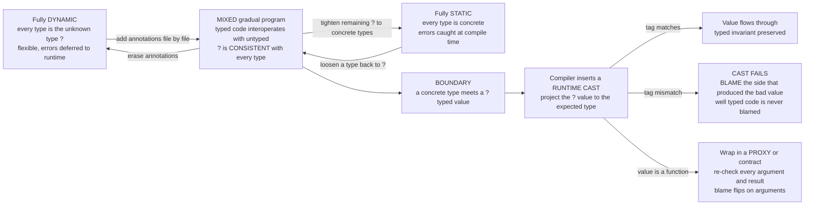

# 🌗 Gradual and Optional Typing

> [!abstract] TL;DR
> **Gradual typing** (Siek & Taha, 2006) lets a *single* language slide smoothly from **fully dynamic** to **fully static**, so a giant untyped codebase can grow into a typed one **one file at a time** instead of via a big-bang rewrite. Its whole machinery hangs on a special **unknown / dynamic type** — written `?`, `Any`, or `dynamic` — and a **consistency relation** `~` that *replaces type equality*: `?` is consistent with **every** type, so annotated and unannotated code interoperate. The checker verifies the annotated parts **statically** and treats `?` permissively; wherever a concrete type meets a `?`-typed value it inserts a **runtime cast** at the **boundary**. When a cast fails, **blame** (Wadler & Findler, "well-typed programs can't be blamed") names *which side* — typed or untyped — is at fault. The soundness spectrum runs from **sound** gradual typing (Typed Racket: real runtime guarantees, but a notorious **performance death** when typed and untyped code interleave) to **optional / unsound** typing (**TypeScript, mypy, Sorbet, Flow, Python hints**) which checks at compile time and **erases** types at runtime — no runtime cost, no runtime guarantee. TypeScript is applied gradual-typing theory, and one of the rare cases of PLT research shaping mainstream languages inside a decade.

---

## Intuition

**Analogy — inspecting a house room by room instead of all-or-nothing.** Think of a **strict building inspector** who refuses to let you move in until *every* room passes code — that is **static typing**: total safety, but you cannot occupy a single finished room until the whole house is done. **Dynamic typing** is skipping the inspection entirely: move in today, discover the wiring was wrong the night the fuse blows — errors deferred to *runtime*, in exchange for speed and flexibility.

**Gradual typing lets you inspect the house one room at a time.** You certify the kitchen and the nursery — the rooms where a fault would be catastrophic — and leave the garage and attic uninspected for now. The rooms you certified come with a real guarantee; the rest stay flexible. Crucially, the inspector installs a **checkpoint at every doorway between a certified room and an uncertified one**: anything passing from the wild, uninspected side into a certified room is checked *at the threshold, at the moment it crosses*. That threshold is the **typed/untyped boundary**, and the doorway check is the **runtime cast** that gradual typing inserts automatically. Over months you certify more rooms — you **migrate** from dynamic to static — and if something ever goes wrong at a doorway, the log tells you **which side sent the bad thing through**. That log entry is **blame**.

Two adjectives make this precise. The unknown type `?` is the label on an *uninspected* room — usable anywhere because it promises nothing and demands nothing. And **consistency**, not equality, is the rule the doorways enforce: `Int` and `Int` obviously match, `?` matches *anything*, but `Int` and `Bool` still clash — the certified rooms keep their standards.

---

## How It Works

### 1. The static/dynamic divide, and why bridge it

Every type discipline sits somewhere on one axis (see [[Type_Systems_Fundamentals]] for the formal machinery):

- **Static typing** (Haskell, Rust, Java, TypeScript) checks types at *compile time* from the program text. It catches whole categories of bugs before the code runs, powers editor tooling (autocomplete, refactoring, go-to-definition), and enables performance wins (unboxing, monomorphization). The price: **ceremony** (annotations, appeasing the checker) and **conservatism** — a sound static checker *must* reject some programs that would have run fine (the decidability tax).
- **Dynamic typing** (Python, JavaScript, Ruby, Clojure) tags values at *runtime* and checks operations as they execute. It is flexible, terse, and quick to prototype — but every type error is a *latent* runtime error, discovered by tests or, worse, by users in production.

The tension is real and the stakes are enormous: the world's largest codebases — the JavaScript, Python, and Ruby monorepos at Google, Meta, Microsoft, Stripe, and Dropbox — are *dynamically typed*, and their owners desperately want static guarantees **without a full rewrite**. You cannot pause a ten-million-line service for two years to re-type it. That single economic fact — *incremental adoption of static safety over an existing dynamic codebase* — is the entire motivation for gradual typing.

### 2. Gradual typing: one language, the whole spectrum

Siek and Taha's insight is that static and dynamic need not be two languages but **two ends of one dial**, joined by a special type:

- **The unknown / dynamic type** — written `?` in the theory, `Any` in Python, `dynamic` in C#, `any` in TypeScript. It means *"I am not telling the type checker anything here."* It is the type of the uninspected rooms.
- **The consistency relation `~`** *replaces type equality* as the rule for when two types may meet. Where a fully static checker asks "are these types **equal**?", a gradual checker asks "are these types **consistent**?":
  - `? ~ T` and `T ~ ?` for **every** type `T` — the unknown type is consistent with all.
  - `Int ~ Int`, `Bool ~ Bool` — ground types are consistent only with themselves.
  - `(S1 -> S2) ~ (T1 -> T2)` iff `S1 ~ T1` and `S2 ~ T2` — structural, component-wise.
  - Everything else is **inconsistent**: `Int ~ Bool` is *false* even in gradual code.

  The load-bearing subtlety: **consistency is reflexive and symmetric but NOT transitive.** `Int ~ ?` and `? ~ Bool` both hold, yet `Int ~ Bool` does not. If `~` were transitive it would collapse to "everything," destroying all static guarantees. Non-transitivity is exactly what keeps the typed rooms safe while still letting `?` bridge to anything.
- The checker verifies the **fully-annotated parts statically** (ordinary type checking) and treats `?` **permissively** at every elimination site. You add types **incrementally**: an unannotated program is trivially well-typed (everything is `?`), and every annotation you add can only *tighten* the check.

### 3. Runtime casts and the boundary — the key mechanism

Consistency lets typed and untyped code *type-check* together, but consistency is a **static approximation** — it says "this *might* be fine." Somewhere the "might" has to be resolved. That happens at the **boundary**: wherever statically-typed code receives a `?`-typed (dynamic) value, or vice versa, the compiler **inserts a runtime cast** (a "check-and-tag"). This is the step ordinary static typing cannot do, because ordinary static typing has no `?`.

The elaboration is called **cast insertion**: the gradual source program is compiled into a **cast calculus** where every boundary crossing becomes an explicit `<T <= S>` coercion.

- **Injection** (`<? <= Int>`): a concrete value flows *into* the dynamic world. Always succeeds — it just tags the value. Zero risk.
- **Projection** (`<Int <= ?>`): a dynamic value flows *into* typed code that expects a concrete type. This is the **real check** — at runtime it inspects the value's tag and either lets it through or **fails**. This is where a type error hidden in dynamic code is finally caught.
- **Higher-order casts** (`<(A->B) <= (C->D)>`): you cannot check a *function's* future behavior at the instant it crosses the boundary, so the cast wraps it in a **proxy / contract** that re-checks each argument (contravariantly) and each result (covariantly) on every future call. This is the same idea as **software contracts** and is why object and function boundaries are policed lazily.

The guarantee this buys typed code is the **gradual guarantee** and **soundness at the boundary**: untyped code *cannot corrupt a typed invariant silently*. If the untyped side hands the typed side a `Bool` where an `Int` was promised, the projection fires and the program halts *at the boundary* — not later, deep inside typed code, with a corrupted value in hand.

### 4. Blame — who is at fault

When a projection fails, *which side of the boundary broke the contract?* **Blame tracking** (Findler & Felleisen for contracts; Wadler & Findler for gradual types) answers this. Every cast carries **blame labels** — a positive label for the value's producer and a negated one for its context. When the cast fails, blame is assigned to a specific label, and blame **flips** as it passes through higher-order proxies (an argument failure blames the *caller*, a result failure blames the *callee*). The celebrated theorem is:

> **"Well-typed programs can't be blamed."** — In a failed cast between a *more-typed* and a *less-typed* side, blame *always* falls on the **less-typed (dynamic) side**. Fully static code is never at fault.

This is what makes gradual typing *debuggable* and gives the typed portion a *real* guarantee: if your typed function receives garbage, the blame log points at the untyped code that sent it, not at your annotations.

### 5. The soundness spectrum and the performance problem

Everything above describes **sound gradual typing**, and it has a catch famous enough to have a name.

- **Sound gradual typing (Typed Racket, the research pioneer):** enforces types at boundaries with real runtime checks and honest blame. The problem: when typed and untyped modules **interleave heavily**, values cross boundaries constantly, each crossing pays for a cast (and function values accumulate proxy wrappers), and the overhead can explode — Takikawa et al.'s "Is Sound Gradual Typing Dead?" measured **slowdowns exceeding 100x** on the worst mixed configurations. This is the **"gradual typing performance death."**
- **Optional / unsound typing (TypeScript, mypy, pyright, Sorbet, Flow, Hack, Python type hints):** checks types **only at compile time** and **erases** them before running — the runtime is the original dynamic language, untouched. Consequence: **zero runtime cost and zero runtime guarantee.** It catches *many* bugs (and doubles as machine-checked documentation and tooling fuel) but not *all* — a lie told to the checker can still blow up at runtime because there is no boundary cast to catch it. This is the deliberate **soundness-for-usability trade** that essentially all *industry* tools chose.

There is no free lunch here, and it is worth stating honestly: the **sound-and-fast-and-usable trilemma is still open**. Sound gradual typing is sound but slow; optional typing is fast and usable but unsound. Active research (transient/space-efficient casts, Nom, monotonic references) chips away at it, but as of today most mainstream tools pick usability by being *unsound* — and even unsound optional typing is enormously valuable for catching bugs and documenting intent.

### Flow / Architecture



---

## Key Concepts

**Secondary (explain to a curious beginner).**
- Static typing checks your code *before* it runs; dynamic typing checks *while* it runs. Gradual typing lets you have **both in the same program** and choose per file.
- You add types **a little at a time** — start with none, annotate the risky parts first, and the language still runs everything.
- The special type `?` ("I'm not saying") is compatible with everything, which is what lets typed and untyped code live together.

**Undergraduate (requires a CS background).**
- The **unknown type `?`** (a.k.a. `Any`, `dynamic`) and the **consistency relation `~`** that *replaces equality*: `? ~ T` for all `T`, ground types only match themselves, functions match component-wise, and `~` is **not transitive**.
- **Cast insertion**: the checker compiles a gradual program into one with explicit casts at every boundary; **injections** (into `?`) always succeed, **projections** (out of `?`) are the runtime checks that can fail.
- **Blame**: casts carry labels; a failed cast names the offending side, blame **flips** through function proxies, and **"well-typed programs can't be blamed."**
- **Sound vs optional**: sound gradual typing keeps the casts at runtime (real guarantee, real cost); optional typing (TypeScript, mypy) **erases** types (no cost, no guarantee).

**Graduate (system-level and foundational thinking).**
- The **cast / coercion calculus** and the **gradual guarantee** (Siek, Vitousek, Cimini, Boyland): making a program *less precise* (replacing concrete types with `?`) preserves well-typedness *and* behavior; making it *more precise* either preserves behavior or fails with blame — never silently changes the answer. Formalized via a **precision** partial order `⊑` on types and terms.
- **Higher-order casts as contracts** (Findler-Felleisen), **space-efficient / coercion-normalized** casts to bound proxy accumulation, and the **runtime-tag / ground-type** factoring that routes every cast through `?`.
- The **performance death** (Takikawa et al., "Is Sound Gradual Typing Dead?"): the exponential blow-up of the typed/untyped *lattice* of module configurations, and why *transient* (Reticulated Python) vs *guarded* (Typed Racket) vs *erasure* (TypeScript) semantics trade soundness, blame precision, and speed differently.
- The **theorem-vs-practice gap**: the sound-fast-usable trilemma, and why unsound *migratory* typing dominates industry despite decades of sound-gradual research.

---

## Python Demo

We build a **small gradual type checker** for a tiny language with an explicit **dynamic type `?`**. It (1) uses a **consistency relation** — not equality — to decide when typed and dynamic code may mix; (2) **statically checks** the fully-annotated parts; (3) performs **cast insertion**, adding a runtime cast at every boundary where a `?` meets a concrete type; (4) **evaluates** with those casts, so a type error hidden in dynamic code is caught **at the boundary at runtime** with **blame** assigned to the offending side; (5) demonstrates the **gradual guarantee** — varying annotation precision only changes *how many* runtime checks fire, never the *result*; and (6) **visualizes** the typed/untyped boundary and where checks fire with matplotlib. Pure standard library plus matplotlib — no numpy.

```python
# A GRADUAL type checker with an explicit dynamic type ?, consistency-based
# checking, boundary cast insertion, runtime blame, and the gradual guarantee.
from dataclasses import dataclass
import matplotlib.pyplot as plt
import matplotlib.patches as mpatches

# ================= GRADUAL TYPES : Int | Bool | ? | Fun(a, r) =================
@dataclass(frozen=True)
class TInt:  pass
@dataclass(frozen=True)
class TBool: pass
@dataclass(frozen=True)
class TDyn:  pass                       # the UNKNOWN / DYNAMIC type, written ?
@dataclass(frozen=True)
class TFun:
    arg: object
    ret: object

DYN = TDyn()

def tstr(t):
    if isinstance(t, TInt):  return "Int"
    if isinstance(t, TBool): return "Bool"
    if isinstance(t, TDyn):  return "?"
    if isinstance(t, TFun):  return f"({tstr(t.arg)} -> {tstr(t.ret)})"
    return "?"

# ---------- CONSISTENCY  s ~ t : replaces equality; ? is consistent with all ----------
def consistent(s, t):
    if isinstance(s, TDyn) or isinstance(t, TDyn):        # ? ~ everything
        return True
    if isinstance(s, TFun) and isinstance(t, TFun):       # functions: component-wise
        return consistent(s.arg, t.arg) and consistent(s.ret, t.ret)
    return type(s) == type(t)                             # Int~Int, Bool~Bool, else NO

# ================= SOURCE AST =================
@dataclass
class Lit:  n: int                       # integer literal
@dataclass
class BLit: b: bool                       # boolean literal
@dataclass
class Var:  name: str
@dataclass
class Lam:  param: str; ann: object; body: object   # ann may be DYN = "unannotated"
@dataclass
class App:  fn: object; arg: object
@dataclass
class Add:  l: object; r: object          # Int x Int -> Int

# ---------- CAST node inserted by elaboration : <dst <= src> with blame labels ----------
@dataclass
class Cast:
    src: object; dst: object
    pos: str; neg: str                    # pos = value's producer, neg = its context
    e: object

class StaticTypeError(Exception): pass
class Blame(Exception):
    def __init__(self, label): super().__init__(f"BLAME [{label}]"); self.label = label

# ================= THE GRADUAL CHECKER  +  CAST INSERTION =================
def coerce(elab, s, t, pos, neg):
    """Insert a runtime cast ONLY at a real boundary (s and t differ via ?)."""
    return elab if s == t else Cast(s, t, pos, neg, elab)

def as_function(t):                       # pattern-match a type as a function, ? -> (?->?)
    if isinstance(t, TFun): return t
    if isinstance(t, TDyn): return TFun(DYN, DYN)
    return None

def check(env, e):
    """Return (gradual_type, elaborated_expr_with_casts)."""
    if isinstance(e, Lit):  return TInt(),  e
    if isinstance(e, BLit): return TBool(), e
    if isinstance(e, Var):
        if e.name not in env: raise StaticTypeError(f"unbound variable {e.name}")
        return env[e.name], e
    if isinstance(e, Lam):
        env2 = dict(env); env2[e.param] = e.ann
        rt, be = check(env2, e.body)
        return TFun(e.ann, rt), Lam(e.param, e.ann, be)
    if isinstance(e, Add):
        lt, le = check(env, e.l); rt, re = check(env, e.r)
        if not consistent(lt, TInt()):
            raise StaticTypeError(f"'+' left is {tstr(lt)}, not consistent with Int")
        if not consistent(rt, TInt()):
            raise StaticTypeError(f"'+' right is {tstr(rt)}, not consistent with Int")
        le = coerce(le, lt, TInt(), "left operand (dynamic)",  "arithmetic context")
        re = coerce(re, rt, TInt(), "right operand (dynamic)", "arithmetic context")
        return TInt(), Add(le, re)
    if isinstance(e, App):
        ft, fe = check(env, e.fn)
        fn = as_function(ft)
        if fn is None:
            raise StaticTypeError(f"applying a non-function of type {tstr(ft)}")
        if isinstance(ft, TDyn):                       # project a ? callee to a function
            fe = coerce(fe, DYN, TFun(DYN, DYN), "callee (dynamic)", "call site")
        at, ae = check(env, e.arg)
        if not consistent(at, fn.arg):
            raise StaticTypeError(
                f"argument {tstr(at)} not consistent with parameter {tstr(fn.arg)}")
        ae = coerce(ae, at, fn.arg, "untyped caller", "typed function")  # THE boundary
        return fn.ret, App(fe, ae)
    raise StaticTypeError("unknown expression")

# ================= RUNTIME VALUES  +  CASTS  +  BLAME =================
@dataclass
class VInt:  n: int
@dataclass
class VBool: b: bool
@dataclass
class VClos: param: str; body: object; env: dict
@dataclass
class VProxy: inner: object; src: object; dst: object; pos: str; neg: str  # function cast

def is_fun_value(v): return isinstance(v, (VClos, VProxy))

def apply_cast(v, src, dst, pos, neg):
    if src == dst:                        return v                    # no-op
    if isinstance(dst, TDyn):             return v                    # INJECTION into ? : safe
    if isinstance(src, TDyn):                                         # PROJECTION out of ?
        if isinstance(dst, TFun):
            if is_fun_value(v): return VProxy(v, TFun(DYN, DYN), dst, pos, neg)
            raise Blame(pos)              # expected a function, got a base value
        if isinstance(dst, TInt)  and isinstance(v, VInt):  return v
        if isinstance(dst, TBool) and isinstance(v, VBool): return v
        raise Blame(pos)                  # <-- hidden dynamic type error caught HERE
    if isinstance(src, TFun) and isinstance(dst, TFun):
        return VProxy(v, src, dst, pos, neg)                          # HIGHER-ORDER cast
    raise Blame(pos)

def apply_value(f, a):
    if isinstance(f, VClos):
        return evaluate(f.body, {**f.env, f.param: a})
    if isinstance(f, VProxy):             # contravariant arg (blame FLIPS), covariant result
        a2 = apply_cast(a, f.dst.arg, f.src.arg, f.neg, f.pos)
        r  = apply_value(f.inner, a2)
        return apply_cast(r, f.src.ret, f.dst.ret, f.pos, f.neg)
    raise Blame("apply-nonfunction")

def evaluate(e, env):
    if isinstance(e, Lit):  return VInt(e.n)
    if isinstance(e, BLit): return VBool(e.b)
    if isinstance(e, Var):  return env[e.name]
    if isinstance(e, Lam):  return VClos(e.param, e.body, env)
    if isinstance(e, Add):
        l = evaluate(e.l, env); r = evaluate(e.r, env)     # casts already guarantee VInt
        return VInt(l.n + r.n)
    if isinstance(e, App):
        return apply_value(evaluate(e.fn, env), evaluate(e.arg, env))
    if isinstance(e, Cast):
        return apply_cast(evaluate(e.e, env), e.src, e.dst, e.pos, e.neg)
    raise RuntimeError("bad node")

def count_checks(e):                      # real runtime checks = projections + fn casts
    if isinstance(e, Cast):
        real = isinstance(e.src, (TDyn, TFun))
        return (1 if real else 0) + count_checks(e.e)
    if isinstance(e, (Lit, BLit, Var)): return 0
    if isinstance(e, Lam):              return count_checks(e.body)
    if isinstance(e, Add):              return count_checks(e.l) + count_checks(e.r)
    if isinstance(e, App):              return count_checks(e.fn) + count_checks(e.arg)
    return 0

# ============================ 1. CONSISTENCY, NOT EQUALITY ============================
print("=== consistency relation (~) replaces equality ===")
for a, b in [(TInt(), DYN), (DYN, TBool()), (TInt(), TBool()), (TInt(), TInt())]:
    print(f"  {tstr(a):>4} ~ {tstr(b):<4} -> {consistent(a, b)}")
print("  NOTE: Int ~ ? and ? ~ Bool are both True, yet Int ~ Bool is False")
print("        -> consistency is NOT transitive (that is what keeps typed code safe)\n")

# ============================ 2. THE BOUNDARY : BLAME AT RUNTIME ============================
# A TYPED function inc : Int -> Int, receiving a value from UNTYPED code (type ?).
inc_type = TFun(TInt(), TInt())
inc_clos = VClos("x", Add(Var("x"), Lit(1)), {})
prog     = App(Var("inc"), Var("d"))                 # d comes from dynamic code, type ?
_, elab  = check({"inc": inc_type, "d": DYN}, prog)  # inserts <Int <= ?> on d
print("=== a type error hidden in dynamic code, caught at the boundary ===")
for hidden_label, hidden_value in [("Int 5  (honest)", VInt(5)), ("Bool True  (a LIE)", VBool(True))]:
    venv = {"inc": inc_clos, "d": hidden_value}
    try:
        out = evaluate(elab, venv)
        print(f"  d = {hidden_label:<20} -> inc(d) = {out.n}   (cast <Int <= ?> passed)")
    except Blame as ex:
        print(f"  d = {hidden_label:<20} -> {ex}   caught at the <Int <= ?> boundary")
        print(f"       the TYPED function 'inc' is exonerated; the untyped caller is blamed")
print()

# ============================ 3. THE GRADUAL GUARANTEE ============================
# Program: sum of k numbers 0..k-1 through k lambda parameters. We slide the FIRST j
# parameters from Int to ? (less precise). Result is INVARIANT; only #checks changes.
def build_sum_program(annotations):
    k = len(annotations)
    body = Var("x0")
    for i in range(1, k): body = Add(body, Var(f"x{i}"))
    expr = body
    for i in reversed(range(k)): expr = Lam(f"x{i}", annotations[i], expr)
    for i in range(k):           expr = App(expr, Lit(i))
    return expr

K = 6
levels, checks_at, results_at = [], [], []
print(f"=== gradual guarantee : sum of 0..{K-1} = {K*(K-1)//2}, sliding precision ===")
for j in range(K + 1):                    # j = how many params are ? instead of Int
    anns = [DYN] * j + [TInt()] * (K - j)
    _, el = check({}, build_sum_program(anns))
    nchecks = count_checks(el)
    val = evaluate(el, {}).n
    levels.append(j); checks_at.append(nchecks); results_at.append(val)
    tag = "fully dynamic" if j == K else ("fully static" if j == 0 else "mixed")
    print(f"  {j} of {K} params are ?  ({tag:<13}) -> {nchecks} runtime checks, result = {val}")
print("  the RESULT never changes; annotations only change the NUMBER of boundary checks\n")

# ============================ 4. VISUALIZE ============================
fig, (axA, axB) = plt.subplots(1, 2, figsize=(15, 6))

# Panel A : the typed / untyped boundary and where the cast fires.
axA.add_patch(mpatches.Rectangle((0.02, 0.15), 0.44, 0.7, fc="#DCEBD8", ec="#55A868", lw=2))
axA.add_patch(mpatches.Rectangle((0.54, 0.15), 0.44, 0.7, fc="#F6E0DF", ec="#C44E52", lw=2))
axA.text(0.24, 0.80, "TYPED region", ha="center", fontweight="bold", color="#2E6B3E")
axA.text(0.76, 0.80, "UNTYPED region", ha="center", fontweight="bold", color="#8E2B2E")
axA.text(0.24, 0.55, "inc : Int -> Int\n(guaranteed, checked\nstatically)",
         ha="center", va="center", fontsize=10, family="monospace")
axA.text(0.76, 0.55, "d : ?\n(actually a Bool —\na hidden type error)",
         ha="center", va="center", fontsize=10, family="monospace")
axA.plot([0.50, 0.50], [0.12, 0.88], ls="--", color="0.4", lw=2)
axA.annotate("", xy=(0.47, 0.40), xytext=(0.53, 0.40),
             arrowprops=dict(arrowstyle="-|>", color="#333", lw=2))
axA.scatter([0.50], [0.40], s=1400, marker="*", color="#E8A33D", zorder=5, edgecolors="black")
axA.text(0.50, 0.29, "BOUNDARY\ncast <Int <= ?> fires here", ha="center", va="top",
         fontsize=9, fontweight="bold", color="#8a5a00")
axA.text(0.50, 0.05, "runtime tag is Bool, expected Int  ->  BLAME the untyped side",
         ha="center", fontsize=9, style="italic", color="#C44E52")
axA.set_xlim(0, 1); axA.set_ylim(0, 1); axA.axis("off")
axA.set_title("The typed / untyped boundary\nwhere a runtime cast catches the hidden error", fontsize=11)

# Panel B : the gradual guarantee -- checks change, result does not.
axB.bar([x - 0.0 for x in levels], checks_at, width=0.55, color="#4C72B0",
        label="runtime checks inserted")
axB.plot(levels, results_at, "o-", color="#C44E52", lw=2, label="result of the program")
for x, c in zip(levels, checks_at):
    axB.text(x, c + 0.12, str(c), ha="center", fontsize=9, color="#2f4b7c")
axB.axhline(results_at[0], ls=":", color="#C44E52", alpha=0.5)
axB.text(K, results_at[0] + 0.4, f"result = {results_at[0]} (invariant)",
         ha="right", color="#C44E52", fontsize=9, style="italic")
axB.set_xlabel("annotation precision  (number of parameters left as ?,  0 = fully static)")
axB.set_ylabel("count")
axB.set_title("The gradual guarantee\nannotations change the number of checks, not the answer", fontsize=11)
axB.legend(loc="upper left"); axB.set_ylim(0, max(results_at) + 3)

fig.suptitle("Gradual typing: consistency lets ? mix with concrete types; "
             "casts + blame police the boundary", fontsize=13)
fig.tight_layout()
plt.savefig("gradual_typing.png", dpi=120)
plt.show()
```

Expected console output:

```
=== consistency relation (~) replaces equality ===
   Int ~ ?    -> True
     ? ~ Bool -> True
   Int ~ Bool -> False
   Int ~ Int  -> True
  NOTE: Int ~ ? and ? ~ Bool are both True, yet Int ~ Bool is False
        -> consistency is NOT transitive (that is what keeps typed code safe)

=== a type error hidden in dynamic code, caught at the boundary ===
  d = Int 5  (honest)     -> inc(d) = 6   (cast <Int <= ?> passed)
  d = Bool True  (a LIE)  -> BLAME [untyped caller]   caught at the <Int <= ?> boundary
       the TYPED function 'inc' is exonerated; the untyped caller is blamed

=== gradual guarantee : sum of 0..5 = 15, sliding precision ===
  0 of 6 params are ?  (fully static ) -> 0 runtime checks, result = 15
  1 of 6 params are ?  (mixed        ) -> 1 runtime checks, result = 15
  2 of 6 params are ?  (mixed        ) -> 2 runtime checks, result = 15
  3 of 6 params are ?  (mixed        ) -> 3 runtime checks, result = 15
  4 of 6 params are ?  (mixed        ) -> 4 runtime checks, result = 15
  5 of 6 params are ?  (mixed        ) -> 5 runtime checks, result = 15
  6 of 6 params are ?  (fully dynamic) -> 6 runtime checks, result = 15
  the RESULT never changes; annotations only change the NUMBER of boundary checks
```

Three lessons fall out. **(1)** *Consistency, not equality, is the whole trick*: `Int ~ ?` and `? ~ Bool` both hold yet `Int ~ Bool` does not — non-transitivity is what lets `?` bridge typed and untyped code *without* silently equating `Int` and `Bool`. **(2)** The *same* elaborated program blames the untyped caller when — and only when — the dynamic value is actually wrong; the typed `inc` is never at fault, a concrete instance of "well-typed programs can't be blamed." **(3)** Sliding a program from fully static to fully dynamic leaves the *answer* fixed at 15 while the *number of runtime checks* rises from 0 to 6 — the **gradual guarantee** made measurable, and, incidentally, a live demonstration of why heavy typed/untyped mixing costs performance in *sound* systems (more `?` boundaries, more checks). Optional tools like TypeScript avoid that cost by **erasing** all casts — trading the runtime guarantee for zero overhead.

---

## Real-World Applications

> **TypeScript is applied gradual-typing theory.** It layers **optional, structural** static types over JavaScript, checks them at compile time, and then **erases them entirely** — the emitted JavaScript has no type annotations and no runtime casts, so there is *zero* runtime cost and *zero* runtime guarantee (this is why `as` casts and `any` can lie and blow up at runtime). Its `any` is the unknown type `?`; its `unknown` is a *safer* top that forces a narrowing check; `strict` mode tightens the consistency rules. Structural typing (compatibility by shape, not by name) was a deliberate choice to fit JavaScript's duck-typed idioms — see [[Subtyping_and_Variance]] for structural vs nominal. TypeScript's runaway adoption is the clearest proof that *unsound but usable* gradual typing wins in industry.

- **Python type hints + mypy / pyright / Pyre.** [PEP 484](https://peps.python.org/pep-0484/) added optional annotations; `typing.Any` is the unknown type, and checkers verify annotated code while treating `Any` permissively — then the CPython runtime ignores the hints entirely (erasure). Meta's Pyre and Microsoft's pyright bring this to million-line codebases. See [[Type_Hints_and_Static_Analysis]].
- **Sorbet (Ruby, Stripe) and Flow (JavaScript, Meta).** Sorbet added gradual typing to Ruby with `sig` signatures and `T.untyped` as `?`, plus per-file **strictness levels** (`typed: false / true / strict`) — the migration dial made explicit. Flow was Meta's earlier take before TypeScript's ecosystem won.
- **Hack (Facebook/Meta over PHP)** and **Dialyzer's success typings (Erlang).** Hack retrofitted a gradual type system onto PHP for Meta's backend. Dialyzer takes the *opposite* philosophy — **success typings** only report code that *cannot possibly* be right, never false positives — an "optional typing that only speaks when certain" approach suited to dynamic Erlang.
- **Typed Racket — the sound pioneer.** The research system that first shipped *sound* gradual typing with real boundary contracts and blame, and where the **performance-death** phenomenon was first measured and named. It is the reason the field knows the trade-offs so precisely, and the counterexample that keeps "just make it sound" honest.

---

## Common Pitfalls

- **Believing `any`/`Any` gives you safety.** The unknown type is an *escape hatch*, not a guarantee. Every `any` is a hole in the type system: a value can flow through typed code untouched and detonate elsewhere. Prefer `unknown` (TypeScript) / narrowed types and lint against `any` in new code.
- **Expecting erased optional typing to catch runtime type errors.** TypeScript and mypy check at *compile time* and erase; they will *not* stop a genuinely wrong value that arrives at runtime (from `JSON.parse`, an API, `eval`). You still need runtime validation (Zod, Pydantic) at the true I/O boundaries — the casts the *sound* systems would have inserted for you.
- **Assuming consistency is transitive.** `Int ~ ?` and `? ~ Bool` do *not* give `Int ~ Bool`. Reasoning as if `?` "unifies" types is exactly the mistake that would collapse all safety; `?` *bridges* at a boundary, it does not *equate*.
- **Trusting an `as` / cast to be checked.** A TypeScript `x as Foo` or a Python `cast(Foo, x)` is a *compile-time-only assertion* the checker believes without evidence — in erased systems nothing verifies it at runtime. Casts are promises to the checker, not proofs.
- **Underestimating the performance cost of *sound* boundaries.** If you reach for Typed Racket-style soundness expecting zero cost, heavy typed/untyped interleaving can slow you down by orders of magnitude (the gradual-typing performance death). Know whether your tool is *sound* (checks, costs) or *erased* (no checks, no cost).
- **Big-bang migration.** Trying to type an entire dynamic codebase at once fights the whole point. Migrate **file by file at the boundaries**, start permissive (`typed: false` / no-strict), and *tighten* over time; blame and per-file strictness exist precisely to support incremental adoption.

---

## Related Concepts

- [[Type_Systems_Fundamentals]] — the static/dynamic axis, soundness (progress + preservation), and conservatism that gradual typing sits *between*; gradual typing weakens equality to consistency and trades whole-program soundness for incremental adoption.
- [[Subtyping_and_Variance]] — TypeScript's **structural** subtyping (compatibility by shape) is what makes gradual types fit JavaScript; consistency and subtyping interact in the "consistent-subtyping" relation.
- [[Type_Inference_and_Unification]] — inference *reconstructs* omitted types by unification; gradual `?` is the *opposite* move (an explicit "unknown" the checker must *not* solve away), and modern tools blend local inference with gradual annotations.
- [[Contextual_Equivalence_and_Reasoning]] — the **gradual guarantee** is an *equivalence* claim (adding/removing precision preserves behavior), and higher-order casts are *contracts* whose correctness is argued with logical-relations reasoning.
- [[Type_Hints_and_Static_Analysis]] — the Python realization: PEP 484 hints, `Any` as `?`, mypy/pyright checking with runtime erasure; the concrete "optional typing" side of this note.
- [[TypeScript_Fundamentals]] — the flagship optional/structural gradual system: `any` vs `unknown`, `strict` mode, erasure, and why it succeeded.
- [[Generics_in_TypeScript]] — how `?`/`any` interacts with parametric generics and constraints in the most-used gradual system.
- [[Type_Checking_and_Type_Systems]] — the compiler-engineering counterpart: how a checker actually decides consistency and where cast-insertion sits in semantic analysis.
- [[Dynamic_Language_Implementation]] — how the dynamic runtimes (JS, Python, Ruby) that gradual typing bolts onto actually tag and dispatch on values at runtime.

*(PLT siblings referenced in prose but not yet built: `Language_Design_Principles`, `The_Future_of_Programming_Languages`, `Dependent_Types_and_Advanced_Type_Systems`.)*

---

## Review Questions

1. **(Secondary)** Using the room-by-room house-inspection analogy, explain the difference between static, dynamic, and gradual typing. Where in the analogy does a "runtime cast" live, and why does gradual typing let a huge existing codebase adopt types without a full rewrite?
2. **(Undergraduate)** Define the **consistency relation** `~` for `Int`, `Bool`, `?`, and function types, and show with a concrete example that consistency is **not transitive**. Then explain why cast insertion adds a real runtime check for a **projection** (`<Int <= ?>`) but not for an **injection** (`<? <= Int>`), and which of these can raise **blame**.
3. **(Graduate)** Contrast **sound** gradual typing (Typed Racket) with **optional / erased** typing (TypeScript, mypy) along three axes: runtime cost, runtime guarantee, and blame. Explain the "gradual-typing performance death" — *why* heavy typed/untyped interleaving is expensive in a sound system — and argue which axis TypeScript sacrifices and why that trade made it dominant. Finally, state the **gradual guarantee** precisely and explain how the demo's "result is invariant, check-count varies" experiment is evidence for it.

---

## Sources

- Jeremy G. Siek and Walid Taha, "Gradual Typing for Functional Languages," *Scheme and Functional Programming Workshop*, 2006 — the founding paper: the dynamic type, the consistency relation, and cast insertion. [http://scheme2006.cs.uchicago.edu/13-siek.pdf](http://scheme2006.cs.uchicago.edu/13-siek.pdf)
- Philip Wadler and Robert Bruce Findler, "Well-Typed Programs Can't Be Blamed," *ESOP*, 2009 — the blame calculus and the theorem that fully typed code is never at fault. [https://homepages.inf.ed.ac.uk/wadler/papers/blame/blame.pdf](https://homepages.inf.ed.ac.uk/wadler/papers/blame/blame.pdf)
- Jeremy G. Siek, Michael M. Vitousek, Matteo Cimini, and John Tang Boyland, "Refined Criteria for Gradual Typing," *SNAPL*, 2015 — the precise statement of the **gradual guarantee**. [https://drops.dagstuhl.de/opus/volltexte/2015/5031/](https://drops.dagstuhl.de/opus/volltexte/2015/5031/)
- Asumu Takikawa, Daniel Feltey, Ben Greenman, Max S. New, Jan Vitek, and Matthias Felleisen, "Is Sound Gradual Typing Dead?", *POPL*, 2016 — measures the performance death of sound gradual typing. [https://www2.ccs.neu.edu/racket/pubs/popl16-tfgnvf.pdf](https://www2.ccs.neu.edu/racket/pubs/popl16-tfgnvf.pdf)
- Microsoft, *TypeScript Handbook — Type Compatibility* — the industrial optional/structural design (erasure, `any`, `unknown`, `strict`). [https://www.typescriptlang.org/docs/handbook/type-compatibility.html](https://www.typescriptlang.org/docs/handbook/type-compatibility.html)

---

#programming-language-theory #gradual-typing #optional-typing #typescript #blame
