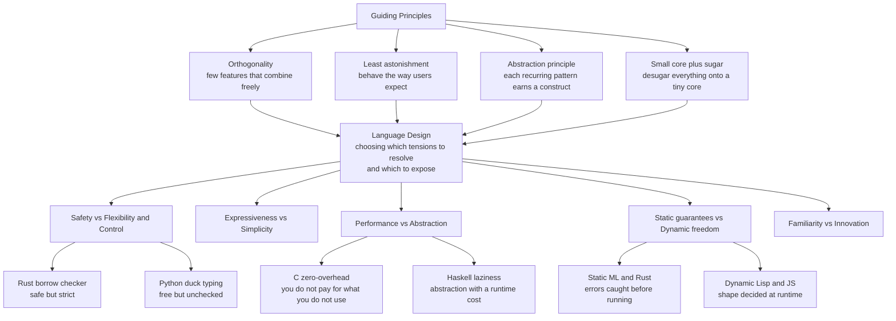

# 🎨 Language Design Principles

> [!abstract] TL;DR
> A programming language is a **tool for millions of hands you will never meet**, and every feature is a **tradeoff** — power against safety, brevity against clarity, freedom against guarantees. There is **no "best" language**: languages occupy *different points* because they optimize *different things* for *different domains* (C trades safety for control; Python trades performance for productivity; Rust trades simplicity for both safety and speed). Great design is the art of **choosing which tensions to resolve for the user and which to expose**, guided by a handful of durable principles — **orthogonality** (a few independent features that combine freely, no special cases), the **principle of least astonishment**, the **abstraction principle** (each recurring pattern deserves a construct), and the **small-core-plus-sugar** discipline (define a tiny analyzable core and *desugar* everything else onto it). This is where all of PLT — types, semantics, Curry-Howard — stops being academic and becomes **human factors and engineering**. This note opens the PLT **Design & Frontiers** section.

---

## Intuition

**Analogy — designing a tool for hands you will never meet.** Imagine forging a single wrench that a *million* mechanics will use, in workshops you will never visit, on machines you cannot foresee. Make it too **rigid** — one bolt size, welded settings — and most people cannot do their job. Make it too **loose** — infinitely adjustable, no stops, no guard — and everyone eventually mashes their fingers or strips a bolt. Every notch you add is a *tradeoff*: an adjustment ring adds **power** but also a way to set it wrong; a locking pin adds **safety** but removes a shortcut the expert wanted. You cannot optimize all of these at once, because they *pull against each other*. The best you can do is decide, deliberately, **which tensions you resolve on the user's behalf and which you hand them the dial for.**

A programming language is exactly that wrench, scaled to the whole software industry. Each feature trades **power against safety** (raw pointers vs a borrow checker), **brevity against clarity** (terse operators vs spelled-out keywords), **freedom against guarantees** (dynamic reflection vs a sound static type system). Because these tensions are *real* and *cannot all be won simultaneously*, different languages land in different places — and that is not a failure of the losers, it is the whole geometry of the field. **Great language design is choosing your tradeoffs on purpose, then making the chosen ones feel inevitable to the user.** The rest of this note names the tensions and the principles that experienced designers use to navigate them.

---

## How It Works

### The design space is a space of tensions, not a ranking

A beginner asks "which language is *best*?" A designer knows the question is malformed: there is no total order, only a **multi-dimensional tradeoff space** in which every real language is a *point*, and the interesting points are the ones no other point strictly beats. The recurring tensions:

1. **Safety vs Flexibility / Control.** A memory-safe, type-safe language rules out whole bug classes — but rules out some *safe* programs too, and takes away low-level control. Manual memory (C) gives total control at the cost of use-after-free; garbage collection (Java, Go) buys safety at the cost of pauses and footprint; **ownership and borrowing** (Rust) buys *both* safety and predictable performance at the cost of a steeper learning curve. This is a genuine three-way spectrum, not a binary — see [[Ownership_and_Borrowing]] and the theory sibling `Memory_and_Ownership_Models`.
2. **Expressiveness vs Simplicity.** More constructs let you say more, more concisely — but every construct is something *every* user must learn, every tool must handle, and every corner of the spec must interact with. Economy of concepts (Scheme, Go) fights richness (C++, Scala). Bigger is not better; *fewer orthogonal parts that compose* usually beats *more special cases*.
3. **Performance vs Abstraction.** High-level abstractions (garbage collection, dynamic dispatch, laziness, reflection) make code shorter and safer but insert runtime cost. C++'s **zero-overhead principle** — *"what you don't use, you don't pay for; and what you do use, you couldn't hand-code better"* — is one answer; another is to accept a runtime and optimize it (JVM JIT).
4. **Static guarantees vs Dynamic freedom.** Static types catch errors *before running* and drive optimization and tooling, but reject some safe programs and add annotation weight. Dynamic typing buys brevity and metaprogramming at the cost of runtime surprises. **Gradual and optional typing** deliberately blends the two so a codebase can migrate incrementally — the theory sibling here is `Gradual_and_Optional_Typing`, and see [[Type_Systems_Fundamentals]] for the static half of the axis.
5. **Familiarity vs Innovation.** A C-like syntax and OO defaults lower the adoption barrier but *anchor* users to old mental models; a genuinely new idea (Rust's borrow checker, Haskell's monads) must overcome the tax of unfamiliarity to deliver its payoff.

The crucial move: **no single point wins all axes.** Each mainstream language is *Pareto-optimal* — dominant on some axes precisely because it conceded others. The Python demo below quantifies exactly this.

### The classic design principles

These are the accumulated heuristics designers use to choose *well* within the space:

- **Orthogonality.** A *small set of independent features that combine freely*, with no special cases or forbidden combinations. If a language has data types `T` and containers `C`, an orthogonal design lets *any* type go in *any* container — you define `T + C` concepts and get `T × C` combinations *for free*. The opposite is special-casing: a bespoke `IntArray`, `FloatArray`, `StringList`... which grows combinatorially and leaves users memorizing exceptions. Algol-68 and Scheme are the canonical orthogonal designs. Orthogonality is *the* highest-leverage principle: it makes a language feel *small yet powerful*.
- **Principle of least astonishment (POLA).** A construct should behave the way its users *already expect*. If `+` concatenates strings in one context and adds numbers in another, the surprising case is a bug magnet. Astonishment is measured against the user's *prior*, which is why familiarity and consistency matter.
- **Consistency and regularity.** The same idea should look the same everywhere; the same syntax should mean the same thing. Irregularity (special rules for special cases) is cognitive load and a source of "gotchas."
- **The abstraction principle.** *Each significant recurring pattern deserves a linguistic construct* so users stop hand-rolling it. Functions abstract repeated expressions; generics abstract repeated types; macros abstract repeated syntax — see `Metaprogramming_and_Macros`. The dual danger is *over-abstraction*: a construct for a pattern that recurs twice is worse than the duplication.
- **Make illegal states unrepresentable / defense in depth.** Encode invariants in *types* so that a broken state cannot even be *written* down — a sum type with only the valid cases beats a struct-plus-runtime-checks. This is the design-side payoff of a good type system.
- **Zero-overhead abstraction.** From C++: an abstraction should cost nothing at runtime beyond what you would have written by hand, so users never face "elegance vs speed." Rust inherits this creed.
- **Small core plus syntactic sugar.** Design a *tiny orthogonal core language* with a precise semantics, then define every convenience feature as **desugaring** — a mechanical rewrite *into* the core. The core stays analyzable and provable; the surface stays ergonomic. Scheme's `let`, `and`, `cond` all desugar to lambda and `if`; this is the single most important structural discipline for keeping a growing language sound.

### Expressiveness — what it really means

"Expressive" is not just "concise." **Felleisen's formalization** distinguishes two cases: a feature is *not* a fundamental increase in power if it can be **macro-expressed** — locally rewritten into the existing language without reorganizing the whole program (syntactic sugar). It genuinely *adds expressive power* only if simulating it forces a *global* restructuring (like adding first-class continuations or exceptions to a language without them). This gives a precise wall between "sugar" and "new power" — and tells a designer which features are cheap conveniences and which are load-bearing semantic commitments.

### Syntax is the user interface

Concrete syntax is not cosmetic — it is the **UI the user touches every day**, and it drives adoption. Readability, unambiguous precedence, significant-vs-insignificant whitespace, and the absence of parsing traps all shape whether people *enjoy* the language. Yet PLT insists on the deeper **abstract-syntax vs surface-syntax** distinction: two languages can share one abstract syntax (and thus one semantics) while differing wildly on the surface. Good designers separate the two — get the *abstract* structure sound first, then design a *surface* that is pleasant and desugars cleanly onto it. See [[Formal_Syntax_and_Grammars]].

### The social dimension — where elegant languages go to die

A language is not just a formal object; it is an **ecosystem**: tooling, libraries, community, backward compatibility, and network effects. This is where the famous **"worse is better" vs "the right thing"** debate lives (Gabriel): a simpler, *less* correct design that ships early and spreads (C, Unix) can beat a more correct, more complex design that arrives late. Backward compatibility is a *ratchet* — C, C++, and Java can rarely *remove* a feature, so their complexity only grows, while greenfield languages start clean but must earn an ecosystem from zero. Hoare's warning against **premature language design** and the reality that **elegant languages routinely lose to ugly ones with a killer app or platform** (JavaScript rode the browser; Rust rode a real memory-safety pain point) are the sociology every designer must respect. This is the theory-adjacent territory of `The_Future_of_Programming_Languages`.



---

## Key Concepts

### Secondary (explain to a curious beginner)
- A language is a **tool designed for millions of strangers**; every feature helps in one way and hurts in another, so design is about **tradeoffs**, not perfection.
- There is **no single best language** — C, Python, and Rust are each "best" at *different* things because they gave up different things to get there.
- **Orthogonality** means "a few simple parts that snap together freely." A language with 5 parts that combine is more powerful *and* easier to learn than one with 50 special cases.
- The **principle of least astonishment**: a feature should do the *least surprising* thing, because surprises become bugs.

### Undergraduate (requires a CS background)
- The core **tradeoff axes**: safety vs flexibility, expressiveness vs simplicity, performance vs abstraction, static vs dynamic, familiarity vs innovation — and why real languages sit at *different Pareto-optimal points*.
- The **memory spectrum**: manual → garbage-collected → ownership/borrowing, each trading control, safety, and predictability differently (see [[Ownership_and_Borrowing]]).
- **Static vs dynamic typing** as a productivity/safety tradeoff, and **gradual typing** as a deliberate blend; **sound vs unsound-but-practical** type systems (TypeScript is *intentionally unsound* — `any`, covariance — to stay usable on real JavaScript).
- **Small core plus sugar / desugaring**: define a minimal core with a clean semantics and rewrite every convenience feature into it, so the language stays analyzable as it grows.
- **Syntax as UI vs abstract syntax**: the surface users type vs the tree the semantics operate on.

### Graduate (system-level / foundational thinking)
- **Felleisen's expressiveness**: the precise line between *macro-expressible* sugar and features that add fundamental power by forcing a global program restructuring — a formal notion of "expressive power."
- **How theory constrains design**: type soundness (progress + preservation), the [[The_Curry_Howard_Correspondence|Curry-Howard]] correspondence, and operational/denotational semantics are not academic luxuries — they *prevent whole bug classes by construction* and tell a designer whether a proposed feature is *sound*. Affine/linear types (`Linear_Logic_and_Resource_Types`) became Rust's ownership; dependent types (`Dependent_Types_and_Advanced_Type_Systems`) became "make illegal states unrepresentable."
- **Language evolution and the compatibility ratchet**: why never removing a feature makes a language monotonically more complex, and why "worse is better" (Gabriel) beats "the right thing" under real-world network effects.
- **The designer's responsibility / linguistic relativity for code**: a language *shapes what its users can think and which bugs are even possible* — the ethical weight of **defaults** (immutable-by-default, safe-by-default, errors-as-values), a Sapir-Whorf effect for programming.
- **Multi-paradigm design**: functional, OO, logic, and concurrent models blended in modern languages (`Functional_Programming_Foundations`, `Object_Oriented_Language_Theory`) — the art of picking *defaults* and letting other paradigms in without incoherence.

---

## Python Demo

We **quantify** two core claims of language design. **(A) There is no best language.** We score seven real-ish design points on four axes — **Safety, Performance, Flexibility/Productivity, Simplicity** — and (1) draw a **radar** showing four archetypes occupying four *different corners*, and (2) compute the **Pareto frontier**, confirming that every mainstream language is *non-dominated* (nobody beats it on all axes at once) while a deliberately weak strawman design *is* dominated. **(B) Orthogonality is exponential leverage.** We count the programs a small *orthogonal* feature set generates (`features` grows *additively*, combinations grow *multiplicatively*) versus a *special-cased* design where the designer must hand-define every combination — showing orthogonality buys exponential expressiveness from a linear design surface. Pure standard library plus matplotlib.

```python
# Quantifying two pillars of language design:
#   (A) NO BEST LANGUAGE  -> a Pareto frontier over 4 design axes (radar + domination test)
#   (B) ORTHOGONALITY     -> exponential expressiveness from a linear design surface
import math
import matplotlib.pyplot as plt

# ======================================================================
# (A) THE TRADEOFF SPACE: score design points on four axes (0..10)
# ======================================================================
AXES = ["Safety", "Performance", "Flexibility", "Simplicity"]
#                     Safe Perf Flex Simp
LANGS = {
    "C":         (3,  10,  6,  7),   # total control + tiny language, but unsafe
    "Rust":      (9,   9,  5,  3),   # safe AND fast, at the cost of simplicity
    "Python":    (5,   3,  9,  8),   # productive + simple, slow and loosely checked
    "Go":        (6,   7,  6,  9),   # deliberately simple, "good enough" everywhere
    "Haskell":   (9,   6,  7,  4),   # very safe + expressive, steep and non-obvious perf
    "Java":      (7,   7,  6,  6),   # the balanced middle
    "Legacy4GL": (4,   4,  5,  5),   # a strawman: good at nothing -> should be dominated
}

def dominates(a, b):
    """a Pareto-dominates b iff a >= b on EVERY axis and a > b on at least one."""
    return all(x >= y for x, y in zip(a, b)) and any(x > y for x, y in zip(a, b))

def pareto_front(langs):
    front = []
    for name, score in langs.items():
        if not any(dominates(other, score) for o, other in langs.items() if o != name):
            front.append(name)
    return front

front = pareto_front(LANGS)
print("=== (A) Is there a 'best' language? ===")
print(f"Pareto-optimal (non-dominated) design points: {sorted(front)}")
for name, score in LANGS.items():
    tag = "PARETO-OPTIMAL" if name in front else "DOMINATED (a worse tradeoff exists)"
    dom_by = [o for o, s in LANGS.items() if o != name and dominates(s, score)]
    extra = f"  <- dominated by {dom_by}" if dom_by else ""
    print(f"  {name:<10} {dict(zip(AXES, score))}  {tag}{extra}")
print("Takeaway: every mainstream language is Pareto-optimal -> there is NO single best point,")
print("only different corners. Only a design that loses on EVERY axis gets dominated.\n")

# ======================================================================
# (B) ORTHOGONALITY: additive design surface -> multiplicative power
# ======================================================================
# Model D independent feature dimensions (e.g. data-type, container, mutability),
# each offering n choices. Programs expressible = n**D either way.
#   Orthogonal design : the DESIGNER specifies D*n features; they combine freely.
#   Special-cased      : the DESIGNER must hand-define every one of the n**D combos.
D = 3
print("=== (B) Orthogonality: features the designer must specify ===")
print(f"{'choices n':>9} | {'programs n^D':>13} | {'orthogonal (D*n)':>17} | {'special-cased (n^D)':>19}")
ns = list(range(1, 7))
ortho, special, programs = [], [], []
for n in ns:
    p = n ** D
    o = D * n
    programs.append(p); ortho.append(o); special.append(p)
    print(f"{n:>9} | {p:>13} | {o:>17} | {p:>19}")
print("Orthogonal design surface grows ADDITIVELY (D*n) yet unlocks MULTIPLICATIVE power (n^D).\n")

# ======================================================================
# VISUALIZE
# ======================================================================
fig = plt.figure(figsize=(15, 6.2))

# --- Left: RADAR of four archetypes occupying four different corners ---
ax1 = fig.add_subplot(1, 2, 1, polar=True)
angles = [i / len(AXES) * 2 * math.pi for i in range(len(AXES))]
angles += angles[:1]                       # close the loop
archetypes = {"C": "#C44E52", "Rust": "#8172B3", "Python": "#4C72B0", "Go": "#55A868"}
for name, color in archetypes.items():
    vals = list(LANGS[name]) + [LANGS[name][0]]
    ax1.plot(angles, vals, color=color, linewidth=2, label=name)
    ax1.fill(angles, vals, color=color, alpha=0.12)
ax1.set_xticks(angles[:-1]); ax1.set_xticklabels(AXES, fontsize=10)
ax1.set_yticks([2, 4, 6, 8, 10]); ax1.set_ylim(0, 10)
ax1.set_title("(A) No best language: four archetypes,\nfour different Pareto corners", fontsize=11, pad=18)
ax1.legend(loc="upper right", bbox_to_anchor=(1.18, 1.12), fontsize=9)

# --- Right: ORTHOGONALITY -- designer effort, additive vs exponential ---
ax2 = fig.add_subplot(1, 2, 2)
ax2.plot(ns, ortho,   "o-", color="#55A868", linewidth=2, label=f"orthogonal: define D*n = {D}n features")
ax2.plot(ns, special, "s-", color="#C44E52", linewidth=2, label="special-cased: define n^D bespoke constructs")
ax2.plot(ns, programs, "--", color="#888", linewidth=1, label="programs expressible either way (n^D)")
ax2.set_yscale("log")
ax2.set_xlabel("choices per feature dimension  n   (with D = 3 dimensions)")
ax2.set_ylabel("number of constructs the DESIGNER must specify  (log scale)")
ax2.set_title("(B) Orthogonality: additive design surface,\nmultiplicative expressive power", fontsize=11)
ax2.grid(True, which="both", alpha=0.3)
ax2.legend(loc="upper left", fontsize=9)
ax2.annotate("same power,\nfar fewer parts to design",
             xy=(6, D * 6), xytext=(3.1, 4),
             arrowprops=dict(arrowstyle="->", color="#55A868"), color="#2f6f43", fontsize=9)

fig.suptitle("Language design is tradeoffs: pick a Pareto corner, then buy power through orthogonality",
             fontsize=13)
fig.tight_layout()
plt.savefig("language_design_tradeoffs.png", dpi=120)
plt.show()   # or inspect the saved PNG
```

Expected console output (deterministic):

```
=== (A) Is there a 'best' language? ===
Pareto-optimal (non-dominated) design points: ['C', 'Go', 'Haskell', 'Java', 'Python', 'Rust']
  C          {'Safety': 3, 'Performance': 10, 'Flexibility': 6, 'Simplicity': 7}  PARETO-OPTIMAL
  Rust       {'Safety': 9, 'Performance': 9, 'Flexibility': 5, 'Simplicity': 3}  PARETO-OPTIMAL
  Python     {'Safety': 5, 'Performance': 3, 'Flexibility': 9, 'Simplicity': 8}  PARETO-OPTIMAL
  Go         {'Safety': 6, 'Performance': 7, 'Flexibility': 6, 'Simplicity': 9}  PARETO-OPTIMAL
  Haskell    {'Safety': 9, 'Performance': 6, 'Flexibility': 7, 'Simplicity': 4}  PARETO-OPTIMAL
  Java       {'Safety': 7, 'Performance': 7, 'Flexibility': 6, 'Simplicity': 6}  PARETO-OPTIMAL
  Legacy4GL  {'Safety': 4, 'Performance': 4, 'Flexibility': 5, 'Simplicity': 5}  DOMINATED ...
Takeaway: every mainstream language is Pareto-optimal -> there is NO single best point ...
```

Three lessons fall out. **(1)** Six real languages are all *Pareto-optimal* — each wins on *some* axis, none dominates the rest — which is precisely the formal meaning of "there is no best language." **(2)** Only `Legacy4GL`, weak on every axis, is *dominated*: bad designs are the ones a better tradeoff strictly beats. **(3)** Orthogonality turns a *linear* design surface (`D·n` features to specify) into an *exponential* payoff (`n^D` expressible programs), which is why "a few features that combine freely" is the single highest-leverage principle a designer has.

---

## Real-World Applications

> **Rust's ownership model** is the textbook case of *theory becoming a product*. A real, expensive problem — use-after-free and data races in C/C++ — was solved by importing **affine/substructural type theory** (`Linear_Logic_and_Resource_Types`) into a mainstream language as *ownership and borrowing*. The design deliberately spent *simplicity* (a borrow checker is hard to learn) to buy *both safety and zero-overhead performance* at once, and it won adoption because the tradeoff matched a domain — systems programming — that genuinely needed it. See [[Ownership_and_Borrowing]].

- **TypeScript's deliberate unsoundness.** TypeScript's designers *knowingly* chose an **unsound** type system (`any`, bivariant parameters, unchecked casts) so that types could be layered onto real, messy JavaScript with minimal friction. It is a masterclass in *usability over purity* — the theory sibling is `Gradual_and_Optional_Typing`, and the general lesson is that "sound" is one axis among several, not the only goal.
- **Go's radical simplicity.** Go's designers *removed* features (no generics for a decade, no exceptions, no inheritance) to optimize **simplicity, fast compilation, and readability at scale** for large engineering orgs — a conscious bet on the *expressiveness-vs-simplicity* axis that made it dominant in cloud infrastructure.
- **C++'s zero-overhead abstractions.** Templates, RAII, and `constexpr` let C++ offer high-level abstraction that compiles down to code no faster hand-written version could beat — the design creed that "you don't pay for what you don't use," which is why C++ still owns latency-critical domains.
- **Scheme and the small-core discipline.** Scheme's tiny orthogonal core (lambda, `if`, a handful of primitives) with everything else defined as **hygienic-macro desugaring** is the reference implementation of "small core plus sugar," and it makes the language uniquely analyzable and teachable. The same discipline underlies embedded **domain-specific languages** — see [[Domain_Specific_Languages]].
- **Sum types + pattern matching going mainstream.** A modern-design trend — `Option`/`Result` instead of null, exhaustive `match` — is a direct application of "make illegal states unrepresentable." It has spread from ML/Haskell into Rust, Swift, Scala, and even Java, one of the clearest cases of PLT ideas driving mainstream language evolution.

---

## Common Pitfalls

- **Chasing a "best" language.** Believing one language should win everywhere ignores the geometry of the tradeoff space. The right question is never "which is best?" but "**best for what domain, on which axes?**" — a language is a *choice of Pareto corner*.
- **Feature-itis (violating economy of concepts).** Adding a construct for every convenience seems generous but multiplies interactions, tooling burden, and things every user must learn. Ask first: is this **macro-expressible** as sugar over the existing core? If so, it may not deserve to be a primitive at all.
- **Special-casing instead of generalizing.** Bolting on `IntArray`, `FloatArray`, ... instead of one orthogonal generic container gives users a growing table of exceptions to memorize. Non-orthogonality is a *tax paid forever* by every user and every tool.
- **Optimizing purity over adoption.** An elegant, sound, "right thing" design that is unfamiliar and lacks tooling/libraries routinely loses to an uglier language with a killer app or platform. **The ecosystem is part of the design.** Ignoring the social dimension is how beautiful languages die.
- **Underestimating the cost of never removing a feature.** Backward compatibility is a ratchet: every feature you ship is (nearly) forever, and complexity accretes monotonically. Design defaults and syntax as if they are permanent — because they are.
- **Astonishing defaults.** Silent coercions, mutable-by-default aliasing, and null-by-default violate least astonishment and manufacture bug classes. **Defaults are the most powerful design lever you have** — most users never change them, so a safe/immutable/explicit default shapes an entire ecosystem's habits.
- **Treating syntax as "just cosmetics."** Concrete syntax is the UI millions touch daily; ambiguous precedence, whitespace traps, and unreadable operators sink adoption regardless of how sound the semantics are.

---

## Related Concepts

- [[Programming_Language_Theory_Overview]] — the parent map; language design is where PLT's three pillars (syntax, semantics, types) meet human factors and become an engineered artifact.
- [[Type_Systems_Fundamentals]] — the theory a designer draws on to "make illegal states unrepresentable"; soundness, decidability, and static-vs-dynamic are direct design levers.
- [[Formal_Syntax_and_Grammars]] — the abstract-syntax-vs-surface-syntax distinction and the grammar layer behind "syntax is the UI."
- [[The_Curry_Howard_Correspondence]] — why "types are propositions" lets sound features (sum types, dependent types) be designed with mathematical confidence rather than guesswork.
- [[Dependent_Types_and_Advanced_Type_Systems]] — the far end of the expressiveness ladder a designer can reach for when invariants must be encoded in types.
- [[Polymorphism_and_System_F]] — parametric polymorphism as the orthogonality principle applied to *types*: one construct, all element types, no special cases.
- [[Subtyping_and_Variance]] — a feature whose *interaction* pitfalls (covariant arrays) are a classic lesson in how one design choice can silently break soundness.
- [[Linear_Logic_and_Resource_Types]] — the substructural type theory that became Rust's ownership; theory-to-practice pipeline in action.
- [[Ownership_and_Borrowing]] — the real-world memory-model tradeoff (control + safety at the cost of simplicity) that defines Rust's Pareto corner.
- [[Domain_Specific_Languages]] — the general-purpose-vs-DSL tension and the small-core-plus-sugar / desugaring discipline embodied.

*(PLT siblings referenced in prose but not yet built: `Memory_and_Ownership_Models`, `Gradual_and_Optional_Typing`, `Effect_Systems_and_Program_Analysis`, `Functional_Programming_Foundations`, `Object_Oriented_Language_Theory`, `Metaprogramming_and_Macros`, `The_Future_of_Programming_Languages`.)*

---

## Review Questions

1. **(Secondary)** Your teammate insists Rust is "objectively better than Python, so we should always use it." Using the four tradeoff axes from the demo (safety, performance, flexibility/productivity, simplicity), explain *why the claim is malformed* and give one concrete project where Python is the *better* design choice and one where Rust is — grounding each in a specific axis.
2. **(Undergraduate)** A language designer wants to add a `for`-comprehension, a `while` loop, and pattern-matching `case`. Explain the **small-core-plus-sugar** strategy: which of these might be defined by **desugaring** onto a smaller core, and use **Felleisen's** distinction to argue whether pattern matching is *macro-expressible sugar* or a *fundamental increase in expressive power*. Then explain, with the `IntArray`/`FloatArray` example, why **orthogonality** would make you reject three special-cased container types in favor of one generic.
3. **(Graduate)** TypeScript's type system is *deliberately unsound*, while Rust's ownership system is *provably sound*. (a) Reconstruct the *design rationale* for each choice in terms of the domain it targets and the axes it optimized. (b) Argue how PLT theory — type soundness (progress + preservation), affine types, Curry-Howard — turned from "academic" into the *load-bearing* justification for Rust's design, and state one bug class each language's choice makes impossible vs merely unlikely. (c) Defend or attack the claim that a language's *defaults* (immutable-by-default, errors-as-values, safe-by-default) carry an *ethical* weight because they shape what millions of programmers can think and which bugs are possible.

---

## Sources

- C. A. R. Hoare, "Hints on Programming Language Design," Stanford CS Technical Report STAN-CS-73-403, 1973 — the founding essay on simplicity, security, and against premature/over-elaborate design. [https://dl.acm.org/doi/10.5555/891829](https://dl.acm.org/doi/10.5555/891829)
- Matthias Felleisen, "On the Expressive Power of Programming Languages," *Science of Computer Programming* 17(1-3), 1991 (ESOP 1990) — the formal macro-expressibility criterion for expressive power. [https://doi.org/10.1016/0167-6423(91)90036-W](https://doi.org/10.1016/0167-6423(91)90036-W)
- Richard P. Gabriel, "Lisp: Good News, Bad News, How to Win Big," 1991 — the origin of the "Worse Is Better" vs "The Right Thing" debate on design and adoption. [https://www.dreamsongs.com/WorseIsBetter.html](https://www.dreamsongs.com/WorseIsBetter.html)
- Bjarne Stroustrup, *The Design and Evolution of C++*, Addison-Wesley, 1994 — the zero-overhead principle and the discipline of evolving a language under a compatibility ratchet.
- Peter Van Roy and Seif Haridi, *Concepts, Techniques, and Models of Computer Programming*, MIT Press, 2004 — orthogonality, economy of concepts, and multi-paradigm design as first principles. [https://www.info.ucl.ac.be/~pvr/book.html](https://www.info.ucl.ac.be/~pvr/book.html)

---

#programming-language-theory #language-design #orthogonality #expressiveness #tradeoffs
