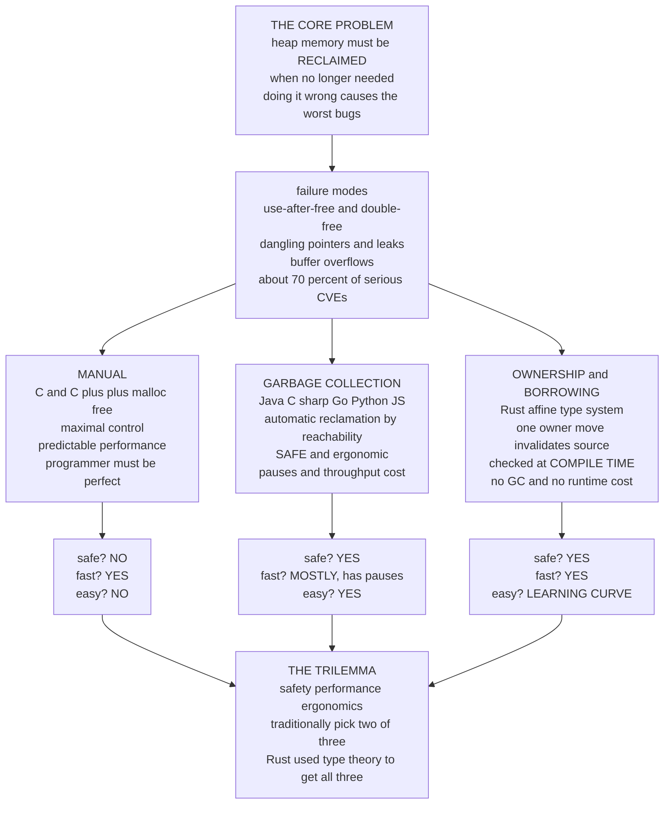

# 🧹 Memory and Ownership Models

> [!abstract] TL;DR
> Every program that uses the **heap** faces one unavoidable question: *when a piece of dynamically-allocated memory is no longer needed, who reclaims it, and how do we know it is truly unused?* Get this wrong and you produce the worst and most dangerous bugs in software — **use-after-free**, **double-free**, **dangling pointers**, **memory leaks**, **buffer overflows** — the class responsible for roughly **70% of serious security vulnerabilities**. A language's **memory model** is the design decision that determines *which of those bugs are even possible*. There are three great strategies: **manual** management (C/C++ `malloc`/`free` — maximal control and predictable speed, but the programmer must be perfect); **garbage collection** (Java/C#/Go/Python/JS — automatic reclamation by *reachability*, safe and easy but paying in pause latency, throughput, and memory headroom); and **ownership and borrowing** (Rust — an **affine type system** checked entirely at *compile time*: one owner, moving invalidates the source, borrowing lends temporary references under "many readers XOR one writer", proving memory *and* thread safety with **no garbage collector and no runtime overhead**). This is the classic **safety / performance / ergonomics trilemma** — traditionally you got two of three, until Rust used type theory to make the "impossible" third option real.

---

## Intuition

**Analogy — who washes the dishes?** A shared kitchen produces a steady stream of dirty dishes (heap allocations). Someone has to clean each one *exactly once* so the cupboard never fills with garbage and no one grabs a plate that's already been thrown away. There are three ways to run the kitchen.

1. **Wash your own the instant you're done (manual).** Fast and predictable — the plate is clean the moment you set it down, and nobody else is ever interrupted. But it is entirely on *you* to remember. Forget, and dirty plates pile up forever (a **leak**). Wash a plate twice by mistake and you shatter it (**double-free**). Grab a plate to eat off just after you tossed it in the bin (**use-after-free**). One slip anywhere and the kitchen is a hazard.

2. **A janitor periodically collects abandoned dishes (garbage collection).** You never wash anything — you just walk away, and every so often a janitor sweeps the whole kitchen, finds every dish no one is still holding, and cleans them all. You can *never* break a plate or eat off a discarded one, because *you* never throw anything away. The catch: when the janitor sweeps, **everyone freezes** until the sweep is done, and you need a bigger kitchen so dirty dishes have room to accumulate between sweeps.

3. **A strict rule: each dish has exactly ONE owner who must return it, checked at the door (ownership).** No janitor, and you don't have to remember to wash — but you must follow a rule the *doorkeeper enforces before you may even enter*: every plate has a single owner, handing a plate to a friend **transfers ownership** (you no longer hold it, and reaching for it again is caught at the door), and you may *lend* a plate to many people to look at **or** to one person to write on, never both at once. Obey the rule and cleanup is automatic, deterministic, and provably correct — with no janitor and no freezes. The price is learning the rule.

Manual is you-wash-your-own. GC is the janitor. Ownership is the doorkeeper's rule. **Every language picks one** — and that single choice shapes its safety, its speed, and who the language is *for*.

---

## How It Works

### The core problem

Stack memory is easy: allocations follow the call structure and are freed automatically when a function returns. The **heap** is where the trouble lives — objects whose lifetime does not match any single stack frame, that outlive the function that made them and are shared across the program. Heap memory must be **reclaimed when it is no longer reachable/needed**, and the language's memory model is precisely the machinery that answers *when* and *by whom*. Do it wrong and you get the canonical failure modes:

- **Use-after-free** — reading or writing memory that was already reclaimed; the bytes may now belong to something else, giving silent corruption or an exploit primitive.
- **Double-free** — freeing the same block twice, corrupting the allocator's bookkeeping.
- **Dangling pointer** — a pointer that outlives the thing it points to.
- **Memory leak** — memory that is never freed, so the process grows without bound.
- **Buffer overflow** — writing past an allocation's bounds, overwriting adjacent memory.

These are not merely bugs; they are the **dominant source of security vulnerabilities**. Microsoft and the Chromium team have both reported that ~**70%** of their serious CVEs are memory-safety issues. The memory model decides which of these are *possible at all*.

### Strategy 1 — Manual memory management

In C (`malloc`/`free`) and C++ (`new`/`delete`), the programmer explicitly requests and releases every allocation. This gives **maximal control and predictable, deterministic performance** — you know exactly when memory is reclaimed, there are no pauses, and you can hand-tune allocation for cache locality and real-time deadlines. The cost is that **correctness rests entirely on the programmer**: every allocation must have exactly one matching free, on every path, including error paths and early returns. Miss one and you leak; free twice and you corrupt; free too early and you dangle.

C++ mitigates this with **RAII** (Resource Acquisition Is Initialization): tie a resource's lifetime to a stack object whose *destructor* releases it, so cleanup runs automatically at scope exit even through exceptions. **Smart pointers** encode ownership in the type: `unique_ptr<T>` is a *move-only* single owner (an affine discipline in disguise — see [[Linear_Logic_and_Resource_Types]]), and `shared_ptr<T>` is **reference-counted** shared ownership. RAII is excellent discipline, but it is *discipline*, not a *guarantee*: raw pointers, `shared_ptr` cycles, and iterator invalidation still let the classic bugs through. The runtime mechanics of `malloc` — free lists, size classes, fragmentation — are covered in [[Memory_Management_and_Allocation_Runtime]].

### Strategy 2 — Garbage collection

A **garbage collector** reclaims memory *automatically* by determining which objects are still **reachable** from a set of roots (globals, stack, registers) and reclaiming everything else. The programmer never calls `free`. This makes an entire class of bugs **impossible by construction**: with no manual free there can be no double-free and no use-after-free, and dangling pointers vanish. GC powers **Java, C#, Go, Python, JavaScript, Haskell, OCaml, and more** — it is the default of modern high-level languages precisely because it is *safe and ergonomic*.

Two families of collector:

- **Tracing GC** — periodically traces reachability from the roots (mark-sweep, mark-compact, copying, generational, concurrent). It reclaims cycles naturally and is throughput-efficient, but classic collectors introduce **stop-the-world pauses**.
- **Reference counting** — each object tracks how many references point to it; at zero it is freed immediately (used by Python's primary mechanism and Swift's ARC). It is more incremental but **cannot reclaim cycles** on its own and adds per-assignment counter traffic.

GC's costs are real and shape where it is *unsuitable*: **pause times / tail latency** (a problem for interactive and low-latency systems), **throughput overhead**, **memory headroom** (a GC typically wants 2-5x the live-set size to run efficiently), and **non-deterministic finalization** (you cannot rely on *when* an object is collected, so GC is a poor fit for prompt release of non-memory resources like file handles or locks). Crucially, GC is a **poor fit for hard-real-time** systems where a pause could miss a deadline (see the real-time discussion in [[Real_Time_and_Embedded_Operating_Systems]]). The internals — mark-sweep vs generational vs concurrent collectors — are detailed in [[Garbage_Collection]].

### Strategy 3 — Ownership and borrowing

Rust's breakthrough is a **third way** that gets safety *and* performance with no garbage collector. It is an **affine type system** — a direct descendant of the linear/affine types of linear logic ([[Linear_Logic_and_Resource_Types]]) — enforced entirely at **compile time**:

1. **One owner.** Every value has exactly one owning binding. When the owner goes out of scope, the value's destructor (`Drop`) runs **exactly once** — automatic, deterministic cleanup with no runtime collector.
2. **Move semantics.** Assigning or passing a non-`Copy` value **moves** ownership; the source binding is *invalidated*. Touching it afterward is a **use-after-move compile error** — this is the affine "no copying" rule, statically enforced. There is no double-free because there is only ever one owner to run `Drop`.
3. **Borrowing.** You can lend *temporary references* without transferring ownership: `&T` shared/immutable, `&mut T` exclusive/mutable. The **borrow checker** enforces the invariant **"many readers XOR one writer"** — any number of `&T` *or* exactly one `&mut T`, never both simultaneously. This alone eliminates use-after-free (no reference may outlive its owner) *and* data races (no two threads can hold conflicting mutable access).
4. **Lifetimes.** The compiler tracks how long each reference is valid ([[Lifetimes]]) and rejects any reference that could outlive the data it points to — dangling references become **compile errors**.

The payoff is the [[Ownership_and_Borrowing|full ownership model]]: **the safety of GC with the performance of manual management**, verified before the program ever runs, with *zero* runtime overhead. Pure ownership is sometimes too rigid for shared or cyclic data, so Rust provides **escape hatches** — `Rc`/`Arc` (reference-counted shared ownership) and `RefCell`/`Mutex` (runtime-checked interior mutability), covered in [[Smart_Pointers]].

### The theoretical grounding

Ownership did not appear from nowhere. Its lineage is a clean **PLT-to-practice pipeline**: **affine/linear types** from Girard's linear logic ([[Linear_Logic_and_Resource_Types]]) provide the "use exactly once / at most once" discipline; **region-based memory management** (Tofte-Talpin's region calculus, and the *Cyclone* safe-C dialect) showed you could statically scope allocations into regions freed as a unit; and **separation logic** gave a way to reason formally about disjoint pieces of the heap. Rust synthesized these into an *engineering* system, and **RustBelt** (POPL 2018) later gave a machine-checked proof that the core discipline is sound.

### The safety-performance-ergonomics trilemma



Traditionally you picked **two of three**: manual gives performance and control but sacrifices safety; GC gives safety and ease but sacrifices predictable performance; ownership gives safety and performance but demands a learning curve (the famous "fighting the borrow checker"). Each language chose its corner based on *who it is for* — a systems language, a business-logic language, a scripting language.

---

## Key Concepts

**Secondary (explain to a curious beginner).**
- The heap is a shared pile of memory; each thing you take from it must be given back **exactly once**.
- Three ways to give it back: **do it yourself** (manual — easy to forget or do twice), a **helper cleans up automatically** (garbage collection — safe but pauses everyone), or a **strict one-owner rule the compiler checks** (ownership — safe and fast if you follow it).
- The scariest bugs — **using memory after it's freed**, **freeing it twice**, **forgetting to free it** — are exactly what a good memory model makes *impossible*.

**Undergraduate (requires a CS background).**
- **Manual:** deterministic and fast, but correctness is a manual proof obligation on every code path; RAII and `unique_ptr`/`shared_ptr` turn ownership into types but don't fully guarantee it.
- **GC:** reclamation by **reachability**; *tracing* (mark-sweep / copying / generational) reclaims cycles but pauses; *reference counting* is incremental but leaks cycles. Costs: pause latency, throughput, headroom, non-deterministic finalization.
- **Ownership:** an **affine** type discipline — one owner, move invalidates the source (use-after-move is a *compile error*), borrowing under **shared XOR mutable**, lifetimes bound reference validity. No collector, no runtime overhead.

**Graduate (system-level and foundational thinking).**
- Ownership is **affine types** made practical; its research ancestors are **region-based memory management** (Tofte-Talpin, Cyclone) and **separation logic** for heap reasoning; **RustBelt** proves the core sound.
- The **shared-XOR-mutable** invariant is simultaneously a memory-safety property *and* a data-race-freedom property — the same rule that stops dangling references stops data races, giving **"fearless concurrency"** (see [[Memory_Consistency_and_Concurrent_Data_Structures]]).
- The **trilemma** is not fundamental: Rust demonstrates that a sufficiently expressive *static* type system can recover the safety of a *dynamic* GC without its runtime cost — pushing the reclamation decision from run time to compile time. The frontier (Vale's *generational references*, Swift's ARC optimizations, Go's escape analysis + concurrent GC) explores the remaining hybrid design space.

---

## Python Demo

We model and **compare the three memory-management strategies** on the same synthetic allocation/deallocation workload. Part A measures **SAFETY**: we replay buggy programs through a `ManualHeap` that actually suffers use-after-free / double-free / leaks and count them, while GC (reachability) and OWNERSHIP (a tiny compile-time **move checker** that rejects use-after-move) produce **zero** such bugs *by construction*. Part B measures **PERFORMANCE**: we model per-operation latency — manual and ownership free deterministically (flat, low latency), while a tracing GC bump-allocates cheaply but incurs periodic **stop-the-world pauses** proportional to the live set. Part C plots the **safety-vs-performance-vs-ergonomics trilemma** as a radar chart. Pure stdlib + matplotlib (numpy optional).

```python
# ============================================================================
# COMPARING THREE MEMORY MODELS: manual vs garbage collection vs ownership.
# Same workload, three strategies:
#   MANUAL      -> programmer frees; CAN use-after-free / double-free / leak
#   GC          -> reachability reclaims; those bugs are IMPOSSIBLE (no free)
#   OWNERSHIP   -> compile-time move checker REJECTS use-after-move; drop is
#                  automatic and exactly once -> bugs impossible by construction
# Pure stdlib + matplotlib (no numpy required).
# ============================================================================

import random
import matplotlib.pyplot as plt

random.seed(7)

# ---------------------------------------------------------------------------
# PART A -- SAFETY: replay buggy programs and count bug classes per strategy.
# ---------------------------------------------------------------------------
# A "program" is a list of ops over object ids:
#   ("alloc", oid) ("use", oid) ("free", oid)  (manual model)
# We inject the three classic mistakes with some probability.

def make_buggy_program(n_objects=40, p_double=0.15, p_uaf=0.15, p_leak=0.15):
    prog = []
    for oid in range(n_objects):
        prog.append(("alloc", oid))
        for _ in range(random.randint(1, 3)):
            prog.append(("use", oid))
        leaked = random.random() < p_leak
        if not leaked:
            prog.append(("free", oid))
            if random.random() < p_double:          # free the same block twice
                prog.append(("free", oid))
            if random.random() < p_uaf:              # touch it after freeing
                prog.append(("use", oid))
    return prog                                      # order preserved: alloc before use


class ManualHeap:
    """A manual malloc/free heap that ACTUALLY suffers the classic bugs."""
    def __init__(self):
        self.live = set()      # currently allocated
        self.freed = set()     # already freed (freeing/using -> bug)
        self.bugs = {"use_after_free": 0, "double_free": 0, "leak": 0}

    def run(self, prog):
        for op, oid in prog:
            if op == "alloc":
                self.live.add(oid); self.freed.discard(oid)
            elif op == "use":
                if oid in self.freed:
                    self.bugs["use_after_free"] += 1
            elif op == "free":
                if oid in self.freed:
                    self.bugs["double_free"] += 1
                else:
                    self.live.discard(oid); self.freed.add(oid)
        self.bugs["leak"] = len(self.live)           # never freed -> leaked
        return self.bugs


def gc_bug_counts(prog):
    """GC: nobody calls free -> no uaf, no double-free; reachable set is
    reclaimed on collection -> no leaks. All three classes are ZERO."""
    return {"use_after_free": 0, "double_free": 0, "leak": 0}


# ---- The tiny OWNERSHIP CHECKER: tracks moves, rejects use-after-move -------
class OwnershipError(Exception):
    pass

def ownership_check(program):
    """Compile-time move/borrow checker (Rust-style).
    Statements:
      ("let",   x)          bind x to a fresh owned value
      ("move",  y, x)       move ownership x -> y ; x is now INVALID
      ("use",   x)          read x (requires x owns a live value)
      ("borrow",x)          shared read without consuming (repeatable)
    Returns (accepted, error_message).  Use-after-move -> compile error."""
    owner_live = {}          # var -> True if it currently owns a live value
    try:
        for stmt in program:
            kind = stmt[0]
            if kind == "let":
                owner_live[stmt[1]] = True
            elif kind == "move":
                dst, src = stmt[1], stmt[2]
                if not owner_live.get(src, False):
                    raise OwnershipError(f"move of invalid/moved value '{src}'")
                owner_live[src] = False              # source invalidated by move
                owner_live[dst] = True
            elif kind in ("use", "borrow"):
                x = stmt[1]
                if not owner_live.get(x, False):
                    raise OwnershipError(f"use-after-move: '{x}' was moved")
            else:
                raise ValueError(kind)
        return True, "accepted -- every value owned and used validly"
    except OwnershipError as e:
        return False, str(e)


# Demonstrate the checker accepting a safe program and REJECTING use-after-move
safe_prog = [("let", "a"), ("borrow", "a"), ("move", "b", "a"), ("use", "b")]
bad_prog  = [("let", "a"), ("move", "b", "a"), ("use", "a")]   # a moved into b!

print("=" * 70)
print("OWNERSHIP CHECKER (compile-time move checking)")
print("=" * 70)
for label, p in [("safe (move then use new owner)", safe_prog),
                 ("buggy (use after move)", bad_prog)]:
    ok, msg = ownership_check(p)
    print(f"  {label:34s} -> {'ACCEPT' if ok else 'REJECT'}: {msg}")

# Aggregate safety over many buggy workloads
manual_tot = {"use_after_free": 0, "double_free": 0, "leak": 0}
gc_tot     = {"use_after_free": 0, "double_free": 0, "leak": 0}
own_tot    = {"use_after_free": 0, "double_free": 0, "leak": 0}  # zero by construction
for _ in range(200):
    prog = make_buggy_program()
    for k, v in ManualHeap().run(prog).items():
        manual_tot[k] += v
    for k, v in gc_bug_counts(prog).items():
        gc_tot[k] += v

print("\nBUG COUNTS across 200 randomized workloads:")
print(f"  MANUAL   : {manual_tot}")
print(f"  GC       : {gc_tot}    (impossible: no manual free, reachability reclaims)")
print(f"  OWNERSHIP: {own_tot}    (impossible: move checker + automatic single Drop)")

# ---------------------------------------------------------------------------
# PART B -- PERFORMANCE: per-operation latency over an allocation timeline.
# ---------------------------------------------------------------------------
N_OPS = 600
ALLOC_COST = 1.0            # cheap bump/allocate everywhere
FREE_COST = 1.2            # deterministic free (manual & ownership drop)
GC_EVERY = 60              # GC triggers every 60 allocations
live_set = 0

manual_lat, own_lat, gc_lat = [], [], []
allocs_since_gc = 0
for t in range(N_OPS):
    is_alloc = (t % 3 != 0)                      # ~2/3 allocations, 1/3 frees
    if is_alloc:
        live_set += 1
        base = ALLOC_COST
    else:
        live_set = max(0, live_set - 1)
        base = FREE_COST
    # manual & ownership: deterministic, no pauses (ownership == manual speed)
    manual_lat.append(base)
    own_lat.append(base)
    # GC: allocation is cheap, but a periodic pause ~ proportional to live set
    g = ALLOC_COST if is_alloc else 0.2          # GC never pays explicit free
    if is_alloc:
        allocs_since_gc += 1
        if allocs_since_gc >= GC_EVERY:
            g += 3.0 + 0.15 * live_set           # STOP-THE-WORLD pause spike
            allocs_since_gc = 0
    gc_lat.append(g)

print(f"\nLATENCY summary (arb units):")
for name, lat in [("MANUAL", manual_lat), ("OWNERSHIP", own_lat), ("GC", gc_lat)]:
    worst = max(lat); avg = sum(lat) / len(lat)
    print(f"  {name:9s} avg={avg:5.2f}  worst-case(tail)={worst:6.2f}")

# ---------------------------------------------------------------------------
# VISUALIZATION
# ---------------------------------------------------------------------------
fig = plt.figure(figsize=(15, 5))

# (1) SAFETY: bug counts per strategy
ax1 = fig.add_subplot(1, 3, 1)
classes = ["use_after_free", "double_free", "leak"]
x = range(len(classes))
w = 0.26
ax1.bar([i - w for i in x], [manual_tot[c] for c in classes], w,
        label="Manual", color="#C44E52")
ax1.bar([i for i in x],     [gc_tot[c] for c in classes], w,
        label="GC", color="#4C72B0")
ax1.bar([i + w for i in x], [own_tot[c] for c in classes], w,
        label="Ownership", color="#2E8B57")
ax1.set_xticks(list(x)); ax1.set_xticklabels(["use-after\n-free", "double\n-free", "leak"])
ax1.set_ylabel("bugs across 200 workloads")
ax1.set_title("SAFETY: only Manual admits bugs\n(GC & Ownership = 0 by construction)")
ax1.legend()

# (2) PERFORMANCE: latency timeline (GC pauses vs flat deterministic freeing)
ax2 = fig.add_subplot(1, 3, 2)
ax2.plot(gc_lat, color="#4C72B0", lw=1.0, label="GC (pause spikes)")
ax2.plot(own_lat, color="#2E8B57", lw=1.4, label="Ownership / Manual (flat)")
ax2.set_xlabel("operation #"); ax2.set_ylabel("latency (arb units)")
ax2.set_title("PERFORMANCE: GC stop-the-world pauses\nvs deterministic freeing")
ax2.legend(loc="upper right")

# (3) TRILEMMA: radar chart of safety / performance / ergonomics
import math
axes_labels = ["Safety", "Performance", "Ergonomics"]
scores = {
    "Manual":    [2, 9, 3],   # unsafe, fast, hard
    "GC":        [9, 6, 9],   # safe, pauses, easy
    "Ownership": [10, 9, 5],  # safe, fast, learning curve
}
colors = {"Manual": "#C44E52", "GC": "#4C72B0", "Ownership": "#2E8B57"}
K = len(axes_labels)
angles = [n / K * 2 * math.pi for n in range(K)] + [0.0]
ax3 = fig.add_subplot(1, 3, 3, polar=True)
for name, vals in scores.items():
    v = vals + vals[:1]
    ax3.plot(angles, v, color=colors[name], lw=2, label=name)
    ax3.fill(angles, v, color=colors[name], alpha=0.12)
ax3.set_xticks(angles[:-1]); ax3.set_xticklabels(axes_labels)
ax3.set_ylim(0, 10)
ax3.set_title("THE TRILEMMA\n(pick two... or use type theory)", pad=18)
ax3.legend(loc="upper right", bbox_to_anchor=(1.25, 1.10))

fig.suptitle("Manual vs Garbage Collection vs Ownership: safety, performance, ergonomics",
             fontsize=13)
fig.tight_layout()
plt.savefig("memory_models_comparison.png", dpi=120)
print("\nSaved plot to memory_models_comparison.png")
```

**What it shows.** The printed report is the punchline: the ownership checker **accepts** a program that moves a value and then uses the *new* owner, but **rejects** `use-after-move` with a compile error — exactly Rust's borrow checker. Across 200 randomized buggy workloads, the `ManualHeap` racks up hundreds of **use-after-free**, **double-free**, and **leak** events, while **GC** and **OWNERSHIP** both report **zero** — GC because nobody calls `free` and reachability reclaims everything, ownership because the move checker rejects the bug at compile time and a single automatic `Drop` runs exactly once. The latency plot contrasts the **flat, low-latency deterministic freeing** of manual/ownership against **GC's periodic stop-the-world spikes** that scale with the live set — the tail-latency cost that rules GC out of hard-real-time. The radar chart makes the **trilemma** visual: Manual maximizes performance but collapses on safety and ergonomics; GC maximizes safety and ergonomics but dips on performance; Ownership reaches safety *and* performance, paying only in the ergonomics of a learning curve — the "impossible" corner that type theory made real.

---

## Real-World Applications

> **Rust in production — Firefox, Linux, and cloud infrastructure.** Mozilla's **Servo/Stylo** parallel CSS engine (shipped in Firefox) replaced C++ with Rust to get data-race-free parallelism the borrow checker *guarantees*; the **Linux kernel** now accepts Rust drivers specifically to eliminate memory-safety CVEs in new code; AWS built **Firecracker** (the microVM behind Lambda/Fargate) and Cloudflare rebuilt core proxy paths in Rust for safety *without* GC pauses. In every case the draw is the same: the safety of GC with the performance of C, verified at compile time.

- **Memory safety as a security imperative.** With ~70% of serious CVEs being memory-safety bugs, the U.S. **NSA**, **CISA**, and the White House **ONCD** have publicly urged industry to adopt **memory-safe languages**. Both GC *and* ownership eliminate whole vulnerability classes (use-after-free, buffer overflow) that plague the C/C++ legacy — see [[OS_Security_and_Isolation]] and the exploitation angle in [[Exploitation_Techniques]].
- **Garbage-collected platforms at scale.** The JVM (Java/Kotlin/Scala), the .NET CLR (C#), Go, and V8 (JS) all bet on GC for developer velocity, and now ship **low-pause concurrent collectors** (ZGC, Shenandoah, Go's concurrent GC) to tame the tail-latency cost for interactive services.
- **Reference counting as a middle ground.** Swift's **ARC** and C++'s `shared_ptr` reclaim deterministically and incrementally without a tracing collector — at the cost of **retain/release traffic** and **cycle leaks** (broken with `weak` references). Python uses refcounting *plus* a cycle collector.
- **Hybrid and escape-hatch designs.** **Go** combines a concurrent GC with **escape analysis** (see [[Go_Pointers_and_Memory]]) so many allocations stay on the stack; **Rust** offers `Rc`/`Arc`/`RefCell` ([[Smart_Pointers]]) for the genuinely shared or cyclic data that pure ownership cannot express; research systems like **Vale** explore *generational references* for safety without a borrow checker's ergonomic cost.
- **Fearless concurrency.** Because Rust's **shared-XOR-mutable** rule is enforced across threads too, whole classes of **data races** become compile errors — the same ownership machinery that guarantees memory safety guarantees thread safety (see [[Rust_Threads]] and [[Memory_Consistency_and_Concurrent_Data_Structures]]).

---

## Common Pitfalls

- **Believing GC means "no memory bugs".** GC kills use-after-free and double-free, but **logical leaks** (unbounded caches, listener lists, lapsed references you never null out) still grow the heap, and **non-deterministic finalization** means you *must not* rely on GC to promptly close files, sockets, or locks — use explicit `close`/`try-with-resources`/`using`/`defer`.
- **Assuming reference counting handles cycles.** Naive refcounting (`shared_ptr`, Swift ARC) **leaks reference cycles** forever; you must break them with **weak references**. Only a tracing collector or a cycle detector reclaims cycles automatically.
- **Treating manual RAII as a guarantee.** RAII and `unique_ptr` are *discipline*, not proof — raw pointers, `shared_ptr` misuse, iterator invalidation, and use-after-move on a moved-from C++ object all still compile and crash. C++ move leaves a "valid but unspecified" husk; touching it is a lurking bug that Rust makes a *compile error*.
- **"Fighting the borrow checker" by reaching for `unsafe` / `Rc<RefCell<T>>` too early.** Most borrow-checker rejections signal a genuine aliasing/lifetime problem; papering over them with `unsafe` or pervasive `Rc<RefCell>` recreates the very bugs (or runtime `borrow` panics) that ownership was meant to prevent. Restructure ownership first.
- **Choosing GC for hard-real-time or tight-memory targets.** A stop-the-world pause can miss a deadline, and GC's need for **2-5x headroom** is fatal on constrained embedded devices. Deterministic reclamation (manual or ownership) is the right tool there — GC is for throughput-oriented, latency-tolerant workloads.
- **Confusing "safe" with "no overhead".** GC buys safety with runtime cost (pauses, headroom, throughput); ownership buys the *same* safety with *compile-time* cost (analysis time + a learning curve) and no runtime penalty. Know which budget you are spending.

---

## Related Concepts

- [[Linear_Logic_and_Resource_Types]] — the theoretical parent: ownership *is* an affine type discipline (use at most once, move consumes, `Copy` is the `!` exponential).
- [[Ownership_and_Borrowing]] — Rust's model in full detail: one owner, move semantics, and the "shared XOR mutable" borrow rule enforced by the borrow checker.
- [[Lifetimes]] — the static analysis that makes *borrowing* sound by proving no reference outlives the data it points to.
- [[Smart_Pointers]] — `Box`/`Rc`/`Arc`/`RefCell`: the escape hatches for shared and cyclic data that pure ownership cannot express.
- [[Rust_Threads]] — how the same ownership rules deliver data-race freedom, i.e. "fearless concurrency".
- [[Garbage_Collection]] — the internals of automatic reclamation: tracing vs refcounting, generational and concurrent collectors, and the pause/throughput tradeoffs.
- [[Memory_Management_and_Allocation_Runtime]] — the runtime mechanics of `malloc`/`free`, free lists, size classes, and fragmentation that manual management exposes.
- [[OS_Security_and_Isolation]] — why memory-safety bugs are the dominant exploitation primitive, and how the OS defends against them.
- [[Exploitation_Techniques]] — how use-after-free and buffer overflows are turned into working exploits, motivating memory-safe languages.
- [[Memory_Consistency_and_Concurrent_Data_Structures]] — the concurrency backdrop where the shared-XOR-mutable rule also prevents data races.
- [[Real_Time_and_Embedded_Operating_Systems]] — why GC pauses make garbage collection unsuitable for hard-real-time deadlines.
- [[Go_Pointers_and_Memory]] — Go's hybrid: escape analysis to stack-allocate plus a concurrent GC for the rest.

*(Vault siblings referenced in prose, not yet built: `Language_Design_Principles`, `Concurrency_and_Process_Calculi`, `The_Future_of_Programming_Languages`.)*

---

## Review Questions

1. **(Secondary)** Using the dishwashing analogy, explain the single biggest advantage and the single biggest disadvantage of (a) washing your own dishes immediately, (b) letting a janitor sweep periodically, and (c) the one-owner-must-return-it rule. For each, name the real memory-management strategy it represents and one real language that uses it.
2. **(Undergraduate)** A team writes a low-latency trading service and finds that occasional multi-millisecond GC pauses blow their p99 latency budget. (a) Explain *why* a tracing GC produces these pauses and how the pause relates to the live-set size. (b) They consider switching the hot path to Rust. Explain precisely how ownership achieves the *same* memory safety as GC *without* those pauses — what happens at compile time vs run time. (c) What new cost does the team take on by making this switch?
3. **(Graduate)** The "safety / performance / ergonomics trilemma" claims you can traditionally pick only two. (a) Place manual C++, Java-with-GC, and Rust at their corners and justify each placement. (b) Rust is called *affine* rather than strictly *linear* — which structural rule does it keep, and why does keeping it make destructors run exactly once? (c) Rust's borrow rule "many readers XOR one writer" is simultaneously a memory-safety property and a concurrency property. Explain how one invariant delivers *both* dangling-reference prevention and data-race freedom, and why that unification is the essence of "fearless concurrency".

---

## Sources

- Nicholas D. Matsakis and Felix S. Klock II, "The Rust Language," *ACM SIGAda Ada Letters* / HILT 2014 — the design rationale for ownership, borrowing, and memory safety without GC. <https://doi.org/10.1145/2692956.2663188>
- Ralf Jung, Jacques-Henri Jourdan, Robbert Krebbers, Derek Dreyer, "RustBelt: Securing the Foundations of the Rust Programming Language," *POPL 2018* — a machine-checked soundness proof of Rust's ownership discipline. <https://plv.mpi-sws.org/rustbelt/popl18/>
- Mads Tofte and Jean-Pierre Talpin, "Region-Based Memory Management," *Information and Computation* 132(2), 1997 — the region-calculus ancestor of static, scope-based reclamation. <https://doi.org/10.1006/inco.1996.2613>
- Richard Jones, Antony Hosking, Eliot Moss, *The Garbage Collection Handbook: The Art of Automatic Memory Management*, 2nd ed., CRC Press, 2023 — the definitive reference on tracing vs refcounting, generational and concurrent collectors. <https://gchandbook.org/>
- Gavin Thomas (Microsoft Security Response Center), "A proactive approach to more secure code," 2019, and the Chromium project's memory-safety analyses — sources for the ~70% memory-safety-CVE figure. <https://msrc.microsoft.com/blog/2019/07/a-proactive-approach-to-more-secure-code/>

---

#programming-language-theory #memory-management #ownership #borrow-checker #garbage-collection
