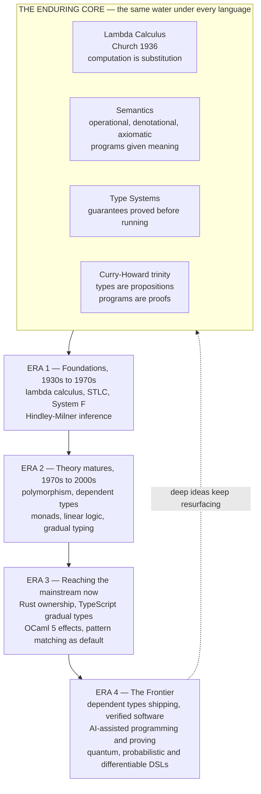

# 🔮 The Future of Programming Languages

> [!abstract] TL;DR
> This is the **capstone** of the Programming Language Theory vault — the note that ties the whole journey together and points at what comes next. The through-line is startlingly stable: for ninety years the *same handful of ideas* — **the lambda calculus** as the bedrock of computation, **semantics** giving programs meaning, **type systems** providing guarantees, and the **Curry-Howard** unity of logic, computation, and category theory — keep resurfacing in new clothes. The future is not a break from that lineage; it is those deep 1930s-to-1970s ideas *finally reaching the mainstream*: **ownership and affine types** (Rust) delivering memory safety without a garbage collector, **effect systems** (OCaml 5, Koka) making side effects visible and composable, **gradual typing** (TypeScript) bridging static and dynamic at industrial scale, and **dependent types and verification** (Lean 4, F*, CompCert, seL4) shipping *correct-by-construction* infrastructure. The single biggest shift is **AI writing the code**: LLMs change what languages are *for*, and the likely answer is that **strong types and formal specs matter more, not less** — as guardrails, contracts, and checkers for machine-generated code. The pattern beneath everything is the **research-to-practice lag**: PLT ideas take *decades* to travel from a paper to a language you use — and that pipeline is accelerating. Learn to see the lambda calculus in every language, and you can help shape what comes next.

---

## Intuition

**Analogy — the same rivers, wider deltas.** Imagine standing at the mouth of a great river system and being told its geography was fixed in the 1930s. The headwaters are a single spring — **Church's lambda calculus**, 1936 — and almost everything downstream is that same water, redirected. **Types** are the levees that keep the flood in its channel; **semantics** is the science of where the water actually goes; **Curry-Howard** is the discovery that this river and a completely different-looking river (formal logic) were the *same water all along*. What changes over the decades is not the source — it is which fields the river finally *reaches*. For fifty years, ownership types, dependent types, and effect systems ran only through the narrow academic channels. What we call "the future" is mostly those channels *finally flooding the mainstream delta*: the same water, now watering Rust, TypeScript, Swift, and Lean.

Put in engineering terms: the future of programming languages is **less about inventing new ideas than about industrializing old ones** — and now, for the first time, about an *AI* that writes the code while the type system keeps it honest. Every "new" language feature you will meet — pattern matching, `async/await`, the borrow checker, refinement types, algebraic effects — is a PLT idea from decades ago arriving at scale. Intuition first: *the frontier is the past, delivered.*

---

## How It Works

This note is a synthesis, so "how it works" means **how the whole subject fits together and where its arrow points**. Read it as the map of the vault you have just traversed, folded forward into the frontier.

### 1. The enduring core (recap the through-line)

Four ideas from the 1930s-70s still underlie *every* modern language, and they keep being rediscovered:

- **The lambda calculus is the computational bedrock.** Variables, abstraction `λx. e`, application `e₁ e₂` — nothing else — and yet it is Turing-complete. Every closure, every first-class function, every functional core of every language is this calculus wearing a costume. See [[The_Lambda_Calculus]], [[Church_Encodings_and_Computability]], [[Combinatory_Logic_and_Fixed_Points]], and [[Reduction_Strategies_and_Evaluation_Order]].
- **Semantics gives programs meaning.** Whether **operationally** (step-by-step rewriting), **denotationally** (the mathematical object a program *is*), or **axiomatically** (what you can *prove* about it via Hoare logic), semantics is how we say precisely what code *means* before we trust it. See [[Operational_Semantics]], [[Denotational_Semantics]], [[Axiomatic_Semantics_and_Hoare_Logic]], [[Domain_Theory_and_Fixed_Points]], and [[Contextual_Equivalence_and_Reasoning]].
- **Type systems provide guarantees.** A type system is a *decidable, static proof method* — Milner's "well-typed programs don't go wrong," made real by **progress + preservation**. The type-system *ladder* climbs from simply-typed to polymorphic to dependent. See [[Type_Systems_Fundamentals]], [[Simply_Typed_Lambda_Calculus]], [[Polymorphism_and_System_F]], [[Type_Inference_and_Unification]], [[Subtyping_and_Variance]], and [[Dependent_Types_and_Advanced_Type_Systems]].
- **Curry-Howard unites logic, computation, and category theory.** *Propositions are types, proofs are programs, and running a program is normalizing a proof.* Lambek's extension makes it a **trinity**: logic ≅ type theory ≅ cartesian-closed categories. This is why proof assistants *are* programming languages. See [[The_Curry_Howard_Correspondence]], [[Intuitionistic_Logic_and_Constructive_Proofs]], [[Natural_Deduction_and_Sequent_Calculus]], [[Linear_Logic_and_Resource_Types]], [[Homotopy_Type_Theory]], and [[Proof_Assistants_and_Dependent_Type_Theory]].

These four are the water in the river. Everything below is where it flows next.

### 2. The research-to-practice lag (the striking pattern)

The single most reliable fact about PLT is that **its ideas take decades to reach industry**:

- **Lambda calculus (1936)** → first-class closures mainstream in **Java 8 (2014)** — a 78-year lag.
- **Hindley-Milner inference (1970s)** → type inference *everywhere* now (`auto` in C++, `var`, Go, Swift).
- **Parametric polymorphism / System F (1974)** → **Java 5 generics (2004)**.
- **Linear / affine types (Girard 1987, Wadler 1990)** → **Rust ownership (2015)**.
- **Monads (Moggi 1991)** → `async/await`, promises, LINQ, Rust's `?`.
- **Gradual typing (Siek-Taha 2006)** → **TypeScript's** dominance across the JavaScript world.
- **Dependent types (Martin-Löf 1972)** → refinement types in industry and **Lean 4** as a real programming language, only now.

The pipeline runs *paper → prototype language → niche adoption → mainstream default* — and it is **accelerating**: gradual typing crossed in under a decade where garbage collection and polymorphism took thirty-plus years. The forthcoming siblings `Memory_and_Ownership_Models` and `Gradual_and_Optional_Typing` drill into two of the fastest recent crossings.

### 3. The current frontier reaching the mainstream

What used to be exotic is becoming the *default*:

- **Ownership and affine types** (Rust) mainstream memory safety with **no garbage collector** — linear logic turned into a borrow checker.
- **Effect systems and algebraic effects** (OCaml 5, Koka) make side effects **visible in the type** and **composable** where monads famously do not stack. `async/await` is itself an effect. See [[Monads_and_Effects]]; forthcoming sibling `Effect_Systems_and_Program_Analysis`.
- **Gradual / optional typing** (TypeScript, Python type hints, mypy) bridges static and dynamic at scale, letting billion-line dynamic codebases add types incrementally.
- **Sum types + pattern matching + immutability** are becoming *new defaults* — Rust, Swift, Kotlin, and even Python's `match` (3.10) inherit the ML tradition; see [[Functional_Programming_Foundations]] and, for the contrasting lineage, [[Object_Oriented_Language_Theory]].

### 4. Dependent types and verification going practical

"Correct by construction" is leaving the lab:

- **Refinement types** (LiquidHaskell, F*) attach logical predicates to ordinary types and discharge them with an SMT solver.
- **Dependently-typed programming** (Idris, **Lean 4** used as a general-purpose language) lets a type *mention a value* — "a vector of length `n`," or an entire specification.
- **Verified software is shipping**: **CompCert** (a C compiler proven correct), **seL4** (a formally verified OS kernel), and verified cryptography (HACL*, Project Everest) now run in production browsers and infrastructure. See [[Dependent_Types_and_Advanced_Type_Systems]], [[Proof_Assistants_and_Dependent_Type_Theory]], and the compiler-side [[Formal_Semantics_and_Verified_Compilers]]; forthcoming sibling `Verified_and_Certified_Languages`.

### 5. AI and programming languages (the biggest shift)

LLMs writing code change what languages are *for*:

- **Types and specs as guardrails.** When a machine drafts the code, the human's job shifts to *specifying* and *checking*. Strong static types and schemas become the **contract** that constrains AI output — see [[Structured_Output]] (schemas/types forcing well-formed model output) and [[DSPy]] (programming, not prompting, LLM pipelines). The provocative claim of this note: **types matter *more* in an AI world, not less.**
- **AI-assisted proving and autoformalization.** Pairing **Lean** with AI (DeepMind's **AlphaProof**) produced IMO-medal-level formal proofs — the proof assistant checks what the model conjectures. See [[Chain_of_Thought]], [[GPT_Family]], and [[LLM_Architecture_Deep_Dive]].
- **Neural program synthesis.** From Codex to modern coding agents, the open question is whether future "languages" are *natural-language prompts + verification*, or whether **rigid, checkable types** become the indispensable substrate that makes AI-generated code trustworthy. The honest bet is *co-evolution*: AI raises the value of formal methods precisely because it removes the human who used to catch the bugs.

### 6. New and domain-specific paradigms

The frontier is also *fragmenting* productively into domain languages:

- **Probabilistic programming** (Stan, Pyro) treats inference as a language feature for ML and statistics.
- **Quantum programming** (Q#, Qiskit) needs **linear types** because qubits obey the no-cloning theorem — you literally cannot copy a value. See [[Measurement_and_the_No_Cloning_Theorem]] and [[Quantum_Computing_Overview]].
- **Differentiable programming and tensor/array DSLs** make gradients and hardware kernels first-class; see the compiler-side [[Compilers_for_Machine_Learning]] and [[Domain_Specific_Languages]].
- **Smart-contract languages** and a general **proliferation of DSLs** show the future is *many* small, verified languages, not one universal one.

### 7. Concurrency and distribution as first-class

The multicore and distributed reality is reshaping design: **structured concurrency**, **session types** (types that describe a *protocol*), and **actor models** are moving concurrency from a library afterthought into the language and its type system. The forthcoming sibling `Concurrency_and_Process_Calculi` develops the process-calculus foundations.

### 8. The deep ideas that persist

Underneath every era, the same principles recur:

- **Propositions-as-types** and **programs-as-proofs** (Curry-Howard) — verification and programming are one activity.
- **Interpretation and compilation are one spectrum** (the **Futamura projections**): specializing an interpreter against a program *is* compiling it. See [[The_Future_of_Compilers]] and [[Compilers_Overview]].
- **Parametricity** — "theorems for free": a polymorphic type constrains behavior so tightly you can derive theorems from the *type alone*.
- **"Make illegal states unrepresentable"** — encode invariants in types so the bad program *cannot be written*. This is the practical face of the whole subject, and it is exactly what AI-generated code most needs.

### 9. Language-design wisdom carried forward

The forthcoming sibling `Language_Design_Principles` distills the eternal tradeoffs: **simplicity vs power**, static guarantees vs flexibility, the **social and ecosystem reality** (a language lives or dies by its libraries and tooling, not its type theory), and the discipline of **learning from history** rather than rediscovering it. No single language wins; the trend is **multi-paradigm convergence**.

### Flow / Architecture — the arc, with the core persisting underneath



---

## Key Concepts

**Secondary (explain to a curious beginner).**
- Almost every "new" feature in a modern language is actually an **old idea** from a research paper that finally became practical — the future of languages is mostly the *past, delivered*.
- A **type** is a promise a computer checks *before* running your code; over time, languages let you make **stronger promises** (from "this is a number" all the way to "this list is never empty").
- **AI can now write code**, so the human's job shifts toward *saying clearly what the code should do* and letting the language *check* it — which makes types and specifications *more* useful, not less.

**Undergraduate (requires a CS background).**
- **The research-to-practice lag**: name the pipeline paper → prototype → niche → mainstream, and cite examples (System F → Java generics; linear types → Rust; gradual typing → TypeScript).
- **Affine/linear types** underlie Rust's borrow checker; **algebraic effects** generalize monads to compose side effects; **gradual typing** soundly mixes static and dynamic code.
- **"Make illegal states unrepresentable"** — using sum types and rich types so bad programs *fail to compile* rather than fail at runtime.
- **Refinement types** attach a logical predicate to a type and discharge it with an SMT solver, bringing lightweight verification to ordinary code.

**Graduate (system-level and foundational thinking).**
- **Dependent type theory** and the propositions-as-types program let a single artifact be both a program and a machine-checked proof (Coq, Agda, **Lean 4**); verified systems like **CompCert** and **seL4** ship this.
- **The Futamura projections** collapse interpretation and compilation into one spectrum; **parametricity** yields free theorems; both are consequences of the deep logical structure of types.
- **Co-evolution of AI and PL**: whether formal specifications and types become the *contract layer* for machine-generated code, and why removing the human debugger *raises* the marginal value of soundness and verification.
- **Session types** and process calculi lifting concurrency protocols into the type system as the multicore/distributed reality becomes the default design constraint.

---

## Python Demo

A **synthesis visualization** of the vault's central thesis. We plot (1) an **idea-diffusion timeline**: for each landmark PLT idea, the year it was *invented* (a paper) versus the year it reached the *mainstream* (a widely used language) — exposing the multi-decade research-to-practice lag; and (2) the **rising expressiveness/safety of popular type systems over time**, with a least-squares trend line computed in pure Python. Together they make the argument visual: *ideas keep migrating from theory to industry, and the languages we use keep absorbing stronger guarantees.*

```python
# The vault's thesis, in one figure:
#   PANEL 1 — PLT ideas: year INVENTED (a paper) vs year MAINSTREAM (a language).
#   PANEL 2 — type-system expressiveness/safety of popular languages, rising over time.
# Pure standard library + matplotlib (no numpy needed).
import matplotlib.pyplot as plt
from matplotlib.lines import Line2D

# --- DATA 1: (idea, invented_year, mainstream_year, mainstream_vehicle) ---
ideas = [
    ("Lambda calculus / closures",         1936, 2014, "Java 8 lambdas"),
    ("Garbage collection",                 1959, 1995, "Java"),
    ("Dependent types",                    1972, 2021, "Lean 4, F* in industry"),
    ("Parametric polymorphism (System F)", 1974, 2004, "Java 5 generics"),
    ("Algebraic data types + matching",    1977, 2021, "Rust, Swift, Python match"),
    ("Hindley-Milner inference",           1978, 2010, "C++ auto, Go, Swift"),
    ("Linear / affine types",              1987, 2015, "Rust ownership"),
    ("Type classes",                       1989, 2015, "Rust traits, Swift protocols"),
    ("Monads for effects",                 1991, 2012, "async/await, LINQ"),
    ("Gradual / optional typing",          2006, 2013, "TypeScript"),
    ("Algebraic effect handlers",          2009, 2022, "OCaml 5, Koka"),
]
ideas.sort(key=lambda r: r[1])                      # oldest invention first
lags = [m - i for (_, i, m, _) in ideas]
avg_lag = sum(lags) / len(lags)
worst = ideas[lags.index(max(lags))][0]
print(f"average research-to-practice lag: ~{avg_lag:.0f} years")
print(f"longest lag: {max(lags)} years  ({worst})")
print(f"shortest lag: {min(lags)} years")

# --- DATA 2: (language, release_year, type-expressiveness score 1..10) ---
langs = [
    ("C", 1972, 2), ("C++", 1985, 4), ("Python", 1991, 3), ("Haskell", 1990, 8),
    ("Java", 1995, 4), ("OCaml", 1996, 8), ("Scala", 2004, 8), ("Go", 2009, 5),
    ("Idris", 2011, 10), ("TypeScript", 2012, 6), ("Swift", 2014, 7),
    ("Rust", 2015, 9), ("Lean 4", 2021, 10),
]
xs = [y for (_, y, _) in langs]
ys = [s for (_, _, s) in langs]
n = len(xs)
mx, my = sum(xs) / n, sum(ys) / n                   # least-squares fit, no numpy
slope = sum((x - mx) * (y - my) for x, y in zip(xs, ys)) / sum((x - mx) ** 2 for x in xs)
intercept = my - slope * mx
print(f"expressiveness trend: +{slope * 10:.2f} points per decade")

# --- PLOT ---
fig, (ax1, ax2) = plt.subplots(2, 1, figsize=(13, 12),
                               gridspec_kw={"height_ratios": [1.35, 1]})

# Panel 1: idea diffusion (theory dot -> industry dot, gap = the lag)
for row, (name, inv, main, vehicle) in enumerate(ideas):
    ax1.plot([inv, main], [row, row], color="#B0B0B0", lw=2, zorder=1)
    ax1.scatter([inv],  [row], s=130, color="#4C72B0", zorder=3)   # invented
    ax1.scatter([main], [row], s=130, color="#C44E52", zorder=3)   # mainstream
    ax1.text(inv - 1.5, row, name, ha="right", va="center", fontsize=9)
    ax1.text((inv + main) / 2, row + 0.28, f"{main - inv} yr",
             ha="center", va="bottom", fontsize=8, color="#555")
    ax1.text(main + 1.5, row, vehicle, ha="left", va="center", fontsize=8, color="#C44E52")
ax1.axvline(2026, ls=":", color="#333", lw=1)
ax1.text(2026, len(ideas) - 0.3, " today", fontsize=9, color="#333")
ax1.set_ylim(-1.2, len(ideas)); ax1.set_xlim(1918, 2058); ax1.set_yticks([])
ax1.set_xlabel("year")
ax1.set_title("The research-to-practice lag: PLT ideas take DECADES to reach the mainstream",
              fontsize=12, fontweight="bold")
ax1.legend(handles=[
    Line2D([0], [0], marker="o", color="w", markerfacecolor="#4C72B0",
           markersize=11, label="invented (a paper)"),
    Line2D([0], [0], marker="o", color="w", markerfacecolor="#C44E52",
           markersize=11, label="reached the mainstream (a language)"),
], loc="lower right", fontsize=9)
ax1.text(1922, -0.8, f"average lag ~ {avg_lag:.0f} years",
         fontsize=10, style="italic", color="#333")

# Panel 2: type-system expressiveness rising over time
ax2.scatter(xs, ys, s=90, color="#55A868", zorder=3)
for name, yr, sc in langs:
    ax2.text(yr, sc + 0.2, name, ha="center", va="bottom", fontsize=8.5)
tx = [min(xs) - 2, max(xs) + 2]
ax2.plot(tx, [slope * x + intercept for x in tx], "--", color="#8172B3",
         lw=2, label=f"trend: +{slope * 10:.1f} pts / decade")
ax2.set_xlabel("language release year")
ax2.set_ylabel("type-system expressiveness / static safety  (1-10)")
ax2.set_ylim(0, 11)
ax2.set_title("Popular languages keep adopting stronger type systems over time",
              fontsize=12, fontweight="bold")
ax2.legend(loc="lower right", fontsize=9)
ax2.grid(alpha=0.25)

fig.suptitle("From theory to practice: how PLT ideas diffuse into the languages we use",
             fontsize=14, fontweight="bold")
fig.tight_layout(rect=[0, 0, 1, 0.98])
plt.show()   # or: fig.savefig("pl_evolution.png", dpi=120)
```

Typical console output:

```
average research-to-practice lag: ~40 years
longest lag: 78 years  (Lambda calculus / closures)
shortest lag: 7 years
expressiveness trend: +1.08 points per decade
```

The figure makes the vault's argument at a glance: the top panel's long grey bars are *decades of latency* between a theorem and the language on your laptop, and the bottom panel's upward trend line is those theorems steadily raising the floor of what a mainstream type system guarantees.

---

## Real-World Applications

> **Rust in the Linux kernel and Android.** Affine/linear type theory from **1987** became a borrow checker that ships in the Linux kernel, Android, and Firefox — eliminating whole classes of memory-safety CVEs at *compile time, zero runtime cost*. This is the research-to-practice lag closing in production.

- **TypeScript everywhere.** Gradual typing (2006 theory) is now the default way to write large-scale JavaScript — Microsoft, Google, and virtually every major web codebase — because it lets dynamic code adopt static guarantees incrementally.
- **Verified infrastructure.** **CompCert** (proven-correct C compiler) is used in avionics; **seL4** (verified microkernel) runs in defense and automotive; **HACL*** verified crypto ships in Firefox and the Linux kernel. Curry-Howard, in production.
- **AI coding + type checkers.** Modern coding assistants generate code that is immediately fed through the language's type checker and test suite — the type system is the **automated reviewer** for machine output. Structured-output schemas (see [[Structured_Output]]) apply the same idea to constrain LLM responses to a *type*.
- **AI-assisted formal proof.** DeepMind's **AlphaProof** pairs an LLM with the **Lean** proof assistant to solve olympiad problems with machine-checked proofs — a preview of autoformalization where AI proposes and a dependent type checker disposes.
- **Quantum and probabilistic DSLs.** Q#/Qiskit encode the no-cloning theorem via linear typing; Stan/Pyro make Bayesian inference a language primitive — domain languages are proliferating, each with a type discipline fitted to its domain.

---

## Common Pitfalls

- **"AI will make languages obsolete."** The opposite is more likely: when a machine writes the code, the value of a *checkable specification* rises, because the human who used to catch bugs by reading is gone. Types and formal methods become the trust layer, not a legacy tax.
- **Chasing novelty over lineage.** Believing each new language invents fundamentally new ideas. Almost every headline feature is a decades-old PLT result finally productized — mistaking delivery for invention blinds you to where the *next* features are already sitting (in today's papers).
- **Confusing "expressive types" with "correct programs."** A dependent type system lets you *state* strong specifications, but you must still *write* the right specification. Types rule out categories of bugs, never all of them — a precise spec of the wrong behavior is still verifiably wrong.
- **Assuming stronger types are always worth it.** Full dependent typing and verification carry real costs in effort and proof burden. The design frontier is *gradualism* — pay for guarantees where they matter (a kernel, a crypto core, an AI-generated module) and stay lightweight elsewhere.
- **Treating verified = trustworthy without reading the spec.** "Verified" means "the implementation matches *this* specification and *these* assumptions." seL4 is proven correct *relative to* its spec and hardware model; the guarantee is only as good as what was specified.
- **Ignoring the ecosystem.** A theoretically superior language with poor tooling, libraries, and community loses to a weaker one with a thriving ecosystem. Language adoption is a *social* phenomenon layered on the theory — a lesson the frontier repeatedly relearns.

---

## Related Concepts

This capstone links across the entire vault; each note is a station on the journey from lambda to the frontier.

**The enduring core**
- [[Programming_Language_Theory_Overview]] — the note that opened the vault; this one closes the loop and looks ahead.
- [[The_Lambda_Calculus]] — the bedrock every language still rests on.
- [[Type_Systems_Fundamentals]] — the guarantee machinery whose expressiveness keeps rising over time.
- [[The_Curry_Howard_Correspondence]] — the deep unity that makes proof assistants and programming languages one thing.

**Semantics — how we give programs meaning**
- [[Operational_Semantics]] — step-by-step execution, the ancestor of interpreters.
- [[Denotational_Semantics]] — programs as mathematical objects.
- [[Axiomatic_Semantics_and_Hoare_Logic]] — the direct root of program verification.
- [[Domain_Theory_and_Fixed_Points]] — meaning for recursion and non-termination.
- [[Contextual_Equivalence_and_Reasoning]] — when are two programs "the same"; the basis for safe refactoring and optimization.
- [[Formal_Syntax_and_Grammars]] — the syntax layer beneath every semantics.

**The type-system ladder**
- [[Simply_Typed_Lambda_Calculus]] — the first rung; termination in exchange for power.
- [[Polymorphism_and_System_F]] — generics and parametricity; System F became Java generics.
- [[Type_Inference_and_Unification]] — Hindley-Milner, the inference now mainstream everywhere.
- [[Subtyping_and_Variance]] — the OO-flavored side of the type-system design space.
- [[Dependent_Types_and_Advanced_Type_Systems]] — types that mention values; the frontier going practical.

**Logic and the trinity**
- [[Intuitionistic_Logic_and_Constructive_Proofs]] — the logic half of Curry-Howard.
- [[Natural_Deduction_and_Sequent_Calculus]] — proof systems whose normalization *is* evaluation.
- [[Linear_Logic_and_Resource_Types]] — the theory behind Rust's ownership and quantum no-cloning.
- [[Homotopy_Type_Theory]] — the deepest current research edge of type theory.
- [[Proof_Assistants_and_Dependent_Type_Theory]] — Coq/Agda/Lean; where AI-assisted proving now plugs in.

**Paradigms**
- [[Functional_Programming_Foundations]] — the tradition supplying today's new defaults (sum types, pattern matching, immutability).
- [[Object_Oriented_Language_Theory]] — the contrasting lineage and its convergence with FP.
- [[Monads_and_Effects]] — monads and algebraic effects; the theory of the effect systems now mainstreaming.

**Foundations, cross-links, and the frontier**
- [[Church_Encodings_and_Computability]] — data as pure functions; the calculus's expressive reach.
- [[Combinatory_Logic_and_Fixed_Points]] — recursion and self-reference without variables.
- [[Reduction_Strategies_and_Evaluation_Order]] — lazy vs strict; a live language-design axis.
- [[Names_Binding_and_Scope]] — the substitution machinery under every closure.
- [[Compilers_Overview]] — the engineering counterpart that *implements* what PLT specifies.
- [[The_Future_of_Compilers]] — the sibling frontier note; the Futamura projections live here.
- [[Formal_Semantics_and_Verified_Compilers]] — CompCert and verified translation, Curry-Howard shipping.
- [[Compilers_for_Machine_Learning]] — tensor/array DSLs and differentiable-programming toolchains.
- [[Domain_Specific_Languages]] — the proliferation of small, purpose-built languages.
- [[Structured_Output]] — types/schemas as guardrails for AI-generated output.
- [[DSPy]] — programming (not prompting) LLM pipelines; the AI-and-PL co-evolution in practice.
- [[GPT_Family]] — the model family driving AI code generation.
- [[LLM_Architecture_Deep_Dive]] — how the code-writing models work under the hood.
- [[Chain_of_Thought]] — reasoning traces that AI-assisted proving builds on.
- [[Measurement_and_the_No_Cloning_Theorem]] — why quantum languages *need* linear types.
- [[Quantum_Computing_Overview]] — the domain driving one of the newest language families.

*(Forthcoming vault siblings referenced in prose but not yet built: `Memory_and_Ownership_Models`, `Gradual_and_Optional_Typing`, `Effect_Systems_and_Program_Analysis`, `Verified_and_Certified_Languages`, `Concurrency_and_Process_Calculi`, `Metaprogramming_and_Macros`, `Language_Design_Principles`.)*

---

## Review Questions

1. **(Secondary)** Pick any modern language feature you have used — lambdas, generics, `async/await`, pattern matching, or the Rust borrow checker — and explain, in plain terms, why it is better described as an *old idea finally delivered* than a *new invention*. Roughly how many years passed between the idea and your using it?
2. **(Undergraduate)** The note argues that AI writing code makes **strong types more important, not less**. State that argument as clearly as you can, then give the strongest *counterargument* (why AI might make static types *less* important), and say which you find more convincing and why.
3. **(Graduate)** "Correct by construction" via dependent types and "generated by an LLM" are two very different routes to code. (a) Explain how they could be *complementary* rather than competing, using autoformalization (Lean + AI) as your example. (b) A team proposes shipping AI-generated systems code that is "verified in Lean." What must be true of the *specification* and *trusted computing base* for that claim to actually mean the software is safe, and where can it still fail?

---

## Sources

- Philip Wadler, "Propositions as Types," *Communications of the ACM* 58(12), 2015 — [PDF](https://homepages.inf.ed.ac.uk/wadler/papers/propositions-as-types/propositions-as-types.pdf). The definitive statement of the enduring core.
- Jeremy G. Siek and Walid Taha, "Gradual Typing for Functional Languages," *Scheme and Functional Programming Workshop*, 2006 — the theory behind TypeScript-style optional typing.
- Xavier Leroy, "Formal Verification of a Realistic Compiler" (CompCert), *Communications of the ACM* 52(7), 2009 — verified software reaching real infrastructure.
- Leonardo de Moura and Sebastian Ullrich, "The Lean 4 Theorem Prover and Programming Language," *CADE-28*, 2021 — a dependent type theory usable as a general-purpose language.
- Google DeepMind, "AI Achieves Silver-Medal Standard Solving International Mathematical Olympiad Problems" (AlphaProof / AlphaGeometry 2), 2024 — [blog](https://deepmind.google/discover/blog/ai-solves-imo-problems-at-silver-medal-level/). AI-assisted proving with Lean as the checker.

---

#programming-language-theory #future-of-pl #ai-programming #language-evolution #capstone
