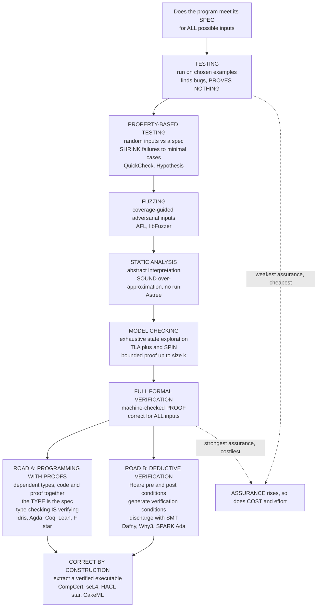

# 🛡️ Verified and Certified Languages

> [!abstract] TL;DR
> **Verified software** is software that ships with a **machine-checked mathematical proof** that it meets its specification — not "we tested it a lot," but "here is a proof, re-checked by a tiny trusted kernel, that it cannot fail for *any* input." This is the ultimate payoff of programming-language theory: **type theory, formal semantics, and the [[The_Curry_Howard_Correspondence|Curry–Howard correspondence]]** turn *reliability* from a testing statistic into a *theorem*. There is a **verification spectrum** of increasing assurance and cost — **testing** (a few examples), **property-based testing** (random inputs against a spec, with **shrinking** to minimal counterexamples), **fuzzing**, **static analysis / abstract interpretation** (sound over-approximation, see [[Effect_Systems_and_Program_Analysis]]), **model checking** (exhaustive state exploration — TLA+, SPIN), and **full formal verification** (a proof for *all* inputs). Two practical roads to a proof: **programming with proofs** via **dependent types** (Idris, Agda, Coq, Lean, F\*, where *the type is the specification* and *type-checking is proving* — [[Dependent_Types_and_Advanced_Type_Systems]], [[Proof_Assistants_and_Dependent_Type_Theory]]), and **deductive verification** via **Hoare logic** (Dafny, Why3, Frama-C, SPARK/Ada — annotate code with pre/postconditions, generate verification conditions, discharge them with SMT solvers — [[Axiomatic_Semantics_and_Hoare_Logic]]). **Refinement types** (LiquidHaskell, F\*) sit in between — types plus SMT-checked predicates, strong guarantees with less proof burden. The landmark results are real and shipping: **CompCert** (the proven-correct C compiler in avionics), **seL4** (the verified microkernel — [[OS_Structure_and_Kernel_Architectures]]), **HACL\*/EverCrypt/Fiat-Crypto** (verified crypto in Firefox, Linux, Chrome), and **CakeML** (a verified ML compiler). Dijkstra's warning frames the whole field: *"testing shows the presence, not the absence, of bugs."*

---

## Intuition

**Analogy — a few spot-checks versus a proof of a theorem.** Suppose you claim "adding the first `n` odd numbers always gives `n²`." You could *test* it: `1 = 1`, `1+3 = 4`, `1+3+5 = 9`, `1+3+5+7 = 16` — four cases, all pass, and you feel confident. But you have only shown it for the cases you tried; case `n = 1000000` is untouched, and testing can *never* cover the infinitely many `n`. Now suppose instead you **prove** it by induction: one argument that settles *all* `n` at once, forever, with certainty. **Testing sampled the truth; the proof captured it.** That gap — between "works on the examples I checked" and "cannot fail on *any* input" — is the entire difference between conventional software assurance and **formal verification**.

For most software, spot-checks are fine. But when the program *is* a pacemaker's control loop, an aircraft's flight-control law, a microkernel that isolates every process on a phone, or the cryptographic library protecting a billion TLS connections, "we tested it a lot" is not good enough — a single missed case is a fatality or a breach. There you want the *proof*: a **machine-checked** demonstration that the code meets its specification for **all** inputs, so that whole classes of failure are not merely *unlikely* but **impossible**. Verified and certified languages are the tools that make writing such proofs — and *trusting* them — practical, by borrowing PLT's deepest machinery: rich types, formal semantics, and the fact that **a proof is a program and a specification is a type**.

---

## How It Works

### 1. The verification spectrum: assurance you can buy by the pound

Program correctness methods form a **spectrum from weakest-and-cheapest to strongest-and-costliest**. Each buys more assurance for more effort:

1. **Testing (examples).** Run the program on hand-picked or scripted inputs and check the outputs. Cheap, universal, indispensable — but it only exercises the cases you thought of. *"Program testing can be used to show the presence of bugs, but never to show their absence"* (Dijkstra, 1970). Testing proves nothing about the inputs you did not try.
2. **Property-based testing (PBT).** Instead of fixed input/output pairs, you state a **property** the code must satisfy (`for all xs, sort(xs) is sorted and a permutation of xs`) and let the tool **generate hundreds of random inputs**, biasing toward edge cases. On a failure it **shrinks** the counterexample to a *minimal* one (from a 40-element mess down to `[0, 0]`). This is the most widely-adopted "formal-ish" method — **QuickCheck** (Haskell), **Hypothesis** (Python), **PropEr** (Erlang), **proptest** (Rust). Still sampling, but far denser and specification-driven.
3. **Fuzzing.** Adversarial, often **coverage-guided** random input generation (AFL, libFuzzer) that mutates inputs to maximize code paths explored, excellent at finding crashes and memory-safety bugs. Sampling on steroids — great at *finding* bugs, silent about their *absence*.
4. **Static analysis / abstract interpretation.** Reason about **all runs** of a program *without executing it*, by computing a **sound over-approximation** over an abstract domain (intervals, polyhedra). A sound analyzer like **Astrée** can *prove the absence* of runtime errors (no overflow, no division by zero) in flight-control code. This is the first rung that yields genuine "for all inputs" guarantees (see [[Effect_Systems_and_Program_Analysis]]).
5. **Model checking.** **Exhaustively explore the state space** of a (usually finite or bounded) system to check a temporal property, reporting a concrete counterexample trace if one exists — **TLA+** (specifications and the TLC checker), **SPIN** (concurrent protocols). **Bounded model checking** checks all behaviors *up to a bound* (depth `k`, size `n`) — a proof for the bounded domain, a strong smoke-test beyond it.
6. **Full formal verification.** A **machine-checked proof** that the code satisfies its specification for **all** inputs, discharged either by an interactive [[Proof_Assistants_and_Dependent_Type_Theory|proof assistant]] or by an automated **SMT solver**. The strongest assurance a program can have — and the most laborious to produce.

The governing law is the **assurance–cost tradeoff**: each step up the ladder rules out more failure but demands more human effort, more specification, and more expertise. Rational engineering picks the *rung that matches the stakes* — PBT for a web service, full verification for a microkernel.

### 2. Programming with proofs: dependent types and "correct by construction"

The first road to a proof turns the **type system itself** into the specification language. In **dependently-typed languages** — **Idris**, **Agda**, **Coq/Rocq**, **Lean**, **F\*** — a type can *depend on values*, so a type can *state a property*:

- `Vector Int n` — a list *statically guaranteed* to have length `n`.
- `sort : (xs : List Int) -> (ys : List Int ** Sorted ys, Permutation xs ys)` — a sort whose *return type* carries a **proof** that the output is sorted and a permutation of the input.

By the **[[The_Curry_Howard_Correspondence|Curry–Howard correspondence]]**, **propositions are types and proofs are programs**. So writing a program of the second type *is* proving that specification, and the compiler's **type-checker is the proof-checker**. This is **correct-by-construction** software: you cannot even *build* the program unless the proof goes through. Coq and Idris can then **extract** a fast, verified executable (in OCaml/Haskell/C), throwing the proof away and keeping the code. The type is the contract; type-checking is the audit (deep dive in [[Dependent_Types_and_Advanced_Type_Systems]] and [[Proof_Assistants_and_Dependent_Type_Theory]]).

### 3. Deductive verification: Hoare logic and contracts

The second road keeps a **conventional imperative program** and *annotates* it. Rooted in **[[Axiomatic_Semantics_and_Hoare_Logic|Hoare logic]]**, you attach:

- a **precondition** `{P}` (what the caller must guarantee),
- a **postcondition** `{Q}` (what the code promises on return),
- **loop invariants** and **variants** (what stays true each iteration, and why loops terminate).

A **verification-condition generator** mechanically turns the annotated program into a set of pure logical formulas — the **verification conditions** — whose validity implies the code meets its contract. Those formulas are then **discharged by an SMT solver** (Z3, cvc5) automatically, or by a proof assistant when the SMT solver gives up. Tools in this family: **Dafny** (Microsoft), **Why3**, **Frama-C** (C), **VeriFast** (C/Java, separation logic), **SPARK/Ada** (safety-critical, avionics and rail). This is **design by contract** with a *prover* enforcing the contracts instead of runtime `assert`s.

### 4. Refinement types: lightweight verification in the middle

Between "full dependent types" and "no verification" sit **refinement types**: an ordinary type **refined by a predicate**, checked by SMT rather than by hand-written proofs. `{v : Int | v >= 0}` is the type of non-negative integers; `{v : [a] | len v == n}` a list of length `n`. **LiquidHaskell**, **F\***, and refinement-typed dialects let you get **strong guarantees with far less proof burden** — the SMT solver discharges the predicates automatically, so you write predicates, not proof terms. The tradeoff: you are limited to properties an SMT solver can decide, and you must sometimes help it. It is the sweet spot for "verify the array indices are in bounds and the sort is total" without a full Coq development.

### 5. Certified vs certifying; translation validation; the TCB

Two subtly different guarantees, especially for compilers ([[Formal_Semantics_and_Verified_Compilers]]):

- **Certified (verified) compiler** — the *compiler itself* is proven, *once and for all*, to preserve program semantics (CompCert). Every future compilation inherits the theorem.
- **Certifying compiler** — the compiler *emits a checkable proof / certificate alongside each output*, and a small independent checker validates that this particular output is correct.
- **Translation validation** — do not prove the compiler; instead, *after each run*, prove that *this input* was compiled to a semantically-equivalent output. Cheaper to build, must run every time.

All of this rests on the **Trusted Computing Base (TCB)**: the small set of things you must trust *without* proof — the proof-checker's kernel, the specification, the hardware model, the SMT solver (unless it too emits certificates). Verification does not eliminate trust; it **shrinks** trust to something small enough to audit by eye (the **de Bruijn criterion**).

### The verification spectrum and programming with proofs



---

## Key Concepts

### Secondary (explain to a curious beginner)
- **Testing** checks a program on *some* inputs you pick; **verification** *proves* it works on *every* input — like proving a math theorem instead of trying a few examples.
- The proof is **checked by a machine**, so it cannot contain a hidden gap or hand-wave; if the check passes, the property truly holds.
- We reach for this when a bug would be catastrophic — **pacemakers, aircraft, microkernels, crypto** — where "we tested it a lot" is not enough.
- **Property-based testing** is the everyday entry point: describe *what should always be true*, let the tool try hundreds of random inputs, and it **shrinks** any failure to the smallest example.

### Undergraduate (requires a CS background)
- The **verification spectrum**: testing → property-based testing → fuzzing → static analysis → model checking → full formal proof; **assurance and cost both rise** along it.
- **Dijkstra's dictum**: testing shows the *presence* of bugs, not their *absence*; a proof covers the whole (possibly infinite) input space at once.
- **Programming with proofs**: with **dependent types**, the **type is the specification** and **type-checking is proof-checking** (Curry–Howard); "correct by construction."
- **Deductive verification**: **Hoare** preconditions, postconditions, and **loop invariants** generate **verification conditions** discharged by an **SMT solver** (Dafny, Why3, SPARK).
- **Refinement types**: types + SMT-checked predicates (`{v:Int | v >= 0}`) — strong guarantees, lighter proof burden than full dependent types (LiquidHaskell, F\*).
- **Bounded model checking** proves a property for all inputs *up to a bound*; not a full proof, but far stronger than sampling.

### Graduate (foundational / system-level thinking)
- **Certified vs certifying vs translation validation**, and the **Trusted Computing Base** — what you still trust without proof (kernel, spec, SMT solver, hardware model); minimizing the TCB is the real game.
- **Refinement / simulation proofs** (seL4: the C implementation *refines* an abstract spec) versus **functional-correctness** and **security** (integrity, confidentiality, information-flow / non-interference) theorems.
- **Soundness vs completeness vs decidability**: SMT-backed refinement typing is decidable but incomplete; full dependent-type verification is complete but undecidable and human-guided; abstract interpretation is sound but imprecise. Rice's theorem forces a choice.
- **Specification risk**: the proof is only as good as the spec and the axioms; a *wrong* formal specification yields a *correctly proven wrong program*. Verification moves the trust boundary, it does not delete it.
- **The automation frontier**: SMT, tactics, **ML/LLM-assisted proving** and **autoformalization**, **gradual verification**, and **refinement types** all aim to lower the crushing proof-to-code effort ratio.
- **Extraction and the compiler gap**: extracting verified OCaml/C still trusts the extractor and the *unverified* downstream compiler — closed only by CompCert/CakeML-style **verified toolchains** ([[Formal_Semantics_and_Verified_Compilers]]).

---

## Python Demo

We contrast the three core points on the verification spectrum against **one small, precise specification** — that a `sort` returns a list that is (1) **sorted** and (2) a **permutation** of its input. The function under test hides a **subtle bug**: it sorts by `sorted(set(xs))`, which is correct *unless the input has duplicates*, in which case it silently **drops** them. We then run:

1. **Testing** — random lists over a *wide* value range (duplicates almost never occur), so it finds no bug and gains **false confidence** (proves nothing, misses the bug).
2. **Property-based testing** — random lists over a *small* value range (duplicates are common), checked against the spec, with **shrinking** to a minimal counterexample.
3. **Exhaustive / bounded model checking** — enumerate *every* list over a bounded domain and check the spec on all of them, **proving** correctness for all inputs up to that size (and catching the bug in the buggy version).

Finally we visualize the **coverage/confidence** of each method: how many inputs each actually checks, whether it caught the bug, and why a fixed sample covers a *vanishing* fraction of the input space as it grows — while exhaustive checking covers 100% but only up to a bounded size. Pure standard library + matplotlib.

```python
# ======================================================================
# THE VERIFICATION SPECTRUM on one tiny spec: is a sort correct?
#   Spec: sort(xs) must be (1) SORTED and (2) a PERMUTATION of xs.
#   Function under test hides a SUBTLE BUG (drops duplicates).
#   (1) TESTING on random inputs      -> misses it, proves nothing
#   (2) PROPERTY-BASED + SHRINKING    -> finds & minimizes a counterexample
#   (3) EXHAUSTIVE / BOUNDED CHECK    -> PROVES correctness up to a bound
#   Visualize coverage/confidence of each. Pure stdlib + matplotlib.
# ======================================================================
import random
import itertools
import matplotlib.pyplot as plt

random.seed(7)

# ---------- the function under test: a SORT with a SUBTLE BUG ----------
def buggy_sort(xs):
    # Looks fine, sorts correctly... but silently DEDUPLICATES.
    # Wrong exactly when the input contains duplicate values.
    return sorted(set(xs))

def fixed_sort(xs):
    # A correct insertion sort, for contrast.
    out = list(xs)
    for i in range(1, len(out)):
        key, j = out[i], i - 1
        while j >= 0 and out[j] > key:
            out[j + 1] = out[j]
            j -= 1
        out[j + 1] = key
    return out

# ---------- the SPECIFICATION (independent of the implementation) ----------
def is_sorted(ys):
    return all(ys[i] <= ys[i + 1] for i in range(len(ys) - 1))

def is_permutation(xs, ys):
    return sorted(xs) == sorted(ys)           # multiset equality (trusted oracle)

def satisfies_spec(fn, xs):
    ys = fn(xs)
    return is_sorted(ys) and is_permutation(xs, ys)

# ================= (1) TESTING: random inputs, WIDE value range =================
def method_testing(fn, trials=300, value_hi=10**6, max_len=6):
    checked, first_fail = 0, None
    for _ in range(trials):
        n = random.randint(0, max_len)
        xs = [random.randint(0, value_hi) for _ in range(n)]   # duplicates ~ never
        checked += 1
        if not satisfies_spec(fn, xs) and first_fail is None:
            first_fail = xs
    return checked, first_fail

# ============ (2) PROPERTY-BASED TESTING + SHRINKING, SMALL value range ============
def method_property_based(fn, trials=300, value_hi=3, max_len=6):
    checked, fail = 0, None
    for _ in range(trials):
        n = random.randint(0, max_len)
        xs = [random.randint(0, value_hi) for _ in range(n)]   # duplicates common
        checked += 1
        if not satisfies_spec(fn, xs):
            fail = xs
            break
    minimal = shrink(fn, fail) if fail is not None else None
    return checked, fail, minimal

def shrink(fn, xs):
    # Greedily reduce a failing input while it STILL fails the spec:
    # first try deleting elements, then try shrinking values toward 0.
    cur = list(xs)
    changed = True
    while changed:
        changed = False
        for i in range(len(cur)):                     # try deleting element i
            cand = cur[:i] + cur[i + 1:]
            if not satisfies_spec(fn, cand):
                cur, changed = cand, True
                break
        if changed:
            continue
        for i in range(len(cur)):                     # try shrinking value i
            if cur[i] > 0:
                cand = list(cur)
                cand[i] -= 1
                if not satisfies_spec(fn, cand):
                    cur, changed = cand, True
                    break
    return cur

# ============ (3) EXHAUSTIVE / BOUNDED MODEL CHECKING ============
def method_exhaustive(fn, domain=(0, 1, 2), max_len=4):
    # Enumerate EVERY list over `domain` of length 0..max_len and check the spec.
    checked, fail = 0, None
    for n in range(max_len + 1):
        for xs in itertools.product(domain, repeat=n):
            checked += 1
            if not satisfies_spec(fn, list(xs)) and fail is None:
                fail = list(xs)
    proved = fail is None
    return checked, fail, proved

# ---------- run all three against the BUGGY sort ----------
t_checked, t_fail = method_testing(buggy_sort)
p_checked, p_fail, p_min = method_property_based(buggy_sort)
e_checked, e_fail, e_proved = method_exhaustive(buggy_sort)

print("=== The SAME buggy sort under three methods ===")
print(f"(1) TESTING        : checked {t_checked:>4} random inputs (wide range) -> "
      f"{'found a bug: ' + str(t_fail) if t_fail else 'NO bug found  (false confidence!)'}")
print(f"(2) PROPERTY-BASED : checked {p_checked:>4} inputs -> failing example {p_fail}, "
      f"SHRUNK to minimal counterexample {p_min}")
print(f"(3) EXHAUSTIVE     : checked {e_checked:>4} inputs over {{0,1,2}}, len<=4 -> "
      f"{'counterexample ' + str(e_fail) if e_fail else 'PROVED correct'}")

# ---------- exhaustive check on the FIXED sort: a bounded PROOF ----------
f_checked, f_fail, f_proved = method_exhaustive(fixed_sort)
print(f"\n=== The FIXED sort under exhaustive checking ===")
print(f"    checked {f_checked} inputs -> "
      f"{'PROVED correct for ALL lists over {0,1,2} of length <= 4' if f_proved else 'bug: ' + str(f_fail)}")

# ======================= VISUALIZE coverage / confidence =======================
fig, (axA, axB) = plt.subplots(1, 2, figsize=(14, 5.6))

# --- Panel A: effort vs outcome on the buggy sort ---
methods = ["testing\n(examples)", "property-based\n+ shrinking", "exhaustive\n(bounded proof)"]
counts = [t_checked, p_checked, e_checked]
caught = [t_fail is not None, p_fail is not None, e_fail is not None]
colors = ["#55A868" if c else "#C44E52" for c in caught]
bars = axA.bar(methods, counts, color=colors, edgecolor="black", zorder=3)
axA.set_yscale("log")
axA.set_ylabel("distinct inputs actually checked (log scale)")
axA.set_title("Same buggy sort, three methods\n"
              "green = CAUGHT the bug,  red = MISSED it")
for b, c in zip(bars, caught):
    axA.text(b.get_x() + b.get_width() / 2, b.get_height() * 1.25,
             "CAUGHT" if c else "MISSED", ha="center", fontweight="bold",
             color=("#2f6b45" if c else "#8b2b2f"))
axA.grid(True, axis="y", ls=":", alpha=0.4)

# --- Panel B: why a fixed sample covers a vanishing fraction as inputs grow ---
D = 3                                            # value-domain size {0,1,2}
ns = list(range(0, 10))
space = [D ** n for n in ns]                      # number of inputs of length n
axB.plot(ns, space, "o-", color="#4C72B0", lw=2,
         label="total inputs of length n over {0,1,2} = 3^n")
axB.set_yscale("log")
axB.axvspan(-0.3, 4.3, color="#55A868", alpha=0.15)
axB.text(2.0, 3.0, "exhaustively\nPROVED\n(len <= 4)", color="#2f6b45",
         ha="center", va="bottom", fontsize=9, fontweight="bold")
axB.axhline(300, color="#C44E52", ls="--", lw=1.6,
            label="fixed random sample = 300 inputs")
axB.text(6.2, 360, "sample stays flat\nwhile space explodes",
         color="#C44E52", fontsize=9)
axB.set_xlabel("list length n")
axB.set_ylabel("number of inputs (log scale)")
axB.set_title("Why testing 'proves nothing' but bounded checking does\n"
              "a fixed sample covers a vanishing fraction as n grows")
axB.legend(loc="lower right", fontsize=8)
axB.grid(True, ls=":", alpha=0.4)

fig.suptitle("Testing samples the truth; exhaustive/formal methods CAPTURE it "
             "(for all inputs, up to a bound)", fontsize=12)
fig.tight_layout()
plt.savefig("verified_and_certified_languages.png", dpi=130)
print("\nSaved figure to verified_and_certified_languages.png")
```

**What it shows.** The buggy sort *passes* random testing (over a wide value range, duplicates essentially never appear, so 300 random inputs raise no alarm — **false confidence**, exactly Dijkstra's point). **Property-based testing** over a small value range hits a duplicate quickly and **shrinks** the messy failing input down to the *minimal* counterexample `[0, 0]` — the smallest list that exposes "drops duplicates." **Exhaustive / bounded checking** enumerates every list over `{0,1,2}` of length ≤ 4 (121 inputs), catches the bug in the buggy version, and — run on the *fixed* sort — checks all 121 and returns **PROVED**: a genuine correctness theorem *for the bounded domain*. Panel B is the moral of the whole field: a fixed-size sample covers a **vanishing fraction** of an exponentially growing input space, so testing can never generalize, whereas exhaustive/formal methods cover the space *completely* — at the price of only reaching a bounded size (or needing a real inductive proof to go further).

---

## Real-World Applications

> **Example — CompCert and seL4, proofs that ship in life-critical systems.** **CompCert** is a **C compiler proven in Coq** to *preserve the semantics* of the source it compiles: for any correct C program, the generated assembly behaves identically — so the compiler cannot introduce a miscompilation. Csmith-style fuzzing that found *hundreds* of bugs in GCC and LLVM found **zero** in CompCert's verified core; it is deployed in **avionics and nuclear-plant** software where a compiler bug is unacceptable. **seL4** is a **microkernel with a machine-checked proof (in Isabelle/HOL)** that its C implementation *refines* its abstract specification — full **functional correctness** plus **integrity and confidentiality** — the strongest assurance any OS kernel has ([[OS_Structure_and_Kernel_Architectures]], [[Formal_Semantics_and_Verified_Compilers]]).

- **Verified cryptography in production.** **HACL\*** / **EverCrypt** (proven in F\*) and **Fiat-Crypto** (proven in Coq) generate **formally-verified, constant-time** crypto primitives — ChaCha20, Poly1305, Curve25519, P-256 — that ship in **Firefox (NSS)**, the **Linux kernel**, **Chrome/BoringSSL**, **WireGuard**, and **Zinc**. Verification eliminates whole vulnerability classes (buffer overreads like Heartbleed, timing side channels) *by proof* rather than by audit.
- **Property-based testing at scale.** **QuickCheck** (Haskell) and **Hypothesis** (Python) are mainstream: Dropbox, Stripe, and many others catch specification-violating edge cases daily by writing *properties* instead of examples; **PropEr**/QuickCheck found deep bugs in distributed databases (Basho's Riak, the Jepsen tradition uses similar generative testing).
- **Model checking distributed protocols — TLA+ at AWS.** Amazon Web Services uses **TLA+** to specify and **model-check** core services (S3, DynamoDB, EBS), catching subtle concurrency and consistency bugs *in the design* that testing would never surface; several were "serious bugs we would not have found any other way." **IronFleet** (Microsoft) and **Verdi** (UW) go further and *fully verify* distributed protocols (a Paxos-based replicated store, Raft) end to end.
- **Deductive verification in industry.** **Dafny** verifies components of Amazon's authorization engine and Microsoft tooling; **SPARK/Ada** verifies avionics and rail-signalling software (subset of Ada with contracts, proven with SMT); **Frama-C** verifies embedded C in aerospace and medical devices; **AWS** uses **s2n**'s formal proofs (via SAW/Cryptol) for its TLS implementation.
- **Verified compilers and systems beyond CompCert.** **CakeML** is a **verified ML compiler** whose end-to-end proof reaches down to machine code; **verified file systems** (FSCQ, proven in Coq to survive crashes) and **verified databases** are active, shipping research.

---

## Common Pitfalls

- **"Verified" does not mean "bug-free" — the specification can be wrong.** A proof shows the code meets *its spec*; if the spec is incomplete or mis-states the intent, you get a **correctly-proven wrong program**. Verification moves the trust boundary from the code to the *specification and axioms* — which must themselves be reviewed by humans. Always ask: *verified against what, and is that what I meant?*
- **Confusing bounded checking with a full proof.** Bounded model checking (and the exhaustive demo above) proves the property *only up to size k / depth d*. A bug that first appears at size `k+1` is invisible. It is a superb, high-assurance smoke test — but it is **not** a proof for all inputs; only induction or a full formal proof reaches "for all `n`."
- **Over-trusting property-based testing.** PBT is sampling with a good aim, not a proof: it can *only* find bugs, never certify their absence, and it is only as good as your **generators** (biased or too-narrow generators miss whole regions) and your **properties** (a weak property passes vacuously). A green PBT run is strong evidence, not a guarantee.
- **Ignoring the Trusted Computing Base.** Every verified system still trusts *something* unproven: the proof-assistant kernel, the SMT solver (unless it emits certificates), the hardware/memory model, the specification, and — for extracted code — the **downstream compiler**. "Verified" with a huge or unaudited TCB can be weaker than it sounds. Minimizing and naming the TCB is part of the result.
- **Underestimating the proof-effort ratio.** Full functional verification historically costs **~20–50 lines of proof per line of code** and *person-years* for a kernel-sized artifact (seL4). Choosing full verification for code that only needs PBT wastes enormous effort; choosing PBT for a pacemaker under-assures. Match the rung to the stakes.
- **Proof brittleness ("proof rot").** Machine proofs are fragile: rename a lemma or tweak a definition and dozens of tactic scripts break. Large developments carry a heavy *maintenance* cost, and over-reliance on fragile automation makes them expensive to evolve.
- **Assuming SMT/refinement handles everything.** SMT-backed refinement typing is **decidable but incomplete**: it can time out or fail on properties involving nonlinear arithmetic, quantifiers, or deep induction, forcing you to drop into manual proofs. Knowing *what your solver can and cannot decide* is essential to staying in the lightweight lane.
- **Extraction and constant-time gaps.** Extracting verified OCaml/C can silently break guarantees the proof relied on (e.g., an unverified extractor, or a compiler that *reintroduces* timing side channels a constant-time proof assumed away). End-to-end guarantees need a **verified toolchain** (CompCert/CakeML), not just a verified source.

---

## Related Concepts

- [[Proof_Assistants_and_Dependent_Type_Theory]] — the interactive theorem provers (Coq, Lean, Agda, Isabelle) in which CompCert, seL4, and verified crypto are proven; a proof assistant *is* the machine that checks these proofs.
- [[Axiomatic_Semantics_and_Hoare_Logic]] — the pre/post-condition and loop-invariant logic underneath deductive verification (Dafny, Why3, Frama-C, SPARK); verification conditions are Hoare triples turned into SMT queries.
- [[Dependent_Types_and_Advanced_Type_Systems]] — the type machinery of "programming with proofs," where the type *is* the specification and refinement types give lightweight verification.
- [[The_Curry_Howard_Correspondence]] — the propositions-as-types, proofs-as-programs identity that makes "type-checking is proof-checking" — and hence correct-by-construction software — possible.
- [[Formal_Semantics_and_Verified_Compilers]] — CompCert, CakeML, certified vs certifying compilers, translation validation, and the trusted-computing-base story, treated from the compiler side.
- [[Effect_Systems_and_Program_Analysis]] — the *static-analysis / abstract-interpretation* rungs of the spectrum (Astrée, sound over-approximation) that give "for all inputs" guarantees without a full proof.
- [[OS_Structure_and_Kernel_Architectures]] — seL4 applies functional-correctness-and-security refinement proofs to a microkernel; the strongest-assured operating-system core.
- [[The_Future_of_Programming_Languages]] — where verification is heading: SMT/tactic/LLM-assisted proving, autoformalization, gradual verification, and lowering the proof-effort barrier.

---

## Review Questions

1. **(Secondary)** Using the "spot-checks versus proving a theorem" analogy, explain why *passing thousands of tests* still does not *prove* a program correct, and give one concrete example (a pacemaker, an aircraft, a crypto library) where you would insist on a machine-checked proof rather than testing — and say *why*.
2. **(Undergraduate)** In the demo, `buggy_sort` passes random testing but is caught by property-based testing and by exhaustive checking. (a) Explain *why the random tester missed the bug* and how the choice of value range mattered. (b) Describe what **shrinking** did to turn a messy failing input into `[0, 0]`, and why a minimal counterexample is valuable. (c) Explain in what precise sense the exhaustive run "**proved**" the fixed sort correct, and what it did *not* prove.
3. **(Graduate)** Compare the two roads to a proof — **programming with proofs** (dependent types, where type-checking *is* verifying) and **deductive verification** (Hoare contracts discharged by SMT). (a) What does each add to the **Trusted Computing Base**, and how does **refinement typing** trade completeness for automation? (b) Distinguish a **certified** compiler from a **certifying** one and from **translation validation**, and explain which minimizes the TCB. (c) Given a "verified" system, list three things that could still make it *wrong*, and argue why verification *relocates* trust rather than eliminating it.

---

## Sources

- Xavier Leroy, "Formal Verification of a Realistic Compiler" (CompCert), *Communications of the ACM* 52(7), 2009. [https://xavierleroy.org/publi/compcert-CACM.pdf](https://xavierleroy.org/publi/compcert-CACM.pdf)
- Gerwin Klein et al., "seL4: Formal Verification of an OS Kernel," *SOSP '09*, 207–220 — the verified microkernel. [https://doi.org/10.1145/1629575.1629596](https://doi.org/10.1145/1629575.1629596)
- Koen Claessen and John Hughes, "QuickCheck: A Lightweight Tool for Random Testing of Haskell Programs," *ICFP '00*, 268–279 — property-based testing and shrinking. [https://doi.org/10.1145/351240.351266](https://doi.org/10.1145/351240.351266)
- Chris Newcombe et al., "How Amazon Web Services Uses Formal Methods," *Communications of the ACM* 58(4), 2015, 66–73 — TLA+ model checking in production. [https://doi.org/10.1145/2699417](https://doi.org/10.1145/2699417)
- Jean-Karim Zinzindohoué et al., "HACL\*: A Verified Modern Cryptographic Library," *CCS '17*, 1789–1806 — verified crypto shipping in Firefox and Linux. [https://doi.org/10.1145/3133956.3134043](https://doi.org/10.1145/3133956.3134043)
- K. Rustan M. Leino, "Dafny: An Automatic Program Verifier for Functional Correctness," *LPAR-16*, 2010 — SMT-backed deductive verification. [https://doi.org/10.1007/978-3-642-17511-4_20](https://doi.org/10.1007/978-3-642-17511-4_20)

---

#programming-language-theory #formal-verification #verified-software #compcert #sel4
