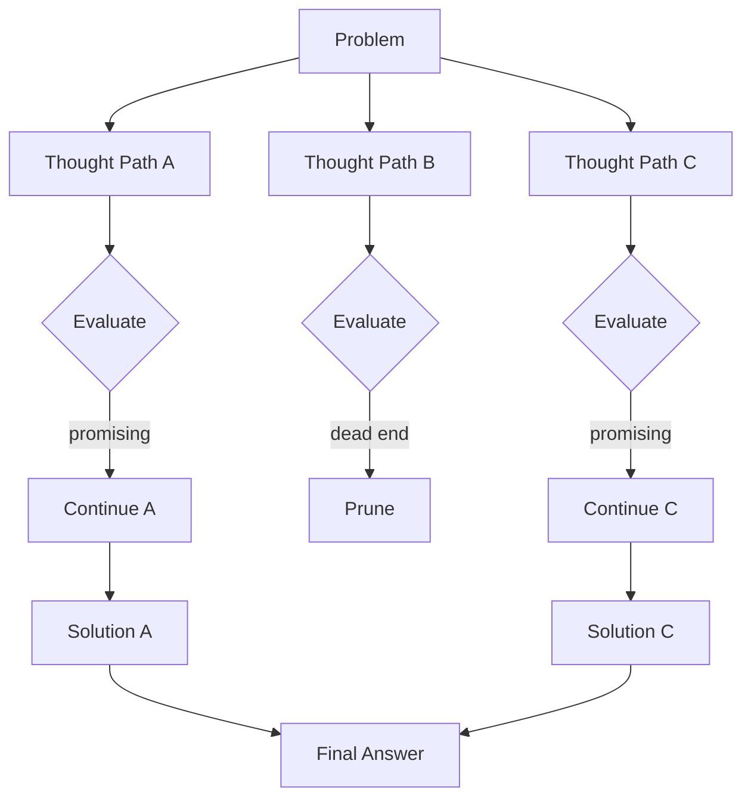

# Chain of Thought Prompting

> [!abstract] TL;DR
> Chain-of-Thought (CoT) prompting instructs the model to write out its reasoning steps before producing a final answer. This simple technique dramatically improves accuracy on multi-step tasks — math problems, logical deductions, code debugging — because it forces the model to decompose complex problems rather than pattern-matching to a surface answer.

## What Is Chain of Thought?

In standard prompting, the model jumps directly from question to answer. In **Chain-of-Thought (CoT) prompting**, the model is guided to articulate intermediate reasoning steps, mimicking human problem-solving:

**Standard (no CoT):**
```
Q: If a train travels at 60 mph and needs to cover 150 miles, how long will the trip take?
   Add 15 minutes for boarding.
A: 2 hours 45 minutes.
```
(Model may guess or miscalculate)

**With Chain of Thought:**
```
Q: If a train travels at 60 mph and needs to cover 150 miles, how long will the trip take?
   Add 15 minutes for boarding.
A: Let me work through this step by step.
   Step 1: Calculate travel time. Distance = 150 miles, Speed = 60 mph.
           Time = 150 / 60 = 2.5 hours = 2 hours 30 minutes.
   Step 2: Add boarding time. 2 hours 30 minutes + 15 minutes = 2 hours 45 minutes.
   Answer: 2 hours 45 minutes.
```

The written reasoning serves two purposes:
1. Forces the model to allocate more token budget to intermediate computation
2. Creates a verifiable audit trail — users can check where reasoning went wrong

Research by Wei et al. (2022) showed CoT prompting improved PaLM's GSM8K math accuracy from 17 % to 58 % — a 3x improvement with a single phrase change.

## Zero-Shot CoT

The simplest form: append a trigger phrase to the prompt. Discovered accidentally — researchers found that certain phrases activate reasoning-oriented continuations.

**Classic trigger phrases:**
- `"Let's think step by step."`
- `"Let's work through this carefully."`
- `"Think through this problem step by step before giving your final answer."`
- `"First, let me reason about this..."`

```
Q: A farmer has 17 sheep. All but 9 die. How many sheep are left?

Think step by step.

A: Let me parse this carefully.
   "All but 9 die" means: all sheep except 9 die.
   So 9 sheep survive.
   Answer: 9
```

Without "Think step by step," many models answer 17 - 9 = 8, missing the linguistic trick.

## Few-Shot CoT

Provide full reasoning-chain examples to demonstrate the expected thought pattern:

```
Q: Roger has 5 tennis balls. He buys 2 more cans of tennis balls.
   Each can has 3 balls. How many tennis balls does he have now?
A: Roger starts with 5 balls. He buys 2 cans × 3 balls each = 6 new balls.
   Total: 5 + 6 = 11 tennis balls.

Q: The cafeteria had 23 apples. If they used 20 to make lunch and bought 6 more,
   how many apples do they have?
A: Start with 23 apples. Used 20: 23 - 20 = 3 remaining.
   Bought 6 more: 3 + 6 = 9 apples.

Q: Janet has 3 brothers. Each brother has 2 sisters. How many sisters does Janet have?
A:
```

Few-shot CoT is more reliable than zero-shot but consumes more tokens. It pays off for high-stakes tasks where accuracy matters more than cost.

## When CoT Helps vs. Hurts

| Task Type | CoT Helpful? | Reason |
|-----------|-------------|--------|
| Multi-step arithmetic | Yes, strongly | Prevents arithmetic shortcutting |
| Formal logic / deduction | Yes, strongly | Forces constraint checking |
| Code debugging | Yes | Surfaces intermediate state analysis |
| Causal reasoning | Yes | Decomposes cause → effect chains |
| Commonsense QA | Moderately | Helps with trick questions |
| Simple factual retrieval | No | Adds tokens without improving accuracy |
| Single-step classification | No | Increases latency/cost, no accuracy gain |
| Creative writing | No | Interrupts natural generation flow |
| Instruction following | Sometimes | Useful for complex multi-condition tasks |

**Key heuristic:** Use CoT when the task requires more than one reasoning step that could go wrong independently. Skip it for lookup tasks or when latency/cost is critical.

## Before and After CoT: Real Examples

### Logic Puzzle

**Without CoT:**
```
Prompt: All bloops are razzles. All razzles are lazzles. Are all bloops lazzles?
Answer: Yes.
```
(Correct, but unreliable for harder variants)

**With CoT:**
```
Prompt: All bloops are razzles. All razzles are lazzles. Are all bloops lazzles?
        Think step by step.
Answer: Step 1: Every bloop is a razzle (given premise 1).
        Step 2: Every razzle is a lazzle (given premise 2).
        Step 3: By transitivity — if every bloop is a razzle, and every razzle is
                a lazzle, then every bloop must be a lazzle.
        Conclusion: Yes, all bloops are lazzles.
```

### Code Debugging

**Without CoT:**
```
Why does this Python code fail: `print(1/0)`?
Answer: Division by zero error.
```

**With CoT:**
```
Why does this Python code fail: `print(1/0)`. Reason through what Python does.
Answer: Python evaluates `1/0` first. Division requires dividing the integer 1 by the
        integer 0. Division by zero is mathematically undefined, and Python raises a
        `ZeroDivisionError` exception at runtime. The `print()` function is never
        reached because the exception is raised before its argument is evaluated.
        Fix: use a try/except block or check the denominator before dividing.
```

## Tree of Thought (ToT)

**Tree of Thought** extends CoT by exploring multiple reasoning paths simultaneously, then selecting the best.



ToT is useful for:
- Creative tasks requiring exploration (crossword puzzles, story planning)
- Mathematical problems with multiple solution strategies
- Tasks where the first approach often fails (chess, game planning)

In practice, ToT is implemented by prompting the model to generate N thoughts, evaluate each, expand the best ones, and repeat. It requires multiple API calls but dramatically improves performance on combinatorial tasks.

## Self-Consistency

**Self-consistency** runs CoT multiple times (with higher temperature) and takes the majority answer:

```python
from collections import Counter

def self_consistent_answer(client, prompt, n_samples=5):
    """Sample multiple CoT responses and return the majority answer."""
    answers = []
    for _ in range(n_samples):
        response = client.chat.completions.create(
            model="gpt-4o",
            temperature=0.7,
            messages=[
                {"role": "user", "content": prompt + "\nThink step by step."}
            ]
        )
        # Extract final answer from response (task-specific parsing)
        full_text = response.choices[0].message.content
        answer = extract_final_answer(full_text)  # Custom extraction logic
        answers.append(answer)
    
    # Majority vote
    return Counter(answers).most_common(1)[0][0]
```

Self-consistency improves accuracy by ~5–15 % on math benchmarks at the cost of 3–5x more API calls. It's most valuable for high-stakes tasks where accuracy justifies compute cost.

## Step-Back Prompting

**Step-back prompting** asks the model to first identify the higher-level principle or concept relevant to the question, then answer:

```
Q: What happens to the pressure of a gas if you double its volume at constant temperature?

Step back: What is the fundamental physical principle that governs this scenario?

A: [Step back] The relevant principle is Boyle's Law from ideal gas theory:
   at constant temperature, pressure and volume are inversely proportional (PV = constant).
   
   [Answer] Applying Boyle's Law: if V doubles, P must halve to keep PV constant.
   Therefore, pressure decreases by 50%.
```

Step-back prompting particularly helps with physics, math, and factual questions where the model needs to activate correct domain knowledge before reasoning.

## Common Pitfalls

> [!warning] Pitfall 1 — CoT Hallucination in Reasoning Steps
> CoT does not prevent the model from confabulating reasoning steps. A model can write plausible-looking intermediate steps that contain errors. Always validate the logic of CoT responses, especially for high-stakes decisions. For critical applications, pair CoT with external calculators or code execution.

> [!warning] Pitfall 2 — Verbose CoT for Simple Tasks
> Appending "Think step by step" to a simple classification task creates unnecessary tokens and latency. Reserve CoT for tasks with genuine multi-step complexity. A simple heuristic: if a human could answer correctly without scratch paper, CoT probably isn't needed.

> [!warning] Pitfall 3 — Reasoning Models Don't Need Explicit CoT
> OpenAI's o1/o3 and Anthropic's extended thinking models perform internal CoT during inference. Adding explicit "think step by step" to these models is redundant and can interfere with their internal reasoning process. Check model documentation before adding CoT scaffolding.

## Review Questions

> [!question] Q1 — What mechanism makes CoT improve accuracy?
> **A:** CoT forces the model to allocate additional token budget to intermediate computation steps. Since LLMs generate one token at a time, writing out reasoning steps gives the model more "working memory" space to handle subproblems before synthesising a final answer. Without CoT, the model must jump directly to an answer, which requires the correct answer to have high probability in a single step — harder for complex problems.

> [!question] Q2 — How does self-consistency differ from taking a single CoT answer?
> **A:** Self-consistency runs the same CoT prompt multiple times with non-zero temperature, producing N independent reasoning chains that may reach different answers. The majority answer is taken as the final output. This reduces variance caused by sampling randomness and surfaces cases where the model is genuinely uncertain (low agreement across samples).

> [!question] Q3 — For what type of task would Tree of Thought outperform standard CoT?
> **A:** Tree of Thought excels at tasks with large search spaces, backtracking requirements, or multiple viable solution strategies — such as mathematical theorem proving, strategic planning, crossword puzzles, or tasks where the first reasoning path frequently leads to a dead end. Standard CoT is a single forward pass; ToT explores a branching tree of possibilities.

## See Also

- [[Basic_Prompting_Techniques]]
- [[ReAct_and_Agentic_Prompting]]
- [[Advanced_Prompting_Strategies]]
- [[Prompt_Engineering_Overview]]
- [[_MOC_Prompt_Engineering_Master]]
