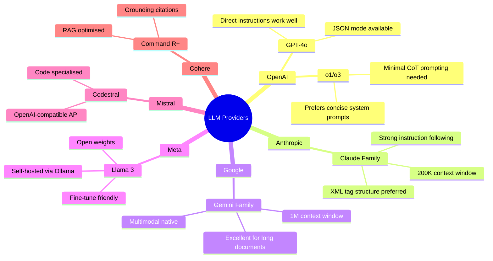

# LLM Models and Providers

> [!abstract] TL;DR
> Major LLM families — OpenAI, Anthropic, Google, Meta, Mistral, and Cohere — each have distinct strengths in context length, reasoning, multimodal capability, cost, and openness. Choosing the right model and tuning your prompt strategy to its characteristics is a foundational prompt engineering skill.

## The Major Model Families

### OpenAI

OpenAI's flagship line in 2025–2026 spans two architectures:

**GPT-4o (Omni)** is a unified multimodal model handling text, images, and audio in a single architecture. It has a 128 K token context window, fast response times, and strong instruction-following. It is the workhorse for most production applications.

**o1 / o3 Reasoning Models** are "thinking" models that spend additional compute on internal chain-of-thought before producing an answer. They are significantly stronger on mathematics, formal logic, and multi-step code generation than GPT-4o, but are slower and more expensive. Prompting strategy differs: reasoning models need less explicit CoT scaffolding (they do it internally) and respond poorly to excessive step-by-step instructions.

**GPT-4o mini** is a smaller, cheaper variant for latency-sensitive or cost-constrained applications.

### Anthropic

Anthropic's Claude family is built around Constitutional AI and extended context:

**Claude 3 family (Haiku / Sonnet / Opus)** — three tiers of speed/capability. Sonnet is the balanced workhorse; Opus is the most capable; Haiku is for fast, cheap tasks.

**Claude 4 and Claude Sonnet 4** — mid-2026 releases with improved instruction following, stronger coding ability, and continued 200 K context window.

Claude's distinguishing prompt engineering feature is its strong preference for XML-structured prompts. Wrapping context in `<document>...</document>` tags and instructions in `<instructions>...</instructions>` improves reliability significantly compared to prose separation.

### Google

**Gemini 2.0 Flash / Pro** — Google's latest multimodal family. Flash is optimised for speed and cost; Pro for capability. Key differentiator: extremely long context windows (up to 1 M tokens for some variants), making Gemini attractive for full-codebase analysis or long-document QA. Available through Google AI Studio and Vertex AI.

### Meta (Open Source)

**Llama 3 (8B, 70B, 405B)** — Meta's open-weight model family. The 405B parameter variant is competitive with closed-source frontier models on many benchmarks. Because weights are downloadable, Llama 3 can run on-premises (critical for data privacy), be fine-tuned cheaply, and be served via Ollama for local development.

Prompting Llama 3 uses a specific chat template format (`<|begin_of_text|>`, `<|start_header_id|>system<|end_header_id|>` etc.) that must be followed when calling the raw model. Hosted APIs abstract this.

### Mistral

**Mistral Large / Nemo / Codestral** — European open and closed models. Mistral models are often more efficient than equivalents from larger labs. Codestral is specialised for code generation. Mistral's API uses an OpenAI-compatible interface, making migration straightforward.

### Cohere

**Command R+** — optimised for retrieval-augmented generation (RAG) workloads. Command R+ has native multi-hop retrieval, grounding citations, and connector integrations. When building RAG pipelines, Cohere's specialised grounding prompt format is worth using.

## Model Comparison Table

| Provider | Model | Context | Multimodal | Reasoning | Open Source | Relative Cost |
|----------|-------|---------|------------|-----------|-------------|---------------|
| OpenAI | GPT-4o | 128 K | Text+Image+Audio | Standard | No | $$$ |
| OpenAI | o3 | 200 K | Text+Image | Extended (CoT) | No | $$$$ |
| OpenAI | GPT-4o mini | 128 K | Text+Image | Standard | No | $ |
| Anthropic | Claude Sonnet 4 | 200 K | Text+Image | Strong | No | $$$ |
| Anthropic | Claude Haiku 3 | 200 K | Text+Image | Standard | No | $ |
| Google | Gemini 2.0 Pro | 1 M | Text+Image+Video | Strong | No | $$$ |
| Google | Gemini 2.0 Flash | 1 M | Text+Image+Video | Standard | No | $ |
| Meta | Llama 3 405B | 128 K | Text | Standard | Yes | Free (self-host) |
| Mistral | Mistral Large | 128 K | Text | Standard | Partially | $$ |
| Cohere | Command R+ | 128 K | Text | RAG-optimised | No | $$ |

## Open-Source vs. Closed-Source Tradeoffs

### Closed-Source (OpenAI, Anthropic, Google)
- **Pros:** State-of-the-art capability, no infrastructure management, continuous model updates, safety tuning by provider
- **Cons:** Data sent to third-party servers, vendor lock-in, cost scales with usage, model versions can change unexpectedly

### Open-Source (Llama 3, Mistral, Falcon)
- **Pros:** Data privacy (run on-premises), fine-tuning flexibility, zero per-token cost after infrastructure, model version control
- **Cons:** Infrastructure burden, smaller context windows for most variants, capability gap on frontier tasks

## Ollama for Local Model Running

**Ollama** is a tool for running open-weight models locally on Mac, Linux, or Windows. It abstracts model download, GGUF quantisation, and a local HTTP server behind a simple CLI.

```bash
# Install and run Llama 3.2
ollama pull llama3.2
ollama run llama3.2

# Or use via API (OpenAI-compatible endpoint)
curl http://localhost:11434/api/chat -d '{
  "model": "llama3.2",
  "messages": [{"role": "user", "content": "Explain RAG in 2 sentences"}]
}'
```

Ollama is invaluable for local development and testing prompt strategies before incurring API costs.

## How Model Choice Affects Prompt Strategy



**Model-specific prompt tips:**

| Model Family | Key Prompt Strategy |
|---|---|
| GPT-4o | Direct imperatives, JSON mode for structured output, tool definitions in function-calling format |
| o1/o3 | Concise task description; avoid step-by-step instructions (model reasons internally) |
| Claude | XML tags for multi-part prompts; "thinking" tag for extended reasoning; document/instructions separation |
| Gemini | Leverage long context; embed full documents rather than summaries; multimodal prompts work natively |
| Llama 3 | Use official chat template; few-shot examples improve reliability significantly |
| Command R+ | Use grounding/document format for RAG; include citation instructions |

## Capability Cut-off Dates

All LLMs have a **knowledge cut-off date** — the date after which their training data was not collected. Events, papers, and products released after that date are unknown to the model without external grounding (RAG, tool use).

Always check the provider's documentation for the current model's knowledge cut-off. When prompting about recent events, either provide the facts in the prompt or use a retrieval tool.

## Common Pitfalls

> [!warning] Pitfall 1 — Using a Reasoning Model for Simple Tasks
> Routing every request through o1/o3 or similar "thinking" models when a standard model suffices wastes money (5–10x cost multiplier) and adds latency. Reserve extended reasoning models for tasks where that reasoning actually improves outcomes: multi-step math, formal proofs, complex debugging.

> [!warning] Pitfall 2 — Ignoring Model Version Changes
> Providers update models silently (GPT-4 → GPT-4-turbo → GPT-4o → GPT-4o-2024-11-20). Each version can have different behaviour, refusals, and output styles. Pin to a specific model version in production and run regression tests before upgrading.

> [!warning] Pitfall 3 — Treating All Models Identically
> A prompt optimised for Claude (heavy XML structure) may feel verbose and worsen performance on GPT-4o. A prompt working perfectly on GPT-4o may not respect Claude's multi-document formatting preferences. Maintain model-specific prompt variants when deploying across providers.

## Review Questions

> [!question] Q1 — When should you choose an open-source model over a closed-source model?
> **A:** Choose open-source when data privacy regulations prohibit sending data to third-party APIs (healthcare, finance, legal), when you need custom fine-tuning on proprietary data, when per-token costs are prohibitive at scale, or when you need guaranteed model version stability. The tradeoff is operational burden and a potential capability gap.

> [!question] Q2 — Why do reasoning models (o1, o3) require different prompting than standard models?
> **A:** Reasoning models perform internal chain-of-thought during inference. Adding explicit CoT prompts ("Think step by step") is redundant and can actually confuse the model by suggesting it should rush past its internal reasoning. Concise task descriptions and clear success criteria work better than scaffolded reasoning prompts.

> [!question] Q3 — What is the advantage of Gemini's 1 M token context over Claude's 200 K?
> **A:** A 1 M token window can hold roughly 750 000 words — an entire large codebase, hundreds of research papers, or a full book. This enables retrieval-free architectures where the full corpus is in-context, eliminating chunking complexity. Tradeoffs: very long contexts can dilute model attention ("lost in the middle" problem) and cost more per request.

## See Also

- [[Prompt_Engineering_Overview]]
- [[Basic_Prompting_Techniques]]
- [[LLM_APIs_and_SDKs]]
- [[RAG_Fundamentals]]
- [[_MOC_Prompt_Engineering_Master]]
