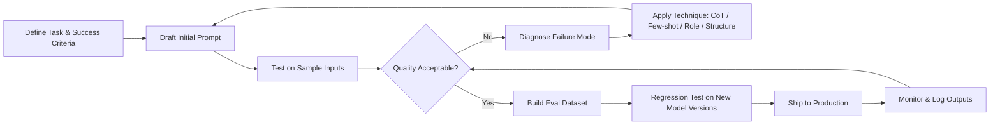

# Prompt Engineering Overview

> [!abstract] TL;DR
> Prompt engineering is the practice of crafting inputs to large language models to reliably produce desired outputs. Because LLMs are extremely sensitive to how instructions are phrased, systematic prompt design is a high-leverage skill for anyone building with AI. It sits at the intersection of linguistics, software engineering, and empirical experimentation.

## What Is Prompt Engineering?

A **prompt** is any text (or multimodal content) you send to a language model as input. **Prompt engineering** is the discipline of designing, testing, and iterating on these inputs to steer model behaviour toward a specific goal — whether that goal is answering a question, writing code, summarising a document, or calling a tool.

Unlike traditional programming, where deterministic logic produces deterministic outputs, LLMs are probabilistic. The same underlying model can produce wildly different results depending on:

- How a task is framed ("Summarise this" vs. "Write a concise executive summary in three bullet points")
- The examples provided in the prompt (zero-shot vs. few-shot)
- Structural cues such as XML tags, numbered lists, or role assignments
- Sampling parameters such as temperature and top-p

Prompt engineering emerged as a practical necessity: researchers discovered that careful phrasing could unlock reasoning capabilities (Chain-of-Thought), reduce hallucination, and dramatically improve task accuracy — without changing any model weights.

## Why It Matters

| Driver | Explanation |
|--------|-------------|
| Output quality | Small wording changes can shift accuracy by 10–30 % on benchmarks |
| Cost efficiency | Shorter, well-structured prompts reduce token usage and API costs |
| Safety | Good system prompts constrain model behaviour and reduce harmful outputs |
| Reliability | Structured prompts produce consistent, parseable outputs in production |
| Capability unlocking | Techniques like CoT, ReAct, and few-shot learning expose latent model capabilities |

As foundation models become commoditised, the ability to extract value from them through prompting is a durable competitive advantage.

## How LLMs Work (What You Need to Know)

Understanding the mechanics behind LLMs helps explain why prompting works the way it does.

### Token Prediction

LLMs are trained to predict the next token given all previous tokens. A **token** is roughly 3–4 characters (about 0.75 words). The model assigns a probability distribution over its vocabulary and samples from it. Everything — the question, the reasoning, and the answer — is generated one token at a time.

**Implication:** The model has no "understanding" in a human sense; it pattern-matches on the statistical regularities learned during training. Well-structured prompts activate better-matching patterns.

### Context Window

The **context window** is the maximum number of tokens the model can process in a single pass, spanning both the prompt (input) and the generated response (output). Common sizes in 2025–2026:

- GPT-4o: 128 K tokens
- Claude Sonnet 4: 200 K tokens (as of mid-2026)
- Gemini 2.0 Flash: 1 M tokens

Everything outside the context window is invisible to the model. This constrains how much history, documentation, or examples you can include.

### Temperature and Sampling

**Temperature** controls the randomness of token sampling:
- `temperature = 0` → near-deterministic; always picks the highest-probability token
- `temperature = 1` → default; balanced creativity and coherence
- `temperature > 1` → more random, less coherent

**Top-p (nucleus sampling)** restricts sampling to the smallest set of tokens whose cumulative probability exceeds p (e.g., 0.9). Lowering top-p makes outputs more conservative.

For structured tasks (code, JSON, classification), use low temperature. For creative tasks (brainstorming, story writing), use higher temperature.

## Core Terminology

| Term | Definition |
|------|------------|
| **Prompt** | The full input sent to the model, including system message and user message |
| **System prompt** | Instructions that set the model's persona, constraints, and context before the user turn |
| **Token** | Smallest unit of text the model processes (~3–4 characters) |
| **Context window** | Maximum total tokens (input + output) in one request |
| **Temperature** | Sampling randomness parameter (0 = deterministic, higher = more creative) |
| **Top-p** | Nucleus sampling parameter; limits which tokens are eligible for sampling |
| **Hallucination** | Model generating plausible-sounding but factually incorrect content |
| **Few-shot** | Providing examples in the prompt to guide model behaviour |
| **Zero-shot** | Prompting without examples, relying on the model's pre-trained knowledge |
| **Grounding** | Providing factual context (documents, data) to anchor model responses |
| **Model weights** | The billions of parameters learned during training; fixed at inference time |

## PE as a Skill vs. a Science

Prompt engineering currently sits somewhere between a **craft skill** and an **empirical science**:

**As a skill:** Experienced practitioners develop intuition for what phrasing works with which models. Model families have distinct "personalities" — GPT-4 responds well to direct instruction, Claude benefits from XML-tagged structure, Gemini handles very long contexts well.

**As a science:** Reproducible techniques with measurable improvements (Chain-of-Thought, self-consistency, structured output) have been validated in peer-reviewed research. Automated optimisation frameworks (DSPy, APE) treat prompt design as an optimisation problem with a quantifiable objective.

**Practical takeaway:** Start with established techniques, measure outcomes with eval datasets, iterate systematically, and treat prompts as versioned code artefacts.

## The Prompt Engineering Workflow

The loop is intentional: prompts degrade as models are updated, and continuous monitoring is essential in production systems.

## Common Pitfalls

> [!warning] Pitfall 1 — Vague Instructions
> "Write something about climate change" leaves enormous ambiguity. Specify audience, length, format, tone, and purpose. Ambiguous prompts produce inconsistent outputs that are hard to evaluate or improve.

> [!warning] Pitfall 2 — Ignoring System Prompts
> Many developers test prompts in the user turn only. System prompts are processed differently and carry more authority for instruction-following. Critical constraints (persona, output format, safety rules) belong in the system prompt.

> [!warning] Pitfall 3 — Overfitting to One Model
> A prompt highly tuned for GPT-4o may degrade significantly on Claude or Gemini. Abstract the key intent from model-specific quirks; maintain a model-agnostic core and add model-specific tuning as a thin layer.

## Review Questions

> [!question] Q1 — Why does temperature = 0 not guarantee identical outputs across runs?
> **A:** Even at temperature 0, floating-point non-determinism in GPU arithmetic and batch processing order can produce minor differences. Some providers also apply post-processing. For reproducibility, set a fixed seed when the API supports it and use temperature 0.

> [!question] Q2 — What is the difference between a system prompt and a user prompt?
> **A:** The system prompt is a privileged instruction block set by the application developer, establishing the model's persona, constraints, and context. The user prompt is the end-user's message. Models are trained to treat system-prompt instructions with higher authority — they are harder for end users to override.

> [!question] Q3 — Why does prompt phrasing affect LLM accuracy so dramatically?
> **A:** LLMs are next-token predictors trained on vast corpora. Prompt phrasing activates different statistical patterns in the training data. "Think step by step" triggers reasoning-heavy continuations because the model learned that phrase typically precedes detailed derivations, not short answers.

## See Also

- [[Basic_Prompting_Techniques]]
- [[Chain_of_Thought_Prompting]]
- [[LLM_Models_and_Providers]]
- [[RAG_Fundamentals]]
- [[AI_Agents_Overview]]
- [[_MOC_AI_ML_Master]]
- [[_MOC_Prompt_Engineering_Master]]
