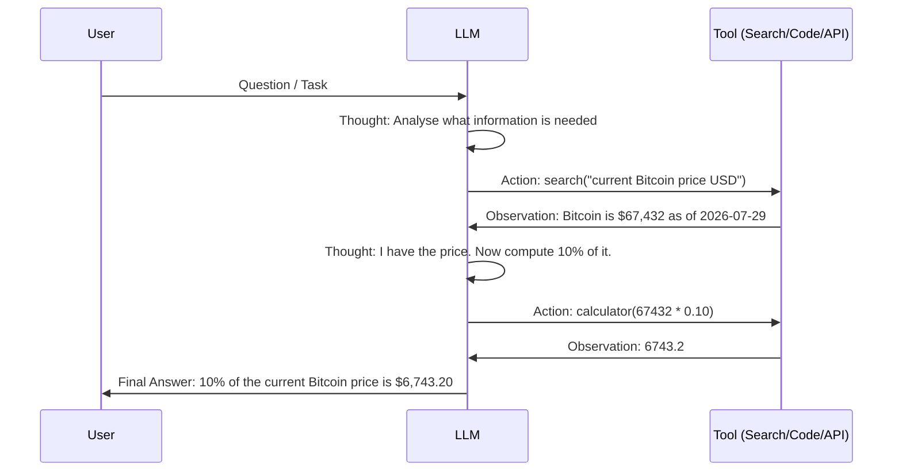

# ReAct and Agentic Prompting

> [!abstract] TL;DR
> ReAct (Reason + Act) is a prompting pattern where the model interleaves reasoning (Thought) with tool invocations (Action) and incorporates results (Observation) iteratively until a task is complete. This pattern is the foundation of most LLM agent frameworks, enabling models to browse the web, run code, query databases, and call APIs in an autonomous loop.

## What Is ReAct?

**ReAct** (from the paper "ReAct: Synergizing Reasoning and Acting in Language Models", Yao et al., 2022) interleaves two types of output:

1. **Thought** — internal reasoning about what to do next and why
2. **Action** — a call to an external tool (search, calculator, code executor, API)
3. **Observation** — the result returned by the tool, fed back into the context

This Thought → Action → Observation loop continues until the model produces a final answer. Unlike pure CoT (reasoning only) or pure action sequences, ReAct grounds reasoning in real information and adapts based on tool results.

## The Thought → Action → Observation Loop



A minimal text-format ReAct prompt:

```
Answer the following question using the available tools. Use this format:

Thought: [your reasoning about what to do]
Action: [tool_name]([arguments])
Observation: [result from tool]
... (repeat as needed)
Final Answer: [your conclusion]

Tools available:
- search(query) — web search, returns top result
- calculator(expression) — evaluates a math expression

Question: How many days has it been since Ethereum launched, and what is its current market cap?
```

## Enabling Agents Through ReAct

ReAct is the backbone of modern LLM agents. By repeatedly calling the Thought/Action/Observation cycle, the model can:

- **Browse the web** — retrieve current information beyond its training cut-off
- **Execute code** — verify calculations, run data analysis
- **Query databases** — translate natural language to SQL, execute, interpret results
- **Call APIs** — place orders, fetch weather, send notifications
- **Read/write files** — process documents, generate reports

The agent terminates when the model decides it has enough information to produce a final answer, or when a maximum step count is reached.

## Few-Shot ReAct Example

Providing 1–2 full ReAct trajectories as examples dramatically improves reliability:

```
Example trajectory:

Question: What is the capital of the country that hosted the 2022 FIFA World Cup?
Thought: I need to find which country hosted the 2022 FIFA World Cup.
Action: search("2022 FIFA World Cup host country")
Observation: The 2022 FIFA World Cup was hosted by Qatar.
Thought: Now I need the capital of Qatar.
Action: search("capital of Qatar")
Observation: The capital of Qatar is Doha.
Final Answer: The capital of the country that hosted the 2022 FIFA World Cup is Doha.

---

Now answer:
Question: Who is the current CEO of the company that makes the M1 chip?
Thought:
```

## Plan-and-Execute Pattern

An alternative to ReAct for long-horizon tasks is **Plan-and-Execute**:

1. **Plan phase:** Ask the model to generate a complete multi-step plan before executing anything
2. **Execute phase:** Execute each plan step sequentially, updating the plan if new information changes the approach

```python
PLAN_PROMPT = """
Given the following task, create a numbered plan of steps to complete it.
Consider what tools and information you'll need at each step.
Be specific about what actions you'll take.

Task: {task}

Plan:
"""

EXECUTE_STEP_PROMPT = """
You are executing step {step_number} of a plan.

Full plan: {plan}
Steps completed so far: {completed_steps}
Current step: {current_step}

Tools available: {tools}

Execute this step. If you need a tool, use format: ACTION: tool_name(args)
If you have the result, use format: RESULT: [result]
"""
```

Plan-and-Execute works better than ReAct for tasks where the full sequence is predictable upfront and where knowing the plan helps execution (e.g., writing a multi-chapter document, running a multi-stage data pipeline).

## Prompting for Tool/Function Calling

Modern LLM APIs support **function calling** (OpenAI) / **tool use** (Anthropic), where tools are defined in a structured schema rather than in prose:

```python
import openai

client = openai.OpenAI()

tools = [
    {
        "type": "function",
        "function": {
            "name": "get_stock_price",
            "description": "Get the current stock price for a given ticker symbol.",
            "parameters": {
                "type": "object",
                "properties": {
                    "ticker": {
                        "type": "string",
                        "description": "The stock ticker symbol, e.g. 'AAPL'"
                    }
                },
                "required": ["ticker"]
            }
        }
    }
]

response = client.chat.completions.create(
    model="gpt-4o",
    messages=[{"role": "user", "content": "What is the current price of Apple stock?"}],
    tools=tools,
    tool_choice="auto"  # Let model decide when to call tools
)

# Check if model wants to call a tool
if response.choices[0].finish_reason == "tool_calls":
    tool_call = response.choices[0].message.tool_calls[0]
    print(f"Tool: {tool_call.function.name}")
    print(f"Args: {tool_call.function.arguments}")
    # Execute the tool, then send observation back in next message
```

```python
# Anthropic equivalent
import anthropic
import json

client = anthropic.Anthropic()

tools = [
    {
        "name": "get_stock_price",
        "description": "Get the current stock price for a given ticker symbol.",
        "input_schema": {
            "type": "object",
            "properties": {
                "ticker": {"type": "string", "description": "Stock ticker symbol"}
            },
            "required": ["ticker"]
        }
    }
]

response = client.messages.create(
    model="claude-sonnet-4-5",
    max_tokens=1024,
    tools=tools,
    messages=[{"role": "user", "content": "What is Apple's stock price?"}]
)

for block in response.content:
    if block.type == "tool_use":
        print(f"Tool: {block.name}, Input: {block.input}")
```

## ReAct vs. Single-Shot: When to Use Which

| Scenario | Use Single-Shot | Use ReAct / Agentic |
|----------|----------------|---------------------|
| Information is in training data | Yes | No |
| Requires current real-world data | No | Yes |
| Single-step computation | Yes | No |
| Multi-step sequential task | Sometimes (CoT) | Yes |
| Requires external API calls | No | Yes |
| Low latency required (<1 s) | Yes | No (adds RTT per step) |
| Unpredictable number of steps | No | Yes |
| Safety-critical with human oversight | No | Depends (with HITL) |

## ReAct Agent Loop in Python Pseudocode

```python
def react_agent(task: str, tools: dict, max_steps: int = 10) -> str:
    """
    Minimal ReAct agent loop.
    tools: dict mapping tool_name -> callable
    """
    messages = [{"role": "user", "content": task}]
    
    for step in range(max_steps):
        # Ask model for next thought/action
        response = llm_call(messages, system=REACT_SYSTEM_PROMPT)
        
        # Parse response
        if response.startswith("Final Answer:"):
            return response.replace("Final Answer:", "").strip()
        
        thought, action_str = parse_thought_action(response)
        tool_name, tool_args = parse_action(action_str)
        
        # Execute tool
        if tool_name in tools:
            observation = tools[tool_name](**tool_args)
        else:
            observation = f"Error: Unknown tool '{tool_name}'"
        
        # Add to message history
        messages.append({"role": "assistant", "content": response})
        messages.append({
            "role": "user",
            "content": f"Observation: {observation}"
        })
    
    return "Max steps reached without final answer."
```

## Connection to AI Agents

ReAct-style prompting is the foundation of frameworks like:
- **LangChain Agents** — wraps ReAct with tool schemas, memory, and callbacks
- **LlamaIndex agents** — document-centric ReAct for RAG + tool use
- **AutoGPT / BabyAGI** — task decomposition and ReAct loops
- **Claude's tool use** — native function calling using structured tool definitions
- **OpenAI Assistants API** — hosted agent with code interpreter and file retrieval

Understanding ReAct at the prompt level means you can debug agent failures, improve tool descriptions, and design reliable agentic pipelines without being constrained to a specific framework.

## Common Pitfalls

> [!warning] Pitfall 1 — Poorly Described Tools
> The model's decision to use a tool — and how to use it — depends entirely on the tool's name and description. Vague descriptions ("get data") lead to wrong tool selection. Tool names should be verb-nouns ("search_web", "run_sql"), and descriptions should include what inputs are needed, what format they take, and what the output represents.

> [!warning] Pitfall 2 — No Step Limit
> Without a maximum step count, a buggy agent can loop indefinitely or call tools thousands of times. Always set `max_steps` and have a graceful fallback response. Also monitor for circular loops where the same tool is called with identical arguments repeatedly.

> [!warning] Pitfall 3 — Trusting Tool Observations Blindly
> The model incorporates tool observations into its reasoning as if they are ground truth. If your tool has a bug, returns errors, or is compromised (prompt injection via search results), the model will propagate the error. Validate tool outputs and consider adding a "sanity check" prompt step after critical tool calls.

## Review Questions

> [!question] Q1 — What is the key insight that makes ReAct more reliable than CoT for factual tasks?
> **A:** CoT is purely internal reasoning over the model's training knowledge — it can confabulate facts confidently. ReAct grounds reasoning in actual tool observations: the model searches the web, queries a database, or runs code, and the result is injected as factual grounding. This breaks the model's reliance on potentially outdated or incorrect training data.

> [!question] Q2 — When should you prefer Plan-and-Execute over ReAct?
> **A:** Plan-and-Execute is better when the task has a predictable structure (a recipe with known steps), when you want the user to approve the plan before execution, or when the execution is expensive (e.g., running computations) and you want to catch plan errors early. ReAct is better for exploratory tasks where the next step depends on what the previous step returned.

> [!question] Q3 — What is the role of the "system prompt" in an agentic context?
> **A:** In an agent, the system prompt defines the agent's role, available tools (often duplicated as prose descriptions), output format (Thought/Action/Observation), stop conditions, safety constraints, and fallback behaviours. It is the "operating system" of the agent — carefully engineering it determines how reliably the agent follows the intended loop and handles edge cases.

## See Also

- [[Chain_of_Thought_Prompting]]
- [[Advanced_Prompting_Strategies]]
- [[LLM_APIs_and_SDKs]]
- [[ReAct_Pattern]]
- [[AI_Agents_Overview]]
- [[_MOC_Prompt_Engineering_Master]]
