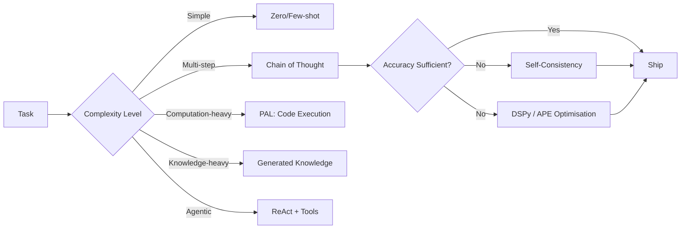

# Advanced Prompting Strategies

> [!abstract] TL;DR
> Beyond the basics, advanced PE includes meta-prompting (asking models to generate better prompts), generated knowledge prompting (surfacing relevant facts before answering), program-aided reasoning, and automatic optimisation frameworks like DSPy and APE. These techniques push model performance to near-ceiling on difficult tasks and reduce manual prompt engineering effort.

## Meta-Prompting

**Meta-prompting** uses the LLM itself to generate, critique, or improve prompts. There are two main flavours:

### Ask the Model to Write a Better Prompt

```
You are an expert prompt engineer. I have a poorly-performing prompt below.
Rewrite it to improve clarity, specificity, and reliability of outputs.
Preserve the core task intent.

Original prompt:
"""
Summarise this document.
"""

Context: The output is used to populate a 3-sentence abstract for an academic database.
The audience is researchers scanning paper lists. Documents are research papers.

Rewritten prompt:
```

### Ask the Model to Self-Critique and Revise

```
Task: Generate a Python function that parses ISO 8601 datetime strings.

Step 1: Generate your initial implementation.
Step 2: Review it for edge cases, error handling, and PEP 8 compliance.
Step 3: Revise and output the final, improved version with no additional commentary.
```

Meta-prompting is particularly powerful for:
- Bootstrapping prompts when you're unsure how to start
- Improving prompt quality without manual iteration
- Adapting prompts to new domains or models quickly

## Generated Knowledge Prompting

Ask the model to retrieve and articulate relevant background knowledge before answering:

```
Before answering, generate 5 key facts about the following topic that are
relevant to answering the question correctly.

Topic: Byzantine fault tolerance in distributed systems
Question: Why is 3f+1 nodes the minimum required to tolerate f Byzantine failures?

Relevant facts:
1. [Model generates facts here]
2. ...

Now, using these facts, answer the question:
```

**Why it works:** LLMs have vast knowledge but may not "activate" the right subset for a given question. Explicitly asking for relevant facts before answering forces the model to prime its attention on the right knowledge regions before producing the answer.

**Benchmark improvement:** Generated knowledge prompting improved accuracy on commonsense QA benchmarks (NumerSense, WebQuestions) by 3–8 percentage points compared to standard few-shot.

## Directional Stimulus Prompting

**Directional stimulus prompting** adds a "hint" or keyword to guide the model toward a specific answer style or category without revealing the full answer:

```
Summarise the following news article in 2 sentences.
Hint: focus on the economic impact and regulatory implications.

Article: [article text]

Summary:
```

This is useful when you know the dimension of the answer you care about but want the model to flesh it out, rather than constraining it to a rigid format. Particularly effective for RAG systems where retrieved documents may cover many aspects.

## Program-Aided Language Models (PAL)

**PAL** asks the model to write executable code as the reasoning mechanism, then executes the code to get the answer. This is superior to pure CoT for calculations because code is deterministic.

```
Use Python code to solve the following math word problem.
Write the code, then show the result.

Problem: A store sells apples at $1.20 each and oranges at $0.90 each.
         If someone buys 7 apples and 5 oranges, what is the total cost?
         Apply a 8.5% sales tax.

Python code:
```python
apple_price = 1.20
orange_price = 0.90
apple_count = 7
orange_count = 5
tax_rate = 0.085

subtotal = (apple_price * apple_count) + (orange_price * orange_count)
tax = subtotal * tax_rate
total = subtotal + tax
print(f"Subtotal: ${subtotal:.2f}")
print(f"Tax: ${tax:.2f}")
print(f"Total: ${total:.2f}")
```

Result: Subtotal: $12.90, Tax: $1.10, Total: $14.00
```

In a production PAL system, the code block is extracted and executed in a sandbox (e.g., Python subprocess with a timeout), and the result is injected back into the conversation. This eliminates arithmetic errors entirely.

## Automatic Prompt Engineer (APE)

**APE** (Zhou et al., 2022) treats prompt creation as an optimisation problem:

1. Ask the model to generate N candidate prompts for a task
2. Score each candidate on a held-out eval set
3. Select the best-scoring prompt or use it to generate further candidates

```python
# Simplified APE loop
def ape_optimise(task_description, examples, eval_fn, n_candidates=10, n_rounds=3):
    """
    Automatically optimise a prompt using iterative candidate generation + evaluation.
    """
    # Round 0: generate initial candidates
    generation_prompt = f"""
    Task: {task_description}
    
    Generate {n_candidates} different instruction prompts for this task.
    Each prompt should be on a new line, starting with 'PROMPT: '.
    Vary the style, specificity, and framing.
    """
    candidates = generate_and_parse_candidates(generation_prompt)
    
    best_prompt = None
    best_score = -1
    
    for round_idx in range(n_rounds):
        scores = [eval_fn(prompt, examples) for prompt in candidates]
        best_idx = scores.index(max(scores))
        
        if scores[best_idx] > best_score:
            best_score = scores[best_idx]
            best_prompt = candidates[best_idx]
        
        # Generate next-round candidates near the best
        refinement_prompt = f"""
        The following prompt scored {scores[best_idx]:.2f} on the task:
        
        "{best_prompt}"
        
        Generate {n_candidates} improved variants of this prompt.
        """
        candidates = generate_and_parse_candidates(refinement_prompt)
    
    return best_prompt, best_score
```

## DSPy: Declarative Self-Improving Prompts

**DSPy** (Khattab et al., 2023) from Stanford is a framework that replaces hand-written prompts with compiled programs. Instead of writing prompts, you define **modules** (e.g., `dspy.ChainOfThought`) and **metrics**, then compile the program against training examples.

```python
import dspy

# Configure the LM
lm = dspy.LM("openai/gpt-4o")
dspy.configure(lm=lm)

# Define a program with automatic CoT
class RAGQAProgram(dspy.Module):
    def __init__(self):
        self.retrieve = dspy.Retrieve(k=3)
        self.answer = dspy.ChainOfThought("context, question -> answer")
    
    def forward(self, question):
        context = self.retrieve(question).passages
        return self.answer(context=context, question=question)

# Compile: DSPy automatically optimises prompts/few-shot examples
from dspy.teleprompt import BootstrapFewShot

teleprompter = BootstrapFewShot(metric=my_metric)
compiled_program = teleprompter.compile(RAGQAProgram(), trainset=train_examples)
```

DSPy is transformative for teams running large-scale LLM pipelines: instead of manually A/B testing prompt wording, DSPy automatically discovers what works.

## Prompt Compression

For very long contexts (documents, histories), **prompt compression** reduces token count while preserving semantic content:

### LLMLingua / LongLLMLingua

Token-level compression: perplexity-based pruning of tokens the LLM can infer from context. Achieves 4–20x compression with minimal quality loss on downstream tasks.

### Selective Summarisation

```
[System]: You are a context compression assistant. Given a long conversation history,
produce a compressed summary that preserves all task-relevant facts, decisions made,
and open questions. Discard pleasantries, redundant explanations, and resolved tangents.
Maximum 200 tokens.

[User]: [paste 2000-token conversation history]
```

### Hierarchical Summarisation for Very Long Documents

```python
def hierarchical_compress(document: str, chunk_size: int = 2000, summary_tokens: int = 200) -> str:
    """Compress a long document hierarchically."""
    chunks = split_into_chunks(document, chunk_size)
    
    # Level 1: summarise each chunk
    chunk_summaries = [summarise(chunk, max_tokens=summary_tokens) for chunk in chunks]
    
    # Level 2: if still too long, summarise summaries
    combined = "\n".join(chunk_summaries)
    if count_tokens(combined) > 4000:
        return summarise(combined, max_tokens=1000)
    return combined
```

## Advanced Technique Catalog

| Technique | Core Idea | Best For | Token Cost |
|-----------|-----------|----------|-----------|
| Meta-prompting | Model generates/improves its own prompts | Bootstrapping, adaptation | Medium |
| Generated knowledge | Recall facts before answering | Knowledge-intensive QA | Low-Medium |
| Directional stimulus | Hint guides answer dimension | RAG summarisation | Very Low |
| PAL | Write + execute code for reasoning | Arithmetic, computation | Medium |
| APE | Auto-generate + score candidate prompts | Prompt optimisation at scale | High (eval set) |
| DSPy | Declare modules, compile prompts | Large pipelines, automation | High (training) |
| Prompt compression | Reduce tokens, preserve semantics | Long context, cost reduction | Preprocessing |
| Self-consistency | Sample N CoT paths, vote | High-stakes accuracy | N× base cost |



## Common Pitfalls

> [!warning] Pitfall 1 — Meta-Prompt Bias
> When asking the model to write a better prompt, it will optimise for prompts it "likes" (verbose, structured, polite) rather than prompts that empirically perform best. Always evaluate meta-generated prompts on actual task examples; don't assume the model's self-improvement is well-calibrated.

> [!warning] Pitfall 2 — PAL Sandbox Security
> Executing model-generated code is inherently risky. Never run PAL code outside a sandboxed environment with resource limits (CPU time, memory, network access disabled). A prompt injection attack could cause the model to generate malicious code.

> [!warning] Pitfall 3 — DSPy Overfitting to Training Examples
> Like any ML optimisation, DSPy can overfit prompts to training examples. Validate compiled prompts on a held-out test set and check for generalisation to distribution-shifted inputs. A prompt that scores perfectly on training examples may be brittle in production.

## Review Questions

> [!question] Q1 — What is the key advantage of PAL over standard CoT for mathematical tasks?
> **A:** CoT relies on the model performing arithmetic in natural language token generation, which is error-prone (models are not reliable calculators). PAL externalises computation to an actual Python interpreter — code is deterministic and accurate. The model's role is to translate the word problem into correct code; execution handles the arithmetic perfectly.

> [!question] Q2 — How does DSPy differ from prompt engineering as typically practised?
> **A:** Traditional prompt engineering is manual: a human writes prompt text, tests it, and iterates. DSPy is declarative and automated: the developer specifies the program structure (modules, metrics) and DSPy automatically discovers effective prompts and few-shot examples through compilation against training data. This shifts PE from craft to software engineering.

> [!question] Q3 — When is prompt compression most valuable?
> **A:** When working with: very long documents that exceed comfortable context windows, RAG pipelines where retrieved chunks need to fit alongside instructions, conversation histories that grow over many turns, or cost-sensitive deployments where reducing input tokens directly cuts costs. The tradeoff is compression latency and potential semantic loss for nuanced content.

## See Also

- [[Chain_of_Thought_Prompting]]
- [[Prompt_Optimization_and_Testing]]
- [[ReAct_and_Agentic_Prompting]]
- [[Structured_Output_Prompting]]
- [[_MOC_Prompt_Engineering_Master]]
