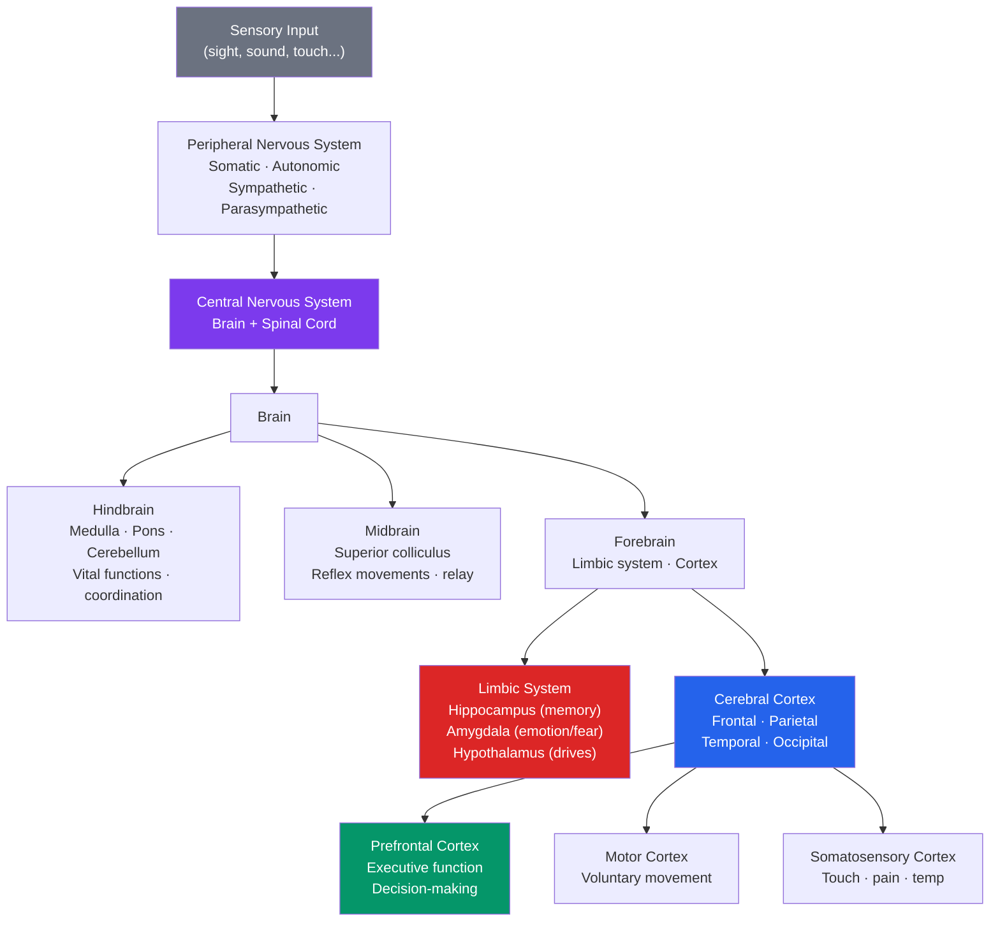

# 🧬 Biological Basis of Behavior

> [!abstract] TL;DR
> Every thought, emotion, and behavior has a biological substrate. The nervous system — built from ~86 billion neurons communicating via electrochemical signals — is the hardware of the mind. Specific brain regions handle specific functions (though rarely exclusively), neurotransmitters modulate mood and cognition, and the endocrine system provides a slower hormonal layer. Nature and nurture interact: genes set possibilities; experience shapes which circuits get wired.

## Intuition — analogy FIRST

Think of the brain as a country's communication infrastructure.

**Neurons** are individual telegraph operators, each with a receiving station (dendrites), a processing center (cell body), and a transmitting wire (axon). They fire messages in a binary code: either the signal is strong enough to fire (action potential) or it isn't — there is no "half a message."

**Synapses** are the relay stations between operators. The first operator releases chemical messengers (neurotransmitters) into a gap; the next operator's receivers (receptors) pick them up and decide whether to forward the message. Different chemicals create different messages: dopamine says "that was rewarding," serotonin says "stay calm," norepinephrine says "pay attention — something important is happening."

**Brain regions** are cities with specialized industries — the hippocampus processes maps and memories, the amygdala runs the emergency alert system, the prefrontal cortex is the executive branch.

---

## How It Works



## Key Concepts / Details

### The Neuron

The basic unit of the nervous system:

| Part | Function |
|---|---|
| **Dendrites** | Receive signals from other neurons |
| **Cell body (soma)** | Integrates incoming signals; contains nucleus |
| **Axon** | Transmits electrical signal away from cell body |
| **Myelin sheath** | Fatty coating that speeds signal transmission (damaged in MS) |
| **Axon terminals** | Release neurotransmitters into the synapse |
| **Synapse** | Gap between neurons where chemical communication occurs |

**Action potential**: When dendrite signals summate to exceed the **threshold** (~−55 mV), the neuron fires an all-or-nothing electrical spike traveling down the axon at 1–120 m/s.

**Refractory period**: Brief period after firing when the neuron cannot fire again — sets a maximum firing rate.

### Neurotransmitters and Their Functions

| Neurotransmitter | Key Functions | Imbalance |
|---|---|---|
| **Dopamine** | Reward, motivation, motor control | Low: Parkinson's, depression; High: schizophrenia |
| **Serotonin** | Mood, sleep, appetite | Low: depression, anxiety (SSRIs boost it) |
| **Norepinephrine** | Arousal, attention, fight-or-flight | Low: depression; High: anxiety, ADHD |
| **GABA** | Primary inhibitory neurotransmitter; reduces neural activity | Low: anxiety, epilepsy (benzodiazepines boost GABA) |
| **Glutamate** | Primary excitatory neurotransmitter; learning and memory | Excess: neuronal death after stroke |
| **Acetylcholine** | Muscle activation, memory, learning | Low in hippocampus: Alzheimer's disease |
| **Endorphins** | Pain reduction, euphoria (natural opioids) | Runner's high; blocked by naloxone |

### Brain Regions and Functions

**Hindbrain** (ancient — shared with all vertebrates):
- **Medulla oblongata**: breathing, heart rate, blood pressure (damage = death)
- **Pons**: sleep regulation, facial sensation, motor control
- **Cerebellum**: balance, coordination, procedural learning ("muscle memory")

**Limbic System** (emotional/motivational center):
- **Amygdala**: fear conditioning, emotional memory, threat detection — goes online before cortex in emergencies (LeDoux's fear pathway)
- **Hippocampus**: explicit (declarative) memory formation; spatial navigation; damaged in H.M. case — see [[Memory_Systems]]
- **Hypothalamus**: regulates hunger, thirst, temperature, sex drive, circadian rhythms; controls pituitary gland
- **Thalamus**: sensory relay station — all senses (except smell) route through here

**Cerebral Cortex** (uniquely large in humans):

| Lobe | Primary Function | Key Regions |
|---|---|---|
| **Frontal** | Executive function, motor control, personality | Prefrontal cortex (planning/inhibition), Broca's area (speech production) |
| **Parietal** | Somatosensory processing, spatial processing | Somatosensory cortex, angular gyrus |
| **Temporal** | Auditory processing, language comprehension, memory | Wernicke's area, hippocampus |
| **Occipital** | Visual processing | Primary visual cortex, object/face recognition areas |

**Lateralization**: left hemisphere dominates language in ~95% of right-handers; right hemisphere excels at spatial processing. Roger Sperry's split-brain research (severing corpus callosum) revealed these specializations.

### The Endocrine System

Slower than the nervous system — communicates via hormones through the bloodstream.

| Gland/Hormone | Function |
|---|---|
| **Adrenal glands / cortisol** | Stress response — sustained alertness and glucose mobilization |
| **Adrenal glands / epinephrine (adrenaline)** | Immediate fight-or-flight activation |
| **Pituitary gland** | "Master gland" — regulates other endocrine glands |
| **Hypothalamus** | Links nervous and endocrine systems |
| **Thyroid / thyroxine** | Metabolic rate; low → fatigue/depression |
| **Gonads / testosterone & estrogen** | Sex characteristics, aggression (testosterone), reproductive cycles |
| **Pancreas / insulin** | Blood glucose regulation; insufficient → diabetes |

### Nervous System Organization

```
Nervous System
├── Central Nervous System (CNS)
│   ├── Brain
│   └── Spinal cord
└── Peripheral Nervous System (PNS)
    ├── Somatic NS (voluntary muscle control)
    └── Autonomic NS
        ├── Sympathetic ("fight or flight") — dilates pupils, ↑ HR, ↑ blood glucose
        └── Parasympathetic ("rest and digest") — constricts pupils, ↓ HR, ↑ digestion
```

### Nature vs. Nurture: Genes and Environment

- **Heritability**: the proportion of variance in a trait explained by genetics in a given population. Heritability for intelligence ~0.5–0.8 in adults.
- **Twin studies**: identical (monozygotic) twins share 100% of DNA; fraternal (dizygotic) share ~50%. If MZ twins are more similar than DZ twins, genetics matter.
- **Gene-environment interaction**: genes set a *reaction range* — environment determines where within that range development falls (e.g., tall parents' child grows tallest with best nutrition).
- **Epigenetics**: experience modifies gene *expression* without changing DNA sequence — early childhood stress alters stress-response gene methylation.

## Real-World Notes

- **Neuroplasticity**: the brain reorganizes itself in response to experience. London taxi drivers (memorizing thousands of streets) develop larger hippocampal gray matter. Stroke rehabilitation leverages neuroplasticity.
- **Psychopharmacology**: antidepressants (SSRIs) block serotonin reuptake → more serotonin in the synapse. Antipsychotics (e.g., haloperidol) block dopamine receptors.
- **Sleep and brain health**: during sleep, the glymphatic system flushes metabolic waste (including amyloid-beta, linked to Alzheimer's) from the brain. See [[States_of_Consciousness]].
- **Exercise and cognition**: aerobic exercise consistently increases BDNF (brain-derived neurotrophic factor), promotes neurogenesis in the hippocampus, and improves [[Memory_Systems]] and mood.

## Common Pitfalls

- **"We only use 10% of our brain"** — false. All regions are active; neuroimaging shows no dormant 90%.
- **Localization fallacy**: brain regions collaborate in networks; "the hippocampus is the memory center" oversimplifies — memory involves amygdala, prefrontal cortex, and others.
- **Reductionism trap**: explaining all behavior by neurons ignores the equally real psychological, social, and cultural levels of analysis (the biopsychosocial model).
- **Neurotransmitter imbalance oversimplification**: depression is not simply "low serotonin" — the reality involves receptors, neural circuits, neurogenesis, and more.

## Related Concepts

- [[_MOC_Psychology_Foundations|↑ Section MOC]]
- [[Sensation_and_Perception]] — How neural pathways transform physical energy into perception
- [[States_of_Consciousness]] — Altered states have identifiable neural correlates
- [[Memory_Systems]] — The hippocampus and the neuroscience of memory
- [[Emotion_Theories]] — The amygdala and prefrontal cortex as the dual-process of emotion
- [[Stress_and_Coping]] — The HPA axis and cortisol's role in chronic stress

## Review Questions

1. Trace the path of a fear response from perceiving a threat to a physical reaction, naming the neural structures and neurotransmitters/hormones involved at each step.
2. What did Phineas Gage's case (frontal lobe injury from a railroad spike) and H.M.'s case (hippocampus removal) each reveal about brain function? What type of evidence is this?
3. Explain gene-environment interaction using height as an example. Why does high heritability NOT mean genetic determination?

## Sources

- David Myers & C. Nathan DeWall, *Psychology*, 12th ed., Ch. 2
- Joseph LeDoux, *The Emotional Brain* (1996) — amygdala and fear
- Eric Kandel, *In Search of Memory* (2006) — neural basis of memory
- Antonio Damasio, *Descartes' Error* (1994) — emotion and decision-making

#psychology #foundations #neuroscience #biological-basis
