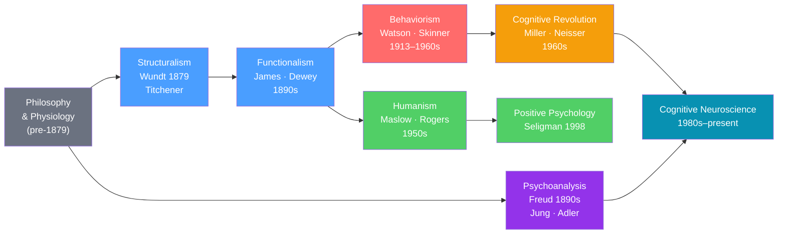

# 🏛️ History and Schools of Psychology

> [!abstract] TL;DR
> Psychology evolved from philosophy and physiology into a scientific discipline over roughly 150 years. Each major school — structuralism, functionalism, behaviorism, psychoanalysis, humanism, the cognitive revolution, and modern neuroscience — was a reaction to the perceived failures of its predecessor. Understanding the schools is understanding *why* we study what we study and how.

## Intuition — analogy FIRST

Think of psychology's schools like competing maps of the same city.

Structuralism tried to map every street corner (breaking consciousness into its smallest elements). Functionalism said "forget the street corners — what matters is how people *move through* the city." Behaviorism threw out the map entirely: "we can only measure what enters and exits the city, not what happens inside." Psychoanalysis drew a secret underground subway (the unconscious) the official maps ignored. Humanism insisted the map needed to show people's destination, not just their route. The cognitive revolution restored the interior map with a new tool: the computer as metaphor. Neuroscience finally provided satellite imagery of the actual terrain.

---

## How It Works

## Key Concepts / Details

### Pre-Scientific Foundations (Before 1879)

Psychology emerged from two parent disciplines:
- **Philosophy** — Descartes' mind-body dualism, Locke's empiricism ("tabula rasa"), Kant's nativism
- **Physiology** — Helmholtz's nerve conduction experiments, Fechner's psychophysics (quantifying sensation)

The key insight that enabled a *science* of psychology: **mental events could be measured**.

### Structuralism — Wundt and Titchener (1879–1910s)

Wilhelm Wundt opened the first psychology lab in Leipzig in **1879** — the birth year of scientific psychology. His method: **introspection** (trained observers reporting on their own conscious experience). Edward Titchener brought structuralism to America.

| Feature | Detail |
|---|---|
| Core question | What are the basic elements (structure) of consciousness? |
| Method | Introspection — systematic self-report |
| Key concept | Mental chemistry: combine elements to form compounds |
| Criticism | Unreliable, introspective reports vary between observers; ignores function |

### Functionalism — James and Dewey (1890s)

William James (author of *Principles of Psychology*, 1890) asked not *what* the mind is made of but *what it does* — how mental processes help organisms **adapt**. Influenced by Darwin's evolution.

- **Stream of consciousness**: experience as a flowing river, not discrete elements
- **Pragmatism**: ideas should be judged by their practical effects
- Led directly to applied psychology, educational psychology, and industrial psychology

### Behaviorism — Watson and Skinner (1913–1960s)

John B. Watson's 1913 manifesto: psychology should study only **observable behavior**, not consciousness. The mind is a "black box."

| Theorist | Key Contribution |
|---|---|
| Ivan Pavlov | Classical conditioning — learned associations between stimuli |
| John B. Watson | Founded behaviorism; Little Albert experiment (conditioned fear) |
| B.F. Skinner | Operant conditioning — behavior shaped by consequences (reinforcement/punishment) |

Behaviorism dominated American psychology for ~50 years. Its legacy: rigorous experimental methods, behavior therapy, token economies. Its failure: it couldn't explain language acquisition, insight learning, or cognitive maps.

### Psychoanalysis — Freud and His Circle (1890s–)

Sigmund Freud proposed the **unconscious mind** as the primary driver of behavior — memories, desires, and conflicts outside awareness. His structural model: **id** (primitive drives), **ego** (rational mediator), **superego** (internalized morality).

| Concept | Meaning |
|---|---|
| Unconscious | Mental content inaccessible to conscious awareness |
| Defense mechanisms | Ego strategies to reduce anxiety (repression, projection, rationalization) |
| Psychosexual stages | Oral → Anal → Phallic → Latency → Genital |
| Free association | Therapeutic technique to access unconscious material |

**Carl Jung** (collective unconscious, archetypes), **Alfred Adler** (inferiority complex, social interest), **Karen Horney** (feminist critique, basic anxiety) all extended or challenged Freud.

Criticism: unfalsifiable claims, heavy reliance on case studies, cultural bias. Legacy: the unconscious is real (confirmed by cognitive science), defense mechanisms have empirical support.

### Gestalt Psychology (1910s–1930s)

Wertheimer, Köhler, and Koffka: "The whole is greater than the sum of its parts." Perception is organized, not assembled from pieces. Core principles (proximity, similarity, closure, continuity) directly influence design and UX today. See [[Sensation_and_Perception]].

### Humanism — Maslow and Rogers (1950s)

A "third force" rejecting both behaviorism's mechanism and psychoanalysis's pathology focus. Humans are inherently growth-oriented.

- **Abraham Maslow**: hierarchy of needs, self-actualization — see [[Maslows_Hierarchy]]
- **Carl Rogers**: unconditional positive regard, client-centered therapy, fully functioning person
- Legacy: positive psychology, person-centered therapy, the emphasis on human potential

### The Cognitive Revolution (1956–1970s)

The information-processing metaphor replaced behaviorism. Key events:
- **1956**: Miller's "magical number 7," Chomsky's critique of Skinner on language, Newell/Simon's Logic Theorist
- **Ulric Neisser** coined "cognitive psychology" in his 1967 textbook
- Computer science provided a new vocabulary: input/output, storage, processing, schemas

Led directly to modern research on [[Memory_Systems]], [[Attention_and_Cognitive_Load]], and [[Problem_Solving_and_Decision_Making]].

### Cognitive Neuroscience (1980s–Present)

The merger of cognitive psychology with neuroscience, enabled by neuroimaging (fMRI, PET, EEG). Major contributions:
- Locating cognitive functions in brain regions
- Discovering the **default mode network**
- Dual-process theory (Kahneman's System 1/2) — see [[Cognitive_Biases]]
- Affective neuroscience (LeDoux, Damasio) — see [[Emotion_Theories]]

### Summary Timeline

| Year | Event | Significance |
|---|---|---|
| 1879 | Wundt opens Leipzig lab | Birth of scientific psychology |
| 1890 | James's *Principles of Psychology* | Foundation of functionalism |
| 1900 | Freud's *Interpretation of Dreams* | Psychoanalysis founded |
| 1913 | Watson's behaviorist manifesto | 50-year dominance of behaviorism |
| 1938 | Skinner's *The Behavior of Organisms* | Operant conditioning systematized |
| 1943 | Maslow's motivation theory | Humanism's foundation |
| 1956 | "Cognitive revolution" begins | Mental processes back in focus |
| 1967 | Neisser's *Cognitive Psychology* | Cognitive era named |
| 1998 | Seligman's positive psychology | Wellbeing becomes a focus |

## Real-World Notes

- **UX/Design**: Gestalt principles (proximity, similarity, figure-ground) are directly applied in interface design.
- **Management**: Theory X/Y (McGregor) draws on behaviorism vs. humanism. See [[Organizational_Psychology]].
- **Therapy**: CBT synthesizes behaviorism (behavior change) and cognitive revolution (thought patterns). See [[Cognitive_Behavioral_Therapy]].
- **Marketing**: Behaviorist conditioning principles (association, reinforcement) underlie advertising psychology.

## Common Pitfalls

- **"Freud was all wrong"** — Some claims are unfalsifiable, but the unconscious, defense mechanisms, and the importance of early experience are empirically supported.
- **"Behaviorism is obsolete"** — Behavior therapy (CBT's behavioral arm) is highly effective; operant conditioning is foundational to animal training, token economies, and habit science.
- **Confusing schools with eras** — These are *perspectives*, not periods. Psychoanalysis and humanism are still practiced today; cognitive approaches don't invalidate earlier insights.

## Related Concepts

- [[_MOC_Psychology_Foundations|↑ Section MOC]]
- [[Research_Methods_Psychology]] — The scientific methods that tested these ideas
- [[Biological_Basis_of_Behavior]] — The neuroscience era's empirical grounding
- [[Maslows_Hierarchy]] — Humanism's signature contribution
- [[Cognitive_Biases]] — Cognitive revolution's most applied offspring
- [[Cognitive_Behavioral_Therapy]] — Synthesis of behaviorism and cognitive revolution
- [[Positive_Psychology]] — Humanism's modern, empirical successor

## Review Questions

1. What did behaviorism get right, and what problem led to the cognitive revolution?
2. Contrast Freud's structural model (id/ego/superego) with his topographic model (unconscious/preconscious/conscious). What's the difference?
3. Why did functionalism represent an intellectual step forward over structuralism — specifically, what changed about the question being asked?

## Sources

- David Myers & C. Nathan DeWall, *Psychology*, 12th ed., Ch. 1
- David Hothersall, *History of Psychology*, 4th ed.
- Ulric Neisser, *Cognitive Psychology* (1967)
- Thomas Hardy Leahey, *A History of Modern Psychology*, 4th ed.

#psychology #foundations #history #schools-of-psychology
