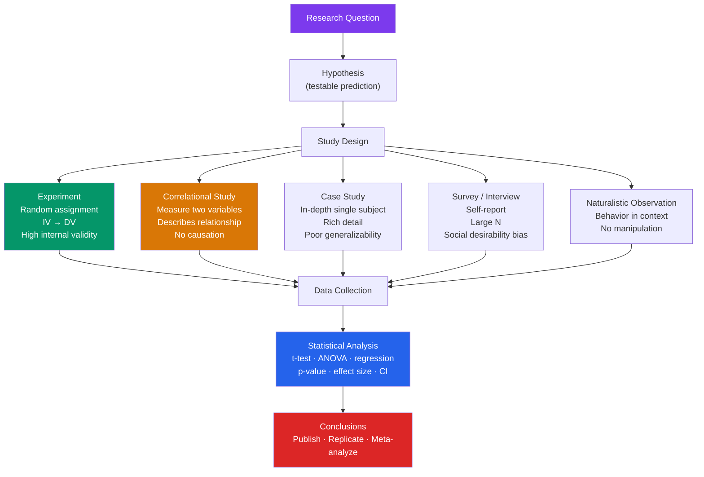

# 🔬 Research Methods in Psychology

> [!abstract] TL;DR
> Psychological research generates knowledge through systematic observation, controlled experiments, and statistical inference. The core challenge is **causation vs. correlation**: only a well-controlled experiment can establish that X *causes* Y. Every method has tradeoffs between internal validity (did our manipulation really cause the effect?) and external validity (do findings generalize to the real world?). Ethical principles — respect for persons, beneficence, justice — constrain all research.

## Intuition — analogy FIRST

Imagine you notice that cities with more ice cream shops have more drowning deaths. Should you ban ice cream?

Of course not — a third variable (hot weather) explains both. This is the **third-variable problem**, and it's why correlation does not imply causation. Psychology's arsenal of research methods is essentially an elaborate toolkit for ruling out alternative explanations:

- **Surveys and observation**: "Here's what people say/do" (descriptive, but no causation)
- **Correlational studies**: "These two things move together" (but we don't know why)
- **Experiments**: "We manipulated X and measured Y, everything else equal" (causation!)
- **Meta-analyses**: "Here's what 50 experiments found collectively" (the strongest evidence)

---

## How It Works

## Key Concepts / Details

### The Experiment — Gold Standard for Causation

An **experiment** requires:
1. **Independent Variable (IV)**: what the researcher manipulates
2. **Dependent Variable (DV)**: what the researcher measures
3. **Random Assignment**: participants randomly placed into conditions — equalizes all other variables
4. **Control Group**: receives no manipulation (or placebo) — the baseline

| Element | Why It Matters |
|---|---|
| Random assignment | Equates groups on everything except the IV |
| Control group | Establishes what would happen *without* the manipulation |
| Blind/double-blind | Prevents demand characteristics and experimenter bias |
| Operational definitions | Ensures replication — others know exactly what you measured |

**Example**: Milgram's obedience study was not a traditional experiment — it was a controlled observation of behavior under a specific social situation. See [[Social_Influence_and_Conformity]].

### Key Research Concepts

| Concept | Definition | Why It Matters |
|---|---|---|
| **Internal validity** | Confidence that IV caused the DV change | Experiments maximize this |
| **External validity** | Generalizability to other people/places/times | Field studies maximize this |
| **Reliability** | Consistency of a measure across time/raters | A measure must be reliable to be valid |
| **Validity** | Does the measure capture what it claims? | A test measuring IQ must actually measure intelligence |
| **Replication** | Can other labs reproduce the finding? | The replication crisis revealed ~50% of findings failed |

### Correlational Research

Measures two variables and computes a **correlation coefficient (r)**:
- **r = +1**: perfect positive relationship
- **r = 0**: no linear relationship
- **r = -1**: perfect negative relationship

**Rule**: correlation does not imply causation. Direction of causality and third variables remain ambiguous.

*Example*: r = −0.55 between hours of TV watched and academic performance. Does TV hurt grades? Or do students with poor grades watch more TV? Or does a third variable (parental involvement) affect both?

### Descriptive Methods

| Method | Strengths | Weaknesses |
|---|---|---|
| **Case study** | Rich detail, generates hypotheses | Cannot generalize; observer bias |
| **Survey** | Large samples, cost-effective | Self-report bias; social desirability |
| **Naturalistic observation** | Ecological validity; real behavior | No control; observer effect |
| **Interviews** | In-depth; flexible | Time-consuming; interviewer effects |

### Statistical Reasoning

**Null Hypothesis Significance Testing (NHST)**:
- **p-value**: probability of obtaining these results *if* the null hypothesis is true. p < .05 is the conventional threshold.
- **Effect size (Cohen's d, η²)**: how *big* is the effect, regardless of sample size? A statistically significant result can have a tiny practical effect.
- **Confidence interval**: range of values likely to contain the true population parameter.
- **Power**: probability of detecting a true effect. Small samples = low power = many false negatives.

> [!warning] The Replication Crisis
> Beginning ~2011, large-scale replication attempts found that only ~36–50% of published social psychology findings replicated. Causes: small samples, p-hacking, publication bias, lack of pre-registration. Led to open science reforms: pre-registration, larger samples, effect size reporting, open data.

### Research Ethics — APA Principles

| Principle | Requirement |
|---|---|
| **Informed consent** | Participants understand what they're agreeing to |
| **Confidentiality** | Data protected from disclosure |
| **Debriefing** | Participants told the true purpose after deception studies |
| **Minimizing harm** | No lasting psychological or physical damage |
| **Right to withdraw** | Participants can leave at any time without penalty |

Famous ethical failures that shaped modern standards:
- **Milgram (1963)**: participants deceived into believing they were shocking confederates
- **Tuskegee Syphilis Study (1932–1972)**: deliberately withheld treatment from Black men
- **Stanford Prison Experiment (1971)**: abandoned ethical protections mid-study

### Bias and Confounds

| Bias | Description |
|---|---|
| **Confirmation bias** | Seeking evidence that confirms hypotheses |
| **Demand characteristics** | Participants behave how they think researchers want |
| **Experimenter bias** | Researcher unconsciously influences results |
| **Social desirability bias** | Participants report what seems socially acceptable |
| **Selection bias** | Non-random sample undermines generalizability |
| **Hawthorne effect** | Behavior changes because people know they're being observed |

## Real-World Notes

- **Evidence-based practice**: Clinical psychology demands therapies backed by RCTs. CBT's effectiveness is well-supported; many older therapies have weak evidence bases. See [[Cognitive_Behavioral_Therapy]].
- **Business research**: A/B testing is a field experiment. When a tech company tests two UI designs with random assignment, it's applying the experimental method to product decisions.
- **Cognitive biases in research**: Researchers are not immune to [[Cognitive_Biases]] — confirmation bias affects hypothesis generation, framing effects affect how findings are reported.
- **Survey design**: Question wording, order effects, and scale anchoring all introduce systematic bias. Even minor wording changes can shift responses by 20+ percentage points.

## Common Pitfalls

- **Confusing statistical significance with practical significance** — p < .001 does not mean the effect is large or important; always report effect sizes.
- **"We found no effect, so there is no effect"** — Absence of evidence ≠ evidence of absence. Underpowered studies frequently miss real effects.
- **Treating correlation as causation in headlines** — "Coffee drinkers live longer" is almost always a correlational finding with confounds (healthier lifestyle overall).
- **WEIRD samples** — Most psychology research uses Western, Educated, Industrialized, Rich, Democratic participants. Findings don't always generalize cross-culturally.

## Related Concepts

- [[_MOC_Psychology_Foundations|↑ Section MOC]]
- [[History_and_Schools_of_Psychology]] — How the scientific approach to psychology developed
- [[Cognitive_Biases]] — How biases contaminate research and judgment
- [[Social_Influence_and_Conformity]] — Milgram and Asch studies illustrate the power of design
- [[Positive_Psychology]] — Seligman's movement partly driven by frustration with non-replicable findings

## Review Questions

1. A researcher finds that people who drink more coffee score higher on memory tests (r = +0.42). Name two third-variable explanations. How would you design an experiment to test whether coffee *causes* memory improvement?
2. What is the difference between internal validity and external validity? Give an example of a study with high internal validity but low external validity.
3. Why did the replication crisis shake confidence in social psychology? Name three open-science reforms that have since been adopted.

## Sources

- David Myers & C. Nathan DeWall, *Psychology*, 12th ed., Ch. 2
- Open Science Collaboration (2015). "Estimating the reproducibility of psychological science." *Science*, 349(6251)
- APA Ethical Principles of Psychologists and Code of Conduct (2017)
- Jacob Cohen, "The Earth Is Round (p < .05)." *American Psychologist*, 1994

#psychology #foundations #research-methods
