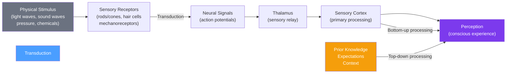

# 👁️ Sensation and Perception

> [!abstract] TL;DR
> Sensation is the detection of physical energy by sensory organs; perception is the brain's interpretation of that energy into meaningful experience. The gap between them explains why two people can receive identical sensory input but perceive entirely different things. Key principles: **transduction** converts physical energy to neural signals, **signal detection theory** shows that detection depends on both sensitivity and response bias, and **Gestalt principles** reveal the brain's default organizational strategies. Perception is always top-down as well as bottom-up.

## Intuition — analogy FIRST

Imagine the difference between a **security camera** and a **security guard**.

The camera (sensation) faithfully records whatever light hits its sensor — it doesn't interpret anything. Every pixel is just a number representing brightness.

The security guard (perception) watches the same footage but *interprets* it: "That person looks nervous." "That bag was left unattended for too long." "This doesn't look like the usual pattern." The guard's interpretation is shaped by experience, expectation, context, and current concerns.

Your visual cortex is not a camera — it actively constructs a model of reality, filling in gaps, suppressing irrelevant details, and flagging what matters based on everything you know and expect. This is why optical illusions fool us (the brain's heuristics are correct 99% of the time, so it skips verification), why you hear your name in a noisy party, and why radiologists with 10 years' experience detect cancers beginners miss.

---

## How It Works

## Key Concepts / Details

### Transduction

**Transduction** is the conversion of physical energy into neural signals:

| Sense | Physical Energy | Receptor | Neural Signal |
|---|---|---|---|
| Vision | Electromagnetic waves (380–700 nm) | Rods and cones (retina) | Optic nerve → visual cortex |
| Hearing | Air pressure waves (20–20,000 Hz) | Hair cells (cochlea) | Auditory nerve → auditory cortex |
| Touch | Mechanical pressure | Mechanoreceptors (skin) | Somatosensory cortex |
| Taste | Chemical molecules | Taste receptor cells (tongue) | Gustatory cortex |
| Smell | Airborne chemicals | Olfactory receptor neurons | Olfactory bulb (bypasses thalamus!) |
| Proprioception | Joint position, muscle stretch | Muscle spindles, joint receptors | Somatosensory + cerebellum |

### Absolute Threshold and Just Noticeable Difference

- **Absolute threshold**: the minimum stimulus intensity detectable 50% of the time (e.g., a candle flame seen at 30 miles on a clear night)
- **Difference threshold (JND — Just Noticeable Difference)**: the smallest detectable difference between two stimuli
- **Weber's Law**: the JND is a constant *proportion* of the original stimulus. You can detect a 1 oz weight added to a 10 oz object; you need 10 oz added to a 100 oz object. This ratio (~10%) stays constant.

**Sensory adaptation**: constant stimuli fade from awareness (you stop noticing the hum of the AC). Prevents sensory overload; explains why dramatic changes grab attention.

### Signal Detection Theory (SDT)

Traditional threshold models assumed a fixed detection threshold. SDT (Green & Swets, 1966) revealed detection depends on two things: **sensitivity (d')** and **response bias (β)**.

| Decision | Stimulus Present | Stimulus Absent |
|---|---|---|
| "Yes, I detected it" | **Hit** ✓ | **False Alarm** ✗ |
| "No, I didn't" | **Miss** ✗ | **Correct Rejection** ✓ |

A radiologist looking for cancer sets a **conservative criterion** (many false alarms are acceptable to avoid missing real cancers). An airport security screener under high alert lowers their criterion. Same sensitivity, different bias — SDT separates them.

Applications: medical diagnosis, eyewitness testimony reliability, sonar operators, lie detection.

### Gestalt Principles of Perceptual Organization

The Gestalt psychologists (Wertheimer, Köhler, Koffka) demonstrated that the brain organizes sensory input into wholes, not parts:

| Principle | Description | Example |
|---|---|---|
| **Figure-ground** | Distinguish object from background | Face vs. vase illusion |
| **Proximity** | Close items grouped together | Three dots vs. two+one |
| **Similarity** | Similar items grouped | OOOO XXXX appears as two groups |
| **Continuity** | Smooth lines seen as continuous | Two overlapping lines, not broken |
| **Closure** | Incomplete shapes seen as complete | Pac-Man → circle |
| **Common fate** | Elements moving together grouped | A flock of birds |

These principles are directly applied in UX design, logo design, and visual communication.

### Depth Perception

The brain infers 3D depth from 2D retinal images using:

**Binocular cues** (both eyes required):
- **Retinal disparity**: left and right eyes receive slightly different images; the brain computes depth from the difference (stereopsis)
- **Convergence**: eyes turn inward more for near objects

**Monocular cues** (one eye sufficient):
- **Linear perspective**: parallel lines converge at distance (railroad tracks)
- **Interposition**: overlapping objects — the one in front is closer
- **Relative size**: same-size objects appear smaller when farther away
- **Motion parallax**: near objects move faster in visual field when you move your head

### Perceptual Constancies

The brain maintains stable perception despite changing sensory input:

| Constancy | What Stays Constant |
|---|---|
| **Size constancy** | A person looks same size whether 3m or 30m away |
| **Shape constancy** | A door is "rectangular" even when viewed at an angle (trapezoid on retina) |
| **Color constancy** | A banana looks yellow in sunlight and under fluorescent lights |
| **Brightness constancy** | A white shirt in shadow still looks white, not gray |

**Muller-Lyer illusion**: two lines of equal length look different because perceptual constancy is cued by depth cues. Culture matters: people from carpentered environments (rectangular rooms) are more susceptible.

### Top-Down vs. Bottom-Up Processing

| Processing Type | Direction | Driven By |
|---|---|---|
| **Bottom-up (data-driven)** | Stimulus → perception | Raw sensory data |
| **Top-down (concept-driven)** | Expectations → perception | Prior knowledge, context, goals |

Both operate simultaneously. Context shapes what you see: "THE CAT" — the middle letters in "THE" and "CAT" are physically identical (H vs A), but context determines perception.

**Priming**: prior activation of a concept makes related concepts more accessible. See [[Cognitive_Biases]].

### Selective Attention

The brain cannot process all incoming sensory information — it selects. See [[Attention_and_Cognitive_Load]] for full treatment.

- **Cocktail party effect**: hearing your name across a noisy room (Moray, 1959)
- **Inattentional blindness**: gorilla in the basketball game (Simons & Chabris, 1999) — you miss unexpected stimuli when attention is engaged elsewhere
- **Change blindness**: failing to notice gradual or sudden changes in a visual scene

## Real-World Notes

- **UX Design**: Gestalt principles underlie layout design — proximity groups related controls, similarity creates visual hierarchies, figure-ground determines button legibility.
- **Medical imaging**: signal detection theory explains why expert radiologists have both higher sensitivity *and* better calibrated response criteria compared to novices.
- **Marketing**: color constancy is why brands obsess over color-matching across different lighting environments. Contrast and figure-ground determine which elements "pop."
- **Safety systems**: change blindness explains aviation accidents where pilots missed instrument readings that were always present but never changed. Redundant alerts address this.
- **Eyewitness testimony**: perception is reconstructive, not photographic. Lineup administration, lighting conditions, and post-event information all affect accuracy.

## Common Pitfalls

- **"We see the world as it is"** — perception is a construction, not a recording. The brain invests enormous computation inferring what is "probably" out there.
- **Confusing sensation with perception** — a person with normal eyes and an intact visual cortex may still have agnosia (inability to recognize objects) — sensation intact, perception disrupted.
- **Over-applying Gestalt** — the principles describe tendencies, not laws. Cultural experience shapes many perceptual heuristics.

## Related Concepts

- [[_MOC_Psychology_Foundations|↑ Section MOC]]
- [[Biological_Basis_of_Behavior]] — Neural pathways that underlie sensory processing
- [[Attention_and_Cognitive_Load]] — How selective attention determines what reaches perception
- [[Cognitive_Biases]] — Many biases stem from top-down perceptual heuristics applied in judgment
- [[States_of_Consciousness]] — Altered states profoundly affect sensory processing

## Review Questions

1. Explain why the Muller-Lyer illusion persists even when you know the lines are equal length. What does this tell us about the relationship between conscious knowledge and perception?
2. A radiologist wants to minimize both false alarms and misses. According to Signal Detection Theory, is this possible? What is the fundamental tradeoff?
3. Give three examples of top-down processing influencing everyday perception, and explain how prior knowledge shaped what was perceived.

## Sources

- David Myers & C. Nathan DeWall, *Psychology*, 12th ed., Ch. 6
- Richard Gregory, *Eye and Brain: The Psychology of Seeing* (1966)
- D.M. Green & J.A. Swets, *Signal Detection Theory and Psychophysics* (1966)
- Daniel Simons & Christopher Chabris (1999). "Gorillas in our midst." *Perception*

#psychology #foundations #sensation #perception #gestalt
