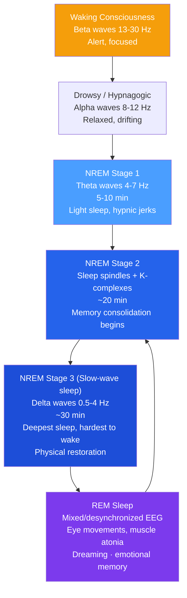

# 💤 States of Consciousness

> [!abstract] TL;DR
> Consciousness — our awareness of ourselves and our environment — is not a single on/off state but a spectrum. Sleep cycles through distinct stages with profoundly different neural signatures; REM sleep consolidates emotional memories and supports creativity. Hypnosis, meditation, and psychoactive substances all alter consciousness through identifiable neural mechanisms. Understanding these states illuminates how the brain maintains, disrupts, and recovers its default operating mode.

## Intuition — analogy FIRST

Think of consciousness like the operating modes of a smartphone.

**Normal waking consciousness** is full active mode: all apps running, screen bright, responsive to input. **NREM sleep** is low-power mode: background processes running (memory consolidation, cellular repair), screen off, unresponsive to minor input. **REM sleep** is a strange simulation mode: the phone runs vivid internal programs (dreams) while being physically immobile — the CPU is busy, but the microphone and camera are disconnected from the external world.

**Hypnosis** is like putting the phone into an unusual administrative mode where certain default security checks are bypassed. **Meditation** is deliberate management of the operating mode — training the phone's governor to maintain calm, focused function. **Psychedelics** are like injecting unexpected code that causes every app to talk to every other app simultaneously, flooding the user interface with connections and patterns that normally never form.

---

## How It Works

## Key Concepts / Details

### Sleep Architecture

A typical night contains **4–6 sleep cycles**, each ~90 minutes. Early cycles are heavier on slow-wave sleep (SWS); later cycles are heavier on REM.

| Stage | EEG | Duration | Function |
|---|---|---|---|
| **NREM 1** | Theta waves | 5–10 min | Transition; hypnic jerks |
| **NREM 2** | Sleep spindles, K-complexes | 20 min | Memory encoding begins; temperature drops |
| **NREM 3 (SWS)** | Delta waves | 20–40 min | Physical restoration; growth hormone release; declarative memory consolidation |
| **REM** | Rapid eye movements; atonia | 10–60 min (increases across night) | Emotional memory processing; creative insight; dreaming |

**Sleep spindles** (12–14 Hz bursts in NREM 2) correlate with intelligence and memory consolidation — they block external sensory input and promote memory transfer to long-term storage.

### Why We Sleep — Key Functions

1. **Memory consolidation**: hippocampus "replays" the day's experiences during NREM, transferring memories to cortex. Sleep-deprived subjects retain ~40% less new material.
2. **Emotional regulation**: REM sleep "strips" emotional valence from memories (Walker's "sleep therapy" hypothesis) — explaining why traumatic memories feel less raw after sleep.
3. **Metabolic waste clearance**: the **glymphatic system** (Nedergaard, 2013) flushes toxic metabolites (including amyloid-beta, linked to Alzheimer's) from the brain during NREM sleep.
4. **Cellular restoration**: growth hormone released during SWS; protein synthesis, immune function, and tissue repair all peak.
5. **Thermoregulation**: core body temperature drops 1–2°C during sleep; the bedroom needs to be cool.

### Circadian Rhythm

The **suprachiasmatic nucleus (SCN)** in the hypothalamus acts as the biological clock, synchronized by light exposure. **Melatonin** from the pineal gland signals darkness and promotes sleepiness.

- Blue-spectrum light (screens) suppresses melatonin — why evening screen use delays sleep
- **Zeitgebers** ("time givers"): light, temperature, meal timing, social schedules
- Adolescent circadian shift: puberty shifts the clock ~2 hours later — teenage "laziness" is biology

### Dreams

**Activation-Synthesis Theory** (Hobson & McCarley, 1977): Dreams are the cortex's attempt to make narrative sense of random signals from the brainstem during REM. The brain is a storytelling machine that can't tolerate randomness.

**Threat Simulation Theory** (Revonsuo): Dreams — especially nightmares — evolved to rehearse responses to threatening situations. Supports memory and emotional processing.

**Day residue**: recent events frequently appear in dreams, especially emotionally significant ones.

**Lucid dreaming**: awareness that one is dreaming during REM. EEG shows increased gamma activity in the frontal lobes — partial waking of executive function during dream state.

### Sleep Disorders

| Disorder | Description | Mechanism |
|---|---|---|
| **Insomnia** | Difficulty falling/staying asleep | Hyperarousal; cognitive rumination |
| **Sleep apnea** | Breathing interruptions during sleep | Airway obstruction; impairs SWS and REM |
| **Narcolepsy** | Sudden uncontrollable sleep attacks; cataplexy | Hypocretin (orexin) system deficiency |
| **REM sleep behavior disorder** | Acting out dreams (muscle atonia fails) | Early marker of Parkinson's/Lewy body dementia |
| **Night terrors (NREM parasomnia)** | Terror episodes during SWS; no dream recall | Arousal from deep NREM sleep; common in children |
| **Sleepwalking** | Complex behaviors during NREM 3 | Partial arousal from SWS |

### Hypnosis

A state of heightened suggestibility and focused attention. Key facts:
- Not sleep (EEG shows waking patterns); not unconsciousness
- **Dissociation theory** (Hilgard, 1977): hypnosis splits consciousness into an "executive" part following suggestions and a "hidden observer" that monitors reality
- **Social-cognitive theory**: hypnotic effects are explained by role expectations and motivated responding — no special state required
- Effective for pain management (reduces pain intensity ratings by 50% in some studies), anxiety, and habit change. Not effective for recovering accurate repressed memories.

### Meditation

**Mindfulness meditation**: non-judgmental attention to present-moment experience. EEG shows increased **alpha and theta** waves; long-term practice increases gray matter density in the prefrontal cortex and decreases amygdala reactivity.

**Transcendental meditation**: repetitive mantra leads to deep rest state. Alpha waves predominate.

**Effects**: reduced cortisol, decreased default mode network activity (the "mind-wandering" network), improved [[Attention_and_Cognitive_Load]], reduced [[Stress_and_Coping|stress reactivity]].

### Psychoactive Substances

Drugs alter consciousness by modifying neurotransmitter activity:

| Category | Examples | Mechanism | Effects |
|---|---|---|---|
| **Depressants** | Alcohol, barbiturates, benzodiazepines | Enhance GABA (inhibitory) | Reduce inhibition, slow processing, impair memory |
| **Stimulants** | Caffeine, cocaine, amphetamines | Increase dopamine/norepinephrine | Increased arousal, focus, mood elevation |
| **Opiates** | Morphine, heroin, codeine | Activate endorphin receptors | Pain relief, euphoria, respiratory depression |
| **Hallucinogens** | LSD, psilocybin, DMT | Serotonin 2A receptor agonism | Perceptual distortions, synesthesia, ego dissolution |
| **Cannabis** | THC | Cannabinoid receptors (CB1) | Relaxation, altered time perception, memory impairment |

## Real-World Notes

- **Organizational productivity**: sleep deprivation mimics alcohol intoxication at 17 hours awake. Decision quality, error rates, and emotional regulation all degrade. Power naps (10–20 min) restore alertness without sleep inertia.
- **Memory and learning**: studying then sleeping consolidates material better than equivalent awake time. "Sleep on it" is neurologically sound advice.
- **Mental health**: sleep disruption is a transdiagnostic feature of most psychiatric disorders. Treating insomnia often improves depression outcomes independently.
- **Mindfulness in clinical settings**: Mindfulness-Based Stress Reduction (MBSR) and Mindfulness-Based Cognitive Therapy (MBCT) are evidence-based treatments for stress, depression relapse, and chronic pain. See [[Cognitive_Behavioral_Therapy]].

## Common Pitfalls

- **"Dreams reveal repressed wishes"** — Freudian dream interpretation has no empirical support. Modern theories (activation-synthesis, threat simulation) are better supported.
- **"You can catch up on sleep on weekends"** — partial recovery is possible, but chronic sleep debt accumulates and is not fully repaid.
- **"Hypnosis retrieves accurate memories"** — hypnotized subjects are highly suggestible and generate confident but often false memories. Courts disallow hypnotically-retrieved testimony for this reason.
- **Confusing drowsiness with inability to sleep** — feeling tired and being able to sleep are different. Insomnia involves hyperarousal even when exhausted.

## Related Concepts

- [[_MOC_Psychology_Foundations|↑ Section MOC]]
- [[Biological_Basis_of_Behavior]] — Neural substrates of sleep stages and circadian rhythms
- [[Memory_Systems]] — How sleep consolidates and reorganizes memories
- [[Stress_and_Coping]] — HPA axis, cortisol, and how chronic stress disrupts sleep
- [[Attention_and_Cognitive_Load]] — Sleep deprivation's primary cognitive victim is sustained attention
- [[Happiness_and_Wellbeing]] — Sleep quality is one of the strongest predictors of subjective wellbeing

## Review Questions

1. A student pulls an all-nighter before an exam. Based on sleep science, explain why they will perform worse, and what specific memory consolidation process they have disrupted.
2. Compare Hilgard's dissociation theory and the social-cognitive theory of hypnosis. What experimental evidence would distinguish between them?
3. Psilocybin increases serotonin 2A receptor activity and produces mystical experiences. What does this tell us about the relationship between specific neurotransmitter systems and consciousness?

## Sources

- David Myers & C. Nathan DeWall, *Psychology*, 12th ed., Ch. 3
- Matthew Walker, *Why We Sleep* (2017)
- Lulu Xie et al. (2013). "Sleep drives metabolite clearance from the adult brain." *Science*, 342(6156)
- J. Allan Hobson & Robert McCarley (1977). "The brain as a dream state generator." *American Journal of Psychiatry*

#psychology #foundations #consciousness #sleep #dreams
