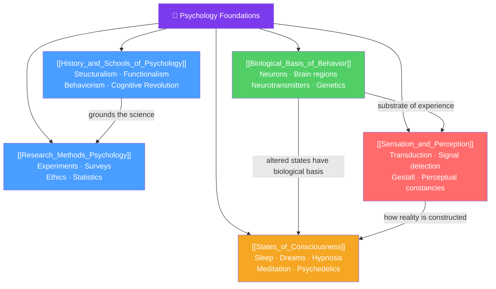

# 🗺️ Foundations — Map of Content

> [!abstract] What This Section Covers
> This section is the bedrock of the entire psychology vault. It answers the most basic questions before diving into any sub-discipline: *where did psychology come from and what are its major schools of thought*, *how do psychologists actually study behavior*, *what biological machinery underlies every thought and action*, *how does raw sensory data become conscious experience*, and *what are the different states the mind can inhabit*. Together these five notes provide the scientific and biological grounding that makes every later topic comprehensible.

## Concept Map

## Learning Path

1. [[History_and_Schools_of_Psychology]] — From Wundt's lab to cognitive neuroscience: the intellectual lineage that shaped the field.
2. [[Research_Methods_Psychology]] — How psychologists design studies, control confounds, and interpret data.
3. [[Biological_Basis_of_Behavior]] — Neurons, synapses, brain regions, neurotransmitters, and the nature-nurture interaction.
4. [[Sensation_and_Perception]] — How physical energy becomes conscious experience; signal detection, Gestalt principles, perceptual constancies.
5. [[States_of_Consciousness]] — Sleep stages, dreams, hypnosis, meditation, and the neuroscience of altered states.

## All Notes at a Glance

| Note | Difficulty | What You'll Learn |
|------|------------|-------------------|
| [[History_and_Schools_of_Psychology]] | Beginner | Structuralism, functionalism, behaviorism, psychoanalysis, humanism, cognitive revolution, neuroscience era |
| [[Research_Methods_Psychology]] | Beginner | Experimental design, correlational studies, case studies, surveys, ethics, statistical reasoning |
| [[Biological_Basis_of_Behavior]] | Intermediate | Neural transmission, brain anatomy, neurotransmitters, endocrine system, genetics and epigenetics |
| [[Sensation_and_Perception]] | Intermediate | Transduction, thresholds, signal detection theory, Gestalt principles, perceptual constancies, top-down vs bottom-up |
| [[States_of_Consciousness]] | Intermediate | Sleep stages (REM/NREM), circadian rhythms, dreams, hypnosis, meditation, psychoactive substances |

## Key Questions This Section Answers

- What is the difference between structuralism and functionalism, and why did behaviorism dominate for 50 years?
- How do psychologists distinguish correlation from causation in their research?
- What happens at a synapse, and how do neurotransmitters shape mood and behavior?
- Why do two people in the same room perceive it differently — what is "top-down processing"?
- What is happening in the brain during REM sleep, and why do we dream?

## Related Sections

- [[_MOC_Psychology_Master|↑ Psychology Master MOC]]
- [[_MOC_Cognitive_Psychology|→ Cognitive Psychology]]
- [[_MOC_Developmental_Psychology|→ Developmental Psychology]]

#MOC #Psychology #Foundations
