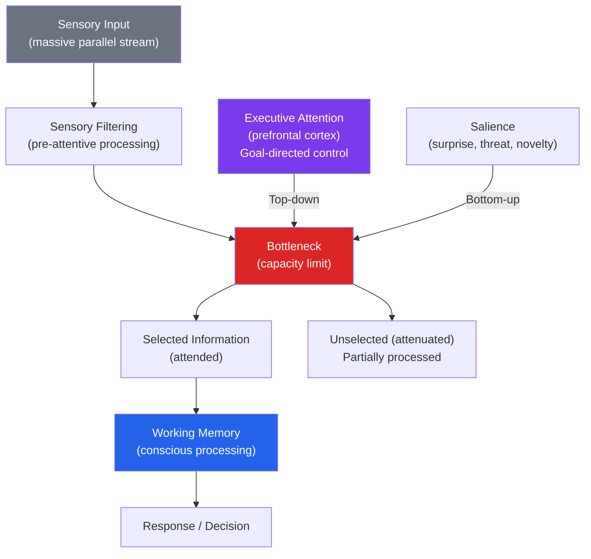

# 🎯 Attention and Cognitive Load

> [!abstract] TL;DR
> Attention is the brain's limited-capacity mechanism for selecting which information receives further processing. It operates at multiple levels — from early sensory filtering to high-level executive control — and is the primary bottleneck in cognitive performance. **Cognitive Load Theory** formalizes how the limits of working memory constrain learning and task performance. The classic **Stroop effect** and **dichotic listening** experiments reveal attention's architecture; dual-task studies prove its resource limits.

## Intuition — analogy FIRST

Attention is like a spotlight on a dark stage.

Whatever the spotlight illuminates gets processed in full color and detail. Everything in the periphery exists but is registered only vaguely. The brain can move the spotlight quickly (shift attention), widen it (distributed attention), or try to split it between two locations (divided attention — which usually just means rapidly toggling between them).

**Cognitive load** is the question: how much is the spotlight motor consuming? A novice driver uses full cognitive resources just staying in their lane — their spotlight motor is maxed out. An expert driver can navigate while having a conversation — their motor runs at 30% capacity on the routine task, leaving 70% free.

The tragedy of multitasking: you cannot actually run two spotlights simultaneously for complex tasks. What feels like parallel processing is serial switching, and each switch has a cost.

---

## How It Works

## Key Concepts / Details

### Models of Selective Attention

**Broadbent's Filter Model (1958) — Early Selection**:
Information is filtered *before* meaning is processed — only attended messages get semantic analysis. Explains how you can focus on one voice in a party.

**Treisman's Attenuation Model (1964)**:
Revised Broadbent: unattended channels are *attenuated* (volume turned down), not blocked. High-relevance material (your name, "fire!") can break through — explaining the **cocktail party effect**.

**Deutsch-Norman Late Selection Model (1963)**:
All information is processed for meaning *before* selection — attention operates at the response stage. Explains why unattended words sometimes interfere.

**Modern consensus**: both early and late selection occur depending on current demands. Under low cognitive load, processing can reach meaning; under high load, filtering happens earlier.

### The Stroop Effect (1935)

J. Ridley Stroop's paradigm: name the ink color of color words when word and color conflict.

**RED** (printed in blue) → participants say "blue" slower than when reading a neutral word in blue ink.

**Why it happens**: word reading is automatic (requires no effort), while color naming requires controlled attention. Two responses compete; inhibiting the automatic word response requires executive control — and this conflict causes slowing.

**Applications**: 
- Reveals the automaticity of overlearned processes
- Used clinically to assess executive function (Stroop interference scores)
- Explains why experts must actively resist automatic responses in novel situations

### Dichotic Listening and Cherry's Cocktail Party

Colin Cherry (1953) had participants wear headphones with different messages in each ear, instructed to "shadow" (repeat aloud) one message.

**Findings**: 
- Participants knew almost nothing about the unattended message (content, language, sex of speaker — all missed)
- BUT they noticed if the unattended voice switched from a male to a female voice (physical feature detected)
- AND they noticed their own name in the unattended channel (Moray, 1959)

This proved attention selects at multiple levels and that self-relevant information has a privileged pathway.

### Divided Attention and Dual-Task Costs

**Dual-task paradigm**: perform two tasks simultaneously. Performance on at least one degrades.

| Task Pairing | Result |
|---|---|
| Talking while walking (simple route) | Minimal interference |
| Reading while listening to speech | Major interference — both use phonological loop |
| Visual tracking + spatial reasoning | Interference — both use visuospatial sketchpad |
| Cell phone while driving | Equivalent to 0.08 BAC (Strayer & Johnston, 2001) |

**Inattentional blindness**: when attention is fully occupied, unexpected stimuli go unnoticed. Simons & Chabris (1999) gorilla experiment: participants counting basketball passes missed a person in a gorilla suit walking through the scene (~50% miss rate).

**Change blindness**: failure to detect changes across visual interruptions (a cut in a film, a blink, a flicker). People are blind to changes they weren't attending to, revealing that visual short-term memory stores very little.

### Cognitive Load Theory (Sweller, 1988)

John Sweller proposed that learning is constrained by working memory limits, and that instructional design should optimize the cognitive load placed on learners.

Three types of cognitive load:

| Type | Source | Designer's Goal |
|---|---|---|
| **Intrinsic load** | Inherent complexity of the material (element interactivity) | Match to learner's expertise |
| **Extraneous load** | Poorly designed instruction (irrelevant information, confusing layout) | Minimize ruthlessly |
| **Germane load** | Mental effort contributing to schema formation and automation | Optimize |

**Key CLT findings**:
- **Split-attention effect**: requiring learners to mentally integrate two separated sources (text far from diagram) increases extraneous load. Integrate them.
- **Redundancy effect**: presenting identical information in two modalities (reading aloud what's already on screen) increases load for experts.
- **Worked example effect**: novices learn better from studying worked examples than from solving problems. Experts learn better from problem-solving.
- **Expertise reversal**: what reduces load for novices (full guidance) may *increase* it for experts (they must suppress the scaffold they no longer need).

### Sustained Attention and Mental Fatigue

**Vigilance decrement**: performance on sustained attention tasks (monitoring a radar screen, proofreading) degrades within 20–30 minutes. Reason: arousal decreases; signals are missed.

**Executive attention**: the frontal lobes manage goal-directed, top-down attention — suppressing irrelevant stimuli, maintaining task sets, switching between tasks. This is what ADHD disrupts.

**Attention Deficit Hyperactivity Disorder (ADHD)**: a developmental disorder of executive attention characterized by difficulty sustaining attention, inhibiting impulses, and regulating activity. Dopamine and norepinephrine dysregulation in prefrontal circuits. Prevalence ~5–7% of children; ~2–5% of adults.

## Real-World Notes

- **UX and interface design**: CLT directly informs UI design — minimize extraneous load (clean layouts, remove noise), chunk information (group related elements), build on schemas users already have (familiar conventions).
- **Education**: worked examples for novices, faded examples as expertise grows. Avoid split attention by placing labels near diagrams. Use modality effect (speech + visual superior to text + visual for novices).
- **Driving**: hands-free phone calls are as dangerous as handheld because the cognitive demand (maintaining a conversation) is the bottleneck, not the hand position.
- **Open-plan offices**: the cognitive load of filtering constant background conversation impairs complex cognitive tasks, reducing productivity in knowledge workers.

## Common Pitfalls

- **"I'm good at multitasking"** — high performers under dual-task conditions sacrifice accuracy for speed. Nobody is truly immune to dual-task interference for complex, attention-demanding tasks.
- **Confusing attention with awareness** — you can be aware (conscious) of many things but attend (deeply process) only a few. Peripheral awareness is not attention.
- **Assuming inattentional blindness is rare** — it is ubiquitous and consequential: medical errors, driving accidents, missed signals in security monitoring all involve failures of divided or sustained attention.

## Related Concepts

- [[_MOC_Cognitive_Psychology|↑ Section MOC]]
- [[Memory_Systems]] — Working memory's central executive IS the attentional control system
- [[Sensation_and_Perception]] — Pre-attentive feature detection feeds into attentional selection
- [[Problem_Solving_and_Decision_Making]] — Cognitive load constrains decision quality under pressure
- [[Cognitive_Biases]] — Many biases emerge from the brain taking "attention shortcuts" (System 1)
- [[Organizational_Psychology]] — Workplace attention design; meeting overload; open offices

## Review Questions

1. You are designing an e-learning course on chemistry for beginners. Using Cognitive Load Theory, describe three specific design decisions and explain which type of load each addresses.
2. The Stroop task reliably produces interference when colors and words conflict. What does this tell us about the nature of practiced skills, and how does it explain why experienced surgeons sometimes make errors when a procedure diverges from their usual routine?
3. Explain why talking on a hands-free phone while driving is as dangerous as using a handheld phone. What does this reveal about the nature of attentional resources?

## Sources

- Sweller, J. (1988). "Cognitive load during problem solving." *Cognitive Science*, 12, 257–285
- Simons, D.J. & Chabris, C.F. (1999). "Gorillas in our midst." *Perception*, 28, 1059–1074
- Strayer, D.L. & Johnston, W.A. (2001). "Driven to distraction: Dual-task studies of simulated driving." *Psychological Science*
- Alan Baddeley, *Human Memory: Theory and Practice* (1990)

#psychology #cognitive-psychology #attention #cognitive-load
