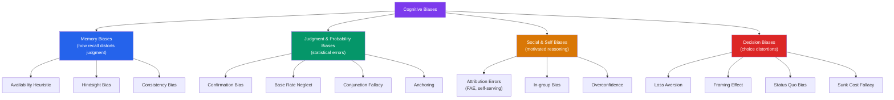

# 🔍 Cognitive Biases

> [!abstract] TL;DR
> Cognitive biases are systematic, predictable errors in judgment that arise from mental shortcuts (heuristics), motivated reasoning, and limits of information processing. They are not random mistakes but structured patterns — the same bias produces the same error in the same conditions across people. Catalogued by Kahneman, Tversky, and many others, they span perception, memory, social judgment, and decision making. Awareness is necessary but not sufficient for debiasing — procedural safeguards work better than willpower.

## Intuition — analogy FIRST

Think of cognitive biases as the brain's autocorrect.

Autocorrect is extraordinarily useful — it makes communication 95% faster by guessing what you meant. But it fails in predictable, systematic ways: it prefers common words over rare ones, it can't handle neologisms, and once you've made a typo once, it "learns" the wrong word. The failures aren't random — they follow patterns you can predict and work around.

Cognitive biases are the same: they represent the brain's heuristics working as designed for the environment they evolved in, occasionally misfiring on the novel environments we now inhabit. The availability heuristic worked brilliantly when "things I remember seeing" correlated with "common things in my village." It fails when vivid media coverage makes plane crashes feel more common than car accidents.

---

## How It Works — Bias Taxonomy

## Key Concepts / Details

### Memory-Based Biases

**Availability Heuristic** (Tversky & Kahneman, 1973):
Judge probability by how easily examples come to mind.
- Vivid, emotional, and recent events are more available → overestimated frequency
- *Example*: After 9/11, Americans vastly overestimated the probability of dying in a terrorist attack while underestimating car accidents (more available = must be more likely)
- Application: healthcare workers estimate disease frequency based on recent cases; investment decisions distorted by recent market crashes

**Hindsight Bias** ("I knew it all along"):
After learning an outcome, you believe you had predicted it. The outcome feels inevitable in retrospect.
- Eliminates learning — if you "knew it all along," you can't identify what you didn't know
- Classic study: Nixon's China trip. Predicted probabilities were inflated after the event occurred.

**Consistency Bias**:
Remembering past beliefs/attitudes as more consistent with current beliefs than they actually were.
- Distorts autobiographical memory; makes people believe their attitudes have always been stable

### Probability and Judgment Biases

**Confirmation Bias** (Wason, 1960):
Tendency to search for, interpret, and remember information that confirms existing beliefs.
- Wason Selection Task: people choose confirmatory cards rather than potentially disconfirming ones
- In medicine: premature closure on diagnosis; in business: seeking evidence a strategy will work
- *Counter*: actively seek disconfirming evidence; assign "devil's advocate" roles

**Base Rate Neglect** (Kahneman & Tversky, 1973):
Ignoring the prior probability of an event in favor of specific case information.
- Medical testing: a test that is 99% accurate for a disease that occurs in 1% of people will produce mostly false positives (if 1000 people, 10 have disease [10 true positives], 990 healthy [~10 false positives] → 50% of "positives" are false)
- Linked to representativeness heuristic

**Conjunction Fallacy** (Linda Problem):
Judging a conjunction (A and B) as more probable than one of its constituents (A alone).
- "Linda is a bank teller and feminist activist" rated more probable than "Linda is a bank teller"
- Violates basic probability axioms; occurs because Linda *represents* the activist prototype

**Anchoring and Adjustment**:
Initial information (the anchor) exerts disproportionate influence on final judgment, even when clearly arbitrary.
- Judges gave lower sentences after rolling a low number on a rigged die
- Salary negotiation: first number anchors the range; real estate listing price anchors valuation
- *Counter*: generate your own estimate before seeing the anchor; consider extreme alternatives

**Regression to the Mean (misunderstanding)**:
Extreme performances are followed by less extreme ones — not because of intervention but because of statistical regression. Praising a great performance then seeing decline, or punishing a poor performance then seeing improvement, creates a false causal story.

### Social and Self-Related Biases

**Fundamental Attribution Error (FAE)** (Ross, 1977):
Overattributing others' behavior to their character/disposition while underweighting situational factors.
- See someone trip → "clumsy person" not "slippery floor"
- Explains victim-blaming; the Milgram results shocked people because they attributed obedience to character rather than situation

**Actor-Observer Asymmetry**:
You explain your own behavior situationally ("I was stressed"), others' behavior dispositionally ("they're selfish"). Opposite asymmetry for successes.

**Self-Serving Bias**:
Attribute successes to internal factors (ability), failures to external factors (bad luck).
- Intact self-esteem but prevents accurate learning from failure

**Overconfidence Effect**:
People's confidence in their judgments routinely exceeds their accuracy.
- 80% confidence intervals capture the true answer only ~50% of the time
- General knowledge questions: most people estimate 90%+ certainty when their accuracy is ~70%
- Overconfidence peaks in domains with slow, ambiguous feedback (market prediction, clinical diagnosis)

**Dunning-Kruger Effect** (1999):
Incompetent individuals tend to overestimate their competence; experts tend to underestimate theirs relative to others.
- **Mechanism**: the same skills needed to recognize competence are the skills being assessed — novices lack the metacognitive capacity to know what they don't know
- *Counter*: deliberate practice with rapid feedback; seek expert assessment

**In-Group Bias / Out-Group Homogeneity**:
Favor in-group members; perceive out-group members as more similar to each other than in-group members. See [[Prejudice_and_Discrimination]].

### Decision Biases

**Loss Aversion** (Kahneman & Tversky, 1979):
Losses weigh ~2× more than equivalent gains. See [[Problem_Solving_and_Decision_Making]] for prospect theory.

**Framing Effect**:
The same information presented differently produces different choices.
- "95% fat free" vs. "5% fat" — identical, but the former is preferred
- Organ donation opt-in vs. opt-out: opt-out countries have 90%+ donation rates; opt-in have ~15%
- See [[Behavioral_Economics_Psychology]] for policy applications (nudging)

**Status Quo Bias**:
Preference for the current state of affairs; changes from baseline are perceived as losses.
- Default options are extremely sticky: default retirement contribution rates, default browser

**Sunk Cost Fallacy**:
Continuing to invest in a project because of past investment, despite its future being unpromising.
- "We've spent $10M — we can't stop now" — the $10M is gone regardless; the decision is about future value
- Escalation of commitment: especially strong when initial decision-maker is still involved (ego protection)

**Present Bias / Hyperbolic Discounting**:
Overvalue immediate rewards relative to future rewards, even when logically we'd choose differently.
- Prefer $50 now to $100 in a month; but prefer $100 in 13 months to $50 in 12 months

**Representativeness Heuristic**:
Judge probability based on similarity to a prototype — leading to base rate neglect and the conjunction fallacy above.

### Debiasing Strategies

| Strategy | Mechanism | Evidence |
|---|---|---|
| **Pre-mortems** | Imagine failure, work backward | Reduces overconfidence |
| **Consider the opposite** | Actively generate alternatives | Reduces confirmation bias, anchoring |
| **Checklists** | Force systematic coverage | Reduces availability/premature closure |
| **Slow down** | Engage System 2 | Reduces System 1 errors generally |
| **Statistical training** | Learn base rates and Bayesian reasoning | Reduces base rate neglect |
| **Reference class forecasting** | Use distributional data from similar projects | Reduces planning fallacy |
| **Blind review** | Separate evaluator from identifiers | Reduces in-group bias |

> [!warning] Awareness ≠ Debiasing
> Simply knowing about a bias does not reliably reduce it. Loss aversion persists in Nobel-Prize-winning economists. Procedural safeguards (checklists, formal decision processes, structured feedback) work far better than "try not to be biased."

## Real-World Notes

- **Investing**: availability bias inflates risk estimates after crashes; loss aversion leads to selling winners too early and holding losers too long. See [[Behavioral_Economics_Psychology]].
- **Hiring**: confirmation bias contaminated by first impressions; structured interviews with pre-defined criteria reduce this significantly. FAE leads to undervaluing situational candidates.
- **Healthcare**: availability bias causes overdiagnosis of recently-seen conditions; overconfidence causes insufficient testing; anchoring on initial diagnosis causes premature closure.
- **Product design**: status quo bias explains why "default settings" determine outcomes — most users never change them. Ethical design explicitly considers what default to set.

## Common Pitfalls

- **"Biases only affect irrational people"** — expertise reduces some biases in domain-specific contexts but not others. Intelligence doesn't reliably reduce loss aversion or framing effects.
- **Treating all biases as equal** — some biases have tiny effect sizes in realistic conditions; others are robust and large. Don't flatten the taxonomy.
- **"I've heard of it, so I'm debiased"** — knowledge of a bias produces metacognitive awareness but rarely changes actual behavior without structural supports.

## Related Concepts

- [[_MOC_Cognitive_Psychology|↑ Section MOC]]
- [[Problem_Solving_and_Decision_Making]] — The dual-process theory that generates these biases
- [[Behavioral_Economics_Psychology]] — Applied economics of these biases; nudge theory
- [[Social_Influence_and_Conformity]] — Conformity, groupthink, and social biases
- [[Prejudice_and_Discrimination]] — In-group bias and stereotyping as social cognitive biases
- [[Attitudes_and_Persuasion]] — How persuasion exploits cognitive biases
- Cross-vault: [[Game_Theory]] — Rationality assumptions challenged by these findings

## Review Questions

1. Explain why base rate neglect is so dangerous in medical diagnosis. Use a specific numerical example to show how a "99% accurate" test can produce mostly false positives.
2. A project manager refuses to cancel a failing software project because "we've already spent $2M." Identify the bias, explain why it is irrational from a future-value perspective, and suggest an organizational intervention that might prevent it.
3. What is the Dunning-Kruger effect, and what is its actual proposed mechanism? Why is the original Kruger and Dunning (1999) paper title ("Unskilled and Unaware of It") slightly misleading?

## Sources

- Tversky, A. & Kahneman, D. (1974). "Judgment under uncertainty: Heuristics and biases." *Science*, 185
- Kahneman, D. (2011). *Thinking, Fast and Slow*. Farrar, Straus and Giroux
- Kruger, J. & Dunning, D. (1999). "Unskilled and unaware of it." *JPSP*, 77(6), 1121–1134
- Larrick, R.P. (2004). "Debiasing." In *Blackwell Handbook of Judgment and Decision Making*

#psychology #cognitive-psychology #cognitive-biases #heuristics #decision-making
