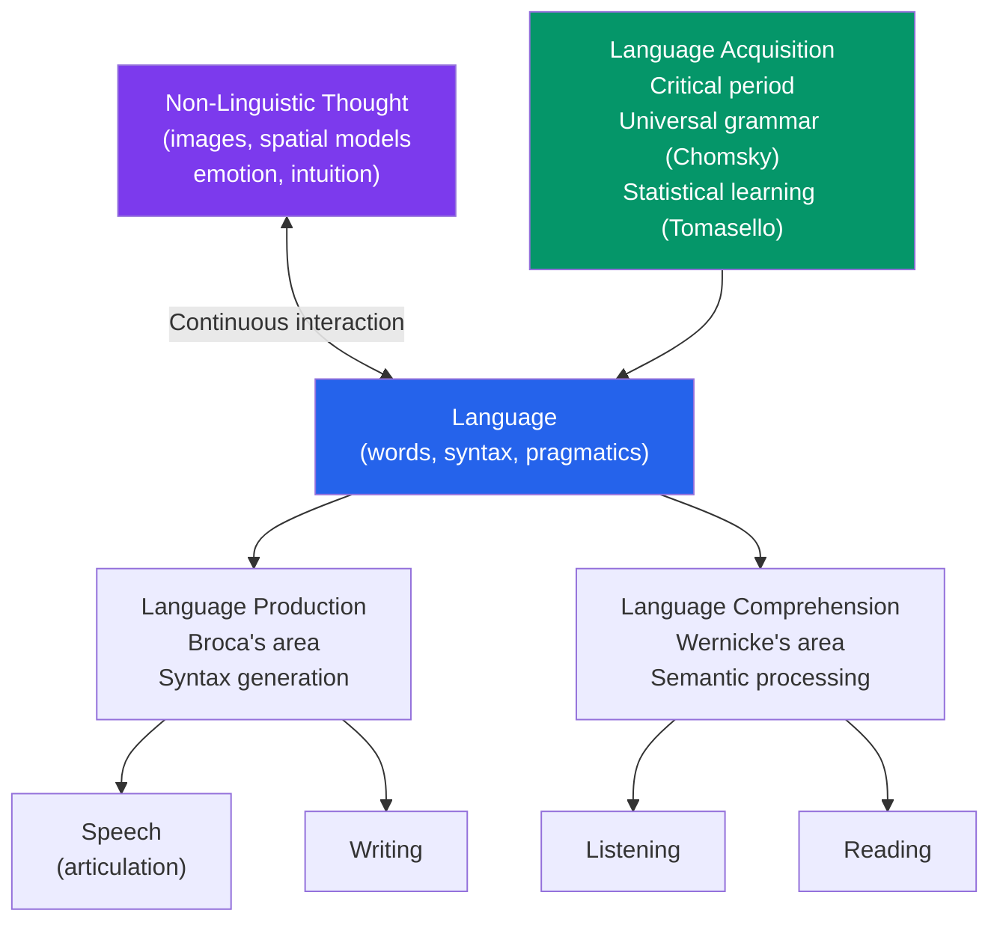

# 🗣️ Language and Thought

> [!abstract] TL;DR
> Language is the uniquely human system of symbolic communication, and its relationship to thought is one of psychology's central debates. Chomsky's **universal grammar** argues that language acquisition is biologically constrained. The **Sapir-Whorf hypothesis** (linguistic relativity) proposes that language shapes thought — with strong evidence for the weak version and ongoing debate about the strong. Thinking involves both linguistic and non-linguistic representations; language amplifies and constrains cognition without fully determining it.

## Intuition — analogy FIRST

Consider the difference between a **map** and the **territory** it represents.

Language is a highly sophisticated map of reality. Like any map, it simplifies, categorizes, and highlights certain features while omitting others. A map drawn for hiking emphasizes elevation and trail difficulty; the same terrain mapped for geology highlights rock formations. Different languages are like maps drawn from different perspectives — they make different features salient.

But here's the crucial question: does the map you use *change what you see in the territory*, or just how you describe it? Do Inuit speakers with dozens of snow vocabulary words actually *perceive* snow differently, or do they just have better words for distinctions they perceive exactly as we do?

This is the Sapir-Whorf debate, and the answer — settled by decades of research — is "somewhat: language influences, but does not determine, thought."

---

## How It Works

## Key Concepts / Details

### Properties of Human Language

Language is distinguished from animal communication by **productivity** (infinite sentences from finite rules), **displacement** (talking about the past, future, hypothetical), **arbitrariness** (no inherent connection between word and referent), **cultural transmission** (learned, not instinctive), and **duality of patterning** (meaningless sounds → meaningful morphemes → sentences).

Structural levels:
- **Phonemes**: smallest sound units (~40 in English)
- **Morphemes**: smallest meaning units ("cats" = "cat" + "-s")
- **Syntax**: rules for combining words into sentences
- **Semantics**: meaning of words and sentences
- **Pragmatics**: contextual, social use of language (irony, implicature, speech acts)

### Language Acquisition — The Core Debate

**Chomsky's Nativist Account**:
- Language is too complex for children to learn purely from input; they receive impoverished, error-filled input yet acquire grammatically complex language by ~4 years — the **poverty of the stimulus** argument
- Proposed a **Language Acquisition Device (LAD)** — an innate biological mechanism containing **Universal Grammar**: abstract grammatical principles shared across all human languages
- Evidence: all children regardless of culture/language progress through the same stages; language-specific brain areas (Broca's, Wernicke's); **critical period** for language acquisition (diminished ability after ~7; nearly impossible after puberty — Genie case)

**Tomasello's Social-Pragmatic Account**:
- Children learn language through **joint attention**, intention-reading, and cultural learning — not innate grammar
- **Statistical learning** (Saffran, 1996): 8-month-old infants can pick up statistical regularities in speech streams after just 2 minutes of exposure — suggest powerful domain-general learning mechanisms
- **Competition model**: grammar emerges from competition between functional cues; no need for a pre-specified Universal Grammar

**Current consensus**: both nativist and learning accounts capture part of the truth. Children have strong biological biases for language learning (sensitive period, phonological sensitivity), but social interaction and input are essential. Language is the product of both nature and nurture.

### Stages of Language Acquisition

| Age | Stage | Example |
|---|---|---|
| 0–6 months | Cooing, phoneme discrimination | Distinguishes all world phonemes |
| 6–12 months | Babbling | "Ba-ba-ba-ga-ga" (universal, even in deaf infants then stops) |
| 12 months | First words (holophrases) | "Milk" = "I want milk" |
| 18 months | Vocabulary explosion (fast mapping) | ~9 new words/day |
| 24 months | Two-word stage | "Daddy go," "More milk" |
| 3–4 years | Telegraphic speech → sentences | Overgeneralization: "I goed," "Two foots" |
| 5–7 years | Grammatically complex sentences | Near-adult grammar |

**Overgeneralization** (e.g., "goed" instead of "went") is evidence *for* rule learning — children aren't just imitating adults but applying abstract grammatical rules and over-extending them.

### Language and the Brain

| Region | Function | Evidence from Damage |
|---|---|---|
| **Broca's area** (left inferior frontal gyrus) | Grammar, speech production | Broca's aphasia: telegraphic speech, intact comprehension |
| **Wernicke's area** (left posterior temporal gyrus) | Language comprehension, semantic processing | Wernicke's aphasia: fluent but meaningless speech, poor comprehension |
| **Arcuate fasciculus** | Connects Broca's and Wernicke's | Conduction aphasia: poor repetition, intact production and comprehension |

**Lateralization**: ~95% of right-handers and ~70% of left-handers have language in the left hemisphere.

### The Sapir-Whorf Hypothesis (Linguistic Relativity)

**Strong version** (linguistic determinism): language determines thought — you cannot think what you cannot say. Language creates reality.
- **Evidence against**: deaf individuals without formal language can still reason about number, space, and causality; prelinguistic infants show categorical perception before language

**Weak version** (linguistic relativity): language influences, biases, and colors thought.
- **Strong evidence for this**:

| Domain | Finding |
|---|---|
| **Color** | Languages with different color boundaries show faster discrimination *within* their linguistic categories (Winawer et al., 2007) |
| **Spatial reasoning** | Hopi (absolute spatial reference) vs English (egocentric: left/right) speakers show different navigation strategies |
| **Number** | The Pirahã (no number words beyond 1-2-many) perform poorly on exact numerical tasks |
| **Time** | Mandarin speakers (vertical metaphors for time) are faster on vertical time tasks; English speakers faster on horizontal |
| **Grammatical gender** | German speakers describe bridges (feminine der, bridge) as graceful; Spanish speakers (masculine el puente) as strong |

**Conclusion**: language is a lens, not a cage. It makes certain concepts more accessible and primes certain ways of thinking without preventing others.

### Concepts and Categorization

Thinking requires **concepts** — mental categories grouping similar objects.

- **Classical view**: concepts have defining features (all members share all features). Problem: there is no set of necessary and sufficient features for "game."
- **Prototype theory** (Rosch, 1973): concepts are organized around a **prototype** (best example). A robin is a more prototypical bird than a penguin.
- **Exemplar theory**: categories are represented as specific remembered examples, not abstractions.

**Basic level categories** (Rosch): the level at which cognitive economy is maximized — "chair" rather than "furniture" (superordinate) or "La-Z-Boy recliner" (subordinate). Children and adults both use the basic level spontaneously.

## Real-World Notes

- **Bilingualism**: bilinguals show enhanced executive function (the "bilingual advantage") — managing two language systems exercises inhibitory control. However, the effect is contested and small. They show larger vocabulary per language but superior pragmatic flexibility.
- **Language in organizations**: "We have a problem" vs "We have a challenge" — framing language shapes employee response. Leaders who use "we" vs "I" signal collaborative vs. individual orientation.
- **Legal language**: pragmatic implicature is why "the gun was in the car" implicates the speaker knew about the gun. Legal precision tries to eliminate implicature; everyday speech is saturated with it.
- **Therapy**: Cognitive reappraisal in CBT is fundamentally linguistic — changing the words you use to describe an experience changes the emotional response to it. See [[Cognitive_Behavioral_Therapy]].

## Common Pitfalls

- **"Eskimos have 50 words for snow"** — this is a myth based on a misreading of Benjamin Lee Whorf's notes. Inuit languages do have more snow morphemes, but this is because they are polysynthetic (compounding), not because of any special cognitive representation.
- **Confusing grammatical complexity with cognitive complexity** — a language with simpler grammar is not simpler to think in; different languages encode different types of information, not different amounts.
- **"Animals don't have language"** — some primates learn hundreds of ASL signs and use them productively; dolphins and bees have sophisticated communication systems. The line is fuzzy, but human language's productivity and recursion appear unique.

## Related Concepts

- [[_MOC_Cognitive_Psychology|↑ Section MOC]]
- [[Memory_Systems]] — Semantic memory is the long-term repository of linguistic knowledge
- [[Problem_Solving_and_Decision_Making]] — Framing effects demonstrate language's influence on decisions
- [[Language_Development]] — Full developmental trajectory in the developmental section
- [[Piagets_Cognitive_Development]] — Piaget and Vygotsky's debate about the role of language in cognitive development
- [[Cognitive_Biases]] — Framing bias directly involves how language presents choices

## Review Questions

1. A 3-year-old says "I goed to the store" and "my feets hurt." Her mother has never said these things. What does this tell us about the nature of language acquisition?
2. Describe two pieces of evidence for the weak Sapir-Whorf hypothesis (linguistic relativity) and explain what they mean — and don't mean — for the claim that language determines thought.
3. Compare Broca's aphasia and Wernicke's aphasia in terms of symptoms and what they reveal about language processing in the brain.

## Sources

- Noam Chomsky, *Aspects of the Theory of Syntax* (1965)
- Michael Tomasello, *Constructing a Language* (2003)
- Lera Boroditsky (2011). "How language shapes thought." *Scientific American*
- Eleanor Rosch et al. (1976). "Basic objects in natural categories." *Cognitive Psychology*

#psychology #cognitive-psychology #language #psycholinguistics #sapir-whorf
