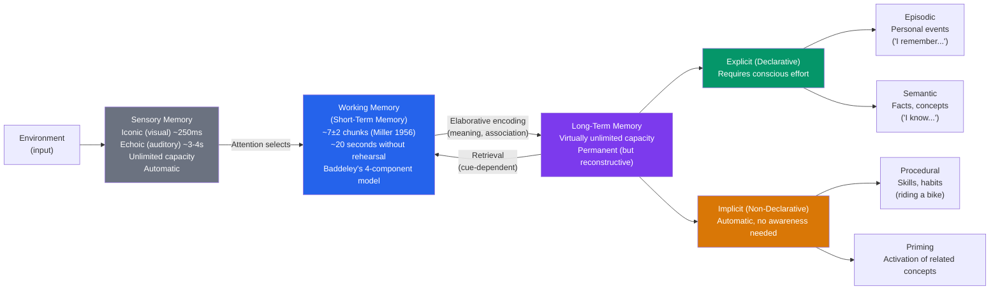

# 🗂️ Memory Systems

> [!abstract] TL;DR
> Memory is not a single faculty but a family of distinct systems: **sensory memory** briefly holds raw perceptions; **working memory** (short-term) consciously manipulates a small amount of information; **long-term memory** stores vast amounts across a lifetime. Long-term memory splits into **explicit** (declarative) — episodic and semantic — and **implicit** — procedural and priming. Encoding strategies, retrieval cues, and sleep all profoundly affect what we remember and forget.

## Intuition — analogy FIRST

Think of memory like a company's information infrastructure.

**Sensory memory** is the loading dock — packages arrive constantly but are discarded within seconds unless someone picks them up. **Working memory** is your desk — you can actively use what's there, but it's small (maybe 4–7 items), and things fall off if you don't use them. **Long-term memory** is the company archive — vast, organized, and capable of storing almost unlimited information, but only accessible if you have the right filing index (a retrieval cue).

The key insight: information moves from desk to archive through **rehearsal and meaningful encoding**. A well-organized archive retrieves information quickly; a poorly organized one leaves things "on the tip of your tongue."

---

## How It Works

## Key Concepts / Details

### The Atkinson-Shiffrin Multi-Store Model (1968)

Richard Atkinson and Richard Shiffrin proposed the foundational three-store model:

1. **Sensory register**: brief, capacity-unlimited, modality-specific
2. **Short-term store (STS)**: ~7 items, ~20 seconds; maintained by rehearsal
3. **Long-term store (LTS)**: permanent, virtually unlimited

**Criticisms**: The model treats STM as unitary (it's not) and implies a simple linear flow (memory is bidirectional and interactive). Baddeley's model replaced it.

### Baddeley's Working Memory Model (1974, revised 2000)

Alan Baddeley proposed that "short-term memory" is actually a multicomponent system for active manipulation of information:

| Component | Function | Capacity |
|---|---|---|
| **Central Executive** | Attentional controller; coordinates sub-systems; no storage | Limited |
| **Phonological Loop** | Verbal/auditory rehearsal ("inner voice" + "inner ear") | ~2 seconds of speech |
| **Visuospatial Sketchpad** | Visual and spatial information; mental rotation | ~3–4 objects |
| **Episodic Buffer** | Integrates information from multiple sources; links to LTM | ~4 chunks |

**Working memory capacity** predicts fluid intelligence, reading comprehension, and math performance better than raw IQ in some studies. ADHD involves central executive deficits.

### Long-Term Memory Systems

**Explicit (Declarative) Memory** — requires conscious recollection; depends on the **hippocampus**:
- **Episodic memory**: personally experienced events with spatial-temporal context ("I remember my first day of school")
- **Semantic memory**: general world knowledge, facts, concepts ("Paris is the capital of France")

**Implicit Memory** — automatic, not consciously accessed; independent of hippocampus:
- **Procedural memory**: motor skills, habits (cerebellum and basal ganglia)
- **Priming**: prior exposure speeds up processing of related stimuli (perceptual and conceptual)
- **Classical conditioning**: Pavlov-type learned associations

**The H.M. Case (Henry Molaison)**:
Henry Molaison had both hippocampi removed in 1953 to treat severe epilepsy. The result — the most famous case in neuropsychology — showed:
- Complete **anterograde amnesia**: unable to form *any* new explicit memories
- Intact **implicit memory**: could still learn new motor skills (mirror tracing) without remembering practicing them
- Intact **semantic memory** of events before surgery; impaired episodic memory
- Proved hippocampus is essential for forming new explicit memories, not for storing old ones

### Encoding: Getting Information In

| Strategy | Mechanism | Effectiveness |
|---|---|---|
| **Maintenance rehearsal** | Repeating without elaboration | Poor for long-term retention |
| **Elaborative rehearsal** | Connecting to existing knowledge | Excellent |
| **Levels of processing** (Craik & Lockhart) | Deep semantic processing > phonological > visual | The deeper, the better |
| **Spaced practice** | Distributing study across time | Far superior to massing |
| **Interleaving** | Mixing problem types during practice | Better for transfer |
| **Testing effect (retrieval practice)** | Recalling > re-reading for long-term retention | One of the most robust findings |
| **Generation effect** | Generating answers > reading them | Active processing strengthens encoding |

### Retrieval: Getting Information Out

**Encoding specificity** (Tulving & Thomson, 1973): retrieval is best when retrieval context matches encoding context — explaining why you remember things you forgot as soon as you return to where you were when you encoded them.

**State-dependent memory**: encoded while in a specific emotional or physiological state; retrieved best in the same state (intoxicated encoding → intoxicated retrieval).

**Tip-of-the-tongue (TOT) phenomenon**: partial retrieval — semantic information accessible but phonological form unavailable. Shows memory retrieval is not all-or-nothing.

**Reconstruction**: Memory is not a playback; it is a reconstruction that can be contaminated by subsequent information. **Elizabeth Loftus's** eyewitness research: misleading post-event questions change what people remember. The car crash experiment: "How fast were the cars going when they *smashed*?" produces faster estimates and false "broken glass" memories than "contacted."

### Forgetting

| Cause | Mechanism |
|---|---|
| **Encoding failure** | Never encoded in the first place (didn't attend) |
| **Storage decay** | Unused memory traces fade (controversial — may not exist in LTM) |
| **Interference** | Similar memories compete: proactive (old blocks new) or retroactive (new blocks old) |
| **Retrieval failure** | Cue-dependent; the information is there but can't be accessed |
| **Motivated forgetting** | Emotionally aversive material (repression — Freud; evidence is weak but suggestive) |

**Ebbinghaus forgetting curve**: 50% forgotten within 20 minutes of rote learning; levels off at ~20–25% after a day. Spaced repetition counteracts this dramatically.

## Real-World Notes

- **Education**: the testing effect (retrieval practice) and spaced repetition are the two most evidence-backed study strategies. Highlighting and rereading are among the least effective despite being the most common.
- **Eyewitness testimony**: reconstructive memory means eyewitness accounts are unreliable, especially under stress, when post-event information is provided, or when leading questions are used. Wrongful convictions frequently involve eyewitness errors.
- **UX/Design**: working memory limit (~4 chunks at once) determines interface complexity limits. Chunking, progressive disclosure, and clear visual hierarchy reduce cognitive load. See [[Attention_and_Cognitive_Load]].
- **Workplace**: mnemonics, method of loci, and connecting new information to existing schemas all improve retention in training contexts.

## Common Pitfalls

- **"We use 10% of our memory"** — capacity of LTM is practically unlimited.
- **"Flashbulb memories are photographic"** — memories of dramatic events (9/11, personal tragedies) feel vivid but are no more accurate than ordinary memories; confidence is not correlated with accuracy.
- **"Rereading is effective studying"** — fluency (the ease of reading) is mistaken for learning. Testing yourself (retrieval practice) is 2–3x more effective.
- **Confusing recognition with recall** — recognizing a face in a lineup is far easier than recalling a description; the two tasks access different retrieval processes.

## Related Concepts

- [[_MOC_Cognitive_Psychology|↑ Section MOC]]
- [[Attention_and_Cognitive_Load]] — Working memory's central executive is the attentional control system
- [[Biological_Basis_of_Behavior]] — Hippocampus, amygdala (emotional memories), and cerebellum (procedural)
- [[States_of_Consciousness]] — Sleep consolidates memories; REM processes emotional memories
- [[Cognitive_Biases]] — Memory biases: hindsight bias, availability heuristic rely on distorted memory retrieval
- [[Cognitive_Behavioral_Therapy]] — Maladaptive schemas in memory underlie depression and anxiety

## Review Questions

1. Henry Molaison (H.M.) could learn to trace a star while looking in a mirror but had no memory of ever doing the task. Which memory system was intact, and which was damaged? What does this dissociation prove?
2. You study for an exam by reading your notes three times. Your roommate uses flashcards and self-tests. Who is likely to score better, and why?
3. Explain the encoding specificity principle. How could a detective use this principle to help a witness recall more details of a crime scene?

## Sources

- Alan Baddeley, *Working Memory, Thought, and Action* (2007)
- Endel Tulving, "Episodic and semantic memory." In *Organization of Memory* (1972)
- Elizabeth Loftus & John Palmer (1974). "Reconstruction of automobile destruction." *JESP*
- Brenda Milner et al., "Severe impairment of new learning after bilateral medial temporal-lobe lesion: Case H.M." (1968). *Neuropsychologia*

#psychology #cognitive-psychology #memory #working-memory #long-term-memory
