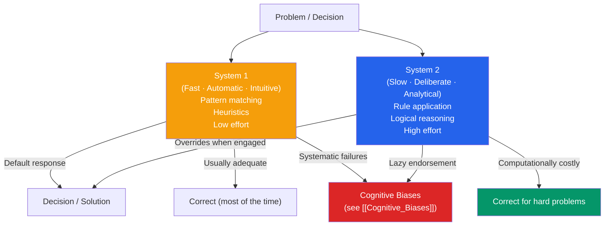

# 🧩 Problem Solving and Decision Making

> [!abstract] TL;DR
> Problem solving is moving from an initial state to a goal state; decision making is choosing among options with uncertain outcomes. Both reveal a fundamental tension: the brain uses fast, intuitive heuristics (System 1) that work well most of the time but fail systematically in predictable ways, while slow, deliberate reasoning (System 2) is accurate but metabolically expensive. Kahneman and Tversky's research showed that humans are not rational actors — but they are *predictably* irrational, which means the failures can be catalogued and partly corrected.

## Intuition — analogy FIRST

Imagine two employees you can call on to answer any question.

**Employee 1** ("System 1") answers instantly, with enormous confidence, from pattern memory. She's available 24/7, never complains, and is right 95% of the time on routine questions. But she's terrible at novel problems, ignores base rates, and her confidence doesn't track her accuracy.

**Employee 2** ("System 2") provides careful, methodical analysis. He's right on hard problems but works slowly, charges premium rates (metabolically), and only answers if explicitly summoned. Here's the trap: Employee 1 often *thinks* she's answered a question before Employee 2 even hears it — and Employee 2 often just endorses Employee 1's answer without checking.

Most poor decisions involve Employee 1 solving the wrong problem confidently while Employee 2 is on autopilot.

---

## How It Works



## Key Concepts / Details

### Problem Solving Strategies

**Well-defined vs. ill-defined problems**:
- **Well-defined**: clear initial state, goal state, and allowable operators (chess, algebra, Tower of Hanoi)
- **Ill-defined**: vague goal, unclear constraints (how to improve team morale)

**Algorithms**: guaranteed to find the solution if one exists; exhaustive search. Always correct, often impractical (trying all routes to find the shortest is NP-hard for large problems).

**Heuristics**: mental shortcuts that reduce search space at the cost of guaranteed optimality. Fast, usually adequate, but fail in predictable ways.

| Strategy | Description | Example |
|---|---|---|
| **Trial and error** | Try solutions until one works | Crossword puzzle |
| **Means-end analysis** | Reduce gap between current and goal state (GPS model — Newell & Simon) | "The disk needs to be on peg C, not B — move it" |
| **Working backward** | Start from goal and work backward to initial state | Geometry proofs |
| **Analogy** | Apply a solution from a similar known problem | "This is like last year's budget problem" |

### Obstacles to Problem Solving

| Obstacle | Description | Classic Example |
|---|---|---|
| **Mental set** | Tendency to apply previously successful strategies to new problems | The 9-dot problem (staying inside the imaginary box) |
| **Functional fixedness** | Inability to see novel uses for familiar objects | Duncker's candle problem (using tack box as a platform) |
| **Confirmation bias** | Seeking information that confirms existing hypotheses | Wason selection task failures |
| **Einstellung effect** | Expert blind spots — habitual approaches block optimal solutions | Experienced chess players miss obvious solutions when they conflict with patterns |

**Insight problems**: solutions that arrive suddenly after an impasse — the "Aha!" moment (Köhler's chimps, Archimedes). fMRI shows a burst of activity in the right anterior temporal lobe at the moment of insight.

### Kahneman and Tversky — Heuristics and Biases Program

Daniel Kahneman and Amos Tversky (1970s–1990s) systematically documented systematic deviations from rational choice theory:

**Three core heuristics** (Tversky & Kahneman, 1974):

| Heuristic | Mechanism | Classic Bias Produced |
|---|---|---|
| **Representativeness** | Judge probability by similarity to prototype | Base rate neglect, conjunction fallacy |
| **Availability** | Judge frequency by ease of recall | Overestimate dramatic/recent events |
| **Anchoring and adjustment** | Start from anchor, adjust insufficiently | Anchoring bias |

**Dual Process Theory** (System 1 / System 2) — formalized by Kahneman in *Thinking, Fast and Slow* (2011):

| | System 1 | System 2 |
|---|---|---|
| **Speed** | Fast (milliseconds) | Slow (seconds) |
| **Effort** | Effortless, automatic | Effortful, deliberate |
| **Capacity** | Unlimited, parallel | Limited, serial |
| **Errors** | Systematic biases | Logical errors in difficult reasoning |
| **Examples** | Reading emotion in a face, 2+2, driving familiar route | Complex math, logical deduction, novel decisions |

**Key insight**: System 2 is *lazy* — it often endorses System 1's output without scrutiny. The bat-and-ball problem: "A bat and a ball cost $1.10. The bat costs $1 more than the ball. How much does the ball cost?" System 1 says 10¢. The correct answer is 5¢.

### Prospect Theory (Kahneman & Tversky, 1979)

The dominant alternative to expected utility theory. People evaluate outcomes as **gains and losses relative to a reference point**, not as absolute outcomes.

Key features:
1. **Loss aversion**: losses hurt ~2× more than equivalent gains feel good. Losing $100 is more painful than gaining $100 is pleasurable.
2. **Diminishing sensitivity**: the difference between $0 and $100 feels larger than between $900 and $1,000.
3. **Probability weighting**: people overweight small probabilities (lottery, rare disasters) and underweight moderate-to-high probabilities.

```
Value
  ↑
  |        /
  |       /    GAINS
  |      /
--+-----+----------→ Outcome
  |    /
  |   /   (steeper slope)
  |  /
  | /     LOSSES
```

**Framing effect**: the same objective choice feels different depending on how it's described:
- "This surgery has a 90% survival rate" vs. "This surgery has a 10% mortality rate" — identical facts, different decisions.

See also [[Behavioral_Economics_Psychology]] for how these findings apply to economics.

### Decision Making Under Uncertainty

**Expected Value (EV)**: multiply probability × outcome for each option; choose the highest EV. Rational but often violates human preferences.

**Expected Utility Theory**: people maximize utility (subjective value), not objective value. Rationality is maintained — but Kahneman/Tversky showed even EU is systematically violated.

**Satisficing** (Simon, 1955): people don't optimize — they select the first option that meets their threshold of acceptability. **Bounded rationality**: cognitive limits force satisficing rather than optimizing.

**Naturalistic Decision Making** (Klein, 1993): experts in dynamic environments (firefighters, pilots) rarely engage in comparative analysis. They recognize situations from experience, simulate one action mentally, and execute if it seems OK. **Recognition-primed decision (RPD) model**.

## Real-World Notes

- **Medical diagnosis**: System 1 pattern matching drives most clinical decisions (fast, usually right, but subject to availability bias and premature closure). Checklists and differential diagnosis force System 2 engagement.
- **UX design**: users make decisions under high cognitive load — anchoring (price comparisons start from the first price shown), framing (default selections determine choices), and loss aversion (free trials that auto-charge exploit the pain of losing the service).
- **Management**: "pre-mortem" (Klein) — imagine the project has failed, then work backward to identify why. Forces System 2 engagement before commitments are made.
- **Behavioral economics**: nudge theory (Thaler & Sunstein) designs choice architectures that steer System 1 toward socially optimal choices without restricting freedom. See [[Behavioral_Economics_Psychology]].

## Common Pitfalls

- **"I just need more information"** — more information beyond a threshold doesn't improve decisions; it increases confidence without improving accuracy (the overconfidence effect). Diagnosis stalls in data collection.
- **"Smart people aren't biased"** — intelligence predicts *some* reduction in some biases (e.g., base rate neglect) but not others. High-need-for-cognition individuals show equivalent loss aversion and framing effects.
- **Confusing a heuristic with a bias** — heuristics are strategies; biases are systematic errors they produce. The heuristic is not always wrong; the bias is the systematic error that emerges under specific conditions.

## Related Concepts

- [[_MOC_Cognitive_Psychology|↑ Section MOC]]
- [[Cognitive_Biases]] — Detailed taxonomy of specific biases from these heuristics
- [[Behavioral_Economics_Psychology]] — Application of prospect theory and bounded rationality to economic behavior
- [[Attention_and_Cognitive_Load]] — Cognitive load impairs System 2 reasoning, increasing System 1 errors
- [[Memory_Systems]] — Availability heuristic depends on ease of retrieval from memory
- [[Group_Dynamics]] — Groupthink, risky shift: how group decisions go wrong
- [[Organizational_Psychology]] — Decision-making in organizations; escalation of commitment

## Review Questions

1. A doctor quickly diagnoses a patient as having the flu based on pattern recognition (tired, achy, runny nose). The patient actually has early-stage pneumonia. Analyze this using dual-process theory — what happened, and what decision-making practice would have caught the error?
2. Explain why people buy lottery tickets (low-EV) and also buy insurance (also low-EV). How does prospect theory explain both behaviors simultaneously?
3. Describe the "9-dot problem" and explain what it illustrates about mental set. How would you design a training program to reduce mental set in a creative team?

## Sources

- Daniel Kahneman, *Thinking, Fast and Slow* (2011)
- Tversky, A. & Kahneman, D. (1974). "Judgment under uncertainty: Heuristics and biases." *Science*, 185, 1124–1131
- Kahneman, D. & Tversky, A. (1979). "Prospect theory." *Econometrica*, 47(2), 263–292
- Herbert Simon (1955). "A behavioral model of rational choice." *Quarterly Journal of Economics*

#psychology #cognitive-psychology #decision-making #problem-solving #dual-process
