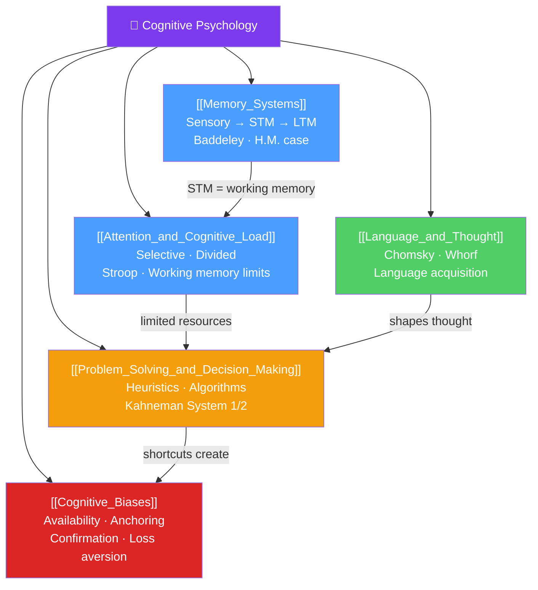

# 🗺️ Cognitive Psychology — Map of Content

> [!abstract] What This Section Covers
> Cognitive psychology studies the internal mental processes that mediate between stimulus and response: **memory** (how information is encoded, stored, and retrieved), **attention** (the limited-capacity gate controlling what gets processed), **language** (the uniquely human symbolic system), **problem solving and decision making** (how we navigate complexity under uncertainty), and **cognitive biases** (the systematic errors that arise from using mental shortcuts). Together these five notes reveal the architecture of the mind and why it both succeeds brilliantly and fails predictably.

## Concept Map

## Learning Path

1. [[Memory_Systems]] — The multi-store model, Baddeley's working memory, long-term memory types, encoding/retrieval, and the classic H.M. case.
2. [[Attention_and_Cognitive_Load]] — Selective and divided attention, the Stroop effect, cognitive load theory, and attention's limits.
3. [[Language_and_Thought]] — Chomsky's universal grammar, the Sapir-Whorf hypothesis, and how language shapes cognition.
4. [[Problem_Solving_and_Decision_Making]] — Algorithms vs. heuristics, Kahneman's dual-process theory, and decision traps.
5. [[Cognitive_Biases]] — Systematic deviations from rationality: availability, anchoring, confirmation bias, and more.

## All Notes at a Glance

| Note | Difficulty | What You'll Learn |
|------|------------|-------------------|
| [[Memory_Systems]] | Beginner → Intermediate | Sensory/STM/LTM model, working memory, episodic/semantic/procedural memory, encoding, retrieval, forgetting |
| [[Attention_and_Cognitive_Load]] | Intermediate | Selective attention, Stroop effect, dual-task, CLT, inattentional blindness, ADHD |
| [[Language_and_Thought]] | Intermediate | Language acquisition, grammar, Sapir-Whorf, bilingualism, thinking in language |
| [[Problem_Solving_and_Decision_Making]] | Intermediate | Mental set, insight, heuristics vs algorithms, System 1/2, prospect theory |
| [[Cognitive_Biases]] | Intermediate → Advanced | Heuristics taxonomy, availability, anchoring, confirmation bias, loss aversion, framing, debiasing |

## Key Questions This Section Answers

- What is the difference between working memory and long-term memory, and why does the distinction matter?
- Why does multitasking reliably impair performance on both tasks?
- Can the language you speak affect how you think?
- Why do intelligent people make systematically poor decisions under uncertainty?
- What is the difference between a cognitive bias and a logical fallacy?

## Related Sections

- [[_MOC_Psychology_Master|↑ Psychology Master MOC]]
- [[_MOC_Psychology_Foundations|← Foundations]]
- [[_MOC_Social_Psychology|→ Social Psychology]]
- [[_MOC_Clinical_Applied|→ Clinical & Applied]] — CBT explicitly targets cognitive distortions
- Cross-vault: [[Behavioral_Economics_Psychology]], [[Game_Theory]]

#MOC #Psychology #CognitivePsychology
