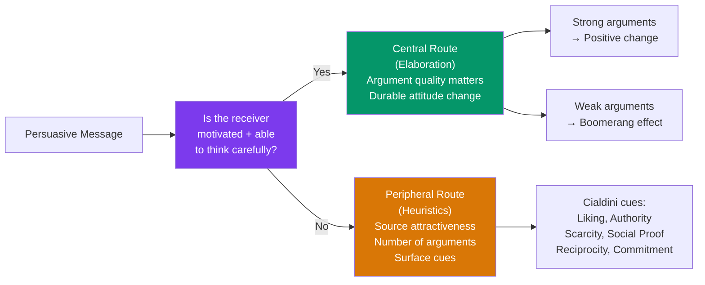

# 💬 Attitudes and Persuasion

> [!abstract] TL;DR
> Attitudes are evaluative responses — positive or negative — toward objects, people, or ideas. They have cognitive, affective, and behavioral components. Attitudes are formed through experience, social learning, and conditioning; they change through persuasion and cognitive dissonance. The **Elaboration Likelihood Model** explains *when* and *how* attitude change occurs. Cialdini's six principles of influence identify the persuasion shortcuts people reliably use.

## Intuition — analogy FIRST

Think of an attitude as a standing order in a bureaucracy.

When a new situation arrives ("should I buy this product?"), the bureaucracy could analyze it from scratch — that's effortful. Or it can look up the standing order ("I like this brand → approve"). Attitudes are standing orders that streamline evaluation of the social world.

Now the question is: how do you change a standing order? Two routes:
1. **Central route**: present compelling evidence that forces a full re-analysis. Expensive but creates durable change.
2. **Peripheral route**: associate the old order with something unpleasant (or associate the new one with someone attractive and confident). Cheap and fast, but the new order is fragile — it reverts under scrutiny.

Cialdini's six principles are essentially six peripheral-route shortcuts that reliably trigger "approve" without invoking central analysis.

---

## How It Works

## Key Concepts / Details

### The Structure of Attitudes

Attitudes have three components (the **ABC model**):

| Component | Description | Example |
|---|---|---|
| **Affective (A)** | Emotional response | "Dogs make me anxious" |
| **Behavioral (B)** | Behavioral tendency | "I avoid dogs" |
| **Cognitive (C)** | Beliefs and knowledge | "Dogs bite and carry disease" |

Attitudes can be **explicit** (consciously accessible and reportable) or **implicit** (automatic, below-conscious — measured by IAT; see [[Prejudice_and_Discrimination]]).

**Do attitudes predict behavior?** Weakly, on average. LaPiere (1934): hotels that refused Chinese guests on policy served an actual Chinese couple in person. Factors that strengthen attitude-behavior consistency:
- Attitude strength (how accessible, important, certain)
- Specificity match (attitude toward "recycling in general" predicts less than attitude toward "recycling this specific can")
- Low situational pressure (norms, time, observation)

### Cognitive Dissonance (Festinger, 1957)

**Cognitive dissonance**: the uncomfortable tension created by holding two inconsistent cognitions — or acting contrary to one's attitudes.

**Resolution strategies**:
1. Change the attitude to match the behavior
2. Change the behavior to match the attitude
3. Add a consonant cognition to reduce the inconsistency
4. Trivialize the importance of one element

**Classic experiment** (Festinger & Carlsmith, 1959): participants paid either $1 or $20 to lie that a boring task was interesting.
- $1 group: insufficient external justification → changed their attitude ("the task was actually pretty interesting")
- $20 group: well-paid → no need to change attitude ("I was paid to say it")

**Self-perception theory** (Bem, 1967): an alternative explanation — we infer our own attitudes from our behavior, just as we infer others'. "I volunteered to do that task, so I must like it." The two theories make different predictions for arousal.

**Post-decision dissonance**: after making a difficult choice, people enhance the chosen option and denigrate the unchosen one — justifying the decision retrospectively.

### Elaboration Likelihood Model (ELM) — Petty & Cacioppo (1986)

Two routes to persuasion:

| | Central Route | Peripheral Route |
|---|---|---|
| **Processing** | Deep elaboration of message content | Superficial heuristic cues |
| **Conditions** | High motivation + ability | Low motivation or ability |
| **What matters** | Argument strength and quality | Source characteristics, emotion, quantity |
| **Attitude change** | Durable, resistant to counter-persuasion | Fragile, easily reversed |
| **Behavior prediction** | Strong | Weak |

**Manipulation**: vary argument quality and source expertise independently. High-involvement audiences respond to argument quality; low-involvement audiences respond to source attractiveness.

### Cialdini's Six Principles of Influence

Robert Cialdini's *Influence* (1984) identified six psychological principles underlying compliance:

| Principle | Mechanism | Example |
|---|---|---|
| **Reciprocity** | We feel obligated to return favors | Free samples → purchases; uninvited gifts → donations |
| **Commitment/Consistency** | We align behavior with prior commitments | Foot-in-the-door; loyalty programs |
| **Social Proof** | We use others' behavior as information | "97% of customers rated 5 stars"; laugh tracks |
| **Authority** | We defer to experts and credentials | Doctor's white coat; "studies show..." |
| **Liking** | We comply with people we like | Attractive salespeople; similarity exploitation |
| **Scarcity** | We value things more when rare | "Only 3 left"; limited-time offers |

**Seventh principle** (added later): **Unity** — we comply with those we see as "us" (family, tribe). "As a fellow [X]..." 

**Ethical application**: these principles exist in human psychology regardless — the question is whether they are used honestly (genuine scarcity, genuine authority) or deceptively (manufactured urgency).

### Attitude Formation

How do attitudes develop?

| Mechanism | Description | Example |
|---|---|---|
| **Classical conditioning** | Pairing stimuli creates affective associations | Brand music → positive feelings |
| **Operant conditioning** | Rewarded attitudes strengthened | Parents praise patriotism |
| **Observational learning** | Adopt attitudes from role models | Children absorb parents' racial attitudes |
| **Mere exposure effect** | Repeated exposure increases liking (Zajonc, 1968) | Preferring familiar music/faces |
| **Self-perception** | Infer attitudes from behavior | "I donated, I must care about this cause" |

**Mere exposure effect**: familiarity breeds liking — robust finding across stimuli, but only when initial reaction is neutral or positive. Explains brand advertising even with no direct sales pitch.

### Persuasion Resistance

| Resistance Mechanism | Description |
|---|---|
| **Forewarning** | Knowing a persuasive attempt is coming reduces effectiveness |
| **Inoculation theory** (McGuire) | Exposing people to weakened counter-arguments and helping them refute them builds resistance |
| **Reactance** (Brehm) | Perceived threats to freedom cause "reverse" attitude change |
| **Selective exposure** | Seeking attitude-consistent information |

**Inoculation** works like a psychological vaccine: exposure to weak "infections" of counter-arguments, with refutation, builds antibodies against later stronger persuasion. Applied in media literacy education.

## Real-World Notes

- **Advertising**: peripheral route persuasion dominates advertising — beautiful people, aspirational imagery, background music. When attention is low (scrolling), argument quality barely matters.
- **Politics**: "third-party" social proof ("9 out of 10 voters in your area support...") uses social proof. Repeat exposure to a candidate's name increases recognition-based liking (mere exposure).
- **Negotiation**: reciprocity creates obligation; door-in-the-face leverages it. Understanding that you're being primed toward obligation — the free dinner before the sales pitch — allows resistance.
- **Public health**: commitment devices (signing a pledge, making a public announcement) leverage consistency. Inoculation is used to counter vaccine hesitancy and climate denial.

## Common Pitfalls

- **"Attitude change is permanent"** — peripheral route changes are fragile and decay without reinforcement. The central route produces durable change; emotional appeals alone rarely last.
- **Confusing persuasion with manipulation** — persuasion presents genuine reasons; manipulation exploits psychological vulnerabilities without the target's informed consent. The line matters ethically.
- **"Cognitive dissonance requires major conflict"** — small inconsistencies create dissonance too; post-purchase rationalization, justification of effort, and hazing all reflect small-scale dissonance resolution.

## Related Concepts

- [[_MOC_Social_Psychology|↑ Section MOC]]
- [[Social_Influence_and_Conformity]] — How compliance techniques overlap with obedience mechanisms
- [[Cognitive_Biases]] — Many persuasion techniques exploit cognitive biases
- [[Behavioral_Economics_Psychology]] — Default setting, loss aversion, and framing are applied attitude-change tools
- [[Organizational_Psychology]] — Change management requires attitude change; organizational culture shapes standing attitudes

## Review Questions

1. Festinger and Carlsmith paid participants $1 or $20 to lie. Why did the $1 group show greater attitude change? Explain using both cognitive dissonance theory and self-perception theory.
2. You are designing a public health campaign to increase vaccination rates. For each of Cialdini's six principles, describe a specific message or tactic that would apply it ethically.
3. Using the Elaboration Likelihood Model, explain why the same advertisement might work very differently for someone who is highly involved in the product category vs. someone browsing casually.

## Sources

- Leon Festinger & James Carlsmith (1959). "Cognitive consequences of forced compliance." *JASP*
- Robert Cialdini, *Influence: The Psychology of Persuasion* (1984, updated 2021)
- Petty, R.E. & Cacioppo, J.T. (1986). "The elaboration likelihood model of persuasion." *Advances in Experimental Social Psychology*, 19
- Richard Petty & John Cacioppo, *Communication and Persuasion* (1986)

#psychology #social-psychology #attitudes #persuasion #cognitive-dissonance #cialdini
