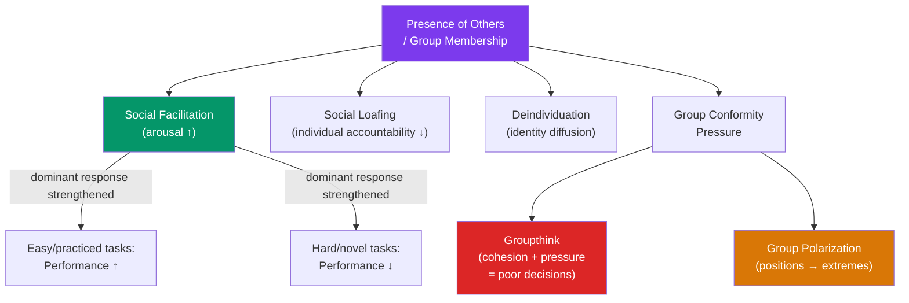

# 🏟️ Group Dynamics

> [!abstract] TL;DR
> Groups are not just collections of individuals — they have emergent properties that profoundly alter member behavior. **Social facilitation** improves simple task performance in the presence of others; **social loafing** reduces effort when individual contributions are hidden. **Groupthink** makes cohesive groups reach poor decisions by suppressing dissent. **Group polarization** pushes group positions toward extremes. Understanding these dynamics is essential for anyone designing teams, running meetings, or studying organizational behavior.

## Intuition — analogy FIRST

Consider why a musician plays better at a live concert than alone in the bedroom — and why a student studying in a group library sometimes learns less than they would alone.

The **presence of others** does not uniformly help or harm — it depends on what you're doing. If the task is well-practiced and simple (the concert), audience arousal sharpens performance. If the task is complex and novel (trying to learn new material), the same arousal creates noise that degrades learning.

Now scale this up to a decision-making committee. A cohesive team with a strong leader produces a powerful conformity pressure that silences doubts. The group moves confidently toward a decision that no individual member fully endorses in private. This is Janis's groupthink — and it explains the Bay of Pigs invasion, Challenger disaster, and many corporate failures.

---

## How It Works

## Key Concepts / Details

### Social Facilitation

Norman Triplett (1898) observed cyclists race faster against competitors than alone — the first social psychology experiment. Robert Zajonc (1965) synthesized decades of conflicting results:

**Zajonc's drive theory**: the presence of others creates **arousal** which increases the probability of **dominant responses** (the well-learned, automatic response). Result:
- Well-learned behavior: arousal → facilitation (better performance)
- Novel/complex behavior: arousal → impairment (worse performance)

**Mechanisms proposed**:
- **Evaluation apprehension**: concern about being judged (Cottrell et al.)
- **Distraction-conflict**: others create attention conflict that increases arousal (Baron)
- **Mere presence**: arousal occurs even without evaluation (Zajonc's original)

**Applications**: surgeons, athletes, and speakers perform better with experienced audiences (practiced tasks); novices deteriorate. Exam conditions (evaluation apprehension) hurt performance on difficult, novel material.

### Social Loafing

Ringelmann (1913): rope-pulling effort per person drops as group size increases. People exert less effort when they are part of a group — **social loafing** — because individual contributions are less identifiable.

**Conditions that reduce loafing**:
- Tasks that are meaningful and personally involving
- Individual contributions are identifiable and evaluated
- High group cohesion and commitment to shared goals
- High collective efficacy (belief the group can succeed)

**Cross-cultural variation**: social loafing is more prevalent in individualistic cultures; collectivist cultures show less loafing (and sometimes "social striving" — enhanced performance in groups for group-relevant tasks).

### Deindividuation

Loss of self-awareness and individuality in groups, associated with reduced adherence to personal norms and increased impulsive, anti-normative behavior.

**Factors**: anonymity, crowd size, arousal, diffusion of responsibility.

**Classic research**: Zimbardo (1970) — anonymous participants in hoods gave longer electric shocks than identifiable participants in name tags. Diener et al. (1976) — Halloween trick-or-treating children stole more candy when in costume and in groups.

**Paradox**: deindividuated people don't abandon all norms — they become more responsive to *group* norms. In a prosocial context, deindividuation can *increase* helping (e.g., anonymous donation boxes). This led to the **SIDE model** (Social Identity model of Deindividuation Effects): anonymity shifts focus from personal to group identity.

### Groupthink (Janis, 1972)

Irving Janis analyzed historical policy failures (Bay of Pigs, Pearl Harbor, Challenger) and identified a syndrome of defective group decision-making in highly cohesive groups under directive leadership.

**Antecedents**: high cohesion + insulation from outside input + directive leader + high stress with low self-esteem.

**Symptoms**:

| Symptom | Description |
|---|---|
| **Illusion of invulnerability** | Excessive optimism; ignore warning signs |
| **Collective rationalization** | Collectively discount warnings |
| **Belief in inherent group morality** | Members don't question group ethics |
| **Stereotyped views of out-groups** | Rivals seen as weak/evil |
| **Pressure on dissenters** | Members who dissent face social pressure |
| **Self-censorship** | Members suppress their own doubts |
| **Illusion of unanimity** | Silence = consent assumption |
| **Self-appointed mindguards** | Members protect leader from dissenting views |

**Prevention**:
- Leader withholds opinion at the start
- Devil's advocate role assigned
- Anonymous input collection
- Invite outside experts
- Multiple independent subgroups
- Second-chance meetings after preliminary decisions

### Group Polarization

After group discussion, members tend to move *more extreme* in the direction they were already leaning.

**Mechanisms**:
1. **Persuasive arguments**: discussion surfaces new arguments; in a like-minded group, more pro-attitude arguments heard → shift further
2. **Social comparison**: individuals want to be *at least as committed* as their peers; discovering peers are as or more committed encourages shift to be in the "ideal" position

**Examples**: 
- Jury deliberation: initial leanings amplified
- Online echo chambers: algorithm-curated feeds intensify existing views
- Radicalization: group polarization as a mechanism in extremist recruitment

**Risky shift**: early research found groups made riskier decisions (Stoner, 1961). Later research showed this was polarization toward the initially dominant risk preference, not a universal "risky shift."

### Leadership Styles

| Style | Description | Best When |
|---|---|---|
| **Autocratic** | Leader decides unilaterally | Crisis, time pressure, clear expertise |
| **Democratic/Participative** | Leader involves group in decisions | Complex problems, commitment needed |
| **Laissez-faire** | Minimal direction; group has autonomy | Highly expert, self-motivated teams |
| **Transformational** | Inspire vision, motivate intrinsically | Change management, long-term goals |
| **Transactional** | Reward/punish based on performance | Routine tasks, clear deliverables |

**Great Person Theory (trait approach)**: leaders are born with key traits (intelligence, charisma, dominance). Evidence: leadership traits are identifiable but account for <30% of variance in leadership emergence.

**Situational leadership** (Hersey & Blanchard): optimal leadership style depends on follower readiness. Directive for novices; delegating for experts.

## Real-World Notes

- **Meeting design**: groupthink and social loafing both flourish in poorly designed meetings. Pre-read materials, anonymous idea generation (brainwriting vs. brainstorming), explicit devil's advocate roles, and leader-last-to-speak are evidence-based counter-measures.
- **Remote work**: deindividuation can increase in distributed teams (anonymity, less accountability); social loafing becomes harder to detect. Explicit check-ins on individual contributions counteract loafing.
- **Diversity**: homogeneous groups are more susceptible to groupthink; diverse groups generate more perspectives but need better conflict management. Diversity is most beneficial when task requires creative solutions.
- **Organizational psychology**: Tuckman's stages of group development (forming, storming, norming, performing, adjourning) describe the lifecycle of teams. See [[Organizational_Psychology]].

## Common Pitfalls

- **"Brainstorming works"** — social psychological research consistently shows that brainstorming groups produce fewer and less creative ideas than the same number of individuals working separately (production blocking, evaluation apprehension, social matching). Brainwriting > brainstorming.
- **"Consensus = wisdom"** — group consensus is often groupthink in disguise. Delphi method (iterated anonymous surveys) and prediction markets are superior aggregation mechanisms.
- **Confusing group polarization with extremism** — polarization is a process; extremism is a possible outcome. Polarization operates even in moderate groups making mundane decisions.

## Related Concepts

- [[_MOC_Social_Psychology|↑ Section MOC]]
- [[Social_Influence_and_Conformity]] — Conformity is the individual-level mechanism; group dynamics are the collective level
- [[Organizational_Psychology]] — Teams, leadership, and organizational culture
- [[Prejudice_and_Discrimination]] — In-group favoritism and inter-group conflict
- [[Prosocial_Behavior]] — Bystander effect as a group dynamics phenomenon (diffusion of responsibility)
- Cross-vault: [[Behavioral_Economics_Psychology]] — Herding, cascade effects

## Review Questions

1. A software team has been working together for two years and is highly cohesive. The project manager has strong opinions and a track record of success. Identify three specific groupthink risks and propose one structural counter-measure for each.
2. Explain why brainstorming groups typically produce fewer ideas than nominal groups. What does this reveal about social facilitation, and how does brainwriting address it?
3. How does group polarization explain online radicalization? Identify the two mechanisms of polarization and describe how each operates in social media algorithm-driven environments.

## Sources

- Irving Janis, *Victims of Groupthink* (1972)
- Zajonc, R.B. (1965). "Social facilitation." *Science*, 149, 269–274
- Moscovici, S. & Zavalloni, M. (1969). "The group as a polarizer of attitudes." *JPSP*
- Latané, B., Williams, K. & Harkins, S. (1979). "Many hands make light the work." *JPSP*

#psychology #social-psychology #group-dynamics #groupthink #social-facilitation
