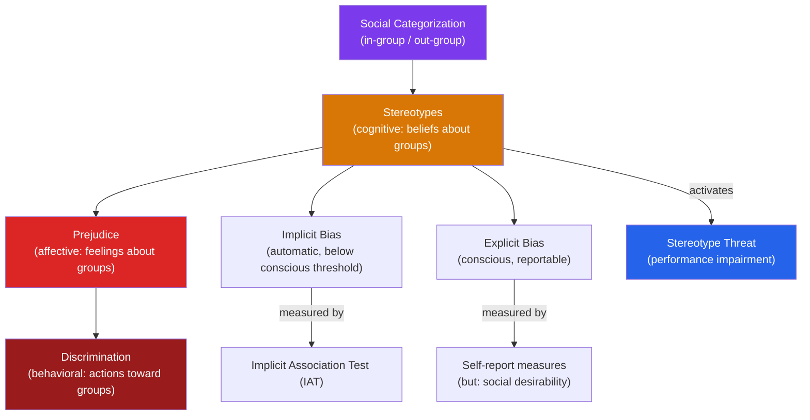

# ⚖️ Prejudice and Discrimination

> [!abstract] TL;DR
> Prejudice is an unjustified, often negative attitude toward a social group; discrimination is prejudicial behavior. Stereotypes are cognitive schemas — generalizations about group characteristics — that are both psychologically efficient and socially harmful. Modern prejudice often operates implicitly and automatically, measurable by the IAT. Stereotype threat impairs performance in groups who know negative stereotypes exist about them. The contact hypothesis — under the right conditions, inter-group contact reduces prejudice — is the most well-supported intervention.

## Intuition — analogy FIRST

Imagine a spam filter trained on old data.

The filter learned, from thousands of examples, that emails with certain features are spam. It works fast and mostly correctly. But it encodes historical correlations — including false ones — and flags legitimate emails that happened to share features with past spam. The filter doesn't "hate" the emails it blocks; it's just pattern-matching, efficiently and without malice.

Stereotypes function similarly. The brain's category system efficiently assigns individuals to groups and applies group-level expectations. This cognitive economy (rapid classification) served evolutionary purposes but produces systematic errors: individual variation is ignored, exceptions are discounted, and group membership overrides individual evidence.

The crucial difference from a spam filter: stereotypes carry evaluative valence (good/bad), are self-reinforcing (we notice confirming evidence), and are embedded in social structures that create real consequences (housing, employment, justice).

---

## How It Works

## Key Concepts / Details

### Social Categorization and In-Group/Out-Group Effects

The mere act of categorizing people into groups creates:
- **In-group favoritism**: favor and help members of one's own group
- **Out-group homogeneity**: see out-group members as more similar to each other than in-group members ("they're all the same")
- **Out-group derogation**: perceive out-group less favorably

**Minimal group paradigm** (Tajfel, 1971): participants assigned to groups based on preference for Klee vs. Kandinsky paintings showed in-group favoritism in resource allocation immediately — no history, no competition, no contact required.

**Social Identity Theory** (Tajfel & Turner, 1979): people derive self-esteem from group memberships. Maintaining positive group identity motivates in-group favoritism and out-group derogation.

### Stereotypes: Cognitive Basis

Stereotypes are cognitive schemas — mental frameworks that organize information about social groups. They develop through:
- **Category-based processing**: efficiency of treating group members as interchangeable
- **Illusory correlation** (Hamilton & Gifford, 1976): overestimate co-occurrence of distinctive events (minority groups + negative behaviors) even when the correlation is identical to the majority
- **Subtyping**: when disconfirming evidence appears, create a subtype ("she's not like typical X") to protect the stereotype
- **Confirmation bias**: notice stereotype-confirming information; explain away disconfirming

**Accuracy**: stereotypes contain a "kernel of truth" — groups do differ on many dimensions. The error is applying group averages to individuals (ignoring individual variance) and exaggerating group differences.

### Implicit Bias and the IAT

**Implicit Association Test (IAT)** (Greenwald, McGhee & Schwartz, 1998):
Measures the strength of automatic associations between concepts (e.g., Black/White faces) and attributes (e.g., good/bad words) by measuring response latency.

| IAT Finding | Implication |
|---|---|
| Most white Americans show implicit preference for white faces | Implicit bias does not require explicit prejudice |
| IAT scores predict some discriminatory behaviors (e.g., non-verbal unfriendliness) | Implicit attitudes have behavioral consequences |
| Predictive validity is modest (r ~.15) | IAT is not a reliable diagnostic of individual discrimination |
| IAT scores are malleable (change with context) | Implicit attitudes are not fixed traits |

**Controversy**: debate over whether IAT measures implicit attitudes, automatic stereotypes, or task-specific associations. Whether IAT scores reliably predict real-world discrimination is contested.

### Stereotype Threat (Steele & Aronson, 1995)

When members of a stigmatized group are in a situation where a negative stereotype could apply to them, the anxiety of confirming the stereotype impairs their performance on relevant tasks — even in the absence of actual prejudice from the evaluator.

**Original study**: Black college students told a test was diagnostic of ability performed worse than those told it was a non-diagnostic lab task. No difference for white students.

**Mechanisms**:
- Increased cognitive load (anxious thoughts occupy working memory)
- Vigilance and monitoring (effortful monitoring of performance consumes resources)
- Reduced self-efficacy and motivation

**Broad applicability**: women in math, elderly on memory tasks, white athletes in sports contexts — any group with a negative stereotype in a relevant domain.

**Reducing stereotype threat**:
- Reaffirm important personal values (self-affirmation)
- Emphasize growth mindset (intelligence as expandable)
- Provide in-group role models
- Reduce stereotype salience in evaluation context
- Normalize struggle and mistakes in learning

### Discrimination: Individual and Institutional

| Level | Description | Example |
|---|---|---|
| **Individual discrimination** | Direct, conscious actions against group members | Refusing to hire a qualified minority candidate |
| **Subtle/aversive discrimination** | Unconscious, rationalized through non-prejudice justifications | Claiming minority candidate is "not a cultural fit" |
| **Institutional/structural discrimination** | Policies and practices that perpetuate disparities without explicit prejudice | Zip-code-based school funding, algorithmic hiring tools |

**Aversive racism** (Gaertner & Dovidio): explicit egalitarians who still harbor negative automatic associations. They discriminate when there is a non-prejudice justification available but behave fairly when race is the only salient factor.

### Reducing Prejudice: The Contact Hypothesis

Gordon Allport's **Contact Hypothesis** (1954): prejudice is reduced by contact between groups — under specific conditions:

| Condition | Why It's Necessary |
|---|---|
| **Equal status** | Without equality, contact reinforces hierarchy |
| **Cooperative goals** | Competition increases conflict; shared goals create interdependence |
| **Institutional support** | Authority (teacher, employer) endorses positive interaction |
| **Personal acquaintance** | Superficial contact doesn't generalize; deeper contact required |

**Jigsaw classroom** (Aronson, 1971): students divided into diverse groups, each member responsible for a unique piece of material. Interdependence forces cooperation; prejudice and academic performance both improved in desegregated schools.

**Meta-analysis** (Pettigrew & Tropp, 2006): across 515 studies, contact reduces prejudice — conditions maximize but are not required. Direct contact works better than indirect (imagined contact, media).

## Real-World Notes

- **Hiring**: structured interviews, diverse panels, blind résumé review all reduce implicit bias effects. Unstructured interviews maximally expose candidates to evaluator biases.
- **Criminal justice**: implicit bias studies show police officers respond faster to Black targets in ambiguous weapon/tool tasks. Body cameras, diversity training, and accountability structures are partial responses.
- **Education**: stereotype threat in STEM affects girls and underrepresented minorities. Growth mindset interventions, diverse instructors, and reduced emphasis on native talent all reduce threat.
- **Healthcare**: implicit bias affects pain management and diagnostic quality for minority patients. Standardized protocols and patient feedback mechanisms help counteract it.

## Common Pitfalls

- **"I'm not prejudiced, so I have no implicit bias"** — implicit attitudes are distinct from explicit ones; egalitarian explicit values coexist with implicit associations shaped by cultural exposure.
- **"The IAT measures discrimination"** — the IAT measures automatic associations, not necessarily behavioral discrimination. High IAT scores do not diagnose individuals as discriminators.
- **"Stereotype threat only affects minorities"** — any group with a relevant negative stereotype can experience threat. White males experience threat in tasks where they're told Asians outperform white males.

## Related Concepts

- [[_MOC_Social_Psychology|↑ Section MOC]]
- [[Group_Dynamics]] — In-group/out-group dynamics as the bedrock of intergroup conflict
- [[Social_Influence_and_Conformity]] — Conformity to prejudiced group norms
- [[Attitudes_and_Persuasion]] — Prejudice as an attitude; attitude change through contact
- [[Cognitive_Biases]] — Illusory correlation, confirmation bias as cognitive roots of stereotyping
- [[Organizational_Psychology]] — Diversity and inclusion in organizational contexts

## Review Questions

1. Explain why illusory correlation contributes to stereotyping, using a numerical example. How does this cognitive mechanism make it difficult for evidence to change stereotypes?
2. Describe stereotype threat in your own words, and explain the working memory mechanism by which it impairs performance. Design a classroom intervention that would reduce stereotype threat for female students in a math exam.
3. Why is "equal contact" insufficient to reduce prejudice, according to Allport's Contact Hypothesis? What happened historically when schools were desegregated without meeting these conditions?

## Sources

- Gordon Allport, *The Nature of Prejudice* (1954)
- Steele, C. & Aronson, J. (1995). "Stereotype threat and the intellectual test performance of African Americans." *JPSP*, 69(5), 797–811
- Greenwald, A.G. et al. (1998). "Measuring individual differences in implicit cognition: The IAT." *JPSP*, 74(6)
- Pettigrew, T.F. & Tropp, L.R. (2006). "A meta-analytic test of intergroup contact theory." *JPSP*, 90(5)

#psychology #social-psychology #prejudice #discrimination #implicit-bias #stereotype-threat
