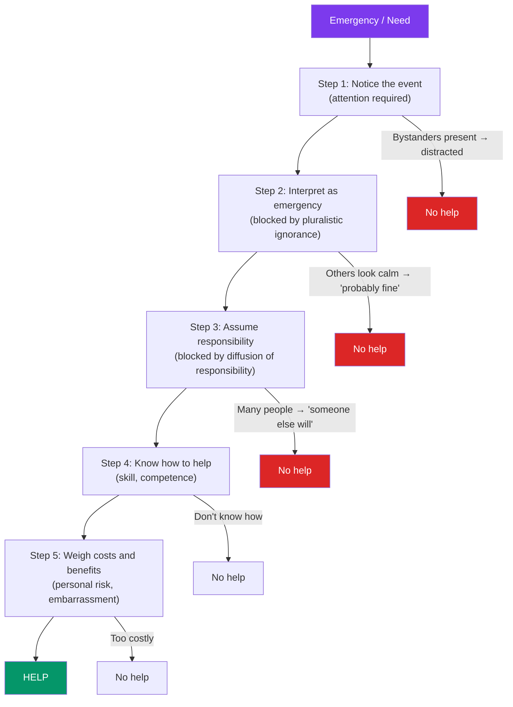

# 🤝 Prosocial Behavior

> [!abstract] TL;DR
> Prosocial behavior encompasses actions that benefit others — helping, sharing, donating, cooperating. The classic puzzle is altruism: why do people help strangers at personal cost? Evolutionary explanations (kin selection, reciprocal altruism) account for much, but humans also help non-kin strangers, suggesting additional psychological mechanisms. The **bystander effect** is the field's signature finding: the more people present in an emergency, the less likely any individual is to help — not because of apathy but because of two identifiable psychological processes.

## Intuition — analogy FIRST

Imagine a fire alarm in an office building. If you're the only person in the building and the alarm sounds, you immediately evacuate. If you're in a room with 30 colleagues and the alarm sounds, you look around — nobody else seems alarmed, so maybe it's a drill. You stay seated. Meanwhile, each of your 29 colleagues is doing exactly the same calculation, looking at you for cues.

This is the bystander effect — and it is not apathy. It is a rational, understandable social process that produces an irrational, dangerous outcome. Pluralistic ignorance (everyone looks calm, so it must be fine) and diffusion of responsibility (someone else will call 911) together prevent helping even when everyone present would have helped alone.

The solution — breaking the spell of pluralistic ignorance — requires only one person to act. This is why emergency preparedness training teaches: *point at a specific person* and say "You in the red shirt — call 911."

---

## How It Works

## Key Concepts / Details

### The Bystander Effect (Darley & Latané, 1968)

Sparked by the murder of **Kitty Genovese** (1964) — news reports (later disputed) claimed 38 witnesses watched and did nothing while she was stabbed to death. John Darley and Bibb Latané designed an experimental paradigm.

**Classic experiment**: participants believed they were in a group discussion via intercom. A confederate suffered an apparent epileptic seizure. When participants thought they were the only witness, 85% helped within 60 seconds. When five others were present, only 31% helped.

**Two mechanisms**:

| Mechanism | Description |
|---|---|
| **Pluralistic ignorance** | Everyone is privately unsure, but observes others appearing calm → "the group seems unconcerned, so I shouldn't be either" |
| **Diffusion of responsibility** | Each person believes someone else will take action; as group size increases, individual responsibility decreases proportionally |

**The 5-step model** (Latané & Darley):
1. Notice the event
2. Interpret it as an emergency
3. Assume personal responsibility
4. Know how to help
5. Decide to help

Failure at any step → no help. Most failures occur at steps 2 and 3.

### Evolutionary Explanations for Helping

**Kin selection** (Hamilton, 1964): helping relatives increases the probability that shared genes are passed on. "Inclusive fitness" — genes survive in nieces, nephews, and offspring. Predicts help declines with genetic distance.

**Reciprocal altruism** (Trivers, 1971): helping non-kin can be adaptive if the helped party is likely to reciprocate in the future. Explains cooperation in repeated interactions; sustained by the "tit-for-tat" strategy in iterated prisoner's dilemma.

**Limitations**: these theories explain why helping tendencies evolved, but humans help anonymous strangers in one-shot encounters with no expectation of reciprocity — suggesting additional psychological mechanisms.

**Empathy and moral emotion**: humans have strong empathic responses that motivate helping independent of genetic relatedness or reciprocity. Violation of fairness norms (in the ultimatum game) produces disgust and rejection of profitable offers. See [[Behavioral_Economics_Psychology]].

### Factors That Increase Helping

| Factor | Effect |
|---|---|
| **Similarity** | We help those similar to us more |
| **Attractiveness** | Physical attractiveness increases help received |
| **Good mood** | Good moods increase helping (Isen & Levin, 1972) |
| **Feeling guilty** | Guilt increases prosocial behavior (inconsistency motivation) |
| **Observing helping models** | Especially in children |
| **Rural vs. urban** | Higher helping in less dense environments (stimulus overload theory) |
| **Low cost** | Lower personal cost → more help |
| **Expertise match** | Helping when you have relevant skills |

**Isen & Levin's "dime in the phone booth"**: subjects who found a dime in a payphone were vastly more likely to help a confederate drop papers (87% vs. 4%). Mood matters enormously.

### Empathy and the Empathy-Altruism Hypothesis

**C. Daniel Batson's empathy-altruism hypothesis** (1981): when we feel *empathic concern* (other-focused, compassionate concern) for another, we are motivated by genuinely altruistic motives — helping because we care about their welfare, not to reduce our own distress.

Alternative: all helping is egoistic — we help to reduce our own empathic distress.

**Batson's experiments**: participants who felt high empathy for a suffering person helped even when escape was easy (they could leave without helping) — suggesting the motivation was genuinely other-directed. Low-empathy subjects only helped when escape was difficult.

**"Identifiable victim effect"** (Slovic): people donate more to a single identified victim ("little Maria, 7 years old, needs $300") than to "3 million starving people." Individual identifiable victims engage empathic mechanisms; statistical lives don't.

### Social Exchange Theory

Helping is exchanged based on costs and benefits:
- **Altruism as investment**: even apparently selfless helping may involve expected reciprocity, reputation enhancement, or mood management
- **Social norms**: **reciprocity norm** (help those who helped you) and **social responsibility norm** (help those who depend on you) create socialized obligations
- **Costs matter**: volunteering time is costly; clicking "donate" is cheap. Behavioral economics of charitable giving uses commitment devices, defaults, and social proof.

### Cooperation and the Prisoner's Dilemma

The prisoner's dilemma formalizes the tension between individual and collective rationality. See [[Game_Theory]].

- **Iterated prisoner's dilemma**: over repeated interactions, cooperative strategies (especially tit-for-tat) outperform defection
- **Social dilemmas**: individual rational choice leads to collective catastrophe (tragedy of the commons). Solved by: communication, norm establishment, group identity, punishment of defectors

## Real-World Notes

- **Emergency training**: "Stop. Look. Act." protocols explicitly train people through Latané & Darley's five steps. Specific training ("call 911") addresses competence barriers.
- **Charitable giving**: identifiable victim effect, social proof ("1 million donors"), and commitment devices all increase charitable donations. Default giving in payroll programs massively increases participation.
- **Volunteering**: public commitment to volunteer, social norms among peer groups, and moral identity activation all predict follow-through. Abstract "caring" rarely produces behavior; specific commitments do.
- **Organizational citizenship behavior (OCB)**: prosocial behavior in workplaces — helping colleagues, going beyond formal role requirements. Predicted by job satisfaction, perceived fairness, and leadership modeling. See [[Organizational_Psychology]].

## Common Pitfalls

- **"The 38 witnesses did nothing to Kitty Genovese"** — the original press account was substantially inaccurate; some did intervene, and many did not have clear views of what was happening. The bystander effect is real and robust, but the Genovese case was misreported.
- **"People help because they're good people / don't help because they're bad"** — the bystander effect operates through situation (group size, ambiguity), not character. Labeling non-helpers as apathetic prevents understanding and prevention.
- **"More empathy always = more helping"** — empathic distress (self-focused concern about one's own discomfort at another's suffering) can lead to withdrawal rather than helping. Empathic *concern* (other-focused) predicts helping; empathic *distress* predicts avoidance.

## Related Concepts

- [[_MOC_Social_Psychology|↑ Section MOC]]
- [[Group_Dynamics]] — Diffusion of responsibility is a group dynamics phenomenon
- [[Moral_Development]] — Kohlberg's stages frame helping as moral reasoning
- [[Happiness_and_Wellbeing]] — Helping others is a robust predictor of well-being (helper's high)
- [[Prejudice_and_Discrimination]] — Inter-group helping: we help in-group more; prejudice decreases helping out-group
- Cross-vault: [[Behavioral_Economics_Psychology]] — Prosocial behavior in economic games; nudging charitable giving

## Review Questions

1. Darley and Latané found that having more bystanders *reduces* helping. Name the two psychological mechanisms they identified, explain each one, and describe a specific intervention that would address each.
2. Batson argues that some helping is genuinely altruistic (not egoistic). What experimental design would distinguish altruistic motivation from egoistic distress reduction? What did he find?
3. Why do people donate to "little Maria" but not to "3 million starving people"? What psychological mechanisms underlie the identifiable victim effect, and how can charities use this ethically?

## Sources

- Latané, B. & Darley, J. (1970). *The Unresponsive Bystander: Why Doesn't He Help?*
- Batson, C.D. (1991). *The Altruism Question*. Erlbaum
- Hamilton, W.D. (1964). "The genetical evolution of social behaviour." *Journal of Theoretical Biology*
- Slovic, P. (2007). "If I look at the mass I will never act." *Judgment and Decision Making*

#psychology #social-psychology #prosocial #altruism #bystander-effect
