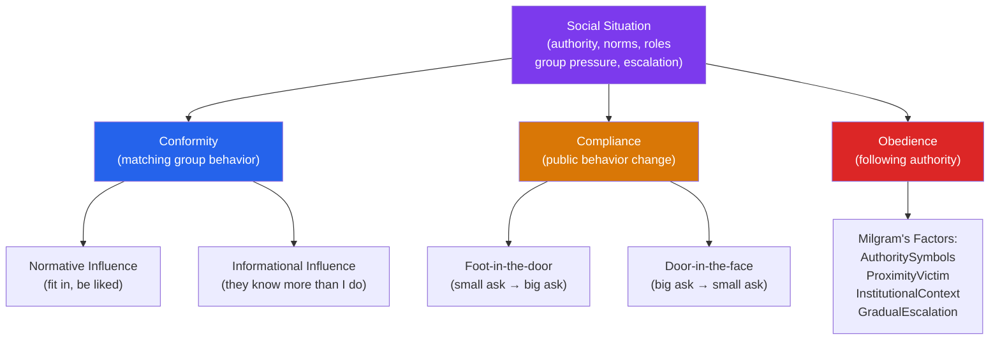

# 👥 Social Influence and Conformity

> [!abstract] TL;DR
> Social influence is the process by which people affect others' thoughts, feelings, and behaviors. The defining finding of 20th-century social psychology — replicated in Milgram's obedience studies, Asch's conformity experiments, and Zimbardo's Stanford Prison Experiment — is that ordinary, good people will do extraordinary, harmful things under the right situational pressures. **Situationism** holds that behavior is explained more by context than by character, contradicting the everyday assumption that "good people do good things."

## Intuition — analogy FIRST

Imagine you're a new employee on your first week. Your manager asks you to edit a report in a way you think is misleading, but not quite dishonest. You comply — it's the first week. Two months later, you're asked to do something more borderline. You've already established a pattern of compliance; the gap between your current ask and the last one is small. A year later, you're doing things you would have refused categorically on your first day.

This is the **foot-in-the-door** technique, escalation, and normalization — the same psychological mechanisms that explain how ordinary Germans participated in atrocities, why good doctors in hospitals order unnecessary procedures when senior colleagues request them, and why whistleblowing is so rare.

The lesson is not that humans are monsters. It is that situation shapes behavior more powerfully than we intuitively believe — which is both frightening and hopeful (change the situation, change the behavior).

---

## How It Works

## Key Concepts / Details

### Asch Conformity Experiments (1951–1956)

Solomon Asch seated participants with confederates and asked them to judge line lengths — an unambiguous perceptual task with an obvious correct answer.

**Results**: 75% of participants conformed on at least one trial; 32% of all responses were conformist (wrong). Why?

| Factor | Effect on Conformity |
|---|---|
| Group unanimity | One dissenter drops conformity dramatically |
| Group size | Conformity rises up to ~3–4 members, then plateaus |
| Task difficulty/ambiguity | Higher ambiguity → more conformity |
| Public vs. private response | Conformity drops with private written responses |
| Cultural variation | Higher in collectivist cultures |

**Normative vs. informational influence**:
- **Normative**: conform to be liked/accepted (even when privately disagreeing)
- **Informational**: conform because others' judgments are evidence about reality (especially in ambiguous situations)

Asch's participants often knew the answer was wrong but conformed anyway — normative influence at work.

### Milgram Obedience Studies (1961–1963)

Stanley Milgram's paradigm: participants were told to administer electric shocks to a "learner" (confederate) as punishment for wrong answers, in increments up to 450V (labeled "XXX — Danger").

**Results**: 65% of participants delivered the maximum 450V when the experimenter (in lab coat) calmly instructed "Please continue."

**Factors affecting obedience**:

| Factor | Direction |
|---|---|
| Experimenter's physical presence | Higher presence → more obedience |
| Victim's proximity | Closer victim → less obedience |
| Institutional legitimacy | Yale setting → higher than rundown office |
| Gradual escalation | Small increments made it hard to stop |
| Diffusion of responsibility | When two confederate teachers present, compliance higher |
| Peer disobedience | Another "participant" refusing reduced obedience to 10% |

**Interpretations**: Milgram proposed an "**agentic state**" — entering an employee-like mode where one sees oneself as an agent of authority, surrendering personal responsibility. Critics emphasize the institutional context and legitimate authority's power.

**Ethical legacy**: Milgram's studies created current IRB requirements for informed consent, right to withdraw, and debriefing. The findings were replicated at lower maximum voltages (Jerry Burger, 2009).

### Stanford Prison Experiment (Zimbardo, 1971)

Philip Zimbardo assigned participants to "guard" or "prisoner" roles in a simulated prison. The study was halted after 6 days (planned for 2 weeks): guards became increasingly cruel and sadistic; prisoners became passive and depressed.

**Zimbardo's conclusion**: **situational forces** (roles, symbols of power, dehumanization, anonymity) can override individual character within days.

**Critiques** (significant):
- Zimbardo as superintendent played an active role in encouraging guard cruelty
- Ben Blum (2018) found recording evidence that Zimbardo's assistant coached guards to be tough
- Selection bias: participants who selected "prison study" may have had relevant traits
- The study has limited replicability and methodological problems

**Legacy**: remains influential as a parable about situational power and institutional accountability, despite methodological concerns. The Abu Ghraib analogy is regularly cited.

### Types of Social Influence

| Type | Definition | Example |
|---|---|---|
| **Conformity** | Changing behavior/beliefs to match a group | Laughing at a joke you don't find funny |
| **Compliance** | Changing behavior in response to explicit request | Buying extended warranty when upsold |
| **Obedience** | Following an authority's direct command | Following a doctor's prescription |
| **Persuasion** | Attitude change through communication | Advertising changing product preference |

### Compliance Techniques

| Technique | Mechanism | Example |
|---|---|---|
| **Foot-in-the-door** | Small commitment → large request | Signing a petition → donating money |
| **Door-in-the-face** | Large request → refusal → smaller request | Ask for $500 → accept $50 |
| **Low-ball** | Get commitment → reveal true cost | Car dealer agrees on price, then adds fees |
| **Scarcity** | "Limited time offer" | Amazon's "Only 2 left in stock" |

### Minority Influence

Majorities produce compliance through normative influence; **minorities** can produce genuine attitude change through **consistency**, **confidence**, and **flexibility** (Moscovici, 1976).

A persistent, consistent minority signals that the issue has merit — this prompts deeper processing (informational influence). Gay rights movement, civil rights movement: minority positions that became majority positions through sustained, consistent advocacy.

## Real-World Notes

- **Organizations**: Milgram dynamics occur in corporate settings — employees rationalize unethical actions when authorized by leadership. Whistleblower protections and ethics hotlines are structural responses.
- **Safety culture**: healthcare and aviation use checklists and "stop-work authority" to counter obedience to hierarchy in time-critical situations. Any crew member can halt a procedure.
- **Marketing**: foot-in-the-door and low-ball are explicitly used in sales training. Recognizing them allows consumers to reset and reconsider commitments.
- **Cult dynamics**: recruitment through gradual escalation, social isolation (reducing dissenters), and authority legitimation — exactly Milgram's factors, operating over months.

## Common Pitfalls

- **"I would have refused Milgram's experimenter"** — ~65% of participants said the same thing before the study. Predicting our own behavior in social situations is systematically overoptimistic (the "fundamental attribution error" applied to ourselves).
- **"The Stanford Prison Experiment proves people turn evil in power roles"** — the methodological critiques are serious. A better lesson: institutions can normalize cruelty; roles provide moral cover; structured oversight matters.
- **Confusing normative and informational influence** — they produce different outcomes. Normative compliance is public but shallow (private disagreement); informational influence produces genuine belief change.

## Related Concepts

- [[_MOC_Social_Psychology|↑ Section MOC]]
- [[Attitudes_and_Persuasion]] — How compliant behavior changes underlying attitudes (cognitive dissonance)
- [[Group_Dynamics]] — How group membership amplifies conformity pressures
- [[Prejudice_and_Discrimination]] — Conformity to prejudiced group norms
- [[Moral_Development]] — Kohlberg's stages and why authority compliance is a lower moral level
- [[Organizational_Psychology]] — Obedience dynamics in workplaces; ethical leadership

## Review Questions

1. In Milgram's study, the key independent variables were experimenter presence, victim proximity, and institutional setting. Explain why each of these affected obedience, and what psychological mechanism each engages.
2. Compare normative and informational social influence. Give an example of each, and explain why informational influence is more likely to produce genuine (not just public) attitude change.
3. You are designing an organizational ethics program. Using Milgram's findings, identify three structural features of organizations that increase the risk of unethical compliance, and propose a specific counter-measure for each.

## Sources

- Stanley Milgram, *Obedience to Authority* (1974)
- Solomon Asch (1951). "Effects of group pressure upon the modification and distortion of judgments." In H. Guetzkow (Ed.), *Groups, Leadership and Men*
- Philip Zimbardo, *The Lucifer Effect* (2007)
- Moscovici, S. (1976). *Social Influence and Social Change*. Academic Press

#psychology #social-psychology #conformity #obedience #milgram #asch
