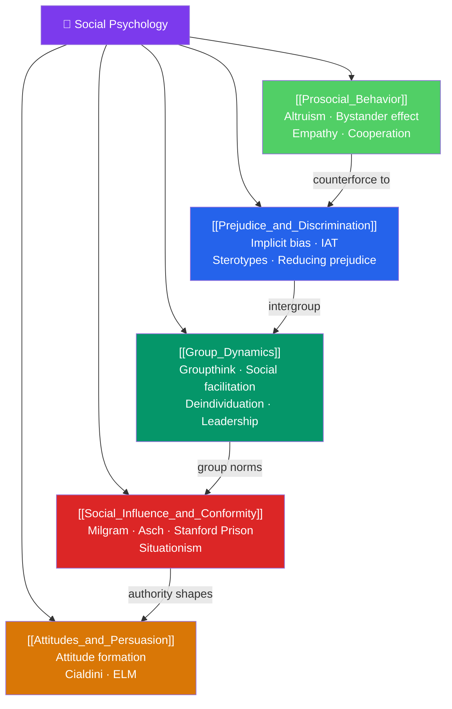

# 🗺️ Social Psychology — Map of Content

> [!abstract] What This Section Covers
> Social psychology examines how individuals think, feel, and behave in the presence of others — real, imagined, or implied. Five notes span the core domains: **social influence and conformity** (Milgram obedience, Asch conformity, how authority and situation overpower character), **attitudes and persuasion** (how attitudes form and change; Cialdini's influence principles), **group dynamics** (groupthink, social facilitation, deindividuation), **prejudice and discrimination** (stereotype formation, implicit bias, reducing prejudice), and **prosocial behavior** (altruism, bystander effect, factors promoting helping). Together they reveal the power of social context — often underestimated — over individual behavior.

## Concept Map

## Learning Path

1. [[Social_Influence_and_Conformity]] — Milgram, Asch, Stanford Prison: the shocking power of situation over character.
2. [[Attitudes_and_Persuasion]] — How attitudes form, when they predict behavior, and how they change.
3. [[Group_Dynamics]] — Groupthink, polarization, social facilitation, and the psychology of leadership.
4. [[Prejudice_and_Discrimination]] — Stereotype formation, implicit bias, contact hypothesis, and evidence-based interventions.
5. [[Prosocial_Behavior]] — Why people help (and fail to help): bystander effect, empathy, cooperation.

## All Notes at a Glance

| Note | Difficulty | What You'll Learn |
|------|------------|-------------------|
| [[Social_Influence_and_Conformity]] | Intermediate | Conformity (Asch), obedience (Milgram), Stanford Prison, situationism, normative vs. informational influence |
| [[Attitudes_and_Persuasion]] | Intermediate | Attitude components, formation, cognitive dissonance, ELM, Cialdini's six principles |
| [[Group_Dynamics]] | Intermediate | Social facilitation/loafing, deindividuation, groupthink, group polarization, leadership styles |
| [[Prejudice_and_Discrimination]] | Intermediate | Stereotype threat, implicit bias, IAT, in-group/out-group effects, contact hypothesis |
| [[Prosocial_Behavior]] | Intermediate | Bystander effect, diffusion of responsibility, altruism, empathy, kin selection vs. reciprocity |

## Key Questions This Section Answers

- Would you have obeyed Milgram's experimenter? What factors actually determine obedience?
- Why do intelligent groups make terrible decisions? What is groupthink and how do you prevent it?
- Is implicit bias measured by the IAT a reliable predictor of discriminatory behavior?
- Why did nobody help Kitty Genovese? What does the bystander effect actually say?
- How does cognitive dissonance change attitudes?

## Related Sections

- [[_MOC_Psychology_Master|↑ Psychology Master MOC]]
- [[_MOC_Cognitive_Psychology|← Cognitive Psychology]] — Cognitive biases in social judgment
- [[_MOC_Developmental_Psychology|→ Developmental Psychology]] — Moral development and socialization
- [[_MOC_Clinical_Applied|→ Clinical & Applied]] — Organizational and therapeutic applications

#MOC #Psychology #SocialPsychology
