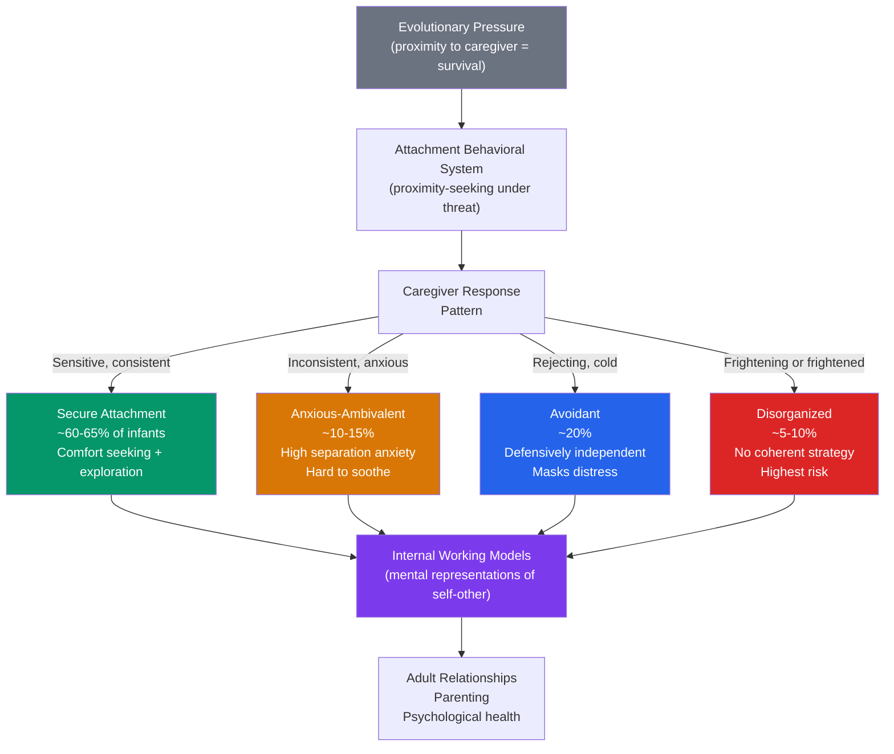

# 🤱 Attachment Theory

> [!abstract] TL;DR
> Attachment is an evolved emotional bond between infant and caregiver that functions as a secure base for exploration and a safe haven under stress. John Bowlby established the theory's evolutionary and biological grounding. Mary Ainsworth's Strange Situation identified four attachment styles: secure, anxious-ambivalent, avoidant, and disorganized. These early patterns create **internal working models** — mental representations of self and others in relationships — that influence romantic relationships, parenting, and psychological health throughout life.

## Intuition — analogy FIRST

Think of the caregiver as a home base in a game of tag.

A **securely attached** child uses the caregiver as base — confidently explores the playground, occasionally checks back for reassurance, and returns easily when scared. The base is reliably there, so the child can afford to be adventurous.

An **anxiously attached** child clings to the base — reluctant to explore, panics if the caregiver moves away, is hard to comfort when she returns. The base has been unreliable; the child compensates by staying close.

An **avoidantly attached** child ignores the base — roams freely but never checks in, doesn't seek comfort when hurt. The child learned that showing need leads to rejection; independence is a defensive strategy.

A **disorganizedly attached** child has no coherent strategy — alternately clings and pushes away, seems frozen or confused. The caregiver is simultaneously the source of safety and the source of fear.

These patterns don't just describe children on a playground — they describe adults in romantic relationships, in therapy offices, and in response to organizational change.

---

## How It Works

## Key Concepts / Details

### Bowlby's Evolutionary Foundation

John Bowlby (1907–1990) proposed that attachment evolved because infants who stayed close to caregivers survived better than those who didn't. Key elements:

- **Attachment behavioral system**: a biological system (like hunger or sex) activated by perceived threats and satisfied by proximity to the attachment figure
- **Safe haven**: caregiver as refuge under threat (fear, pain, illness)
- **Secure base**: caregiver as launchpad for exploration when not threatened
- **Separation anxiety**: protest behavior when attachment figure is unavailable — evolved to signal need and trigger caregiver response

Bowlby rejected the behaviorist view that attachment develops because caregivers provide food (secondary drive theory). Harlow's wire vs. cloth mother experiments (1958): infant monkeys chose the cloth "mother" even when only the wire mother provided food — contact comfort, not feeding, drives attachment.

### Ainsworth's Strange Situation (1970)

Mary Ainsworth developed a standardized laboratory procedure to observe attachment:

| Episode | What Happens |
|---|---|
| 1 | Mother and infant in room with toys |
| 2 | Stranger enters |
| 3 | Mother leaves, stranger present |
| 4 | Mother returns (first reunion) |
| 5 | Mother leaves, infant alone |
| 6 | Stranger returns |
| 7 | Mother returns (second reunion) |

Key behavioral measures: exploration during play, distress during separation, response to reunion.

| Style | Behavior | Prevalence | Caregiver Pattern |
|---|---|---|---|
| **Secure (B)** | Uses caregiver as base; distressed at separation; comforted at reunion; returns to play | 60–65% | Sensitively responsive to infant signals |
| **Anxious-Ambivalent (C)** | Clingy; intense distress at separation; angry and hard to soothe at reunion; little exploration | 10–15% | Inconsistently responsive; sometimes intrusive |
| **Avoidant (A)** | Little distress at separation; ignores or avoids caregiver at reunion | ~20% | Consistently rejecting or dismissive of distress |
| **Disorganized (D)** | No coherent strategy; fear/freeze responses; contradictory approach-avoidance | 5–10% | Frightening, abusive, or severely neglecting |

**Disorganized** is the "fright without solution" pattern — the attachment figure is simultaneously the source of safety and the source of fear. Associated with maltreatment, unresolved parental trauma. Strong predictor of later psychopathology.

### Internal Working Models

Bowlby's cognitive-affective concept: based on attachment experiences, infants develop **internal working models (IWMs)** — mental representations of:
- Self: "Am I worthy of love and care?"
- Others: "Are others reliable and responsive?"

These models are implicit, early-formed, and tend to persist — shaping expectations about relationships without conscious awareness.

| Model | Self-view | Other-view |
|---|---|---|
| Secure | "I am lovable" | "Others are trustworthy" |
| Anxious | "I am not fully lovable; I must cling" | "Others are unreliable; I may be abandoned" |
| Avoidant | "I am self-sufficient; needs = weakness" | "Others will reject me if I need them" |
| Disorganized | "I am frightening/frightened" | "Others are dangerous and unavailable" |

IWMs are updated through new experience — secure relationships with therapists, romantic partners, or mentors can shift working models (earned security).

### Adult Attachment (Hazan & Shaver, 1987)

Adult romantic attachment mirrors infant attachment patterns:
- **Secure**: comfortable with intimacy and interdependence; manage distress effectively
- **Anxious-preoccupied**: fear abandonment; need validation; hyperactivating strategies (clinging, protest)
- **Dismissive-avoidant**: value self-sufficiency; deactivating strategies (emotional distancing)
- **Fearful-avoidant** (disorganized): desire intimacy but fear rejection; simultaneously approach and avoid

**Measured by** Adult Attachment Interview (AAI — narrative coherence of discussion of childhood attachment), or self-report scales (ECR — Experiences in Close Relationships).

**Stability**: attachment style shows moderate continuity from infancy to adulthood (r ~ .30–.40), moderated by life events. Significant relationship disruptions (divorce, loss) can shift styles.

### Consequences of Attachment Security

**Developmental outcomes of secure attachment**:
- Better emotion regulation
- Greater social competence
- Higher cognitive exploration
- Better academic achievement
- More resilient to stress
- Lower rates of anxiety and depression

**Early deprivation — Bowlby's work**: children raised in institutions with adequate physical care but no consistent caregiver ("hospitalism") showed profound intellectual and emotional deficits. Later research (Romanian orphan studies) showed children adopted after age 2 showed improvements but ongoing difficulties in attention, social cognition, and emotional regulation.

**Critical period?**: there is a sensitive period for attachment (roughly 0–3 years), but "critical" overstates it. Quality of subsequent care matters; adopted children show significant gains with sensitive adoptive parents.

## Real-World Notes

- **Therapy**: attachment-based therapies (EMDR, schema therapy) explicitly work with IWMs — correcting early relational templates through the therapeutic relationship itself as a "corrective emotional experience."
- **Parenting programs**: "Circle of Security" is an attachment-based parenting intervention that explicitly teaches caregivers to be a safe haven and secure base. Effective for insecure parents in reducing disorganized attachment.
- **Childcare policy**: quality of attachment to childcare providers matters; caregiver sensitivity and stability are the key factors, not time spent in care per se.
- **Organizational behavior**: attachment theory has been extended to leader-follower relationships. Secure leaders are more likely to support employee autonomy; anxious leaders micromanage; avoidant leaders are emotionally unavailable. See [[Organizational_Psychology]].

## Common Pitfalls

- **"Secure attachment requires a perfect mother"** — Ainsworth's key variable was "sensitive responsiveness," not perfect attunement. Rupture and repair are normal; what matters is that repair happens.
- **"Insecure attachment is irreversible"** — IWMs are update-able. Adult secure attachments, therapy, and parenting support all create "earned security." Early experience is influential but not deterministic.
- **"Mothers always do the primary attachment"** — attachment forms with any consistently responsive caregiver — fathers, grandparents, adoptive parents. Multiple attachments (hierarchically organized) are normal.

## Related Concepts

- [[_MOC_Developmental_Psychology|↑ Section MOC]]
- [[Lifespan_Development]] — Erikson's first crisis (trust vs. mistrust) maps directly onto attachment
- [[Biological_Basis_of_Behavior]] — Oxytocin, cortisol, and HPA axis as biological substrates of attachment
- [[Stress_and_Coping]] — Attachment security predicts cortisol reactivity and emotion regulation
- [[Psychological_Disorders_Overview]] — Reactive Attachment Disorder (RAD) and BPD both involve attachment disruption
- [[Cognitive_Behavioral_Therapy]] — Schema therapy targets core beliefs rooted in IWMs

## Review Questions

1. What is an "internal working model" and how does it develop? Give an example of how a dismissive-avoidant attachment style in childhood might manifest in adult romantic relationships.
2. Why is the disorganized attachment pattern considered the most clinically significant? What caregiver patterns typically produce it, and what are the long-term developmental risks?
3. Harlow's wire/cloth mother experiment was ethically impossible to do with humans — how did Bowlby's "separation from hospitalized children" observations and Ainsworth's Strange Situation together build the evidence base for attachment theory?

## Sources

- John Bowlby, *Attachment and Loss*, Vol. 1 (1969)
- Ainsworth, M.D.S. et al. (1978). *Patterns of Attachment*. Erlbaum
- Hazan, C. & Shaver, P. (1987). "Romantic love conceptualized as an attachment process." *JPSP*
- Main, M. & Solomon, J. (1990). "Procedures for identifying infants as disorganized/disoriented." In *Attachment in the Preschool Years*

#psychology #developmental-psychology #attachment #bowlby #ainsworth
